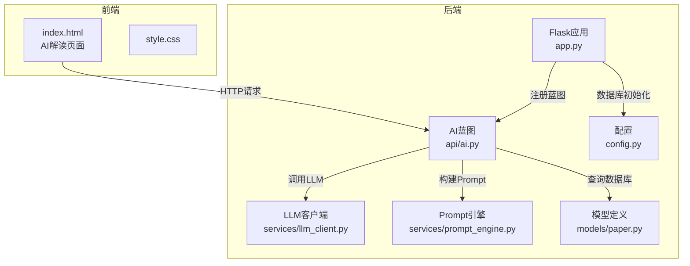
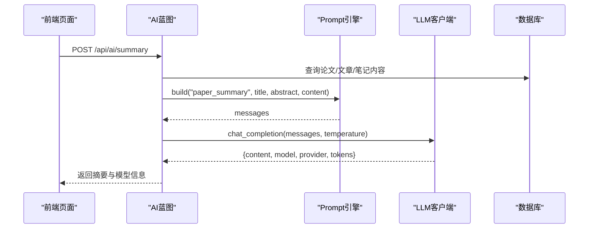
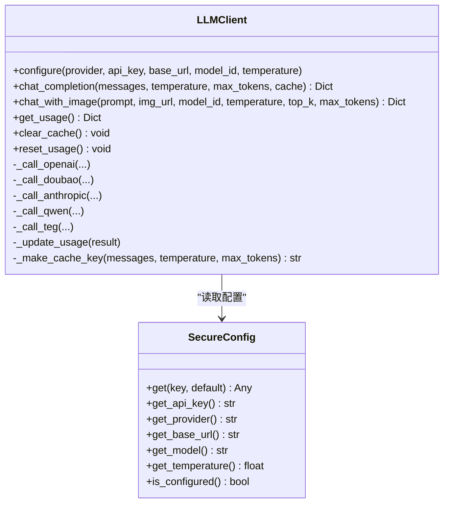
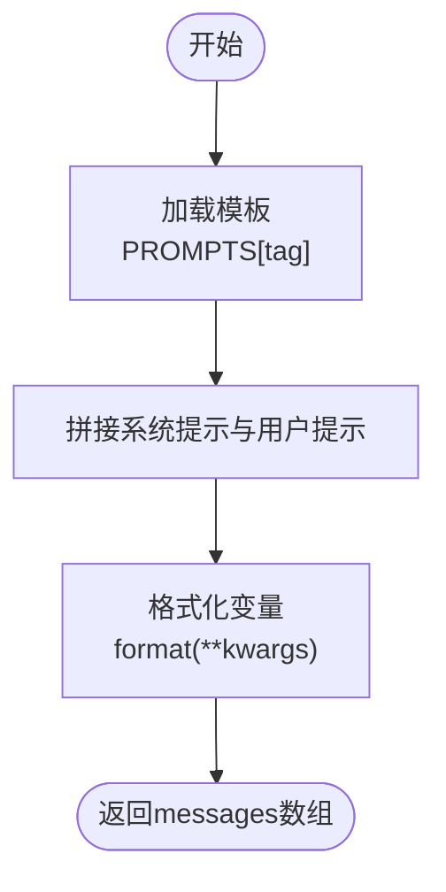
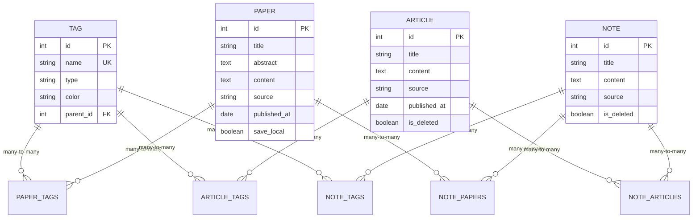
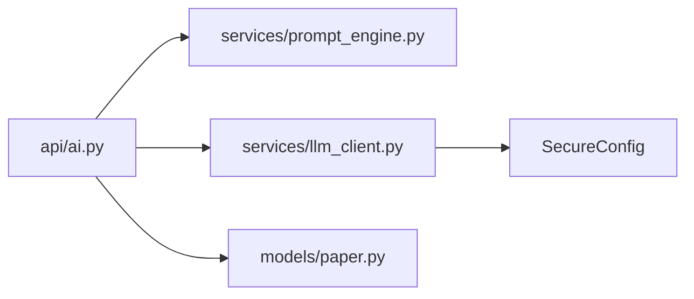

# AI功能集成

<cite>
**本文档引用的文件**
- [backend/api/ai.py](file://backend/api/ai.py)
- [backend/services/llm_client.py](file://backend/services/llm_client.py)
- [backend/services/prompt_engine.py](file://backend/services/prompt_engine.py)
- [backend/models/paper.py](file://backend/models/paper.py)
- [backend/config.py](file://backend/config.py)
- [backend/app.py](file://backend/app.py)
- [specs/backend/api/ai.yml](file://specs/backend/api/ai.yml)
- [specs/backend/services/prompt_engine.yml](file://specs/backend/services/prompt_engine.yml)
- [specs/frontend/pages/ai_interpret.yml](file://specs/frontend/pages/ai_interpret.yml)
- [specs/system/global_config.yml](file://specs/system/global_config.yml)
</cite>

## 目录
1. [简介](#简介)
2. [项目结构](#项目结构)
3. [核心组件](#核心组件)
4. [架构总览](#架构总览)
5. [详细组件分析](#详细组件分析)
6. [依赖关系分析](#依赖关系分析)
7. [性能考量](#性能考量)
8. [故障排查指南](#故障排查指南)
9. [结论](#结论)
10. [附录](#附录)

## 简介
本文件面向PaperHub的AI功能集成，系统性阐述大模型客户端的多提供商支持、Prompt工程设计、AI解读流程、标签智能推荐与AI辅助标注、用量统计与安全配置、以及扩展性与未来发展方向。文档同时提供代码级架构图与流程图，帮助开发者快速理解与扩展AI能力。

## 项目结构
PaperHub后端采用Flask框架，AI相关能力集中在独立蓝图模块中，通过统一的LLM客户端封装多家大模型提供商，结合Prompt模板引擎与数据库模型，实现论文AI解读、标签推荐与相关性分析等功能。

图表来源
- [backend/app.py:140-157](file://backend/app.py#L140-L157)
- [backend/api/ai.py:1-288](file://backend/api/ai.py#L1-L288)
- [backend/services/llm_client.py:198-556](file://backend/services/llm_client.py#L198-L556)
- [backend/services/prompt_engine.py:92-109](file://backend/services/prompt_engine.py#L92-L109)
- [backend/models/paper.py:93-146](file://backend/models/paper.py#L93-L146)
- [backend/config.py:85-134](file://backend/config.py#L85-L134)

章节来源
- [backend/app.py:140-157](file://backend/app.py#L140-L157)
- [backend/api/ai.py:1-288](file://backend/api/ai.py#L1-L288)
- [backend/services/llm_client.py:198-556](file://backend/services/llm_client.py#L198-L556)
- [backend/services/prompt_engine.py:92-109](file://backend/services/prompt_engine.py#L92-L109)
- [backend/models/paper.py:93-146](file://backend/models/paper.py#L93-L146)
- [backend/config.py:85-134](file://backend/config.py#L85-L134)

## 核心组件
- AI蓝图（API层）：提供配置、用量统计、摘要生成、标签推荐、相关性分析与缓存清理等接口。
- LLM客户端：统一抽象多家提供商（如OpenAI、豆包、Anthropic、通义千问、TEG），支持配置注入、缓存、用量统计与错误处理。
- Prompt引擎：集中管理模板与变量替换，确保提示词一致性与安全性。
- 数据模型：论文、文章、笔记、标签等实体及多对多关系，支撑AI解读与标签推荐的数据基础。
- 配置系统：数据库连接池、CORS、日志级别等全局配置，保障AI功能运行稳定性。

章节来源
- [backend/api/ai.py:42-288](file://backend/api/ai.py#L42-L288)
- [backend/services/llm_client.py:198-556](file://backend/services/llm_client.py#L198-L556)
- [backend/services/prompt_engine.py:92-109](file://backend/services/prompt_engine.py#L92-L109)
- [backend/models/paper.py:93-146](file://backend/models/paper.py#L93-L146)
- [backend/config.py:85-134](file://backend/config.py#L85-L134)

## 架构总览
AI功能采用“API层-客户端-模板引擎-数据模型”的分层设计，API层负责业务编排与参数校验，客户端负责与外部大模型交互并进行用量统计，模板引擎负责提示词构建，数据模型提供上下文与标签体系。

图表来源
- [backend/api/ai.py:79-139](file://backend/api/ai.py#L79-L139)
- [backend/services/prompt_engine.py:92-109](file://backend/services/prompt_engine.py#L92-L109)
- [backend/services/llm_client.py:247-278](file://backend/services/llm_client.py#L247-L278)

章节来源
- [backend/api/ai.py:79-139](file://backend/api/ai.py#L79-L139)
- [backend/services/prompt_engine.py:92-109](file://backend/services/prompt_engine.py#L92-L109)
- [backend/services/llm_client.py:247-278](file://backend/services/llm_client.py#L247-L278)

## 详细组件分析

### AI蓝图（API层）
- 配置接口：支持设置提供商、API Key、基础URL、模型ID与采样温度；GET接口返回当前配置状态。
- 用量统计：返回累计prompt/completion token用量与估算成本。
- 摘要生成：支持从论文、文章或笔记来源抽取内容，构建摘要提示词并调用LLM，返回结构化摘要。
- 标签推荐：基于现有标签系统与内容预览，输出JSON格式的推荐标签与新建标签建议。
- 相关性分析：对候选内容进行相关性评分与理由说明，返回JSON数组。
- 缓存清理：清空LLM客户端缓存，便于调试与重新评估。

章节来源
- [backend/api/ai.py:42-288](file://backend/api/ai.py#L42-L288)
- [specs/backend/api/ai.yml:1-190](file://specs/backend/api/ai.yml#L1-L190)

### LLM客户端（多提供商统一封装）
- 安全配置管理：优先从环境变量读取，其次从项目根目录.env文件加载，支持LLM_API_KEY、LLM_PROVIDER、LLM_BASE_URL、LLM_MODEL、LLM_TEMPERATURE等键。
- 多提供商适配：内置OpenAI、豆包、Anthropic、通义千问、TEG等调用逻辑，统一返回结构（content、model、provider、tokens）。
- 缓存与用量统计：基于消息与参数生成缓存键，命中则直接返回；调用后更新prompt/completion token与成本统计。
- 错误处理：对API调用异常进行捕获与返回，避免前端崩溃；提供重试与超时控制。
- 图像输入支持：兼容带图片的多模态调用（TEG路径），支持Top-K与最大Token数配置。

图表来源
- [backend/services/llm_client.py:198-556](file://backend/services/llm_client.py#L198-L556)

章节来源
- [backend/services/llm_client.py:18-93](file://backend/services/llm_client.py#L18-L93)
- [backend/services/llm_client.py:198-556](file://backend/services/llm_client.py#L198-L556)

### Prompt引擎（模板与变量替换）
- 模板集：包含paper_summary、auto_tag、related_content、note_summary四类模板，分别对应摘要生成、标签推荐、相关性分析与笔记总结。
- 构建流程：根据模板标识与变量字典，生成系统提示与用户提示组成的messages数组，供LLM调用。
- 安全与截断：模板中对内容长度进行限制，避免超出模型输入上限；对特殊字符进行转义与安全处理。

图表来源
- [backend/services/prompt_engine.py:92-109](file://backend/services/prompt_engine.py#L92-L109)

章节来源
- [backend/services/prompt_engine.py:6-89](file://backend/services/prompt_engine.py#L6-L89)
- [specs/backend/services/prompt_engine.yml:1-18](file://specs/backend/services/prompt_engine.yml#L1-L18)

### 数据模型（论文/文章/笔记/标签）
- 标签系统：Tag实体与Paper、Article、Note之间为多对多关系，支持颜色、类型与父子层级。
- 论文与文章：Paper与Article均包含标题、摘要、内容、来源、发布日期等字段，支持与笔记的双向关联。
- 关系表：paper_tags、note_tags、article_tags、note_papers、note_articles等中间表维护多对多关系。

图表来源
- [backend/models/paper.py:18-87](file://backend/models/paper.py#L18-L87)
- [backend/models/paper.py:93-146](file://backend/models/paper.py#L93-L146)

章节来源
- [backend/models/paper.py:18-87](file://backend/models/paper.py#L18-L87)
- [backend/models/paper.py:93-146](file://backend/models/paper.py#L93-L146)

### 配置与安全
- 环境配置：SecureConfig支持从.env文件与环境变量加载LLM配置，优先级明确，便于CI/CD与容器化部署。
- API Key管理：前端页面在未配置API Key时提示用户先填写配置；后端在调用LLM前进行校验。
- CORS与数据库：全局CORS允许开发环境跨域访问；数据库连接池配置避免并发与锁问题。
- 日志过滤：屏蔽扫描类请求日志，降低噪音。

章节来源
- [backend/services/llm_client.py:18-93](file://backend/services/llm_client.py#L18-L93)
- [specs/frontend/pages/ai_interpret.yml:44-47](file://specs/frontend/pages/ai_interpret.yml#L44-L47)
- [backend/app.py:54-64](file://backend/app.py#L54-L64)
- [backend/config.py:85-134](file://backend/config.py#L85-L134)

## 依赖关系分析
- API层依赖Prompt引擎与LLM客户端，同时通过数据库会话查询Paper/Article/Note与Tag数据。
- LLM客户端依赖请求库与安全配置，内部封装多家提供商的差异。
- Prompt引擎与数据模型相互独立，通过API层耦合。

图表来源
- [backend/api/ai.py:10-39](file://backend/api/ai.py#L10-L39)
- [backend/services/llm_client.py:18-93](file://backend/services/llm_client.py#L18-L93)
- [backend/services/prompt_engine.py:92-109](file://backend/services/prompt_engine.py#L92-L109)
- [backend/models/paper.py:93-146](file://backend/models/paper.py#L93-L146)

章节来源
- [backend/api/ai.py:10-39](file://backend/api/ai.py#L10-L39)
- [backend/services/llm_client.py:18-93](file://backend/services/llm_client.py#L18-L93)
- [backend/services/prompt_engine.py:92-109](file://backend/services/prompt_engine.py#L92-L109)
- [backend/models/paper.py:93-146](file://backend/models/paper.py#L93-L146)

## 性能考量
- 缓存策略：LLM客户端基于消息与参数生成MD5缓存键，命中即返回，显著减少重复调用与成本。
- 输入截断：摘要与标签推荐模板对内容长度进行限制，避免超限导致的失败与高成本。
- 连接池：数据库连接池配置合理，避免并发场景下的锁竞争与超时。
- 超时与重试：LLM调用设置超时与重试，提升稳定性。
- 成本估算：按提供商定价模型计算累计成本，便于预算控制。

章节来源
- [backend/services/llm_client.py:218-278](file://backend/services/llm_client.py#L218-L278)
- [backend/services/llm_client.py:519-535](file://backend/services/llm_client.py#L519-L535)
- [backend/config.py:92-103](file://backend/config.py#L92-L103)

## 故障排查指南
- API Key未配置：前端提示先配置；后端在调用LLM前校验，返回错误信息。
- AI调用失败：捕获异常并返回错误；前端自动重试2次；若仍失败，提示稍后再试。
- 内容不存在：当paper_id对应的Paper/Article/Note不存在时，返回404。
- 缓存命中：前端可选择清空缓存以强制重新调用。
- 超时与网络：LLM调用设置超时，必要时调整提供商与模型参数。

章节来源
- [backend/api/ai.py:114-134](file://backend/api/ai.py#L114-L134)
- [backend/api/ai.py:247-248](file://backend/api/ai.py#L247-L248)
- [backend/services/llm_client.py:373-381](file://backend/services/llm_client.py#L373-L381)

## 结论
PaperHub的AI功能通过清晰的分层设计实现了多提供商支持、Prompt工程标准化与数据驱动的智能推荐。LLM客户端的缓存与用量统计机制有效降低了成本与提升了稳定性；前端页面提供了直观的配置与可视化反馈。未来可在Prompt模板扩展、标签体系智能化、相关性算法优化与可观测性增强等方面持续演进。

## 附录

### API接口定义（摘要）
- 配置AI：POST /api/ai/config（provider, api_key, base_url, model_id, temperature）
- 获取配置：GET /api/ai/config
- 用量统计：GET /api/ai/stats
- 生成摘要：POST /api/ai/summary（paper_id/source/title/abstract/content）
- 标签推荐：POST /api/ai/recommend-tags（paper_id/source/title/abstract/content/existing_tags）
- 相关性分析：POST /api/ai/related（current_id/title/abstract/candidate_ids）
- 清空缓存：POST /api/ai/clear-cache

章节来源
- [specs/backend/api/ai.yml:1-190](file://specs/backend/api/ai.yml#L1-L190)

### 前端页面与事件
- 页面元素：AI配置表单、AI解读面板、智能标签推荐面板、相关性推荐面板、Token用量统计卡片。
- 用户事件：保存配置、生成摘要、实时渲染、保存为笔记、生成标签、生成相关推荐、清空缓存。
- 边界条件：API Key未配置、调用超时、内容截断、缓存命中。

章节来源
- [specs/frontend/pages/ai_interpret.yml:1-48](file://specs/frontend/pages/ai_interpret.yml#L1-L48)