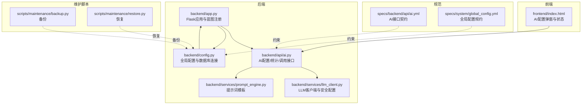
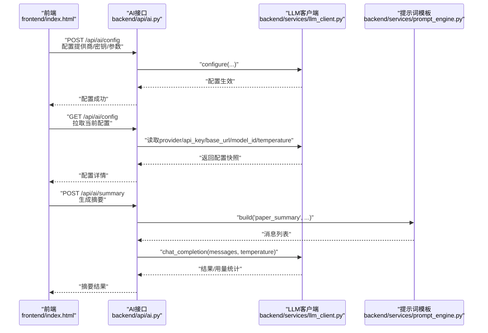
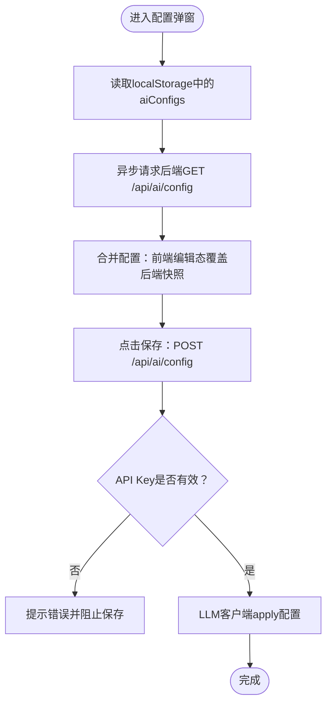
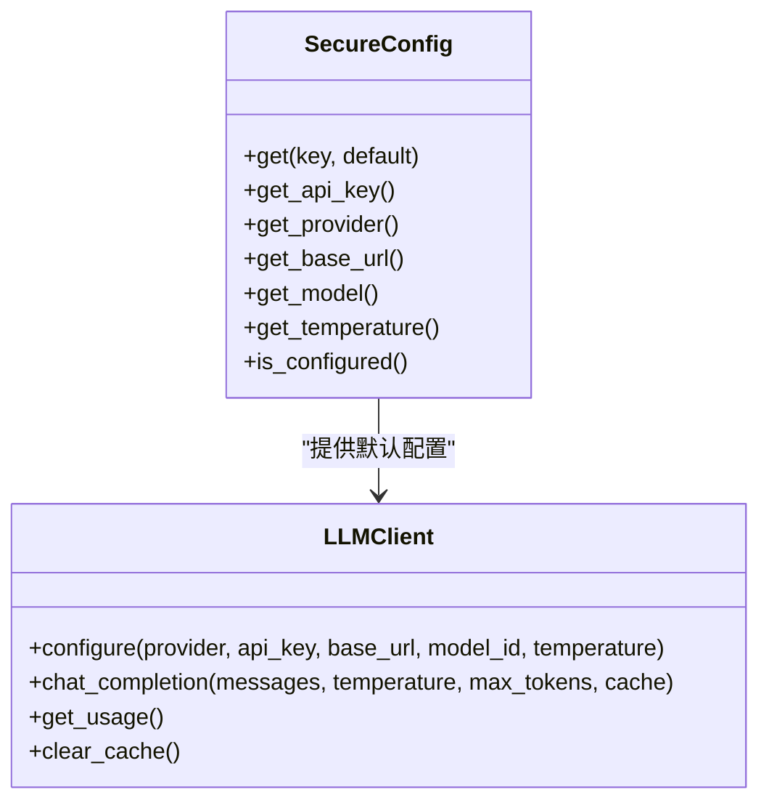
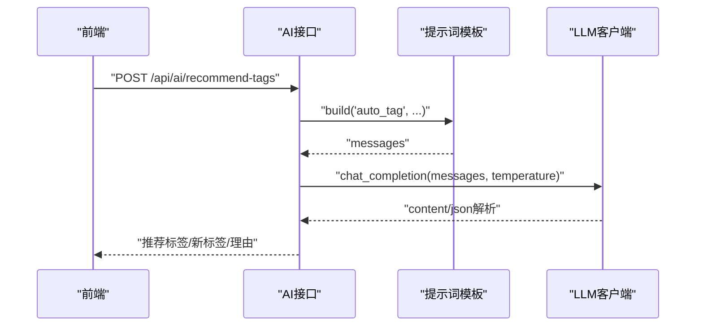
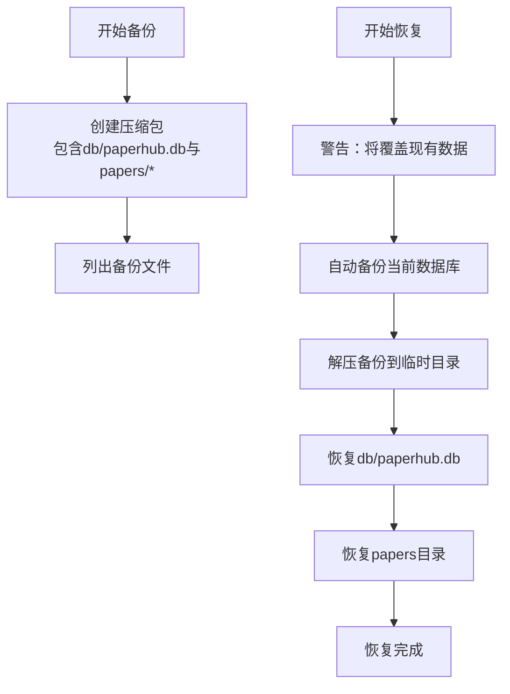
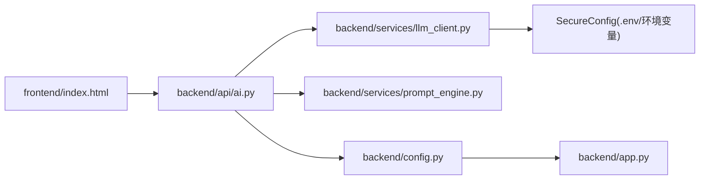

# AI配置管理

<cite>
**本文引用的文件**
- [backend/config.py](file://backend/config.py)
- [backend/app.py](file://backend/app.py)
- [backend/api/ai.py](file://backend/api/ai.py)
- [backend/services/llm_client.py](file://backend/services/llm_client.py)
- [backend/services/prompt_engine.py](file://backend/services/prompt_engine.py)
- [specs/backend/api/ai.yml](file://specs/backend/api/ai.yml)
- [specs/system/global_config.yml](file://specs/system/global_config.yml)
- [scripts/maintenance/backup.py](file://scripts/maintenance/backup.py)
- [scripts/maintenance/restore.py](file://scripts/maintenance/restore.py)
- [frontend/index.html](file://frontend/index.html)
</cite>

## 目录
1. [简介](#简介)
2. [项目结构](#项目结构)
3. [核心组件](#核心组件)
4. [架构总览](#架构总览)
5. [详细组件分析](#详细组件分析)
6. [依赖分析](#依赖分析)
7. [性能考虑](#性能考虑)
8. [故障排查指南](#故障排查指南)
9. [结论](#结论)
10. [附录](#附录)

## 简介
本文件面向PaperHub的AI配置管理，系统性说明AI功能的配置接口设计、提供商切换、API Key管理、参数调整与验证机制；解释安全存储与权限控制策略；文档化配置的持久化存储、热更新与版本管理；并提供配置迁移、备份恢复与故障转移策略及最佳实践与安全注意事项。

## 项目结构
PaperHub采用前后端分离架构，AI配置涉及后端Flask服务、LLM客户端封装、提示词模板、以及前端Vue状态管理与本地存储。关键目录与文件如下：
- 后端
  - 配置与应用入口：backend/config.py、backend/app.py
  - AI接口：backend/api/ai.py
  - LLM客户端与安全配置：backend/services/llm_client.py
  - 提示词模板：backend/services/prompt_engine.py
  - 规范与契约：specs/backend/api/ai.yml、specs/system/global_config.yml
- 维护脚本
  - 备份与恢复：scripts/maintenance/backup.py、scripts/maintenance/restore.py
- 前端
  - 配置弹窗与状态：frontend/index.html

**图表来源**
- [backend/app.py:140-158](file://backend/app.py#L140-L158)
- [backend/api/ai.py:42-76](file://backend/api/ai.py#L42-L76)
- [backend/services/llm_client.py:18-93](file://backend/services/llm_client.py#L18-L93)
- [specs/backend/api/ai.yml:1-190](file://specs/backend/api/ai.yml#L1-L190)
- [specs/system/global_config.yml:1-80](file://specs/system/global_config.yml#L1-80)
- [scripts/maintenance/backup.py:1-121](file://scripts/maintenance/backup.py#L1-L121)
- [scripts/maintenance/restore.py:1-166](file://scripts/maintenance/restore.py#L1-L166)

**章节来源**
- [backend/app.py:140-158](file://backend/app.py#L140-L158)
- [backend/config.py:35-134](file://backend/config.py#L35-L134)
- [backend/api/ai.py:42-76](file://backend/api/ai.py#L42-L76)
- [backend/services/llm_client.py:18-93](file://backend/services/llm_client.py#L18-L93)
- [specs/backend/api/ai.yml:1-190](file://specs/backend/api/ai.yml#L1-L190)
- [specs/system/global_config.yml:1-80](file://specs/system/global_config.yml#L1-L80)
- [scripts/maintenance/backup.py:1-121](file://scripts/maintenance/backup.py#L1-L121)
- [scripts/maintenance/restore.py:1-166](file://scripts/maintenance/restore.py#L1-L166)

## 核心组件
- 配置接口
  - 提供AI配置的增删改查能力，支持提供商切换、API Key、基础URL、模型ID、采样温度等参数调整。
  - 接口契约见specs/backend/api/ai.yml。
- LLM客户端
  - 统一抽象多家提供商（如豆包、OpenAI、Anthropic、通义千问、TEG），内置缓存与用量统计。
  - 安全配置支持从.env文件与环境变量加载，优先级明确。
- 提示词模板
  - 集中管理各类Prompt模板，支持系统提示与用户模板变量替换。
- 前端配置状态
  - Vue响应式状态管理，支持多提供商配置、本地存储持久化与弹窗交互。
- 维护与备份
  - 命令行备份/恢复脚本，备份数据库与论文资源，支持自动备份与交互式恢复。

**章节来源**
- [backend/api/ai.py:42-76](file://backend/api/ai.py#L42-L76)
- [backend/services/llm_client.py:18-93](file://backend/services/llm_client.py#L18-L93)
- [backend/services/prompt_engine.py:92-109](file://backend/services/prompt_engine.py#L92-L109)
- [frontend/index.html:2951-2987](file://frontend/index.html#L2951-L2987)
- [scripts/maintenance/backup.py:47-76](file://scripts/maintenance/backup.py#L47-L76)
- [scripts/maintenance/restore.py:57-123](file://scripts/maintenance/restore.py#L57-L123)

## 架构总览
AI配置管理贯穿“前端配置弹窗 → 后端AI接口 → LLM客户端 → 外部提供商”的链路，同时结合提示词模板与用量统计，形成闭环。

**图表来源**
- [backend/api/ai.py:42-140](file://backend/api/ai.py#L42-L140)
- [backend/services/llm_client.py:235-278](file://backend/services/llm_client.py#L235-L278)
- [backend/services/prompt_engine.py:92-105](file://backend/services/prompt_engine.py#L92-L105)

## 详细组件分析

### 配置接口设计与验证
- 接口清单
  - POST /api/ai/config：配置提供商、API Key、基础URL、模型ID、采样温度
  - GET /api/ai/config：获取当前配置快照（含是否已配置API Key）
  - GET /api/ai/stats：用量统计
  - POST /api/ai/summary：生成摘要
  - POST /api/ai/recommend-tags：智能标签推荐
  - POST /api/ai/related：相关内容关联推荐
  - POST /api/ai/clear-cache：清空缓存
- 参数校验与错误码
  - API Key必填：若缺失，返回400类错误
  - 内容不存在：返回404
  - 外部调用失败：返回500
- 前端交互
  - 配置弹窗支持多提供商配置，编辑态与展示态分离
  - 弹窗打开时先同步加载localStorage，再异步刷新后端配置

**图表来源**
- [frontend/index.html:2980-2987](file://frontend/index.html#L2980-L2987)
- [backend/api/ai.py:42-76](file://backend/api/ai.py#L42-L76)

**章节来源**
- [specs/backend/api/ai.yml:1-190](file://specs/backend/api/ai.yml#L1-L190)
- [backend/api/ai.py:42-140](file://backend/api/ai.py#L42-L140)
- [frontend/index.html:2951-2987](file://frontend/index.html#L2951-L2987)

### 安全配置与存储
- 安全配置来源与优先级
  - .env文件（项目根目录）：首次运行自动生成示例文件
  - 环境变量：覆盖.env文件中的同名键
  - 运行时配置：通过POST /api/ai/config覆盖当前进程内存中的配置
- 存储与持久化
  - 前端：localStorage持久化多提供商配置，清除浏览器数据会丢失
  - 后端：当前进程内存中持有配置；重启后仅保留.env/环境变量配置
- 权限控制
  - 后端未实现细粒度鉴权；建议在生产环境配合反向代理/Nginx限制访问来源
  - CORS在后端全局放开，开发环境使用；生产需收紧

**图表来源**
- [backend/services/llm_client.py:18-93](file://backend/services/llm_client.py#L18-L93)
- [backend/services/llm_client.py:235-278](file://backend/services/llm_client.py#L235-L278)

**章节来源**
- [backend/services/llm_client.py:18-93](file://backend/services/llm_client.py#L18-L93)
- [backend/services/llm_client.py:562-590](file://backend/services/llm_client.py#L562-L590)
- [backend/api/ai.py:42-76](file://backend/api/ai.py#L42-L76)
- [frontend/index.html:2951-2987](file://frontend/index.html#L2951-L2987)

### 提示词模板与调用链
- 提示词模板
  - 集中管理paper_summary、auto_tag、related_content、note_summary等模板
  - 支持system与template变量替换，构建标准化messages
- 调用链
  - 前端触发AI任务 → 后端AI接口 → 提示词模板构建 → LLM客户端统一调用 → 外部提供商 → 结果回传

**图表来源**
- [backend/api/ai.py:142-211](file://backend/api/ai.py#L142-L211)
- [backend/services/prompt_engine.py:92-105](file://backend/services/prompt_engine.py#L92-L105)
- [backend/services/llm_client.py:247-278](file://backend/services/llm_client.py#L247-L278)

**章节来源**
- [backend/services/prompt_engine.py:6-89](file://backend/services/prompt_engine.py#L6-L89)
- [backend/api/ai.py:142-211](file://backend/api/ai.py#L142-L211)

### 配置持久化、热更新与版本管理
- 前端持久化
  - localStorage保存多提供商配置，支持跨会话保留
  - 弹窗打开时先同步localStorage，再异步拉取后端配置，避免时序问题
- 后端持久化
  - 进程内存配置；重启后仅保留.env/环境变量配置
  - 建议通过环境变量或容器注入方式在部署时固化关键配置
- 热更新
  - POST /api/ai/config即时生效于当前进程
  - GET /api/ai/stats可用于监控用量变化
- 版本管理
  - 通过.gitignore排除.env文件，避免敏感配置进入版本库
  - 建议在CI/CD中使用受控的密钥管理服务注入环境变量

**章节来源**
- [frontend/index.html:2980-2987](file://frontend/index.html#L2980-L2987)
- [backend/services/llm_client.py:562-590](file://backend/services/llm_client.py#L562-L590)
- [backend/api/ai.py:73-76](file://backend/api/ai.py#L73-L76)

### 配置迁移、备份恢复与故障转移
- 备份
  - 备份内容：SQLite数据库与论文资源目录
  - 备份位置：data/backups/
  - 命令行工具支持自动命名、自定义名称、列出备份
- 恢复
  - 恢复前自动备份当前数据库
  - 支持交互式选择备份或指定文件恢复
  - 恢复会覆盖现有数据，注意风险提示
- 故障转移
  - 多提供商支持：可在不同提供商间切换
  - 建议在生产环境准备备用API Key与基础URL，结合监控与告警进行自动切换

**图表来源**
- [scripts/maintenance/backup.py:47-76](file://scripts/maintenance/backup.py#L47-L76)
- [scripts/maintenance/restore.py:57-123](file://scripts/maintenance/restore.py#L57-L123)

**章节来源**
- [scripts/maintenance/backup.py:1-121](file://scripts/maintenance/backup.py#L1-L121)
- [scripts/maintenance/restore.py:1-166](file://scripts/maintenance/restore.py#L1-L166)

## 依赖分析
- 组件耦合
  - AI接口依赖LLM客户端与提示词模板
  - LLM客户端依赖安全配置与外部提供商API
  - 前端配置弹窗依赖后端配置接口
- 外部依赖
  - Flask、requests、CORS
  - SQLite与ChromaDB（由全局配置控制）

**图表来源**
- [backend/api/ai.py:10-32](file://backend/api/ai.py#L10-L32)
- [backend/services/llm_client.py:18-93](file://backend/services/llm_client.py#L18-L93)
- [backend/services/prompt_engine.py:92-105](file://backend/services/prompt_engine.py#L92-L105)
- [backend/config.py:35-134](file://backend/config.py#L35-L134)
- [backend/app.py:140-158](file://backend/app.py#L140-L158)

**章节来源**
- [backend/api/ai.py:10-32](file://backend/api/ai.py#L10-L32)
- [backend/services/llm_client.py:18-93](file://backend/services/llm_client.py#L18-L93)
- [backend/services/prompt_engine.py:92-105](file://backend/services/prompt_engine.py#L92-L105)
- [backend/config.py:35-134](file://backend/config.py#L35-L134)
- [backend/app.py:140-158](file://backend/app.py#L140-L158)

## 性能考虑
- 缓存与用量统计
  - LLM客户端内置消息级缓存，减少重复请求
  - 统计prompt_tokens、completion_tokens与费用估算，便于成本控制
- 连接池与数据库
  - 全局SQLAlchemy连接池配置，避免SQLite锁问题
- 前端渲染
  - 弹窗异步加载避免阻塞UI

**章节来源**
- [backend/services/llm_client.py:218-278](file://backend/services/llm_client.py#L218-L278)
- [backend/config.py:85-127](file://backend/config.py#L85-L127)
- [frontend/index.html:2980-2987](file://frontend/index.html#L2980-L2987)

## 故障排查指南
- 配置弹窗显示为空
  - 检查localStorage是否存在aiConfigs
  - 检查后端是否已配置API Key
  - 刷新页面后重试，确保异步加载顺序正确
- API Key缺失
  - 确认.env或环境变量已正确设置
  - 通过POST /api/ai/config提交配置
- 外部调用失败
  - 查看后端错误日志与traceback
  - 检查提供商基础URL与网络连通性
- 备份/恢复失败
  - 确认备份文件存在且可读
  - 恢复前确认当前数据已自动备份

**章节来源**
- [backend/api/ai.py:124-134](file://backend/api/ai.py#L124-L134)
- [scripts/maintenance/restore.py:57-123](file://scripts/maintenance/restore.py#L57-L123)

## 结论
PaperHub的AI配置管理通过“前端弹窗 + 后端接口 + LLM客户端 + 提示词模板”的分层设计，实现了灵活的提供商切换、参数调整与用量统计。结合.env与环境变量的安全配置、localStorage的前端持久化，以及命令行备份/恢复工具，形成了较为完善的配置生命周期管理。建议在生产环境中强化鉴权与网络隔离，并通过CI/CD与密钥管理服务实现安全可控的配置注入与热更新。

## 附录
- 最佳实践
  - 生产环境必须修改默认密钥与关闭调试模式
  - 通过环境变量注入API Key，避免硬编码
  - 使用容器编排时，将敏感配置映射为只读卷
  - 定期备份数据库与论文资源，验证恢复流程
- 安全注意事项
  - .env文件加入.gitignore，禁止提交至版本库
  - 前端localStorage仅作临时持久化，生产环境应结合后端会话与权限体系
  - 在反向代理层限制CORS与访问来源，降低跨站风险