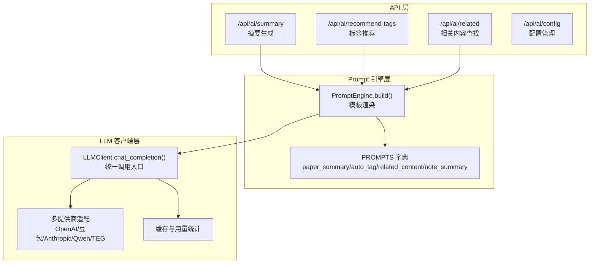
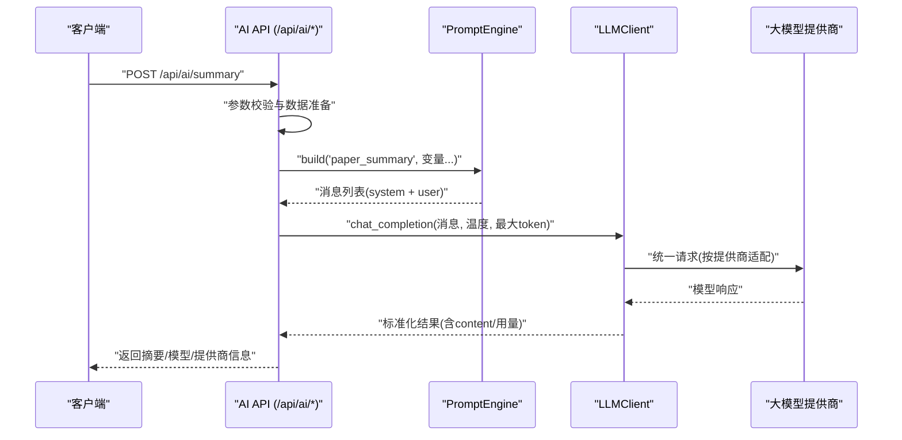
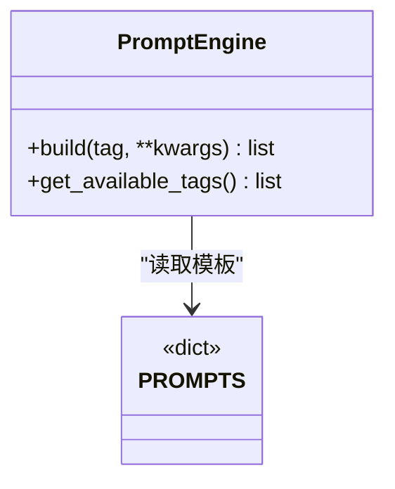
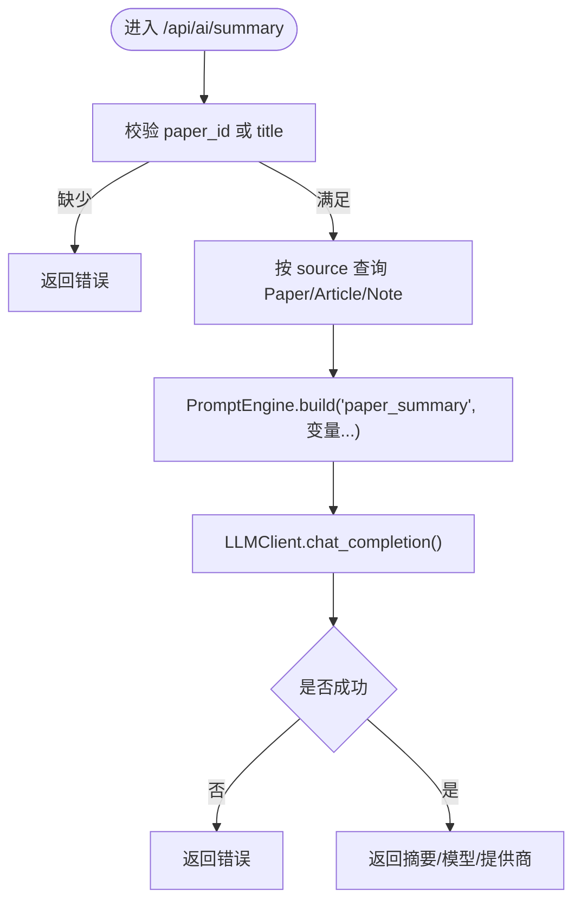
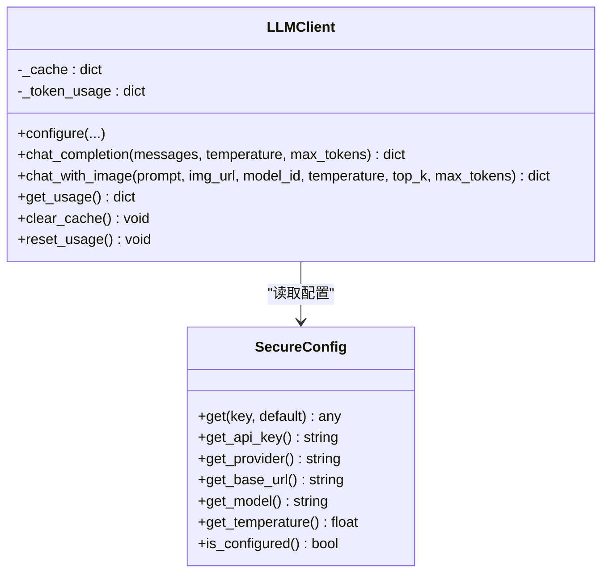
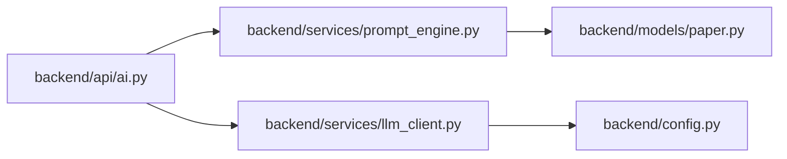

# Prompt工程设计

<cite>
**本文引用的文件**
- [prompt_engine.py](file://backend/services/prompt_engine.py)
- [ai.py](file://backend/api/ai.py)
- [llm_client.py](file://backend/services/llm_client.py)
- [paper.py](file://backend/models/paper.py)
- [ai.yml](file://specs/backend/api/ai.yml)
- [prompt_engine.yml](file://specs/backend/services/prompt_engine.yml)
- [config.py](file://backend/config.py)
- [test_ai_config.py](file://scripts/tests/test_ai_config.py)
- [check_ai_config.html](file://scripts/tests/check_ai_config.html)
</cite>

## 目录
1. [简介](#简介)
2. [项目结构](#项目结构)
3. [核心组件](#核心组件)
4. [架构总览](#架构总览)
5. [详细组件分析](#详细组件分析)
6. [依赖分析](#依赖分析)
7. [性能考虑](#性能考虑)
8. [故障排查指南](#故障排查指南)
9. [结论](#结论)
10. [附录](#附录)

## 简介
本文件面向PaperHub的Prompt工程设计，系统化阐述Prompt模板的设计原则、组织结构与参数化机制，覆盖论文摘要生成、标签推荐与相关内容查找三大核心场景。文档同时说明上下文构建与输出格式控制策略，给出版本管理、测试验证与性能优化建议，并提供自定义Prompt的开发指南与最佳实践，帮助团队在不同模型与业务场景下稳定、高效地迭代Prompt。

## 项目结构
PaperHub的Prompt工程由三层协同构成：
- API层：对外提供AI能力的REST接口，负责参数校验、上下文拼装与调用结果返回。
- Prompt引擎层：集中管理模板与变量替换，输出标准化的消息结构供大模型消费。
- LLM客户端层：封装多家大模型提供商的调用细节，统一接口、缓存与用量统计。

图表来源
- [ai.py:79-139](file://backend/api/ai.py#L79-L139)
- [prompt_engine.py:92-109](file://backend/services/prompt_engine.py#L92-L109)
- [llm_client.py:247-278](file://backend/services/llm_client.py#L247-L278)

章节来源
- [ai.py:1-288](file://backend/api/ai.py#L1-L288)
- [prompt_engine.py:1-109](file://backend/services/prompt_engine.py#L1-L109)
- [llm_client.py:1-590](file://backend/services/llm_client.py#L1-L590)

## 核心组件
- Prompt模板与参数化
  - 模板集中于PromptEngine类的PROMPTS字典，包含paper_summary、auto_tag、related_content、note_summary四类模板。
  - 每个模板由system与template两部分组成，分别承载角色设定与用户输入上下文。
  - build方法接收tag与任意关键字参数，进行格式化并返回标准消息结构（system + user）。
- 上下文构建与截断
  - API层在调用前对长文本进行截断（如摘要接口对content做前3000字符截断），避免超出模型上下文长度。
  - 标签推荐接口对content_preview做前2000字符截断；相关内容查找对候选集做数量限制与摘要截断。
- 输出格式控制
  - 摘要生成：要求模型按固定结构输出要点、数据与启发。
  - 标签推荐：要求模型输出JSON，包含recommended_tags、new_tags与reason。
  - 相关内容查找：要求模型输出JSON数组，包含id、relevance_score与reason。
- LLM客户端与配置
  - LLMClient封装多家提供商调用，统一chat_completion接口，支持缓存与用量统计。
  - 支持通过.env与环境变量注入配置，提供动态配置接口与用量查询接口。
- 数据模型支撑
  - Paper、Article、Note、Tag等模型为AI接口提供数据来源，API层按source参数选择不同实体。

章节来源
- [prompt_engine.py:6-89](file://backend/services/prompt_engine.py#L6-L89)
- [ai.py:79-281](file://backend/api/ai.py#L79-L281)
- [llm_client.py:18-93](file://backend/services/llm_client.py#L18-L93)
- [paper.py:120-146](file://backend/models/paper.py#L120-L146)

## 架构总览
下图展示从API到Prompt引擎再到LLM客户端的整体调用链路与数据流：

图表来源
- [ai.py:79-139](file://backend/api/ai.py#L79-L139)
- [prompt_engine.py:92-105](file://backend/services/prompt_engine.py#L92-L105)
- [llm_client.py:247-278](file://backend/services/llm_client.py#L247-L278)

## 详细组件分析

### PromptEngine组件
- 设计原则
  - 分离角色设定与用户输入：system用于明确角色与输出规范，template用于注入变量与上下文。
  - 模板可扩展：新增模板只需在PROMPTS中追加键值对，并在API层通过tag路由。
  - 参数化与容错：build方法对未知tag抛出异常；变量缺失时保留占位符，确保调用不中断。
- 数据结构
  - PROMPTS：键为模板标识，值包含system与template两个字段。
  - build：返回标准消息列表，便于LLM客户端统一处理。
- 复杂度
  - 模板渲染为O(n)（n为模板长度），受变量数量与字符串拼接影响；整体开销极低。

图表来源
- [prompt_engine.py:92-109](file://backend/services/prompt_engine.py#L92-L109)

章节来源
- [prompt_engine.py:1-109](file://backend/services/prompt_engine.py#L1-L109)
- [prompt_engine.yml:1-18](file://specs/backend/services/prompt_engine.yml#L1-L18)

### AI API组件
- 摘要生成（/api/ai/summary）
  - 输入：paper_id/source/title/abstract/content任一组合。
  - 处理：若提供paper_id，从Paper/Article/Note中查询title、abstract、content；对content做前3000字符截断。
  - 输出：摘要文本、模型名与提供商。
- 标签推荐（/api/ai/recommend-tags）
  - 输入：paper_id/source/title/abstract/content/existing_tags。
  - 处理：对content_preview做前2000字符截断；从Tag表读取现有标签列表。
  - 输出：JSON包含recommended_tags、new_tags与reason；若解析失败则返回空列表与提示。
- 相关内容查找（/api/ai/related）
  - 输入：current_id/current_title/current_abstract/candidate_ids。
  - 处理：最多取前5个候选，拼接标题与摘要；对content做前3000字符截断。
  - 输出：JSON数组，包含每个候选的relevance_score与reason。
- 配置与用量（/api/ai/config、/api/ai/stats、/api/ai/clear-cache）
  - 动态配置提供商、API Key、Base URL、Model ID与Temperature。
  - 查询用量统计，清空缓存。

图表来源
- [ai.py:79-139](file://backend/api/ai.py#L79-L139)

章节来源
- [ai.py:79-281](file://backend/api/ai.py#L79-L281)
- [ai.yml:63-106](file://specs/backend/api/ai.yml#L63-L106)

### LLM客户端组件
- 统一接口
  - chat_completion：支持缓存、用量统计与多提供商适配。
  - chat_with_image：兼容图片输入场景。
- 多提供商适配
  - OpenAI、豆包、Anthropic、Qwen、TEG，分别构造请求体与解析响应。
- 安全与配置
  - SecureConfig支持从.env与环境变量加载配置，优先级明确。
  - 提供生成示例.env文件的辅助函数。
- 性能与可观测性
  - 内置缓存键生成与命中逻辑，降低重复调用成本。
  - 统一记录prompt_tokens、completion_tokens与总费用估算。

图表来源
- [llm_client.py:18-93](file://backend/services/llm_client.py#L18-L93)
- [llm_client.py:198-547](file://backend/services/llm_client.py#L198-L547)

章节来源
- [llm_client.py:1-590](file://backend/services/llm_client.py#L1-L590)
- [config.py:1-134](file://backend/config.py#L1-L134)

## 依赖分析
- 组件耦合
  - API层依赖PromptEngine与LLMClient；PromptEngine独立于具体调用方，耦合度低。
  - LLMClient对多家提供商的适配通过条件分支实现，新增提供商需在适配层扩展。
- 外部依赖
  - 请求库requests用于HTTP调用；Flask用于API路由。
- 潜在循环依赖
  - 通过延迟导入避免模块间循环依赖（如API层对服务模块的动态导入）。

图表来源
- [ai.py:10-39](file://backend/api/ai.py#L10-L39)
- [prompt_engine.py:1-4](file://backend/services/prompt_engine.py#L1-L4)
- [llm_client.py:1-12](file://backend/services/llm_client.py#L1-L12)
- [paper.py:1-16](file://backend/models/paper.py#L1-L16)

章节来源
- [ai.py:10-39](file://backend/api/ai.py#L10-L39)
- [prompt_engine.py:1-4](file://backend/services/prompt_engine.py#L1-L4)
- [llm_client.py:1-12](file://backend/services/llm_client.py#L1-L12)
- [paper.py:1-16](file://backend/models/paper.py#L1-L16)

## 性能考虑
- 上下文长度控制
  - 对长文本进行前缀截断，减少token消耗与调用延迟。
- 缓存策略
  - LLMClient内置缓存，相同messages+温度+max_tokens命中缓存，显著降低重复调用成本。
- 用量统计与成本控制
  - 统一记录prompt_tokens与completion_tokens，按提供商定价模型估算总费用，便于预算控制。
- 并发与稳定性
  - API层对异常进行捕获与降级（如返回错误信息而非崩溃），保障服务可用性。

## 故障排查指南
- 配置问题
  - 检查.env文件是否存在且API Key非占位符；通过后端/get接口确认当前配置。
  - 前端可通过内置诊断页面检查localStorage中的aiConfigs与lastAiProvider。
- 调用失败
  - 摘要/标签/相关性接口均对异常进行捕获并返回错误信息；查看后端日志定位具体异常。
  - 若模型返回内容不符合JSON格式，标签推荐接口会尝试解析，失败则返回空列表与提示。
- 用量与缓存
  - 通过/get接口查看用量统计；必要时调用/clear-cache清理缓存后重试。

章节来源
- [test_ai_config.py:1-105](file://scripts/tests/test_ai_config.py#L1-L105)
- [check_ai_config.html:1-236](file://scripts/tests/check_ai_config.html#L1-L236)
- [ai.py:124-133](file://backend/api/ai.py#L124-L133)
- [llm_client.py:531-547](file://backend/services/llm_client.py#L531-L547)

## 结论
PaperHub的Prompt工程以“模板集中、参数化渲染、统一调用”为核心，实现了摘要生成、标签推荐与相关内容查找的标准化流程。通过严格的上下文截断、输出格式约束与多提供商适配，系统在准确性与稳定性之间取得平衡。建议在后续迭代中持续完善模板版本管理、自动化测试与性能监控体系，以支撑更复杂的业务场景。

## 附录

### Prompt模板设计最佳实践
- 角色与任务清晰：system部分明确角色、目标与输出规范，减少歧义。
- 变量命名一致：模板变量与API输入参数保持一致，便于维护与测试。
- 输出格式约束：对JSON输出场景提供严格格式示例，提高解析成功率。
- 截断策略：对长文本采用前缀截断并保留关键片段，避免信息丢失。
- 容错与降级：变量缺失时保留占位符，保证调用不中断；解析失败时返回合理默认值。

### 版本管理与测试验证
- 版本管理
  - 以模板标识为版本单元，变更时增加新版本并保留旧版本，逐步迁移。
  - 通过配置开关或API参数选择模板版本，便于灰度发布。
- 测试验证
  - 单元测试：针对PromptEngine的build方法与变量替换进行断言。
  - 集成测试：覆盖AI API的完整调用链路，包括配置、调用与解析。
  - 回归测试：对关键模板输出格式进行快照测试，防止回归。

### 自定义Prompt开发指南
- 步骤
  - 在PROMPTS中新增模板键值对，定义system与template。
  - 在API层新增路由或复用既有路由，组装上下文并调用PromptEngine.build。
  - 在LLM客户端侧确认提供商支持所需能力（如图片输入）。
  - 编写测试用例，覆盖边界情况与错误处理。
- 注意事项
  - 控制上下文长度，避免超出模型上下文窗口。
  - 明确输出格式，必要时提供JSON Schema示例。
  - 评估成本与耗时，合理设置temperature与max_tokens。