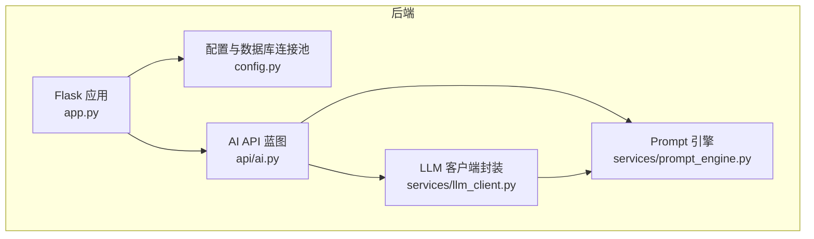
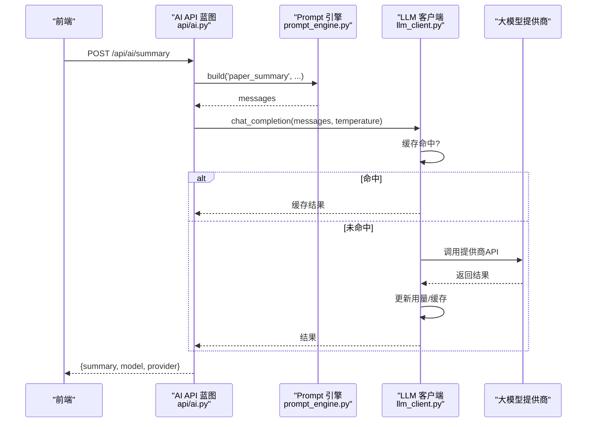
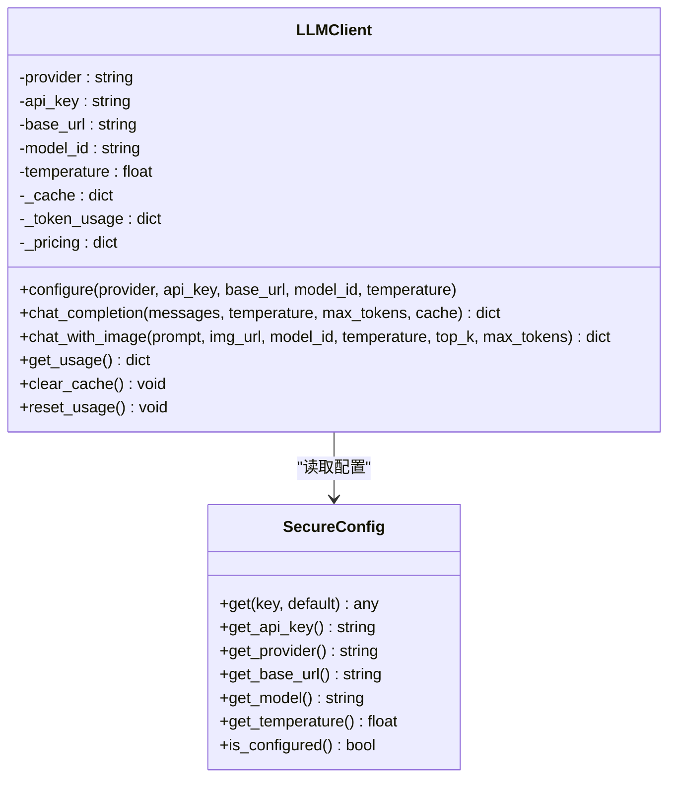
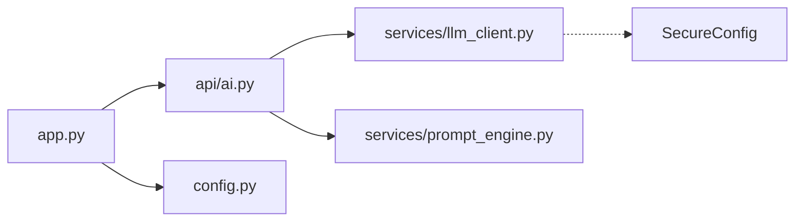

# 大模型客户端集成

<cite>
**本文引用的文件**
- [llm_client.py](file://backend/services/llm_client.py)
- [config.py](file://backend/config.py)
- [app.py](file://backend/app.py)
- [ai.py](file://backend/api/ai.py)
- [prompt_engine.py](file://backend/services/prompt_engine.py)
- [requirements.txt](file://backend/requirements.txt)
- [大模型融入系统设计方案.md](file://docs/大模型融入系统设计方案.md)
- [README.md](file://README.md)
</cite>

## 目录
1. [简介](#简介)
2. [项目结构](#项目结构)
3. [核心组件](#核心组件)
4. [架构总览](#架构总览)
5. [详细组件分析](#详细组件分析)
6. [依赖分析](#依赖分析)
7. [性能考虑](#性能考虑)
8. [故障排除指南](#故障排除指南)
9. [结论](#结论)
10. [附录](#附录)

## 简介
本文件面向PaperHub大模型客户端集成，系统化说明多提供商支持架构设计，涵盖豆包、OpenAI、通义千问、Anthropic、TEG等大模型提供商的统一封装与调用；详细解释API Key管理机制、配置参数设置与连接池管理；文档化客户端初始化流程、错误处理策略与重试机制；包含温度参数控制、用量统计与缓存清理功能；并提供具体配置示例与故障排除指南。

## 项目结构
PaperHub后端采用Flask + SQLAlchemy架构，AI相关能力集中在services与api目录：
- services/llm_client.py：统一LLM客户端封装，支持多提供商、缓存、用量统计与安全配置
- services/prompt_engine.py：Prompt模板引擎，集中管理各类提示词模板
- api/ai.py：AI相关API路由，提供配置、用量查询、摘要生成、标签推荐、关联分析等接口
- config.py：数据库连接池与全局会话管理
- app.py：Flask应用入口，注册蓝图与中间件
- requirements.txt：后端依赖声明

图表来源
- [app.py:41-137](file://backend/app.py#L41-L137)
- [config.py:85-134](file://backend/config.py#L85-L134)
- [ai.py:10-32](file://backend/api/ai.py#L10-L32)
- [llm_client.py:198-590](file://backend/services/llm_client.py#L198-L590)
- [prompt_engine.py:92-109](file://backend/services/prompt_engine.py#L92-L109)

章节来源
- [README.md:383-481](file://README.md#L383-L481)
- [app.py:140-158](file://backend/app.py#L140-L158)
- [config.py:35-74](file://backend/config.py#L35-L74)

## 核心组件
- LLM客户端封装（LLMClient）：支持多提供商统一调用、缓存、用量统计、温度参数控制、错误处理与重试
- 安全配置（SecureConfig）：支持.env文件与环境变量加载，提供API Key、提供商、Base URL、模型、温度等配置项
- Prompt引擎（PromptEngine）：集中管理paper_summary、auto_tag、related_content、note_summary等模板
- AI API（api/ai.py）：提供配置、用量查询、摘要生成、标签推荐、关联分析、缓存清理等接口
- 数据库连接池（config.py）：全局单例Engine与ScopedSession，支持连接池参数配置

章节来源
- [llm_client.py:18-93](file://backend/services/llm_client.py#L18-L93)
- [llm_client.py:198-547](file://backend/services/llm_client.py#L198-L547)
- [prompt_engine.py:6-89](file://backend/services/prompt_engine.py#L6-L89)
- [ai.py:42-77](file://backend/api/ai.py#L42-L77)
- [config.py:85-134](file://backend/config.py#L85-L134)

## 架构总览
PaperHub的大模型集成采用“API网关 + 客户端封装 + Prompt模板”的三层架构：
- API网关：Flask蓝图提供REST接口，接收前端请求并调用业务逻辑
- 客户端封装：LLMClient统一封装各提供商API，负责消息构建、调用、缓存、用量统计与错误处理
- Prompt模板：PromptEngine集中管理提示词模板，按需渲染消息列表

图表来源
- [ai.py:79-139](file://backend/api/ai.py#L79-L139)
- [prompt_engine.py:92-105](file://backend/services/prompt_engine.py#L92-L105)
- [llm_client.py:247-278](file://backend/services/llm_client.py#L247-L278)

## 详细组件分析

### LLM客户端封装（LLMClient）
- 多提供商支持：通过provider参数选择doubao、openai、anthropic、qwen、teg等，分别构造消息与请求
- 安全配置：优先使用传入参数，否则从SecureConfig加载LLM_API_KEY、LLM_PROVIDER、LLM_BASE_URL、LLM_MODEL、LLM_TEMPERATURE
- 缓存机制：基于消息、温度、max_tokens生成MD5缓存键，命中则直接返回
- 用量统计：记录prompt_tokens、completion_tokens、call_count，并按提供商定价估算总费用
- 错误处理与重试：各提供商调用使用try/except捕获异常；teg专用调用在空返回时进行最多3次重试
- 图像输入：支持chat_with_image接口，兼容TEG多模态调用方式

图表来源
- [llm_client.py:198-547](file://backend/services/llm_client.py#L198-L547)
- [llm_client.py:18-93](file://backend/services/llm_client.py#L18-L93)

章节来源
- [llm_client.py:198-547](file://backend/services/llm_client.py#L198-L547)
- [llm_client.py:95-195](file://backend/services/llm_client.py#L95-L195)

### 安全配置（SecureConfig）
- 配置来源优先级：运行时参数 > 环境变量 > .env文件
- 支持的关键配置：LLM_API_KEY、LLM_PROVIDER、LLM_BASE_URL、LLM_MODEL、LLM_TEMPERATURE
- 自动示例文件生成：首次运行时自动生成.env示例文件，便于用户快速配置

章节来源
- [llm_client.py:18-93](file://backend/services/llm_client.py#L18-L93)
- [llm_client.py:562-590](file://backend/services/llm_client.py#L562-L590)

### Prompt引擎（PromptEngine）
- 预设模板：paper_summary、auto_tag、related_content、note_summary
- 渲染机制：根据模板标签构建system与user消息，返回标准messages数组
- 可扩展性：新增模板只需在PROMPTS中添加条目，并在build中引用

章节来源
- [prompt_engine.py:6-89](file://backend/services/prompt_engine.py#L6-L89)
- [prompt_engine.py:92-109](file://backend/services/prompt_engine.py#L92-L109)

### AI API（api/ai.py）
- 配置接口：POST/GET /api/ai/config，支持动态配置提供商、API Key、Base URL、模型与温度
- 用量查询：GET /api/ai/stats，返回token用量与费用统计
- 摘要生成：POST /api/ai/summary，基于paper_summary模板生成论文解读
- 标签推荐：POST /api/ai/recommend-tags，基于auto_tag模板推荐标签
- 关联分析：POST /api/ai/related，基于related_content模板分析相关内容
- 缓存清理：POST /api/ai/clear-cache，清空LLM客户端缓存

章节来源
- [ai.py:42-77](file://backend/api/ai.py#L42-L77)
- [ai.py:79-139](file://backend/api/ai.py#L79-L139)
- [ai.py:142-211](file://backend/api/ai.py#L142-L211)
- [ai.py:213-281](file://backend/api/ai.py#L213-L281)
- [ai.py:284-288](file://backend/api/ai.py#L284-L288)

### 数据库连接池（config.py）
- 全局单例Engine与ScopedSession，确保线程安全与资源复用
- 连接池参数：pool_size、max_overflow、pool_timeout、pool_recycle
- 生命周期管理：init_db初始化，get_session/get_scoped_session获取会话，close_scoped_session在请求结束时清理

章节来源
- [config.py:85-134](file://backend/config.py#L85-L134)

## 依赖分析
- Flask应用入口：注册AI蓝图，初始化数据库，配置CORS与异常处理
- 依赖声明：Flask、Flask-CORS、Flask-SQLAlchemy、requests等
- 组件耦合：api/ai.py依赖llm_client与prompt_engine；llm_client依赖secure配置；app.py依赖config与models

图表来源
- [app.py:140-158](file://backend/app.py#L140-L158)
- [ai.py:10-32](file://backend/api/ai.py#L10-L32)
- [llm_client.py:18-93](file://backend/services/llm_client.py#L18-L93)

章节来源
- [app.py:140-158](file://backend/app.py#L140-L158)
- [requirements.txt:1-15](file://backend/requirements.txt#L1-L15)

## 性能考虑
- 缓存策略：基于消息内容与参数生成MD5缓存键，避免重复调用API，显著降低token消耗与延迟
- 用量统计：按提供商定价估算费用，便于成本控制与预算管理
- 请求超时：各提供商调用设置合理timeout，避免阻塞影响用户体验
- 连接池：数据库连接池参数优化，减少连接开销与锁竞争

章节来源
- [llm_client.py:218-231](file://backend/services/llm_client.py#L218-L231)
- [llm_client.py:379-381](file://backend/services/llm_client.py#L379-L381)
- [config.py:92-99](file://backend/config.py#L92-L99)

## 故障排除指南
- API Key未配置
  - 现象：调用返回“API key not configured”
  - 处理：通过/api/ai/config设置LLM_API_KEY，或在.env文件中配置
- 提供商切换失败
  - 现象：provider参数无效或调用异常
  - 处理：确认provider值在支持列表中（doubao/openai/anthropic/qwen/teg），检查Base URL与模型ID
- 调用超时或网络异常
  - 现象：请求抛出异常或返回错误
  - 处理：检查网络连通性、代理设置；适当增大timeout；查看日志定位具体错误
- 用量统计异常
  - 现象：token用量或费用统计不准确
  - 处理：确认各提供商usage字段解析正确；必要时调用/reset_usage重置统计
- 缓存命中率低
  - 现象：相同输入频繁触发API调用
  - 处理：检查缓存键生成逻辑；确保消息序列化一致；定期清理缓存

章节来源
- [llm_client.py:383-443](file://backend/services/llm_client.py#L383-L443)
- [llm_client.py:445-517](file://backend/services/llm_client.py#L445-L517)
- [ai.py:114-133](file://backend/api/ai.py#L114-L133)

## 结论
PaperHub的大模型客户端集成通过LLMClient统一封装多提供商API，配合PromptEngine与AI API，实现了论文解读、标签推荐、关联分析等核心功能。安全配置与用量统计保障了成本可控与使用透明，缓存与连接池优化提升了性能与稳定性。后续可在现有基础上扩展更多提供商与高级功能，持续提升用户体验与系统价值。

## 附录

### 配置示例
- .env文件示例（首次运行自动生成）：
  - LLM_API_KEY=your-api-key-here
  - LLM_PROVIDER=doubao
  - LLM_BASE_URL=
  - LLM_MODEL=

章节来源
- [llm_client.py:562-590](file://backend/services/llm_client.py#L562-L590)

### API参考
- 配置与用量
  - GET /api/ai/config
  - POST /api/ai/config
  - GET /api/ai/stats
- 内容处理
  - POST /api/ai/summary
  - POST /api/ai/recommend-tags
  - POST /api/ai/related
- 缓存管理
  - POST /api/ai/clear-cache

章节来源
- [ai.py:42-77](file://backend/api/ai.py#L42-L77)
- [ai.py:79-139](file://backend/api/ai.py#L79-L139)
- [ai.py:142-211](file://backend/api/ai.py#L142-L211)
- [ai.py:213-281](file://backend/api/ai.py#L213-L281)
- [ai.py:284-288](file://backend/api/ai.py#L284-L288)