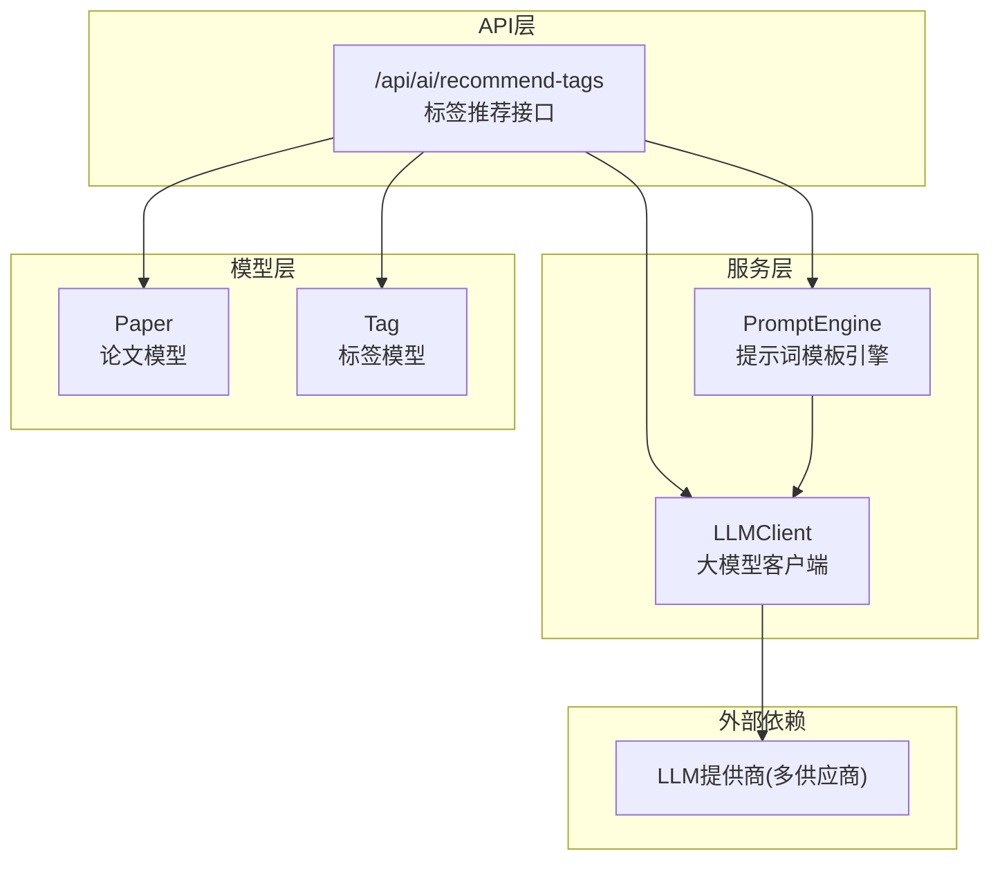
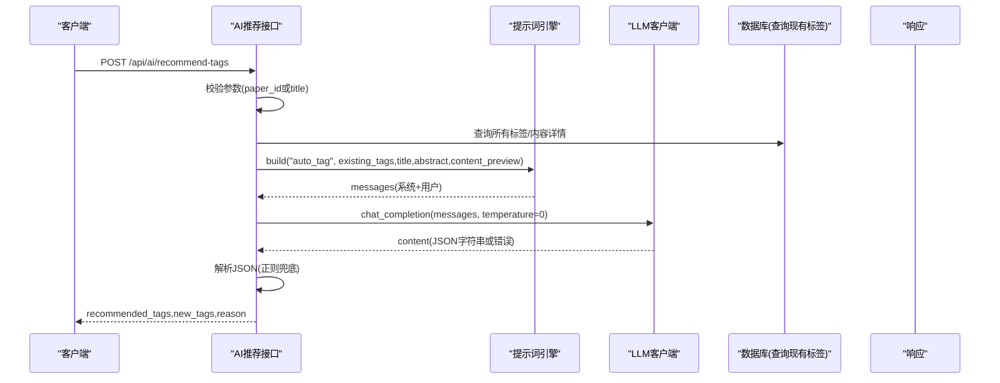
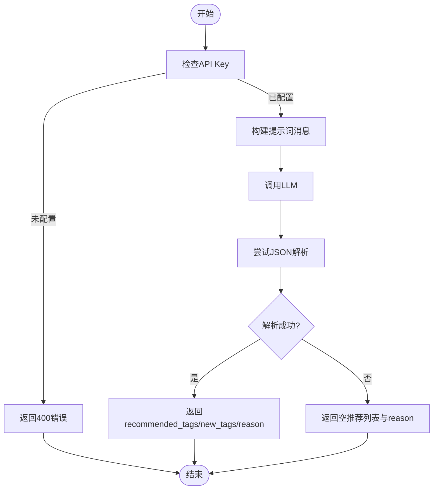
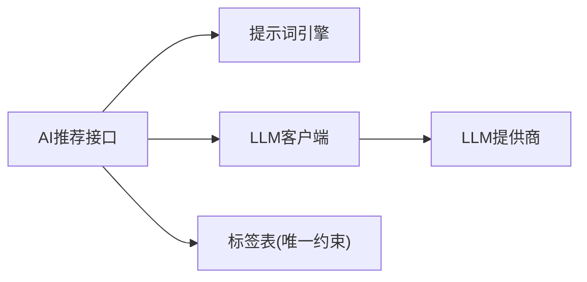

# 标签智能推荐

<cite>
**本文档引用的文件**
- [backend/api/ai.py](file://backend/api/ai.py)
- [backend/services/llm_client.py](file://backend/services/llm_client.py)
- [backend/services/prompt_engine.py](file://backend/services/prompt_engine.py)
- [specs/backend/api/ai.yml](file://specs/backend/api/ai.yml)
- [specs/backend/services/prompt_engine.yml](file://specs/backend/services/prompt_engine.yml)
- [backend/models/paper.py](file://backend/models/paper.py)
- [specs/backend/models/tag.yml](file://specs/backend/models/tag.yml)
- [scripts/tests/test_batch_api.py](file://scripts/tests/test_batch_api.py)
</cite>

## 目录
1. [简介](#简介)
2. [项目结构](#项目结构)
3. [核心组件](#核心组件)
4. [架构总览](#架构总览)
5. [详细组件分析](#详细组件分析)
6. [依赖分析](#依赖分析)
7. [性能考虑](#性能考虑)
8. [故障排查指南](#故障排查指南)
9. [结论](#结论)
10. [附录](#附录)

## 简介
本文件面向PaperHub的“标签智能推荐”能力，系统性说明其算法工作原理、数据处理流程、JSON输出解析与质量评估、推荐结果格式规范、错误处理与回退策略，并提供API使用示例与集成指南。目标读者既包括开发者，也包括需要理解推荐机制与正确使用API的非技术用户。

## 项目结构
围绕标签推荐功能的关键文件组织如下：
- API层：提供对外HTTP接口，负责请求参数校验、调用提示词模板与大模型客户端、解析与返回结果。
- 服务层：封装LLM客户端与提示词模板引擎，统一不同提供商的调用差异，保障稳定性与可扩展性。
- 模型层：定义标签与论文等实体及多对多关系，支撑标签去重与持久化。
- 规范与测试：以YAML描述API输入输出规范；通过测试脚本验证批量操作与错误处理。

图表来源
- [backend/api/ai.py:142-211](file://backend/api/ai.py#L142-L211)
- [backend/services/prompt_engine.py:92-109](file://backend/services/prompt_engine.py#L92-L109)
- [backend/services/llm_client.py:198-556](file://backend/services/llm_client.py#L198-L556)
- [backend/models/paper.py:120-146](file://backend/models/paper.py#L120-L146)
- [specs/backend/models/tag.yml:1-68](file://specs/backend/models/tag.yml#L1-L68)

章节来源
- [backend/api/ai.py:142-211](file://backend/api/ai.py#L142-L211)
- [backend/services/prompt_engine.py:30-49](file://backend/services/prompt_engine.py#L30-L49)
- [backend/services/llm_client.py:198-556](file://backend/services/llm_client.py#L198-L556)
- [backend/models/paper.py:93-106](file://backend/models/paper.py#L93-L106)
- [specs/backend/models/tag.yml:1-68](file://specs/backend/models/tag.yml#L1-L68)

## 核心组件
- 标签推荐API：接收paper_id或手动输入title/abstract/content，构建提示词并调用大模型，解析JSON输出，返回recommended_tags、new_tags与reason。
- 提示词模板引擎：集中管理auto_tag模板，渲染系统提示与用户内容，确保输出符合JSON结构要求。
- LLM客户端：统一大模型调用，支持多提供商（如doubao/openai/anthropic/qwen等），内置缓存、用量统计与错误处理。
- 标签模型：定义标签唯一性约束与多对多关系，支撑标签去重与持久化。

章节来源
- [backend/api/ai.py:142-211](file://backend/api/ai.py#L142-L211)
- [backend/services/prompt_engine.py:30-49](file://backend/services/prompt_engine.py#L30-L49)
- [backend/services/llm_client.py:198-556](file://backend/services/llm_client.py#L198-L556)
- [backend/models/paper.py:93-106](file://backend/models/paper.py#L93-L106)

## 架构总览
标签推荐从“请求进入”到“结果返回”的端到端流程如下：

图表来源
- [backend/api/ai.py:142-211](file://backend/api/ai.py#L142-L211)
- [backend/services/prompt_engine.py:92-109](file://backend/services/prompt_engine.py#L92-L109)
- [backend/services/llm_client.py:247-278](file://backend/services/llm_client.py#L247-L278)

## 详细组件分析

### 标签推荐API（/api/ai/recommend-tags）
- 请求参数
  - paper_id：可选，若提供则从Paper或Article查询title/abstract/content，并拉取系统中所有Tag作为existing_tags。
  - source：可选，当paper_id指向article时指定来源。
  - title/abstract/content：可选，直接传入内容时无需paper_id。
  - existing_tags：可选，手动传入现有标签列表。
- 处理逻辑
  - 若paper_id存在，查询Paper/Article并拼接content_preview（限制长度）。
  - 从数据库读取所有Tag，得到existing_tags。
  - 构建auto_tag模板消息，调用LLM。
  - 解析LLM返回内容：优先使用正则抽取第一个JSON对象，再尝试整体解析；失败则返回空推荐列表与reason。
- 输出字段
  - recommended_tags：从现有标签系统中挑选的匹配标签数组。
  - new_tags：建议新建的标签数组。
  - reason：简短理由，解释为何推荐这些标签。
- 错误处理
  - API key未配置：返回400并提示设置。
  - LLM调用错误：返回500并携带错误信息。
  - JSON解析失败：返回空推荐列表与提示reason。

章节来源
- [backend/api/ai.py:142-211](file://backend/api/ai.py#L142-L211)
- [specs/backend/api/ai.yml:106-149](file://specs/backend/api/ai.yml#L106-L149)

### 提示词模板引擎（PromptEngine）
- auto_tag模板要点
  - system提示：强调从已有标签系统中选择匹配标签，并建议新建标签。
  - 用户模板：包含existing_tags、title、abstract、content_preview三部分，要求输出JSON结构，包含recommended_tags/new_tags/reason。
- 渲染规则
  - 通过build(tag, **kwargs)生成标准messages结构（system+user）。
  - 模板变量缺失时保留占位符，保证调用可用性。

章节来源
- [backend/services/prompt_engine.py:30-49](file://backend/services/prompt_engine.py#L30-L49)
- [specs/backend/services/prompt_engine.yml:1-18](file://specs/backend/services/prompt_engine.yml#L1-L18)

### LLM客户端（LLMClient）
- 多提供商支持：doubao/openai/anthropic/qwen等，统一chat_completion接口。
- 缓存与用量：基于messages+温度+max_tokens生成缓存key；记录prompt/completion tokens与估算成本。
- 错误处理：捕获异常并返回error字段；支持clear_cache重置缓存。
- 调用特性：temperature=0确保输出稳定；对TEG等特定提供商提供专用调用路径。

章节来源
- [backend/services/llm_client.py:198-556](file://backend/services/llm_client.py#L198-L556)
- [specs/backend/api/ai.yml:56-62](file://specs/backend/api/ai.yml#L56-L62)

### 标签模型与去重
- Tag模型
  - 唯一约束：name唯一，天然去重。
  - 类型与层级：type字段支持tech/conference/custom；支持parent_id自引用形成层级。
  - 多对多关系：与Paper/Article/Note通过中间表关联。
- 推荐去重策略
  - 系统层面：数据库唯一约束保证标签名不重复。
  - 推荐层面：LLM输出的recommended_tags应与existing_tags结合，避免重复；前端/业务层可进一步去重与合并。

章节来源
- [backend/models/paper.py:93-106](file://backend/models/paper.py#L93-L106)
- [specs/backend/models/tag.yml:1-68](file://specs/backend/models/tag.yml#L1-L68)

### 推荐结果格式规范
- 必需字段
  - recommended_tags：字符串数组，来自现有标签系统。
  - new_tags：字符串数组，建议新增标签。
  - reason：字符串，简要说明推荐依据。
- 可选字段
  - provider/model：在摘要/相关推荐等场景中返回，此处标签推荐默认不返回。
- 字段约束
  - recommended_tags/new_tags应去重且语义清晰。
  - reason控制在合理长度内，便于UI展示。

章节来源
- [backend/services/prompt_engine.py:44-47](file://backend/services/prompt_engine.py#L44-L47)
- [specs/backend/api/ai.yml:140-146](file://specs/backend/api/ai.yml#L140-L146)

### JSON输出解析机制与回退策略
- 解析流程
  - 正则抽取：优先从LLM返回内容中提取第一个JSON对象，避免多余文本干扰。
  - 整体解析：若无嵌套JSON，则尝试整体JSON解析。
- 回退策略
  - 解析失败：返回recommended_tags/new_tags为空数组，并返回reason提示“解析失败，请重试”。

图表来源
- [backend/api/ai.py:183-210](file://backend/api/ai.py#L183-L210)

章节来源
- [backend/api/ai.py:196-210](file://backend/api/ai.py#L196-L210)

### 准确性优化与质量评估
- 提示词优化
  - 明确system角色与任务边界，限定输出结构（JSON）。
  - 控制content_preview长度，避免上下文溢出。
- 输出质量
  - temperature=0确保稳定输出。
  - 建议在业务层对recommended_tags进行二次过滤（如长度、语义相似度阈值）。
- 数据质量
  - existing_tags来源于系统现有标签，建议定期清洗与标准化（去重、归一化）。

章节来源
- [backend/services/llm_client.py:247-278](file://backend/services/llm_client.py#L247-L278)
- [backend/services/prompt_engine.py:30-49](file://backend/services/prompt_engine.py#L30-L49)

### 用户反馈机制与持续改进
- 反馈入口
  - 前端可在详情页/列表页提供“采纳/拒绝”按钮，将用户反馈写入后端（可扩展）。
- 改进闭环
  - 收集用户对recommended_tags/new_tags的标注与评分。
  - 基于反馈调整提示词模板与阈值，迭代提升召回与准确率。
- 版本与灰度
  - 通过API版本或开关控制新模板上线，逐步扩大影响范围。

（本节为概念性建议，不直接对应具体代码文件）

### API使用示例与集成指南
- 接口定义
  - 方法与路径：POST /api/ai/recommend-tags
  - 输入参数：paper_id/source/title/abstract/content/existing_tags
  - 输出字段：recommended_tags/new_tags/reason
- 请求示例（示意）
  - 传入paper_id：后端自动拉取title/abstract/content与系统所有标签。
  - 直接传入title/abstract/content：适合临时分析场景。
- 响应示例（示意）
  - 成功：返回recommended_tags/new_tags/reason。
  - 失败：返回error或空推荐列表（解析失败时）。
- 集成建议
  - 前端在论文/文章详情页触发推荐，展示建议标签并允许一键应用。
  - 与批量操作API配合，实现“批量采纳标签”的高效体验。

章节来源
- [specs/backend/api/ai.yml:106-149](file://specs/backend/api/ai.yml#L106-L149)
- [backend/api/ai.py:142-211](file://backend/api/ai.py#L142-L211)

## 依赖分析
- 组件耦合
  - AI推荐接口依赖提示词引擎与LLM客户端，二者相对独立，便于替换与扩展。
  - 标签推荐依赖数据库中的Tag表，确保标签唯一性。
- 外部依赖
  - LLM提供商（多供应商），通过LLMClient抽象屏蔽差异。
- 潜在风险
  - JSON解析依赖正则抽取，若LLM输出不稳定，需加强模板约束与回退策略。
  - content_preview长度限制需与模板长度控制协同。

图表来源
- [backend/api/ai.py:142-211](file://backend/api/ai.py#L142-L211)
- [backend/services/prompt_engine.py:92-109](file://backend/services/prompt_engine.py#L92-L109)
- [backend/services/llm_client.py:198-556](file://backend/services/llm_client.py#L198-L556)
- [specs/backend/models/tag.yml:1-68](file://specs/backend/models/tag.yml#L1-L68)

章节来源
- [backend/api/ai.py:142-211](file://backend/api/ai.py#L142-L211)
- [backend/services/llm_client.py:198-556](file://backend/services/llm_client.py#L198-L556)
- [specs/backend/models/tag.yml:1-68](file://specs/backend/models/tag.yml#L1-L68)

## 性能考虑
- 调用次数与成本
  - LLMClient维护token用量与估算成本，建议在批量场景下合并请求或启用缓存。
- 缓存策略
  - 对相同messages+温度+max_tokens启用缓存，减少重复调用。
- 上下文长度
  - content_preview长度限制与模板长度控制协同，避免超限导致失败或降质。
- 并发与稳定性
  - 对LLM调用增加超时与重试策略，结合错误码与日志定位问题。

（本节提供通用指导，不直接引用具体代码片段）

## 故障排查指南
- 常见错误
  - 400 API Key未配置：检查.env或环境变量配置，或通过/ai/config接口设置。
  - 500 LLM调用失败：查看后端日志与traceback，确认网络与凭据。
  - JSON解析失败：返回空推荐列表与reason，建议重试或检查模板输出。
- 排查步骤
  - 确认/ai/config返回的provider/has_api_key状态。
  - 使用/ai/stats查看用量统计，核对成本与调用次数。
  - 清理缓存后重试：/ai/clear-cache。
- 批量操作与标签管理
  - 可参考批量API测试脚本，验证标签批量添加/移除的正确性与错误处理。

章节来源
- [backend/api/ai.py:42-76](file://backend/api/ai.py#L42-L76)
- [backend/api/ai.py:284-288](file://backend/api/ai.py#L284-L288)
- [scripts/tests/test_batch_api.py:1-418](file://scripts/tests/test_batch_api.py#L1-L418)

## 结论
PaperHub的标签智能推荐通过“提示词模板+多提供商LLM+数据库标签去重”的组合，实现了稳定、可扩展的自动化标签生成。建议在生产环境中强化模板约束、完善用户反馈与持续改进机制，并结合缓存与用量监控提升性能与成本可控性。

## 附录
- 相关API与规范
  - /api/ai/recommend-tags：标签推荐接口
  - /api/ai/config：AI配置与状态查询
  - /api/ai/stats：用量统计
  - /api/ai/clear-cache：清理缓存
- 相关模型
  - Tag：标签模型（唯一约束、类型、层级、多对多关系）
  - Paper：论文模型（与标签多对多）

章节来源
- [specs/backend/api/ai.yml:1-190](file://specs/backend/api/ai.yml#L1-L190)
- [specs/backend/models/tag.yml:1-68](file://specs/backend/models/tag.yml#L1-L68)