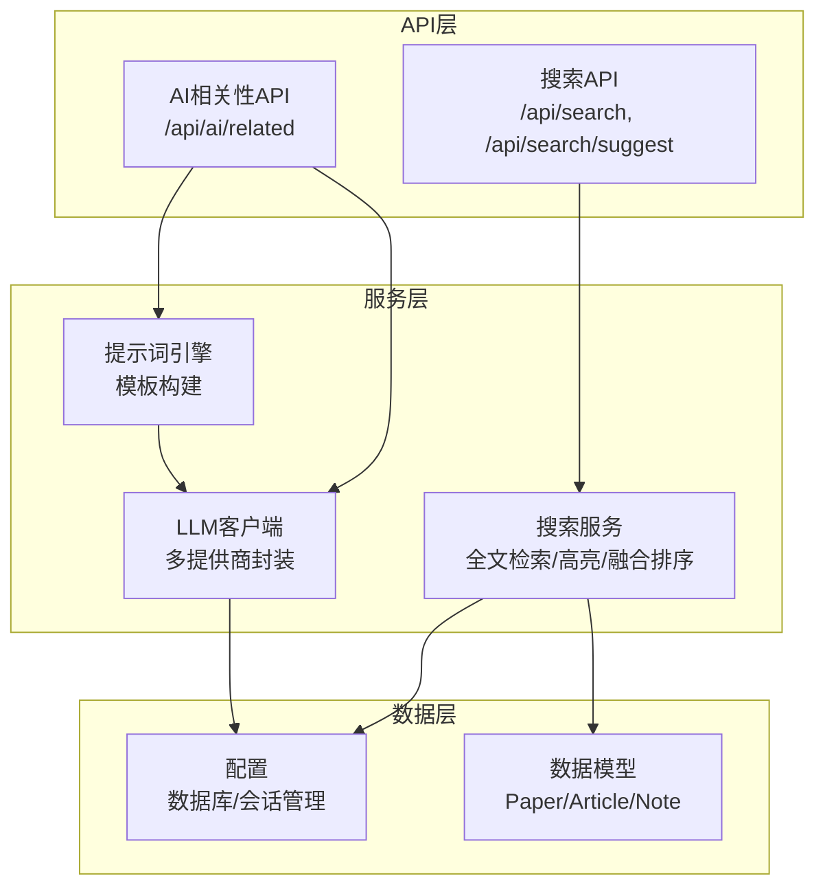
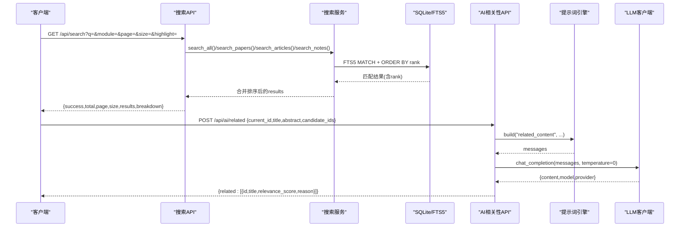
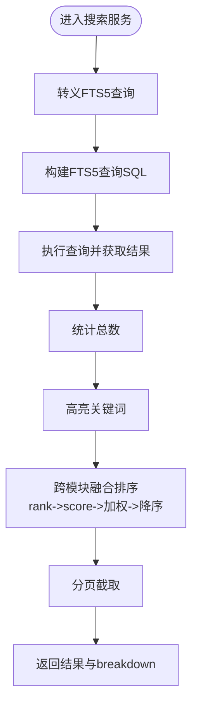
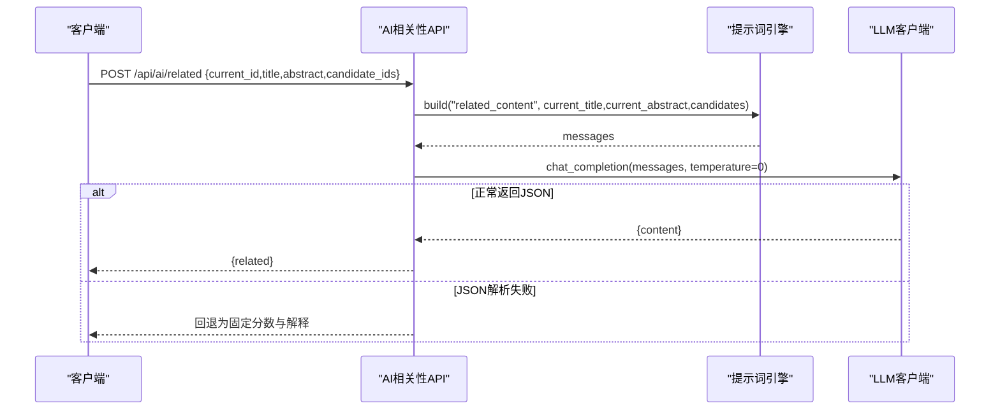
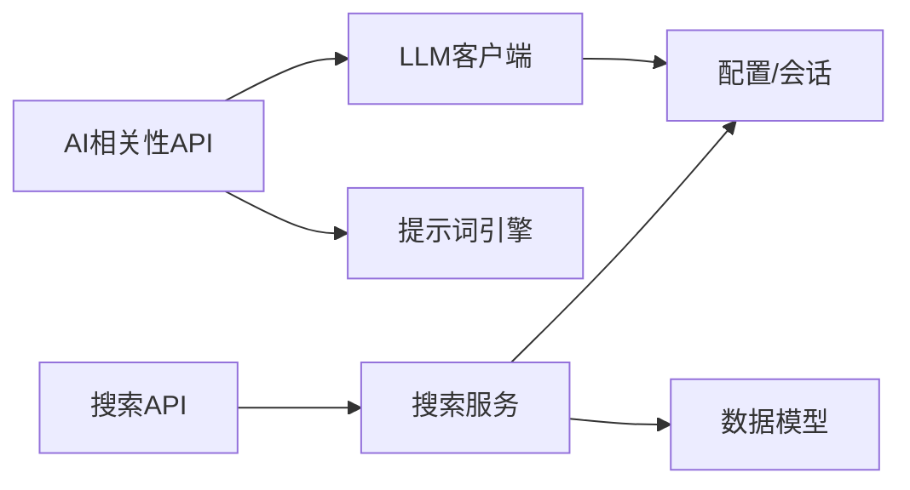

# 相关内容查找

<cite>
**本文档引用的文件**
- [backend/api/search.py](file://backend/api/search.py)
- [backend/services/search_service.py](file://backend/services/search_service.py)
- [backend/api/ai.py](file://backend/api/ai.py)
- [backend/services/llm_client.py](file://backend/services/llm_client.py)
- [backend/services/prompt_engine.py](file://backend/services/prompt_engine.py)
- [backend/models/paper.py](file://backend/models/paper.py)
- [backend/config.py](file://backend/config.py)
- [specs/backend/api/search.yml](file://specs/backend/api/search.yml)
- [specs/backend/services/search_service.yml](file://specs/backend/services/search_service.yml)
- [specs/backend/services/prompt_engine.yml](file://specs/backend/services/prompt_engine.yml)
- [README.md](file://README.md)
</cite>

## 目录
1. [简介](#简介)
2. [项目结构](#项目结构)
3. [核心组件](#核心组件)
4. [架构概览](#架构概览)
5. [详细组件分析](#详细组件分析)
6. [依赖分析](#依赖分析)
7. [性能考虑](#性能考虑)
8. [故障排查指南](#故障排查指南)
9. [结论](#结论)
10. [附录](#附录)

## 简介
本文档面向PaperHub“相关内容查找”功能，系统化阐述其基于大模型的相关性分析算法与实现。内容涵盖候选内容选择、相似度计算与排序机制、输入输出格式、评分标准、批量处理能力、性能优化与资源控制、错误处理策略、结果验证与质量保证，以及具体使用场景与集成示例。目标读者既包括后端开发者，也包括需要理解整体流程的非技术用户。

## 项目结构
PaperHub采用Flask后端 + SQLite数据库 + 前端单页应用的架构。相关内容查找涉及以下关键模块：
- 搜索API层：提供REST接口，接收查询参数并返回结构化结果
- 搜索服务层：封装全文检索、关键词高亮、跨模块融合排序
- AI相关性分析：通过大模型对候选内容进行相关性打分与解释
- 提示词模板引擎：统一构建不同任务的提示词
- LLM客户端：抽象多家大模型提供商，统一调用与缓存
- 数据模型：论文、文章、笔记实体及FTS5全文检索表

图表来源
- [backend/api/search.py:1-70](file://backend/api/search.py#L1-L70)
- [backend/services/search_service.py:1-314](file://backend/services/search_service.py#L1-L314)
- [backend/api/ai.py:1-288](file://backend/api/ai.py#L1-L288)
- [backend/services/prompt_engine.py:1-109](file://backend/services/prompt_engine.py#L1-L109)
- [backend/services/llm_client.py:1-590](file://backend/services/llm_client.py#L1-L590)
- [backend/config.py:1-134](file://backend/config.py#L1-L134)
- [backend/models/paper.py:1-360](file://backend/models/paper.py#L1-L360)

章节来源
- [README.md:383-481](file://README.md#L383-L481)
- [backend/api/search.py:1-70](file://backend/api/search.py#L1-L70)
- [backend/services/search_service.py:1-314](file://backend/services/search_service.py#L1-L314)
- [backend/api/ai.py:1-288](file://backend/api/ai.py#L1-L288)

## 核心组件
- 搜索API：提供全文搜索与搜索建议接口，支持按模块（论文/文章/笔记）或跨模块搜索，支持分页与高亮
- 搜索服务：实现FTS5全文检索、关键词转义、高亮、跨模块融合排序与统计
- AI相关性分析：接收当前内容与候选集合，通过提示词模板与大模型生成相关性分数与解释
- 提示词引擎：内置paper_summary、auto_tag、related_content、note_summary等模板
- LLM客户端：统一多提供商（豆包、OpenAI、Anthropic、Qwen、TEG）调用，支持缓存与用量统计
- 数据模型与配置：Paper/Article/Note实体与FTS5表，SQLAlchemy会话管理与SQLite连接池

章节来源
- [specs/backend/api/search.yml:1-70](file://specs/backend/api/search.yml#L1-L70)
- [specs/backend/services/search_service.yml:1-28](file://specs/backend/services/search_service.yml#L1-L28)
- [specs/backend/services/prompt_engine.yml:1-18](file://specs/backend/services/prompt_engine.yml#L1-L18)
- [backend/api/search.py:1-70](file://backend/api/search.py#L1-L70)
- [backend/services/search_service.py:1-314](file://backend/services/search_service.py#L1-L314)
- [backend/api/ai.py:1-288](file://backend/api/ai.py#L1-L288)
- [backend/services/prompt_engine.py:1-109](file://backend/services/prompt_engine.py#L1-L109)
- [backend/services/llm_client.py:1-590](file://backend/services/llm_client.py#L1-L590)
- [backend/models/paper.py:1-360](file://backend/models/paper.py#L1-L360)
- [backend/config.py:1-134](file://backend/config.py#L1-L134)

## 架构概览
相关内容查找的整体流程分为两部分：
- 基于FTS5的全文检索与高亮：在论文、文章、笔记的FTS5表中进行匹配，返回匹配项并计算rank
- 基于大模型的相关性分析：对候选内容进行语义层面的相关性打分与解释

图表来源
- [backend/api/search.py:14-51](file://backend/api/search.py#L14-L51)
- [backend/services/search_service.py:207-257](file://backend/services/search_service.py#L207-L257)
- [backend/api/ai.py:213-281](file://backend/api/ai.py#L213-L281)
- [backend/services/prompt_engine.py:51-75](file://backend/services/prompt_engine.py#L51-L75)
- [backend/services/llm_client.py:247-278](file://backend/services/llm_client.py#L247-L278)

## 详细组件分析

### 搜索API与服务
- 接口定义与参数
  - /api/search：支持q（关键词）、module（all/papers/articles/notes）、page、size、highlight
  - /api/search/suggest：支持q（前缀）、limit
- 服务实现要点
  - FTS5查询转义：将特殊字符替换为空格，避免FTS5语法错误
  - 高亮：对标题与摘要中的关键词进行HTML标签包裹
  - 跨模块融合排序：以FTS5 rank为基础，映射到0-1区间，乘以模块权重（论文>文章>笔记），再整体降序排序
  - 分页：基于offset/limit，breakdown统计各模块命中数
  - 搜索建议：从FTS5索引中按rank取回标题建议，走索引提升性能

图表来源
- [backend/services/search_service.py:8-26](file://backend/services/search_service.py#L8-L26)
- [backend/services/search_service.py:39-96](file://backend/services/search_service.py#L39-L96)
- [backend/services/search_service.py:207-257](file://backend/services/search_service.py#L207-L257)

章节来源
- [specs/backend/api/search.yml:1-70](file://specs/backend/api/search.yml#L1-L70)
- [specs/backend/services/search_service.yml:1-28](file://specs/backend/services/search_service.yml#L1-L28)
- [backend/api/search.py:14-70](file://backend/api/search.py#L14-L70)
- [backend/services/search_service.py:1-314](file://backend/services/search_service.py#L1-L314)

### AI相关性分析
- 输入数据格式
  - current_id 或 title/abstract 二选一
  - candidate_ids：候选论文ID列表（最多5个）
- 输出结果结构
  - related：数组，每个元素包含id、title、relevance_score、reason
  - 若JSON解析失败，会回退为固定分数并生成解释
- 评分标准
  - 由大模型输出的relevance_score（0-100）
  - 当解析失败时，回退为固定分数（示例：70）
- 相似度计算与排序机制
  - 通过提示词模板构建messages，调用LLM生成JSON
  - JSON解析失败时，按候选顺序分配分数并生成解释
  - 未配置API Key时返回错误提示

图表来源
- [backend/api/ai.py:213-281](file://backend/api/ai.py#L213-L281)
- [backend/services/prompt_engine.py:51-75](file://backend/services/prompt_engine.py#L51-L75)
- [backend/services/llm_client.py:247-278](file://backend/services/llm_client.py#L247-L278)

章节来源
- [backend/api/ai.py:213-281](file://backend/api/ai.py#L213-L281)
- [backend/services/prompt_engine.py:51-75](file://backend/services/prompt_engine.py#L51-L75)
- [backend/services/llm_client.py:198-590](file://backend/services/llm_client.py#L198-L590)

### 提示词模板与大模型客户端
- 提示词模板
  - related_content：要求输出JSON数组，包含id、title、relevance_score、reason
  - 其他模板：paper_summary、auto_tag、note_summary
- LLM客户端
  - 支持多家提供商（doubao/openai/anthropic/qwen/teg），统一chat_completion接口
  - 支持缓存、用量统计、超时控制、重试与错误处理
  - 支持图片输入（teg）

章节来源
- [specs/backend/services/prompt_engine.yml:1-18](file://specs/backend/services/prompt_engine.yml#L1-L18)
- [backend/services/prompt_engine.py:1-109](file://backend/services/prompt_engine.py#L1-L109)
- [backend/services/llm_client.py:1-590](file://backend/services/llm_client.py#L1-L590)

### 数据模型与FTS5
- 数据模型：Paper、Article、Note及其关联表
- FTS5：论文/文章/笔记分别有对应的FTS5表，用于全文检索与rank排序
- 配置：SQLAlchemy会话工厂与SQLite连接池，确保并发安全与性能

章节来源
- [backend/models/paper.py:1-360](file://backend/models/paper.py#L1-L360)
- [backend/config.py:1-134](file://backend/config.py#L1-L134)

## 依赖分析
- 模块耦合
  - 搜索API依赖搜索服务；搜索服务依赖配置与数据模型
  - AI相关性API依赖提示词引擎与LLM客户端
  - LLM客户端依赖配置（环境变量/.env）
- 外部依赖
  - SQLite/FTS5：全文检索与rank排序
  - 大模型提供商：统一接口封装
- 潜在循环依赖
  - 通过模块导入与延迟初始化避免循环依赖

图表来源
- [backend/api/search.py:1-12](file://backend/api/search.py#L1-L12)
- [backend/services/search_service.py:1-7](file://backend/services/search_service.py#L1-L7)
- [backend/api/ai.py:1-32](file://backend/api/ai.py#L1-L32)
- [backend/services/llm_client.py:1-10](file://backend/services/llm_client.py#L1-L10)
- [backend/config.py:1-134](file://backend/config.py#L1-L134)

章节来源
- [backend/api/search.py:1-12](file://backend/api/search.py#L1-L12)
- [backend/services/search_service.py:1-7](file://backend/services/search_service.py#L1-L7)
- [backend/api/ai.py:1-32](file://backend/api/ai.py#L1-L32)
- [backend/services/llm_client.py:1-10](file://backend/services/llm_client.py#L1-L10)
- [backend/config.py:1-134](file://backend/config.py#L1-L134)

## 性能考虑
- FTS5索引与rank
  - 使用FTS5 MATCH + ORDER BY rank，避免全表扫描
  - 跨模块融合排序基于rank映射与加权，减少二次排序成本
- 高亮与摘要
  - 高亮仅作用于标题与摘要片段，避免全文扫描
  - 文章/笔记摘要截断，控制传输体积
- LLM调用
  - 按messages生成缓存键，命中则直接返回，减少重复调用
  - 统一温度参数（相关性分析使用temperature=0），稳定输出
- 数据库连接池
  - SQLite连接池与回收策略，避免锁竞争与连接泄漏

章节来源
- [backend/services/search_service.py:8-26](file://backend/services/search_service.py#L8-L26)
- [backend/services/search_service.py:207-257](file://backend/services/search_service.py#L207-L257)
- [backend/services/llm_client.py:253-278](file://backend/services/llm_client.py#L253-L278)
- [backend/config.py:92-103](file://backend/config.py#L92-L103)

## 故障排查指南
- 搜索关键词为空
  - API返回错误提示，建议输入关键词
- 搜索建议异常
  - 检查FTS5索引是否存在，确认查询转义逻辑
- 跨模块排序异常
  - 确认各模块rank字段存在且有效
- AI相关性分析失败
  - 检查API Key配置与提供商可用性
  - 若JSON解析失败，回退逻辑会生成固定分数与解释
- LLM调用超时或错误
  - 查看超时设置与重试策略
  - 检查网络连通性与提供商限流

章节来源
- [backend/api/search.py:24-28](file://backend/api/search.py#L24-L28)
- [backend/api/ai.py:114-130](file://backend/api/ai.py#L114-L130)
- [backend/services/llm_client.py:173-194](file://backend/services/llm_client.py#L173-L194)

## 结论
PaperHub的相关内容查找功能结合了SQLite FTS5的高效全文检索与大模型的语义理解能力。通过FTS5 rank映射与模块加权融合排序，实现了高质量的跨模块检索；通过提示词模板与LLM客户端，实现了候选内容的相关性分析与解释。整体架构清晰、性能可控、扩展性强，适合在个人知识管理场景中大规模使用。

## 附录

### API定义与输入输出
- 搜索接口
  - GET /api/search
    - 输入：q、module、page、size、highlight
    - 输出：success、total、page、size、results、breakdown
  - GET /api/search/suggest
    - 输入：q、limit
    - 输出：success、suggestions
- AI相关性接口
  - POST /api/ai/related
    - 输入：current_id或title/abstract，candidate_ids
    - 输出：related数组，包含id、title、relevance_score、reason

章节来源
- [specs/backend/api/search.yml:1-70](file://specs/backend/api/search.yml#L1-L70)
- [backend/api/search.py:14-70](file://backend/api/search.py#L14-L70)
- [backend/api/ai.py:213-281](file://backend/api/ai.py#L213-L281)

### 使用场景与集成示例
- 场景1：跨模块内容检索
  - 调用GET /api/search?q=关键词&module=all&page=1&size=20&highlight=true
  - 解析results与breakdown，实现统一排序与高亮展示
- 场景2：论文相关性推荐
  - 准备候选论文ID列表（最多5个）
  - 调用POST /api/ai/related，传入current_id与candidate_ids
  - 解析related数组，按relevance_score排序并展示解释reason
- 场景3：搜索建议
  - 调用GET /api/search/suggest?q=前缀&limit=5
  - 将suggestions用于前端联想输入框

章节来源
- [backend/api/search.py:14-70](file://backend/api/search.py#L14-L70)
- [backend/api/ai.py:213-281](file://backend/api/ai.py#L213-L281)
- [backend/services/search_service.py:259-314](file://backend/services/search_service.py#L259-L314)