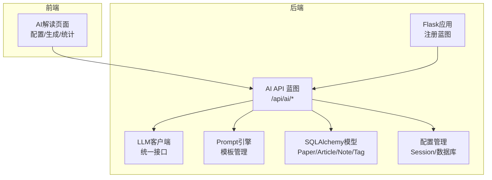
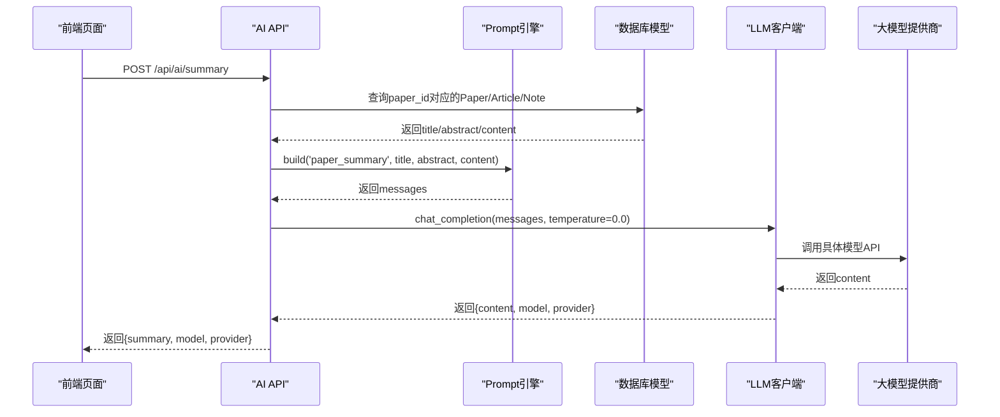
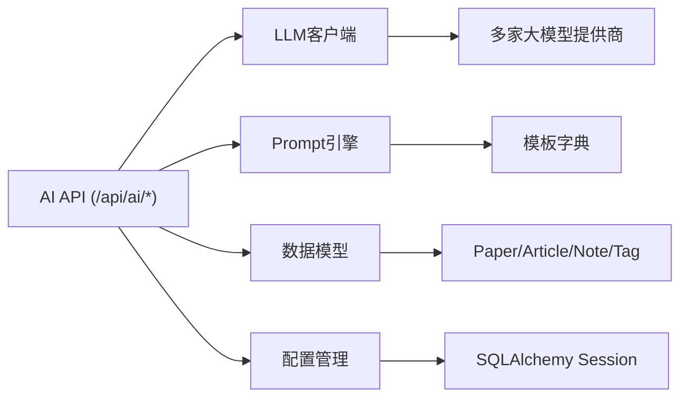

# 论文AI解读

<cite>
**本文档引用的文件**
- [backend/api/ai.py](file://backend/api/ai.py)
- [backend/services/llm_client.py](file://backend/services/llm_client.py)
- [backend/services/prompt_engine.py](file://backend/services/prompt_engine.py)
- [backend/models/paper.py](file://backend/models/paper.py)
- [backend/config.py](file://backend/config.py)
- [specs/backend/api/ai.yml](file://specs/backend/api/ai.yml)
- [specs/backend/services/prompt_engine.yml](file://specs/backend/services/prompt_engine.yml)
- [specs/frontend/pages/ai_interpret.yml](file://specs/frontend/pages/ai_interpret.yml)
- [README.md](file://README.md)
- [backend/app.py](file://backend/app.py)
- [backend/requirements.txt](file://backend/requirements.txt)
</cite>

## 目录
1. [简介](#简介)
2. [项目结构](#项目结构)
3. [核心组件](#核心组件)
4. [架构总览](#架构总览)
5. [详细组件分析](#详细组件分析)
6. [依赖关系分析](#依赖关系分析)
7. [性能考虑](#性能考虑)
8. [故障排查指南](#故障排查指南)
9. [结论](#结论)
10. [附录](#附录)

## 简介
本文件面向PaperHub论文AI解读功能，系统性说明从内容预处理、Prompt构建到大模型调用的完整流程，涵盖支持的内容来源（论文、文章、笔记）、参数传递机制、结果处理与质量控制、长度限制与格式标准化、错误处理与重试机制以及性能优化策略。同时提供使用示例与集成指南，帮助开发者与使用者高效、稳定地使用AI解读能力。

## 项目结构
PaperHub后端采用Flask + SQLAlchemy架构，AI解读功能位于后端API层，通过统一的LLM客户端封装多家大模型提供商，Prompt模板引擎集中管理提示词模板，数据模型支持论文、文章、笔记三种内容来源。

图表来源
- [backend/app.py:140-158](file://backend/app.py#L140-L158)
- [backend/api/ai.py:7-31](file://backend/api/ai.py#L7-L31)
- [backend/services/llm_client.py:198-556](file://backend/services/llm_client.py#L198-L556)
- [backend/services/prompt_engine.py:92-109](file://backend/services/prompt_engine.py#L92-L109)
- [backend/models/paper.py:120-293](file://backend/models/paper.py#L120-L293)
- [backend/config.py:105-134](file://backend/config.py#L105-L134)

章节来源
- [backend/app.py:140-158](file://backend/app.py#L140-L158)
- [README.md:402-431](file://README.md#L402-L431)

## 核心组件
- AI API蓝图：提供配置、摘要生成、标签推荐、相关性分析、用量统计与缓存清空等接口。
- LLM客户端：统一抽象多家大模型提供商（豆包、OpenAI、通义千问、Anthropic、TEG等），内置缓存、用量统计与安全配置加载。
- Prompt引擎：集中管理paper_summary/auto_tag/related_content/note_summary等模板，支持变量替换与内容截断。
- 数据模型：Paper/Article/Note/Tag四类实体，支持多对多标签关联与跨模块关联。
- 配置管理：全局数据库会话工厂、安全配置加载（.env与环境变量）。

章节来源
- [backend/api/ai.py:79-281](file://backend/api/ai.py#L79-L281)
- [backend/services/llm_client.py:198-556](file://backend/services/llm_client.py#L198-L556)
- [backend/services/prompt_engine.py:6-89](file://backend/services/prompt_engine.py#L6-L89)
- [backend/models/paper.py:120-293](file://backend/models/paper.py#L120-L293)
- [backend/config.py:105-134](file://backend/config.py#L105-L134)

## 架构总览
AI解读的整体调用链路如下：

图表来源
- [backend/api/ai.py:79-139](file://backend/api/ai.py#L79-L139)
- [backend/services/prompt_engine.py:92-105](file://backend/services/prompt_engine.py#L92-L105)
- [backend/services/llm_client.py:247-278](file://backend/services/llm_client.py#L247-L278)

## 详细组件分析

### AI API接口层
- 配置接口
  - POST /api/ai/config：设置provider、api_key、base_url、model_id、temperature；GET /api/ai/config：查询当前配置。
  - GET /api/ai/stats：查询Token用量与估算成本。
  - POST /api/ai/clear-cache：清空LLM缓存。
- 摘要生成接口
  - POST /api/ai/summary：支持paper_id或title任一必填；source可选为paper/article/note；自动截断content前3000字符；temperature固定为0.0以提升稳定性。
- 标签推荐接口
  - POST /api/ai/recommend-tags：支持paper_id或title任一必填；existing_tags可选；返回JSON结构recommended_tags/new_tags/reason。
- 相关性分析接口
  - POST /api/ai/related：支持current_id或title任一必填；candidate_ids为候选内容ID数组；返回JSON结构的关联列表。
- 参数与错误处理
  - 缺少API Key：返回400错误，提示先配置API Key。
  - 内容不存在：返回404错误。
  - LLM调用异常：捕获异常并返回500错误，包含错误信息。
  - 标签/相关性JSON解析失败：标签接口返回空列表与解析失败提示；相关性接口返回前3个候选的默认评分与理由。

章节来源
- [backend/api/ai.py:42-70](file://backend/api/ai.py#L42-L70)
- [backend/api/ai.py:79-139](file://backend/api/ai.py#L79-L139)
- [backend/api/ai.py:142-210](file://backend/api/ai.py#L142-L210)
- [backend/api/ai.py:213-281](file://backend/api/ai.py#L213-L281)
- [specs/backend/api/ai.yml:63-181](file://specs/backend/api/ai.yml#L63-L181)

### Prompt引擎
- 模板类型
  - paper_summary：论文摘要解读模板，要求输出核心创新点、关键数据与实验结论、对算法工程师的启发点。
  - auto_tag：智能标签推荐模板，要求输出JSON结构的recommended_tags/new_tags/reason。
  - related_content：相关性分析模板，要求输出JSON结构的关联列表。
  - note_summary：笔记总结模板。
- 变量注入与截断
  - 支持title、abstract、content、content_preview、existing_tags、candidates等变量。
  - content前3000字符、content_preview前2000字符自动截断，避免超出模型输入长度限制。
  - 模板变量缺失时保留占位符，保证能正常调用。

章节来源
- [backend/services/prompt_engine.py:6-89](file://backend/services/prompt_engine.py#L6-L89)
- [specs/backend/services/prompt_engine.yml:12-18](file://specs/backend/services/prompt_engine.yml#L12-L18)

### LLM客户端
- 多提供商支持
  - doubao、openai、anthropic、qwen、teg等；支持自定义base_url与model_id。
- 安全配置
  - 优先从环境变量LLM_API_KEY/LLM_PROVIDER/LLM_BASE_URL/LLM_MODEL加载；若未配置则生成.env示例文件。
- 缓存与用量统计
  - 基于消息内容、temperature、max_tokens生成缓存键，命中则直接返回缓存结果。
  - 统计prompt_tokens、completion_tokens、调用次数与按提供商计价的总成本。
- 调用流程
  - chat_completion：根据provider选择具体调用方法，统一返回content、model、provider及tokens。
  - _call_*系列方法：封装各提供商API调用，包含超时与异常处理。
- 图像输入
  - chat_with_image：支持图片URL输入，兼容teg调用方式。

章节来源
- [backend/services/llm_client.py:18-93](file://backend/services/llm_client.py#L18-L93)
- [backend/services/llm_client.py:198-556](file://backend/services/llm_client.py#L198-L556)
- [backend/services/llm_client.py:562-590](file://backend/services/llm_client.py#L562-L590)

### 数据模型与内容来源
- Paper/Article/Note/Tag四类实体，支持多对多标签关联与跨模块关联。
- AI接口支持三种内容来源：
  - paper：默认来源，查询Paper表。
  - article：查询Article表（非删除状态）。
  - note：查询Note表（非删除状态）。
- 字段映射：title、abstract、content分别来自对应实体的字段；content在摘要生成中自动截断。

章节来源
- [backend/models/paper.py:120-293](file://backend/models/paper.py#L120-L293)
- [backend/api/ai.py:95-109](file://backend/api/ai.py#L95-L109)

### 配置管理
- 全局数据库会话工厂：init_db/get_session/get_scoped_session，确保连接池与线程安全。
- get_session：每次调用返回新的Session实例，调用方需负责关闭。
- get_scoped_session：线程安全的ScopedSession，使用完毕需remove()清理。

章节来源
- [backend/config.py:85-134](file://backend/config.py#L85-L134)

## 依赖关系分析

图表来源
- [backend/api/ai.py:7-31](file://backend/api/ai.py#L7-L31)
- [backend/services/llm_client.py:198-556](file://backend/services/llm_client.py#L198-L556)
- [backend/services/prompt_engine.py:92-109](file://backend/services/prompt_engine.py#L92-L109)
- [backend/models/paper.py:120-293](file://backend/models/paper.py#L120-L293)
- [backend/config.py:105-134](file://backend/config.py#L105-L134)

章节来源
- [backend/app.py:140-158](file://backend/app.py#L140-L158)
- [backend/requirements.txt:1-15](file://backend/requirements.txt#L1-15)

## 性能考虑
- 缓存策略
  - LLM客户端对相同messages、temperature、max_tokens进行MD5缓存，显著降低重复调用成本。
  - 前端页面支持“清空缓存”按钮，便于调试与一致性验证。
- 输入长度控制
  - 摘要生成对content截断前3000字符，标签推荐对content_preview截断前2000字符，避免超限。
- 超时与重试
  - 各提供商调用设置合理超时；teg调用内部实现最多3次重试，等待响应或空内容时自动退避。
- 用量统计
  - 统计prompt_tokens、completion_tokens与按提供商计价的总成本，便于成本控制与优化。

章节来源
- [backend/services/llm_client.py:254-278](file://backend/services/llm_client.py#L254-L278)
- [specs/backend/api/ai.yml:105](file://specs/backend/api/ai.yml#L105)
- [specs/backend/api/ai.yml:149](file://specs/backend/api/ai.yml#L149)

## 故障排查指南
- API Key未配置
  - 现象：调用摘要/标签/相关性接口返回400错误，提示先配置API Key。
  - 处理：通过POST /api/ai/config设置provider、api_key、base_url、model_id、temperature；或在.env中配置LLM_*变量。
- 内容不存在
  - 现象：传入paper_id但查不到对应Paper/Article/Note（非删除状态）时返回404。
  - 处理：确认paper_id正确且内容未被删除；或直接传入title/abstract/content。
- LLM调用失败
  - 现象：返回500错误，包含错误信息；标签/相关性JSON解析失败时返回默认结构。
  - 处理：检查网络连通性、提供商可用性与API Key有效性；必要时清空缓存后重试。
- 结果格式异常
  - 现象：标签/相关性接口返回空列表或默认评分。
  - 处理：检查Prompt模板变量是否完整；适当缩短content/content_preview；调整temperature。
- 性能问题
  - 现象：接口响应慢。
  - 处理：启用缓存、减少重复调用；检查提供商限流与超时设置；优化content长度。

章节来源
- [backend/api/ai.py:114-134](file://backend/api/ai.py#L114-L134)
- [backend/api/ai.py:180-210](file://backend/api/ai.py#L180-L210)
- [backend/api/ai.py:247-281](file://backend/api/ai.py#L247-L281)
- [backend/services/llm_client.py:114-195](file://backend/services/llm_client.py#L114-L195)

## 结论
PaperHub的AI解读功能通过统一的LLM客户端与Prompt引擎，实现了对论文、文章、笔记的高质量解读与标签推荐。其设计强调安全性（配置加载与错误处理）、可扩展性（多提供商支持与模板化）、可观测性（用量统计与缓存）与易用性（简洁的API与前端页面）。结合长度限制与重试机制，能够在保证质量的同时兼顾性能与稳定性。

## 附录

### 使用示例
- 配置AI提供商
  - 请求：POST /api/ai/config
  - 参数：provider、api_key、base_url、model_id、temperature
  - 返回：配置成功信息与当前provider
- 生成论文摘要
  - 请求：POST /api/ai/summary
  - 参数：paper_id或title任一必填；source可选；content可选（将被截断）
  - 返回：summary、model、provider
- 智能标签推荐
  - 请求：POST /api/ai/recommend-tags
  - 参数：paper_id或title任一必填；existing_tags可选
  - 返回：recommended_tags、new_tags、reason
- 相关性分析
  - 请求：POST /api/ai/related
  - 参数：current_id或title任一必填；candidate_ids为候选ID数组
  - 返回：related列表（包含id、title、relevance_score、reason）

章节来源
- [specs/backend/api/ai.yml:63-181](file://specs/backend/api/ai.yml#L63-L181)
- [specs/frontend/pages/ai_interpret.yml:35-47](file://specs/frontend/pages/ai_interpret.yml#L35-L47)

### 集成指南
- 后端依赖安装
  - 在backend目录执行：pip install -r requirements.txt
- 启动后端服务
  - 在backend目录执行：python app.py
  - 默认访问地址：http://localhost:5799
- 前端页面
  - 页面描述与API依赖见specs/frontend/pages/ai_interpret.yml
  - 页面规则：API Key未配置提示、AI调用超时自动重试、内容截断提示、缓存命中提示等

章节来源
- [backend/requirements.txt:1-15](file://backend/requirements.txt#L1-15)
- [backend/app.py:220-234](file://backend/app.py#L220-L234)
- [specs/frontend/pages/ai_interpret.yml:1-48](file://specs/frontend/pages/ai_interpret.yml#L1-L48)