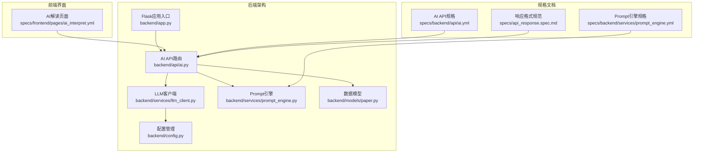
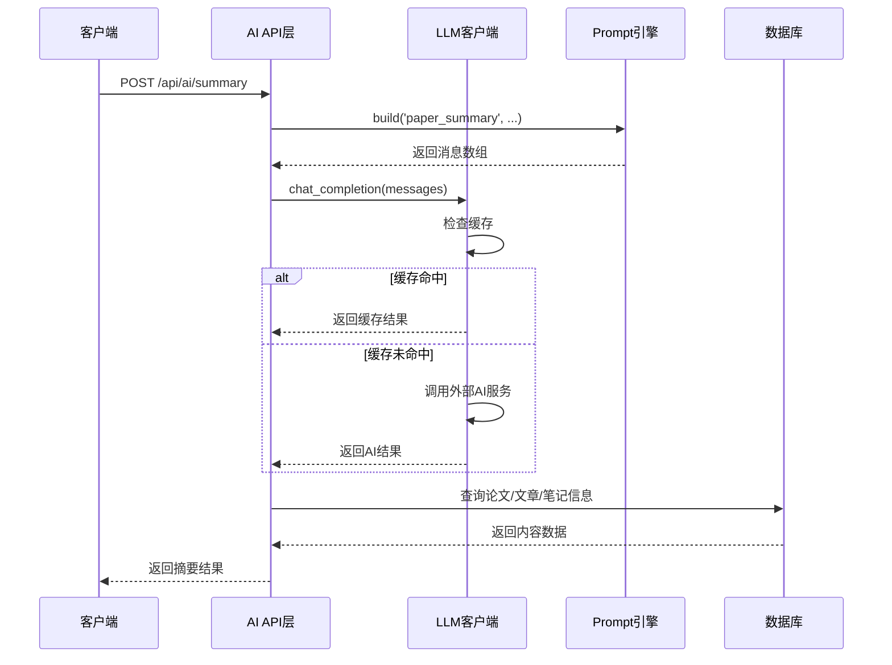
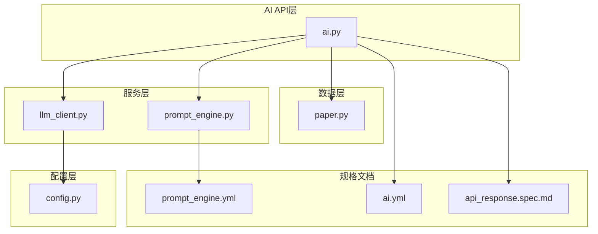
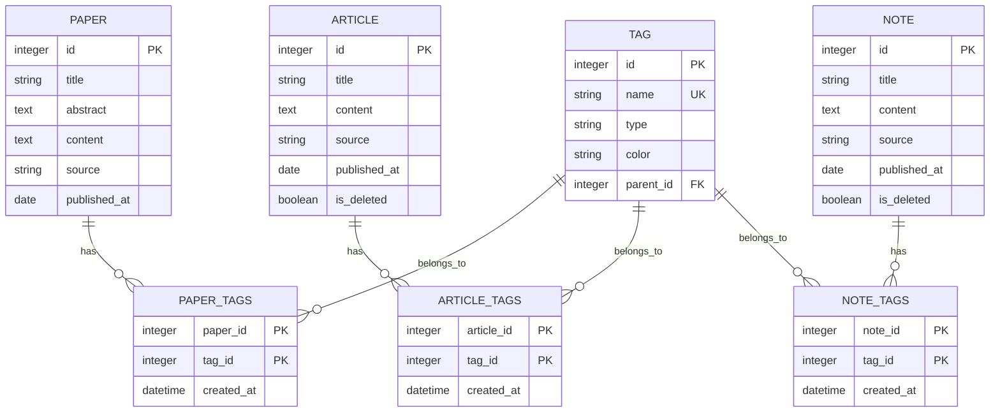

# AI功能API

<cite>
**本文档引用的文件**
- [backend/api/ai.py](file://backend/api/ai.py)
- [backend/services/llm_client.py](file://backend/services/llm_client.py)
- [backend/services/prompt_engine.py](file://backend/services/prompt_engine.py)
- [backend/models/paper.py](file://backend/models/paper.py)
- [specs/backend/api/ai.yml](file://specs/backend/api/ai.yml)
- [specs/backend/services/prompt_engine.yml](file://specs/backend/services/prompt_engine.yml)
- [specs/frontend/pages/ai_interpret.yml](file://specs/frontend/pages/ai_interpret.yml)
- [specs/api_response.spec.md](file://specs/api_response.spec.md)
- [backend/app.py](file://backend/app.py)
- [backend/config.py](file://backend/config.py)
</cite>

## 目录
1. [简介](#简介)
2. [项目结构](#项目结构)
3. [核心组件](#核心组件)
4. [架构概览](#架构概览)
5. [详细组件分析](#详细组件分析)
6. [依赖关系分析](#依赖关系分析)
7. [性能考虑](#性能考虑)
8. [故障排除指南](#故障排除指南)
9. [结论](#结论)
10. [附录](#附录)

## 简介
本文件为PaperHub项目中的AI功能API提供完整的接口文档。PaperHub是一个集成了AI辅助功能的论文管理系统，支持论文AI解读、标签推荐、摘要生成等核心AI功能。本文档详细说明了AI配置管理、模型选择、用量统计等功能的API使用方法，并提供了完整的API测试示例和最佳实践指南。

## 项目结构
PaperHub项目采用Flask框架构建，AI功能主要集中在后端的API层和业务服务层：



**图表来源**
- [backend/app.py:140-158](file://backend/app.py#L140-L158)
- [backend/api/ai.py:1-288](file://backend/api/ai.py#L1-L288)
- [backend/services/llm_client.py:198-590](file://backend/services/llm_client.py#L198-L590)

**章节来源**
- [backend/app.py:140-158](file://backend/app.py#L140-L158)
- [backend/api/ai.py:1-288](file://backend/api/ai.py#L1-L288)

## 核心组件
PaperHub的AI功能由四个核心组件构成：

### 1. AI API层
负责对外提供RESTful API接口，处理HTTP请求和响应，协调各个服务组件。

### 2. LLM客户端
封装了多种AI提供商的统一接口，支持OpenAI、豆包、Anthropic、通义千问等多种模型。

### 3. Prompt引擎
集中管理AI提示词模板，支持论文摘要、智能标签推荐、相关性分析等预设模板。

### 4. 数据模型层
提供论文、文章、笔记等数据实体的ORM映射，支持AI功能的数据访问。

**章节来源**
- [backend/api/ai.py:10-39](file://backend/api/ai.py#L10-L39)
- [backend/services/llm_client.py:198-590](file://backend/services/llm_client.py#L198-L590)
- [backend/services/prompt_engine.py:92-109](file://backend/services/prompt_engine.py#L92-L109)

## 架构概览
PaperHub的AI功能采用分层架构设计，确保了良好的可扩展性和维护性：



**图表来源**
- [backend/api/ai.py:79-139](file://backend/api/ai.py#L79-L139)
- [backend/services/llm_client.py:247-278](file://backend/services/llm_client.py#L247-L278)
- [backend/services/prompt_engine.py:92-105](file://backend/services/prompt_engine.py#L92-L105)

## 详细组件分析

### AI配置管理API

#### 配置AI服务提供商
支持动态配置AI服务提供商、API密钥、基础URL、模型ID和温度参数。

**接口规范**
- 方法：POST
- 路径：`/api/ai/config`
- 请求体参数：
  - `provider` (string, 可选): AI服务提供商，默认'doubao'
  - `api_key` (string, 必填): API密钥
  - `base_url` (string, 可选): 自定义基础URL
  - `model_id` (string, 可选): 模型ID
  - `temperature` (float, 可选): 采样温度，默认0

**响应格式**
```json
{
  "code": 0,
  "data": {
    "message": "AI configured successfully",
    "provider": "doubao"
  },
  "msg": "success"
}
```

**错误处理**
- 40002: API密钥缺失

**章节来源**
- [specs/backend/api/ai.yml:4-43](file://specs/backend/api/ai.yml#L4-L43)
- [backend/api/ai.py:42-57](file://backend/api/ai.py#L42-L57)

#### 获取AI配置状态
查询当前AI配置的详细信息。

**接口规范**
- 方法：GET
- 路径：`/api/ai/config`
- 响应数据：
  - `provider`: 当前提供商
  - `has_api_key`: 是否已配置API密钥
  - `api_key`: API密钥（脱敏显示）
  - `base_url`: 基础URL
  - `model_id`: 模型ID
  - `temperature`: 温度参数

**章节来源**
- [specs/backend/api/ai.yml:44-55](file://specs/backend/api/ai.yml#L44-L55)
- [backend/api/ai.py:60-70](file://backend/api/ai.py#L60-L70)

### AI用量统计API

#### 获取调用统计
查询AI服务的Token用量和费用统计信息。

**接口规范**
- 方法：GET
- 路径：`/api/ai/stats`
- 响应数据：
  - `prompt_tokens`: 提示Token总数
  - `completion_tokens`: 生成Token总数
  - `total_cost`: 总费用（元）
  - `call_count`: 调用次数
  - `estimated_cost_yuan`: 预估费用（元）

**章节来源**
- [specs/backend/api/ai.yml:56-62](file://specs/backend/api/ai.yml#L56-L62)
- [backend/api/ai.py:73-76](file://backend/api/ai.py#L73-L76)
- [backend/services/llm_client.py:531-535](file://backend/services/llm_client.py#L531-L535)

### 论文摘要生成API

#### 生成内容摘要
为论文、文章或笔记生成AI摘要解读。

**接口规范**
- 方法：POST
- 路径：`/api/ai/summary`
- 请求体参数：
  - `paper_id` (integer, 可选): 内容主体ID
  - `source` (string, 可选): 内容类型，可选值：paper/article/note，默认'paper'
  - `title` (string, 可选): 手动输入标题
  - `abstract` (string, 可选): 手动输入摘要
  - `content` (string, 可选): 手动输入内容

**响应数据**
- `summary`: 生成的摘要内容
- `model`: 使用的模型名称
- `provider`: AI提供商

**规则说明**
- 自动截断内容前3000字符
- 支持从数据库查询内容或直接传入内容参数

**章节来源**
- [specs/backend/api/ai.yml:63-98](file://specs/backend/api/ai.yml#L63-L98)
- [backend/api/ai.py:79-139](file://backend/api/ai.py#L79-L139)

### 智能标签推荐API

#### AI智能推荐标签
基于内容自动生成标签推荐。

**接口规范**
- 方法：POST
- 路径：`/api/ai/recommend-tags`
- 请求体参数：
  - `paper_id` (integer, 可选): 内容ID
  - `source` (string, 可选): 内容类型，可选值：paper/article，默认'paper'
  - `title` (string, 可选): 手动输入标题
  - `abstract` (string, 可选): 手动输入摘要
  - `content` (string, 可选): 手动输入内容
  - `existing_tags` (array, 可选): 现有标签列表

**响应数据**
- `recommended_tags`: 推荐的现有标签
- `new_tags`: 新建标签建议
- `reason`: 推荐理由

**章节来源**
- [specs/backend/api/ai.yml:106-146](file://specs/backend/api/ai.yml#L106-L146)
- [backend/api/ai.py:142-211](file://backend/api/ai.py#L142-L211)

### 相关性分析API

#### AI分析相关性推荐
分析内容间的相关性并推荐关联内容。

**接口规范**
- 方法：POST
- 路径：`/api/ai/related`
- 请求体参数：
  - `current_id` (integer, 可选): 当前内容ID
  - `title` (string, 可选): 当前标题
  - `abstract` (string, 可选): 当前摘要
  - `candidate_ids` (array, 可选): 候选内容ID数组

**响应数据**
- `related`: 相关内容推荐列表，每个元素包含：
  - `id`: 内容ID
  - `title`: 标题
  - `relevance_score`: 相关性分数（0-100）
  - `reason`: 关联理由

**章节来源**
- [specs/backend/api/ai.yml:150-179](file://specs/backend/api/ai.yml#L150-L179)
- [backend/api/ai.py:213-281](file://backend/api/ai.py#L213-L281)

### 缓存管理API

#### 清空AI缓存
清除LLM客户端的缓存数据。

**接口规范**
- 方法：POST
- 路径：`/api/ai/clear-cache`
- 响应数据：
  - `message`: "Cache cleared"

**章节来源**
- [specs/backend/api/ai.yml:182-189](file://specs/backend/api/ai.yml#L182-L189)
- [backend/api/ai.py:284-287](file://backend/api/ai.py#L284-L287)

## 依赖关系分析

### 组件依赖图


**图表来源**
- [backend/api/ai.py:10-39](file://backend/api/ai.py#L10-L39)
- [backend/services/llm_client.py:198-590](file://backend/services/llm_client.py#L198-L590)
- [backend/services/prompt_engine.py:92-109](file://backend/services/prompt_engine.py#L92-L109)

### 数据模型关系


**图表来源**
- [backend/models/paper.py:18-39](file://backend/models/paper.py#L18-L39)
- [backend/models/paper.py:93-106](file://backend/models/paper.py#L93-L106)
- [backend/models/paper.py:120-147](file://backend/models/paper.py#L120-L147)
- [backend/models/paper.py:191-244](file://backend/models/paper.py#L191-L244)
- [backend/models/paper.py:250-293](file://backend/models/paper.py#L250-L293)

**章节来源**
- [backend/models/paper.py:18-39](file://backend/models/paper.py#L18-L39)
- [backend/models/paper.py:93-106](file://backend/models/paper.py#L93-L106)
- [backend/models/paper.py:120-147](file://backend/models/paper.py#L120-L147)

## 性能考虑

### 缓存策略
LLM客户端实现了智能缓存机制，通过MD5哈希生成缓存键，避免重复调用相同的API请求。

**缓存特性**
- 基于消息内容、温度参数和最大token数生成唯一缓存键
- 支持手动清空缓存
- 减少API调用次数，降低延迟

### 连接池管理
数据库连接采用SQLAlchemy连接池管理，支持并发访问和连接复用。

**连接池配置**
- 连接池大小：5
- 最大溢出连接数：10
- 连接回收时间：3600秒
- 获取连接超时：30秒

### 错误处理和重试
AI调用失败时提供重试机制，支持最多3次重试调用。

**重试策略**
- 调用失败时自动重试
- 每次重试间隔20秒
- 支持多种AI提供商的统一错误处理

**章节来源**
- [backend/services/llm_client.py:218-233](file://backend/services/llm_client.py#L218-L233)
- [backend/services/llm_client.py:379-381](file://backend/services/llm_client.py#L379-L381)
- [backend/config.py:92-103](file://backend/config.py#L92-L103)
- [backend/services/llm_client.py:114-194](file://backend/services/llm_client.py#L114-L194)

## 故障排除指南

### 常见错误及解决方案

#### API Key配置问题
**症状**：返回"API key not configured"错误
**解决方案**：
1. 通过POST `/api/ai/config`接口配置API Key
2. 检查.env文件或环境变量设置
3. 验证API Key的有效性

#### 内容不存在错误
**症状**：返回"Content not found"错误
**解决方案**：
1. 确认paper_id或title参数正确
2. 检查数据库中是否存在对应记录
3. 验证source参数是否正确

#### AI调用失败
**症状**：返回"AI调用失败"错误
**解决方案**：
1. 检查网络连接和API服务可用性
2. 验证AI提供商配置
3. 查看服务器日志获取详细错误信息

### 调试工具
- 使用`/api/ai/stats`接口查看调用统计
- 通过`/api/ai/clear-cache`清理缓存
- 检查服务器端日志获取详细错误堆栈

**章节来源**
- [backend/api/ai.py:88-134](file://backend/api/ai.py#L88-L134)
- [backend/api/ai.py:151-195](file://backend/api/ai.py#L151-L195)
- [backend/api/ai.py:221-266](file://backend/api/ai.py#L221-L266)

## 结论
PaperHub的AI功能API提供了完整的论文管理和智能辅助能力。通过统一的接口设计、灵活的配置管理和高效的缓存机制，实现了稳定可靠的AI服务集成。文档中详细说明了所有API接口的使用方法、参数规范和错误处理策略，为开发者提供了完整的集成指南。

## 附录

### API测试示例

#### 配置AI服务
```bash
curl -X POST http://localhost:5899/api/ai/config \
  -H "Content-Type: application/json" \
  -d '{
    "provider": "doubao",
    "api_key": "your-api-key",
    "base_url": "",
    "model_id": "",
    "temperature": 0
  }'
```

#### 生成论文摘要
```bash
curl -X POST http://localhost:5899/api/ai/summary \
  -H "Content-Type: application/json" \
  -d '{
    "paper_id": 123,
    "source": "paper"
  }'
```

#### 获取标签推荐
```bash
curl -X POST http://localhost:5899/api/ai/recommend-tags \
  -H "Content-Type: application/json" \
  -d '{
    "paper_id": 123,
    "existing_tags": ["机器学习", "深度学习"]
  }'
```

### 最佳实践指南

#### Prompt工程建议
1. **明确角色定位**：在system提示词中清晰定义AI的角色和职责
2. **结构化输出**：使用JSON格式要求AI输出结构化数据
3. **上下文控制**：合理控制输入内容长度，避免超出模型限制
4. **温度参数调优**：根据任务类型选择合适的temperature值

#### 性能优化建议
1. **缓存策略**：充分利用内置缓存机制，减少重复调用
2. **批量处理**：对于大量内容处理，考虑批量API调用
3. **连接池优化**：合理配置数据库连接池参数
4. **错误重试**：实现指数退避的重试机制

#### 安全注意事项
1. **API Key保护**：确保API Key的安全存储和传输
2. **输入验证**：对所有用户输入进行严格的验证和过滤
3. **速率限制**：实现合理的调用频率限制
4. **日志审计**：记录关键操作日志，便于问题追踪

**章节来源**
- [specs/frontend/pages/ai_interpret.yml:35-47](file://specs/frontend/pages/ai_interpret.yml#L35-L47)
- [specs/backend/services/prompt_engine.yml:12-18](file://specs/backend/services/prompt_engine.yml#L12-L18)