# API接口文档

<cite>
**本文档引用的文件**
- [backend/app.py](file://backend/app.py)
- [backend/config.py](file://backend/config.py)
- [backend/api/papers.py](file://backend/api/papers.py)
- [backend/api/articles.py](file://backend/api/articles.py)
- [backend/api/notes.py](file://backend/api/notes.py)
- [specs/backend/api/papers.yml](file://specs/backend/api/papers.yml)
- [specs/backend/api/articles.yml](file://specs/backend/api/articles.yml)
- [specs/backend/api/notes.yml](file://specs/backend/api/notes.yml)
- [specs/backend/api/search.yml](file://specs/backend/api/search.yml)
- [specs/backend/api/ai.yml](file://specs/backend/api/ai.yml)
- [specs/backend/api/ingest.yml](file://specs/backend/api/ingest.yml)
- [specs/backend/api/note_images.yml](file://specs/backend/api/note_images.yml)
- [specs/backend/api/backup.yml](file://specs/backend/api/backup.yml)
</cite>

## 目录
1. [简介](#简介)
2. [项目结构](#项目结构)
3. [核心组件](#核心组件)
4. [架构总览](#架构总览)
5. [详细组件分析](#详细组件分析)
6. [依赖关系分析](#依赖关系分析)
7. [性能考虑](#性能考虑)
8. [故障排除指南](#故障排除指南)
9. [结论](#结论)
10. [附录](#附录)

## 简介
本文件为 PaperHub 后端的完整 API 接口文档，覆盖论文管理、文章管理、笔记管理、AI 功能、搜索系统、数据导入、图片上传等全部 RESTful 接口。文档包含：
- 接口定义：HTTP 方法、URL 模式、请求参数、响应格式、状态码
- 使用示例：基于规范文件的典型场景
- 错误处理策略与最佳实践
- 认证机制、请求限制与版本控制说明
- API 测试指南与调试技巧

## 项目结构
后端采用 Flask 架构，通过蓝图组织各模块 API，并在应用启动时注册路由。数据库使用 SQLite，配合 SQLAlchemy ORM；静态资源通过 Flask 提供。

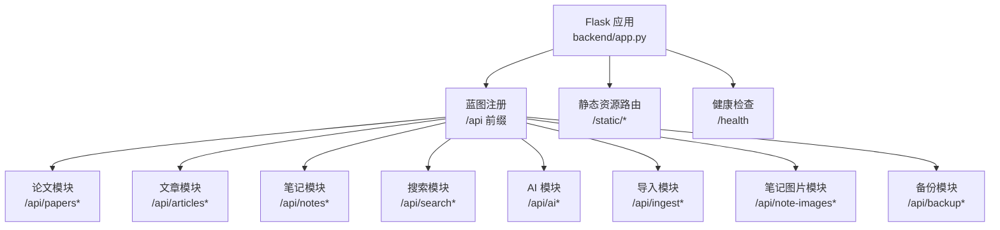

**图表来源**
- [backend/app.py:130-147](file://backend/app.py#L130-L147)
- [backend/app.py:41-127](file://backend/app.py#L41-L127)

**章节来源**
- [backend/app.py:130-147](file://backend/app.py#L130-L147)
- [backend/config.py:35-72](file://backend/config.py#L35-L72)

## 核心组件
- 论文模块：arXiv 搜索、批量导入、论文 CRUD、标签管理、关联笔记查询
- 文章模块：微信/知乎/网页文章的 CRUD、标签与论文关联、批量操作
- 笔记模块：笔记 CRUD、与论文/文章/标签的多维关联、批量操作
- 搜索模块：全文跨模块检索与联想
- AI 模块：AI 配置、用量统计、摘要/标签推荐/相关性推荐、缓存清理
- 导入模块：arXiv、对话笔记、知乎专栏、PDF/HTML、网页正文提取
- 笔记图片模块：图片上传与返回静态访问路径
- 备份模块：导出/导入/列举/删除备份

**章节来源**
- [specs/backend/api/papers.yml:1-404](file://specs/backend/api/papers.yml#L1-L404)
- [specs/backend/api/articles.yml:1-266](file://specs/backend/api/articles.yml#L1-L266)
- [specs/backend/api/notes.yml:1-378](file://specs/backend/api/notes.yml#L1-L378)
- [specs/backend/api/search.yml:1-70](file://specs/backend/api/search.yml#L1-L70)
- [specs/backend/api/ai.yml:1-190](file://specs/backend/api/ai.yml#L1-L190)
- [specs/backend/api/ingest.yml:1-273](file://specs/backend/api/ingest.yml#L1-L273)
- [specs/backend/api/note_images.yml:1-30](file://specs/backend/api/note_images.yml#L1-L30)
- [specs/backend/api/backup.yml:1-92](file://specs/backend/api/backup.yml#L1-L92)

## 架构总览
PaperHub 后端以 Flask 为核心，蓝图按功能域划分，统一通过 /api 前缀暴露 REST 接口。数据库层使用 SQLAlchemy，静态资源通过 /static/* 提供，健康检查 /health 用于服务监控。

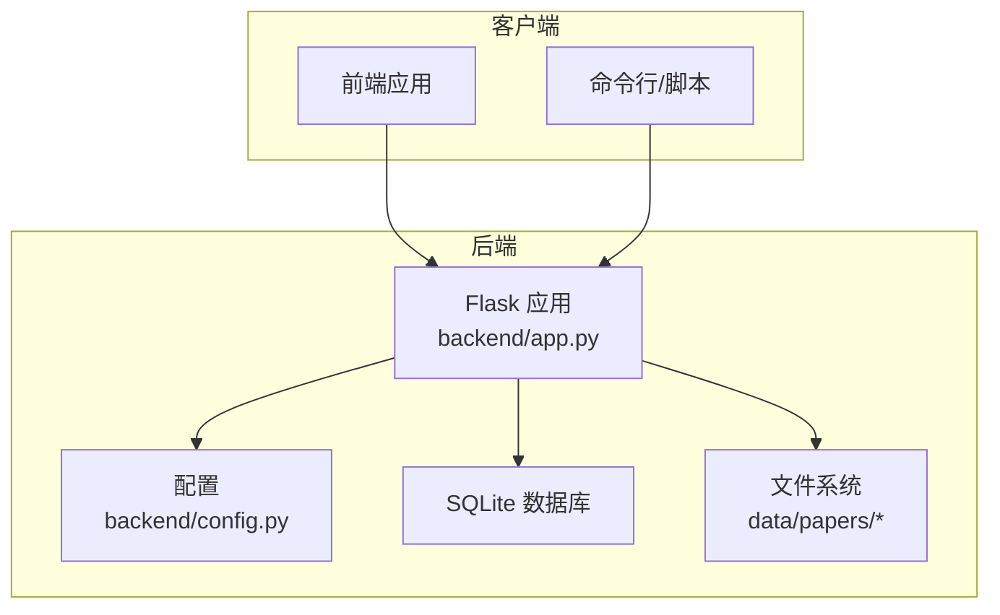

**图表来源**
- [backend/app.py:41-127](file://backend/app.py#L41-L127)
- [backend/config.py:35-72](file://backend/config.py#L35-L72)

## 详细组件分析

### 论文管理接口
- 列表与筛选：支持分页、多维度筛选（分类、状态、标星、来源、标签、日期范围等）
- 详情查询：返回论文及关联标签、文章、笔记
- 更新：支持字段增量更新，含本地文件保存开关与自动下载逻辑
- 删除：硬删除并清理本地文件（PDF/HTML、微信图片目录等）
- 标签管理：新增/移除标签，删除标签
- arXiv 搜索与批量导入：远程搜索、分类列表、批量导入并去重
- 批量更新：批量修改状态/标签/标星/删除

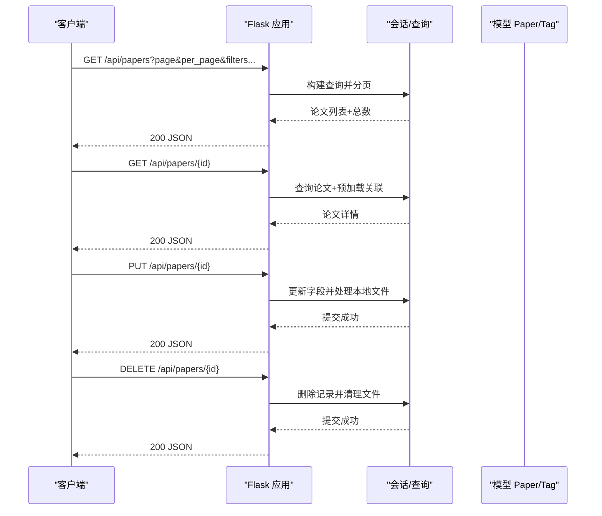

**图表来源**
- [backend/api/papers.py:29-108](file://backend/api/papers.py#L29-L108)
- [backend/api/papers.py:111-147](file://backend/api/papers.py#L111-L147)
- [backend/api/papers.py:181-253](file://backend/api/papers.py#L181-L253)
- [backend/api/papers.py:256-295](file://backend/api/papers.py#L256-L295)

**章节来源**
- [specs/backend/api/papers.yml:5-104](file://specs/backend/api/papers.yml#L5-L104)
- [specs/backend/api/papers.yml:105-232](file://specs/backend/api/papers.yml#L105-L232)
- [specs/backend/api/papers.yml:234-287](file://specs/backend/api/papers.yml#L234-L287)
- [specs/backend/api/papers.yml:289-326](file://specs/backend/api/papers.yml#L289-L326)
- [specs/backend/api/papers.yml:328-377](file://specs/backend/api/papers.yml#L328-L377)
- [specs/backend/api/papers.yml:378-404](file://specs/backend/api/papers.yml#L378-L404)
- [backend/api/papers.py:29-108](file://backend/api/papers.py#L29-L108)
- [backend/api/papers.py:111-147](file://backend/api/papers.py#L111-L147)
- [backend/api/papers.py:181-253](file://backend/api/papers.py#L181-L253)
- [backend/api/papers.py:256-295](file://backend/api/papers.py#L256-L295)
- [backend/api/papers.py:475-588](file://backend/api/papers.py#L475-L588)

### 文章管理接口
- 列表与搜索：支持来源筛选与关键词搜索
- 详情查询：返回文章及关联论文/笔记/标签
- 新增：重复检测（标题/内容/链接），返回重复信息
- 更新：支持字段增量更新
- 删除：硬删除并清理本地微信文件（HTML 与 images 目录）
- 标签与论文关联：新增/移除
- 批量操作：批量状态/标签/标星/删除

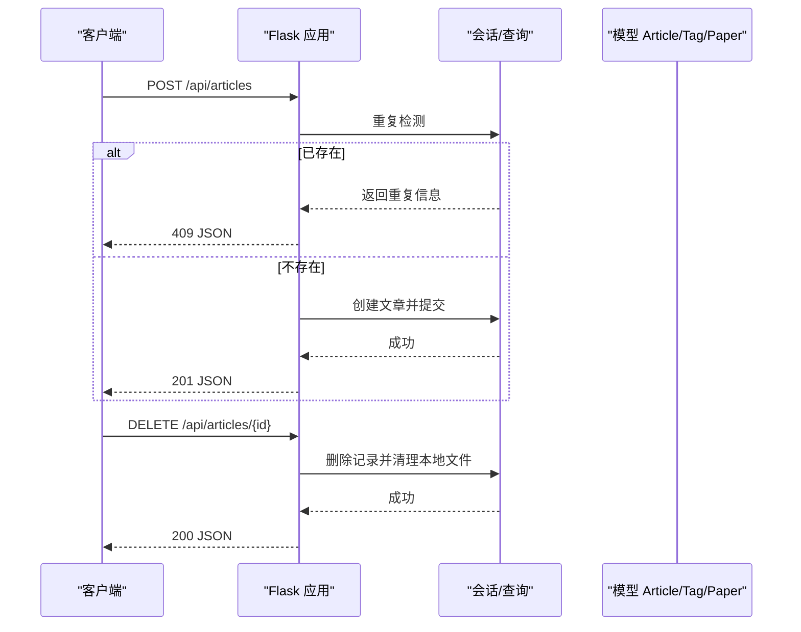

**图表来源**
- [backend/api/articles.py:81-134](file://backend/api/articles.py#L81-L134)
- [backend/api/articles.py:175-216](file://backend/api/articles.py#L175-L216)
- [backend/api/articles.py:218-278](file://backend/api/articles.py#L218-L278)
- [backend/api/articles.py:280-353](file://backend/api/articles.py#L280-L353)

**章节来源**
- [specs/backend/api/articles.yml:5-44](file://specs/backend/api/articles.yml#L5-L44)
- [specs/backend/api/articles.yml:46-169](file://specs/backend/api/articles.yml#L46-L169)
- [specs/backend/api/articles.yml:171-218](file://specs/backend/api/articles.yml#L171-L218)
- [specs/backend/api/articles.yml:220-266](file://specs/backend/api/articles.yml#L220-L266)
- [backend/api/articles.py:28-79](file://backend/api/articles.py#L28-L79)
- [backend/api/articles.py:81-134](file://backend/api/articles.py#L81-L134)
- [backend/api/articles.py:136-173](file://backend/api/articles.py#L136-L173)
- [backend/api/articles.py:175-216](file://backend/api/articles.py#L175-L216)
- [backend/api/articles.py:218-278](file://backend/api/articles.py#L218-L278)
- [backend/api/articles.py:280-353](file://backend/api/articles.py#L280-L353)
- [backend/api/articles.py:355-479](file://backend/api/articles.py#L355-L479)

### 笔记管理接口
- 列表与搜索：关键词、来源、排序、分页
- 详情查询：返回笔记及关联论文/文章/标签
- 新增：重复检测（标题/内容/链接），支持一次性关联论文/文章/标签
- 更新：支持字段增量更新（含置顶）
- 删除：硬删除并清理笔记内容中的本地图片引用
- 关联管理：论文/文章/标签的增删
- 批量操作：批量状态/标签/标星/置顶/删除

```mermaid
flowchart TD
Start(["开始"]) --> Create["POST /api/notes"]
Create --> Dedup["重复检测"]
Dedup --> Exists{"已存在？"}
Exists --> |是| ReturnDup["返回重复信息 409"]
Exists --> |否| Save["保存并关联论文/文章/标签"]
Save --> Done["返回新建笔记 201"]
Start --> Update["PUT /api/notes/{id}"]
Update --> Load["加载笔记"]
Load --> Exists2{"存在？"}
Exists2 --> |否| NotFound["返回 404"]
Exists2 --> |是| Apply["应用字段更新"]
Apply --> Commit["提交事务"]
Commit --> Ok["返回 200"]
Start --> Delete["DELETE /api/notes/{id}"]
Delete --> Clean["清理笔记内引用的本地图片"]
Clean --> Remove["删除记录"]
Remove --> Ok2["返回 200"]
```

**图表来源**
- [backend/api/notes.py:61-134](file://backend/api/notes.py#L61-L134)
- [backend/api/notes.py:156-188](file://backend/api/notes.py#L156-L188)
- [backend/api/notes.py:190-228](file://backend/api/notes.py#L190-L228)
- [backend/api/notes.py:251-305](file://backend/api/notes.py#L251-L305)
- [backend/api/notes.py:326-385](file://backend/api/notes.py#L326-L385)
- [backend/api/notes.py:408-465](file://backend/api/notes.py#L408-L465)

**章节来源**
- [specs/backend/api/notes.yml:5-44](file://specs/backend/api/notes.yml#L5-L44)
- [specs/backend/api/notes.yml:46-184](file://specs/backend/api/notes.yml#L46-L184)
- [specs/backend/api/notes.yml:186-248](file://specs/backend/api/notes.yml#L186-L248)
- [specs/backend/api/notes.yml:250-316](file://specs/backend/api/notes.yml#L250-L316)
- [specs/backend/api/notes.yml:318-378](file://specs/backend/api/notes.yml#L318-L378)
- [backend/api/notes.py:25-59](file://backend/api/notes.py#L25-L59)
- [backend/api/notes.py:61-134](file://backend/api/notes.py#L61-L134)
- [backend/api/notes.py:136-188](file://backend/api/notes.py#L136-L188)
- [backend/api/notes.py:190-228](file://backend/api/notes.py#L190-L228)
- [backend/api/notes.py:234-305](file://backend/api/notes.py#L234-L305)
- [backend/api/notes.py:311-385](file://backend/api/notes.py#L311-L385)
- [backend/api/notes.py:391-465](file://backend/api/notes.py#L391-L465)

### 搜索系统接口
- 全文搜索：支持模块范围（论文/文章/笔记）、分页、高亮
- 搜索建议：关键词联想

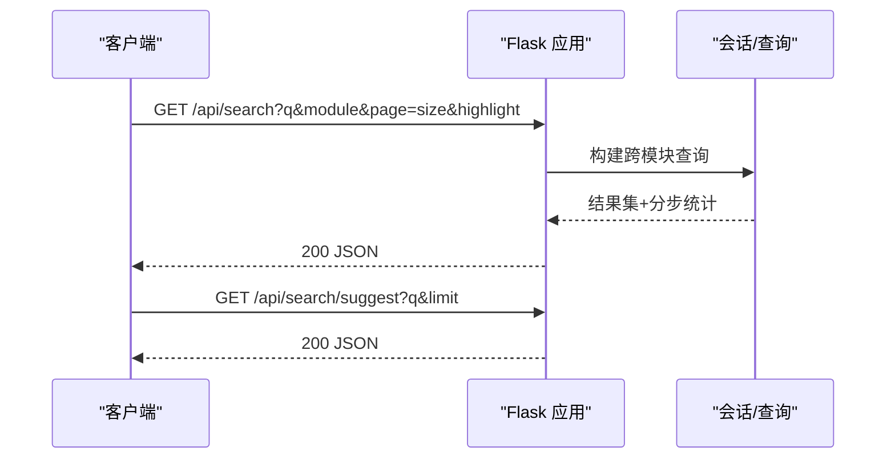

**图表来源**
- [specs/backend/api/search.yml:5-46](file://specs/backend/api/search.yml#L5-L46)
- [specs/backend/api/search.yml:48-69](file://specs/backend/api/search.yml#L48-L69)

**章节来源**
- [specs/backend/api/search.yml:1-70](file://specs/backend/api/search.yml#L1-L70)

### AI 功能接口
- 配置管理：设置/获取 AI 服务商参数（提供商、API Key、Base URL、模型ID、温度）
- 统计信息：用量统计
- 内容摘要：支持论文/文章/笔记摘要生成
- 标签推荐：AI 智能推荐标签
- 相关性推荐：基于内容的相关性推荐
- 缓存清理：清空 AI 缓存

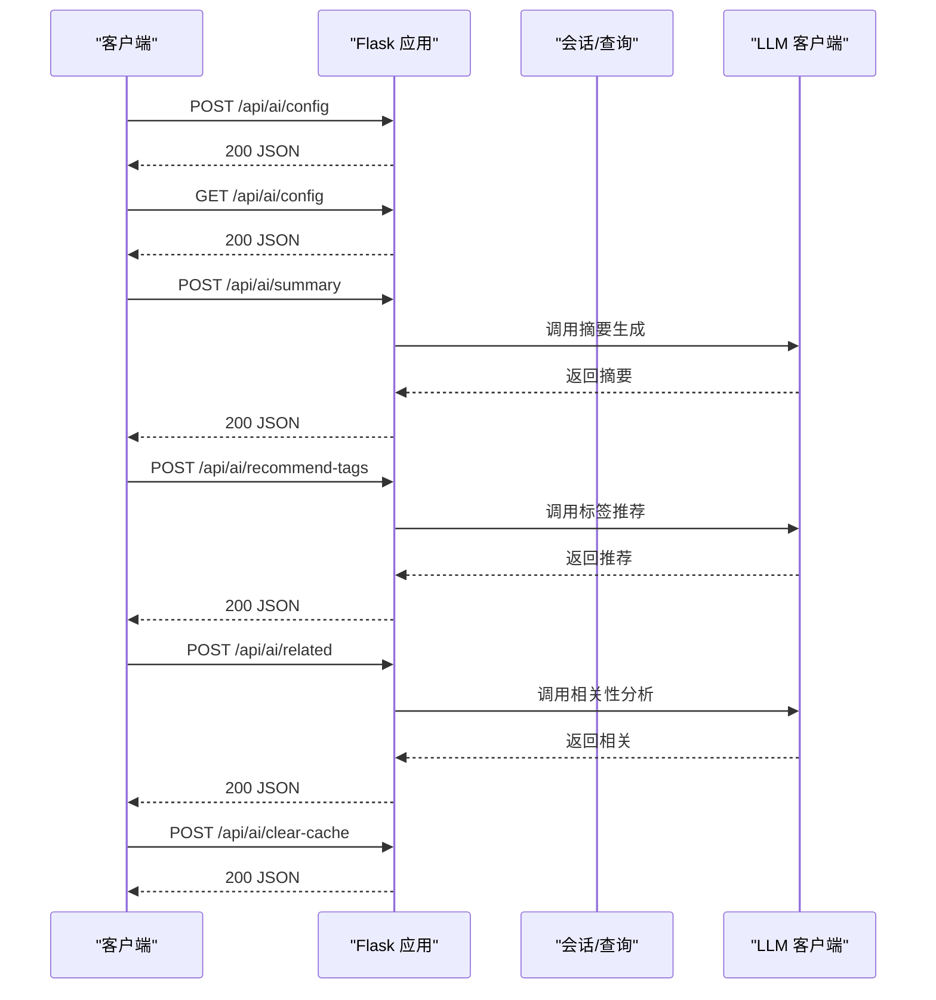

**图表来源**
- [specs/backend/api/ai.yml:5-103](file://specs/backend/api/ai.yml#L5-L103)
- [specs/backend/api/ai.yml:107-149](file://specs/backend/api/ai.yml#L107-L149)
- [specs/backend/api/ai.yml:151-181](file://specs/backend/api/ai.yml#L151-L181)

**章节来源**
- [specs/backend/api/ai.yml:1-190](file://specs/backend/api/ai.yml#L1-L190)

### 数据导入接口
- arXiv 搜索与批量导入：支持关键词、分类、日期范围、排序；批量导入并去重
- 单条导入：支持 URL 或纯 ID
- 对话笔记导入：ChatGPT/Claude 对话转笔记
- 知乎专栏导入：支持 URL 或手动粘贴
- PDF/HTML 批量上传：自动 UUID 命名，区分入库目标
- 网页正文提取：预览（不入库）与入库（确认后）

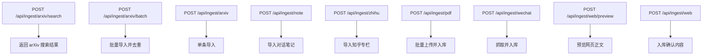

**图表来源**
- [specs/backend/api/ingest.yml:5-40](file://specs/backend/api/ingest.yml#L5-L40)
- [specs/backend/api/ingest.yml:42-64](file://specs/backend/api/ingest.yml#L42-L64)
- [specs/backend/api/ingest.yml:66-82](file://specs/backend/api/ingest.yml#L66-L82)
- [specs/backend/api/ingest.yml:84-115](file://specs/backend/api/ingest.yml#L84-L115)
- [specs/backend/api/ingest.yml:117-158](file://specs/backend/api/ingest.yml#L117-L158)
- [specs/backend/api/ingest.yml:162-185](file://specs/backend/api/ingest.yml#L162-L185)
- [specs/backend/api/ingest.yml:187-208](file://specs/backend/api/ingest.yml#L187-L208)
- [specs/backend/api/ingest.yml:210-230](file://specs/backend/api/ingest.yml#L210-L230)
- [specs/backend/api/ingest.yml:232-270](file://specs/backend/api/ingest.yml#L232-L270)

**章节来源**
- [specs/backend/api/ingest.yml:1-273](file://specs/backend/api/ingest.yml#L1-L273)

### 笔记图片上传接口
- 上传：支持 PNG/JPG/JPEG/GIF/WEBP/BMP，文件大小上限 10MB，UUID 命名
- 返回：可直接用于 Markdown 的静态访问路径

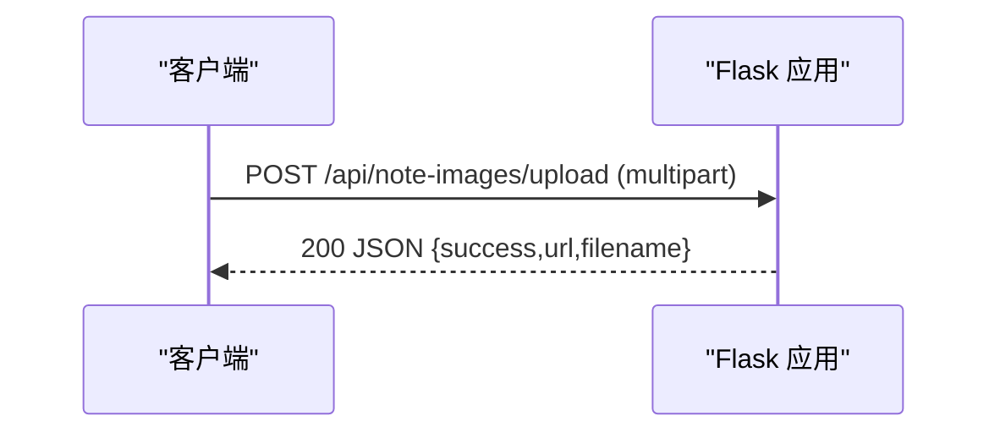

**图表来源**
- [specs/backend/api/note_images.yml:5-29](file://specs/backend/api/note_images.yml#L5-L29)

**章节来源**
- [specs/backend/api/note_images.yml:1-30](file://specs/backend/api/note_images.yml#L1-L30)

### 数据备份接口
- 导出：ZIP 压缩包，包含数据库与 data/papers/ 文件
- 导入：覆盖式恢复，自动备份当前数据库
- 列表：列出 data/backups/ 下的 .zip 文件
- 删除：校验文件名合法性，禁止路径遍历

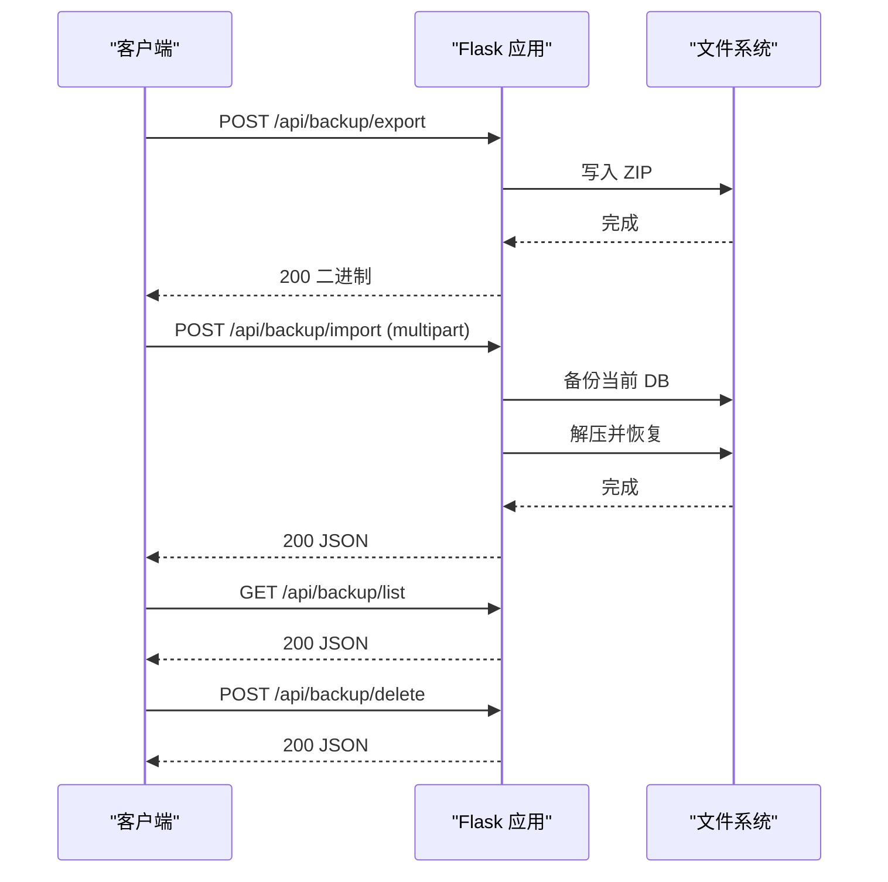

**图表来源**
- [specs/backend/api/backup.yml:5-23](file://specs/backend/api/backup.yml#L5-L23)
- [specs/backend/api/backup.yml:25-50](file://specs/backend/api/backup.yml#L25-L50)
- [specs/backend/api/backup.yml:52-65](file://specs/backend/api/backup.yml#L52-L65)
- [specs/backend/api/backup.yml:67-91](file://specs/backend/api/backup.yml#L67-L91)

**章节来源**
- [specs/backend/api/backup.yml:1-92](file://specs/backend/api/backup.yml#L1-L92)

## 依赖关系分析
- 路由注册：蓝图统一挂载到 /api 前缀，部分模块通过函数动态注册
- 数据库：全局会话工厂与线程安全作用域会话，请求结束自动清理
- 静态资源：/static/* 路由映射到 data/papers 下的子目录
- 错误处理：统一异常捕获与扫描器过滤，敏感路径返回 404

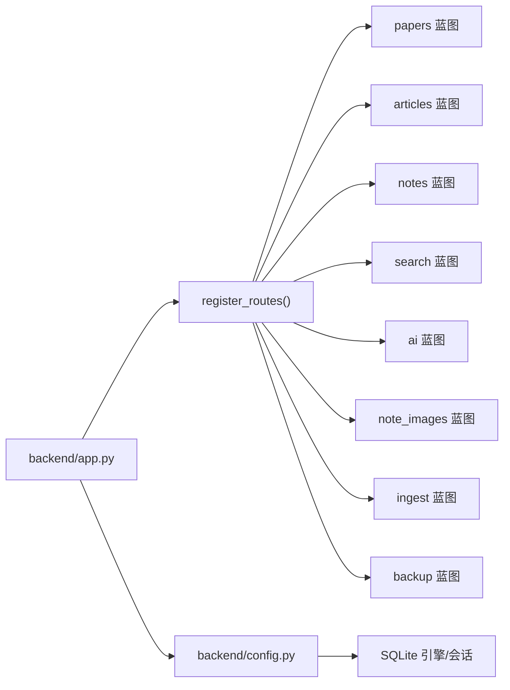

**图表来源**
- [backend/app.py:130-147](file://backend/app.py#L130-L147)
- [backend/config.py:78-132](file://backend/config.py#L78-L132)

**章节来源**
- [backend/app.py:130-147](file://backend/app.py#L130-L147)
- [backend/config.py:78-132](file://backend/config.py#L78-L132)

## 性能考虑
- 数据库连接池：连接池大小、溢出、超时与回收策略，减少锁竞争
- 分页与排序：列表接口默认按创建时间倒序，合理设置 per_page
- 关联预加载：论文详情预加载标签/文章/笔记，减少 N+1 查询
- 文件操作：删除/清理文件时进行路径校验，避免路径遍历与多余 IO
- 搜索与导入：arXiv 搜索结果上限控制，批量导入去重与事务合并提交

**章节来源**
- [backend/config.py:83-107](file://backend/config.py#L83-L107)
- [backend/api/papers.py:93-108](file://backend/api/papers.py#L93-L108)
- [backend/api/articles.py:177-216](file://backend/api/articles.py#L177-L216)
- [backend/api/notes.py:190-228](file://backend/api/notes.py#L190-L228)

## 故障排除指南
- 通用错误处理：未捕获异常统一记录日志并返回 500；扫描器过滤特定路径避免误报
- 资源不存在：返回 404，错误消息包含类型与描述
- 业务冲突：如重复创建（文章/笔记/论文）、缺少参数等，返回相应错误码与提示
- 文件清理失败：删除/清理本地文件时打印警告，不影响主流程
- CORS 与静态资源：确保前端域名在允许列表，静态资源路径正确

**章节来源**
- [backend/app.py:60-79](file://backend/app.py#L60-L79)
- [backend/api/articles.py:177-216](file://backend/api/articles.py#L177-L216)
- [backend/api/notes.py:190-228](file://backend/api/notes.py#L190-L228)
- [backend/api/papers.py:256-295](file://backend/api/papers.py#L256-L295)

## 结论
PaperHub 的 API 设计遵循 REST 规范，模块职责清晰，错误处理完善，具备良好的扩展性与可维护性。建议在生产环境中启用更严格的认证与限流策略，并结合日志与监控体系持续优化性能与稳定性。

## 附录
- 认证机制：当前实现未发现显式认证中间件，建议在网关或应用层增加鉴权
- 请求限制：未发现显式速率限制，建议引入限流与熔断保护
- 版本控制：接口未体现版本号，建议在 URL 中加入 /v1、/v2 或通过 Accept 头协商
- 测试指南：使用规范文件中的输入/输出示例编写自动化测试，覆盖正常与异常分支
- 调试技巧：利用 /health 健康检查、日志过滤（扫描器）与最小化重现步骤定位问题