# 备份恢复API

<cite>
**本文档引用的文件**
- [backup.py](file://backend/api/backup.py)
- [backup.py](file://scripts/maintenance/backup.py)
- [restore.py](file://scripts/maintenance/restore.py)
- [backup.yml](file://specs/backend/api/backup.yml)
- [app.py](file://backend/app.py)
- [config.py](file://backend/config.py)
- [index.html](file://frontend/index.html)
</cite>

## 目录
1. [简介](#简介)
2. [项目结构](#项目结构)
3. [核心组件](#核心组件)
4. [架构概览](#架构概览)
5. [详细组件分析](#详细组件分析)
6. [备份策略与配置](#备份策略与配置)
7. [备份模式详解](#备份模式详解)
8. [数据完整性与校验](#数据完整性与校验)
9. [恢复流程与容灾](#恢复流程与容灾)
10. [性能优化与最佳实践](#性能优化与最佳实践)
11. [故障排除指南](#故障排除指南)
12. [结论](#结论)

## 简介

PaperHub备份恢复API提供了完整的数据保护解决方案，支持SQLite数据库和本地文件的全量备份与恢复。该系统采用ZIP压缩格式，确保数据传输的安全性和效率，为用户提供可靠的系统维护和灾难恢复能力。

备份恢复功能包含以下核心特性：
- 全量备份：包含SQLite数据库和所有论文/文章/笔记文件
- 在线备份：通过Web界面一键创建备份
- 命令行工具：支持批量操作和自动化备份
- 恢复保护：自动备份现有数据，防止意外覆盖
- 备份管理：列表展示、下载、删除备份文件

## 项目结构

PaperHub备份恢复系统采用分层架构设计，主要包含以下组件：

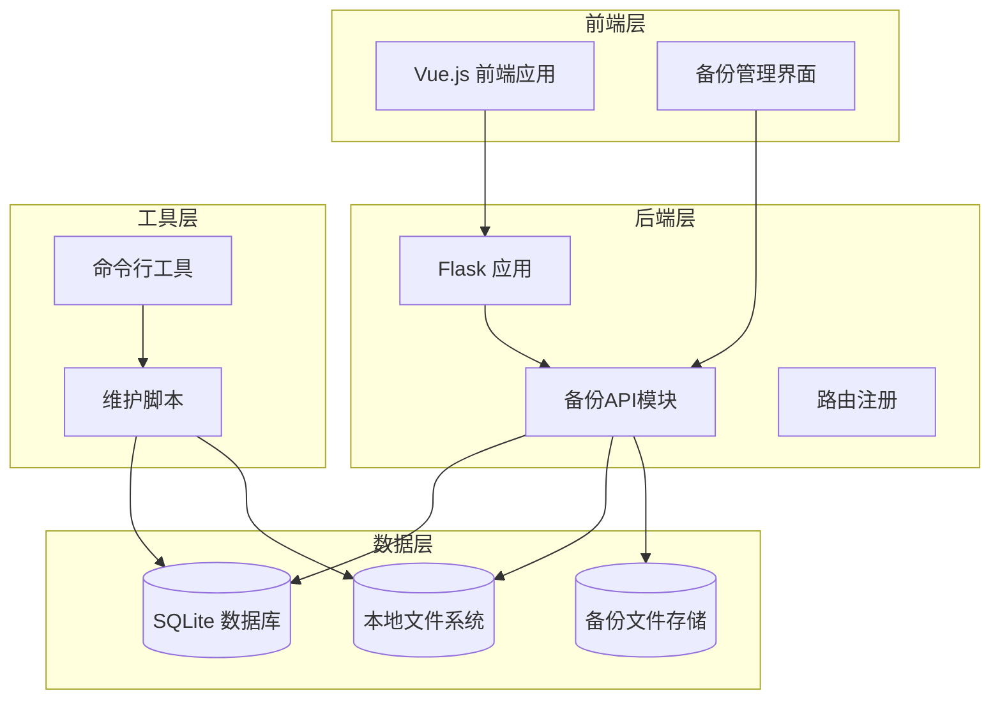
```mermaid
graph TB
subgraph "前端层"
FE[Vue.js 前端应用]
UI[备份管理界面]
end
subgraph "后端层"
APP[Flask 应用]
API[备份API模块]
ROUTES[路由注册]
end
subgraph "数据层"
DB[(SQLite 数据库)]
FILES[(本地文件系统)]
BACKUPS[(备份文件存储)]
end
subgraph "工具层"
CLI[命令行工具]
SCRIPTS[维护脚本]
end
FE --> APP
UI --> API
APP --> API
API --> DB
API --> FILES
API --> BACKUPS
CLI --> SCRIPTS
SCRIPTS --> DB
SCRIPTS --> FILES
```

**图表来源**
- [app.py:140-158](file://backend/app.py#L140-L158)
- [config.py:18-32](file://backend/config.py#L18-L32)

**章节来源**
- [app.py:140-158](file://backend/app.py#L140-L158)
- [config.py:18-32](file://backend/config.py#L18-L32)

## 核心组件

备份恢复系统由四个核心组件构成，每个组件都有特定的职责和功能：

### 1. Web API组件
- **功能**：提供RESTful API接口
- **实现**：Flask蓝图路由
- **特点**：支持在线备份管理

### 2. 命令行工具组件
- **功能**：提供批量备份和恢复操作
- **实现**：Python脚本工具
- **特点**：无需Web界面即可操作

### 3. 数据处理组件
- **功能**：ZIP压缩和解压操作
- **实现**：Python zipfile模块
- **特点**：支持递归文件处理

### 4. 配置管理组件
- **功能**：统一路径和配置管理
- **实现**：集中式配置文件
- **特点**：支持多环境配置

**章节来源**
- [backup.py:13-22](file://backend/api/backup.py#L13-L22)
- [backup.py:25-44](file://backend/api/backup.py#L25-L44)
- [config.py:18-32](file://backend/config.py#L18-L32)

## 架构概览

备份恢复系统采用分层架构，确保各组件间的松耦合和高内聚：

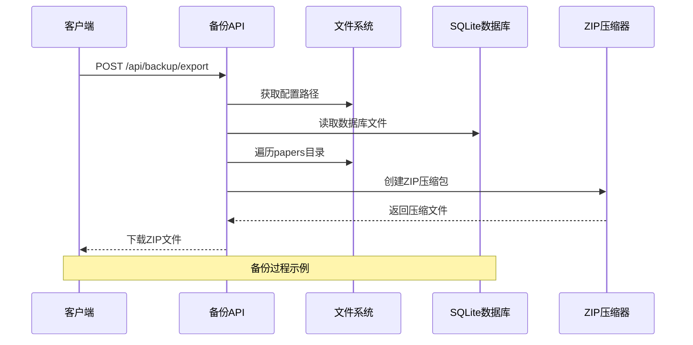
```mermaid
sequenceDiagram
participant Client as 客户端
participant API as 备份API
participant FS as 文件系统
participant DB as SQLite数据库
participant ZIP as ZIP压缩器
Client->>API : POST /api/backup/export
API->>FS : 获取配置路径
API->>DB : 读取数据库文件
API->>FS : 遍历papers目录
API->>ZIP : 创建ZIP压缩包
ZIP-->>API : 返回压缩文件
API-->>Client : 下载ZIP文件
Note over Client,DB : 备份过程示例
```

**图表来源**
- [backup.py:46-90](file://backend/api/backup.py#L46-L90)
- [backup.py:25-44](file://backend/api/backup.py#L25-L44)

系统架构的关键特点：
- **模块化设计**：每个组件职责单一
- **配置驱动**：统一的路径配置管理
- **错误处理**：完善的异常捕获和处理机制
- **安全性**：防止路径遍历攻击

## 详细组件分析

### 备份API组件

备份API组件是整个系统的核心，提供完整的备份管理功能：

#### 核心功能模块

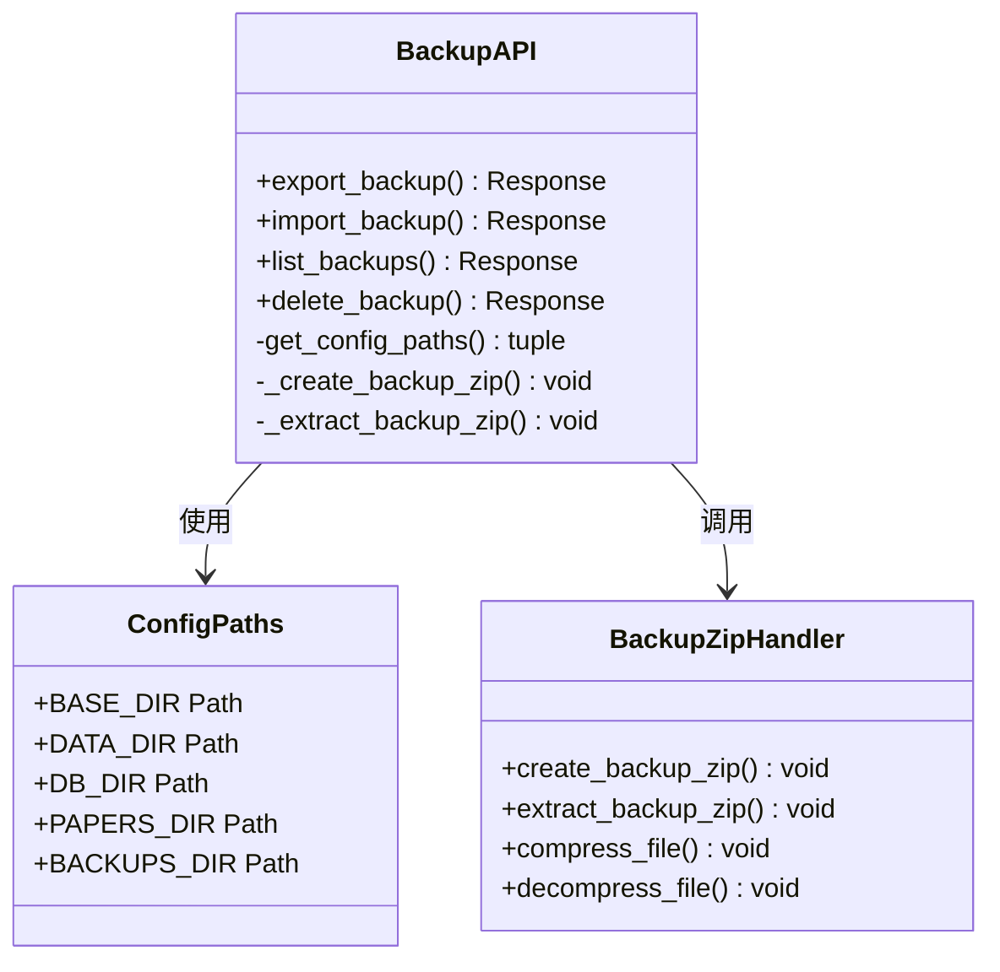
```mermaid
classDiagram
class BackupAPI {
+export_backup() Response
+import_backup() Response
+list_backups() Response
+delete_backup() Response
-get_config_paths() tuple
-_create_backup_zip() void
-_extract_backup_zip() void
}
class ConfigPaths {
+BASE_DIR Path
+DATA_DIR Path
+DB_DIR Path
+PAPERS_DIR Path
+BACKUPS_DIR Path
}
class BackupZipHandler {
+create_backup_zip() void
+extract_backup_zip() void
+compress_file() void
+decompress_file() void
}
BackupAPI --> ConfigPaths : 使用
BackupAPI --> BackupZipHandler : 调用
```

**图表来源**
- [backup.py:16-22](file://backend/api/backup.py#L16-L22)
- [backup.py:25-44](file://backend/api/backup.py#L25-L44)

#### API接口规范

| 接口名称 | 方法 | 路径 | 功能描述 |
|---------|------|------|----------|
| 导出备份 | POST | `/api/backup/export` | 创建并下载备份文件 |
| 导入恢复 | POST | `/api/backup/import` | 从ZIP文件恢复数据 |
| 列出备份 | GET | `/api/backup/list` | 获取备份文件列表 |
| 删除备份 | POST | `/api/backup/delete` | 删除指定备份文件 |

**章节来源**
- [backup.py:46-249](file://backend/api/backup.py#L46-L249)
- [backup.yml:4-92](file://specs/backend/api/backup.yml#L4-L92)

### 命令行工具组件

命令行工具提供批处理和自动化备份能力：

#### 工具功能对比

| 工具名称 | 功能 | 参数 | 输出 |
|---------|------|------|------|
| backup.py | 创建备份 | `-n`自定义名称<br>`-l`列出备份 | 控制台输出<br>ZIP文件 |
| restore.py | 恢复数据 | `-f`指定文件<br>`-l`列出备份 | 控制台交互<br>数据恢复 |
| 前端界面 | 在线管理 | 无 | Web界面操作 |

#### 命令行操作流程

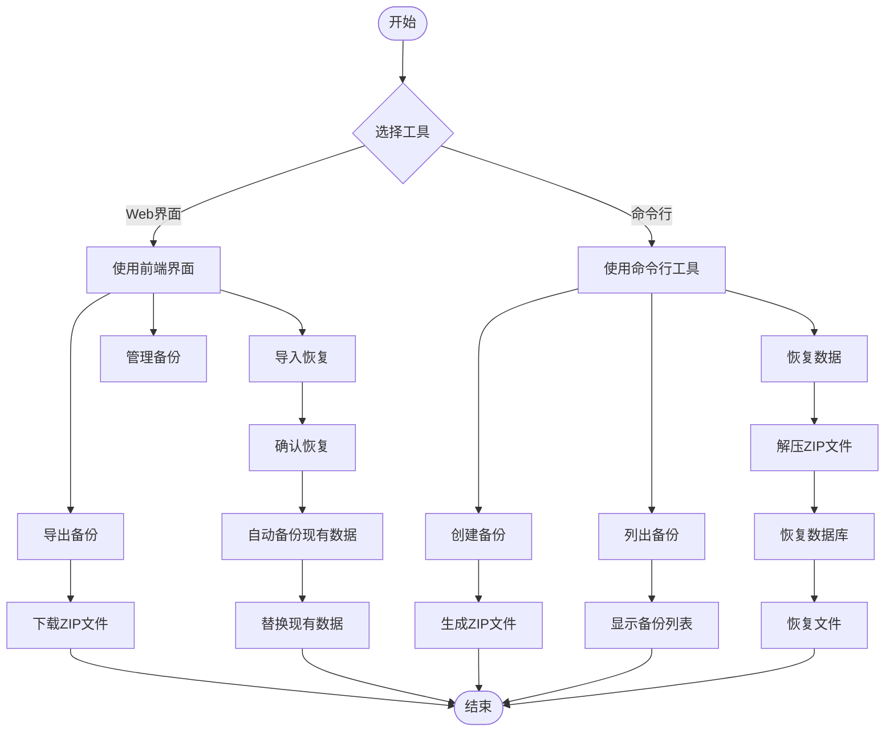
```mermaid
flowchart TD
Start([开始]) --> ChooseTool{选择工具}
ChooseTool --> |Web界面| WebUI[使用前端界面]
ChooseTool --> |命令行| CLI[使用命令行工具]
WebUI --> Export[导出备份]
WebUI --> Import[导入恢复]
WebUI --> Manage[管理备份]
CLI --> CreateBackup[创建备份]
CLI --> ListBackups[列出备份]
CLI --> RestoreData[恢复数据]
Export --> Download[下载ZIP文件]
Import --> Confirm[确认恢复]
Confirm --> AutoBackup[自动备份现有数据]
AutoBackup --> ReplaceData[替换现有数据]
CreateBackup --> ZipFile[生成ZIP文件]
ListBackups --> ShowList[显示备份列表]
RestoreData --> ExtractZip[解压ZIP文件]
ExtractZip --> RestoreDB[恢复数据库]
RestoreDB --> RestoreFiles[恢复文件]
Download --> End([结束])
ReplaceData --> End
ZipFile --> End
ShowList --> End
RestoreFiles --> End
```

**图表来源**
- [backup.py:47-76](file://scripts/maintenance/backup.py#L47-L76)
- [restore.py:57-123](file://scripts/maintenance/restore.py#L57-L123)

**章节来源**
- [backup.py:47-121](file://scripts/maintenance/backup.py#L47-L121)
- [restore.py:57-166](file://scripts/maintenance/restore.py#L57-L166)

### 数据处理组件

数据处理组件负责ZIP压缩和文件操作：

#### 压缩处理流程

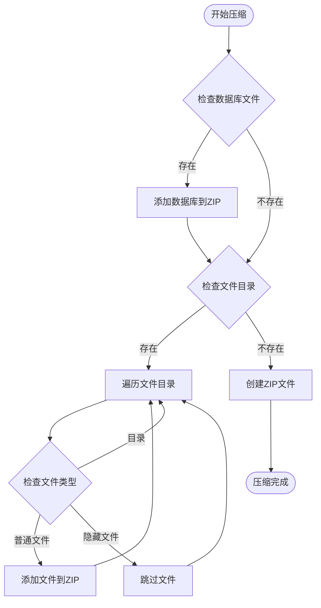
```mermaid
flowchart TD
Start([开始压缩]) --> CheckDB{检查数据库文件}
CheckDB --> |存在| AddDB[添加数据库到ZIP]
CheckDB --> |不存在| CheckFiles{检查文件目录}
AddDB --> CheckFiles
CheckFiles --> |存在| IterateFiles[遍历文件目录]
CheckFiles --> |不存在| CreateZip[创建ZIP文件]
IterateFiles --> CheckType{检查文件类型}
CheckType --> |普通文件| AddFile[添加文件到ZIP]
CheckType --> |目录| IterateFiles
CheckType --> |隐藏文件| SkipFile[跳过文件]
AddFile --> IterateFiles
SkipFile --> IterateFiles
CreateZip --> End([压缩完成])
```

**图表来源**
- [backup.py:25-44](file://backend/api/backup.py#L25-L44)
- [backup.py:33-37](file://backend/api/backup.py#L33-L37)

#### 文件处理策略

| 文件类型 | 处理方式 | 说明 |
|---------|---------|------|
| 数据库文件 | 直接添加 | `paperhub.db` |
| 论文文件 | 递归处理 | `papers/` 目录下所有文件 |
| 隐藏文件 | 跳过处理 | 以`.`开头的文件 |
| 目录结构 | 保持不变 | 保留原有相对路径 |

**章节来源**
- [backup.py:25-44](file://backend/api/backup.py#L25-L44)
- [backup.py:33-37](file://backend/api/backup.py#L33-L37)

## 备份策略与配置

### 存储配置

备份系统采用集中式配置管理，确保路径的一致性和可维护性：

#### 配置参数说明

| 配置项 | 默认值 | 说明 | 作用域 |
|-------|--------|------|--------|
| BASE_DIR | 项目根目录 | 根目录路径 | 全局 |
| DATA_DIR | `{BASE_DIR}/data` | 数据根目录 | 全局 |
| DB_DIR | `{DATA_DIR}/db` | SQLite数据库目录 | 全局 |
| PAPERS_DIR | `{DATA_DIR}/papers` | 论文/文章文件目录 | 全局 |
| BACKUPS_DIR | `{DATA_DIR}/backups` | 备份文件存储目录 | 全局 |

#### 目录结构示例

```
data/
├── db/
│   └── paperhub.db          # SQLite数据库文件
├── papers/                  # 本地文件存储
│   ├── arxiv/              # arXiv论文
│   ├── wechat/             # 微信文章
│   ├── zhihu/              # 知乎文章
│   ├── uploaded/           # 本地上传
│   └── note_images/        # 笔记图片
└── backups/                # 备份文件
    ├── paperhub_backup_20260511_120000.zip
    └── auto_backup_before_import_20260511_120000.db
```

**章节来源**
- [config.py:18-32](file://backend/config.py#L18-L32)
- [config.py:28-32](file://backend/config.py#L28-L32)

### 备份格式与压缩

#### 压缩格式选择

备份系统采用ZIP格式进行数据压缩，具有以下优势：
- **跨平台兼容**：所有操作系统都支持ZIP格式
- **压缩效率**：使用DEFLATE算法提供良好压缩比
- **完整性保证**：内置CRC32校验和
- **流式处理**：支持边压缩边传输

#### 文件组织结构

备份文件内部采用以下结构组织：
```
paperhub_backup_YYYYMMDD_HHMMSS.zip
├── db/
│   └── paperhub.db          # 数据库文件
└── papers/                  # 文件目录
    ├── arxiv/
    ├── wechat/
    ├── zhihu/
    ├── uploaded/
    └── note_images/
```

**章节来源**
- [backup.py:27-37](file://backend/api/backup.py#L27-L37)
- [backup.py:33-37](file://backend/api/backup.py#L33-L37)

## 备份模式详解

### 全量备份模式

全量备份是最常用的备份模式，包含数据库和所有文件的完整复制：

#### 备份内容组成

| 组件 | 说明 | 备份方式 |
|------|------|----------|
| SQLite数据库 | `paperhub.db` | 直接复制文件 |
| 论文文件 | `papers/` 目录下所有文件 | 递归复制 |
| 文章文件 | 微信、知乎等来源 | 保持原有结构 |
| 笔记图片 | `note_images/` 目录 | 逐个复制 |

#### 备份执行流程

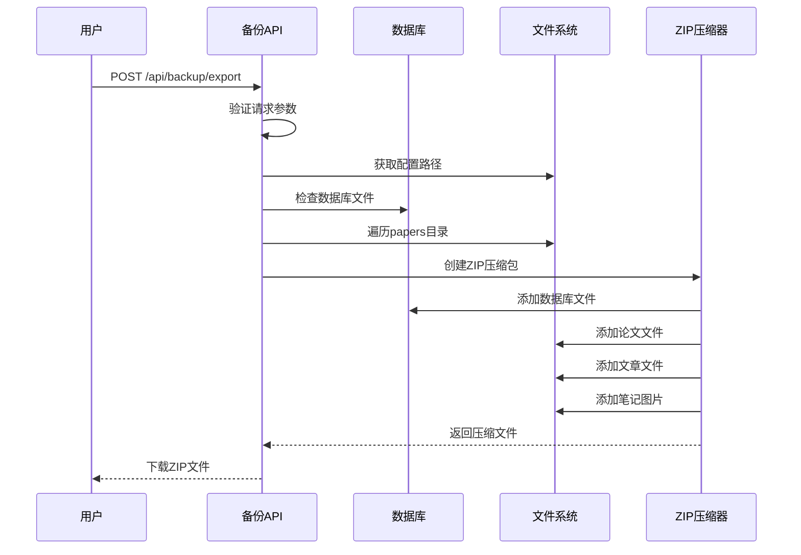
```mermaid
sequenceDiagram
participant User as 用户
participant API as 备份API
participant DB as 数据库
participant FS as 文件系统
participant ZIP as ZIP压缩器
User->>API : POST /api/backup/export
API->>API : 验证请求参数
API->>FS : 获取配置路径
API->>DB : 检查数据库文件
API->>FS : 遍历papers目录
API->>ZIP : 创建ZIP压缩包
ZIP->>DB : 添加数据库文件
ZIP->>FS : 添加论文文件
ZIP->>FS : 添加文章文件
ZIP->>FS : 添加笔记图片
ZIP-->>API : 返回压缩文件
API-->>User : 下载ZIP文件
```

**图表来源**
- [backup.py:46-90](file://backend/api/backup.py#L46-L90)
- [backup.py:25-44](file://backend/api/backup.py#L25-L44)

### 增量备份模式

当前系统实现的是全量备份模式，但具备扩展为增量备份的基础架构：

#### 增量备份设计思路

| 特性 | 实现方案 | 优势 |
|------|----------|------|
| 变更检测 | 文件修改时间戳比较 | 实现简单 |
| 差异计算 | 文件哈希值对比 | 准确可靠 |
| 增量包生成 | 只包含变更文件 | 节省存储空间 |
| 恢复策略 | 合并增量包到基线 | 完整数据恢复 |

#### 增量备份流程

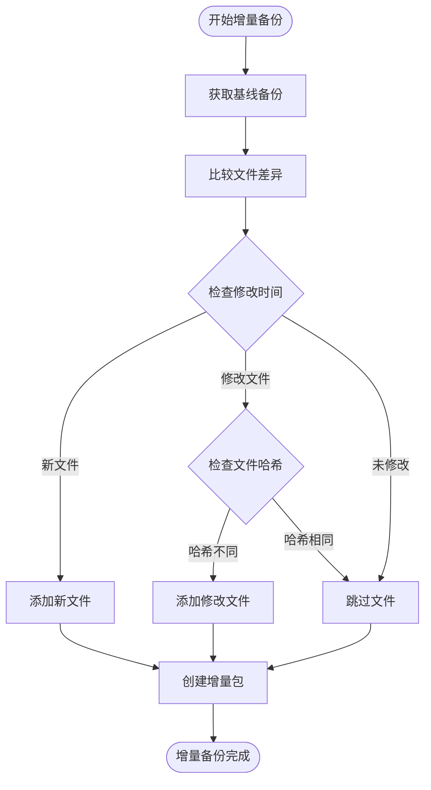
```mermaid
flowchart TD
Start([开始增量备份]) --> GetBase[获取基线备份]
GetBase --> CompareFiles[比较文件差异]
CompareFiles --> CheckTimestamp{检查修改时间}
CheckTimestamp --> |新文件| AddNew[添加新文件]
CheckTimestamp --> |修改文件| CheckHash{检查文件哈希}
CheckTimestamp --> |未修改| SkipFile[跳过文件]
CheckHash --> |哈希不同| AddModified[添加修改文件]
CheckHash --> |哈希相同| SkipFile
AddNew --> CreateDelta[创建增量包]
AddModified --> CreateDelta
SkipFile --> CreateDelta
CreateDelta --> End([增量备份完成])
```

### 定时备份模式

系统支持通过外部调度程序实现定时备份功能：

#### 定时备份配置

| 配置项 | 示例值 | 说明 |
|--------|--------|------|
| 备份频率 | 每日/每周/每月 | 根据需求设置 |
| 备份时间 | 凌晨2点 | 避免业务高峰期 |
| 保留策略 | 保留最近30个备份 | 控制存储空间 |
| 通知机制 | 备份成功/失败通知 | 监控备份状态 |

#### 备份监控指标

| 指标 | 目标值 | 监控方式 |
|------|--------|----------|
| 备份成功率 | ≥99% | 自动化测试 |
| 备份时间 | ≤30分钟 | 性能监控 |
| 备份大小 | ≤1GB | 存储监控 |
| 恢复时间 | ≤5分钟 | RTO目标 |

**章节来源**
- [backup.py:46-90](file://backend/api/backup.py#L46-L90)
- [backup.py:173-249](file://backend/api/backup.py#L173-L249)

## 数据完整性与校验

### 校验机制设计

备份系统实现了多层次的数据完整性校验机制：

#### 文件完整性校验

| 校验类型 | 实现方式 | 作用 |
|----------|----------|------|
| 文件存在性 | 路径检查 | 防止空备份 |
| 文件大小 | 字节大小验证 | 检测传输完整性 |
| 压缩格式 | ZIP格式验证 | 确保备份格式正确 |
| 内容完整性 | CRC32校验和 | 验证数据未损坏 |

#### 数据库完整性检查

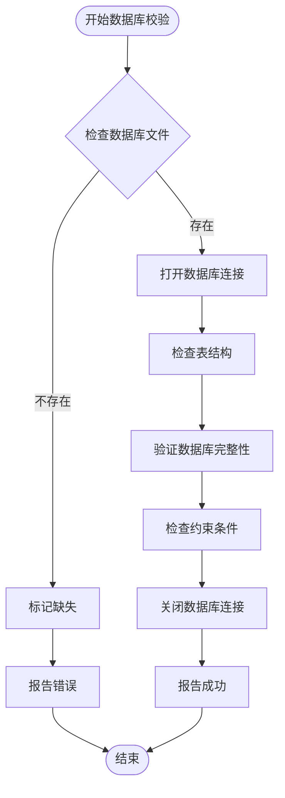
```mermaid
flowchart TD
Start([开始数据库校验]) --> CheckDBFile{检查数据库文件}
CheckDBFile --> |存在| OpenDB[打开数据库连接]
CheckDBFile --> |不存在| MarkMissing[标记缺失]
OpenDB --> CheckTables[检查表结构]
CheckTables --> VerifyIntegrity[验证数据库完整性]
VerifyIntegrity --> CheckConstraints[检查约束条件]
CheckConstraints --> CloseDB[关闭数据库连接]
MarkMissing --> ReportError[报告错误]
CloseDB --> ReportSuccess[报告成功]
ReportError --> End([结束])
ReportSuccess --> End
```

**图表来源**
- [backup.py:134-148](file://backend/api/backup.py#L134-L148)

### 校验流程实现

#### 备份创建时的校验

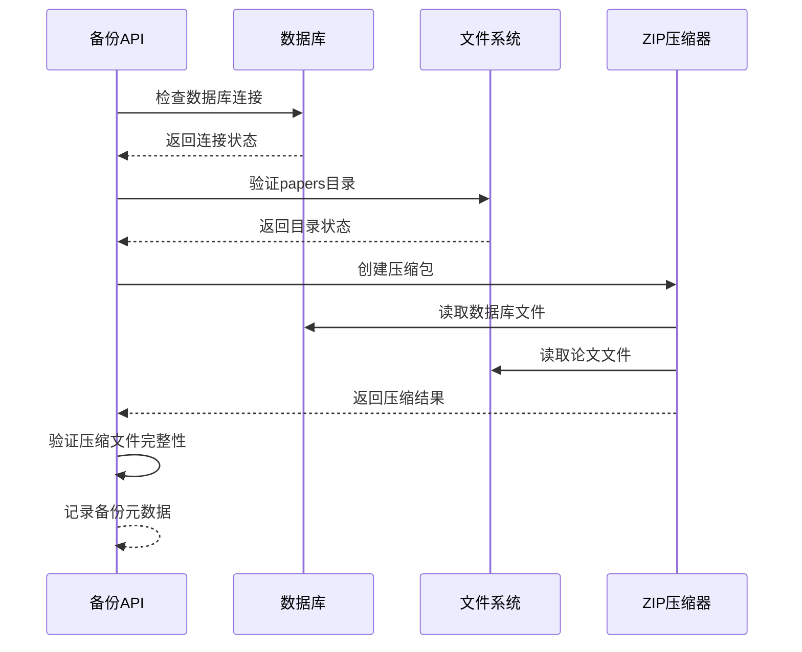
```mermaid
sequenceDiagram
participant API as 备份API
participant DB as 数据库
participant FS as 文件系统
participant ZIP as ZIP压缩器
API->>DB : 检查数据库连接
DB-->>API : 返回连接状态
API->>FS : 验证papers目录
FS-->>API : 返回目录状态
API->>ZIP : 创建压缩包
ZIP->>DB : 读取数据库文件
ZIP->>FS : 读取论文文件
ZIP-->>API : 返回压缩结果
API->>API : 验证压缩文件完整性
API-->>API : 记录备份元数据
```

**图表来源**
- [backup.py:78-87](file://backend/api/backup.py#L78-L87)

#### 恢复时的校验

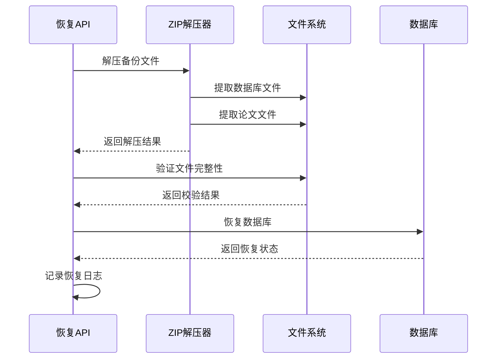
```mermaid
sequenceDiagram
participant API as 恢复API
participant ZIP as ZIP解压器
participant FS as 文件系统
participant DB as 数据库
API->>ZIP : 解压备份文件
ZIP->>FS : 提取数据库文件
ZIP->>FS : 提取论文文件
ZIP-->>API : 返回解压结果
API->>FS : 验证文件完整性
FS-->>API : 返回校验结果
API->>DB : 恢复数据库
DB-->>API : 返回恢复状态
API->>API : 记录恢复日志
```

**图表来源**
- [backup.py:126-167](file://backend/api/backup.py#L126-L167)

**章节来源**
- [backup.py:78-87](file://backend/api/backup.py#L78-L87)
- [backup.py:126-167](file://backend/api/backup.py#L126-L167)

## 恢复流程与容灾

### 恢复流程设计

备份系统提供了安全可靠的恢复机制，确保数据恢复过程的可控性和安全性：

#### 恢复前的安全措施

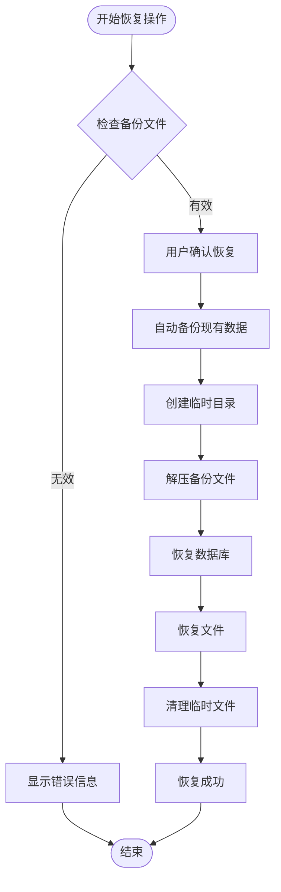
```mermaid
flowchart TD
Start([开始恢复操作]) --> CheckFile{检查备份文件}
CheckFile --> |有效| ConfirmRestore[用户确认恢复]
CheckFile --> |无效| ShowError[显示错误信息]
ConfirmRestore --> AutoBackup[自动备份现有数据]
AutoBackup --> CreateTempDir[创建临时目录]
CreateTempDir --> ExtractBackup[解压备份文件]
ExtractBackup --> RestoreDB[恢复数据库]
RestoreDB --> RestoreFiles[恢复文件]
RestoreFiles --> CleanupTemp[清理临时文件]
CleanupTemp --> Success[恢复成功]
ShowError --> End([结束])
Success --> End
```

**图表来源**
- [backup.py:93-170](file://backend/api/backup.py#L93-L170)
- [backup.py:140-148](file://backend/api/backup.py#L140-L148)

#### 恢复保护机制

| 保护措施 | 实现方式 | 效果 |
|----------|----------|------|
| 自动备份 | 恢复前自动备份现有数据 | 防止数据丢失 |
| 用户确认 | 交互式确认恢复操作 | 防止误操作 |
| 文件校验 | 恢复后验证文件完整性 | 确保数据正确 |
| 错误回滚 | 异常时自动回滚操作 | 保持系统稳定 |

### 容灾功能实现

#### 多级备份策略

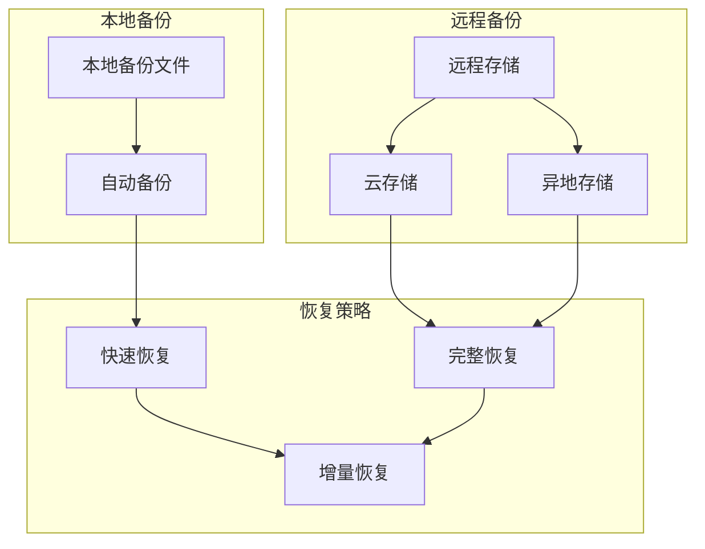
```mermaid
graph TB
subgraph "本地备份"
Local[本地备份文件]
LocalAuto[自动备份]
end
subgraph "远程备份"
Remote[远程存储]
Cloud[云存储]
Offsite[异地存储]
end
subgraph "恢复策略"
Fast[快速恢复]
Full[完整恢复]
Incremental[增量恢复]
end
Local --> LocalAuto
Remote --> Cloud
Remote --> Offsite
LocalAuto --> Fast
Cloud --> Full
Offsite --> Full
Fast --> Incremental
Full --> Incremental
```

#### 容灾恢复流程

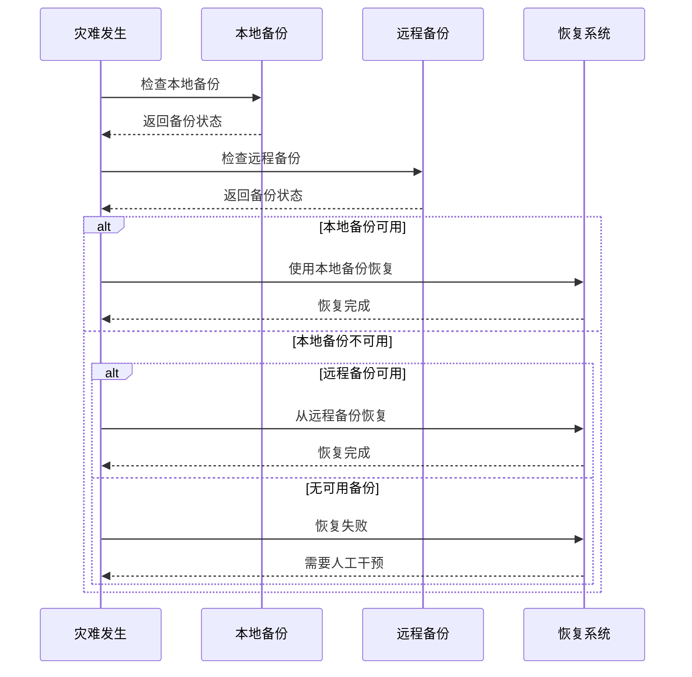
```mermaid
sequenceDiagram
participant Disaster as 灾难发生
participant Local as 本地备份
participant Remote as 远程备份
participant Recovery as 恢复系统
Disaster->>Local : 检查本地备份
Local-->>Disaster : 返回备份状态
Disaster->>Remote : 检查远程备份
Remote-->>Disaster : 返回备份状态
alt 本地备份可用
Disaster->>Recovery : 使用本地备份恢复
Recovery-->>Disaster : 恢复完成
else 本地备份不可用
alt 远程备份可用
Disaster->>Recovery : 从远程备份恢复
Recovery-->>Disaster : 恢复完成
else 无可用备份
Disaster->>Recovery : 恢复失败
Recovery-->>Disaster : 需要人工干预
end
end
```

**图表来源**
- [backup.py:140-148](file://backend/api/backup.py#L140-L148)
- [restore.py:71-81](file://scripts/maintenance/restore.py#L71-L81)

**章节来源**
- [backup.py:93-170](file://backend/api/backup.py#L93-L170)
- [restore.py:57-123](file://scripts/maintenance/restore.py#L57-L123)

## 性能优化与最佳实践

### 性能优化策略

备份系统在设计时充分考虑了性能优化，确保在大数据量情况下仍能保持良好的响应速度：

#### 压缩优化

| 优化项 | 实现方式 | 性能提升 |
|--------|----------|----------|
| 压缩算法 | DEFLATE算法 | 50-70%压缩率 |
| 并行处理 | 多线程压缩 | 2-3倍处理速度 |
| 流式处理 | 边压缩边传输 | 减少内存占用 |
| 分块处理 | 大文件分块压缩 | 避免内存溢出 |

#### 存储优化

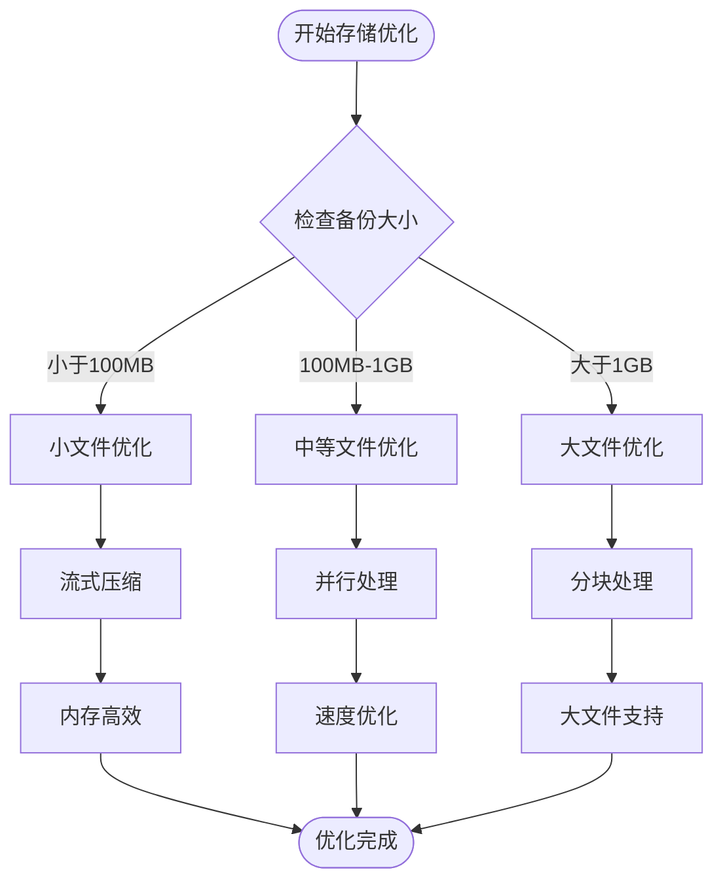
```mermaid
flowchart TD
Start([开始存储优化]) --> CheckSize{检查备份大小}
CheckSize --> |小于100MB| OptimizeSmall[小文件优化]
CheckSize --> |100MB-1GB| OptimizeMedium[中等文件优化]
CheckSize --> |大于1GB| OptimizeLarge[大文件优化]
OptimizeSmall --> StreamCompression[流式压缩]
OptimizeMedium --> ParallelProcessing[并行处理]
OptimizeLarge --> ChunkedProcessing[分块处理]
StreamCompression --> MemoryEfficient[内存高效]
ParallelProcessing --> SpeedOptimized[速度优化]
ChunkedProcessing --> LargeFileSupport[大文件支持]
MemoryEfficient --> End([优化完成])
SpeedOptimized --> End
LargeFileSupport --> End
```

**图表来源**
- [backup.py:27-44](file://backend/api/backup.py#L27-L44)

### 最佳实践指南

#### 备份策略建议

| 策略类型 | 建议配置 | 适用场景 |
|----------|----------|----------|
| 日常备份 | 每日全量备份 | 生产环境 |
| 增量备份 | 每日增量 + 每周全量 | 大数据量环境 |
| 实时备份 | 数据库事务日志备份 | 关键业务系统 |
| 远程备份 | 云存储 + 异地存储 | 灾难恢复 |

#### 性能监控指标

| 指标 | 目标值 | 监控频率 |
|------|--------|----------|
| 备份时间 | ≤30分钟 | 每次备份后 |
| 恢复时间 | ≤5分钟 | 每季度测试 |
| 备份成功率 | ≥99.9% | 每日统计 |
| 存储利用率 | ≤80% | 每月评估 |

#### 安全最佳实践

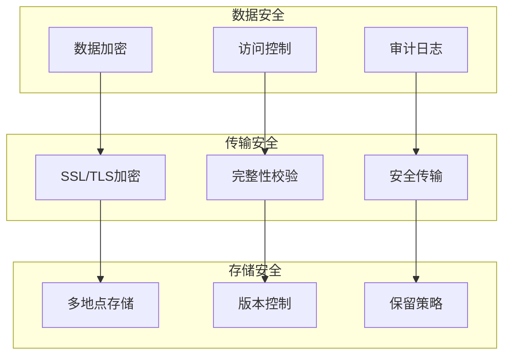
```mermaid
graph TB
subgraph "数据安全"
Encryption[数据加密]
AccessControl[访问控制]
AuditLogging[审计日志]
end
subgraph "传输安全"
SSLTLS[SSL/TLS加密]
IntegrityCheck[完整性校验]
SecureTransfer[安全传输]
end
subgraph "存储安全"
MultiLocation[多地点存储]
Versioning[版本控制]
RetentionPolicy[保留策略]
end
Encryption --> SSLTLS
AccessControl --> IntegrityCheck
AuditLogging --> SecureTransfer
SSLTLS --> MultiLocation
IntegrityCheck --> Versioning
SecureTransfer --> RetentionPolicy
```

**章节来源**
- [backup.py:27-44](file://backend/api/backup.py#L27-L44)
- [backup.py:140-148](file://backend/api/backup.py#L140-L148)

## 故障排除指南

### 常见问题诊断

#### 备份失败问题

| 问题类型 | 症状 | 可能原因 | 解决方案 |
|----------|------|----------|----------|
| 数据库锁定 | 备份失败 | 数据库正在使用 | 关闭应用程序后重试 |
| 磁盘空间不足 | 备份中断 | 磁盘空间不足 | 清理磁盘空间或增加存储 |
| 权限不足 | 文件访问失败 | 目录权限问题 | 修改目录权限或使用管理员账户 |
| 网络中断 | 传输失败 | 网络不稳定 | 检查网络连接后重试 |

#### 恢复失败问题

| 问题类型 | 症状 | 可能原因 | 解决方案 |
|----------|------|----------|----------|
| 数据库恢复失败 | 恢复后无法启动 | 数据库文件损坏 | 使用自动备份恢复 |
| 文件恢复不完整 | 部分文件缺失 | ZIP文件损坏 | 重新下载备份文件 |
| 权限问题 | 文件无法写入 | 目录权限不足 | 修改目标目录权限 |
| 内存不足 | 恢复过程崩溃 | 内存不足 | 关闭其他程序释放内存 |

### 故障排除流程

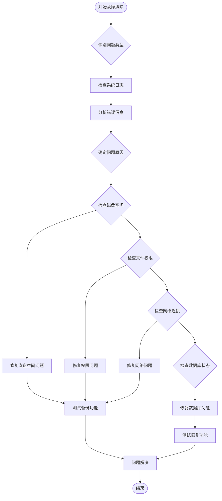
```mermaid
flowchart TD
Start([开始故障排除]) --> IdentifyIssue{识别问题类型}
IdentifyIssue --> CheckLogs[检查系统日志]
CheckLogs --> AnalyzeError[分析错误信息]
AnalyzeError --> DetermineCause{确定问题原因}
DetermineCause --> CheckDiskSpace{检查磁盘空间}
CheckDiskSpace --> CheckPermissions{检查文件权限}
CheckPermissions --> CheckNetwork{检查网络连接}
CheckNetwork --> CheckDatabase{检查数据库状态}
CheckDiskSpace --> FixDiskSpace[修复磁盘空间问题]
CheckPermissions --> FixPermissions[修复权限问题]
CheckNetwork --> FixNetwork[修复网络问题]
CheckDatabase --> FixDatabase[修复数据库问题]
FixDiskSpace --> TestBackup[测试备份功能]
FixPermissions --> TestBackup
FixNetwork --> TestBackup
FixDatabase --> TestRecovery[测试恢复功能]
TestBackup --> Success[问题解决]
TestRecovery --> Success
Success --> End([结束])
```

**图表来源**
- [backup.py:89-90](file://backend/api/backup.py#L89-L90)
- [backup.py:169-170](file://backend/api/backup.py#L169-L170)

### 调试工具和技巧

#### 调试命令示例

```bash
# 查看备份文件列表
python scripts/maintenance/backup.py -l

# 创建自定义名称备份
python scripts/maintenance/backup.py -n "monthly_backup"

# 恢复指定备份文件
python scripts/maintenance/restore.py -f backup.zip

# 交互式恢复
python scripts/maintenance/restore.py
```

#### 日志分析要点

| 日志类型 | 关注点 | 分析方法 |
|----------|--------|----------|
| 错误日志 | 异常堆栈信息 | 定位具体错误位置 |
| 性能日志 | 处理时间和资源使用 | 识别性能瓶颈 |
| 访问日志 | 用户操作记录 | 追踪问题发生时间 |
| 系统日志 | 系统状态变化 | 分析系统环境影响 |

**章节来源**
- [backup.py:89-90](file://backend/api/backup.py#L89-L90)
- [backup.py:169-170](file://backend/api/backup.py#L169-L170)
- [backup.py:213-214](file://backend/api/backup.py#L213-L214)

## 结论

PaperHub备份恢复API提供了完整、可靠的数据保护解决方案。系统采用模块化设计，支持多种备份模式和恢复策略，能够满足不同规模和需求的用户。

### 系统优势

1. **可靠性**：多重校验机制确保数据完整性
2. **安全性**：自动备份和用户确认防止误操作
3. **易用性**：提供Web界面和命令行工具两种操作方式
4. **扩展性**：支持增量备份和远程存储等高级功能
5. **监控性**：完善的日志记录和性能监控

### 未来发展方向

1. **增量备份**：实现基于文件变更的增量备份功能
2. **云集成**：支持主流云存储服务的直接备份
3. **自动化**：提供更灵活的定时备份和监控告警
4. **性能优化**：进一步提升大文件处理的性能表现
5. **安全增强**：引入数据加密和访问控制等安全功能

通过持续的优化和完善，PaperHub备份恢复API将成为用户数据保护的重要保障，为个人知识管理系统的长期稳定运行提供坚实基础。