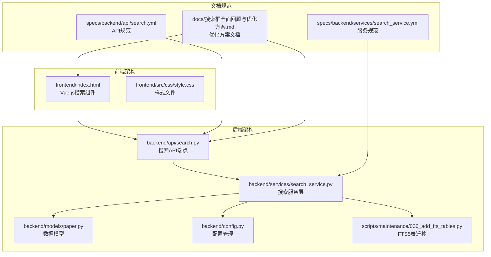
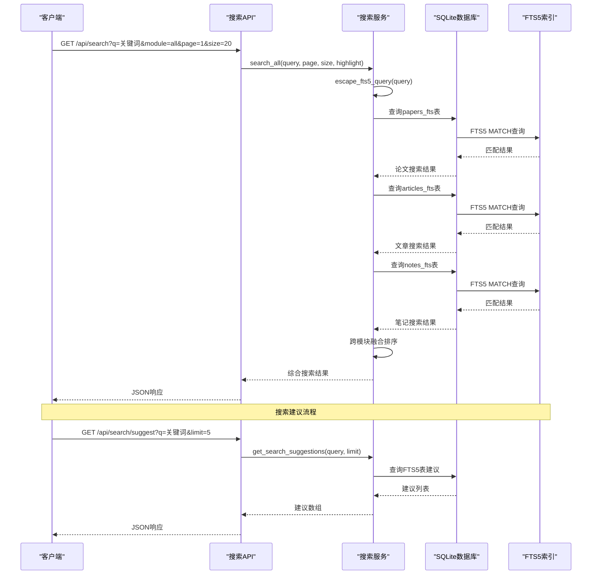
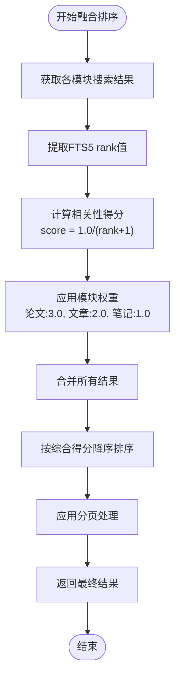
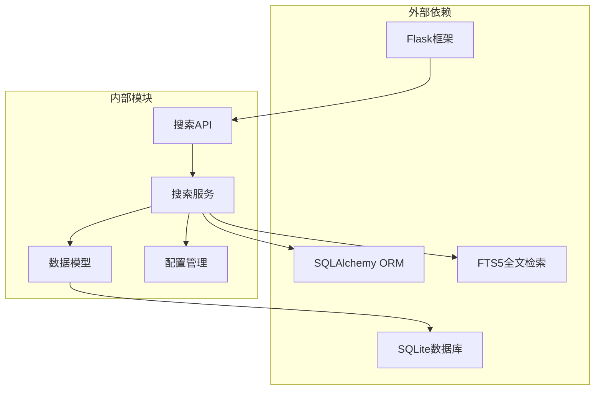
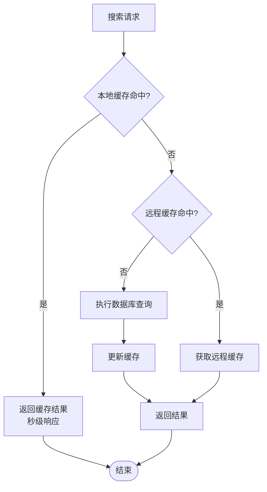

# 搜索系统API

<cite>
**本文档引用的文件**
- [backend/api/search.py](file://backend/api/search.py)
- [backend/services/search_service.py](file://backend/services/search_service.py)
- [specs/backend/api/search.yml](file://specs/backend/api/search.yml)
- [specs/backend/services/search_service.yml](file://specs/backend/services/search_service.yml)
- [scripts/maintenance/006_add_fts_tables.py](file://scripts/maintenance/006_add_fts_tables.py)
- [backend/config.py](file://backend/config.py)
- [backend/models/paper.py](file://backend/models/paper.py)
- [docs/搜索框全面回顾与优化方案.md](file://docs/搜索框全面回顾与优化方案.md)
- [frontend/index.html](file://frontend/index.html)
</cite>

## 目录
1. [简介](#简介)
2. [项目结构](#项目结构)
3. [核心组件](#核心组件)
4. [架构概览](#架构概览)
5. [详细组件分析](#详细组件分析)
6. [依赖关系分析](#依赖关系分析)
7. [性能考虑](#性能考虑)
8. [故障排除指南](#故障排除指南)
9. [结论](#结论)

## 简介

PaperHub搜索系统是一个基于SQLite FTS5全文检索技术构建的智能搜索平台，支持论文、文章和笔记三种类型的全文检索。系统采用前后端分离架构，后端使用Flask提供RESTful API，前端使用Vue.js实现丰富的搜索交互体验。

该系统的核心特性包括：
- **全文检索**：基于SQLite FTS5的高性能全文搜索引擎
- **智能排序**：结合相关性评分和模块权重的综合排序算法
- **搜索建议**：实时搜索建议和联想功能
- **高亮显示**：关键词自动高亮和上下文截取
- **缓存机制**：本地和远程双重缓存优化搜索性能
- **防抖优化**：智能防抖和请求取消机制

## 项目结构

搜索系统主要分布在以下目录结构中：



**图表来源**
- [backend/api/search.py:1-70](file://backend/api/search.py#L1-L70)
- [backend/services/search_service.py:1-314](file://backend/services/search_service.py#L1-L314)
- [frontend/index.html:5346-5489](file://frontend/index.html#L5346-L5489)

**章节来源**
- [backend/api/search.py:1-70](file://backend/api/search.py#L1-L70)
- [backend/services/search_service.py:1-314](file://backend/services/search_service.py#L1-L314)
- [frontend/index.html:5346-5489](file://frontend/index.html#L5346-L5489)

## 核心组件

### 搜索API端点

系统提供两个核心API端点：

1. **全文搜索接口** (`/api/search`)
   - 支持跨模块搜索（论文、文章、笔记）
   - 支持分页和高亮显示
   - 返回详细的搜索统计信息

2. **搜索建议接口** (`/api/search/suggest`)
   - 提供实时搜索建议
   - 支持自定义建议数量限制
   - 基于FTS5索引的高性能建议生成

### 搜索服务层

搜索服务层实现了复杂的全文检索逻辑，包括：
- **查询转义**：处理FTS5特殊字符
- **高亮处理**：关键词自动高亮
- **跨模块融合**：综合排序算法
- **建议生成**：智能搜索建议

**章节来源**
- [backend/api/search.py:14-70](file://backend/api/search.py#L14-L70)
- [backend/services/search_service.py:8-314](file://backend/services/search_service.py#L8-L314)

## 架构概览

搜索系统采用分层架构设计，确保了良好的可维护性和扩展性：



**图表来源**
- [backend/api/search.py:14-70](file://backend/api/search.py#L14-L70)
- [backend/services/search_service.py:207-314](file://backend/services/search_service.py#L207-L314)

## 详细组件分析

### API接口规范

#### 全文搜索接口

**接口定义**
- **URL**: `/api/search`
- **方法**: GET
- **功能**: 跨模块全文搜索

**查询参数**
| 参数名 | 类型 | 默认值 | 必填 | 描述 |
|--------|------|--------|------|------|
| q | string | '' | 是 | 搜索关键词 |
| module | string | 'all' | 否 | 搜索范围 (all/papers/articles/notes) |
| page | integer | 1 | 否 | 页码 |
| size | integer | 20 | 否 | 每页数量 |
| highlight | boolean | true | 否 | 是否开启关键词高亮 |

**响应格式**
```json
{
  "success": true,
  "total": 150,
  "page": 1,
  "size": 20,
  "results": [
    {
      "id": 1,
      "type": "paper",
      "title": "深度学习论文标题",
      "title_highlight": "<em>深度</em>学习论文标题",
      "abstract": "论文摘要内容...",
      "abstract_highlight": "<em>深度</em>学习在计算机视觉中的应用",
      "authors": "作者列表",
      "published_at": "2024-01-01",
      "source": "arXiv",
      "category_l1": "cs.AI",
      "category_l2": "cs.LG",
      "starred": false,
      "status": "pending",
      "arxiv_id": "2401.12345",
      "_fts_rank": 0.5
    }
  ],
  "breakdown": {
    "papers": 80,
    "articles": 45,
    "notes": 25
  }
}
```

#### 搜索建议接口

**接口定义**
- **URL**: `/api/search/suggest`
- **方法**: GET
- **功能**: 搜索建议联想

**查询参数**
| 参数名 | 类型 | 默认值 | 必填 | 描述 |
|--------|------|--------|------|------|
| q | string | '' | 是 | 输入前缀 |
| limit | integer | 5 | 否 | 返回建议数量 |

**响应格式**
```json
{
  "success": true,
  "suggestions": ["深度学习", "机器学习", "神经网络"]
}
```

**章节来源**
- [specs/backend/api/search.yml:1-70](file://specs/backend/api/search.yml#L1-L70)
- [backend/api/search.py:14-70](file://backend/api/search.py#L14-L70)

### 搜索服务实现

#### 查询转义机制

搜索服务实现了专门的查询转义函数，用于处理FTS5的特殊字符：

```mermaid
flowchart TD
Start([开始搜索]) --> EscapeQuery["escape_fts5_query(query)"]
EscapeQuery --> CheckEmpty{"查询为空?"}
CheckEmpty --> |是| ReturnEmpty["返回空查询"]
CheckEmpty --> |否| RemoveSpecial["移除FTS5特殊字符<br/>:,\\\"'(){}[]^*+?!@#$%&|~"]
RemoveSpecial --> MergeSpaces["合并多个连续空格为单个空格"]
MergeSpaces --> TrimQuery["去除首尾空白字符"]
TrimQuery --> ReturnEscaped["返回转义后的查询"]
ReturnEmpty --> End([结束])
ReturnEscaped --> End
```

**图表来源**
- [backend/services/search_service.py:8-26](file://backend/services/search_service.py#L8-L26)

#### 高亮显示机制

系统提供了智能的关键词高亮功能：

1. **关键词提取**：从转义后的查询中提取关键词
2. **文本处理**：对匹配的关键词进行高亮标记
3. **HTML包装**：使用`<em>`标签包裹匹配的关键词
4. **大小写不敏感**：支持任意大小写的关键词匹配

#### 跨模块融合排序

搜索服务实现了复杂的跨模块排序算法：



**图表来源**
- [backend/services/search_service.py:207-257](file://backend/services/search_service.py#L207-L257)

**章节来源**
- [backend/services/search_service.py:8-314](file://backend/services/search_service.py#L8-L314)

### SQLite FTS5全文检索

#### FTS5表结构设计

系统为每种资源类型建立了独立的FTS5虚拟表：

```mermaid
erDiagram
PAPERS_FTS {
rowid PK
title
abstract
authors
category
}
ARTICLES_FTS {
rowid PK
title
content
author
source
}
NOTES_FTS {
rowid PK
title
content
source
}
PAPERS ||--|| PAPERS_FTS : "rowid关联"
ARTICLES ||--|| ARTICLES_FTS : "rowid关联"
NOTES ||--|| NOTES_FTS : "rowid关联"
```

**图表来源**
- [scripts/maintenance/006_add_fts_tables.py:18-48](file://scripts/maintenance/006_add_fts_tables.py#L18-L48)

#### 触发器机制

系统使用SQLite触发器确保FTS5表与主表的数据一致性：

1. **插入触发器**：新记录插入时自动同步到FTS5表
2. **更新触发器**：记录更新时自动更新FTS5表
3. **删除触发器**：记录删除时自动清理FTS5表

**章节来源**
- [scripts/maintenance/006_add_fts_tables.py:55-138](file://scripts/maintenance/006_add_fts_tables.py#L55-L138)

### 前端搜索体验

#### 搜索框组件

前端实现了完整的搜索框组件，包含以下功能：

1. **实时搜索建议**：输入2个字符以上时自动请求建议
2. **键盘导航**：支持上下箭头键选择建议项
3. **搜索历史**：本地存储搜索历史，最多10条
4. **防抖优化**：300ms防抖延迟，减少网络请求
5. **请求取消**：快速输入时自动取消未完成的请求

#### 搜索结果展示

搜索结果以卡片式布局展示，不同类型的资源有不同的视觉标识：

- **论文**：蓝色标识 (#409eff)
- **文章**：绿色标识 (#67c23a)  
- **笔记**：橙色标识 (#e6a23c)

**章节来源**
- [frontend/index.html:5346-5489](file://frontend/index.html#L5346-L5489)
- [docs/搜索框全面回顾与优化方案.md:91-177](file://docs/搜索框全面回顾与优化方案.md#L91-L177)

## 依赖关系分析

搜索系统的依赖关系如下：



**图表来源**
- [backend/api/search.py:3-10](file://backend/api/search.py#L3-L10)
- [backend/services/search_service.py:4-6](file://backend/services/search_service.py#L4-L6)

### 外部依赖

- **Flask**: Web框架，提供HTTP请求处理
- **SQLAlchemy**: ORM框架，简化数据库操作
- **SQLite**: 本地数据库，支持FTS5全文检索
- **FTS5**: SQLite内置全文检索引擎

### 内部依赖

- **配置管理**: 提供数据库连接和全局配置
- **数据模型**: 定义论文、文章、笔记的数据结构
- **搜索服务**: 实现核心搜索逻辑
- **API端点**: 提供RESTful接口

**章节来源**
- [backend/config.py:85-134](file://backend/config.py#L85-L134)
- [backend/models/paper.py:120-293](file://backend/models/paper.py#L120-L293)

## 性能考虑

### SQLite连接池优化

系统使用连接池管理数据库连接：

- **连接池大小**: 5个基础连接
- **最大溢出连接**: 10个
- **连接超时**: 30秒
- **连接回收**: 3600秒，避免SQLite锁问题

### FTS5性能优化

1. **索引设计**: 为每种资源类型建立独立FTS5表
2. **触发器同步**: 自动保持FTS5表与主表数据一致
3. **查询优化**: 使用MATCH操作符而非LIKE进行全文搜索
4. **排名机制**: 利用FTS5内置的rank排序

### 前端性能优化

1. **防抖机制**: 300ms防抖延迟，减少网络请求
2. **请求取消**: 快速输入时自动取消未完成请求
3. **本地缓存**: LRU缓存最近20条搜索结果
4. **加载状态**: 显示搜索进度指示器

### 缓存策略



**图表来源**
- [frontend/index.html:5431-5489](file://frontend/index.html#L5431-L5489)

## 故障排除指南

### 常见问题诊断

#### 搜索结果为空

**可能原因**：
1. 查询关键词为空
2. FTS5表数据未初始化
3. 数据库连接失败

**解决方案**：
1. 检查查询参数是否正确传递
2. 运行FTS5表创建脚本
3. 验证数据库连接配置

#### 搜索性能缓慢

**可能原因**：
1. 缺少FTS5索引
2. 查询包含特殊字符
3. 数据库连接池耗尽

**解决方案**：
1. 确认FTS5表已正确创建
2. 使用查询转义函数处理特殊字符
3. 调整连接池配置参数

#### 前端搜索无响应

**可能原因**：
1. 防抖定时器未正确清理
2. AbortController未正确使用
3. 事件监听器内存泄漏

**解决方案**：
1. 确保在组件卸载时清理定时器
2. 正确使用AbortController取消请求
3. 在onUnmounted生命周期中清理事件监听器

### 调试工具

#### 后端调试

1. **日志记录**: 在关键节点添加日志输出
2. **查询验证**: 使用SQLite命令行验证FTS5查询
3. **性能监控**: 监控数据库查询时间和连接池状态

#### 前端调试

1. **控制台日志**: 检查网络请求和响应
2. **缓存状态**: 验证LRU缓存的命中率
2. **事件监听**: 确认键盘事件和鼠标事件正常工作

**章节来源**
- [docs/搜索框全面回顾与优化方案.md:181-214](file://docs/搜索框全面回顾与优化方案.md#L181-L214)

## 结论

PaperHub搜索系统是一个功能完整、性能优异的全文检索平台。通过SQLite FTS5技术、智能排序算法和前端优化，系统提供了优秀的搜索体验。

### 主要优势

1. **高性能**: 基于SQLite FTS5的全文检索，无需额外依赖
2. **智能排序**: 结合相关性评分和模块权重的综合排序
3. **用户体验**: 完善的搜索建议、防抖优化和缓存机制
4. **可扩展性**: 清晰的架构设计，易于功能扩展

### 未来发展方向

1. **AI增强**: 集成大模型进行语义重排序和搜索意图理解
2. **智能纠错**: 实现拼写纠错和自动补全功能
3. **热门推荐**: 基于搜索数据分析的热门搜索词推荐
4. **移动端优化**: 针对移动设备的搜索体验优化

该系统为PaperHub平台提供了强大的知识检索能力，是整个系统的重要基础设施。