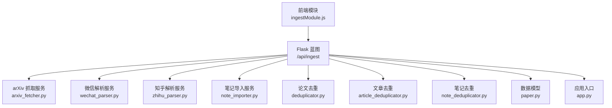
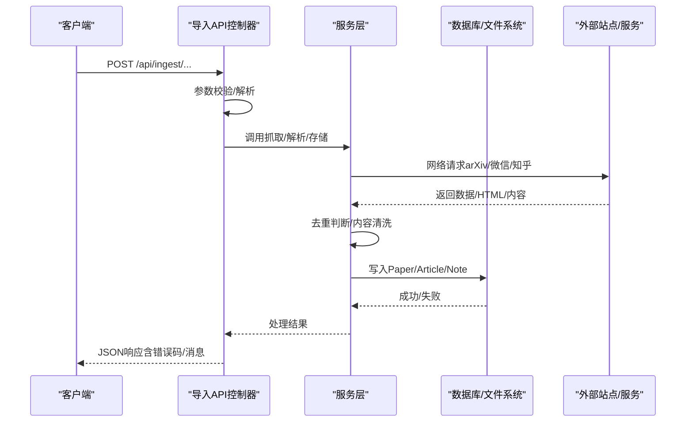
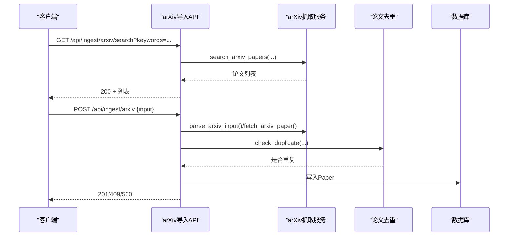
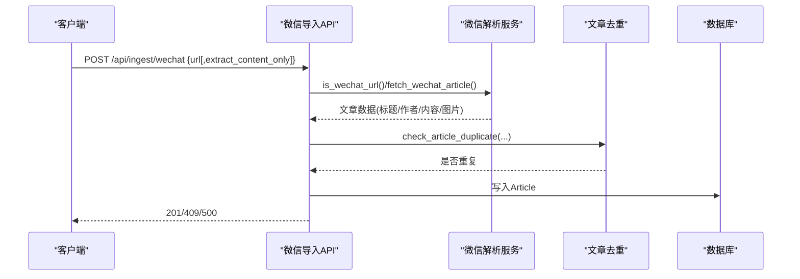
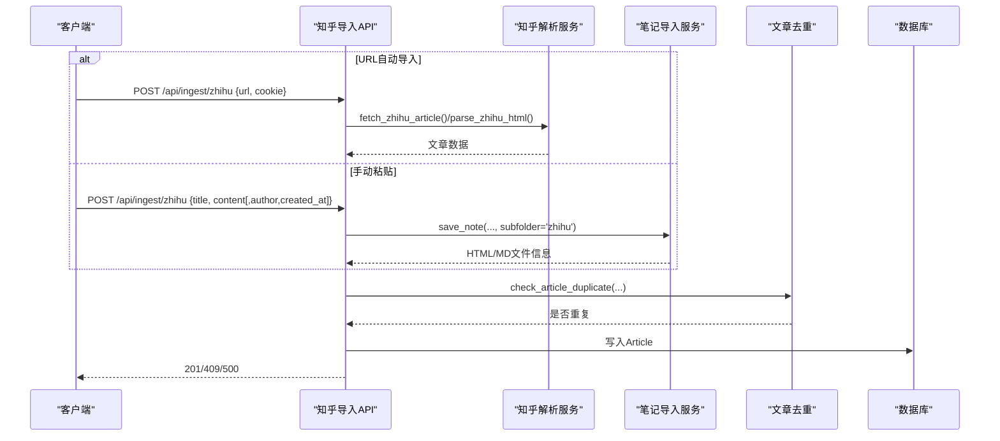
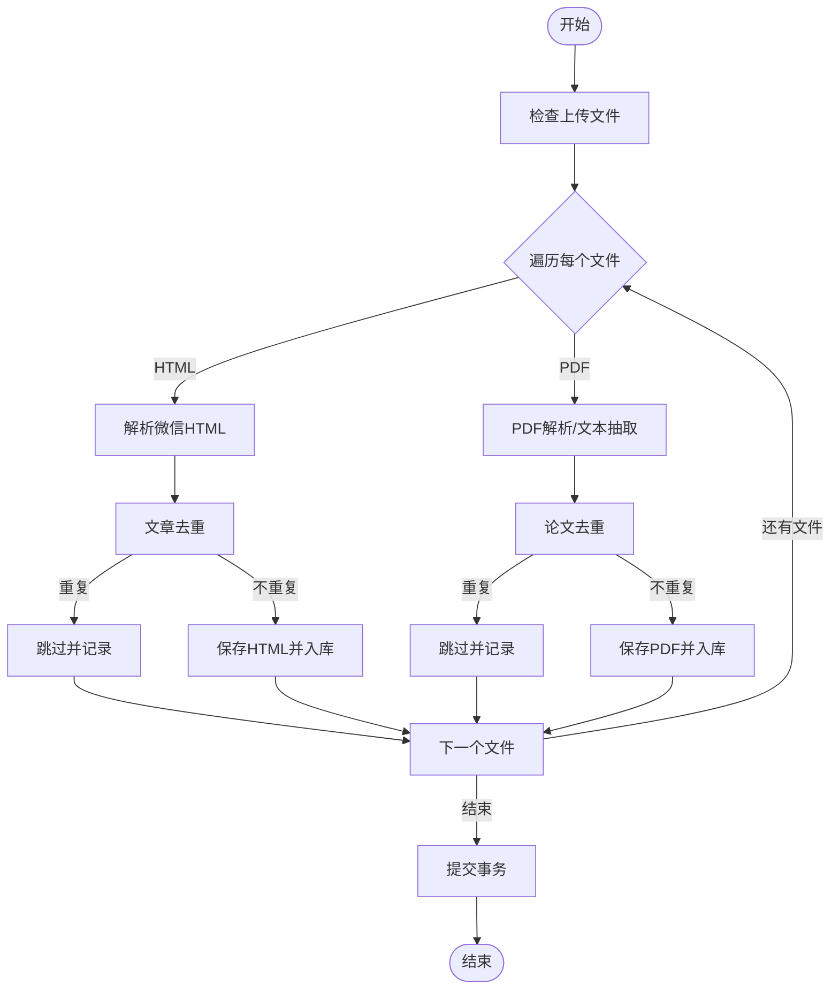
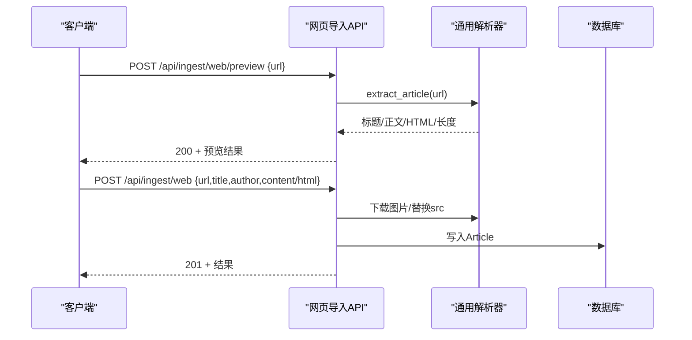
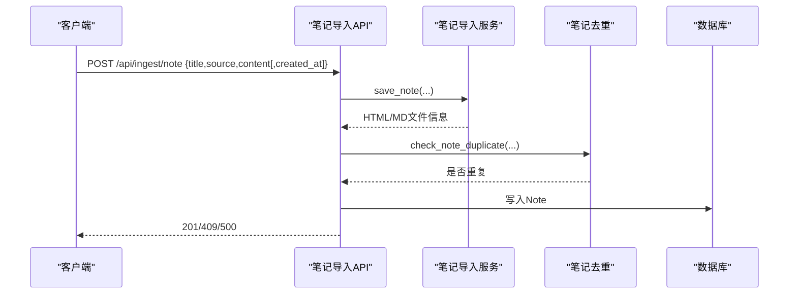
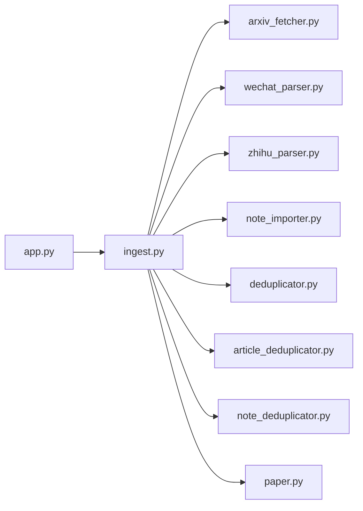

# 数据导入API

<cite>
**本文引用的文件**
- [backend/api/ingest.py](file://backend/api/ingest.py)
- [specs/backend/api/ingest.yml](file://specs/backend/api/ingest.yml)
- [backend/services/arxiv_fetcher.py](file://backend/services/arxiv_fetcher.py)
- [backend/services/note_importer.py](file://backend/services/note_importer.py)
- [backend/services/wechat_parser.py](file://backend/services/wechat_parser.py)
- [backend/services/zhihu_parser.py](file://backend/services/zhihu_parser.py)
- [backend/services/deduplicator.py](file://backend/services/deduplicator.py)
- [backend/services/article_deduplicator.py](file://backend/services/article_deduplicator.py)
- [backend/services/note_deduplicator.py](file://backend/services/note_deduplicator.py)
- [backend/models/paper.py](file://backend/models/paper.py)
- [frontend/src/modules/ingestModule.js](file://frontend/src/modules/ingestModule.js)
- [docs/知乎专栏导入使用说明.md](file://docs/知乎专栏导入使用说明.md)
- [backend/app.py](file://backend/app.py)
- [scripts/tests/test_batch_guide.md](file://scripts/tests/test_batch_guide.md)
</cite>

## 目录
1. [简介](#简介)
2. [项目结构](#项目结构)
3. [核心组件](#核心组件)
4. [架构总览](#架构总览)
5. [详细组件分析](#详细组件分析)
6. [依赖关系分析](#依赖关系分析)
7. [性能考量](#性能考量)
8. [故障排除指南](#故障排除指南)
9. [结论](#结论)
10. [附录](#附录)

## 简介
本文件为 PaperHub 项目的“数据导入API”完整接口文档，覆盖多源数据统一导入能力，包括 arXiv 论文、微信公众号文章、知乎文章、通用网页、本地PDF/HTML 文件以及对话笔记的导入。文档详细说明批量导入、增量更新、数据验证、导入进度跟踪、错误处理、数据去重等高级特性，并提供导入配置参数、文件格式要求、导入限制、失败处理与重试机制、数据回滚策略、完整导入流程示例与最佳实践。

## 项目结构
PaperHub 后端采用 Flask + SQLAlchemy 架构，导入API位于 `/api/ingest` 蓝图下，具体实现分布在 API 控制器与服务层（抓取、解析、去重、存储）。前端通过 ingestModule.js 调用导入API，后端路由注册在 app.py 中完成。

图表来源
- [backend/app.py:140-157](file://backend/app.py#L140-L157)
- [backend/api/ingest.py:1-120](file://backend/api/ingest.py#L1-L120)

章节来源
- [backend/app.py:140-157](file://backend/app.py#L140-L157)
- [backend/api/ingest.py:1-120](file://backend/api/ingest.py#L1-L120)

## 核心组件
- 导入API蓝图：提供统一的多源导入接口，包括 arXiv 搜索/导入、批量导入、微信公众号抓取、知乎文章导入、本地PDF/HTML入库、通用网页预览与入库、对话笔记导入等。
- 抓取与解析服务：
  - arXiv 抓取：支持输入解析、远程搜索、PDF下载与文本抽取。
  - 微信解析：支持 URL 抓取与本地HTML解析，自动清洗、图片下载与本地化。
  - 知乎解析：支持 Cookie 获取文章、Markdown 渲染与双文件存储。
  - 笔记导入：Markdown 渲染为 HTML，生成唯一ID并保存。
- 去重机制：
  - 论文去重：基于 arXiv ID、DOI、URL、标题相似度综合判断。
  - 文章去重：基于 URL、标题相似度、内容哈希。
  - 笔记去重：基于 URL、标题相似度、内容哈希。
- 数据模型：Paper、Article、Note 三类实体，支持标签、关联关系与版本管理。

章节来源
- [backend/api/ingest.py:36-800](file://backend/api/ingest.py#L36-L800)
- [backend/services/arxiv_fetcher.py:17-324](file://backend/services/arxiv_fetcher.py#L17-L324)
- [backend/services/wechat_parser.py:326-601](file://backend/services/wechat_parser.py#L326-L601)
- [backend/services/zhihu_parser.py:279-323](file://backend/services/zhihu_parser.py#L279-L323)
- [backend/services/note_importer.py:183-232](file://backend/services/note_importer.py#L183-L232)
- [backend/services/deduplicator.py:79-124](file://backend/services/deduplicator.py#L79-L124)
- [backend/services/article_deduplicator.py:134-173](file://backend/services/article_deduplicator.py#L134-L173)
- [backend/services/note_deduplicator.py:88-130](file://backend/services/note_deduplicator.py#L88-L130)
- [backend/models/paper.py:120-293](file://backend/models/paper.py#L120-L293)

## 架构总览
导入流程从HTTP请求进入，经API控制器校验参数与调用服务层，再进行去重判断与持久化，最终返回统一的JSON响应。微信与知乎导入涉及外部站点抓取，需处理网络异常与反爬策略；arXiv导入依赖arXiv API；本地文件导入支持PDF与HTML两类。

图表来源
- [backend/api/ingest.py:36-800](file://backend/api/ingest.py#L36-L800)
- [backend/services/arxiv_fetcher.py:32-47](file://backend/services/arxiv_fetcher.py#L32-L47)
- [backend/services/wechat_parser.py:326-601](file://backend/services/wechat_parser.py#L326-L601)
- [backend/services/zhihu_parser.py:279-323](file://backend/services/zhihu_parser.py#L279-L323)

## 详细组件分析

### arXiv 论文导入
- 搜索接口：支持关键词、分类、时间范围、最大结果数等参数，返回论文列表。
- 单个导入：支持URL或纯ID输入，自动解析arXiv ID，抓取元数据，下载PDF并抽取文本，进行去重判断后入库。
- 批量导入：接收arXiv ID数组，逐条导入并统计成功/失败与错误明细，按ID去重跳过已存在项。

图表来源
- [backend/api/ingest.py:36-180](file://backend/api/ingest.py#L36-L180)
- [backend/services/arxiv_fetcher.py:17-227](file://backend/services/arxiv_fetcher.py#L17-L227)
- [backend/services/deduplicator.py:79-124](file://backend/services/deduplicator.py#L79-L124)

章节来源
- [backend/api/ingest.py:36-180](file://backend/api/ingest.py#L36-L180)
- [backend/services/arxiv_fetcher.py:17-227](file://backend/services/arxiv_fetcher.py#L17-L227)
- [specs/backend/api/ingest.yml:5-82](file://specs/backend/api/ingest.yml#L5-L82)

### 微信公众号文章导入
- URL抓取：校验微信链接有效性，抓取HTML，清洗内容，下载图片并本地化，保存为HTML文件，入库Article。
- 本地HTML解析：解析本地保存的微信HTML，清洗与图片处理，入库Article。
- 去重策略：基于URL、标题相似度、内容哈希判断重复。

图表来源
- [backend/api/ingest.py:689-758](file://backend/api/ingest.py#L689-L758)
- [backend/services/wechat_parser.py:256-601](file://backend/services/wechat_parser.py#L256-L601)
- [backend/services/article_deduplicator.py:134-173](file://backend/services/article_deduplicator.py#L134-L173)

章节来源
- [backend/api/ingest.py:689-758](file://backend/api/ingest.py#L689-L758)
- [backend/services/wechat_parser.py:256-601](file://backend/services/wechat_parser.py#L256-L601)
- [specs/backend/api/ingest.yml:186-209](file://specs/backend/api/ingest.yml#L186-L209)

### 知乎文章导入
- URL自动导入：需要Cookie，抓取文章、解析作者/时间/内容，Markdown渲染，双文件存储，入库Article。
- 手动粘贴：支持直接粘贴标题、作者、内容，自动渲染为HTML并入库。
- 去重策略：基于URL、标题相似度、内容哈希判断重复。

图表来源
- [backend/api/ingest.py:350-464](file://backend/api/ingest.py#L350-L464)
- [backend/services/zhihu_parser.py:279-323](file://backend/services/zhihu_parser.py#L279-L323)
- [backend/services/note_importer.py:183-232](file://backend/services/note_importer.py#L183-L232)
- [backend/services/article_deduplicator.py:134-173](file://backend/services/article_deduplicator.py#L134-L173)

章节来源
- [backend/api/ingest.py:350-464](file://backend/api/ingest.py#L350-L464)
- [backend/services/zhihu_parser.py:279-323](file://backend/services/zhihu_parser.py#L279-L323)
- [specs/backend/api/ingest.yml:116-158](file://specs/backend/api/ingest.yml#L116-L158)
- [docs/知乎专栏导入使用说明.md:1-213](file://docs/知乎专栏导入使用说明.md#L1-L213)

### 本地文件导入（PDF/HTML）
- 支持多文件上传，自动识别HTML与PDF：
  - HTML：解析微信公众号HTML，去重后入库Article。
  - PDF：抽取标题/作者/摘要/全文，去重后入库Paper。
- 文件命名：使用UUID前缀避免冲突，保存至 data/papers/uploaded 目录。

图表来源
- [backend/api/ingest.py:467-619](file://backend/api/ingest.py#L467-L619)
- [backend/services/article_deduplicator.py:134-173](file://backend/services/article_deduplicator.py#L134-L173)
- [backend/services/deduplicator.py:79-124](file://backend/services/deduplicator.py#L79-L124)

章节来源
- [backend/api/ingest.py:467-619](file://backend/api/ingest.py#L467-L619)
- [specs/backend/api/ingest.yml:161-185](file://specs/backend/api/ingest.yml#L161-L185)

### 通用网页预览与入库
- 预览：提取网页标题、作者、正文、HTML、长度与最佳方法，不入库。
- 入库：确认后的网页内容，自动下载远程图片到本地并替换src路径，入库Article。

图表来源
- [backend/api/ingest.py:761-799](file://backend/api/ingest.py#L761-L799)
- [specs/backend/api/ingest.yml:209-273](file://specs/backend/api/ingest.yml#L209-L273)

章节来源
- [backend/api/ingest.py:761-799](file://backend/api/ingest.py#L761-L799)
- [specs/backend/api/ingest.yml:209-273](file://specs/backend/api/ingest.yml#L209-L273)

### 对话笔记导入
- 支持标题、来源、Markdown内容、可选创建时间；自动渲染为HTML并保存，生成唯一ID，去重后入库Note。

图表来源
- [backend/api/ingest.py:261-347](file://backend/api/ingest.py#L261-L347)
- [backend/services/note_importer.py:183-232](file://backend/services/note_importer.py#L183-L232)
- [backend/services/note_deduplicator.py:88-130](file://backend/services/note_deduplicator.py#L88-L130)

章节来源
- [backend/api/ingest.py:261-347](file://backend/api/ingest.py#L261-L347)
- [specs/backend/api/ingest.yml:83-115](file://specs/backend/api/ingest.yml#L83-L115)

## 依赖关系分析
导入API与服务层、去重模块、数据模型之间的耦合关系如下：

图表来源
- [backend/api/ingest.py:114-116](file://backend/api/ingest.py#L114-L116)
- [backend/app.py:140-157](file://backend/app.py#L140-L157)

章节来源
- [backend/api/ingest.py:114-116](file://backend/api/ingest.py#L114-L116)
- [backend/app.py:140-157](file://backend/app.py#L140-L157)

## 性能考量
- 并发与批处理：批量导入（如 arXiv 批量）逐条处理并统计结果，建议控制单次批量大小，避免长时间占用数据库连接。
- 网络请求：微信/知乎抓取需处理超时与重试，建议在服务层增加指数退避与最大重试次数。
- 文件IO：PDF/HTML解析与图片下载可能产生大量磁盘IO，建议使用异步任务队列（Celery）分离耗时操作。
- 去重成本：大规模去重需扫描已有记录，建议对高频字段建立索引（如arXiv ID、DOI、URL）。
- 响应时间：预览接口（/web/preview）应尽量快速返回，避免阻塞。

## 故障排除指南
- 常见错误码
  - 400：缺少必要参数、参数格式错误（如URL为空、Cookie缺失、文件未上传）。
  - 409：数据已存在（重复导入）。
  - 500：服务内部异常（外部API调用失败、解析异常、数据库异常）。
- arXiv
  - 输入解析失败：确认输入为 arXiv URL、短ID或长ID。
  - 外部服务调用失败：检查arXiv网络连通性与速率限制。
- 微信
  - 链接无效：确认链接为 mp.weixin.qq.com/s? 开头。
  - 图片下载失败：属于正常现象，不影响正文入库。
- 知乎
  - 403/404：Cookie过期或链接错误，参考使用说明重新获取Cookie。
  - 未找到正文：确认Cookie包含必要字段。
- 本地文件
  - 文件类型不支持：仅支持 .pdf/.html/.htm。
  - 重复文件：根据返回的duplicate信息跳过或合并。
- 去重策略
  - 标题相似度阈值：论文/文章/笔记去重阈值分别为0.85、0.8、0.8，可根据业务调整。
  - 系列文章：文章去重会区分系列标识（如“上/下”、“第一部分”等），避免误判。

章节来源
- [specs/backend/api/ingest.yml:38-41](file://specs/backend/api/ingest.yml#L38-L41)
- [backend/api/ingest.py:86-89](file://backend/api/ingest.py#L86-L89)
- [docs/知乎专栏导入使用说明.md:137-146](file://docs/知乎专栏导入使用说明.md#L137-L146)

## 结论
PaperHub 的数据导入API提供了统一、健壮的多源导入能力，涵盖学术论文、微信公众号、知乎、通用网页与本地文件等多种来源。通过完善的参数校验、去重机制、错误处理与文件存储策略，能够满足日常知识库建设与维护需求。建议在生产环境中结合异步任务、缓存与监控体系进一步提升稳定性与性能。

## 附录

### API 一览与参数说明
- arXiv 搜索
  - 方法：GET
  - 路径：/api/ingest/arxiv/search
  - 查询参数：keywords、max_results、categories、start_date、end_date
  - 返回：论文列表
- arXiv 单个导入
  - 方法：POST
  - 路径：/api/ingest/arxiv
  - 请求体：input（URL或ID）
  - 返回：paper对象或错误
- arXiv 批量导入
  - 方法：POST
  - 路径：/api/ingest/arxiv/batch
  - 请求体：arxiv_ids（数组）、download_pdf（布尔）
  - 返回：统计与错误明细
- 微信文章导入
  - 方法：POST
  - 路径：/api/ingest/wechat
  - 请求体：url（必须）、extract_content_only（可选）
  - 返回：article对象或错误
- 微信本地HTML导入
  - 方法：POST
  - 路径：/api/ingest/wechat/local
  - 请求体：html_path（必须）、assets_folder（可选）
  - 返回：article对象或重复信息
- 知乎文章导入
  - 方法：POST
  - 路径：/api/ingest/zhihu
  - 请求体：url/cookie 或 title/content/author/created_at
  - 返回：article对象或错误
- 本地文件导入（PDF/HTML）
  - 方法：POST
  - 路径：/api/ingest/pdf
  - 请求体：file（多文件）、pdf_url（可选）
  - 返回：统计与每文件结果
- 通用网页预览
  - 方法：POST
  - 路径：/api/ingest/web/preview
  - 请求体：url
  - 返回：标题、作者、正文、HTML、长度与最佳方法
- 通用网页入库
  - 方法：POST
  - 路径：/api/ingest/web
  - 请求体：url、title、author、content/html
  - 返回：article对象与图片下载统计
- 对话笔记导入
  - 方法：POST
  - 路径：/api/ingest/note
  - 请求体：title、source、content、created_at（可选）
  - 返回：note对象或错误

章节来源
- [specs/backend/api/ingest.yml:4-273](file://specs/backend/api/ingest.yml#L4-L273)
- [backend/api/ingest.py:36-799](file://backend/api/ingest.py#L36-L799)

### 数据模型要点
- Paper：论文实体，包含arXiv ID、DOI、URL、标题、作者、摘要、内容、发布日期、文件路径、状态等。
- Article：网络文章实体，包含来源（wechat/zhihu/web等）、URL、标题、作者、内容、发布日期、文件路径、状态等。
- Note：笔记实体，包含来源、URL、标题、内容、发布日期、文件路径、状态等。
- 关系：Paper-Tag、Article-Tag、Note-Tag、Paper-Note、Paper-Article、Note-Article 多对多关联。

章节来源
- [backend/models/paper.py:120-293](file://backend/models/paper.py#L120-L293)

### 去重策略与阈值
- 论文去重：arXiv ID/DOI/URL完全匹配优先；否则基于标题相似度（阈值0.85）判断。
- 文章去重：URL完全匹配优先；其次标题相似度（阈值0.8）；最后内容前500字符哈希。
- 笔记去重：URL完全匹配优先；其次标题相似度（阈值0.8）；最后内容前500字符哈希。

章节来源
- [backend/services/deduplicator.py:79-124](file://backend/services/deduplicator.py#L79-L124)
- [backend/services/article_deduplicator.py:134-173](file://backend/services/article_deduplicator.py#L134-L173)
- [backend/services/note_deduplicator.py:88-130](file://backend/services/note_deduplicator.py#L88-L130)

### 文件格式与存储
- PDF：保存至 data/papers/uploaded，文件名使用UUID前缀避免冲突。
- HTML（微信/知乎）：保存至 data/papers/wechat 或 data/papers/zhihu，包含渲染后的HTML与纯Markdown源文件。
- 图片：微信文章导入时自动下载并本地化，图片保存在对应文章目录的子文件夹中。

章节来源
- [backend/api/ingest.py:467-619](file://backend/api/ingest.py#L467-L619)
- [backend/services/wechat_parser.py:142-253](file://backend/services/wechat_parser.py#L142-L253)
- [backend/services/zhihu_parser.py:291-322](file://backend/services/zhihu_parser.py#L291-L322)

### 导入流程示例与最佳实践
- arXiv 批量导入
  - 准备arXiv ID数组，设置download_pdf为true以同时下载PDF并抽取文本。
  - 批量导入后检查返回的统计与错误明细，针对失败项单独重试。
- 微信文章导入
  - 使用URL抓取模式，确保网络可达；若需仅提取正文，设置extract_content_only为true。
  - 导入前先预览正文长度与HTML长度，确认质量后再入库。
- 知乎文章导入
  - 优先使用URL自动导入并提供Cookie；若Cookie过期，参考使用说明重新获取。
  - 手动粘贴模式适合临时应急或内容片段导入。
- 本地文件导入
  - 上传PDF自动入库论文库，上传HTML自动入库文章库。
  - 导入前建议先预览，避免重复文件与低质量内容。
- 去重与一致性
  - 导入前可通过预览接口确认内容质量与长度。
  - 对于系列文章，去重策略会自动区分不同部分，避免误判。
- 错误处理与重试
  - 对于外部站点抓取失败，建议在服务层实现指数退避与最大重试次数。
  - 对于数据库异常，建议使用事务回滚与幂等设计，避免重复写入。

章节来源
- [docs/知乎专栏导入使用说明.md:67-100](file://docs/知乎专栏导入使用说明.md#L67-L100)
- [scripts/tests/test_batch_guide.md:19-78](file://scripts/tests/test_batch_guide.md#L19-L78)