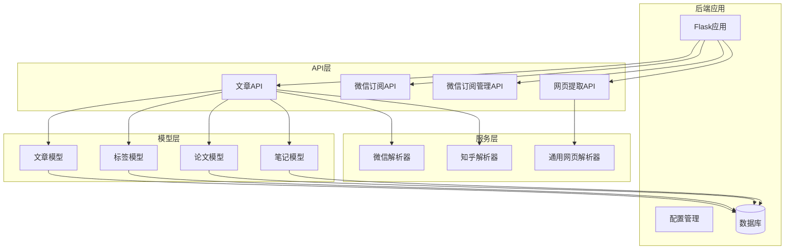
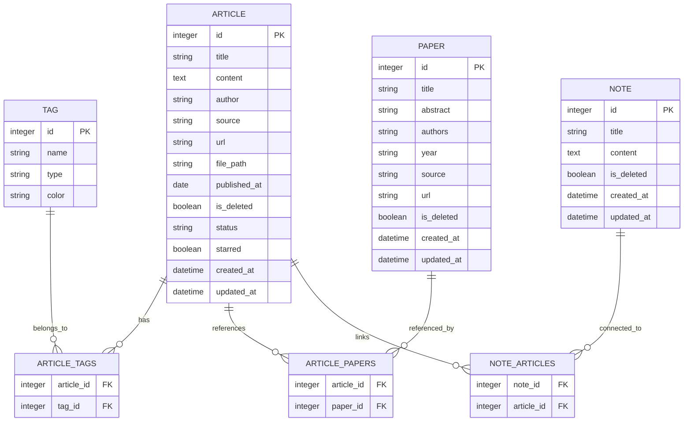
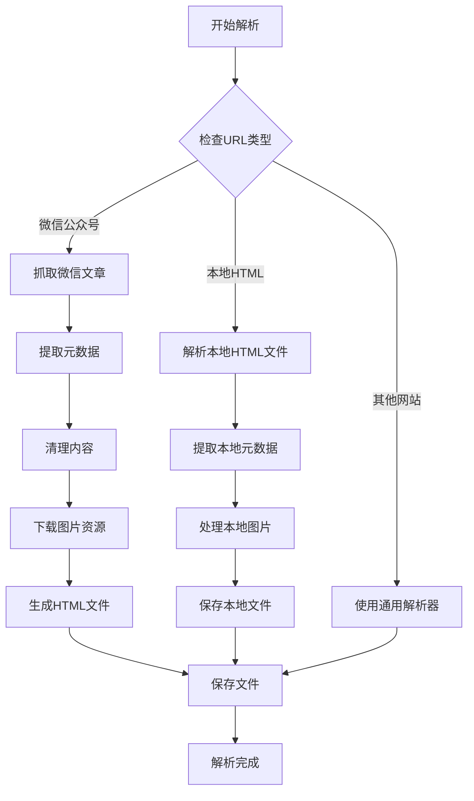
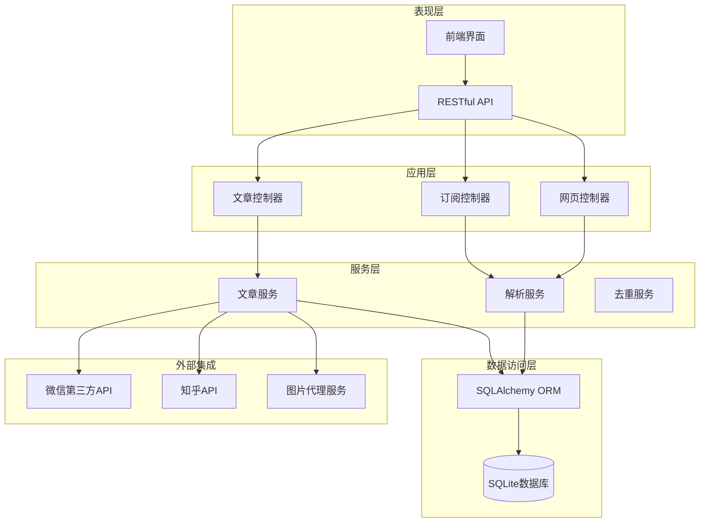
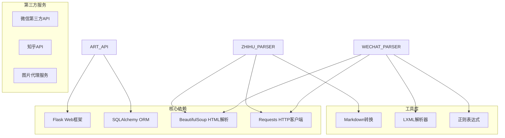
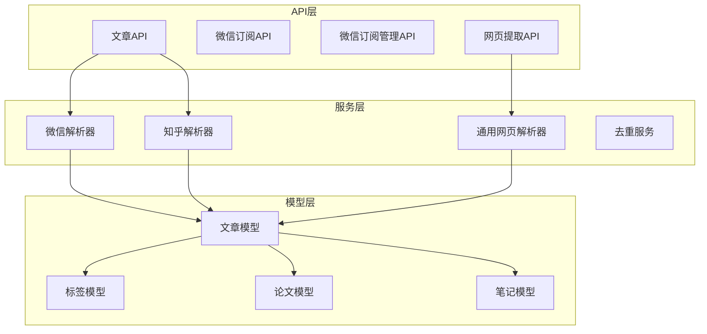

# 文章管理API

<cite>
**本文档引用的文件**
- [backend/api/articles.py](file://backend/api/articles.py)
- [backend/api/wechat_subscription.py](file://backend/api/wechat_subscription.py)
- [backend/api/wechat_subscriptions.py](file://backend/api/wechat_subscriptions.py)
- [backend/api/web_extract.py](file://backend/api/web_extract.py)
- [backend/services/wechat_parser.py](file://backend/services/wechat_parser.py)
- [backend/services/zhihu_parser.py](file://backend/services/zhihu_parser.py)
- [specs/backend/api/articles.yml](file://specs/backend/api/articles.yml)
- [specs/backend/models/article.yml](file://specs/backend/models/article.yml)
- [specs/backend/services/web_parser.yml](file://specs/backend/services/web_parser.yml)
- [specs/backend/services/zhihu_parser.yml](file://specs/backend/services/zhihu_parser.yml)
- [backend/app.py](file://backend/app.py)
- [backend/config.py](file://backend/config.py)
</cite>

## 目录
1. [简介](#简介)
2. [项目结构](#项目结构)
3. [核心组件](#核心组件)
4. [架构概览](#架构概览)
5. [详细组件分析](#详细组件分析)
6. [依赖关系分析](#依赖关系分析)
7. [性能考虑](#性能考虑)
8. [故障排除指南](#故障排除指南)
9. [结论](#结论)

## 简介

PaperHub是一个基于Flask的学术文献管理系统，专门用于管理和组织来自不同来源的网络文章。本文档详细介绍了文章管理API的完整接口规范，涵盖微信公众号文章、知乎文章等多源文章的管理功能。

系统支持以下主要功能：
- 文章的CRUD操作（创建、读取、更新、删除）
- 批量操作（状态更新、标签管理、标星操作、删除）
- 微信公众号文章的自动抓取和解析
- 知乎文章的解析和内容提取
- 文章与论文、标签、笔记的关联管理
- 图片处理和内容预览功能

## 项目结构

PaperHub采用模块化的项目结构，主要分为以下几个核心部分：

**图表来源**
- [backend/app.py:140-157](file://backend/app.py#L140-L157)
- [backend/api/articles.py:10](file://backend/api/articles.py#L10)
- [backend/api/wechat_subscription.py:9](file://backend/api/wechat_subscription.py#L9)

**章节来源**
- [backend/app.py:140-157](file://backend/app.py#L140-L157)
- [backend/config.py:18-32](file://backend/config.py#L18-L32)

## 核心组件

### 文章管理API

文章管理API提供了完整的文章生命周期管理功能，包括基本的CRUD操作和高级功能。

#### 主要特性
- **多源支持**：支持微信公众号、知乎、网页等多种来源的文章
- **智能去重**：基于标题、内容、URL的综合去重机制
- **批量操作**：支持批量状态更新、标签管理、标星操作
- **关联管理**：支持文章与论文、标签、笔记的多对多关联
- **状态跟踪**：支持文章阅读状态管理（待读、在读、已读、精读）

#### 数据模型

**图表来源**
- [specs/backend/models/article.yml:1-114](file://specs/backend/models/article.yml#L1-L114)
- [specs/backend/models/relations_and_aux.yml:108-158](file://specs/backend/models/relations_and_aux.yml#L108-L158)

**章节来源**
- [specs/backend/models/article.yml:1-114](file://specs/backend/models/article.yml#L1-L114)

### 微信公众号解析服务

系统提供了强大的微信公众号文章解析能力，支持自动抓取和本地化处理。

#### 核心功能
- **自动抓取**：通过第三方API自动获取公众号文章列表
- **内容解析**：提取文章标题、作者、发布时间、正文内容
- **图片处理**：自动下载并本地化微信文章中的图片资源
- **HTML生成**：生成美观的本地HTML文件供离线查看
- **去重处理**：智能识别和避免重复导入

#### 解析流程

**图表来源**
- [backend/services/wechat_parser.py:326-601](file://backend/services/wechat_parser.py#L326-L601)

**章节来源**
- [backend/services/wechat_parser.py:326-601](file://backend/services/wechat_parser.py#L326-L601)

### 知乎文章解析服务

系统支持知乎专栏文章的解析和内容提取，提供多种解析模式。

#### 支持模式
- **自动抓取模式**：通过Cookie自动抓取知乎文章内容
- **手动粘贴模式**：支持手动输入标题、作者、内容
- **智能去重**：基于URL唯一性进行内容去重

#### 解析特点
- **格式转换**：将HTML内容转换为Markdown格式
- **样式保持**：保留原文的标题、段落、代码块等格式
- **图片处理**：自动处理和保存文章中的图片资源
- **元数据提取**：提取作者、发布时间、原文链接等信息

**章节来源**
- [specs/backend/services/zhihu_parser.yml:1-27](file://specs/backend/services/zhihu_parser.yml#L1-L27)

## 架构概览

PaperHub采用了清晰的分层架构设计，确保系统的可维护性和扩展性。

**图表来源**
- [backend/app.py:140-157](file://backend/app.py#L140-L157)
- [backend/api/articles.py:22-56](file://backend/api/articles.py#L22-L56)

**章节来源**
- [backend/app.py:140-157](file://backend/app.py#L140-L157)

## 详细组件分析

### 文章管理API详解

#### 基础CRUD操作

##### 获取文章列表
- **端点**：`GET /api/articles`
- **查询参数**：
  - `source`：文章来源过滤（wechat/zhihu/web）
  - `search`：搜索关键词（支持标题、作者、内容模糊搜索）
- **响应**：返回文章数组和总数统计

##### 获取单个文章
- **端点**：`GET /api/articles/{article_id}`
- **路径参数**：`article_id`（文章ID）
- **响应**：返回完整的文章详情，包含关联的论文、笔记、标签信息

##### 创建文章
- **端点**：`POST /api/articles`
- **请求体**：
  - `title`：文章标题（必填）
  - `content`：文章内容（可选）
  - `author`：作者（可选）
  - `source`：来源（必填）
  - `url`：原文链接（可选）
  - `file_path`：本地文件路径（可选）
  - `published_at`：发表日期（可选）
- **响应**：返回创建成功的消息和文章详情

##### 更新文章
- **端点**：`PUT /api/articles/{article_id}`
- **支持字段**：title、content、author、url、file_path、published_at、status、starred
- **特殊处理**：`published_at`字段支持YYYY-MM-DD格式的日期字符串

##### 删除文章
- **端点**：`DELETE /api/articles/{article_id}`
- **行为**：硬删除文章记录，同时清理关联的微信文章本地HTML文件和_images目录
- **安全措施**：路径验证防止路径遍历攻击

#### 批量操作功能

##### 批量更新文章
- **端点**：`POST /api/articles/batch`
- **请求体**：
  - `article_ids`：文章ID数组（必填）
  - `action`：操作类型（必填）
  - `status`：状态值（当action为update_status时使用）
  - `tag_names`：标签名称数组（当action为add_tags或remove_tags时使用）
  - `starred`：标星状态（当action为set_star时使用）
- **支持的操作**：
  - `update_status`：更新文章状态
  - `add_tags`：批量添加标签
  - `remove_tags`：批量移除标签
  - `toggle_star`：切换标星状态
  - `set_star`：设置标星状态
  - `delete`：批量删除文章

##### 关联管理

###### 关联论文到文章
- **端点**：`POST /api/articles/{article_id}/papers`
- **请求体**：`paper_id`（论文ID）
- **功能**：建立文章与论文的多对多关联关系

###### 取消文章关联的论文
- **端点**：`DELETE /api/articles/{article_id}/papers/{paper_id}`
- **功能**：移除文章与论文的关联关系

###### 给文章添加标签
- **端点**：`POST /api/articles/{article_id}/tags`
- **请求体**：`name`（标签名称）
- **行为**：如果标签不存在则自动创建

###### 移除文章的标签
- **端点**：`DELETE /api/articles/{article_id}/tags/{tag_id}`
- **功能**：移除文章的特定标签

**章节来源**
- [specs/backend/api/articles.yml:1-266](file://specs/backend/api/articles.yml#L1-L266)
- [backend/api/articles.py:28-481](file://backend/api/articles.py#L28-L481)

### 微信公众号管理API

#### 订阅管理

##### 获取所有订阅
- **端点**：`GET /api/wechat/subscriptions`
- **功能**：返回所有已订阅的微信公众号列表

##### 搜索微信公众号
- **端点**：`GET /api/wechat/search_account`
- **查询参数**：
  - `keyword`：搜索关键词（必填）
  - `begin`：起始位置（默认0）
  - `size`：返回数量（默认5）
  - `api_key`：第三方API密钥（可选）
- **功能**：通过第三方API搜索微信公众号

##### 添加订阅
- **端点**：`POST /api/wechat/subscriptions`
- **请求体**：
  - `account_name`：公众号名称（必填）
  - `account_id`：公众号ID（可选）
- **功能**：添加新的微信公众号订阅

##### 删除订阅
- **端点**：`DELETE /api/wechat/subscriptions/{subscription_id}`
- **路径参数**：`subscription_id`（订阅ID）

#### 文章检查

##### 检查新文章
- **端点**：`POST /api/wechat/subscriptions/check`
- **请求体**：
  - `subscription_ids`：订阅ID数组（可选）
  - `api_key`：第三方API密钥（可选）
  - `offset`：偏移量（默认0）
  - `size`：获取数量（默认5）
- **功能**：检查订阅的公众号是否有新文章，支持去重处理

#### 图片代理服务

##### 代理微信图片
- **端点**：`GET /api/wechat/proxy_image`
- **查询参数**：`url`（微信图片URL）
- **功能**：代理微信图片，绕过防盗链限制

#### 配置管理

##### 获取微信配置
- **端点**：`GET /api/wechat/config`
- **功能**：返回微信公众号相关配置，包括API密钥状态

##### 保存微信配置
- **端点**：`POST /api/wechat/config`
- **请求体**：`api_key`（API密钥）
- **功能**：保存微信公众号配置

**章节来源**
- [backend/api/wechat_subscription.py:135-429](file://backend/api/wechat_subscription.py#L135-L429)

### 精选公众号管理API

#### 功能概述
该API用于管理从TXT文件读取的精选公众号文章列表，提供文章备份和查询功能。

##### 获取订阅列表
- **端点**：`GET /api/wechat-subscriptions/list`
- **功能**：返回所有可用的公众号订阅列表及文章数量

##### 获取公众号文章
- **端点**：`GET /api/wechat-subscriptions/articles`
- **查询参数**：
  - `name`：公众号名称（必填）
  - `offset`：偏移量（默认0）
  - `limit`：限制数量（默认100）
- **功能**：获取指定公众号的文章列表

##### 备份文章
- **端点**：`POST /api/wechat-subscriptions/backup`
- **请求体**：
  - `subscription_name`：公众号名称（必填）
  - `article`：文章对象（必填）
- **功能**：备份文章到精选公众号TXT文件，支持去重处理

**章节来源**
- [backend/api/wechat_subscriptions.py:48-201](file://backend/api/wechat_subscriptions.py#L48-L201)

### 网页内容提取API

#### 功能概述
提供通用的网页内容提取和保存功能，支持多种提取算法和格式。

##### 提取网页内容
- **端点**：`POST /api/web/extract`
- **请求体**：
  - `url`：目标网页URL（必填）
  - `method`：提取方法（可选，默认auto）
- **功能**：提取网页正文内容，返回结构化结果

##### 保存完整网页
- **端点**：`POST /api/web/save-page`
- **请求体**：`url`（网页URL）
- **功能**：保存完整网页到本地文件系统

##### API健康检查
- **端点**：`GET /api/web/test`
- **功能**：返回API运行状态和可用端点信息

**章节来源**
- [backend/api/web_extract.py:18-61](file://backend/api/web_extract.py#L18-L61)

## 依赖关系分析

### 外部依赖

**图表来源**
- [backend/services/wechat_parser.py:1-12](file://backend/services/wechat_parser.py#L1-L12)
- [backend/services/zhihu_parser.py:1-12](file://backend/services/zhihu_parser.py#L1-L12)

### 内部依赖

**图表来源**
- [backend/api/articles.py:22-56](file://backend/api/articles.py#L22-L56)
- [specs/backend/models/article.yml:91-106](file://specs/backend/models/article.yml#L91-L106)

**章节来源**
- [backend/api/articles.py:22-56](file://backend/api/articles.py#L22-L56)

## 性能考虑

### 数据库优化

1. **索引策略**：为常用查询字段建立索引，包括标题、来源、软删除标记
2. **连接池管理**：使用SQLAlchemy连接池，配置合适的连接数和超时时间
3. **批量操作**：批量操作使用事务处理，减少数据库往返次数

### 缓存策略

1. **图片缓存**：微信图片代理服务支持HTTP缓存头，设置合理的缓存时间
2. **API响应缓存**：对于静态数据查询，考虑添加适当的缓存机制
3. **会话管理**：使用线程安全的scoped_session，避免会话泄漏

### 并发处理

1. **异步任务**：长耗时操作（如图片下载、第三方API调用）应异步处理
2. **限流机制**：第三方API调用需要实现合理的速率限制
3. **错误恢复**：网络请求失败时提供重试机制和优雅降级

## 故障排除指南

### 常见问题及解决方案

#### 数据库连接问题
- **症状**：数据库连接超时或连接池耗尽
- **原因**：连接池配置不当或长时间未释放连接
- **解决方案**：检查连接池配置，确保在finally块中正确关闭数据库会话

#### 图片下载失败
- **症状**：微信文章图片无法下载或显示异常
- **原因**：网络超时、防盗链限制、图片格式不支持
- **解决方案**：增加超时时间，使用代理服务，检查图片格式支持

#### 第三方API限制
- **症状**：微信或知乎API调用频繁被限制
- **原因**：超出API配额或请求频率过高
- **解决方案**：实现请求节流，使用配置的API密钥，考虑本地缓存

#### 文件路径安全
- **症状**：路径遍历攻击或文件删除失败
- **原因**：用户输入的文件路径不安全
- **解决方案**：验证文件路径在允许的目录范围内，使用安全的文件操作

**章节来源**
- [backend/api/articles.py:192-213](file://backend/api/articles.py#L192-L213)
- [backend/api/wechat_subscription.py:157-179](file://backend/api/wechat_subscription.py#L157-L179)

## 结论

PaperHub的文章管理API提供了一个完整、灵活且功能丰富的解决方案，能够有效管理来自不同来源的网络文章。系统的设计充分考虑了可扩展性、性能和安全性，在保证功能完整性的同时，也为未来的功能扩展预留了充足的空间。

主要优势包括：
- **多源支持**：统一的接口管理微信公众号、知乎、网页等多种来源
- **智能处理**：自动去重、内容解析、图片处理等智能化功能
- **批量操作**：高效的批量管理能力，提升用户体验
- **安全可靠**：完善的错误处理和安全防护机制
- **易于扩展**：清晰的架构设计便于功能扩展和维护

通过本文档提供的完整API规范，开发者可以快速集成和扩展文章管理功能，构建更加丰富和实用的学术文献管理平台。