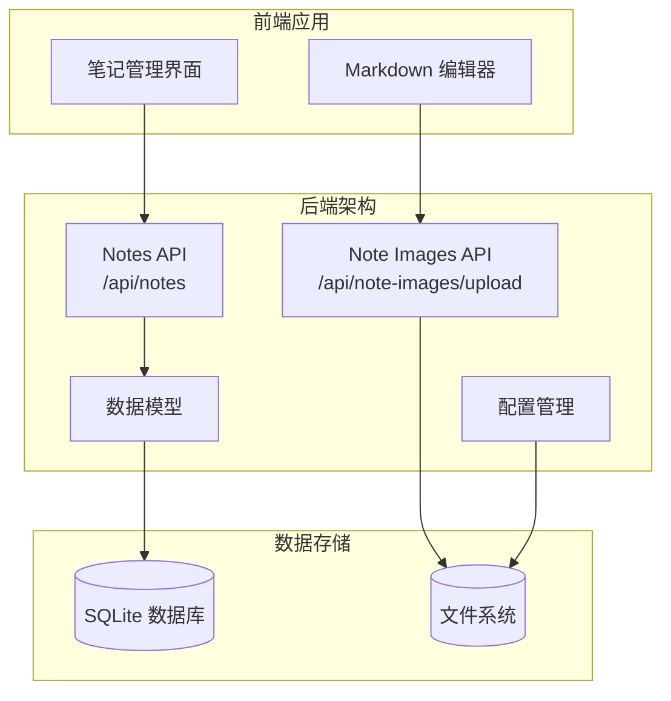
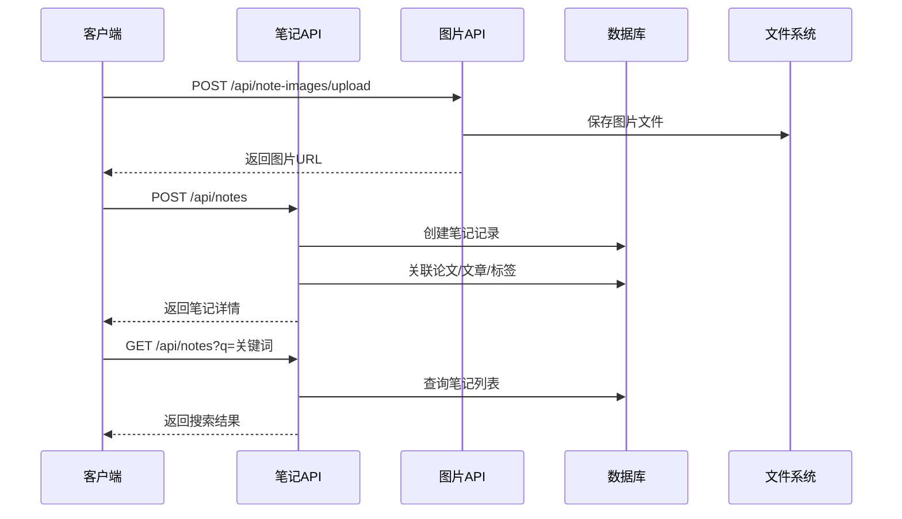
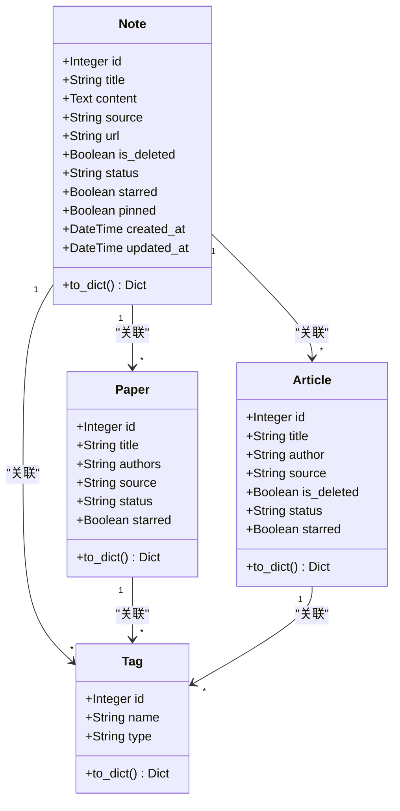

# 笔记管理API

<cite>
**本文档引用的文件**
- [backend/api/notes.py](file://backend/api/notes.py)
- [backend/api/note_images.py](file://backend/api/note_images.py)
- [backend/models/paper.py](file://backend/models/paper.py)
- [backend/config.py](file://backend/config.py)
- [specs/backend/api/notes.yml](file://specs/backend/api/notes.yml)
- [specs/backend/api/note_images.yml](file://specs/backend/api/note_images.yml)
- [specs/backend/models/note.yml](file://specs/backend/models/note.yml)
- [specs/backend/models/tag.yml](file://specs/backend/models/tag.yml)
- [specs/backend/models/paper.yml](file://specs/backend/models/paper.yml)
- [docs/笔记系统设计方案.md](file://docs/笔记系统设计方案.md)
</cite>

## 目录
1. [简介](#简介)
2. [项目结构](#项目结构)
3. [核心组件](#核心组件)
4. [架构概览](#架构概览)
5. [详细组件分析](#详细组件分析)
6. [依赖关系分析](#依赖关系分析)
7. [性能考虑](#性能考虑)
8. [故障排除指南](#故障排除指南)
9. [结论](#结论)

## 简介

PaperHub笔记管理API提供了完整的AI对话笔记管理功能，包括笔记的创建、编辑、删除、查询以及与论文、文章的关联管理。该系统支持Markdown内容处理、标签同步、图片上传存储和访问等功能，为用户提供了一个完整的个人知识管理体系。

## 项目结构

PaperHub采用三层内容库架构，其中笔记库作为个人知识管理的核心模块：



**图表来源**
- [backend/api/notes.py:1-595](file://backend/api/notes.py#L1-L595)
- [backend/api/note_images.py:1-59](file://backend/api/note_images.py#L1-L59)
- [backend/config.py:1-134](file://backend/config.py#L1-L134)

**章节来源**
- [backend/api/notes.py:1-50](file://backend/api/notes.py#L1-L50)
- [backend/config.py:18-33](file://backend/config.py#L18-L33)

## 核心组件

### 笔记API服务
- 提供完整的CRUD操作：GET、POST、PUT、DELETE
- 支持批量操作和高级搜索功能
- 集成笔记状态管理和置顶功能
- 实现与论文、文章的多对多关联管理

### 图片上传服务
- 支持多种图片格式：PNG、JPG、JPEG、GIF、WEBP、BMP
- 文件大小限制：10MB
- 自动生成唯一文件名，确保安全性
- 返回可直接用于Markdown的静态资源URL

### 数据模型层
- Note模型：包含标题、内容、状态、标星、置顶等字段
- 多对多关联：与Paper、Article、Tag建立关联
- 自动时间戳管理：created_at、updated_at字段

**章节来源**
- [backend/api/notes.py:25-134](file://backend/api/notes.py#L25-L134)
- [backend/api/note_images.py:22-59](file://backend/api/note_images.py#L22-L59)
- [specs/backend/models/note.yml:1-115](file://specs/backend/models/note.yml#L1-L115)

## 架构概览



**图表来源**
- [backend/api/notes.py:61-134](file://backend/api/notes.py#L61-L134)
- [backend/api/note_images.py:22-59](file://backend/api/note_images.py#L22-L59)

## 详细组件分析

### 笔记CRUD操作

#### GET /api/notes
获取笔记列表，支持分页和关键词搜索

**请求参数：**
- `q`: 搜索关键词（可选）
- `source`: 笔记来源（可选）
- `sort`: 排序字段，默认created_at
- `page`: 页码，默认1
- `per_page`: 每页数量，默认50

**响应结构：**
```json
{
  "notes": [
    {
      "id": 1,
      "title": "示例笔记",
      "content": "# 标题\n\n内容",
      "source": "manual",
      "url": null,
      "file_path": null,
      "published_at": "2026-01-01T00:00:00",
      "is_deleted": false,
      "status": "pending",
      "starred": false,
      "pinned": false,
      "created_at": "2026-01-01T00:00:00",
      "updated_at": "2026-01-01T00:00:00",
      "tags": [],
      "papers": [],
      "articles": []
    }
  ],
  "total": 1,
  "page": 1,
  "per_page": 50
}
```

#### POST /api/notes
创建新笔记

**请求体参数：**
- `title`: 笔记标题（可选）
- `content`: Markdown内容（必填）
- `source`: 来源类型，默认manual
- `url`: 来源链接（可选）
- `paper_ids`: 关联论文ID数组（可选）
- `paper_id`: 单个关联论文ID（可选）
- `article_ids`: 关联文章ID数组（可选）
- `article_id`: 单个关联文章ID（可选）
- `tag_ids`: 关联标签ID数组（可选）

**响应：**
成功时返回创建的笔记详情和ID

#### GET /api/notes/{note_id}
获取单个笔记详情

**响应：** 包含完整笔记信息，包括关联的论文、文章和标签

#### PUT /api/notes/{note_id}
更新笔记信息

**支持更新的字段：**
- `title`: 标题
- `content`: 内容
- `source`: 来源
- `status`: 状态（pending/reading/done/mastered）
- `starred`: 标星状态
- `pinned`: 置顶状态

#### DELETE /api/notes/{note_id}
删除笔记（硬删除）

**特殊行为：** 删除时会清理笔记内容中引用的本地图片文件

**章节来源**
- [specs/backend/api/notes.yml:5-187](file://specs/backend/api/notes.yml#L5-L187)
- [backend/api/notes.py:25-228](file://backend/api/notes.py#L25-L228)

### 笔记-论文关联管理

#### GET /api/notes/{note_id}/papers
获取关联的论文列表

#### POST /api/notes/{note_id}/papers
关联笔记到论文

**请求体：**
- `paper_id`: 要关联的论文ID

#### DELETE /api/notes/{note_id}/papers/{paper_id}
取消笔记-论文关联

**章节来源**
- [specs/backend/api/notes.yml:188-248](file://specs/backend/api/notes.yml#L188-L248)
- [backend/api/notes.py:234-305](file://backend/api/notes.py#L234-L305)

### 笔记-标签管理

#### GET /api/notes/{note_id}/tags
获取笔记的所有标签

#### POST /api/notes/{note_id}/tags
给笔记添加标签

**请求体支持两种方式：**
- `tag_id`: 指定现有标签ID
- `name`: 新标签名称（如果不存在会自动创建）

#### DELETE /api/notes/{note_id}/tags/{tag_id}
移除笔记的标签

**章节来源**
- [specs/backend/api/notes.yml:249-316](file://specs/backend/api/notes.yml#L249-L316)
- [backend/api/notes.py:311-385](file://backend/api/notes.py#L311-L385)

### 笔记-文章关联管理

#### GET /api/notes/{note_id}/articles
获取关联的文章列表

#### POST /api/notes/{note_id}/articles
关联笔记到文章

**请求体：**
- `article_id`: 要关联的文章ID

#### DELETE /api/notes/{note_id}/articles/{article_id}
取消笔记-文章关联

**章节来源**
- [specs/backend/api/notes.yml:317-377](file://specs/backend/api/notes.yml#L317-L377)
- [backend/api/notes.py:391-465](file://backend/api/notes.py#L391-L465)

### 批量操作功能

#### POST /api/notes/batch
执行批量笔记操作

**支持的操作类型：**
- `update_status`: 更新笔记状态
- `add_tags`: 添加标签
- `remove_tags`: 移除标签
- `toggle_star`: 切换标星状态
- `set_star`: 设置标星状态
- `toggle_pinned`: 切换置顶状态
- `delete`: 删除笔记

**请求体参数：**
- `note_ids`: 要操作的笔记ID数组
- `action`: 操作类型
- `status`: 状态值（当action为update_status时）
- `tag_names`: 标签名称数组（当action为add_tags/remove_tags时）
- `starred`: 标星状态值（当action为set_star时）

**章节来源**
- [specs/backend/api/notes.yml:471-591](file://specs/backend/api/notes.yml#L471-L591)
- [backend/api/notes.py:471-591](file://backend/api/notes.py#L471-L591)

### 笔记图片上传

#### POST /api/note-images/upload
上传笔记中的截图图片

**请求参数：**
- `image`: 图片文件（支持png/jpg/jpeg/gif/webp/bmp）

**响应：**
```json
{
  "success": true,
  "url": "/static/note_images/abc123.png",
  "filename": "abc123.png"
}
```

**存储规则：**
- 文件大小限制：10MB
- 自动生成UUID唯一文件名
- 保存到`data/papers/note_images/`目录
- 返回可直接用于Markdown的URL路径

**章节来源**
- [specs/backend/api/note_images.yml:1-30](file://specs/backend/api/note_images.yml#L1-L30)
- [backend/api/note_images.py:22-59](file://backend/api/note_images.py#L22-L59)
- [backend/config.py:26](file://backend/config.py#L26)

## 依赖关系分析



**图表来源**
- [specs/backend/models/note.yml:1-115](file://specs/backend/models/note.yml#L1-L115)
- [specs/backend/models/paper.yml:1-164](file://specs/backend/models/paper.yml#L1-L164)
- [specs/backend/models/tag.yml:1-68](file://specs/backend/models/tag.yml#L1-L68)

### 数据模型关系

| 关系类型 | 表结构 | 描述 |
|---------|--------|------|
| 一对一 | Note ↔ Paper | 通过中间表note_papers关联 |
| 一对一 | Note ↔ Article | 通过中间表note_articles关联 |
| 一对多 | Note ↔ Tag | 通过中间表note_tags关联 |
| 一对多 | Paper ↔ Tag | 通过中间表paper_tags关联 |
| 一对多 | Article ↔ Tag | 通过中间表article_tags关联 |

**章节来源**
- [specs/backend/models/note.yml:92-107](file://specs/backend/models/note.yml#L92-L107)
- [specs/backend/models/paper.yml:130-145](file://specs/backend/models/paper.yml#L130-L145)
- [specs/backend/models/tag.yml:44-59](file://specs/backend/models/tag.yml#L44-L59)

## 性能考虑

### 数据库优化
- 使用SQLite轻量级数据库，适合个人使用场景
- 建立必要的索引以提高查询性能
- 支持连接池管理，避免频繁创建数据库连接

### 缓存策略
- 使用scoped_session管理会话生命周期
- 合理使用flush和commit操作减少数据库压力
- 批量操作时一次性提交，避免多次往返

### 文件存储优化
- 图片文件采用UUID命名，避免冲突
- 限制文件大小，防止存储空间滥用
- 删除笔记时自动清理关联的图片文件

## 故障排除指南

### 常见错误及解决方案

**404 错误（笔记不存在）**
- 检查note_id是否正确
- 确认笔记未被软删除
- 验证用户权限

**409 错误（笔记已存在）**
- 使用去重检查逻辑
- 避免重复创建相同内容的笔记
- 检查title、content、url组合的唯一性

**500 错误（服务器内部错误）**
- 检查数据库连接状态
- 验证文件系统权限
- 查看服务器日志获取详细错误信息

**400 错误（请求参数错误）**
- 验证必需参数是否提供
- 检查数据类型和格式
- 确认关联ID的有效性

### 图片上传问题

**上传失败**
- 检查文件大小是否超过10MB限制
- 验证文件扩展名是否在允许列表中
- 确认目标目录具有写入权限

**图片无法访问**
- 检查静态文件服务配置
- 验证文件路径是否正确
- 确认文件权限设置

**章节来源**
- [backend/api/notes.py:130-134](file://backend/api/notes.py#L130-L134)
- [backend/api/note_images.py:52-59](file://backend/api/note_images.py#L52-L59)

## 结论

PaperHub笔记管理API提供了一个完整、灵活且易于使用的个人知识管理解决方案。通过清晰的RESTful接口设计、完善的关联关系管理和强大的搜索功能，用户可以高效地组织和管理自己的AI对话笔记。

系统的主要优势包括：
- **完整的CRUD操作**：支持笔记的创建、查询、更新和删除
- **智能关联管理**：与论文、文章建立多对多关联
- **标签系统**：支持标签的自动创建和同步
- **图片处理**：完整的图片上传、存储和访问流程
- **状态管理**：支持笔记状态、标星和置顶功能
- **批量操作**：提供高效的批量管理能力

该API设计遵循了良好的软件工程实践，具有良好的可扩展性和维护性，为后续的功能增强奠定了坚实的基础。