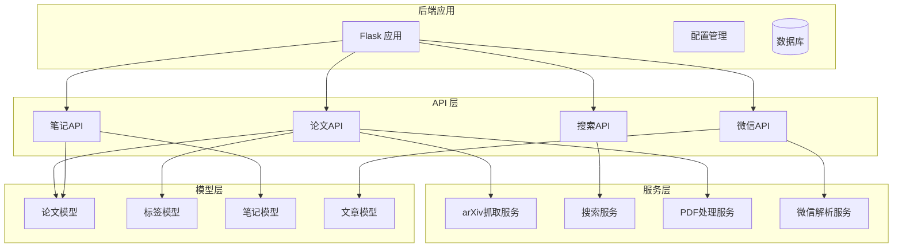
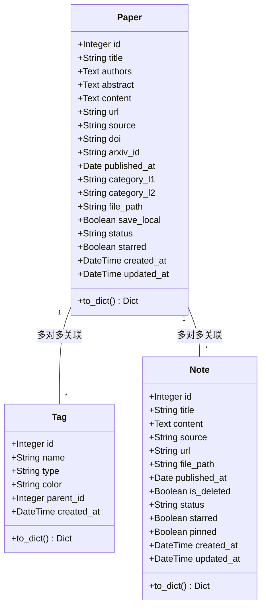
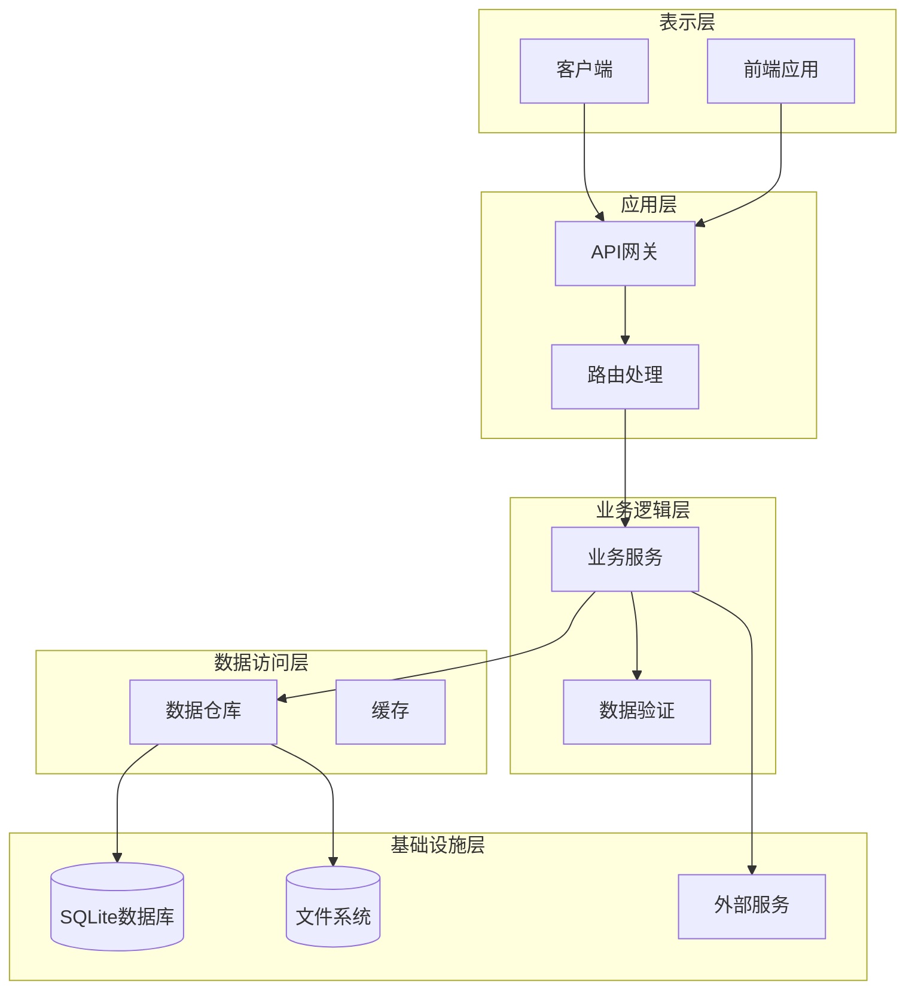
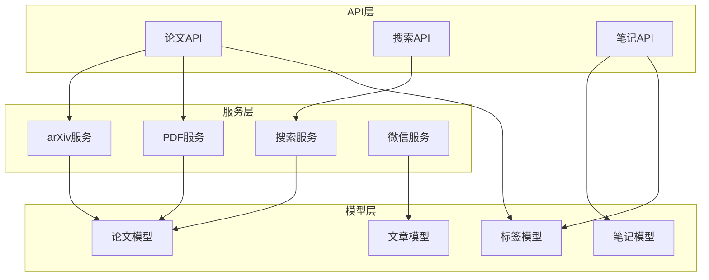
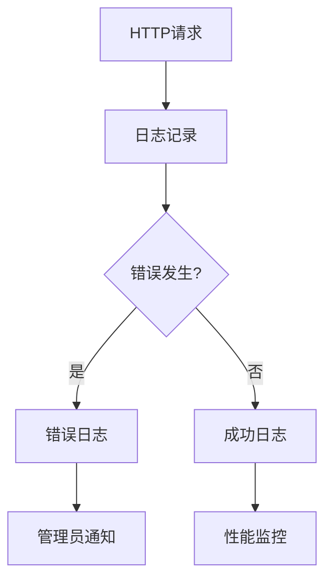

# 论文管理API

<cite>
**本文档引用的文件**
- [backend/api/papers.py](file://backend/api/papers.py)
- [backend/models/paper.py](file://backend/models/paper.py)
- [specs/backend/api/papers.yml](file://specs/backend/api/papers.yml)
- [backend/app.py](file://backend/app.py)
- [backend/config.py](file://backend/config.py)
- [backend/services/arxiv_fetcher.py](file://backend/services/arxiv_fetcher.py)
- [backend/api/search.py](file://backend/api/search.py)
- [specs/backend/api/search.yml](file://specs/backend/api/search.yml)
- [backend/api/notes.py](file://backend/api/notes.py)
- [specs/backend/api/notes.yml](file://specs/backend/api/notes.yml)
- [scripts/tests/test_batch_guide.md](file://scripts/tests/test_batch_guide.md)
</cite>

## 目录
1. [简介](#简介)
2. [项目结构](#项目结构)
3. [核心组件](#核心组件)
4. [架构概览](#架构概览)
5. [详细组件分析](#详细组件分析)
6. [依赖关系分析](#依赖关系分析)
7. [性能考虑](#性能考虑)
8. [故障排除指南](#故障排除指南)
9. [结论](#结论)

## 简介

PaperHub 是一个基于 Flask 的论文管理系统，提供了完整的论文生命周期管理功能。本文档详细说明了论文管理API的接口规范，包括CRUD操作、标签管理、批量操作、搜索功能、arXiv导入、PDF下载、标签关联等高级功能。

该系统支持多种论文来源（arXiv、微信公众号、博客、会议论文等），提供灵活的筛选和排序机制，并具备强大的搜索能力。

## 项目结构

PaperHub 采用模块化的项目结构，主要分为以下几个部分：



**图表来源**
- [backend/app.py:140-157](file://backend/app.py#L140-L157)
- [backend/api/papers.py:9](file://backend/api/papers.py#L9)
- [backend/api/search.py:12](file://backend/api/search.py#L12)

**章节来源**
- [backend/app.py:140-157](file://backend/app.py#L140-L157)
- [backend/config.py:18-32](file://backend/config.py#L18-L32)

## 核心组件

### 论文模型 (Paper Model)

论文模型定义了论文的核心属性和关系：



**图表来源**
- [backend/models/paper.py:120-186](file://backend/models/paper.py#L120-L186)
- [backend/models/paper.py:93-115](file://backend/models/paper.py#L93-L115)
- [backend/models/paper.py:250-294](file://backend/models/paper.py#L250-L294)

### 数据库配置

系统使用 SQLite 作为默认数据库，支持连接池管理和线程安全：

- **数据库类型**: SQLite
- **连接池**: 支持最大溢出连接数10，连接回收时间3600秒
- **数据目录**: data/papers 存放论文文件
- **向量存储**: ChromaDB 存储论文向量

**章节来源**
- [backend/config.py:39-56](file://backend/config.py#L39-L56)
- [backend/config.py:92-103](file://backend/config.py#L92-L103)

## 架构概览

PaperHub 采用分层架构设计，各层职责明确：



**图表来源**
- [backend/app.py:41-64](file://backend/app.py#L41-L64)
- [backend/app.py:140-157](file://backend/app.py#L140-L157)

## 详细组件分析

### 论文CRUD操作

#### 获取论文列表 (GET /api/papers)

**功能描述**: 支持分页和多维度筛选的论文列表查询

**URL参数**:
- `page`: 页码，默认1
- `per_page`: 每页数量，默认20，最大100
- `category_l1`: 一级分类
- `status`: 阅读状态 (pending/reading/done/mastered)
- `starred`: 是否标星 (true/false)
- `source`: 来源 (arxiv/wechat/blog/conference/pdf)
- `tag_ids`: 标签ID列表，逗号分隔
- `published_date`: 发表日期 (YYYY-MM-DD)
- `start_date/end_date`: 日期范围筛选
- `year/month`: 年份和月份筛选
- `start_year/end_year/start_month/end_month`: 更精细的时间范围

**响应结构**:
```json
{
  "papers": [
    {
      "id": 1,
      "title": "论文标题",
      "authors": "作者列表",
      "abstract": "摘要",
      "category_l1": "cs",
      "category_l2": "AI",
      "status": "pending",
      "starred": false,
      "file_path": "data/papers/arxiv/2310.01234.pdf",
      "file_size": "2.5MB",
      "tags": [],
      "created_at": "2024-01-01T00:00:00Z",
      "updated_at": "2024-01-01T00:00:00Z"
    }
  ],
  "total": 100,
  "page": 1,
  "per_page": 20,
  "pages": 5
}
```

**状态码**:
- 200: 成功
- 500: 服务器内部错误

**章节来源**
- [backend/api/papers.py:29-108](file://backend/api/papers.py#L29-L108)
- [specs/backend/api/papers.yml:5-97](file://specs/backend/api/papers.yml#L5-L97)

#### 获取单个论文详情 (GET /api/papers/{paper_id})

**功能描述**: 获取指定ID的论文详细信息，包含关联的文章和笔记

**路径参数**:
- `paper_id`: 论文ID

**响应扩展**:
- `articles`: 关联的文章列表
- `notes`: 关联的笔记列表
- `file_size`: 文件大小（自动计算）

**状态码**:
- 200: 成功
- 404: 论文不存在

**章节来源**
- [backend/api/papers.py:111-147](file://backend/api/papers.py#L111-L147)
- [specs/backend/api/papers.yml:104-135](file://specs/backend/api/papers.yml#L104-L135)

#### 更新论文信息 (PUT /api/papers/{paper_id})

**功能描述**: 更新论文的基本信息和状态

**请求体字段**:
- `title`: 标题
- `authors`: 作者
- `abstract`: 摘要
- `content`: 全文内容
- `category_l1`: 一级分类
- `category_l2`: 二级分类
- `status`: 阅读状态
- `starred`: 是否标星
- `arxiv_id`: arXiv ID
- `save_local`: 是否保存本地文件
- `url`: 原文链接
- `source`: 来源

**特殊功能**:
- 自动文件本地化：当设置 `save_local` 为 true 且论文有URL时，自动下载PDF
- 文件清理：当设置为 false 时，自动删除本地文件

**状态码**:
- 200: 成功
- 404: 论文不存在

**章节来源**
- [backend/api/papers.py:181-253](file://backend/api/papers.py#L181-L253)
- [specs/backend/api/papers.yml:137-211](file://specs/backend/api/papers.yml#L137-L211)

#### 删除论文 (DELETE /api/papers/{paper_id})

**功能描述**: 删除论文及其关联文件

**删除规则**:
- 硬删除论文记录
- 删除本地PDF文件
- 删除微信文章的_images目录
- 删除note/zhihu来源的.md文件

**响应**:
```json
{
  "message": "Paper deleted successfully",
  "paper_id": 1
}
```

**状态码**:
- 200: 成功
- 404: 论文不存在

**章节来源**
- [backend/api/papers.py:256-295](file://backend/api/papers.py#L256-L295)
- [specs/backend/api/papers.yml:213-229](file://specs/backend/api/papers.yml#L213-L229)

### 标签管理

#### 获取所有标签 (GET /api/tags)

**功能描述**: 获取所有标签及其关联论文数量

**响应结构**:
```json
{
  "tags": [
    {
      "id": 1,
      "name": "LLM",
      "type": "tech",
      "color": "#00CED1",
      "count": 15
    }
  ]
}
```

**排序规则**: 按关联论文数倒序，数量相同时按名称排序

**状态码**:
- 200: 成功

**章节来源**
- [backend/api/papers.py:369-391](file://backend/api/papers.py#L369-L391)
- [specs/backend/api/papers.yml:254-264](file://specs/backend/api/papers.yml#L254-L264)

#### 给论文添加标签 (POST /api/papers/{paper_id}/tags)

**功能描述**: 为论文添加标签，标签不存在时自动创建

**请求体**:
```json
{
  "name": "新标签名称"
}
```

**响应**: 返回论文的完整信息

**状态码**:
- 200: 成功
- 404: 论文不存在

**章节来源**
- [backend/api/papers.py:410-436](file://backend/api/papers.py#L410-L436)
- [specs/backend/api/papers.yml:266-287](file://specs/backend/api/papers.yml#L266-L287)

#### 移除论文标签 (DELETE /api/papers/{paper_id}/tags/{tag_id})

**功能描述**: 从论文移除指定标签

**状态码**:
- 200: 成功
- 404: 论文或标签不存在

**章节来源**
- [backend/api/papers.py:439-457](file://backend/api/papers.py#L439-L457)
- [specs/backend/api/papers.yml:289-309](file://specs/backend/api/papers.yml#L289-L309)

### 高级功能

#### 论文搜索 (GET /api/papers/search)

**功能描述**: 搜索arXiv远程论文

**查询参数**:
- `keywords`: 关键词，逗号分隔
- `categories`: arXiv分类，逗号分隔  
- `max_results`: 最大返回数量，默认20，最大100
- `start_date`: 开始日期 (YYYY-MM-DD)
- `end_date`: 结束日期 (YYYY-MM-DD)
- `sort_by`: 排序方式 (submittedDate/updatedDate/relevance)
- `sort_order`: 排序顺序 (ascending/descending)

**响应结构**:
```json
{
  "results": [
    {
      "title": "论文标题",
      "authors": ["作者1", "作者2"],
      "abstract": "摘要",
      "published_at": "2024-01-01",
      "pdf_url": "https://arxiv.org/pdf/2310.01234.pdf",
      "categories": ["cs.AI"],
      "category_l1": "cs",
      "category_l2": "AI",
      "doi": "10.1234/example",
      "arxiv_id": "2310.01234",
      "url": "https://arxiv.org/abs/2310.01234"
    }
  ],
  "total": 10,
  "keywords": "machine learning",
  "categories": "cs.AI"
}
```

**状态码**:
- 200: 成功
- 400: 日期格式错误
- 500: 服务器内部错误

**章节来源**
- [backend/api/papers.py:475-551](file://backend/api/papers.py#L475-L551)
- [specs/backend/api/papers.yml:327-376](file://specs/backend/api/papers.yml#L327-L376)

#### 批量操作 (POST /api/papers/batch)

**功能描述**: 批量更新论文状态/标签/标星

**请求体**:
```json
{
  "paper_ids": [1, 2, 3],
  "action": "update_status" | "add_tags" | "remove_tags" | "toggle_star" | "set_star" | "delete",
  "status": "pending" | "reading" | "done" | "mastered",
  "tag_names": ["LLM", "RAG"],
  "starred": true | false
}
```

**响应结构**:
```json
{
  "message": "Batch operation completed: 3 success, 0 failed",
  "action": "update_status",
  "success_count": 3,
  "failed_count": 0,
  "results": {
    "success": [1, 2, 3],
    "failed": []
  }
}
```

**支持的操作**:
- `update_status`: 更新论文状态
- `add_tags`: 添加标签
- `remove_tags`: 移除标签
- `toggle_star`: 切换标星状态
- `set_star`: 设置标星状态
- `delete`: 删除论文

**状态码**:
- 200: 成功
- 400: 缺少参数或无效参数
- 500: 服务器内部错误

**章节来源**
- [backend/api/papers.py:699-800](file://backend/api/papers.py#L699-L800)
- [scripts/tests/test_batch_guide.md:21-40](file://scripts/tests/test_batch_guide.md#L21-L40)

#### PDF下载 (GET /api/papers/{paper_id}/download)

**功能描述**: 下载论文PDF文件或返回HTML内容

**支持的来源**:
- arXiv论文：直接下载PDF
- 微信文章：返回HTML内容，自动替换图片链接
- 笔记/Zhihu文章：返回HTML内容

**响应**:
- PDF文件：直接下载
- HTML文件：返回文本内容

**状态码**:
- 200: 成功
- 404: 文件不存在

**章节来源**
- [backend/api/papers.py:324-366](file://backend/api/papers.py#L324-L366)

#### 微信图片服务 (GET /api/papers/{paper_id}/images/{folder}/{filename})

**功能描述**: 提供微信文章中图片的访问服务

**路径参数**:
- `paper_id`: 论文ID
- `folder`: 图片文件夹
- `filename`: 图片文件名

**用途**: 解决微信图片防盗链问题，提供本地图片服务

**状态码**:
- 200: 成功
- 404: 图片不存在

**章节来源**
- [backend/api/papers.py:298-321](file://backend/api/papers.py#L298-L321)

### 搜索功能

#### 全文搜索 (GET /api/search)

**功能描述**: 跨模块全文搜索（论文/文章/笔记）

**查询参数**:
- `q`: 搜索关键词
- `module`: 搜索范围 (all/papers/articles/notes)
- `page`: 页码，默认1
- `size`: 每页数量，默认20
- `highlight`: 是否高亮关键词，默认true

**响应结构**:
```json
{
  "success": true,
  "total": 100,
  "page": 1,
  "size": 20,
  "results": [
    {
      "id": 1,
      "title": "搜索结果标题",
      "content": "匹配的内容片段",
      "score": 0.95,
      "type": "paper"
    }
  ],
  "breakdown": {
    "papers": 60,
    "articles": 25,
    "notes": 15
  }
}
```

**状态码**:
- 200: 成功
- 400: 搜索关键词为空
- 500: 服务器内部错误

**章节来源**
- [backend/api/search.py:14-51](file://backend/api/search.py#L14-L51)
- [specs/backend/api/search.yml:5-43](file://specs/backend/api/search.yml#L5-L43)

#### 搜索建议 (GET /api/search/suggest)

**功能描述**: 提供搜索关键词联想建议

**查询参数**:
- `q`: 输入前缀
- `limit`: 建议数量，默认5

**响应结构**:
```json
{
  "success": true,
  "suggestions": ["关键词1", "关键词2", "关键词3"]
}
```

**状态码**:
- 200: 成功
- 500: 服务器内部错误

**章节来源**
- [backend/api/search.py:53-70](file://backend/api/search.py#L53-L70)
- [specs/backend/api/search.yml:47-69](file://specs/backend/api/search.yml#L47-L69)

## 依赖关系分析

### 组件耦合度



**图表来源**
- [backend/api/papers.py:21-26](file://backend/api/papers.py#L21-L26)
- [backend/services/arxiv_fetcher.py:11-14](file://backend/services/arxiv_fetcher.py#L11-L14)

### 外部依赖

系统依赖以下外部服务和库：

- **arXiv API**: 论文搜索和下载
- **requests**: HTTP请求处理
- **flask**: Web框架
- **sqlalchemy**: ORM映射
- **fitz**: PDF文本提取
- **chromadb**: 向量存储

**章节来源**
- [backend/services/arxiv_fetcher.py:5-8](file://backend/services/arxiv_fetcher.py#L5-L8)

## 性能考虑

### 数据库优化

- **连接池**: 使用SQLAlchemy连接池，支持并发访问
- **索引策略**: 在常用查询字段上建立索引
- **查询优化**: 使用延迟加载避免不必要的关联查询

### 缓存策略

- **静态资源**: 使用Flask内置静态文件服务
- **图片缓存**: 微信图片代理服务支持缓存头
- **搜索结果**: 搜索服务支持结果缓存

### 文件处理优化

- **PDF下载**: 支持流式下载，避免内存占用
- **文件大小**: 自动计算文件大小，提供人类可读格式
- **异步处理**: 大文件操作采用异步处理

## 故障排除指南

### 常见错误及解决方案

**1. 论文不存在 (404错误)**

可能原因：
- 论文ID错误
- 论文已被删除
- 数据库连接问题

解决方法：
- 验证论文ID的有效性
- 检查数据库连接状态
- 重新启动应用服务

**2. 文件下载失败 (404错误)**

可能原因：
- 文件路径错误
- 文件已被删除
- 权限问题

解决方法：
- 检查文件路径配置
- 验证文件存在性
- 检查文件权限

**3. arXiv搜索失败 (500错误)**

可能原因：
- arXiv API不可用
- 网络连接问题
- 请求频率过高

解决方法：
- 检查网络连接
- 降低请求频率
- 使用备用搜索方法

**4. 批量操作部分失败**

可能原因：
- 部分论文ID不存在
- 标签名称冲突
- 数据库事务回滚

解决方法：
- 检查paper_ids列表
- 验证标签名称
- 查看failed数组中的具体错误

### 日志监控

系统提供详细的日志记录：



**章节来源**
- [backend/app.py:70-89](file://backend/app.py#L70-L89)

## 结论

PaperHub论文管理API提供了完整的论文生命周期管理功能，具有以下特点：

**核心优势**:
- **完整的CRUD操作**: 支持论文的创建、读取、更新、删除
- **灵活的筛选机制**: 支持多维度筛选和排序
- **强大的搜索能力**: 支持全文搜索和关键词联想
- **丰富的标签系统**: 支持自定义标签和标签管理
- **批量操作支持**: 提供高效的批量处理功能
- **多来源支持**: 支持arXiv、微信、博客等多种来源

**技术特性**:
- **模块化设计**: 清晰的分层架构
- **性能优化**: 连接池、缓存、异步处理
- **错误处理**: 完善的错误处理和日志记录
- **扩展性**: 易于添加新的功能和来源

该API设计合理，功能完善，能够满足论文管理的各种需求，为学术研究和知识管理提供了强有力的技术支撑。