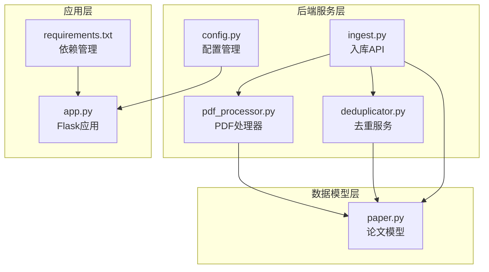
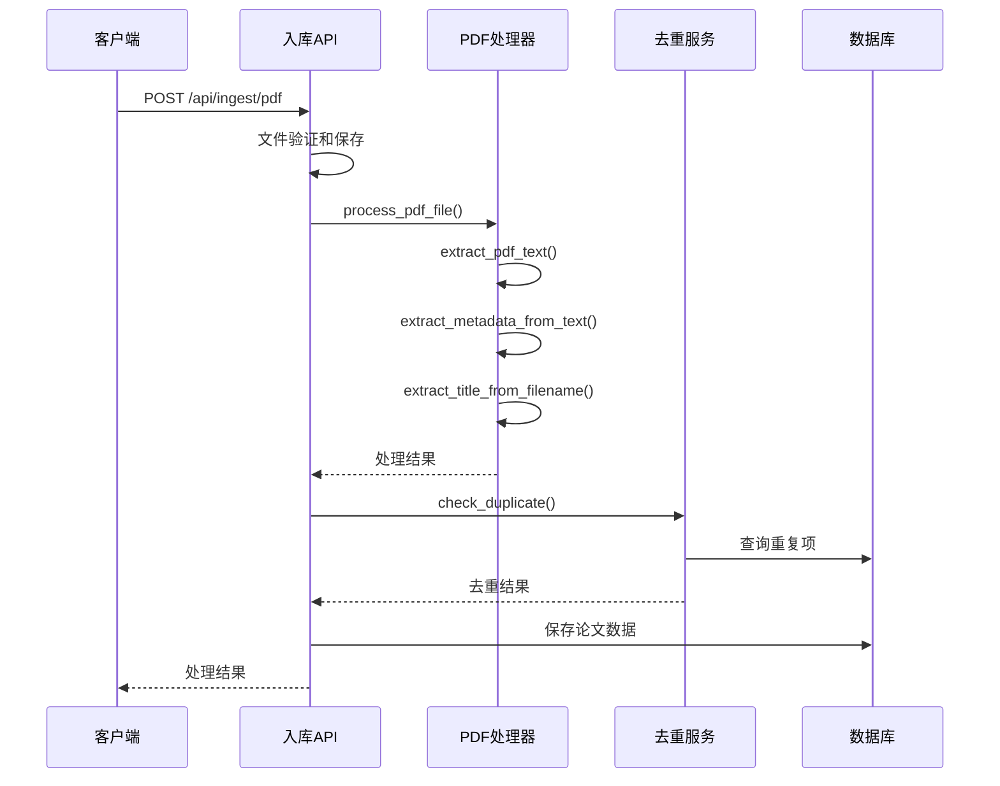
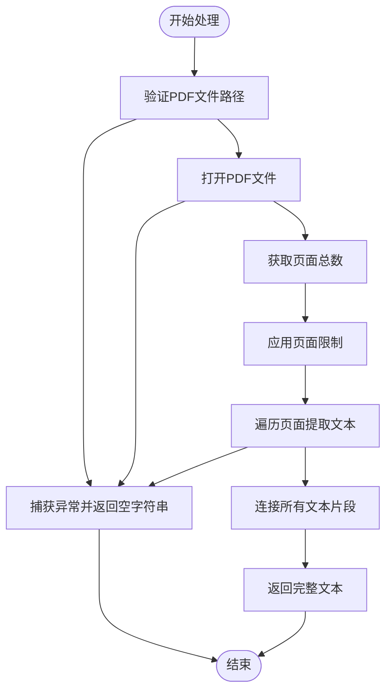
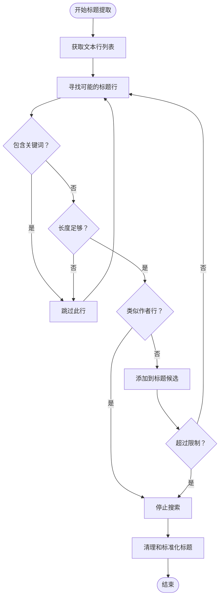
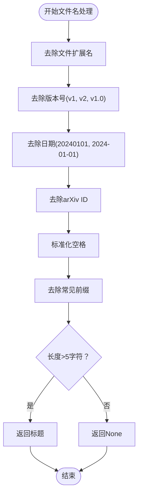
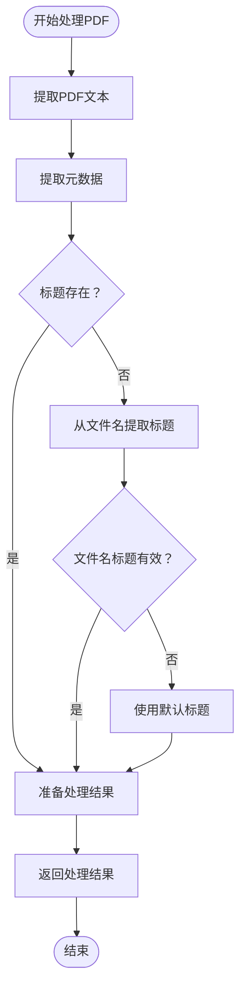
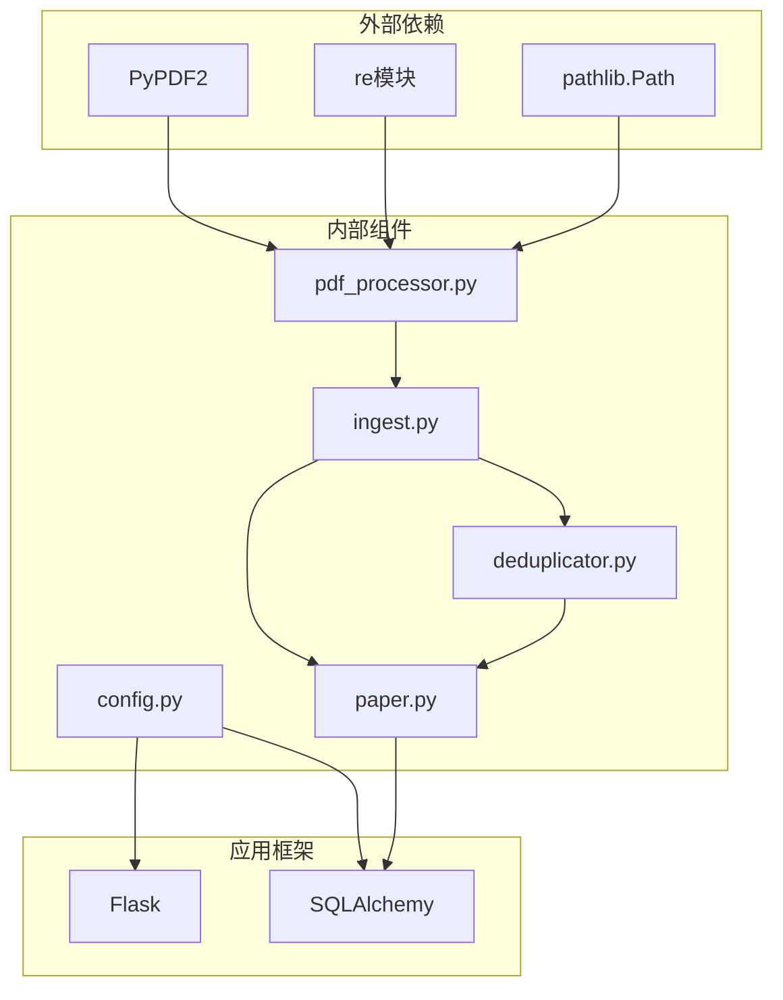

# PDF处理服务

<cite>
**本文档引用的文件**
- [pdf_processor.py](file://backend/services/pdf_processor.py)
- [ingest.py](file://backend/api/ingest.py)
- [paper.py](file://backend/models/paper.py)
- [config.py](file://backend/config.py)
- [requirements.txt](file://backend/requirements.txt)
- [app.py](file://backend/app.py)
- [deduplicator.py](file://backend/services/deduplicator.py)
</cite>

## 目录
1. [简介](#简介)
2. [项目结构](#项目结构)
3. [核心组件](#核心组件)
4. [架构概览](#架构概览)
5. [详细组件分析](#详细组件分析)
6. [依赖关系分析](#依赖关系分析)
7. [性能考虑](#性能考虑)
8. [故障排除指南](#故障排除指南)
9. [结论](#结论)

## 简介

PaperHub项目中的PDF处理服务是一个完整的PDF文件处理和元数据提取系统。该服务基于PyPDF2库实现了PDF文本提取、元数据识别、文件去重等功能，为PaperHub的论文管理和知识库构建提供了强大的技术支持。

PDF处理服务的核心目标是：
- 高效提取PDF文件中的文本内容
- 从提取的文本中智能识别论文标题、作者和摘要
- 从文件名中提取标题信息作为备用方案
- 处理大文件的内存优化策略
- 实现完整的错误恢复机制

## 项目结构

PDF处理服务在PaperHub项目中的组织结构如下：

**图表来源**
- [pdf_processor.py:1-170](file://backend/services/pdf_processor.py#L1-L170)
- [ingest.py:1-800](file://backend/api/ingest.py#L1-L800)
- [paper.py:1-360](file://backend/models/paper.py#L1-L360)

**章节来源**
- [pdf_processor.py:1-170](file://backend/services/pdf_processor.py#L1-L170)
- [ingest.py:1-800](file://backend/api/ingest.py#L1-L800)
- [paper.py:1-360](file://backend/models/paper.py#L1-L360)

## 核心组件

PDF处理服务包含以下核心组件：

### 1. PDF文本提取器
- **功能**：使用PyPDF2库提取PDF文件的文本内容
- **特性**：支持页面限制、错误处理、内存优化
- **实现**：`extract_pdf_text()`函数

### 2. 元数据提取器
- **功能**：从PDF文本中智能提取论文标题、作者和摘要
- **特性**：基于规则的文本分析、正则表达式匹配、上下文感知
- **实现**：`extract_metadata_from_text()`函数

### 3. 文件名标题提取器
- **功能**：从PDF文件名中提取标题信息
- **特性**：支持arXiv ID、版本号、日期等格式的清理
- **实现**：`extract_title_from_filename()`函数

### 4. PDF处理管道
- **功能**：整合文本提取和元数据提取的完整处理流程
- **特性**：错误恢复、默认值处理、格式标准化
- **实现**：`process_pdf_file()`函数

**章节来源**
- [pdf_processor.py:10-169](file://backend/services/pdf_processor.py#L10-L169)

## 架构概览

PDF处理服务采用分层架构设计，确保了良好的模块化和可维护性：

**图表来源**
- [ingest.py:467-619](file://backend/api/ingest.py#L467-L619)
- [pdf_processor.py:148-169](file://backend/services/pdf_processor.py#L148-L169)
- [deduplicator.py:79-112](file://backend/services/deduplicator.py#L79-L112)

## 详细组件分析

### PDF文本提取组件

PDF文本提取组件是整个PDF处理服务的基础，负责从PDF文件中提取原始文本内容。

#### 核心算法实现

**图表来源**
- [pdf_processor.py:10-23](file://backend/services/pdf_processor.py#L10-L23)

#### 页面遍历算法

PDF文本提取采用了高效的页面遍历算法：

- **页面限制**：默认只处理前50页，防止大文件导致的内存问题
- **增量处理**：逐页提取文本，避免一次性加载所有页面
- **错误隔离**：单页错误不影响其他页面的处理

#### 性能优化策略

- **内存管理**：使用列表存储文本片段，避免一次性拼接大量字符串
- **早停机制**：达到页面限制时立即停止处理
- **异常处理**：捕获所有可能的PDF解析异常

**章节来源**
- [pdf_processor.py:10-23](file://backend/services/pdf_processor.py#L10-L23)

### 元数据提取组件

元数据提取组件从PDF文本中智能识别论文的关键信息，包括标题、作者和摘要。

#### 标题提取算法

**图表来源**
- [pdf_processor.py:66-95](file://backend/services/pdf_processor.py#L66-L95)

#### 作者提取算法

作者提取算法采用了多策略的识别机制：

1. **数字上标识别**：检测包含数字上标的行（如 1,2,*）
2. **分隔符分割**：支持分号、逗号、'and'、'et al'等分隔符
3. **大写字母分割**：基于作者姓名的特征进行分割
4. **邮箱过滤**：排除包含邮箱地址的行

#### 摘要提取算法

摘要提取采用了基于上下文的智能识别：

- **关键词定位**：寻找包含"abstract"的行
- **边界检测**：遇到章节标题（如introduction、conclusion等）停止
- **长度限制**：最多提取40行摘要内容
- **格式清理**：去除多余的空白字符

**章节来源**
- [pdf_processor.py:58-145](file://backend/services/pdf_processor.py#L58-L145)

### 文件名标题提取组件

文件名标题提取组件提供了备用的标题提取方案，特别适用于PDF文件缺少元数据的情况。

#### 标准化处理流程

**图表来源**
- [pdf_processor.py:26-55](file://backend/services/pdf_processor.py#L26-L55)

#### 正则表达式处理

文件名处理使用了多个正则表达式来识别和清理不同的模式：

- 版本号模式：`_v\d+(\.\d+)?$` 和 `-v\d+(\.\d+)?$`
- 日期模式：`_\d{4}[-_]?\d{2}[-_]?\d{2}$`
- arXiv ID模式：`\d{4}\.\d+[_-]` 和 `[_-]\d{4}\.\d+$`
- 前缀清理：`^[Pp]aper[_-]` 和 `^[Aa]rXiv[_-]`

**章节来源**
- [pdf_processor.py:26-55](file://backend/services/pdf_processor.py#L26-L55)

### PDF处理管道组件

PDF处理管道组件整合了所有处理步骤，提供了完整的PDF文件处理流程。

#### 处理流程

**图表来源**
- [pdf_processor.py:148-169](file://backend/services/pdf_processor.py#L148-L169)

#### 错误恢复机制

处理管道包含了完善的错误恢复机制：

- **文本提取失败**：返回空字符串而非抛出异常
- **元数据提取失败**：使用文件名提取作为后备方案
- **标题提取失败**：使用"未命名论文"作为默认值
- **作者提取失败**：使用"未知作者"作为默认值

**章节来源**
- [pdf_processor.py:148-169](file://backend/services/pdf_processor.py#L148-L169)

## 依赖关系分析

PDF处理服务的依赖关系体现了清晰的分层架构：

**图表来源**
- [requirements.txt:1-15](file://backend/requirements.txt#L1-L15)
- [pdf_processor.py:5-7](file://backend/services/pdf_processor.py#L5-L7)
- [ingest.py:1-800](file://backend/api/ingest.py#L1-L800)

### 外部依赖分析

PDF处理服务主要依赖于以下外部库：

- **PyPDF2**：PDF文件解析和文本提取的核心库
- **re**：正则表达式处理，用于文本模式匹配
- **pathlib**：文件路径处理，提供跨平台的文件操作

### 内部组件依赖

PDF处理服务的内部组件之间存在明确的依赖关系：

- **pdf_processor.py**：独立的处理组件，不依赖其他业务逻辑
- **ingest.py**：API层，依赖pdf_processor进行实际处理
- **deduplicator.py**：去重服务，与pdf_processor配合使用
- **paper.py**：数据模型，存储处理结果

**章节来源**
- [requirements.txt:1-15](file://backend/requirements.txt#L1-L15)
- [pdf_processor.py:5-7](file://backend/services/pdf_processor.py#L5-L7)

## 性能考虑

PDF处理服务在设计时充分考虑了性能优化和资源管理：

### 内存优化策略

1. **页面限制**：默认只处理前50页，防止大文件占用过多内存
2. **增量处理**：逐页提取文本，避免一次性加载所有页面到内存
3. **文本片段管理**：使用列表存储文本片段，减少字符串拼接开销

### 处理策略优化

1. **早停机制**：在达到页面限制或检测到结束条件时立即停止
2. **智能跳过**：跳过明显不是标题或作者的行，减少不必要的处理
3. **缓存友好的设计**：避免创建不必要的中间对象

### 错误处理优化

1. **异常隔离**：每个处理步骤都有独立的异常处理
2. **渐进式失败**：即使部分处理失败，也尽量返回可用的结果
3. **资源清理**：确保异常情况下也能正确释放资源

## 故障排除指南

### 常见问题及解决方案

#### PDF文件无法解析

**症状**：`PDF text extraction error` 异常

**原因**：
- PDF文件损坏或加密
- PDF版本不兼容
- 文件权限问题

**解决方案**：
- 验证PDF文件的完整性和可访问性
- 尝试使用其他PDF查看器打开文件
- 检查文件权限设置

#### 文本提取结果为空

**症状**：返回的文本内容为空字符串

**原因**：
- PDF文件没有可提取的文本（扫描版PDF）
- 页面数量为0
- 提取过程发生异常

**解决方案**：
- 确认PDF文件包含可编辑文本
- 检查PDF文件的页面数量
- 查看日志文件获取详细错误信息

#### 元数据提取不准确

**症状**：提取的标题、作者或摘要不正确

**原因**：
- PDF文本格式不符合预期
- 正则表达式匹配不准确
- 文本编码问题

**解决方案**：
- 检查PDF的文本编码格式
- 调整正则表达式的匹配规则
- 验证PDF的文本布局和格式

### 调试技巧

1. **启用详细日志**：查看PDF处理过程中的详细信息
2. **分步调试**：分别测试文本提取和元数据提取功能
3. **边界测试**：测试各种格式的PDF文件
4. **性能监控**：监控内存使用和处理时间

**章节来源**
- [pdf_processor.py:21-23](file://backend/services/pdf_processor.py#L21-L23)

## 结论

PaperHub项目的PDF处理服务展现了优秀的软件工程实践：

### 技术优势

1. **模块化设计**：清晰的功能分离和职责划分
2. **健壮性**：完善的错误处理和恢复机制
3. **性能优化**：针对大文件的内存和处理优化
4. **可扩展性**：易于添加新的处理功能和算法

### 架构特点

1. **分层架构**：从底层的PDF解析到高层的业务逻辑清晰分离
2. **依赖注入**：通过API层调用处理服务，便于测试和维护
3. **数据持久化**：与数据库模型无缝集成
4. **错误隔离**：每个组件都有独立的错误处理能力

### 应用价值

PDF处理服务为PaperHub项目提供了：
- 高效的论文入库能力
- 智能的元数据提取功能
- 完善的去重机制
- 良好的用户体验

该服务的设计理念和实现方式为类似的PDF处理应用场景提供了宝贵的参考和借鉴价值。