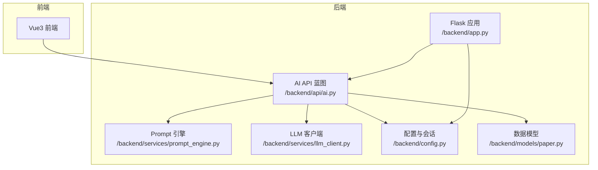
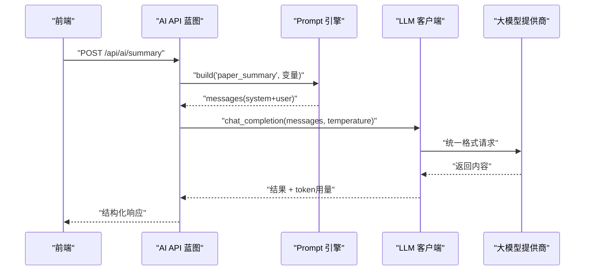
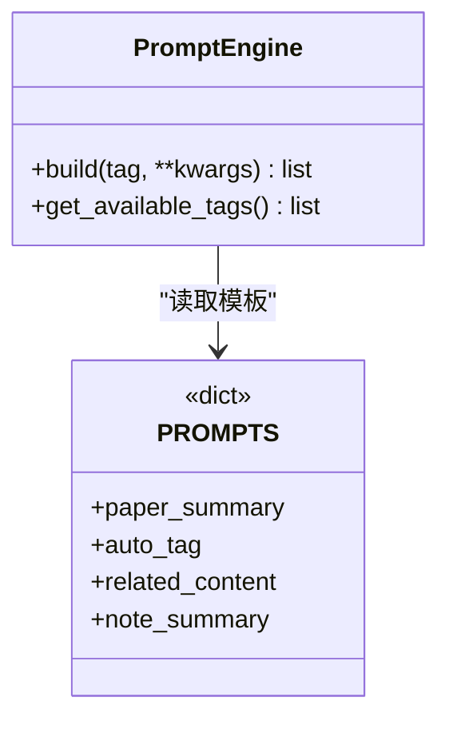
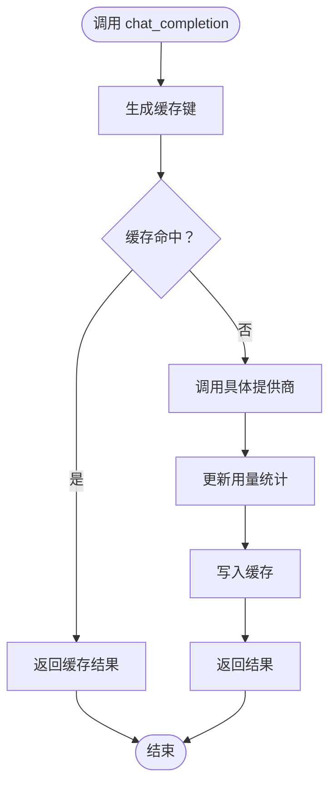
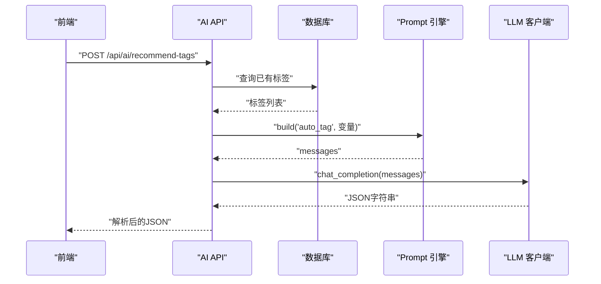
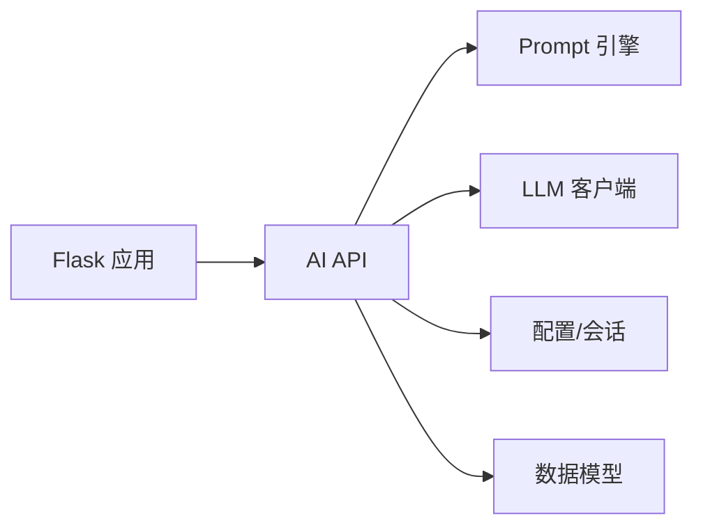

# Prompt工程

<cite>
**本文引用的文件**
- [backend/api/ai.py](file://backend/api/ai.py)
- [backend/services/prompt_engine.py](file://backend/services/prompt_engine.py)
- [backend/services/llm_client.py](file://backend/services/llm_client.py)
- [specs/backend/services/prompt_engine.yml](file://specs/backend/services/prompt_engine.yml)
- [specs/backend/api/ai.yml](file://specs/backend/api/ai.yml)
- [backend/models/paper.py](file://backend/models/paper.py)
- [backend/config.py](file://backend/config.py)
- [backend/app.py](file://backend/app.py)
- [docs/大模型融入系统设计方案.md](file://docs/大模型融入系统设计方案.md)
- [scripts/tests/test_batch_guide.md](file://scripts/tests/test_batch_guide.md)
</cite>

## 目录
1. [简介](#简介)
2. [项目结构](#项目结构)
3. [核心组件](#核心组件)
4. [架构总览](#架构总览)
5. [详细组件分析](#详细组件分析)
6. [依赖分析](#依赖分析)
7. [性能考虑](#性能考虑)
8. [故障排查指南](#故障排查指南)
9. [结论](#结论)
10. [附录](#附录)

## 简介
本文件面向“Prompt工程”主题，围绕PaperHub项目中的AI能力展开，系统阐述提示词模板的设计与管理、上下文构建、指令细化、输出格式控制、版本管理、效果评估与A/B测试、自动化优化机制、领域特定模式、多轮对话上下文管理、批量处理效率优化，以及调试工具与最佳实践。读者无需深厚的AI背景即可理解并应用这些方法。

## 项目结构
PaperHub后端采用Flask + SQLAlchemy架构，AI能力通过统一的LLM客户端与Prompt模板引擎对外提供服务。AI相关的关键文件包括：
- API层：/backend/api/ai.py，提供AI配置、摘要生成、标签推荐、相关性分析、缓存清理等接口
- Prompt引擎：/backend/services/prompt_engine.py，集中管理各类Prompt模板
- LLM客户端：/backend/services/llm_client.py，封装多家大模型提供商，统一调用、缓存与用量统计
- 规范文件：/specs/backend/api/ai.yml、/specs/backend/services/prompt_engine.yml，描述接口与服务规则
- 数据模型：/backend/models/paper.py，支撑论文、文章、笔记与标签的数据结构
- 配置与应用：/backend/config.py、/backend/app.py，数据库连接、会话管理与蓝图注册

图表来源
- [backend/app.py:140-158](file://backend/app.py#L140-L158)
- [backend/api/ai.py:10-32](file://backend/api/ai.py#L10-L32)
- [backend/services/prompt_engine.py:92-109](file://backend/services/prompt_engine.py#L92-L109)
- [backend/services/llm_client.py:198-556](file://backend/services/llm_client.py#L198-L556)
- [backend/config.py:85-134](file://backend/config.py#L85-L134)
- [backend/models/paper.py:93-186](file://backend/models/paper.py#L93-L186)

章节来源
- [backend/app.py:140-158](file://backend/app.py#L140-L158)
- [backend/api/ai.py:10-32](file://backend/api/ai.py#L10-L32)
- [backend/services/prompt_engine.py:92-109](file://backend/services/prompt_engine.py#L92-L109)
- [backend/services/llm_client.py:198-556](file://backend/services/llm_client.py#L198-L556)
- [backend/config.py:85-134](file://backend/config.py#L85-L134)
- [backend/models/paper.py:93-186](file://backend/models/paper.py#L93-L186)

## 核心组件
- Prompt引擎：集中管理多类Prompt模板，支持系统提示与用户提示的组装，提供模板可用性查询
- LLM客户端：统一大模型调用接口，支持多家提供商，内置缓存、用量统计与费用估算
- AI API：提供配置、摘要、标签推荐、相关性分析、用量统计、缓存清理等REST接口
- 数据模型：论文、文章、笔记、标签及多对多关联，支撑AI分析所需的数据上下文

章节来源
- [backend/services/prompt_engine.py:6-89](file://backend/services/prompt_engine.py#L6-L89)
- [backend/services/llm_client.py:198-556](file://backend/services/llm_client.py#L198-L556)
- [backend/api/ai.py:42-288](file://backend/api/ai.py#L42-L288)
- [backend/models/paper.py:93-186](file://backend/models/paper.py#L93-L186)

## 架构总览
AI能力在后端的调用链路如下：前端发起请求 → Flask蓝图接收 → 业务逻辑组装Prompt → LLM客户端统一调用 → 返回结果并进行格式化/解析 → 前端渲染。

图表来源
- [backend/api/ai.py:79-139](file://backend/api/ai.py#L79-L139)
- [backend/services/prompt_engine.py:92-109](file://backend/services/prompt_engine.py#L92-L109)
- [backend/services/llm_client.py:247-278](file://backend/services/llm_client.py#L247-L278)

章节来源
- [backend/api/ai.py:79-139](file://backend/api/ai.py#L79-L139)
- [backend/services/prompt_engine.py:92-109](file://backend/services/prompt_engine.py#L92-L109)
- [backend/services/llm_client.py:247-278](file://backend/services/llm_client.py#L247-L278)

## 详细组件分析

### Prompt引擎（模板管理）
- 模板类型
  - 论文摘要：paper_summary
  - 自动标签：auto_tag
  - 相关内容：related_content
  - 笔记摘要：note_summary
- 设计要点
  - 系统提示（system）明确角色与输出结构
  - 用户提示（template）通过占位符注入上下文变量
  - 输出格式控制：要求JSON或结构化文本，便于后端解析
  - 模板变量缺失时仍能返回可用提示，保证调用稳定
- 上下文构建
  - 截断长内容（如摘要、正文前N字），避免超出模型输入限制
  - 结合已有标签系统，引导模型在现有体系内选择或扩展标签
- 版本管理
  - 通过模板字典集中管理，新增/修改模板需同步更新调用方
  - 建议引入版本号字段与回滚策略，配合A/B测试

图表来源
- [backend/services/prompt_engine.py:92-109](file://backend/services/prompt_engine.py#L92-L109)
- [backend/services/prompt_engine.py:6-89](file://backend/services/prompt_engine.py#L6-L89)

章节来源
- [backend/services/prompt_engine.py:6-89](file://backend/services/prompt_engine.py#L6-L89)
- [specs/backend/services/prompt_engine.yml:1-18](file://specs/backend/services/prompt_engine.yml#L1-L18)

### LLM客户端（统一调用与缓存）
- 多提供商支持：OpenAI、豆包、Anthropic、通义千问、TEG（自定义）
- 统一接口：chat_completion(messages, temperature, max_tokens, cache)
- 缓存机制：基于消息、温度、max_tokens生成缓存键，命中则直接返回
- 用量统计：记录prompt_tokens、completion_tokens、调用次数与总费用
- 错误处理：捕获异常并返回错误信息，避免中断流程
- 安全配置：支持.env与环境变量，自动加载API Key与默认参数

图表来源
- [backend/services/llm_client.py:247-278](file://backend/services/llm_client.py#L247-L278)
- [backend/services/llm_client.py:379-381](file://backend/services/llm_client.py#L379-L381)
- [backend/services/llm_client.py:519-535](file://backend/services/llm_client.py#L519-L535)

章节来源
- [backend/services/llm_client.py:198-556](file://backend/services/llm_client.py#L198-L556)

### AI API（接口与业务流程）
- 配置接口
  - POST /api/ai/config：设置提供商、API Key、Base URL、模型ID、温度
  - GET /api/ai/config：获取当前配置
- 摘要生成
  - POST /api/ai/summary：根据paper_id或手动标题/摘要/内容生成解读
  - 内容截断：正文前3000字符；无内容时使用占位符
  - 温度=0，确保结果稳定
- 标签推荐
  - POST /api/ai/recommend-tags：基于已有标签系统与内容预览推荐标签
  - 输出JSON：recommended_tags、new_tags、reason
  - 解析失败时返回空列表与提示
- 相关性分析
  - POST /api/ai/related：对候选内容进行相关度打分与理由说明
  - 输出JSON数组，包含id、title、relevance_score、reason
- 用量统计与缓存
  - GET /api/ai/stats：返回token用量与总费用
  - POST /api/ai/clear-cache：清空LLM缓存

图表来源
- [backend/api/ai.py:142-211](file://backend/api/ai.py#L142-L211)
- [backend/services/prompt_engine.py:92-109](file://backend/services/prompt_engine.py#L92-L109)
- [backend/services/llm_client.py:247-278](file://backend/services/llm_client.py#L247-L278)

章节来源
- [backend/api/ai.py:42-288](file://backend/api/ai.py#L42-L288)
- [specs/backend/api/ai.yml:1-190](file://specs/backend/api/ai.yml#L1-L190)

### 数据模型与上下文
- 论文、文章、笔记、标签的多对多关联，支持标签同步与跨库检索
- AI分析所需的上下文字段：title、abstract、content、tags
- 通过SQLAlchemy ORM简化数据访问与事务管理

章节来源
- [backend/models/paper.py:93-186](file://backend/models/paper.py#L93-L186)

### 应用与配置
- Flask应用启动时注册AI蓝图，初始化数据库与会话
- 安全配置：.env示例文件自动生成，支持环境变量覆盖
- 跨域与错误处理：统一CORS头与异常捕获

章节来源
- [backend/app.py:140-158](file://backend/app.py#L140-L158)
- [backend/config.py:85-134](file://backend/config.py#L85-L134)
- [backend/services/llm_client.py:562-590](file://backend/services/llm_client.py#L562-L590)

## 依赖分析
- 组件耦合
  - AI API依赖Prompt引擎与LLM客户端，耦合度低，职责清晰
  - Prompt引擎与LLM客户端相互独立，便于替换与扩展
- 外部依赖
  - 多家大模型提供商API，统一封装降低切换成本
  - SQLite + SQLAlchemy，轻量可靠
- 潜在循环依赖
  - 通过蓝图注册与模块导入避免循环依赖

图表来源
- [backend/app.py:140-158](file://backend/app.py#L140-L158)
- [backend/api/ai.py:10-32](file://backend/api/ai.py#L10-L32)

章节来源
- [backend/app.py:140-158](file://backend/app.py#L140-L158)
- [backend/api/ai.py:10-32](file://backend/api/ai.py#L10-L32)

## 性能考虑
- Token控制
  - 仅传递必要上下文（标题、摘要、前N字正文），避免全文
  - 通过截断与摘要生成减少输入长度
- 缓存策略
  - 同一消息+温度+max_tokens的组合命中缓存，显著降低延迟与费用
- 并发与限流
  - 建议在网关层或API层增加速率限制，避免突发流量冲击
- 批量处理
  - 对多条候选内容进行分批处理，控制单次调用的候选数量
- 用量监控
  - 基于provider与token用量进行成本估算与告警

## 故障排查指南
- API Key未配置
  - 现象：调用返回错误或提示未配置
  - 处理：在前端设置页面或.env文件中配置API Key与提供商
- 调用失败与重试
  - 现象：网络波动导致调用异常
  - 处理：LLM客户端内部已做重试与错误包装，建议检查网络与提供商状态
- JSON解析失败
  - 现象：标签推荐或相关性分析返回内容无法解析
  - 处理：检查Prompt输出格式是否严格遵循JSON约定；必要时放宽解析策略并记录原始响应
- 缓存污染
  - 现象：相同输入返回不同结果
  - 处理：使用“清空缓存”接口；检查消息构造是否包含随机性或时间戳
- 用量统计异常
  - 现象：token用量与预期不符
  - 处理：核对provider定价与调用日志；确认是否启用缓存导致用量未增长

章节来源
- [backend/api/ai.py:124-134](file://backend/api/ai.py#L124-L134)
- [backend/api/ai.py:196-208](file://backend/api/ai.py#L196-L208)
- [backend/services/llm_client.py:519-535](file://backend/services/llm_client.py#L519-L535)

## 结论
PaperHub的Prompt工程以“模板集中管理 + 统一LLM调用 + 缓存与用量统计”为核心，实现了论文解读、标签推荐、相关性分析等高价值AI能力。通过严格的上下文控制、输出格式约束与可观测性设计，系统在成本与稳定性之间取得平衡。建议后续引入模板版本管理、A/B测试与自动化优化机制，持续提升Prompt质量与用户体验。

## 附录

### Prompt模板设计模式
- 角色驱动：明确系统提示中的角色定位与输出结构
- 上下文裁剪：仅传递必要字段，避免输入膨胀
- 输出约束：强制JSON或结构化文本，便于解析与回写
- 容错策略：模板变量缺失时仍可返回可用提示

章节来源
- [backend/services/prompt_engine.py:6-89](file://backend/services/prompt_engine.py#L6-L89)
- [specs/backend/services/prompt_engine.yml:12-18](file://specs/backend/services/prompt_engine.yml#L12-L18)

### 多轮对话上下文管理
- 当前实现：每次调用独立构造messages，不保留历史
- 建议：对需要多轮的场景（如问答检索、逐步细化），在API层维护会话上下文并控制轮数与长度

[本节为概念性建议，不直接映射具体源文件]

### 批量处理效率优化
- 后端批量API参考：论文/文章/笔记的批量操作接口与测试指南
- 建议：对AI分析任务采用分批、限流与并发控制，避免一次性触发过多调用

章节来源
- [scripts/tests/test_batch_guide.md:21-78](file://scripts/tests/test_batch_guide.md#L21-L78)
- [backend/api/papers.py:796-821](file://backend/api/papers.py#L796-L821)

### Prompt调试工具与最佳实践
- 调试工具
  - AI配置与用量统计接口：/api/ai/config、/api/ai/stats
  - 清空缓存接口：/api/ai/clear-cache
- 最佳实践
  - 保持模板简洁、输出格式固定
  - 严格控制输入长度，避免超限
  - 使用缓存降低重复调用成本
  - 通过A/B测试对比不同模板的效果

章节来源
- [backend/api/ai.py:42-76](file://backend/api/ai.py#L42-L76)
- [backend/api/ai.py:284-288](file://backend/api/ai.py#L284-L288)
- [docs/大模型融入系统设计方案.md:434-477](file://docs/大模型融入系统设计方案.md#L434-L477)