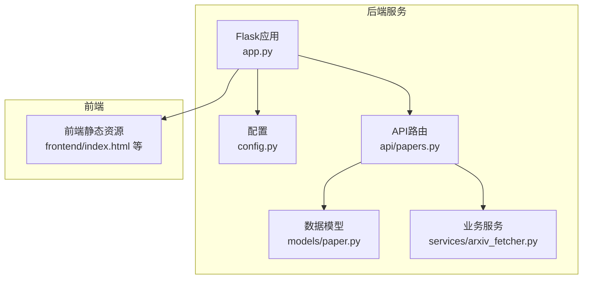
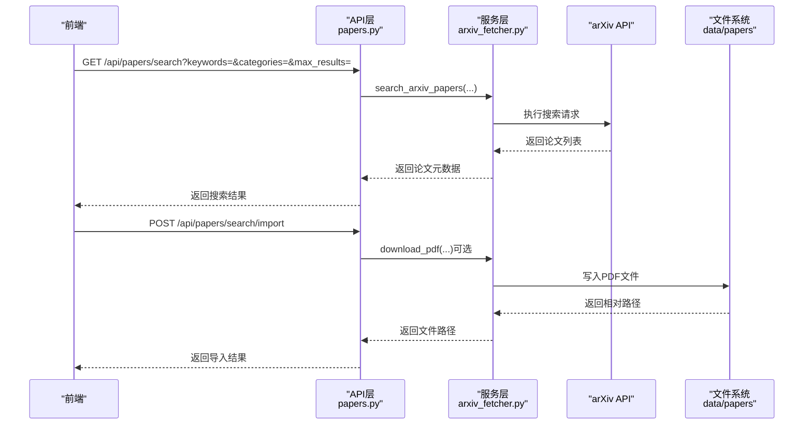
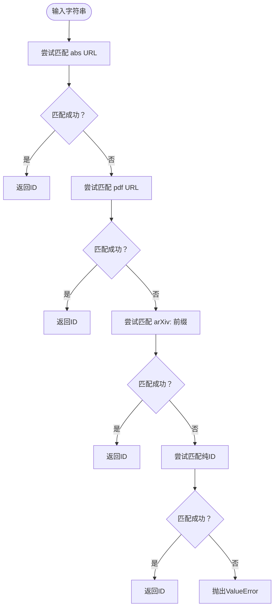
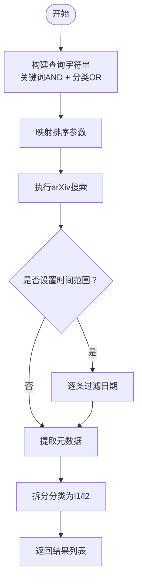
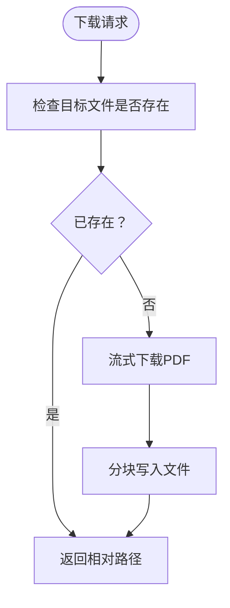
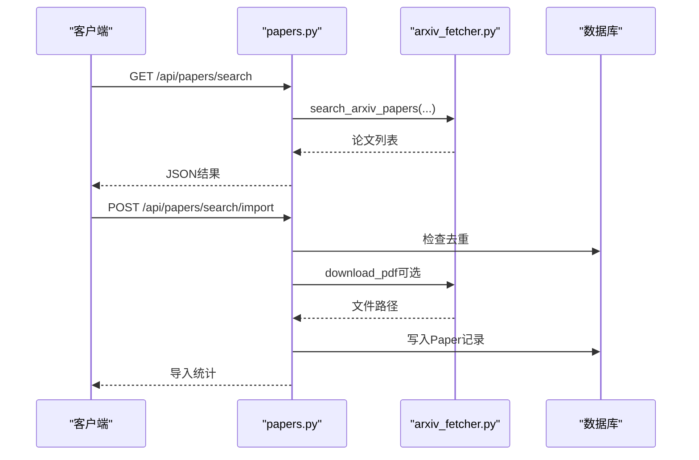
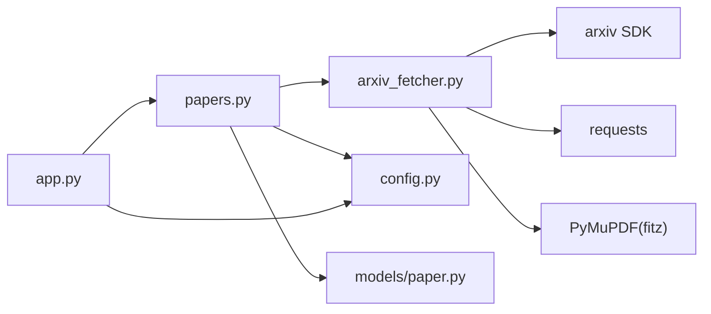

# arXiv抓取服务

<cite>
**本文档引用的文件**
- [arxiv_fetcher.py](file://backend/services/arxiv_fetcher.py)
- [papers.py](file://backend/api/papers.py)
- [paper.py](file://backend/models/paper.py)
- [config.py](file://backend/config.py)
- [app.py](file://backend/app.py)
- [arxiv_fetcher.yml](file://specs/backend/services/arxiv_fetcher.yml)
- [papers.yml](file://specs/backend/api/papers.yml)
- [README.md](file://README.md)
</cite>

## 目录
1. [简介](#简介)
2. [项目结构](#项目结构)
3. [核心组件](#核心组件)
4. [架构总览](#架构总览)
5. [详细组件分析](#详细组件分析)
6. [依赖关系分析](#依赖关系分析)
7. [性能考虑](#性能考虑)
8. [故障排查指南](#故障排查指南)
9. [结论](#结论)
10. [附录](#附录)

## 简介
本文件面向PaperHub后端的arXiv抓取服务，系统性阐述论文搜索、下载与解析的完整流程，覆盖关键词搜索算法、分类筛选机制、时间范围过滤、PDF下载处理、文本提取等核心能力，并详细说明parse_arxiv_input输入解析、search_arxiv_papers搜索接口、download_pdf下载函数、extract_pdf_text文本提取等关键方法的实现细节。文档还包含错误处理机制、性能优化策略、API限制处理以及实际使用示例与最佳实践指导，帮助开发者与使用者高效、稳定地集成与使用arXiv抓取能力。

## 项目结构
PaperHub采用Flask + SQLAlchemy + SQLite的后端架构，arXiv抓取服务位于backend/services目录，API路由集中在backend/api中，数据模型位于backend/models。配置与静态资源分别在backend/config.py与frontend目录。

图表来源
- [app.py:140-158](file://backend/app.py#L140-L158)
- [config.py:18-32](file://backend/config.py#L18-L32)
- [papers.py:140-157](file://backend/api/papers.py#L140-L157)

章节来源
- [README.md:383-481](file://README.md#L383-L481)
- [app.py:140-158](file://backend/app.py#L140-L158)
- [config.py:18-32](file://backend/config.py#L18-L32)

## 核心组件
- 输入解析：parse_arxiv_input支持多种arXiv输入格式（URL、arXiv:前缀、纯ID），统一解析为arXiv ID。
- 搜索接口：search_arxiv_papers支持关键词AND逻辑、分类OR逻辑、时间范围过滤、排序控制。
- 下载处理：download_pdf与download_generic_pdf分别处理arXiv与非arXiv来源的PDF下载，具备幂等与断点续传友好特性。
- 文本提取：extract_pdf_text基于PyMuPDF进行PDF文本抽取，具备异常容错。
- 分类体系：get_arxiv_categories提供arXiv分类映射，支持一级/二级分类拆分。
- API集成：papers.py提供/search、/search/import等REST接口，与数据库模型Paper协同工作。

章节来源
- [arxiv_fetcher.py:17-324](file://backend/services/arxiv_fetcher.py#L17-L324)
- [papers.py:475-589](file://backend/api/papers.py#L475-L589)
- [paper.py:120-186](file://backend/models/paper.py#L120-L186)

## 架构总览
arXiv抓取服务的端到端流程如下：
- 前端通过/api/papers/search发起关键词与分类搜索请求
- 后端papers.py解析参数并调用arxiv_fetcher.search_arxiv_papers
- arxiv_fetcher使用arXiv官方SDK构建查询，执行搜索并返回论文元数据
- 用户可选择批量导入，后端调用arxiv_fetcher.download_pdf下载PDF并持久化
- PDF文本可通过extract_pdf_text进行抽取（若安装PyMuPDF）

图表来源
- [papers.py:475-589](file://backend/api/papers.py#L475-L589)
- [arxiv_fetcher.py:123-227](file://backend/services/arxiv_fetcher.py#L123-L227)
- [arxiv_fetcher.py:50-66](file://backend/services/arxiv_fetcher.py#L50-L66)

## 详细组件分析

### 输入解析：parse_arxiv_input
- 支持的输入格式
  - https://arxiv.org/abs/{id}
  - https://arxiv.org/pdf/{id}.pdf
  - arXiv:{id}
  - 纯数字ID（如2310.01234）
- 匹配策略：正则表达式按序尝试，命中即返回arXiv ID；否则抛出ValueError
- 用途：为后续fetch_arxiv_paper与download_pdf提供标准化ID

图表来源
- [arxiv_fetcher.py:17-29](file://backend/services/arxiv_fetcher.py#L17-L29)

章节来源
- [arxiv_fetcher.py:17-29](file://backend/services/arxiv_fetcher.py#L17-L29)

### 论文搜索：search_arxiv_papers
- 关键词搜索
  - 多关键词以AND逻辑连接，避免使用引号，降低触发限流风险
  - 支持字符串或列表输入，自动规范化
- 分类筛选
  - 多分类以OR逻辑连接，形成括号包裹的子查询
- 时间范围过滤
  - 服务端构建查询后，客户端再做日期过滤，避免返回过多数据
- 排序控制
  - 支持按提交日期、更新日期、相关性排序，升序/降序可选
- 输出字段
  - 标题、作者、摘要、发表日期、PDF链接、分类、DOI、arXiv ID、URL、分类层级（l1/l2）

图表来源
- [arxiv_fetcher.py:123-227](file://backend/services/arxiv_fetcher.py#L123-L227)

章节来源
- [arxiv_fetcher.py:123-227](file://backend/services/arxiv_fetcher.py#L123-L227)

### PDF下载：download_pdf 与 download_generic_pdf
- download_pdf
  - 目标目录：data/papers/arxiv/
  - 幂等性：若文件已存在，直接返回相对路径，避免重复下载
  - 流式下载：requests.get(stream=True)，分块写入，内存友好
- download_generic_pdf
  - 通用下载：适用于非arXiv来源的PDF
  - 文件命名：基于paper_id + 扩展名（从URL推断，无扩展名时默认.pdf）
  - 目标目录：data/papers/generic/

图表来源
- [arxiv_fetcher.py:50-66](file://backend/services/arxiv_fetcher.py#L50-L66)
- [arxiv_fetcher.py:89-120](file://backend/services/arxiv_fetcher.py#L89-L120)

章节来源
- [arxiv_fetcher.py:50-66](file://backend/services/arxiv_fetcher.py#L50-L66)
- [arxiv_fetcher.py:89-120](file://backend/services/arxiv_fetcher.py#L89-L120)

### 文本提取：extract_pdf_text
- 依赖：PyMuPDF（fitz）
- 流程：根据文件路径打开PDF，遍历每页获取文本并拼接
- 容错：捕获异常返回None，避免影响整体流程
- 使用场景：结合PDF下载后进行全文抽取，供后续检索或分析使用

章节来源
- [arxiv_fetcher.py:69-86](file://backend/services/arxiv_fetcher.py#L69-L86)

### 分类体系：get_arxiv_categories
- 提供arXiv分类代码到分类名称的映射
- 支持按一级分类分组，便于前端展示与筛选
- 覆盖cs、stat、physics、math等多个领域

章节来源
- [arxiv_fetcher.py:230-309](file://backend/services/arxiv_fetcher.py#L230-L309)

### API集成：papers.py中的arXiv相关接口
- GET /api/papers/search
  - 参数：keywords、categories、max_results、start_date、end_date、sort_by、sort_order
  - 限制：max_results上限100
  - 返回：结果列表、总数、关键词与分类
- GET /api/papers/search/categories
  - 返回：分类字典与按一级分类分组的结果
- POST /api/papers/search/import
  - 批量导入arXiv论文，支持选择是否同时下载PDF
  - 去重：按arXiv ID去重，已存在则跳过
  - 错误收集：记录导入/下载失败项

图表来源
- [papers.py:475-589](file://backend/api/papers.py#L475-L589)
- [papers.py:591-696](file://backend/api/papers.py#L591-L696)

章节来源
- [papers.py:475-589](file://backend/api/papers.py#L475-L589)
- [papers.py:591-696](file://backend/api/papers.py#L591-L696)

## 依赖关系分析
- 外部依赖
  - arxiv SDK：用于访问arXiv API
  - requests：用于HTTP下载（PDF）
  - PyMuPDF（fitz）：用于PDF文本提取
- 内部依赖
  - config.py：提供BASE_DIR、PAPERS_DIR等路径配置
  - models/paper.py：Paper模型用于数据库持久化
  - app.py：注册蓝图与数据库初始化

图表来源
- [arxiv_fetcher.py:5-8](file://backend/services/arxiv_fetcher.py#L5-L8)
- [papers.py:140-157](file://backend/api/papers.py#L140-L157)
- [config.py:18-32](file://backend/config.py#L18-L32)
- [app.py:140-158](file://backend/app.py#L140-L158)

章节来源
- [arxiv_fetcher.py:5-8](file://backend/services/arxiv_fetcher.py#L5-L8)
- [papers.py:140-157](file://backend/api/papers.py#L140-L157)
- [config.py:18-32](file://backend/config.py#L18-L32)
- [app.py:140-158](file://backend/app.py#L140-L158)

## 性能考虑
- 流式下载与分块写入：download_pdf与download_generic_pdf采用stream=True与iter_content分块写入，降低内存占用，适合大文件下载。
- 幂等性：已存在文件直接返回路径，避免重复IO。
- 查询构建：关键词AND、分类OR的组合在arXiv侧完成，减少客户端过滤成本。
- 限流规避：关键词连接不使用引号，降低触发限流概率。
- 数据库连接池：config.py中配置SQLAlchemy连接池，提升并发访问稳定性。
- 前端展示：API层对大数据量的筛选尽量在后端完成，保证前端渲染性能。

章节来源
- [arxiv_fetcher.py:50-66](file://backend/services/arxiv_fetcher.py#L50-L66)
- [arxiv_fetcher.py:89-120](file://backend/services/arxiv_fetcher.py#L89-L120)
- [config.py:92-99](file://backend/config.py#L92-L99)
- [papers.yml:330-376](file://specs/backend/api/papers.yml#L330-L376)

## 故障排查指南
- 输入格式错误
  - 现象：parse_arxiv_input抛出ValueError
  - 处理：确保输入为arxiv.org/abs/{id}、arxiv.org/pdf/{id}.pdf、arXiv:{id}或纯ID
- arXiv API请求失败
  - 现象：search_arxiv_papers捕获异常并记录日志
  - 处理：检查网络连通性、重试策略、限流情况
- PDF下载失败
  - 现象：download_pdf抛出网络异常
  - 处理：检查URL有效性、网络代理、磁盘空间与权限
- 文本提取失败
  - 现象：extract_pdf_text返回None
  - 处理：确认已安装PyMuPDF，检查PDF完整性
- 导入失败
  - 现象：/api/papers/search/import返回部分错误
  - 处理：查看错误列表，修复单条导入失败项后重试

章节来源
- [arxiv_fetcher.py:17-29](file://backend/services/arxiv_fetcher.py#L17-L29)
- [arxiv_fetcher.py:220-225](file://backend/services/arxiv_fetcher.py#L220-L225)
- [arxiv_fetcher.py:50-66](file://backend/services/arxiv_fetcher.py#L50-L66)
- [arxiv_fetcher.py:69-86](file://backend/services/arxiv_fetcher.py#L69-L86)
- [papers.py:678-685](file://backend/api/papers.py#L678-L685)

## 结论
PaperHub的arXiv抓取服务以简洁稳定的架构实现了从关键词搜索、分类筛选、时间过滤到PDF下载与文本提取的完整闭环。通过合理的输入解析、查询构建与下载策略，服务在易用性与性能之间取得良好平衡。配合API层的批量导入与数据库模型，用户可以高效地将arXiv论文纳入知识库并进行后续管理与检索。

## 附录

### 使用示例与最佳实践
- 关键词搜索
  - 示例：GET /api/papers/search?keywords=machine learning,deep learning&max_results=20
  - 最佳实践：多关键词使用英文逗号分隔，避免触发限流
- 分类筛选
  - 示例：GET /api/papers/search?categories=cs.AI,stat.ML&max_results=50
  - 最佳实践：分类使用OR逻辑，合理控制max_results
- 时间范围过滤
  - 示例：GET /api/papers/search?start_date=2023-01-01&end_date=2023-12-31
  - 最佳实践：先在服务端构建查询，再在客户端做二次过滤
- 批量导入
  - 示例：POST /api/papers/search/import，body包含papers数组与save_pdf标志
  - 最佳实践：先搜索再导入，避免重复下载；关注错误列表逐条修复
- PDF下载
  - 示例：调用download_pdf或download_generic_pdf，返回相对路径
  - 最佳实践：检查文件是否存在，避免重复下载；确保磁盘空间充足

章节来源
- [papers.py:475-589](file://backend/api/papers.py#L475-L589)
- [papers.py:591-696](file://backend/api/papers.py#L591-L696)
- [arxiv_fetcher.py:50-66](file://backend/services/arxiv_fetcher.py#L50-L66)
- [arxiv_fetcher.py:89-120](file://backend/services/arxiv_fetcher.py#L89-L120)