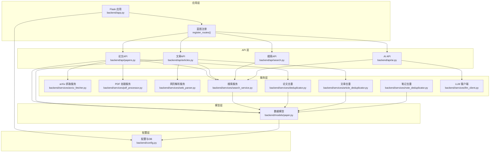
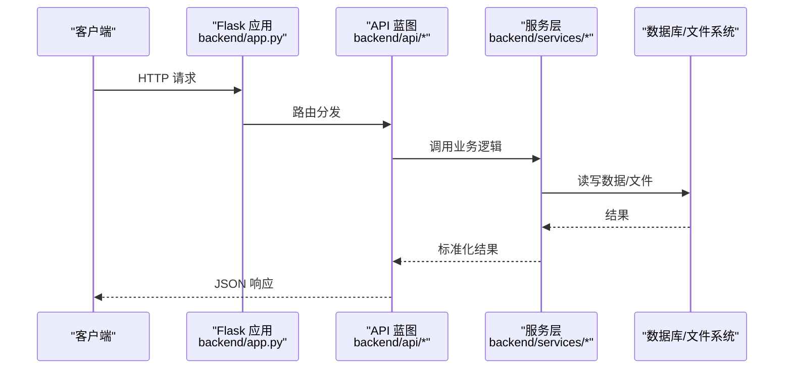
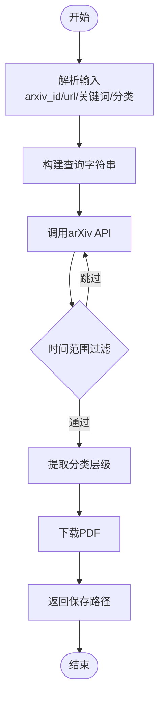
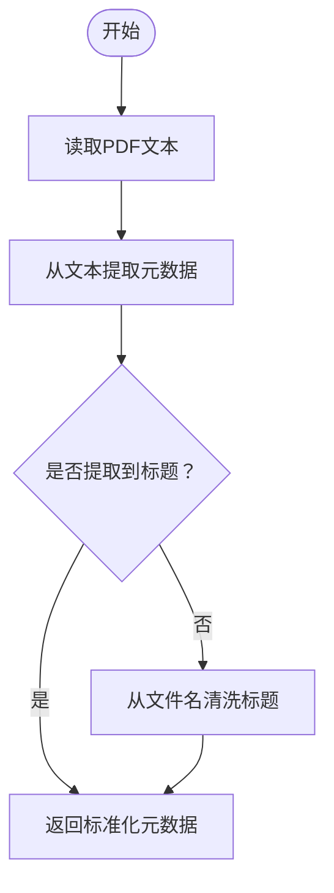
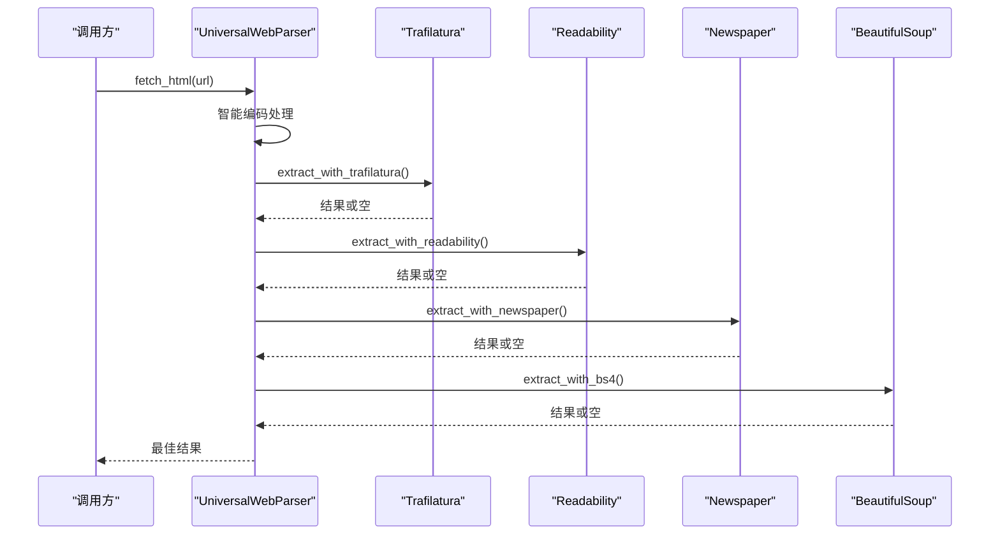
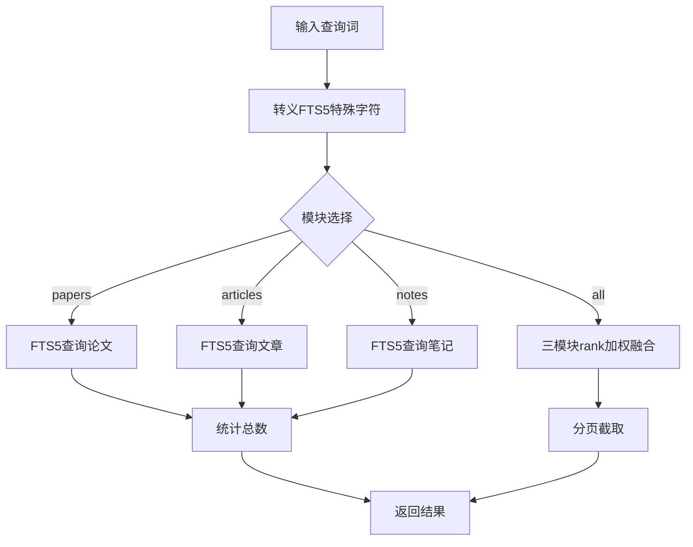
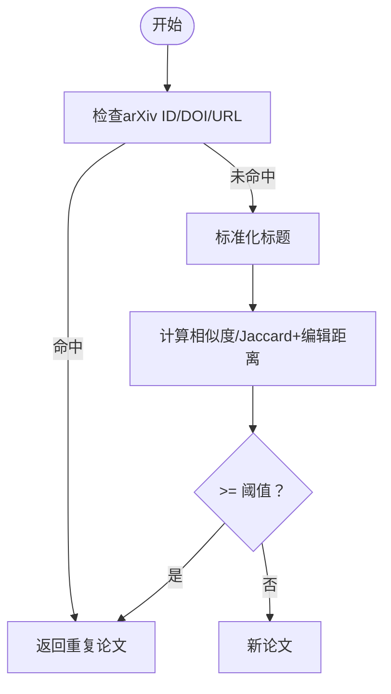
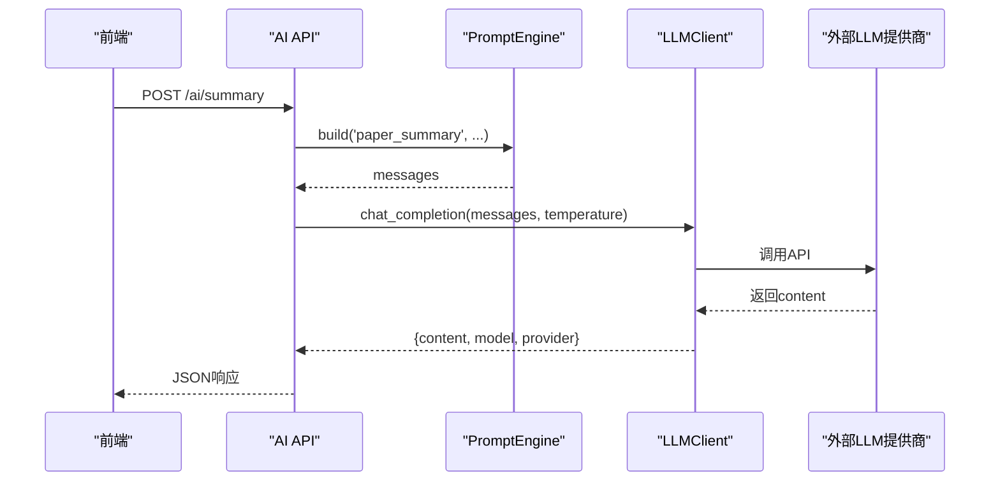
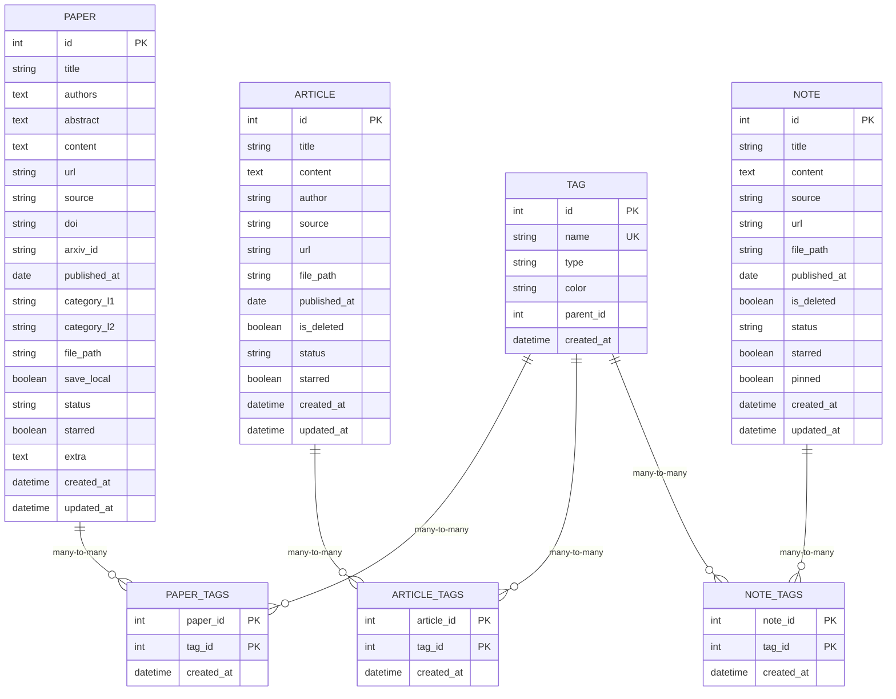
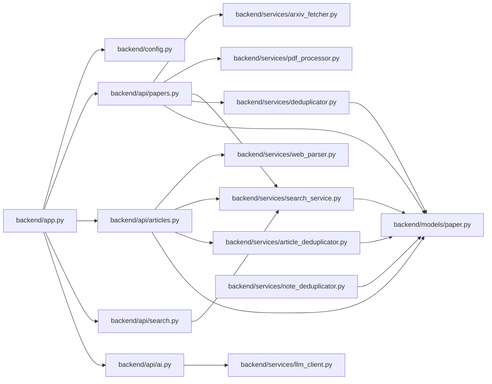

# 业务逻辑模块

<cite>
**本文档引用的文件**
- [backend/app.py](file://backend/app.py)
- [backend/config.py](file://backend/config.py)
- [backend/models/paper.py](file://backend/models/paper.py)
- [backend/services/arxiv_fetcher.py](file://backend/services/arxiv_fetcher.py)
- [backend/services/pdf_processor.py](file://backend/services/pdf_processor.py)
- [backend/services/web_parser.py](file://backend/services/web_parser.py)
- [backend/services/search_service.py](file://backend/services/search_service.py)
- [backend/services/deduplicator.py](file://backend/services/deduplicator.py)
- [backend/services/article_deduplicator.py](file://backend/services/article_deduplicator.py)
- [backend/services/note_deduplicator.py](file://backend/services/note_deduplicator.py)
- [backend/services/llm_client.py](file://backend/services/llm_client.py)
- [backend/api/ai.py](file://backend/api/ai.py)
- [backend/api/search.py](file://backend/api/search.py)
- [backend/api/papers.py](file://backend/api/papers.py)
- [backend/api/articles.py](file://backend/api/articles.py)
</cite>

## 目录
1. [简介](#简介)
2. [项目结构](#项目结构)
3. [核心组件](#核心组件)
4. [架构总览](#架构总览)
5. [详细组件分析](#详细组件分析)
6. [依赖分析](#依赖分析)
7. [性能考虑](#性能考虑)
8. [故障排查指南](#故障排查指南)
9. [结论](#结论)
10. [附录](#附录)

## 简介
本文件面向PaperHub后端业务逻辑模块，系统性梳理各服务模块的实现细节、算法设计与业务规则，覆盖以下核心能力：
- arXiv抓取服务：关键词/分类搜索、时间范围过滤、PDF下载与文本抽取
- PDF处理服务：文本抽取、标题/作者/摘要提取、文件名清洗
- 网页解析服务：多策略解析器（Trafilatura、Readability、Newspaper、BeautifulSoup）
- AI服务集成：统一LLM客户端封装、提示工程、摘要/标签/关联推荐
- 去重服务：论文/文章/笔记三类去重策略与算法
- 搜索服务：全文检索（FTS5）与跨模块融合排序

文档同时给出模块间协作关系、数据传递机制、异常处理与性能优化建议，并提供可视化图示帮助理解。

## 项目结构
后端采用Flask应用，按“API层-服务层-模型层-配置层”组织，核心文件分布如下：
- 应用入口与路由注册：backend/app.py
- 配置与数据库连接：backend/config.py
- 数据模型：backend/models/paper.py
- 业务服务：backend/services/*
- API接口：backend/api/*

图表来源
- [backend/app.py:140-158](file://backend/app.py#L140-L158)
- [backend/api/papers.py:1-20](file://backend/api/papers.py#L1-L20)
- [backend/api/articles.py:10-11](file://backend/api/articles.py#L10-L11)
- [backend/api/search.py:12-12](file://backend/api/search.py#L12-L12)
- [backend/api/ai.py:7-24](file://backend/api/ai.py#L7-L24)
- [backend/services/arxiv_fetcher.py:1-20](file://backend/services/arxiv_fetcher.py#L1-L20)
- [backend/services/pdf_processor.py:1-20](file://backend/services/pdf_processor.py#L1-L20)
- [backend/services/web_parser.py:14-21](file://backend/services/web_parser.py#L14-L21)
- [backend/services/search_service.py:1-20](file://backend/services/search_service.py#L1-L20)
- [backend/services/deduplicator.py:1-20](file://backend/services/deduplicator.py#L1-L20)
- [backend/services/article_deduplicator.py:1-20](file://backend/services/article_deduplicator.py#L1-L20)
- [backend/services/note_deduplicator.py:1-20](file://backend/services/note_deduplicator.py#L1-L20)
- [backend/services/llm_client.py:18-93](file://backend/services/llm_client.py#L18-L93)
- [backend/models/paper.py:18-27](file://backend/models/paper.py#L18-L27)
- [backend/config.py:85-134](file://backend/config.py#L85-L134)

章节来源
- [backend/app.py:41-137](file://backend/app.py#L41-L137)
- [backend/config.py:35-74](file://backend/config.py#L35-L74)

## 核心组件
本节概述各模块职责、输入输出与关键流程。

- arXiv抓取服务
  - 功能：解析arXiv输入、搜索论文、下载PDF、提取PDF文本
  - 输入：关键词/分类/时间范围/排序参数；PDF URL
  - 输出：论文列表、PDF文件相对路径、文本内容
  - 异常：网络/解析错误日志与抛出
  - 章节来源
    - [backend/services/arxiv_fetcher.py:17-324](file://backend/services/arxiv_fetcher.py#L17-L324)

- PDF处理服务
  - 功能：PDF文本抽取、标题/作者/摘要提取、文件名清洗
  - 输入：PDF文件路径、可选文件名
  - 输出：标准化元数据字典（标题、作者、摘要、内容、来源）
  - 章节来源
    - [backend/services/pdf_processor.py:10-170](file://backend/services/pdf_processor.py#L10-L170)

- 网页解析服务
  - 功能：多策略解析（Trafilatura、Readability、Newspaper、BeautifulSoup），自动/指定策略选择，编码智能处理
  - 输入：URL、首选解析策略
  - 输出：标题、正文、HTML、最佳方法、长度统计
  - 章节来源
    - [backend/services/web_parser.py:14-271](file://backend/services/web_parser.py#L14-L271)

- 搜索服务
  - 功能：论文/文章/笔记FTS5全文检索、跨模块融合排序、搜索建议
  - 输入：查询词、分页、高亮开关
  - 输出：聚合结果、总数、分模块统计
  - 章节来源
    - [backend/services/search_service.py:1-314](file://backend/services/search_service.py#L1-L314)

- 去重服务
  - 论文去重：arXiv ID/DOI/URL/标题相似度（Jaccard+编辑距离）
  - 文章去重：URL/标题相似度（系列文章标识特殊处理）/内容哈希
  - 笔记去重：URL/标题相似度/内容哈希，支持查找重复组与移除
  - 章节来源
    - [backend/services/deduplicator.py:1-124](file://backend/services/deduplicator.py#L1-L124)
    - [backend/services/article_deduplicator.py:1-173](file://backend/services/article_deduplicator.py#L1-L173)
    - [backend/services/note_deduplicator.py:1-230](file://backend/services/note_deduplicator.py#L1-L230)

- AI服务集成
  - LLM客户端：统一OpenAI/豆包/Anthropic/Qwen/TEG接口，缓存、用量统计、安全配置
  - AI API：摘要生成、标签推荐、相关内容推荐
  - 章节来源
    - [backend/services/llm_client.py:18-590](file://backend/services/llm_client.py#L18-L590)
    - [backend/api/ai.py:10-288](file://backend/api/ai.py#L10-L288)

- 数据模型
  - Paper/Article/Note/Tag及多对多关联表，to_dict序列化
  - 章节来源
    - [backend/models/paper.py:18-360](file://backend/models/paper.py#L18-L360)

## 架构总览
PaperHub后端采用分层架构：
- 应用层：Flask应用与蓝图注册，CORS与静态资源路由
- API层：REST接口，负责参数校验、调用服务层、返回JSON
- 服务层：具体业务逻辑，如arXiv抓取、PDF处理、网页解析、搜索、去重、AI集成
- 模型层：SQLAlchemy模型与多对多关联
- 配置层：数据库引擎、会话工厂、目录与向量存储配置

图表来源
- [backend/app.py:140-158](file://backend/app.py#L140-L158)
- [backend/api/papers.py:29-108](file://backend/api/papers.py#L29-L108)
- [backend/api/articles.py:28-56](file://backend/api/articles.py#L28-L56)
- [backend/api/search.py:14-51](file://backend/api/search.py#L14-L51)
- [backend/api/ai.py:79-139](file://backend/api/ai.py#L79-L139)

## 详细组件分析

### arXiv抓取服务
- 输入输出
  - 输入：arXiv ID/URL、关键词、分类、时间范围、排序参数
  - 输出：论文元数据列表、PDF下载路径、PDF文本
- 处理流程
  - 解析arXiv输入，构造查询字符串，调用arXiv API
  - 过滤时间范围，提取分类层级，下载PDF并保存
  - 可选：使用PyMuPDF抽取PDF文本
- 异常处理
  - 网络异常与解析异常记录日志并抛出
- 性能与优化
  - 控制最大结果数，避免过度请求
  - PDF下载采用流式写入，减少内存占用
- 章节来源
  - [backend/services/arxiv_fetcher.py:17-324](file://backend/services/arxiv_fetcher.py#L17-L324)

图表来源
- [backend/services/arxiv_fetcher.py:123-227](file://backend/services/arxiv_fetcher.py#L123-L227)
- [backend/services/arxiv_fetcher.py:50-67](file://backend/services/arxiv_fetcher.py#L50-L67)

### PDF处理服务
- 输入输出
  - 输入：PDF文件路径、可选文件名
  - 输出：标题、作者、摘要、内容、来源
- 处理流程
  - 从PDF抽取前N页文本
  - 从文本中提取标题/作者/摘要
  - 若未提取到标题，回退至文件名清洗
- 章节来源
  - [backend/services/pdf_processor.py:10-170](file://backend/services/pdf_processor.py#L10-L170)

图表来源
- [backend/services/pdf_processor.py:109-170](file://backend/services/pdf_processor.py#L109-L170)

### 网页解析服务
- 输入输出
  - 输入：URL、首选解析策略
  - 输出：标题、正文、HTML、最佳方法、长度统计
- 处理流程
  - 智能编码处理（UTF-8优先、fallback到chardet与常见编码）
  - 多策略尝试：Trafilatura → Readability → Newspaper → BeautifulSoup
  - 选择文本/HTML最长的结果作为最佳
- 章节来源
  - [backend/services/web_parser.py:22-244](file://backend/services/web_parser.py#L22-L244)

图表来源
- [backend/services/web_parser.py:22-244](file://backend/services/web_parser.py#L22-L244)

### 搜索服务
- 输入输出
  - 输入：查询词、模块（papers/articles/notes/all）、分页、高亮
  - 输出：聚合结果、总数、分模块统计
- 处理流程
  - FTS5查询转义与高亮
  - 单模块搜索：论文/文章/笔记分别查询并统计总数
  - 跨模块搜索：按FTS5 rank加权融合排序
  - 搜索建议：从FTS5索引中走索引获取标题建议
- 性能考虑
  - 使用LIMIT/OFFSET分页
  - FTS5索引命中，建议保持查询词规范化
- 章节来源
  - [backend/services/search_service.py:8-314](file://backend/services/search_service.py#L8-L314)

图表来源
- [backend/services/search_service.py:39-257](file://backend/services/search_service.py#L39-L257)

### 去重服务
- 论文去重
  - 优先匹配arXiv ID/DOI/URL
  - 标题相似度：标准化+Jaccard+编辑距离综合评分
- 文章去重
  - URL完全匹配优先
  - 标题相似度（系列标识特殊处理）+内容前500字符哈希
- 笔记去重
  - URL/标题相似度/内容前500字符哈希
  - 支持查找重复组与移除（保留最早/最新）
- 章节来源
  - [backend/services/deduplicator.py:79-124](file://backend/services/deduplicator.py#L79-L124)
  - [backend/services/article_deduplicator.py:134-173](file://backend/services/article_deduplicator.py#L134-L173)
  - [backend/services/note_deduplicator.py:88-230](file://backend/services/note_deduplicator.py#L88-L230)

图表来源
- [backend/services/deduplicator.py:79-112](file://backend/services/deduplicator.py#L79-L112)

### AI服务集成
- LLM客户端
  - 支持多家提供商（OpenAI、豆包、Anthropic、Qwen、TEG）
  - 安全配置：.env与环境变量优先级
  - 缓存与用量统计，支持清空缓存
- AI API
  - 摘要生成：根据paper/article/note内容生成摘要
  - 标签推荐：基于现有标签与内容生成新标签
  - 相关内容推荐：基于候选论文集合进行相似度打分
- 章节来源
  - [backend/services/llm_client.py:18-590](file://backend/services/llm_client.py#L18-L590)
  - [backend/api/ai.py:79-288](file://backend/api/ai.py#L79-L288)

图表来源
- [backend/api/ai.py:79-139](file://backend/api/ai.py#L79-L139)
- [backend/services/llm_client.py:247-278](file://backend/services/llm_client.py#L247-L278)

### 数据模型与关系
Paper/Article/Note/Tag四类实体，通过多对多关联表建立灵活关系；模型提供to_dict序列化，便于API返回。

图表来源
- [backend/models/paper.py:18-360](file://backend/models/paper.py#L18-L360)

## 依赖分析
- 应用层依赖配置层提供的数据库引擎与会话工厂
- API层依赖服务层实现业务逻辑
- 服务层依赖模型层进行数据持久化
- 搜索服务依赖SQLite FTS5全文索引
- AI服务依赖外部LLM提供商API
- 去重服务依赖数据库查询与相似度算法

图表来源
- [backend/app.py:140-158](file://backend/app.py#L140-L158)
- [backend/api/papers.py:12-26](file://backend/api/papers.py#L12-L26)
- [backend/api/articles.py:13-19](file://backend/api/articles.py#L13-L19)
- [backend/api/search.py:3-10](file://backend/api/search.py#L3-L10)
- [backend/api/ai.py:10-31](file://backend/api/ai.py#L10-L31)
- [backend/services/search_service.py:1-7](file://backend/services/search_service.py#L1-L7)
- [backend/services/llm_client.py:18-93](file://backend/services/llm_client.py#L18-L93)
- [backend/models/paper.py:18-27](file://backend/models/paper.py#L18-L27)

章节来源
- [backend/config.py:85-134](file://backend/config.py#L85-L134)

## 性能考虑
- 数据库连接池：SQLite连接池配置，避免锁竞争
- FTS5全文检索：使用索引字段与转义，避免LIKE通配导致全表扫描
- PDF处理：限制抽取页数，避免大文件内存压力
- 网页解析：优先Trafilatura，其次Readability/Newspaper，最后BeautifulSoup，选择最长文本作为最佳
- AI调用：启用缓存，控制温度与最大token，统计用量
- 去重：论文/文章/笔记相似度计算尽量避免全表扫描，必要时分批处理

## 故障排查指南
- 未处理异常
  - 应用层统一捕获异常并返回JSON，区分HTTP异常与内部错误
  - 对扫描请求模式进行过滤，避免日志噪音
- arXiv抓取
  - 检查输入格式与网络连通性；查看日志中的错误堆栈
- PDF处理
  - 确认PDF路径与权限；若文本为空，检查PDF是否加密或损坏
- 网页解析
  - 检查编码问题与反爬策略；尝试更换解析策略
- 搜索服务
  - 确认FTS5表存在与索引完整性；检查查询词转义
- AI服务
  - 检查API Key配置与提供商可用性；查看缓存与用量统计

章节来源
- [backend/app.py:70-89](file://backend/app.py#L70-L89)
- [backend/services/arxiv_fetcher.py:220-225](file://backend/services/arxiv_fetcher.py#L220-L225)
- [backend/services/web_parser.py:61-63](file://backend/services/web_parser.py#L61-L63)
- [backend/services/search_service.py:8-26](file://backend/services/search_service.py#L8-L26)
- [backend/services/llm_client.py:562-590](file://backend/services/llm_client.py#L562-L590)

## 结论
PaperHub业务逻辑模块围绕“数据采集-处理-存储-检索-智能增强-去重”的闭环展开，采用分层架构与清晰的模块边界，既保证了功能完整性，也兼顾了可维护性与性能。通过FTS5全文检索、多策略网页解析、统一LLM客户端与完善的去重算法，系统能够稳定支撑论文、文章与笔记的全生命周期管理。

## 附录
- API端点概览
  - 论文：列表/详情/更新/删除/下载/标签管理/批量操作/arXiv搜索/导入
  - 文章：CRUD/关联论文/标签管理/批量操作
  - 搜索：全文搜索/搜索建议
  - AI：配置/用量/摘要/标签推荐/相关推荐
- 章节来源
  - [backend/api/papers.py:29-800](file://backend/api/papers.py#L29-L800)
  - [backend/api/articles.py:28-482](file://backend/api/articles.py#L28-L482)
  - [backend/api/search.py:14-70](file://backend/api/search.py#L14-L70)
  - [backend/api/ai.py:42-288](file://backend/api/ai.py#L42-L288)