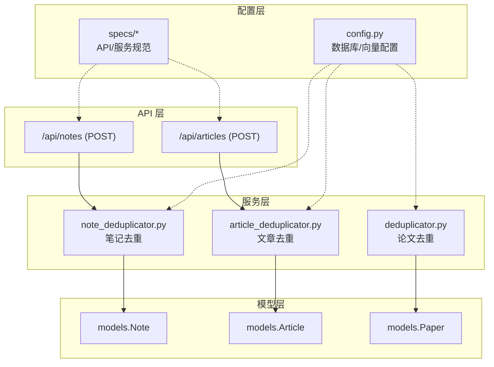
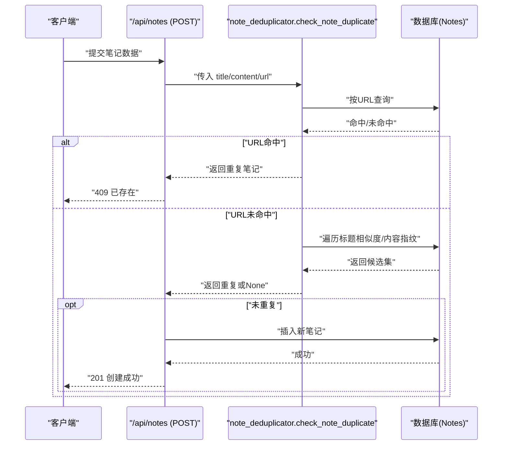
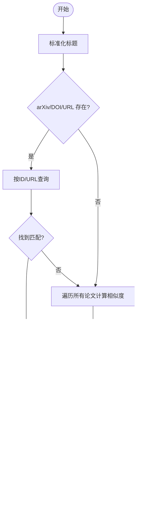
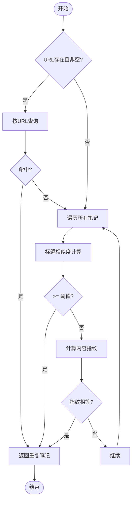
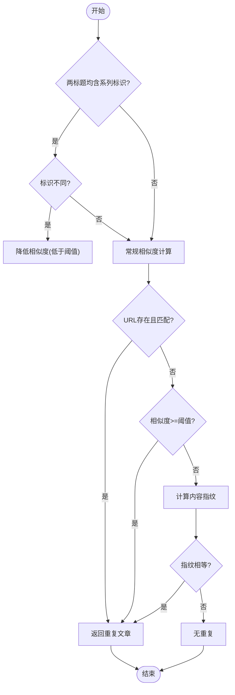
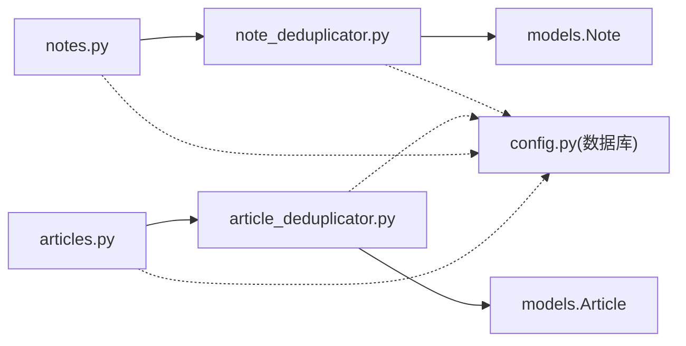

# 去重服务

<cite>
**本文档引用的文件**
- [deduplicator.py](file://backend/services/deduplicator.py)
- [note_deduplicator.py](file://backend/services/note_deduplicator.py)
- [article_deduplicator.py](file://backend/services/article_deduplicator.py)
- [notes.py](file://backend/api/notes.py)
- [articles.py](file://backend/api/articles.py)
- [paper.py](file://backend/models/paper.py)
- [config.py](file://backend/config.py)
- [notes.yml](file://specs/backend/api/notes.yml)
- [articles.yml](file://specs/backend/api/articles.yml)
- [deduplicator.yml](file://specs/backend/services/deduplicator.yml)
- [global_config.yml](file://specs/system/global_config.yml)
- [test_batch_api.py](file://scripts/tests/test_batch_api.py)
</cite>

## 目录
1. [简介](#简介)
2. [项目结构](#项目结构)
3. [核心组件](#核心组件)
4. [架构总览](#架构总览)
5. [详细组件分析](#详细组件分析)
6. [依赖分析](#依赖分析)
7. [性能考量](#性能考量)
8. [故障排查指南](#故障排查指南)
9. [结论](#结论)
10. [附录](#附录)

## 简介
本文件系统性阐述 PaperHub 中“去重服务”的设计与实现，覆盖论文去重与笔记/文章去重两大场景。内容包括相似度计算方法、指纹生成技术、阈值设定、批量处理机制；同时说明文本预处理流程、特征提取算法、聚类分析思路、人工审核接口建议，并给出精度优化、性能调优、缓存策略与增量更新机制的实践建议。最后提供不同去重场景的配置选项与使用示例。

## 项目结构
去重能力主要由以下模块协同实现：
- 服务层：论文去重、笔记去重、文章去重算法封装
- API 层：对外暴露创建/查询接口，集成去重逻辑
- 模型层：Note、Article、Paper 等实体模型
- 配置层：数据库连接池、向量存储、全局配置
- 规范层：API 与服务的规格说明

**图表来源**
- [notes.py:61-134](file://backend/api/notes.py#L61-L134)
- [articles.py:81-134](file://backend/api/articles.py#L81-L134)
- [deduplicator.py:79-124](file://backend/services/deduplicator.py#L79-L124)
- [note_deduplicator.py:88-130](file://backend/services/note_deduplicator.py#L88-L130)
- [article_deduplicator.py:134-173](file://backend/services/article_deduplicator.py#L134-L173)
- [paper.py:250-293](file://backend/models/paper.py#L250-L293)
- [config.py:35-134](file://backend/config.py#L35-L134)
- [notes.yml:45-101](file://specs/backend/api/notes.yml#L45-L101)
- [articles.yml:45-94](file://specs/backend/api/articles.yml#L45-L94)

**章节来源**
- [notes.py:61-134](file://backend/api/notes.py#L61-L134)
- [articles.py:81-134](file://backend/api/articles.py#L81-L134)
- [deduplicator.py:79-124](file://backend/services/deduplicator.py#L79-L124)
- [note_deduplicator.py:88-130](file://backend/services/note_deduplicator.py#L88-L130)
- [article_deduplicator.py:134-173](file://backend/services/article_deduplicator.py#L134-L173)
- [paper.py:250-293](file://backend/models/paper.py#L250-L293)
- [config.py:35-134](file://backend/config.py#L35-L134)
- [notes.yml:45-101](file://specs/backend/api/notes.yml#L45-L101)
- [articles.yml:45-94](file://specs/backend/api/articles.yml#L45-L94)

## 核心组件
- 论文去重服务：基于标准化标题、Jaccard 相似度、编辑距离的综合相似度计算，支持 DOI、arXiv ID、URL 与标题相似度的多维度匹配。
- 笔记去重服务：URL 完全匹配优先，其次标题相似度，再其次内容前 500 字符指纹；提供批量查找重复组与删除策略。
- 文章去重服务：与笔记类似，但针对系列文章标题做了特殊处理，避免将同一主题的不同部分误判为重复。
- API 集成：在创建笔记/文章的接口中调用对应去重服务，若命中重复则返回冲突响应，避免数据冗余。
- 批量处理：提供批量更新状态/标签/标星/置顶/删除的接口，便于大规模去重后的治理操作。

**章节来源**
- [deduplicator.py:79-124](file://backend/services/deduplicator.py#L79-L124)
- [note_deduplicator.py:88-130](file://backend/services/note_deduplicator.py#L88-L130)
- [article_deduplicator.py:134-173](file://backend/services/article_deduplicator.py#L134-L173)
- [notes.py:61-134](file://backend/api/notes.py#L61-L134)
- [articles.py:81-134](file://backend/api/articles.py#L81-L134)

## 架构总览
下图展示从 API 请求到去重判断再到数据库写入的整体流程：

**图表来源**
- [notes.py:61-134](file://backend/api/notes.py#L61-L134)
- [note_deduplicator.py:88-130](file://backend/services/note_deduplicator.py#L88-L130)

**章节来源**
- [notes.py:61-134](file://backend/api/notes.py#L61-L134)
- [note_deduplicator.py:88-130](file://backend/services/note_deduplicator.py#L88-L130)

## 详细组件分析

### 论文去重组件
- 标题标准化：统一转小写、去除特殊字符、合并空白，支持中英文。
- 相似度计算：词级 Jaccard + 字符级 Jaccard + 编辑距离（Levenshtein）加权融合。
- 匹配策略：优先 arXiv ID/DOI/URL，其次标题相似度阈值（默认 0.8）。
- 返回信息：命中重复时返回重复类型、目标论文 ID、标题与 URL。

**图表来源**
- [deduplicator.py:8-124](file://backend/services/deduplicator.py#L8-L124)

**章节来源**
- [deduplicator.py:8-124](file://backend/services/deduplicator.py#L8-L124)

### 笔记去重组件
- 标题标准化：与论文一致，支持中英文。
- 相似度计算：词级 Jaccard + 字符级 Jaccard + 编辑距离加权融合。
- 内容指纹：取内容前 N 字符（默认 500）去空白、小写化后拼接，作为快速指纹。
- 匹配策略：URL 完全匹配优先；其次标题相似度；再次内容指纹。
- 批量查找重复组：两两比较，按 URL/标题/内容指纹判定重复，形成重复组。
- 批量删除：支持保留最早或最新，dry-run 模式用于审计。

**图表来源**
- [note_deduplicator.py:88-130](file://backend/services/note_deduplicator.py#L88-L130)

**章节来源**
- [note_deduplicator.py:8-230](file://backend/services/note_deduplicator.py#L8-L230)

### 文章去重组件
- 标题标准化：保留系列文章标识（如上下、第一部分、章节等），避免将同一主题不同部分误判为重复。
- 系列标识检测：通过正则识别系列标识，若两个标题均含系列标识且不同，则降低相似度。
- 相似度计算：字符级 Jaccard + 编辑距离取较大值。
- 匹配策略：URL 完全匹配优先；其次标题相似度；再次内容指纹。

**图表来源**
- [article_deduplicator.py:40-173](file://backend/services/article_deduplicator.py#L40-L173)

**章节来源**
- [article_deduplicator.py:40-173](file://backend/services/article_deduplicator.py#L40-L173)

### 文本预处理与特征提取
- 标准化：统一大小写、去除特殊字符、合并空白、保留必要的中文字符范围。
- 相似度特征：
  - 词级 Jaccard：衡量词汇层面的重叠程度。
  - 字符级 Jaccard：衡量字符层面的重叠程度。
  - 编辑距离：衡量字符串差异，结合长度归一化得到编辑相似度。
- 指纹特征：内容前缀采样 + 去空白 + 小写化，作为快速近似判重依据。

**章节来源**
- [deduplicator.py:8-77](file://backend/services/deduplicator.py#L8-L77)
- [note_deduplicator.py:8-86](file://backend/services/note_deduplicator.py#L8-L86)
- [article_deduplicator.py:7-132](file://backend/services/article_deduplicator.py#L7-L132)

### 聚类分析与重复组发现
- 两阶段策略：先按 URL 完全匹配快速过滤，再对剩余候选计算相似度或指纹。
- 重复组构建：遍历候选集，两两比较，满足任一规则即视为重复，形成重复组并去重标记。
- 复杂度：O(N^2)，适合中小规模数据；大规模场景建议引入索引/倒排/局部敏感哈希等优化。

**章节来源**
- [note_deduplicator.py:132-177](file://backend/services/note_deduplicator.py#L132-L177)
- [article_deduplicator.py:134-173](file://backend/services/article_deduplicator.py#L134-L173)

### 人工审核接口建议
- 重复标记与详情：在 API 响应中返回重复类型、目标项 ID、标题与 URL，便于前端展示与人工确认。
- 审核流程：提供“忽略重复”“保留旧/新”“合并/拆分”等操作入口，结合批量接口进行治理。
- 审计日志：记录每次去重决策与人工干预，支持回溯与统计。

**章节来源**
- [deduplicator.py:115-124](file://backend/services/deduplicator.py#L115-L124)
- [note_deduplicator.py:88-130](file://backend/services/note_deduplicator.py#L88-L130)
- [article_deduplicator.py:134-173](file://backend/services/article_deduplicator.py#L134-L173)

## 依赖分析
- API 依赖服务：/api/notes 与 /api/articles 在创建接口中直接调用对应去重服务。
- 服务依赖模型：去重服务通过 SQLAlchemy 查询模型表，依赖数据库连接池与事务。
- 配置依赖：数据库连接池参数、向量存储目录等通过配置文件集中管理。

**图表来源**
- [notes.py:61-134](file://backend/api/notes.py#L61-L134)
- [articles.py:81-134](file://backend/api/articles.py#L81-L134)
- [note_deduplicator.py:88-130](file://backend/services/note_deduplicator.py#L88-L130)
- [article_deduplicator.py:134-173](file://backend/services/article_deduplicator.py#L134-L173)
- [config.py:85-134](file://backend/config.py#L85-L134)

**章节来源**
- [notes.py:61-134](file://backend/api/notes.py#L61-L134)
- [articles.py:81-134](file://backend/api/articles.py#L81-L134)
- [note_deduplicator.py:88-130](file://backend/services/note_deduplicator.py#L88-L130)
- [article_deduplicator.py:134-173](file://backend/services/article_deduplicator.py#L134-L173)
- [config.py:85-134](file://backend/config.py#L85-L134)

## 性能考量
- 时间复杂度
  - 当前实现采用 O(N^2) 的两两比较，适合中小规模数据。
  - 大规模场景建议引入：
    - 倒排索引：按词/短语建立索引，快速定位候选。
    - 局部敏感哈希（LSH）：对指纹进行分桶，减少比较次数。
    - 并行化：利用多核 CPU 并行计算相似度。
- 空间复杂度
  - 指纹与候选集占用内存，建议分批处理与流式输出。
- 数据库优化
  - 为 URL、标题、创建时间等常用查询字段建立索引。
  - 使用连接池参数（pool_size、max_overflow、pool_recycle）避免锁竞争。
- 缓存策略
  - 对热点重复项与指纹建立短期缓存，降低重复计算。
  - 使用 Redis/Memcached 存储指纹与候选集，注意缓存失效策略。
- 增量更新
  - 仅对新增/变更记录进行相似度计算，维护增量候选集。
  - 定期全量扫描清理历史漂移数据。

**章节来源**
- [note_deduplicator.py:132-177](file://backend/services/note_deduplicator.py#L132-L177)
- [article_deduplicator.py:134-173](file://backend/services/article_deduplicator.py#L134-L173)
- [config.py:85-134](file://backend/config.py#L85-L134)

## 故障排查指南
- 常见错误
  - 重复冲突：创建接口返回 409，携带重复项 ID 与详情，需人工确认或调整阈值。
  - 数据库异常：检查连接池参数与回收时间，避免 SQLite 锁问题。
  - 批量操作失败：核对请求体字段与 ID 有效性，查看失败明细。
- 调试建议
  - 开启 SQL 回显（开发环境）观察查询计划。
  - 记录相似度计算中间值（词级 Jaccard、编辑距离等）辅助定位。
  - 使用 dry-run 模式导出重复组，评估阈值与规则合理性。
- 相关测试
  - 批量 API 测试脚本覆盖了论文/文章/笔记的批量状态更新、标签增删、标星、置顶与删除，可用于验证批量治理流程。

**章节来源**
- [notes.py:77-84](file://backend/api/notes.py#L77-L84)
- [articles.py:105-112](file://backend/api/articles.py#L105-L112)
- [config.py:85-134](file://backend/config.py#L85-L134)
- [test_batch_api.py:107-315](file://scripts/tests/test_batch_api.py#L107-L315)

## 结论
PaperHub 的去重服务以“URL 优先 + 标题相似度 + 内容指纹”的三段式策略为核心，兼顾准确性与性能。通过 API 集成与批量治理接口，能够高效支撑笔记与文章的去重与后续人工审核。对于大规模场景，建议引入倒排索引、LSH、并行化与缓存等优化手段，并配合增量更新机制持续提升吞吐与稳定性。

## 附录

### 不同去重场景的配置选项
- 标题相似度阈值
  - 笔记/文章默认阈值：0.8；论文默认阈值：0.8（可按需调整）。
  - 配置位置参考：各服务中的相似度函数参数。
- 内容指纹长度
  - 默认前 500 字符；可根据内容密度与性能需求调整。
- 批量治理
  - 支持批量更新状态、标签、标星、置顶与删除，便于去重后的统一治理。
- 数据库连接池
  - 连接池大小、溢出连接数、回收时间等参数可在配置文件中统一设置。

**章节来源**
- [note_deduplicator.py:88-130](file://backend/services/note_deduplicator.py#L88-L130)
- [article_deduplicator.py:134-173](file://backend/services/article_deduplicator.py#L134-L173)
- [notes.yml:45-101](file://specs/backend/api/notes.yml#L45-L101)
- [articles.yml:45-94](file://specs/backend/api/articles.yml#L45-L94)
- [global_config.yml:44-59](file://specs/system/global_config.yml#L44-L59)

### 使用示例（路径指引）
- 创建笔记并触发去重
  - 请求：POST /api/notes
  - 输入：title、content、source、url 等
  - 若命中重复：返回 409，包含重复项 ID 与详情
  - 参考：[notes.py:61-134](file://backend/api/notes.py#L61-L134)
- 创建文章并触发去重
  - 请求：POST /api/articles
  - 输入：title、content、source、url 等
  - 若命中重复：返回 409，包含重复项 ID 与详情
  - 参考：[articles.py:81-134](file://backend/api/articles.py#L81-L134)
- 批量治理
  - 请求：POST /api/notes/batch 或 /api/articles/batch
  - 动作：update_status/add_tags/remove_tags/toggle_star/set_star/toggle_pinned/delete
  - 参考：[notes.py:471-591](file://backend/api/notes.py#L471-L591)、[articles.py:355-480](file://backend/api/articles.py#L355-L480)
- 服务规范
  - 去重服务输入输出与规则说明：[deduplicator.yml:1-23](file://specs/backend/services/deduplicator.yml#L1-L23)
  - API 规范：[notes.yml:45-101](file://specs/backend/api/notes.yml#L45-L101)、[articles.yml:45-94](file://specs/backend/api/articles.yml#L45-L94)