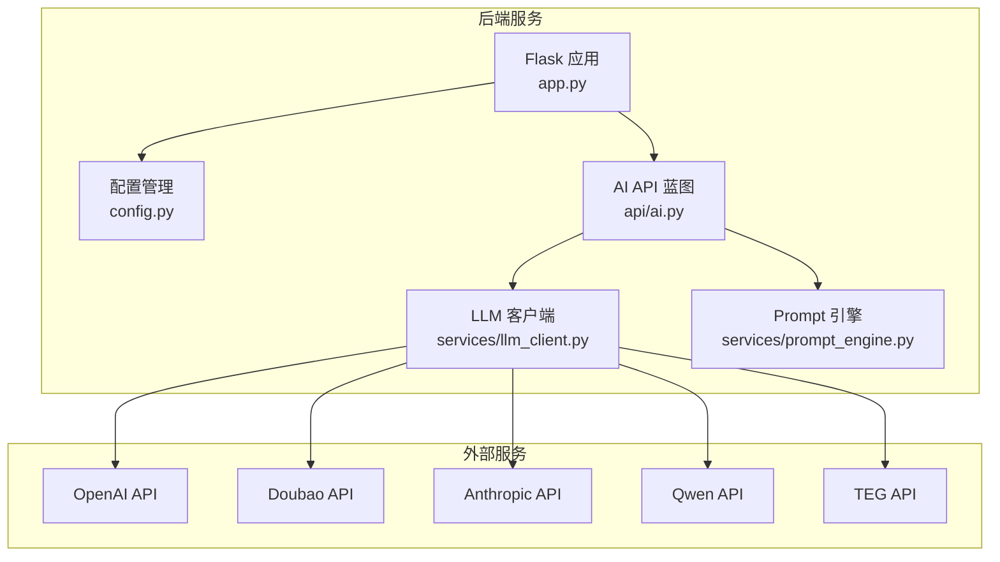
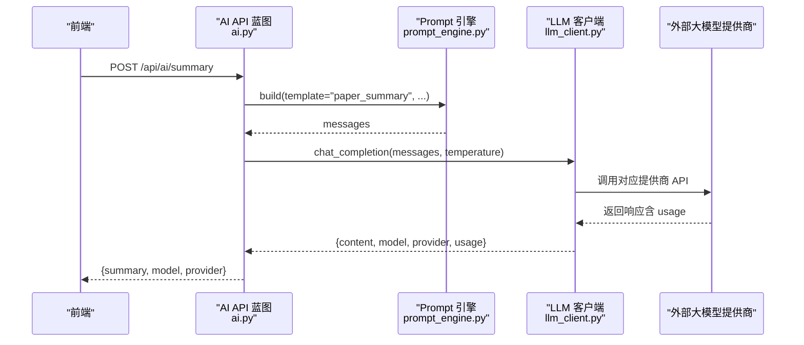
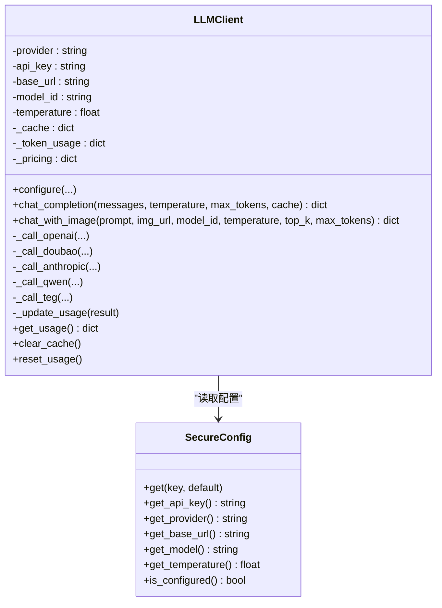
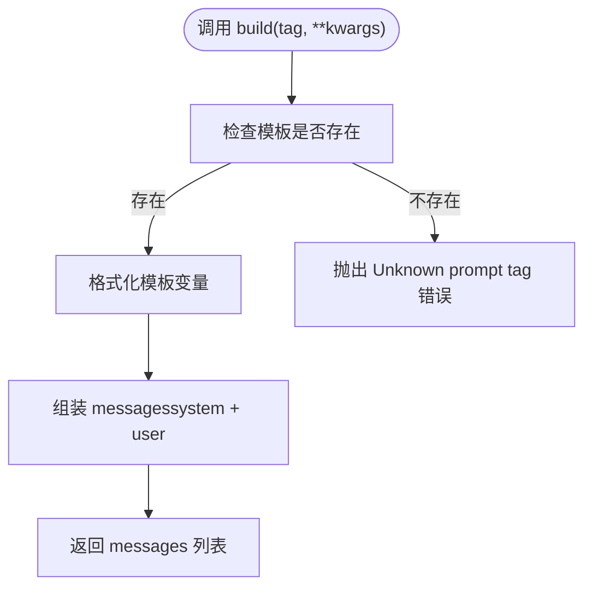
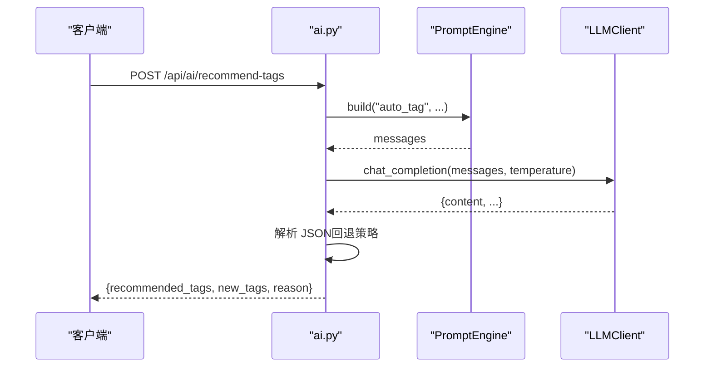
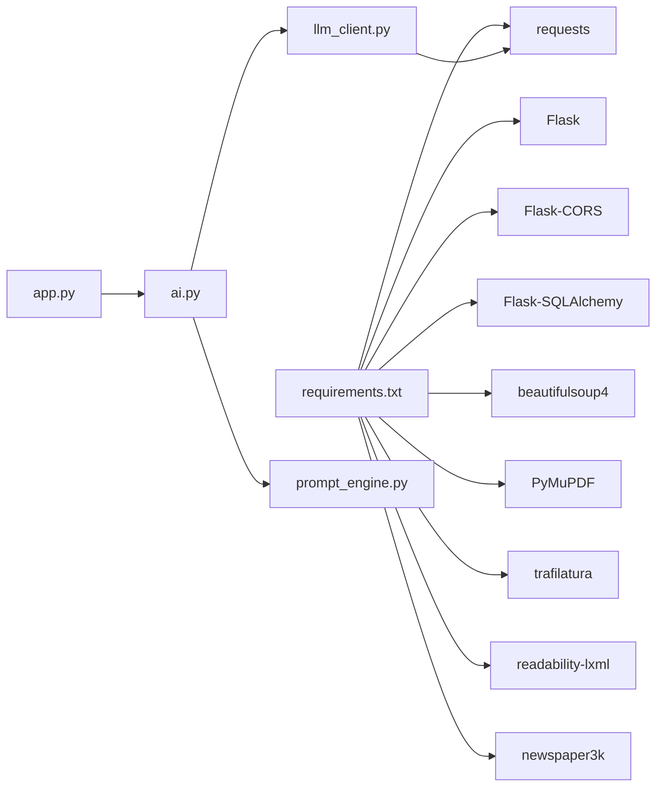

# 大模型客户端

<cite>
**本文引用的文件**
- [llm_client.py](file://backend/services/llm_client.py)
- [ai.py](file://backend/api/ai.py)
- [prompt_engine.py](file://backend/services/prompt_engine.py)
- [config.py](file://backend/config.py)
- [app.py](file://backend/app.py)
- [ai.yml](file://specs/backend/api/ai.yml)
- [prompt_engine.yml](file://specs/backend/services/prompt_engine.yml)
- [requirements.txt](file://backend/requirements.txt)
- [README.md](file://README.md)
</cite>

## 目录
1. [简介](#简介)
2. [项目结构](#项目结构)
3. [核心组件](#核心组件)
4. [架构总览](#架构总览)
5. [详细组件分析](#详细组件分析)
6. [依赖分析](#依赖分析)
7. [性能考虑](#性能考虑)
8. [故障排查指南](#故障排查指南)
9. [结论](#结论)
10. [附录](#附录)

## 简介
本文件面向“大模型客户端”的技术文档，围绕 PaperHub 后端中的 LLM 客户端实现进行系统化梳理。重点包括：
- AI 服务集成的技术架构与通信协议
- 多提供商适配层设计（OpenAI、豆包 Doubao、Anthropic、通义千问 Qwen、TEG）
- API 密钥管理与配置加载机制
- 请求参数封装与响应数据处理
- 模型选择策略、并发控制、超时与重试机制
- Prompt 工程最佳实践、用量统计与成本控制、性能监控
- 不同 AI 服务商的集成示例与配置指南

## 项目结构
PaperHub 后端采用 Flask + SQLAlchemy 架构，AI 相关能力集中在 backend/services/llm_client.py 与 backend/api/ai.py 中，配合 PromptEngine 模板引擎与配置管理模块共同构成完整的 AI 能力闭环。

图表来源
- [app.py:140-158](file://backend/app.py#L140-L158)
- [ai.py:10-32](file://backend/api/ai.py#L10-L32)
- [llm_client.py:198-234](file://backend/services/llm_client.py#L198-L234)
- [prompt_engine.py:92-109](file://backend/services/prompt_engine.py#L92-L109)

章节来源
- [app.py:140-158](file://backend/app.py#L140-L158)
- [ai.py:10-32](file://backend/api/ai.py#L10-L32)
- [llm_client.py:198-234](file://backend/services/llm_client.py#L198-L234)
- [prompt_engine.py:92-109](file://backend/services/prompt_engine.py#L92-L109)

## 核心组件
- LLM 客户端（LLMClient）：统一适配多家大模型提供商，封装请求参数、响应解析、用量统计与缓存。
- Prompt 引擎（PromptEngine）：集中管理 Prompt 模板，支持系统提示与用户提示的构建。
- AI API 蓝图（ai.py）：对外暴露配置、摘要生成、标签推荐、相关性分析、用量查询与缓存清理等接口。
- 配置管理（config.py）：提供数据库连接池与会话管理，支撑 AI API 的数据访问。
- 安全配置（SecureConfig）：支持 .env 文件与环境变量加载，统一获取 API Key、提供商、基础 URL、模型与温度等配置。

章节来源
- [llm_client.py:18-93](file://backend/services/llm_client.py#L18-L93)
- [llm_client.py:198-547](file://backend/services/llm_client.py#L198-L547)
- [prompt_engine.py:92-109](file://backend/services/prompt_engine.py#L92-L109)
- [ai.py:10-76](file://backend/api/ai.py#L10-L76)
- [config.py:85-134](file://backend/config.py#L85-L134)

## 架构总览
AI 能力通过 Flask 蓝图对外提供 REST 接口，内部由 LLM 客户端统一调度各提供商 API；Prompt 引擎负责将业务场景转化为标准化的消息结构；用量统计与成本控制在客户端侧完成，支持按提供商计价。

图表来源
- [ai.py:117-139](file://backend/api/ai.py#L117-L139)
- [prompt_engine.py:94-105](file://backend/services/prompt_engine.py#L94-L105)
- [llm_client.py:247-278](file://backend/services/llm_client.py#L247-L278)

章节来源
- [ai.py:117-139](file://backend/api/ai.py#L117-L139)
- [prompt_engine.py:94-105](file://backend/services/prompt_engine.py#L94-L105)
- [llm_client.py:247-278](file://backend/services/llm_client.py#L247-L278)

## 详细组件分析

### LLM 客户端（LLMClient）
- 单例与配置注入：支持构造参数优先，否则从 SecureConfig 加载；提供 configure 方法动态更新配置。
- 多提供商适配：内置 _call_openai、_call_doubao、_call_anthropic、_call_qwen、_call_teg 等方法，分别封装各提供商的请求格式与响应解析。
- 请求参数封装：统一接收 messages（系统/用户消息）、temperature、max_tokens；TEG 支持图片输入的 multimodal 格式。
- 缓存与用量统计：基于消息、温度、max_tokens 的哈希生成缓存键；记录 prompt_tokens、completion_tokens、调用次数与总成本（按提供商计价）。
- 错误处理：各提供商调用中捕获异常并返回错误信息；TEG 调用包含重试逻辑与超时设置。
- 图像输入接口：chat_with_image 以 TEG 方式兼容图片输入，支持 top_k、max_tokens 等参数。

图表来源
- [llm_client.py:198-547](file://backend/services/llm_client.py#L198-L547)
- [llm_client.py:18-93](file://backend/services/llm_client.py#L18-L93)

章节来源
- [llm_client.py:198-547](file://backend/services/llm_client.py#L198-L547)
- [llm_client.py:95-195](file://backend/services/llm_client.py#L95-L195)

### Prompt 引擎（PromptEngine）
- 模板管理：集中定义 paper_summary、auto_tag、related_content、note_summary 等模板，每个模板包含 system 与 template 字段。
- 构建消息：build(tag, **kwargs) 将模板变量格式化后组装为 messages（系统消息 + 用户消息）。
- 可用模板：get_available_tags() 返回可用模板列表。

图表来源
- [prompt_engine.py:94-105](file://backend/services/prompt_engine.py#L94-L105)

章节来源
- [prompt_engine.py:92-109](file://backend/services/prompt_engine.py#L92-L109)

### AI API 蓝图（ai.py）
- 配置接口：POST /api/ai/config 与 GET /api/ai/config，支持动态配置提供商、API Key、Base URL、模型与温度。
- 用量统计：GET /api/ai/stats 返回 token 使用统计与总成本。
- 摘要生成：POST /api/ai/summary，从 Paper/Article/Note 中抽取内容，经 PromptEngine 构建 messages，调用 LLMClient 生成摘要。
- 标签推荐：POST /api/ai/recommend-tags，返回推荐标签与新建标签建议。
- 相关性分析：POST /api/ai/related，基于当前内容与候选集合进行相关性评分。
- 缓存清理：POST /api/ai/clear-cache 清空 LLM 客户端缓存。

图表来源
- [ai.py:177-210](file://backend/api/ai.py#L177-L210)
- [prompt_engine.py:94-105](file://backend/services/prompt_engine.py#L94-L105)
- [llm_client.py:247-278](file://backend/services/llm_client.py#L247-L278)

章节来源
- [ai.py:42-76](file://backend/api/ai.py#L42-L76)
- [ai.py:79-139](file://backend/api/ai.py#L79-L139)
- [ai.py:142-210](file://backend/api/ai.py#L142-L210)
- [ai.py:213-281](file://backend/api/ai.py#L213-L281)
- [ai.py:284-288](file://backend/api/ai.py#L284-L288)

### 安全配置（SecureConfig）
- 配置来源优先级：.env 文件（项目根目录） → 环境变量（覆盖 .env）。
- 关键配置项：LLM_API_KEY、LLM_PROVIDER、LLM_BASE_URL、LLM_MODEL、LLM_TEMPERATURE。
- 初始化行为：首次访问时生成示例 .env 文件（若不存在），便于开发者快速上手。

章节来源
- [llm_client.py:18-93](file://backend/services/llm_client.py#L18-L93)
- [llm_client.py:562-590](file://backend/services/llm_client.py#L562-L590)

### 配置管理（config.py）
- 数据库连接池：全局唯一 Engine 与 ScopedSession，支持连接池大小、溢出连接、超时与回收策略。
- 会话管理：提供 get_session 与 get_scoped_session，以及 teardown 生命周期钩子 close_scoped_session。
- 作用：为 AI API 的数据查询（Paper/Article/Note/Tag）提供稳定、可复用的数据库访问。

章节来源
- [config.py:85-134](file://backend/config.py#L85-L134)

## 依赖分析
- 外部依赖：Flask、Flask-CORS、Flask-SQLAlchemy、requests、BeautifulSoup4、PyMuPDF、trafilatura、readability-lxml、newspaper3k 等。
- 内部依赖：ai.py 依赖 llm_client.py 与 prompt_engine.py；llm_client.py 依赖 requests；app.py 注册蓝图并初始化数据库。

图表来源
- [requirements.txt:1-15](file://backend/requirements.txt#L1-L15)
- [app.py:140-158](file://backend/app.py#L140-L158)
- [ai.py:10-32](file://backend/api/ai.py#L10-L32)
- [llm_client.py:12](file://backend/services/llm_client.py#L12)

章节来源
- [requirements.txt:1-15](file://backend/requirements.txt#L1-L15)
- [app.py:140-158](file://backend/app.py#L140-L158)
- [ai.py:10-32](file://backend/api/ai.py#L10-L32)
- [llm_client.py:12](file://backend/services/llm_client.py#L12)

## 性能考虑
- 缓存策略：基于消息内容、温度与 max_tokens 的哈希生成缓存键，避免重复请求相同参数的相同内容，显著降低外部调用次数与成本。
- 超时与重试：TEG 调用设置连接/读取超时，并在响应为空时进行最多 3 次重试，提升稳定性。
- 用量统计：客户端侧累计 prompt_tokens、completion_tokens 与调用次数，按提供商计价，便于成本控制与预算预警。
- 并发控制：当前实现未显式引入线程池/进程池；建议在高并发场景下结合上游限流与后端队列策略，避免触发外部速率限制。

章节来源
- [llm_client.py:218-224](file://backend/services/llm_client.py#L218-L224)
- [llm_client.py:379-381](file://backend/services/llm_client.py#L379-L381)
- [llm_client.py:113-194](file://backend/services/llm_client.py#L113-L194)
- [llm_client.py:519-535](file://backend/services/llm_client.py#L519-L535)

## 故障排查指南
- API Key 未配置：LLMClient 在缺少 API Key 时返回错误信息；AI API 在摘要/标签/相关性接口中也会进行前置校验。
- 外部调用失败：各提供商调用中捕获异常并返回错误字符串；建议检查网络连通性、API Key 权限与 Base URL 设置。
- TEG 图像输入异常：确保图像 URL 可访问且内容类型符合要求；若响应为空，系统会自动重试。
- JSON 解析失败：标签推荐与相关性分析接口对返回 JSON 进行解析，失败时提供回退策略（如返回空数组或默认结果）。
- 用量统计异常：确认调用成功并返回 usage 字段；可通过 GET /api/ai/stats 查看累计统计。

章节来源
- [llm_client.py:383-412](file://backend/services/llm_client.py#L383-L412)
- [llm_client.py:414-443](file://backend/services/llm_client.py#L414-L443)
- [llm_client.py:445-486](file://backend/services/llm_client.py#L445-L486)
- [llm_client.py:488-517](file://backend/services/llm_client.py#L488-L517)
- [llm_client.py:330-371](file://backend/services/llm_client.py#L330-L371)
- [ai.py:197-208](file://backend/api/ai.py#L197-L208)
- [ai.py:267-277](file://backend/api/ai.py#L267-L277)

## 结论
PaperHub 的大模型客户端通过统一的适配层与 Prompt 引擎，实现了对多家提供商的无缝集成；结合缓存、用量统计与错误回退机制，既保证了稳定性，又兼顾了成本控制。建议在生产环境中进一步完善并发控制、速率限制与可观测性指标，以应对更高负载与更复杂的业务场景。

## 附录

### API 规范概览
- /api/ai/config（GET/POST）：配置提供商、API Key、Base URL、模型与温度。
- /api/ai/stats（GET）：获取用量统计与总成本。
- /api/ai/summary（POST）：生成论文/文章/笔记摘要。
- /api/ai/recommend-tags（POST）：智能推荐标签。
- /api/ai/related（POST）：相关性分析与推荐。
- /api/ai/clear-cache（POST）：清空缓存。

章节来源
- [ai.yml:4-190](file://specs/backend/api/ai.yml#L4-L190)

### Prompt 引擎模板说明
- paper_summary：论文摘要解读模板，包含核心创新点、关键数据与工程启发。
- auto_tag：标签推荐模板，输出推荐标签、新建标签与理由。
- related_content：相关内容关联分析模板，输出关联度与理由。
- note_summary：笔记总结模板。

章节来源
- [prompt_engine.yml:1-18](file://specs/backend/services/prompt_engine.yml#L1-L18)
- [prompt_engine.py:6-88](file://backend/services/prompt_engine.py#L6-L88)

### 配置与示例
- .env 示例：首次运行时自动生成，包含 LLM_API_KEY、LLM_PROVIDER、LLM_BASE_URL、LLM_MODEL 等字段。
- 环境变量优先级：环境变量覆盖 .env 文件中的同名配置。
- 示例提供商：doubao、openai、anthropic、qwen、teg。

章节来源
- [llm_client.py:562-590](file://backend/services/llm_client.py#L562-L590)
- [llm_client.py:70-82](file://backend/services/llm_client.py#L70-L82)