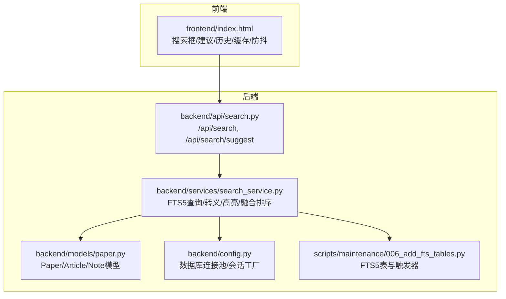
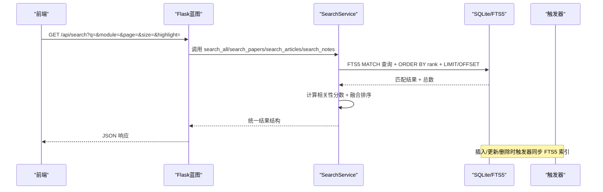
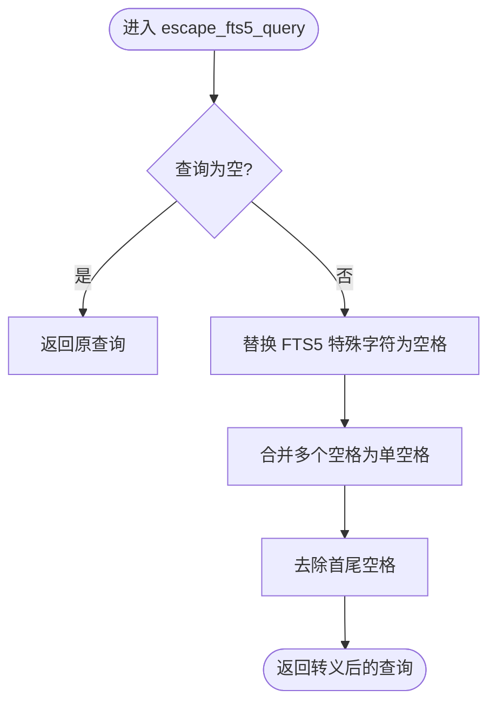
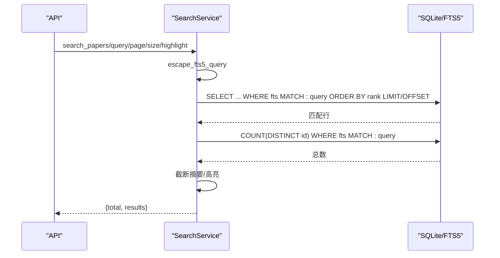
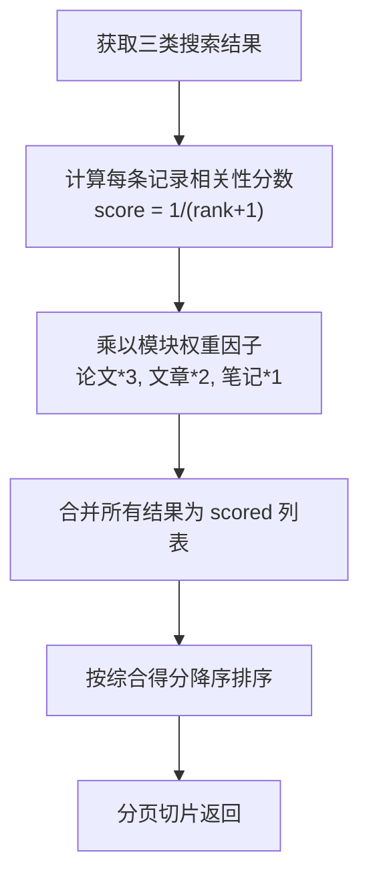
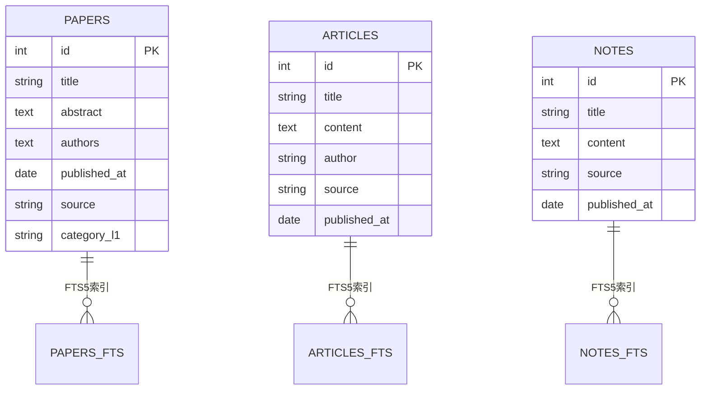
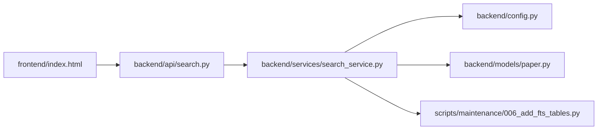

# 搜索服务

<cite>
**本文引用的文件**
- [backend/services/search_service.py](file://backend/services/search_service.py)
- [backend/api/search.py](file://backend/api/search.py)
- [scripts/maintenance/006_add_fts_tables.py](file://scripts/maintenance/006_add_fts_tables.py)
- [backend/models/paper.py](file://backend/models/paper.py)
- [backend/config.py](file://backend/config.py)
- [specs/backend/services/search_service.yml](file://specs/backend/services/search_service.yml)
- [specs/backend/api/search.yml](file://specs/backend/api/search.yml)
- [docs/搜索框全面回顾与优化方案.md](file://docs/搜索框全面回顾与优化方案.md)
- [frontend/index.html](file://frontend/index.html)
</cite>

## 目录
1. [简介](#简介)
2. [项目结构](#项目结构)
3. [核心组件](#核心组件)
4. [架构总览](#架构总览)
5. [详细组件分析](#详细组件分析)
6. [依赖分析](#依赖分析)
7. [性能考量](#性能考量)
8. [故障排查指南](#故障排查指南)
9. [结论](#结论)
10. [附录](#附录)

## 简介
本文件系统性梳理 PaperHub 的搜索服务，围绕全文检索、智能排序、搜索建议展开，重点覆盖 SQLite FTS5 集成、查询解析、权重计算、相关性评分机制、索引构建与实时更新、模糊匹配与同义词处理现状、性能优化与缓存策略、防抖机制、搜索历史管理，并提供搜索 API 使用示例与自定义搜索规则的配置方法。文档兼顾技术深度与可读性，适合不同背景读者快速掌握搜索系统的实现与优化要点。

## 项目结构
搜索服务由后端 Flask 蓝图提供 REST 接口，后端服务封装 SQLite FTS5 查询与结果聚合，前端 Vue3 组件负责输入、建议、历史与缓存交互。核心文件分布如下：
- 后端 API：提供搜索与建议接口
- 后端服务：封装 FTS5 查询、转义、高亮、跨模块融合排序
- 数据模型：论文/文章/笔记实体，支撑 FTS5 触发器与索引字段
- 配置：数据库连接池与会话工厂
- 迁移脚本：创建 FTS5 虚拟表与触发器，初始化索引数据
- 规范文档：接口与服务的输入输出与规则说明
- 前端：搜索框、建议、历史、缓存与防抖

图表来源
- [backend/api/search.py:1-70](file://backend/api/search.py#L1-L70)
- [backend/services/search_service.py:1-314](file://backend/services/search_service.py#L1-L314)
- [backend/models/paper.py:120-293](file://backend/models/paper.py#L120-L293)
- [backend/config.py:85-134](file://backend/config.py#L85-L134)
- [scripts/maintenance/006_add_fts_tables.py:13-179](file://scripts/maintenance/006_add_fts_tables.py#L13-L179)
- [frontend/index.html:5346-5489](file://frontend/index.html#L5346-L5489)

章节来源
- [backend/api/search.py:1-70](file://backend/api/search.py#L1-L70)
- [backend/services/search_service.py:1-314](file://backend/services/search_service.py#L1-L314)
- [backend/models/paper.py:120-293](file://backend/models/paper.py#L120-L293)
- [backend/config.py:85-134](file://backend/config.py#L85-L134)
- [scripts/maintenance/006_add_fts_tables.py:13-179](file://scripts/maintenance/006_add_fts_tables.py#L13-L179)
- [frontend/index.html:5346-5489](file://frontend/index.html#L5346-L5489)

## 核心组件
- 查询解析与转义：对 FTS5 特殊字符进行转义，确保查询语法安全；将多空格合并为单空格，提升多词匹配效果。
- 全文检索：基于 SQLite FTS5 虚拟表，分别对论文、文章、笔记建立独立索引，查询时按 FTS5 rank 排序。
- 相关性评分与融合排序：将 FTS5 rank 映射为 0-1 的相关性分数，乘以模块权重因子，跨模块合并后按综合得分降序排序。
- 搜索建议：从三类资源标题字段中提取建议，使用 FTS5 MATCH 走索引，性能较 LIKE 前缀模糊匹配有数量级提升。
- 高亮：对匹配关键词用 HTML 标签包裹，前端渲染时可应用样式。
- 索引构建与实时更新：迁移脚本创建 FTS5 虚拟表与触发器，插入/更新/删除时自动同步索引；初始化脚本同步现有数据。
- 前端交互：防抖、请求取消、搜索历史、本地缓存、加载状态、键盘导航与快捷键。

章节来源
- [backend/services/search_service.py:8-26](file://backend/services/search_service.py#L8-L26)
- [backend/services/search_service.py:39-205](file://backend/services/search_service.py#L39-L205)
- [backend/services/search_service.py:207-257](file://backend/services/search_service.py#L207-L257)
- [backend/services/search_service.py:259-314](file://backend/services/search_service.py#L259-L314)
- [scripts/maintenance/006_add_fts_tables.py:13-179](file://scripts/maintenance/006_add_fts_tables.py#L13-L179)
- [frontend/index.html:5346-5489](file://frontend/index.html#L5346-L5489)

## 架构总览
后端采用“API 蓝图 + 服务层 + FTS5 + 触发器”的分层架构。API 负责参数解析与错误处理，服务层负责查询、评分与聚合，FTS5 虚拟表与触发器保障索引的实时一致性，前端负责输入、建议、历史与缓存。

图表来源
- [backend/api/search.py:14-51](file://backend/api/search.py#L14-L51)
- [backend/services/search_service.py:39-205](file://backend/services/search_service.py#L39-L205)
- [backend/services/search_service.py:207-257](file://backend/services/search_service.py#L207-L257)
- [scripts/maintenance/006_add_fts_tables.py:55-138](file://scripts/maintenance/006_add_fts_tables.py#L55-L138)

## 详细组件分析

### 查询解析与转义（escape_fts5_query）
- 目标：避免 FTS5 语法错误，提升多词匹配鲁棒性。
- 处理策略：移除特殊字符，将多空格合并为单空格，保持查询可解析性。
- 影响范围：所有搜索入口均需经过转义，确保 SQL 注入与语法错误防护。

图表来源
- [backend/services/search_service.py:8-26](file://backend/services/search_service.py#L8-L26)

章节来源
- [backend/services/search_service.py:8-26](file://backend/services/search_service.py#L8-L26)

### 高亮（highlight_text）
- 目标：在标题与摘要中对关键词进行高亮，提升可读性。
- 处理策略：对每个关键词进行转义后，使用正则替换包裹 HTML 标签。
- 注意事项：前端需定义相应样式以呈现高亮效果。

章节来源
- [backend/services/search_service.py:28-37](file://backend/services/search_service.py#L28-L37)

### 分模块搜索（search_papers/search_articles/search_notes）
- 查询流程：转义查询 → FTS5 MATCH + ORDER BY rank → 统计总数 → 截断摘要 → 高亮 → 组装结果。
- 字段选择：论文使用标题、摘要、作者、分类；文章使用标题、内容、作者、来源；笔记使用标题、内容、来源。
- 摘要策略：论文摘要限制长度，文章/笔记内容去 HTML 或 Markdown 标记后截断。
- 排序依据：FTS5 rank 升序（越小越相关）。

图表来源
- [backend/services/search_service.py:39-96](file://backend/services/search_service.py#L39-L96)
- [backend/services/search_service.py:98-151](file://backend/services/search_service.py#L98-L151)
- [backend/services/search_service.py:153-205](file://backend/services/search_service.py#L153-L205)

章节来源
- [backend/services/search_service.py:39-96](file://backend/services/search_service.py#L39-L96)
- [backend/services/search_service.py:98-151](file://backend/services/search_service.py#L98-L151)
- [backend/services/search_service.py:153-205](file://backend/services/search_service.py#L153-L205)

### 跨模块融合排序（search_all）
- 权重因子：论文权重最高，文章次之，笔记最低。
- 相关性映射：将 FTS5 rank 映射为 0-1 的相关性分数，再乘以模块权重。
- 融合策略：合并三类结果，按综合得分降序排序，分页返回。
- 统计信息：返回各模块命中总数与聚合统计。

图表来源
- [backend/services/search_service.py:207-257](file://backend/services/search_service.py#L207-L257)

章节来源
- [backend/services/search_service.py:207-257](file://backend/services/search_service.py#L207-L257)

### 搜索建议（get_search_suggestions）
- 建议来源：从三类资源标题字段中提取建议，走 FTS5 MATCH 索引，性能较 LIKE 前缀模糊匹配有数量级提升。
- 去重与上限：使用集合去重，限制返回数量。
- 建议时机：前端在输入达到一定长度后触发建议请求。

章节来源
- [backend/services/search_service.py:259-314](file://backend/services/search_service.py#L259-L314)
- [docs/搜索框全面回顾与优化方案.md:291-312](file://docs/搜索框全面回顾与优化方案.md#L291-L312)

### API 接口（/api/search 与 /api/search/suggest）
- /api/search：支持按模块搜索（all/papers/articles/notes）、分页、高亮开关；返回统一结构与模块统计。
- /api/search/suggest：返回建议列表，支持限制数量。
- 参数校验与错误处理：空关键词返回错误提示，异常捕获返回统一错误结构。

章节来源
- [backend/api/search.py:14-51](file://backend/api/search.py#L14-L51)
- [backend/api/search.py:53-70](file://backend/api/search.py#L53-L70)
- [specs/backend/api/search.yml:1-70](file://specs/backend/api/search.yml#L1-L70)

### SQLite FTS5 集成与索引构建
- 虚拟表：为论文、文章、笔记分别创建 FTS5 虚拟表，字段包含标题、正文、作者、来源、分类等。
- 触发器：插入/更新/删除时同步 FTS5 索引，保证实时一致性。
- 初始化：迁移脚本清空并同步现有数据，确保索引与主表一致。

图表来源
- [scripts/maintenance/006_add_fts_tables.py:18-48](file://scripts/maintenance/006_add_fts_tables.py#L18-L48)
- [backend/models/paper.py:120-293](file://backend/models/paper.py#L120-L293)

章节来源
- [scripts/maintenance/006_add_fts_tables.py:13-179](file://scripts/maintenance/006_add_fts_tables.py#L13-L179)
- [backend/models/paper.py:120-293](file://backend/models/paper.py#L120-L293)

### 前端交互与优化
- 防抖与请求取消：300ms 防抖，AbortController 取消未完成请求，避免乱序与重复请求。
- 搜索建议：走 FTS5 MATCH，性能提升；支持键盘上下箭头导航与 Enter 选中。
- 搜索历史：localStorage 存储，最多 10 条，支持删除与清空。
- 本地缓存：LRU 策略最多 20 条，命中即返回，未命中发起网络请求并写入缓存。
- 加载状态：搜索中显示大尺寸 spinner 与提示，提升感知速度。
- 快捷键：支持全局快捷键快速聚焦搜索框。

章节来源
- [docs/搜索框全面回顾与优化方案.md:264-335](file://docs/搜索框全面回顾与优化方案.md#L264-L335)
- [frontend/index.html:5346-5489](file://frontend/index.html#L5346-L5489)

## 依赖分析
- 组件耦合：API 依赖服务层；服务层依赖模型与配置；服务层与迁移脚本共同依赖数据库。
- 外部依赖：SQLite FTS5、SQLAlchemy、Flask。
- 潜在风险：FTS5 rank 与权重因子的组合需持续评估；前端缓存与后端数据一致性需关注。

图表来源
- [backend/api/search.py:1-70](file://backend/api/search.py#L1-L70)
- [backend/services/search_service.py:1-314](file://backend/services/search_service.py#L1-L314)
- [backend/config.py:85-134](file://backend/config.py#L85-L134)
- [backend/models/paper.py:120-293](file://backend/models/paper.py#L120-L293)
- [scripts/maintenance/006_add_fts_tables.py:13-179](file://scripts/maintenance/006_add_fts_tables.py#L13-L179)
- [frontend/index.html:5346-5489](file://frontend/index.html#L5346-L5489)

## 性能考量
- FTS5 索引：三类资源独立虚拟表，查询走索引，性能优于 LIKE 前缀模糊匹配。
- 排序成本：FTS5 rank 升序，服务层仅做分数映射与加权融合，复杂度可控。
- 建议性能：建议接口走 FTS5 MATCH，避免全表扫描；前端 300ms 防抖减少请求量。
- 缓存策略：前端 LRU 缓存最近 20 条搜索结果，命中即返回，显著降低数据库压力。
- 连接池：后端使用 SQLAlchemy 连接池，避免频繁连接开销。
- 建议优化：可考虑对高频关键词建立更细粒度的字段权重，或引入语义重排（见下一节）。

## 故障排查指南
- 空关键词：API 返回错误提示，请检查前端输入校验与参数传递。
- 查询语法错误：确认已进行转义处理，避免特殊字符导致解析失败。
- 建议性能差：确认已使用 FTS5 MATCH 而非 LIKE 前缀模糊匹配。
- 融合排序不合理：检查模块权重因子与 rank 映射逻辑，必要时调整权重。
- 建议未返回：确认前端防抖阈值与触发条件，以及后端建议接口可用性。
- 缓存命中异常：检查前端缓存键生成与 LRU 淘汰策略，确保键一致且容量合理。
- 数据不一致：检查触发器是否正常工作，必要时重新初始化 FTS5 数据。

章节来源
- [backend/api/search.py:24-28](file://backend/api/search.py#L24-L28)
- [backend/services/search_service.py:8-26](file://backend/services/search_service.py#L8-L26)
- [backend/services/search_service.py:259-314](file://backend/services/search_service.py#L259-L314)
- [docs/搜索框全面回顾与优化方案.md:181-214](file://docs/搜索框全面回顾与优化方案.md#L181-L214)
- [frontend/index.html:5415-5442](file://frontend/index.html#L5415-L5442)

## 结论
PaperHub 的搜索服务以 SQLite FTS5 为核心，配合触发器实现实时索引同步，服务层完成查询转义、高亮与跨模块融合排序，前端实现防抖、请求取消、搜索历史与本地缓存等优化。整体架构简洁高效，具备良好的扩展性。后续可在语义重排、拼写纠错、热门推荐等方面进一步增强，以达到更智能的搜索体验。

## 附录

### 搜索 API 使用示例
- 全文搜索（跨模块）
  - 方法：GET
  - 路径：/api/search
  - 参数：q（关键词，必填）、module（all/papers/articles/notes，默认 all）、page（页码，默认 1）、size（每页数量，默认 20）、highlight（是否高亮，默认 true）
  - 返回：success、total、page、size、results、breakdown
- 搜索建议
  - 方法：GET
  - 路径：/api/search/suggest
  - 参数：q（关键词，必填）、limit（建议数量，默认 5）
  - 返回：success、suggestions

章节来源
- [specs/backend/api/search.yml:1-70](file://specs/backend/api/search.yml#L1-L70)
- [backend/api/search.py:14-51](file://backend/api/search.py#L14-L51)
- [backend/api/search.py:53-70](file://backend/api/search.py#L53-L70)

### 自定义搜索规则配置
- 查询转义：如需调整特殊字符处理策略，可在转义函数中扩展正则规则。
- 权重因子：在融合排序处调整模块权重因子，以适配业务场景。
- 建议来源：可在建议接口中增加更多字段或来源，提升建议相关性。
- 高亮样式：在前端样式中定义高亮标签的视觉样式，确保可读性。
- FTS5 字段：在迁移脚本中调整虚拟表字段，以纳入更多可检索内容。

章节来源
- [backend/services/search_service.py:8-26](file://backend/services/search_service.py#L8-L26)
- [backend/services/search_service.py:207-257](file://backend/services/search_service.py#L207-L257)
- [backend/services/search_service.py:259-314](file://backend/services/search_service.py#L259-L314)
- [scripts/maintenance/006_add_fts_tables.py:18-48](file://scripts/maintenance/006_add_fts_tables.py#L18-L48)