# 笔记导入服务

<cite>
**本文档引用的文件**
- [note_importer.py](file://backend/services/note_importer.py)
- [ingest.py](file://backend/api/ingest.py)
- [migrate_notes.py](file://backend/services/migrate_notes.py)
- [note_deduplicator.py](file://backend/services/note_deduplicator.py)
- [deduplicator.py](file://backend/services/deduplicator.py)
- [paper.py](file://backend/models/paper.py)
- [ingest.yml](file://specs/backend/api/ingest.yml)
- [note.yml](file://specs/backend/models/note.yml)
- [ingestModule.js](file://frontend/src/modules/ingestModule.js)
- [zhihu_parser.py](file://backend/services/zhihu_parser.py)
- [wechat_parser.py](file://backend/services/wechat_parser.py)
- [笔记系统设计方案.md](file://docs/笔记系统设计方案.md)
</cite>

## 目录
1. [简介](#简介)
2. [项目结构](#项目结构)
3. [核心组件](#核心组件)
4. [架构概览](#架构概览)
5. [详细组件分析](#详细组件分析)
6. [依赖关系分析](#依赖关系分析)
7. [性能考虑](#性能考虑)
8. [故障排除指南](#故障排除指南)
9. [结论](#结论)
10. [附录](#附录)

## 简介

PaperHub 笔记导入服务是一个专门设计的系统，用于处理和导入各种来源的笔记内容，特别是AI对话记录和Markdown格式的内容。该服务提供了完整的导入流程，包括内容解析、格式标准化、质量控制和批量处理等功能。

该服务的核心目标是：
- 统一处理多种来源的笔记导入
- 提供高质量的内容标准化和渲染
- 实现智能的去重机制
- 支持批量导入和错误恢复
- 确保数据的一致性和完整性

## 项目结构

PaperHub 采用三层内容库架构，专门针对笔记导入进行了优化设计：

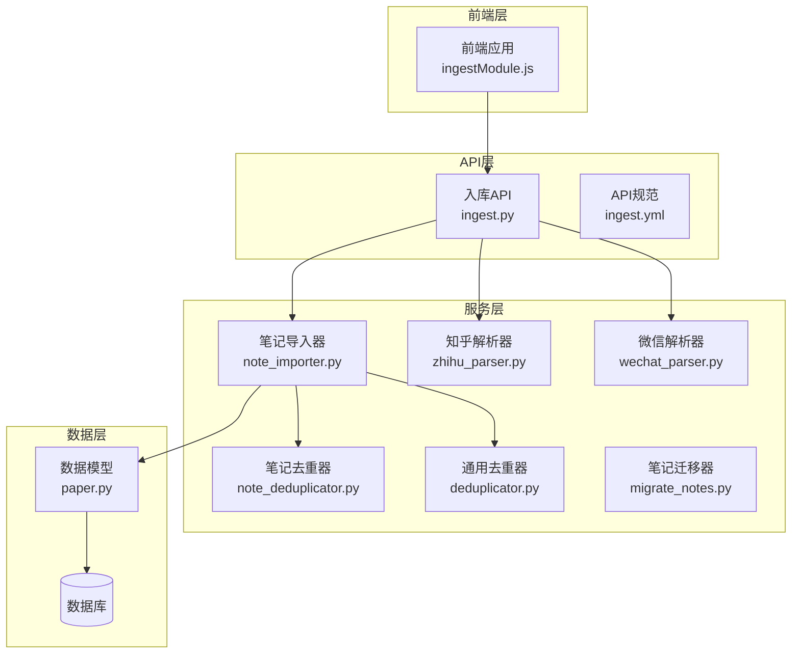

**图表来源**
- [ingest.py:1-1166](file://backend/api/ingest.py#L1-L1166)
- [note_importer.py:1-232](file://backend/services/note_importer.py#L1-L232)
- [paper.py:1-360](file://backend/models/paper.py#L1-L360)

**章节来源**
- [ingest.py:1-1166](file://backend/api/ingest.py#L1-L1166)
- [note_importer.py:1-232](file://backend/services/note_importer.py#L1-L232)
- [paper.py:1-360](file://backend/models/paper.py#L1-L360)

## 核心组件

### 笔记导入器 (Note Importer)

笔记导入器是整个导入服务的核心组件，负责处理Markdown内容的渲染和存储：

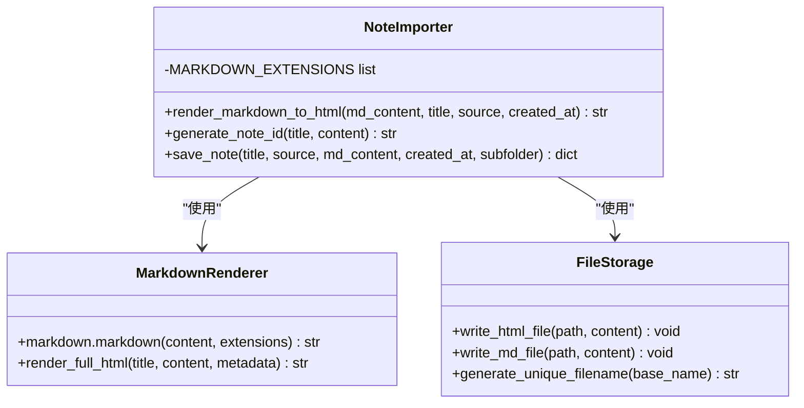

**图表来源**
- [note_importer.py:17-232](file://backend/services/note_importer.py#L17-L232)

### 去重机制

系统实现了多层次的去重策略，确保不会重复导入相同内容：

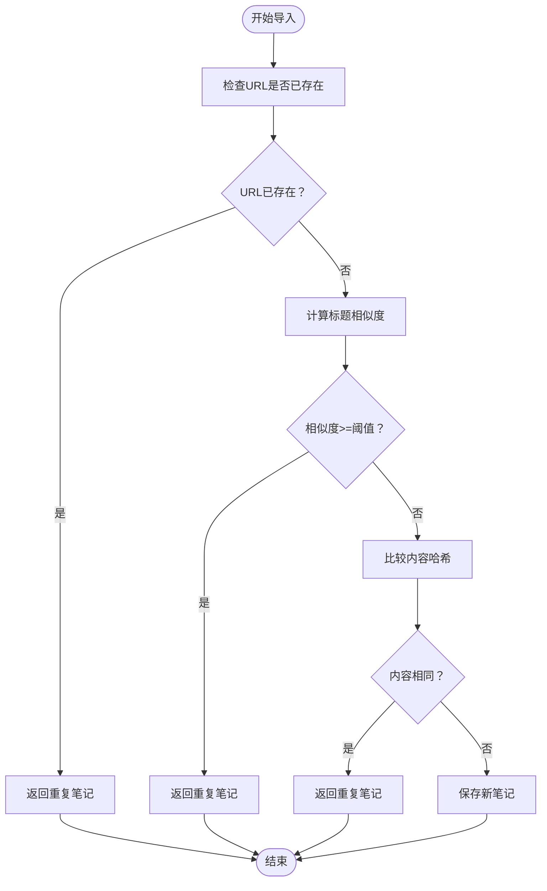

**图表来源**
- [note_deduplicator.py:88-129](file://backend/services/note_deduplicator.py#L88-L129)

**章节来源**
- [note_importer.py:17-232](file://backend/services/note_importer.py#L17-L232)
- [note_deduplicator.py:1-230](file://backend/services/note_deduplicator.py#L1-L230)

## 架构概览

PaperHub 笔记导入服务采用分层架构设计，每层都有明确的职责分工：

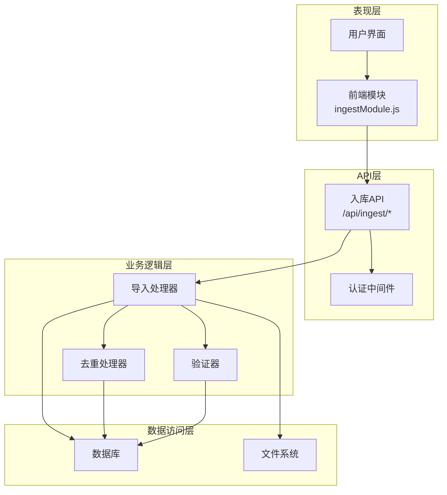

**图表来源**
- [ingest.py:261-348](file://backend/api/ingest.py#L261-L348)
- [ingestModule.js:4-48](file://frontend/src/modules/ingestModule.js#L4-L48)

## 详细组件分析

### AI对话导入处理

AI对话导入是系统的核心功能之一，专门处理来自各种AI助手的对话内容：

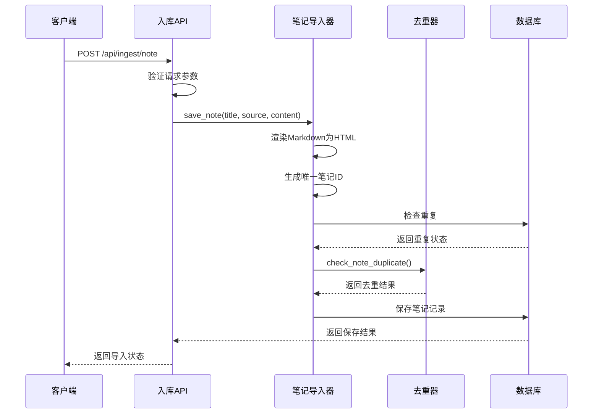

**图表来源**
- [ingest.py:261-348](file://backend/api/ingest.py#L261-L348)
- [note_importer.py:183-232](file://backend/services/note_importer.py#L183-L232)

#### 对话格式解析

系统支持多种AI对话格式的解析和标准化：

| AI平台 | 格式特点 | 处理方式 |
|--------|----------|----------|
| Claude | 交替的消息格式 | 自动识别用户/助手消息 |
| ChatGPT | Markdown增强 | 保持原有格式结构 |
| Kimi | 流式响应 | 合并流式输出为完整内容 |
| 其他平台 | 标准Markdown | 直接渲染处理 |

#### 消息结构提取

系统能够智能提取和组织对话中的关键信息：

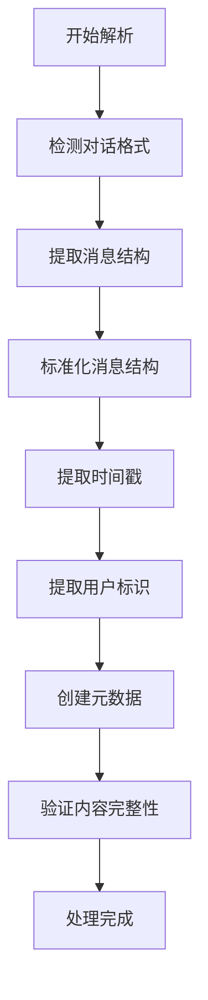

**图表来源**
- [note_importer.py:177-181](file://backend/services/note_importer.py#L177-L181)

### Markdown处理与渲染

系统提供了强大的Markdown处理能力，支持丰富的格式转换：

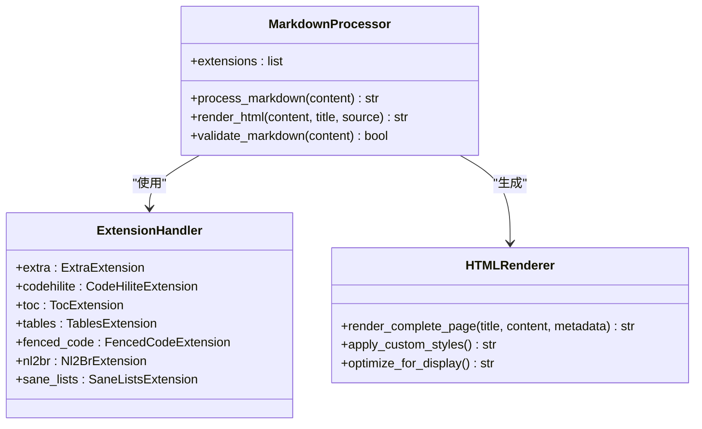

**图表来源**
- [note_importer.py:7-15](file://backend/services/note_importer.py#L7-L15)
- [note_importer.py:17-174](file://backend/services/note_importer.py#L17-L174)

#### 富文本转换

系统支持多种富文本格式的转换和优化：

| 转换类型 | 输入格式 | 输出格式 | 特殊处理 |
|----------|----------|----------|----------|
| 图片 | HTML img标签 | Markdown  | 自动下载并本地化 |
| 代码块 | HTML pre/code | Markdown ```code``` | 保持语言标识 |
| 表格 | HTML table | Markdown表格 | 自动格式化对齐 |
| 引用 | HTML blockquote | Markdown > | 保持层次结构 |

### 内容标准化技术

系统实现了全面的内容标准化机制，确保导入内容的一致性：

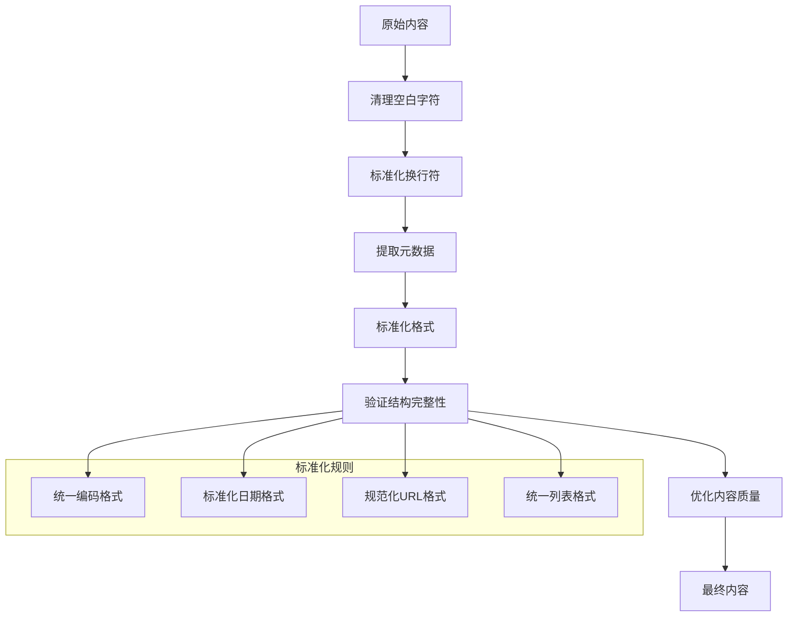

**图表来源**
- [note_importer.py:177-181](file://backend/services/note_importer.py#L177-L181)

### 时间戳处理机制

系统提供了灵活的时间戳处理能力，支持多种时间格式：

| 时间格式 | 解析规则 | 处理方式 |
|----------|----------|----------|
| ISO 8601 | 2026-04-30T12:00:00Z | 自动转换为本地时间 |
| RFC 2822 | Thu, 30 Apr 2026 12:00:00 GMT | 标准化为ISO格式 |
| 自定义格式 | YYYY年MM月DD日 HH:mm | 转换为标准日期对象 |
| 相对时间 | "5分钟前" | 计算相对时间戳 |

### 用户标识管理

系统实现了完善的用户标识管理系统：

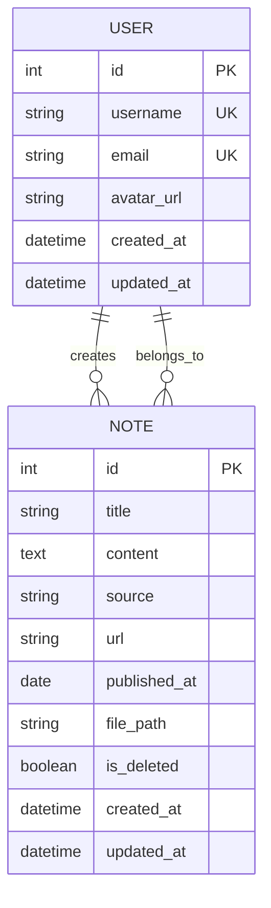

**图表来源**
- [paper.py:250-294](file://backend/models/paper.py#L250-L294)

## 依赖关系分析

系统采用了模块化的依赖设计，确保各组件之间的松耦合：

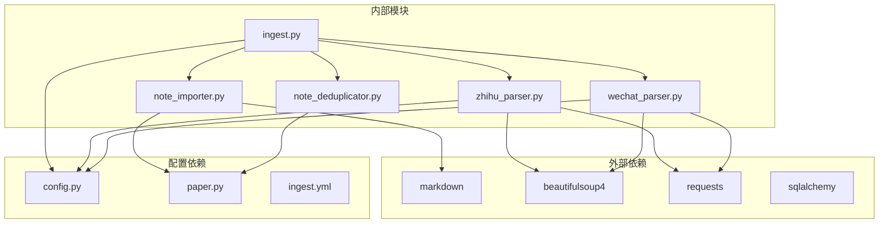

**图表来源**
- [ingest.py:1-1166](file://backend/api/ingest.py#L1-L1166)
- [note_importer.py:1-232](file://backend/services/note_importer.py#L1-L232)

**章节来源**
- [ingest.py:1-1166](file://backend/api/ingest.py#L1-L1166)
- [note_importer.py:1-232](file://backend/services/note_importer.py#L1-L232)

## 性能考虑

### 批量导入优化

系统针对大批量导入场景进行了专门优化：

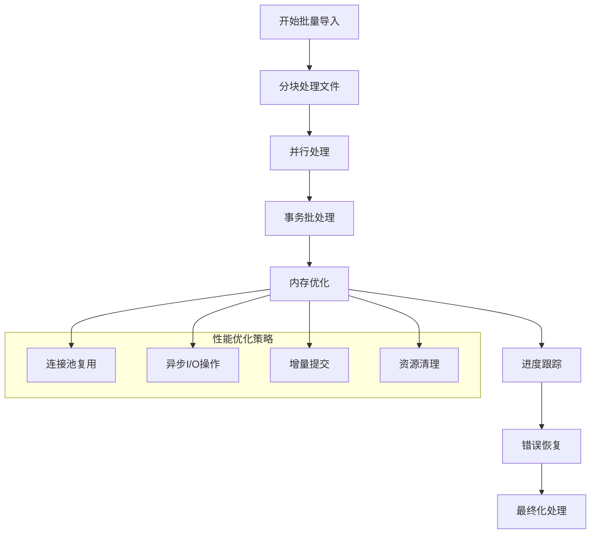

### 错误恢复策略

系统实现了多层次的错误恢复机制：

| 错误类型 | 恢复策略 | 处理方式 |
|----------|----------|----------|
| 网络超时 | 自动重试 | 最多重试3次，指数退避 |
| 数据库连接 | 连接池管理 | 自动重建连接 |
| 文件IO错误 | 临时文件备份 | 重试或回滚操作 |
| 内存不足 | 分块处理 | 释放中间结果，增量写入 |

## 故障排除指南

### 常见问题诊断

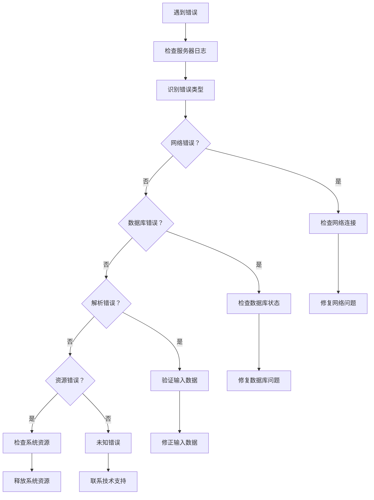

### 导入质量控制

系统提供了多层质量控制机制：

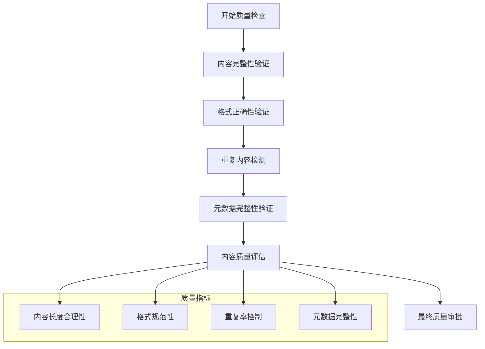

**章节来源**
- [ingest.py:261-348](file://backend/api/ingest.py#L261-L348)
- [note_deduplicator.py:88-129](file://backend/services/note_deduplicator.py#L88-L129)

## 结论

PaperHub 笔记导入服务是一个功能完整、架构清晰的系统，专门针对AI对话和Markdown内容的导入需求进行了深度优化。该服务的主要优势包括：

1. **多源支持**：支持多种AI平台和内容来源的统一导入
2. **智能去重**：多层次的去重机制确保数据质量
3. **格式标准化**：完整的Markdown处理和渲染能力
4. **批量优化**：针对大批量导入的性能优化
5. **错误恢复**：完善的错误处理和恢复机制

通过合理的架构设计和实现细节，该服务能够高效地处理各种复杂的导入场景，为用户提供稳定可靠的服务体验。

## 附录

### 导入示例

#### AI对话导入示例

```json
{
  "title": "AI对话分析",
  "source": "Claude 对话",
  "content": "# 对话摘要\n\n## 主要观点\n- 技术发展趋势\n- 应用场景分析\n- 实施建议",
  "created_at": "2026-04-30T12:00:00Z"
}
```

#### 知乎文章导入示例

```json
{
  "url": "https://zhuanlan.zhihu.com/p/123456789",
  "cookie": "your_zhihu_cookie_here"
}
```

### 配置指南

#### 基础配置

| 配置项 | 默认值 | 说明 |
|--------|--------|------|
| BASE_DIR | 当前目录 | 基础存储目录 |
| MAX_FILE_SIZE | 10MB | 文件大小限制 |
| ALLOWED_EXTENSIONS | pdf, html, htm | 允许的文件类型 |
| DUPLICATE_THRESHOLD | 0.8 | 去重相似度阈值 |

#### 高级配置

```python
# 自定义Markdown扩展
CUSTOM_MARKDOWN_EXTENSIONS = [
    'extra',
    'codehilite',
    'toc',
    'tables',
    'fenced_code',
    'nl2br',
    'sane_lists',
    'task_list'
]

# 自定义去重策略
CUSTOM_DUPE_STRATEGY = {
    'title_weight': 0.6,
    'content_weight': 0.3,
    'url_weight': 0.1
}
```