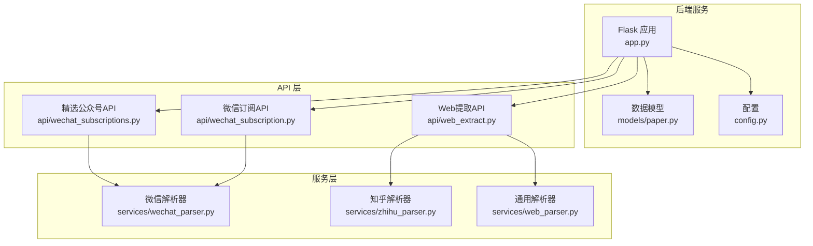
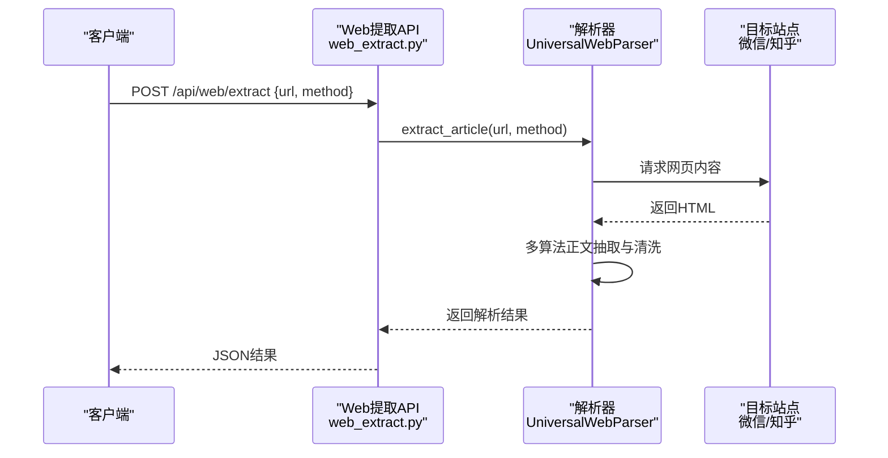
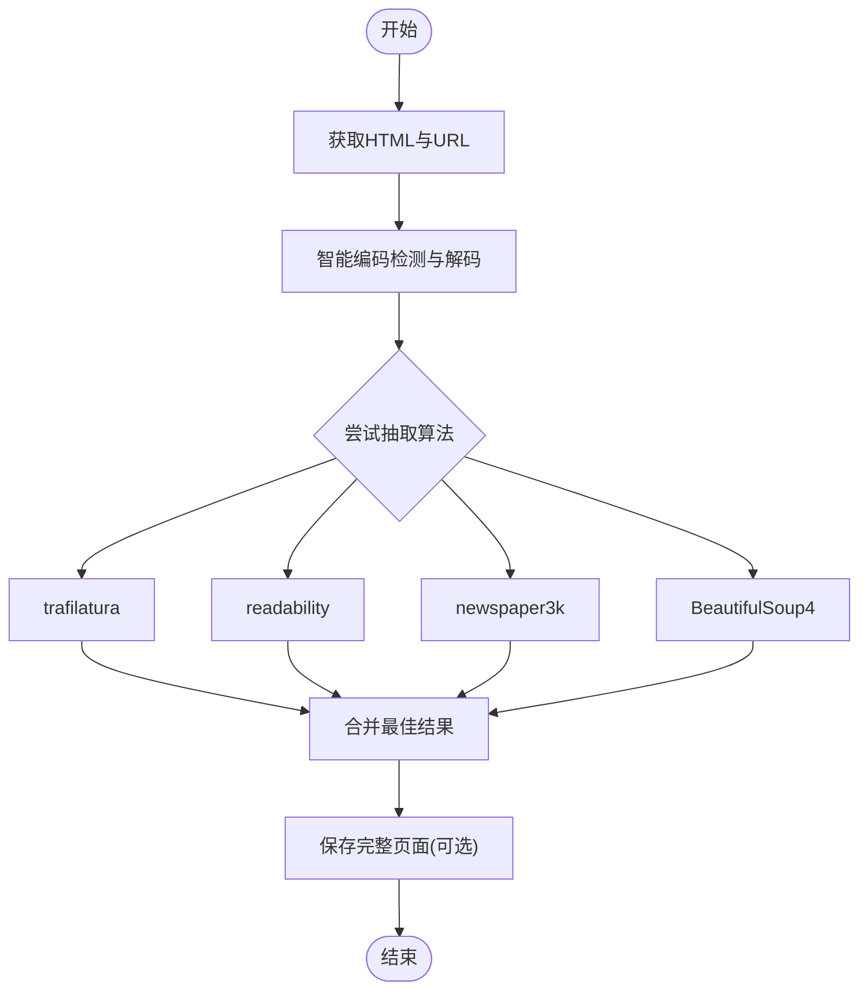
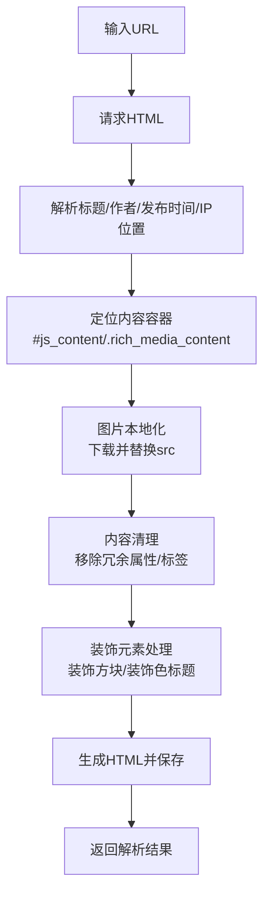
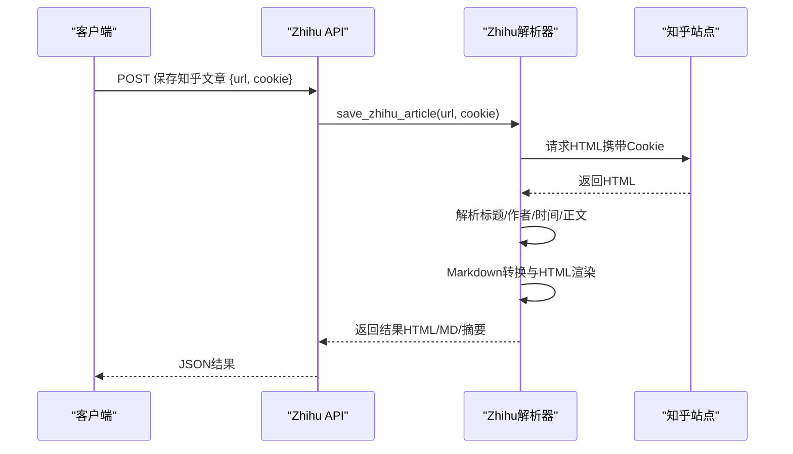
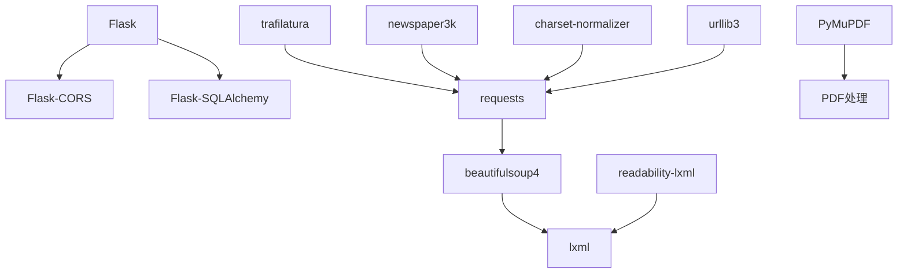

# 网页解析服务

<cite>
**本文档引用的文件**
- [backend/services/web_parser.py](file://backend/services/web_parser.py)
- [backend/services/wechat_parser.py](file://backend/services/wechat_parser.py)
- [backend/services/zhihu_parser.py](file://backend/services/zhihu_parser.py)
- [backend/api/web_extract.py](file://backend/api/web_extract.py)
- [backend/api/wechat_subscription.py](file://backend/api/wechat_subscription.py)
- [backend/api/wechat_subscriptions.py](file://backend/api/wechat_subscriptions.py)
- [backend/models/paper.py](file://backend/models/paper.py)
- [backend/config.py](file://backend/config.py)
- [backend/app.py](file://backend/app.py)
- [backend/requirements.txt](file://backend/requirements.txt)
- [README.md](file://README.md)
</cite>

## 目录
1. [简介](#简介)
2. [项目结构](#项目结构)
3. [核心组件](#核心组件)
4. [架构总览](#架构总览)
5. [详细组件分析](#详细组件分析)
6. [依赖分析](#依赖分析)
7. [性能考虑](#性能考虑)
8. [故障排查指南](#故障排查指南)
9. [结论](#结论)
10. [附录](#附录)

## 简介
本项目提供统一的网页解析服务，重点覆盖微信公众号与知乎专栏两大来源的内容提取与清洗，并提供通用网页正文提取能力。服务基于BeautifulSoup4进行DOM树遍历与内容提取，结合多种第三方库（trafilatura、readability、newspaper3k）实现鲁棒的正文抽取。针对微信与知乎的特殊结构，解析器实现了专门的样式剥离、装饰元素识别、图片本地化与反爬虫应对策略，确保最终输出高质量的HTML与Markdown内容。

## 项目结构
后端采用Flask框架，API路由集中在backend/api目录，业务逻辑集中在backend/services目录，数据模型位于backend/models，配置与启动入口在backend/config.py与backend/app.py。解析服务主要涉及以下模块：
- 通用网页解析器：UniversalWebParser
- 微信解析器：wechat_parser
- 知乎解析器：zhihu_parser
- Web提取API：web_extract
- 微信订阅API：wechat_subscription
- 精选公众号API：wechat_subscriptions
- 数据模型：paper（Article、Paper、Note等）

**图表来源**
- [backend/app.py:140-157](file://backend/app.py#L140-L157)
- [backend/api/web_extract.py:18-32](file://backend/api/web_extract.py#L18-L32)
- [backend/api/wechat_subscription.py:135-146](file://backend/api/wechat_subscription.py#L135-L146)
- [backend/api/wechat_subscriptions.py:48-69](file://backend/api/wechat_subscriptions.py#L48-L69)
- [backend/services/web_parser.py:14-271](file://backend/services/web_parser.py#L14-L271)
- [backend/services/wechat_parser.py:326-601](file://backend/services/wechat_parser.py#L326-L601)
- [backend/services/zhihu_parser.py:54-323](file://backend/services/zhihu_parser.py#L54-L323)

**章节来源**
- [backend/app.py:140-157](file://backend/app.py#L140-L157)
- [README.md:383-481](file://README.md#L383-L481)

## 核心组件
- 通用网页解析器 UniversalWebParser
  - 支持多算法正文抽取：trafilatura、readability、newspaper3k、BeautifulSoup4
  - 智能编码处理与兜底解码策略
  - 完整页面保存与HTML生成
- 微信解析器 wechat_parser
  - URL识别与文章ID提取
  - 标题、作者、发布时间、IP位置识别
  - 装饰方块与装饰色标题识别与对齐
  - 图片本地化与防盗链代理
  - 内容清理与样式保留策略
- 知乎解析器 zhihu_parser
  - Cookie认证与反爬虫应对
  - 标题、作者、发布时间解析
  - HTML渲染与Markdown导出
- Web提取API web_extract
  - 提供POST /api/web/extract与POST /api/web/save-page接口
- 微信订阅API wechat_subscription
  - 第三方API搜索公众号、获取文章列表
  - 图片代理与配置管理
- 精选公众号API wechat_subscriptions
  - 从TXT文件读取与备份文章列表

**章节来源**
- [backend/services/web_parser.py:14-271](file://backend/services/web_parser.py#L14-L271)
- [backend/services/wechat_parser.py:256-601](file://backend/services/wechat_parser.py#L256-L601)
- [backend/services/zhihu_parser.py:54-323](file://backend/services/zhihu_parser.py#L54-L323)
- [backend/api/web_extract.py:18-49](file://backend/api/web_extract.py#L18-L49)
- [backend/api/wechat_subscription.py:16-116](file://backend/api/wechat_subscription.py#L16-L116)
- [backend/api/wechat_subscriptions.py:48-195](file://backend/api/wechat_subscriptions.py#L48-L195)

## 架构总览
解析服务通过API接收URL，调用对应解析器进行内容提取与清洗，最终生成HTML与Markdown文件并保存到本地数据目录。微信与知乎解析器针对目标站点的特殊结构做了专门处理，包括装饰元素识别、图片本地化与反爬虫应对。

**图表来源**
- [backend/api/web_extract.py:18-32](file://backend/api/web_extract.py#L18-L32)
- [backend/services/web_parser.py:178-244](file://backend/services/web_parser.py#L178-L244)

**章节来源**
- [backend/api/web_extract.py:18-32](file://backend/api/web_extract.py#L18-L32)
- [backend/services/web_parser.py:178-244](file://backend/services/web_parser.py#L178-L244)

## 详细组件分析

### 通用网页解析器 UniversalWebParser
- 编码处理策略
  - 优先尝试UTF-8解码，避免chardet误判
  - fallback到apparent_encoding与多种中文编码尝试
  - 最终使用latin-1兜底，保证内容可读
- 正文抽取算法
  - trafilatura：结构化抽取，支持图片与链接
  - readability：基于Document的摘要抽取
  - newspaper3k：适合新闻类站点
  - BeautifulSoup4：通用DOM遍历与内容提取
- 内容清洗与生成
  - 清理脚本、样式、导航、页脚、页眉、iframe等非正文元素
  - 保留标题、段落、标题层级、列表、引用、预格式文本
  - 生成HTML与纯文本，支持“纯文本”标记
- 完整页面保存
  - 保存原始HTML到data/saved_web_pages目录
  - 文件名基于URL解析与安全字符替换

**图表来源**
- [backend/services/web_parser.py:22-91](file://backend/services/web_parser.py#L22-L91)
- [backend/services/web_parser.py:109-176](file://backend/services/web_parser.py#L109-L176)
- [backend/services/web_parser.py:178-244](file://backend/services/web_parser.py#L178-L244)
- [backend/services/web_parser.py:246-271](file://backend/services/web_parser.py#L246-L271)

**章节来源**
- [backend/services/web_parser.py:14-271](file://backend/services/web_parser.py#L14-L271)

### 微信解析器 wechat_parser
- URL识别与文章ID提取
  - 支持mp.weixin.qq.com/s?与/mp.weixin.qq.com/s/两种形式
  - 从查询参数或路径中提取__biz、mid、idx组合ID
- 标题与元信息提取
  - 优先从#activity-name、.rich_media_title等ID/class提取
  - 从<title>与.h1等元素回退提取
  - 发布时间解析：rich_media_meta文本匹配，若当日则尝试提取10位时间戳
  - IP位置信息清洗与去重
- 内容清理与样式保留
  - 递归清理微信特有属性（data-src、data-w、data-h等）
  - 保留文本对齐、字体样式、颜色、边框等有用样式
  - 移除广告、底部栏、空section、svg占位等冗余元素
  - 装饰方块识别与vertical-align统一为middle
  - 装饰色标题处理：内部p标签inline显示
- 图片本地化与防盗链
  - 代理下载图片，根据URL参数推断格式（png/gif/jpg/jpeg）
  - 保存到{wechat_id}_files目录，替换img.src为本地相对路径
  - 无法下载的图片直接移除
- 输出与保存
  - 生成带样式的HTML，包含标题、作者、发布时间、IP位置与正文
  - 保存到data/papers/wechat/{wechat_id}.html
  - 生成摘要与纯文本内容

**图表来源**
- [backend/services/wechat_parser.py:326-601](file://backend/services/wechat_parser.py#L326-L601)
- [backend/services/wechat_parser.py:604-800](file://backend/services/wechat_parser.py#L604-L800)

**章节来源**
- [backend/services/wechat_parser.py:256-278](file://backend/services/wechat_parser.py#L256-L278)
- [backend/services/wechat_parser.py:326-601](file://backend/services/wechat_parser.py#L326-L601)
- [backend/services/wechat_parser.py:604-800](file://backend/services/wechat_parser.py#L604-L800)

### 知乎解析器 zhihu_parser
- Cookie认证与请求
  - 使用Cookie维持登录状态，避免403反爬
  - 多次重试与错误处理
- 标题与作者解析
  - 从<h1>与AuthorInfo相关class提取
- 发布时间解析
  - 支持多种格式（YYYY-MM-DD、YYYY年MM月DD日等）
- 正文提取与渲染
  - 从RichContent-inner/AnswerRichText等class定位正文
  - 使用MarkdownConverter将HTML转为Markdown
  - 渲染为精美HTML，包含样式与结构
- 保存与摘要
  - 生成HTML与MD文件，保存到data/papers/zhihu
  - 生成摘要与文章ID

**图表来源**
- [backend/api/web_extract.py:18-32](file://backend/api/web_extract.py#L18-L32)
- [backend/services/zhihu_parser.py:279-323](file://backend/services/zhihu_parser.py#L279-L323)

**章节来源**
- [backend/services/zhihu_parser.py:54-323](file://backend/services/zhihu_parser.py#L54-L323)

### Web提取API
- /api/web/extract
  - POST：接收url与可选method，返回解析结果（标题、正文、HTML、摘要、方法使用情况等）
- /api/web/save-page
  - POST：保存完整网页到data/saved_web_pages
- /api/web/test
  - GET：返回API可用性信息与端点说明

**章节来源**
- [backend/api/web_extract.py:18-61](file://backend/api/web_extract.py#L18-L61)

### 微信订阅API
- 搜索公众号：/api/wechat/search_account
- 获取文章列表：/api/wechat/subscriptions/check
- 图片代理：/api/wechat/proxy_image
- 配置管理：/api/wechat/config（GET/POST）
- 订阅管理：/api/wechat/subscriptions（GET/POST/DELETE）

**章节来源**
- [backend/api/wechat_subscription.py:16-116](file://backend/api/wechat_subscription.py#L16-L116)
- [backend/api/wechat_subscription.py:148-180](file://backend/api/wechat_subscription.py#L148-L180)
- [backend/api/wechat_subscription.py:231-271](file://backend/api/wechat_subscription.py#L231-L271)
- [backend/api/wechat_subscription.py:135-146](file://backend/api/wechat_subscription.py#L135-L146)

### 精选公众号API
- 列表：/api/wechat-subscriptions/list
- 文章：/api/wechat-subscriptions/articles
- 备份：/api/wechat-subscriptions/backup

**章节来源**
- [backend/api/wechat_subscriptions.py:48-195](file://backend/api/wechat_subscriptions.py#L48-L195)

## 依赖分析
- Flask与扩展
  - Flask、Flask-CORS、Flask-SQLAlchemy
- 网络与解析
  - requests、beautifulsoup4、lxml
- 正文抽取
  - trafilatura、readability-lxml、newspaper3k
- PDF处理
  - PyMuPDF（用于论文PDF处理）
- 字符编码
  - charset-normalizer、urllib3

**图表来源**
- [backend/requirements.txt:1-15](file://backend/requirements.txt#L1-L15)

**章节来源**
- [backend/requirements.txt:1-15](file://backend/requirements.txt#L1-L15)
- [backend/requirements-py11.txt:1-18](file://backend/requirements-py11.txt#L1-L18)

## 性能考虑
- 编码解码策略
  - 优先UTF-8，避免不必要的编码检测开销
  - 多种编码尝试与fallback，确保稳定性
- 正文抽取算法选择
  - 自动轮询多种算法，选择文本长度最优结果
  - 对于通用站点，BeautifulSoup4具备良好泛化能力
- 图片处理
  - 本地化图片时按URL格式推断，减少额外请求
  - 代理下载时设置合理超时，避免阻塞
- 数据库与会话
  - 全局单例Engine与ScopedSession，减少连接开销
  - 请求结束清理会话，避免资源泄漏

[本节为通用性能讨论，无需具体文件分析]

## 故障排查指南
- 通用网页提取失败
  - 检查URL是否可访问，网络是否稳定
  - 查看日志中编码解码与算法执行情况
  - 尝试指定method参数强制使用某算法
- 微信文章解析异常
  - 确认URL为mp.weixin.qq.com/s?或/mp.weixin.qq.com/s/形式
  - 检查图片下载是否成功，必要时手动代理下载
  - 若出现装饰元素对齐问题，检查clean_content处理逻辑
- 知乎文章解析失败
  - 确认Cookie有效，避免403错误
  - 检查正文容器class是否变化，必要时更新解析规则
- API错误
  - 查看后端异常处理器返回的错误类型与消息
  - 检查CORS与跨域配置

**章节来源**
- [backend/api/web_extract.py:27-32](file://backend/api/web_extract.py#L27-L32)
- [backend/services/zhihu_parser.py:66-79](file://backend/services/zhihu_parser.py#L66-L79)
- [backend/app.py:70-89](file://backend/app.py#L70-L89)

## 结论
本网页解析服务通过多算法正文抽取与针对微信、知乎的专项处理，实现了高可靠的内容提取与清洗。通用解析器提供稳健的DOM遍历与内容提取能力，微信解析器专注于装饰元素与图片本地化，知乎解析器通过Cookie认证突破反爬限制。配合完善的API与数据模型，服务能够稳定地将网页内容转化为高质量的HTML与Markdown，满足知识管理系统的入库需求。

[本节为总结性内容，无需具体文件分析]

## 附录

### 解析规则定制与扩展方法
- 扩展通用解析器
  - 在extract_article中增加新的算法分支
  - 在extract_with_*中实现自定义抽取逻辑
  - 调整编码解码策略与HTML生成模板
- 微信解析器扩展
  - 新增装饰元素识别规则（如新的装饰方块样式）
  - 调整属性清理白名单与样式保留策略
  - 扩展图片格式识别与本地化策略
- 知乎解析器扩展
  - 更新正文容器class匹配规则
  - 扩展Markdown转换器以支持更多标签
  - 增强Cookie认证与错误处理

[本节为概念性内容，无需具体文件分析]