# Vue 3 应用架构

<cite>
**本文档引用的文件**
- [index.html](file://frontend/index.html)
- [ARCHITECTURE_AUDIT_V3.md](file://frontend/ARCHITECTURE_AUDIT_V3.md)
- [README.md](file://frontend/README.md)
- [filterUtils.js](file://frontend/src/modules/filterUtils.js)
- [sortUtils.js](file://frontend/src/modules/sortUtils.js)
- [ingestModule.js](file://frontend/src/modules/ingestModule.js)
- [fileUploadModule.js](file://frontend/src/modules/fileUploadModule.js)
- [style.css](file://frontend/src/css/style.css)
- [architecture.spec.md](file://specs/architecture.spec.md)
- [naming.spec.md](file://specs/naming.spec.md)
- [paper_list.yml](file://specs/frontend/pages/paper_list.yml)
- [note_editor.yml](file://specs/frontend/pages/note_editor.yml)
- [papers.yml](file://specs/backend/api/papers.yml)
- [notes.yml](file://specs/backend/api/notes.yml)
</cite>

## 目录
1. [简介](#简介)
2. [项目结构](#项目结构)
3. [核心组件](#核心组件)
4. [架构概览](#架构概览)
5. [详细组件分析](#详细组件分析)
6. [依赖关系分析](#依赖关系分析)
7. [性能考虑](#性能考虑)
8. [故障排除指南](#故障排除指南)
9. [结论](#结论)
10. [附录](#附录)

## 简介

PaperHub 是一个基于 Vue 3 的单页应用，采用混合式架构模式构建。该应用实现了论文库、文章库和笔记库的统一管理，通过 Element Plus UI 框架提供现代化的用户界面，并集成了 marked.js 进行 Markdown 渲染。

应用的核心特点包括：
- 混合式架构设计，结合单体应用的便利性和模块化的优势
- 完全同构的三库架构（论文库、文章库、笔记库）
- 基于响应式的状态管理模式
- 统一的工具库复用机制
- 完善的本地存储持久化策略

## 项目结构

PaperHub 采用清晰的前后端分离架构，前端采用单页应用的 CDN 版本部署：

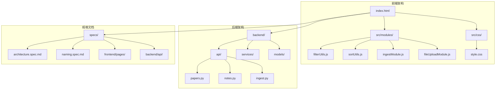

**图表来源**
- [architecture.spec.md:6-19](file://specs/architecture.spec.md#L6-L19)
- [index.html:1-20](file://frontend/index.html#L1-L20)

**章节来源**
- [architecture.spec.md:1-83](file://specs/architecture.spec.md#L1-L83)
- [README.md:1-4](file://frontend/README.md#L1-L4)

## 核心组件

### 状态管理层

应用采用 Vue 3 的响应式系统，实现了完全同构的状态管理策略：

| 组件类别 | 实现方式 | 特点 |
|---------|----------|------|
| **筛选状态** | `ref()` 和 `computed` | 三库完全一致的状态结构 |
| **排序状态** | `localStorage` 持久化 | 刷新页面保持排序偏好 |
| **标签状态** | `visibleTags` 计算属性 | 仅显示当前筛选结果中的标签 |
| **搜索状态** | `searchKeyword` | 支持关键词搜索和高亮 |

### 工具库模块

应用实现了高度复用的工具库模块：

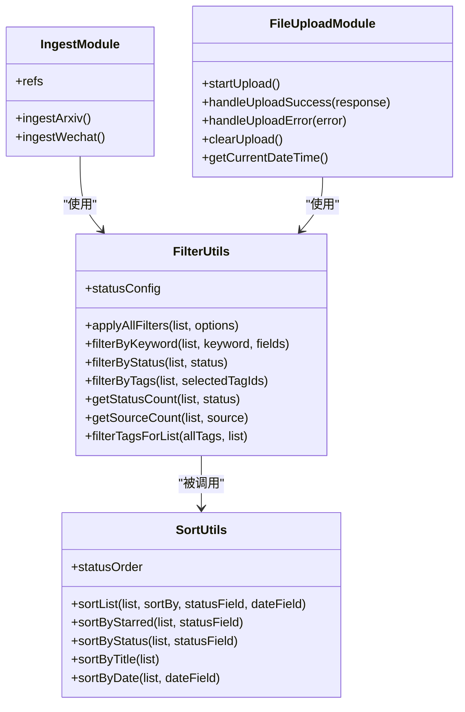

**图表来源**
- [filterUtils.js:2-107](file://frontend/src/modules/filterUtils.js#L2-L107)
- [sortUtils.js:2-53](file://frontend/src/modules/sortUtils.js#L2-L53)
- [ingestModule.js:4-48](file://frontend/src/modules/ingestModule.js#L4-L48)
- [fileUploadModule.js:4-110](file://frontend/src/modules/fileUploadModule.js#L4-L110)

**章节来源**
- [filterUtils.js:1-107](file://frontend/src/modules/filterUtils.js#L1-L107)
- [sortUtils.js:1-53](file://frontend/src/modules/sortUtils.js#L1-L53)

## 架构概览

### 混合式架构模式

PaperHub 采用了创新的混合式架构，结合了单体应用和模块化的优点：

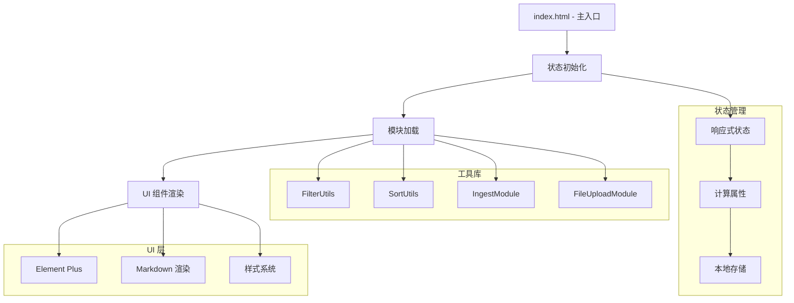

**图表来源**
- [ARCHITECTURE_AUDIT_V3.md:13-34](file://frontend/ARCHITECTURE_AUDIT_V3.md#L13-L34)
- [index.html:15-80](file://frontend/index.html#L15-L80)

### 三库同构设计

应用实现了论文库、文章库和笔记库的完全同构设计：

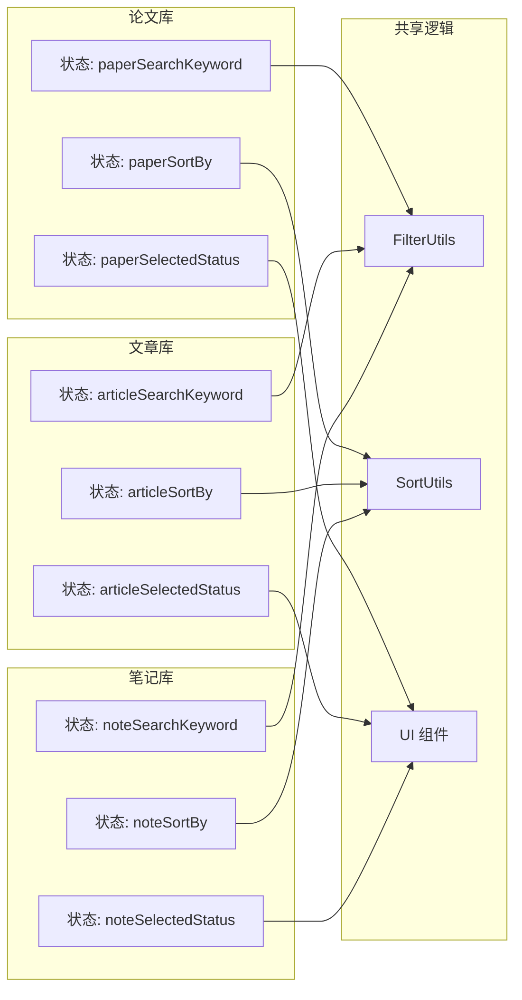

**图表来源**
- [ARCHITECTURE_AUDIT_V3.md:52-66](file://frontend/ARCHITECTURE_AUDIT_V3.md#L52-L66)

**章节来源**
- [ARCHITECTURE_AUDIT_V3.md:11-269](file://frontend/ARCHITECTURE_AUDIT_V3.md#L11-L269)

## 详细组件分析

### 搜索系统组件

搜索系统是应用的核心组件之一，实现了智能的搜索建议和历史记录功能：

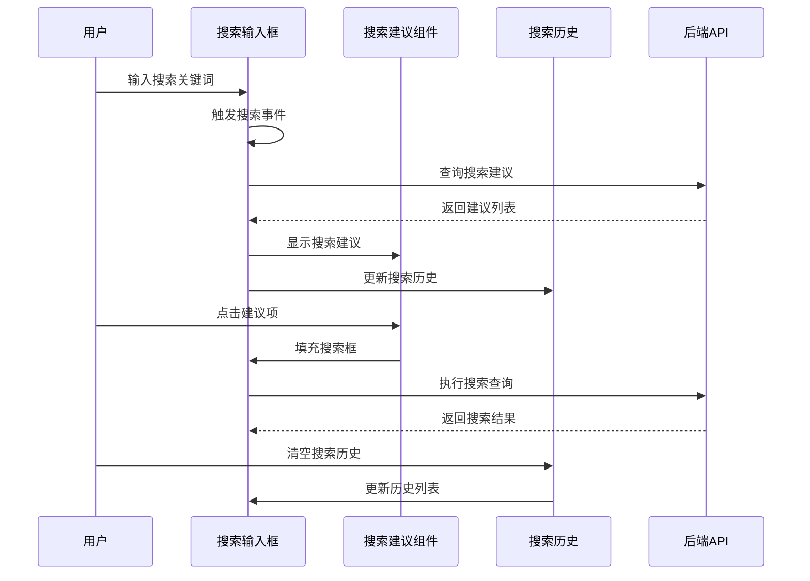

**图表来源**
- [index.html:22-74](file://frontend/index.html#L22-L74)

### 状态管理系统

应用的状态管理采用了 Vue 3 的响应式系统，实现了完全的响应式更新：

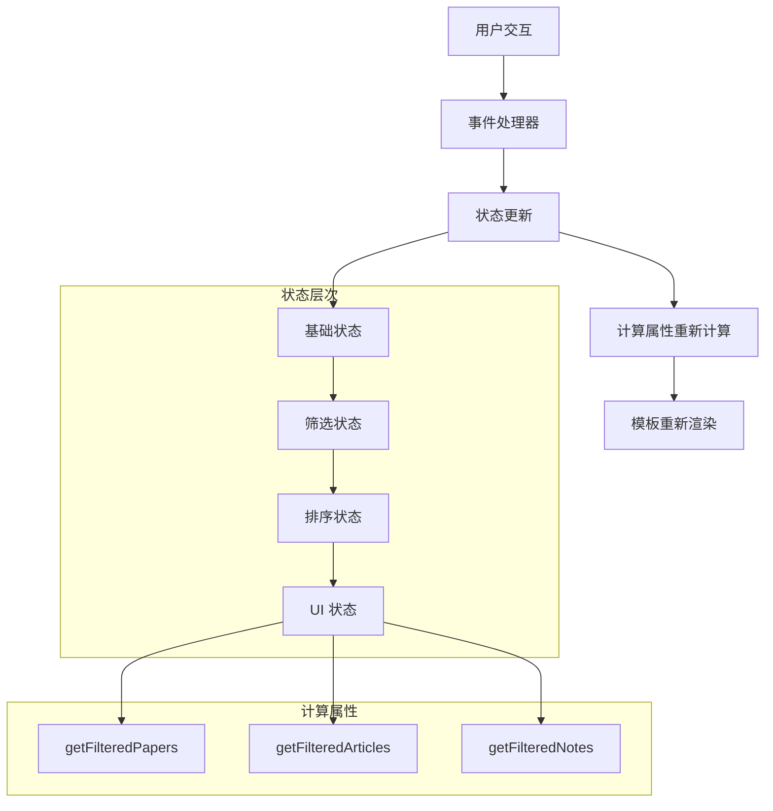

**图表来源**
- [index.html:412-545](file://frontend/index.html#L412-L545)

### 元素组件通信

应用中的元素组件通过 props 和事件进行通信：

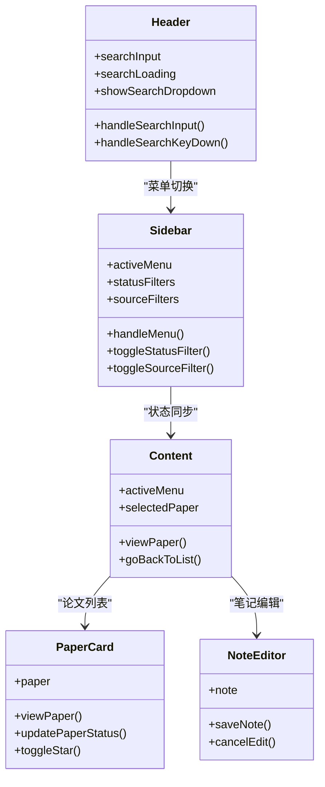

**图表来源**
- [index.html:18-407](file://frontend/index.html#L18-L407)

**章节来源**
- [index.html:1-6825](file://frontend/index.html#L1-L6825)

### Markdown 渲染组件

应用集成了 marked.js 进行 Markdown 渲染，提供了实时的预览功能：

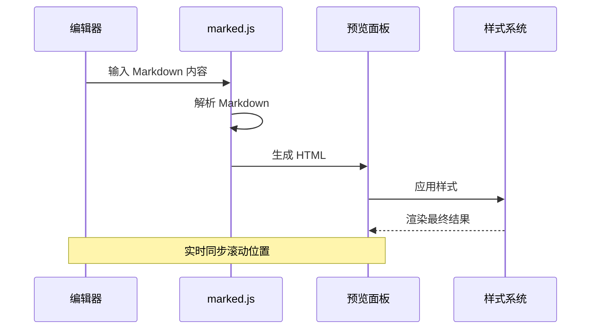

**图表来源**
- [index.html:628-696](file://frontend/index.html#L628-L696)

**章节来源**
- [paper_list.yml:8-11](file://specs/frontend/pages/paper_list.yml#L8-L11)

## 依赖关系分析

### 前端依赖关系

应用的前端依赖关系清晰明确，遵循了模块化的设计原则：

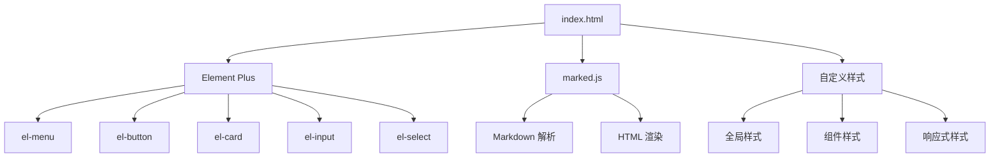

**图表来源**
- [index.html:7-12](file://frontend/index.html#L7-L12)

### 后端 API 依赖

应用的后端 API 设计遵循了 RESTful 架构原则：

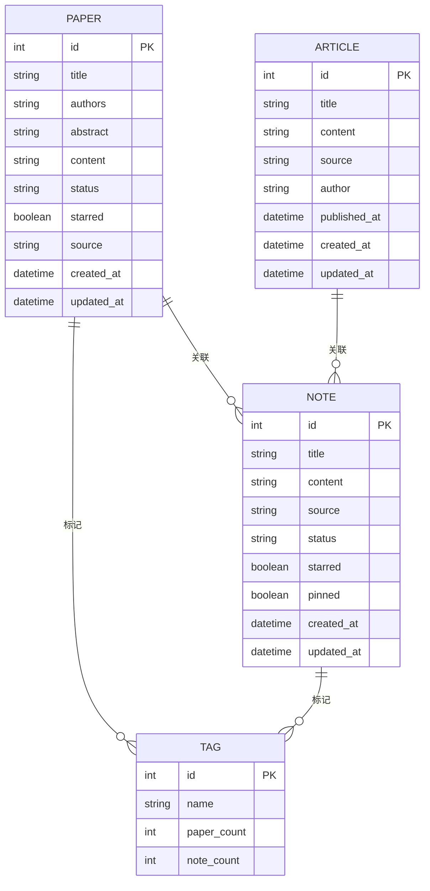

**图表来源**
- [papers.yml:89-132](file://specs/backend/api/papers.yml#L89-L132)
- [notes.yml:113-164](file://specs/backend/api/notes.yml#L113-L164)

**章节来源**
- [papers.yml:1-404](file://specs/backend/api/papers.yml#L1-L404)
- [notes.yml:1-378](file://specs/backend/api/notes.yml#L1-L378)

## 性能考虑

### 响应式优化

应用采用了多种响应式优化策略：

1. **计算属性缓存**：使用 `computed` 属性缓存复杂的筛选和排序结果
2. **懒加载模块**：通过动态导入实现模块的按需加载
3. **虚拟滚动**：对于大量数据的列表采用虚拟滚动技术
4. **防抖处理**：搜索输入采用防抖机制减少 API 调用频率

### 状态持久化

应用实现了多层次的状态持久化：

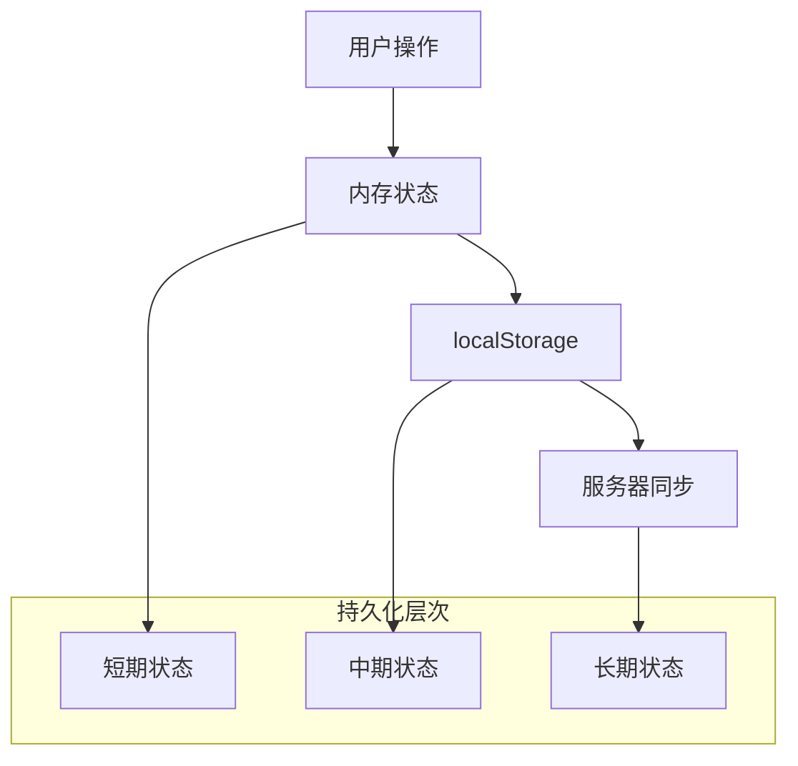

**图表来源**
- [ARCHITECTURE_AUDIT_V3.md:113-122](file://frontend/ARCHITECTURE_AUDIT_V3.md#L113-L122)

### 性能监控

应用具备完善的性能监控机制：

- **加载时间监控**：跟踪关键页面的加载时间
- **API 响应时间**：监控后端 API 的响应性能
- **内存使用情况**：监控应用的内存占用情况
- **渲染性能**：监控 Vue 组件的渲染性能

## 故障排除指南

### 常见问题诊断

| 问题类型 | 症状描述 | 诊断方法 | 解决方案 |
|---------|----------|----------|----------|
| **搜索无结果** | 搜索框显示空状态 | 检查网络连接和 API 状态 | 清除浏览器缓存，重试搜索 |
| **筛选失效** | 点击筛选器无反应 | 检查控制台错误信息 | 刷新页面，检查 JavaScript 错误 |
| **状态不同步** | 侧边栏状态与内容不一致 | 检查 Vue 组件状态更新 | 重新加载页面，检查组件通信 |
| **Markdown 渲染异常** | 预览面板显示原始 Markdown | 检查 marked.js 版本 | 更新到最新版本，检查样式冲突 |

### 错误处理机制

应用实现了完善的错误处理机制：

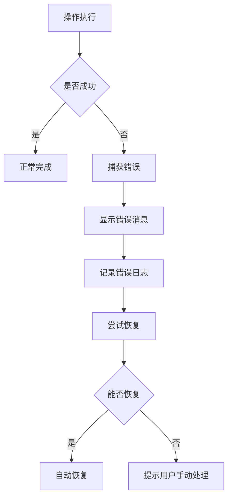

**图表来源**
- [fileUploadModule.js:51-54](file://frontend/src/modules/fileUploadModule.js#L51-L54)

**章节来源**
- [fileUploadModule.js:1-110](file://frontend/src/modules/fileUploadModule.js#L1-L110)

## 结论

PaperHub 的 Vue 3 应用架构展现了现代前端开发的最佳实践。通过采用混合式架构模式，应用在保持开发效率的同时实现了良好的可维护性和扩展性。

### 主要成就

1. **架构同构性**：三库架构实现了完全的逻辑复用和 UI 统一
2. **响应式设计**：充分利用 Vue 3 的响应式系统，实现高效的 UI 更新
3. **模块化组织**：通过工具库模块实现了代码的高度复用
4. **用户体验**：提供流畅的交互体验和完善的错误处理机制

### 改进建议

1. **命名规范化**：统一各库的状态命名前缀
2. **模块化演进**：继续推进渐进式模块化改造
3. **文档完善**：加强架构文档和技术规范的建设
4. **性能优化**：进一步优化大型数据集的渲染性能

## 附录

### 开发规范

应用遵循严格的开发规范：

- **文件命名**：全部采用 snake_case 命名规则
- **代码注释**：每个函数和复杂逻辑都配有详细注释
- **错误处理**：统一的错误处理和用户反馈机制
- **测试覆盖**：关键功能都有相应的测试用例

### 部署指南

应用采用 CDN 部署模式，具有以下优势：

- **快速加载**：静态资源通过 CDN 分发，加载速度快
- **缓存友好**：合理的缓存策略提升用户体验
- **易于维护**：集中式的资源管理便于维护
- **成本效益**：利用第三方 CDN 降低带宽成本