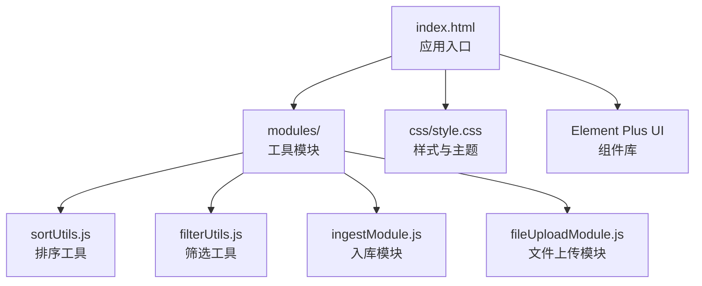
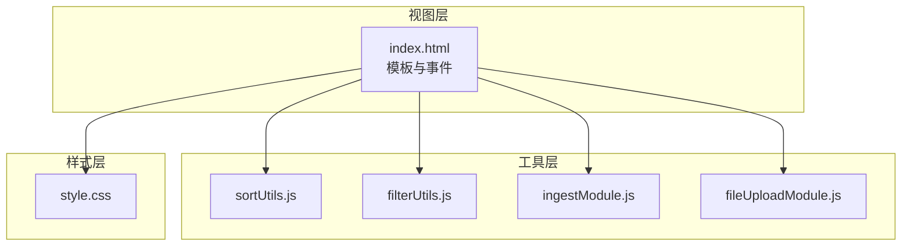
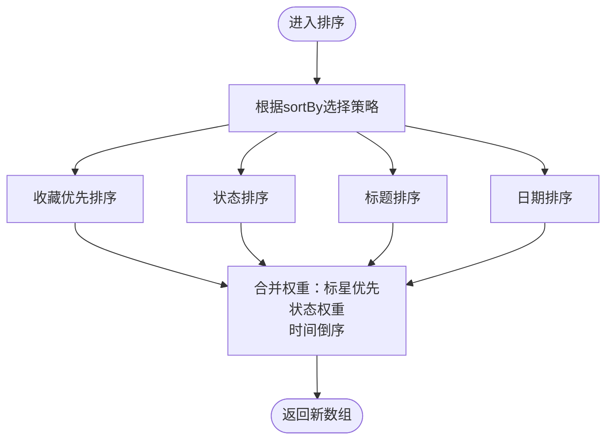
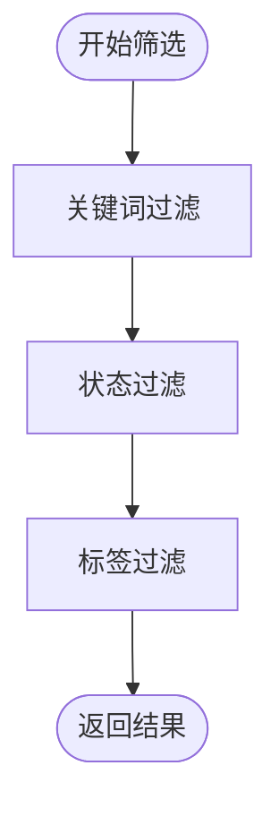
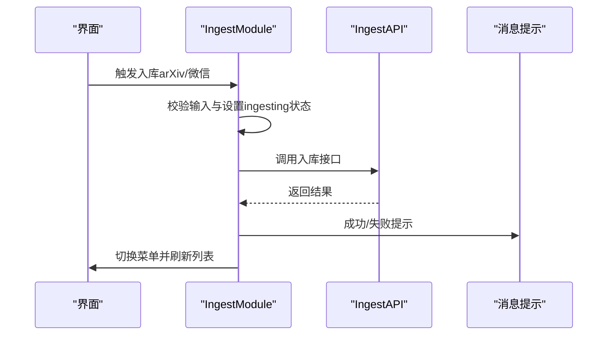
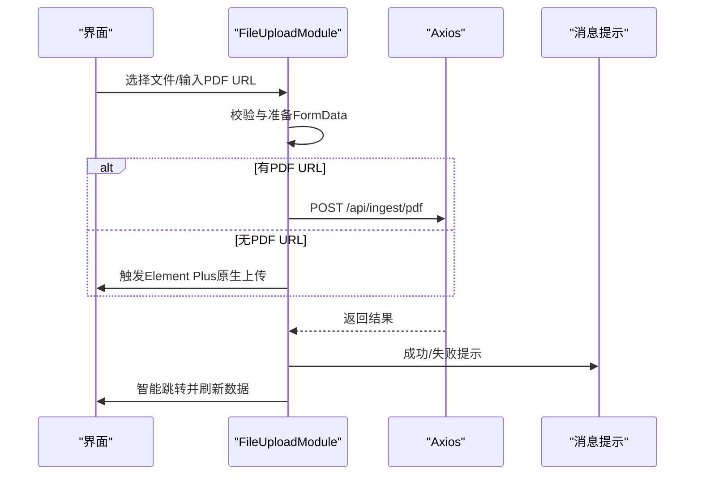
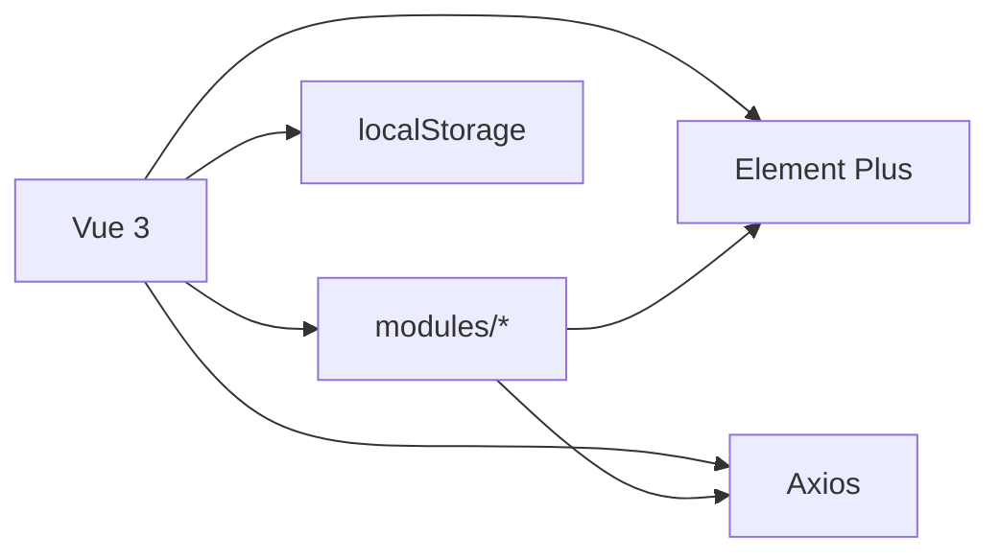

# 前端架构设计

<cite>
**本文档引用的文件**
- [index.html](file://frontend/index.html)
- [style.css](file://frontend/src/css/style.css)
- [fileUploadModule.js](file://frontend/src/modules/fileUploadModule.js)
- [filterUtils.js](file://frontend/src/modules/filterUtils.js)
- [ingestModule.js](file://frontend/src/modules/ingestModule.js)
- [sortUtils.js](file://frontend/src/modules/sortUtils.js)
- [fileUploadModule.yml](file://specs/frontend/modules/fileUploadModule.yml)
- [filterUtils.yml](file://specs/frontend/modules/filterUtils.yml)
- [ingestModule.yml](file://specs/frontend/modules/ingestModule.yml)
- [sortUtils.yml](file://specs/frontend/modules/sortUtils.yml)
- [前端模块化重构里程碑.md](file://docs/前端模块化重构里程碑.md)
- [排序系统开发与避坑指南.md](file://docs/排序系统开发与避坑指南.md)
</cite>

## 目录
1. [引言](#引言)
2. [项目结构](#项目结构)
3. [核心组件](#核心组件)
4. [架构总览](#架构总览)
5. [详细组件分析](#详细组件分析)
6. [依赖关系分析](#依赖关系分析)
7. [性能考量](#性能考量)
8. [故障排查指南](#故障排查指南)
9. [结论](#结论)
10. [附录](#附录)

## 引言
本文件面向PaperHub前端应用，系统性阐述基于Vue 3的单页应用架构设计、组件设计与状态管理策略，并深入解析模块化工具（排序、筛选、入库、文件上传）的设计思路与实现原理。文档同时涵盖CSS样式体系、主题与响应式布局策略，以及组件间通信机制、路由设计与前端性能优化策略，最后给出开发规范、代码组织结构与最佳实践。

## 项目结构
PaperHub前端采用模块化重构后的清晰目录结构：
- 前端入口：index.html（承载Vue 3应用与Element Plus UI）
- 样式层：frontend/src/css/style.css（全局样式、组件样式、响应式布局）
- 模块层：frontend/src/modules（排序、筛选、入库、文件上传等工具模块）
- 规范与文档：specs/frontend/modules（模块行为规范YAML）、docs（重构里程碑与避坑指南）

图表来源
- [index.html](file://frontend/index.html)
- [style.css](file://frontend/src/css/style.css)
- [sortUtils.js](file://frontend/src/modules/sortUtils.js)
- [filterUtils.js](file://frontend/src/modules/filterUtils.js)
- [ingestModule.js](file://frontend/src/modules/ingestModule.js)
- [fileUploadModule.js](file://frontend/src/modules/fileUploadModule.js)

章节来源
- [前端模块化重构里程碑.md](file://docs/前端模块化重构里程碑.md)
- [index.html](file://frontend/index.html)

## 核心组件
- 应用主容器与菜单：index.html中定义的header、sidebar、content区域，配合Element Plus的el-menu实现主菜单导航与内容区渲染。
- 列表组件：论文库、文章库、笔记库的卡片列表，支持状态标签、来源标签、标签管理、批量操作等。
- 搜索与筛选：统一的搜索栏与侧边栏筛选器，支持关键词、状态、来源、标签、日期多维筛选。
- 入库与上传：arXiv入库、微信公众号入库、文件上传（PDF/HTML）等入口。
- 排序与状态：统一的排序策略与状态管理，支持收藏优先、状态排序、标题排序、日期排序等。

章节来源
- [index.html](file://frontend/index.html)
- [style.css](file://frontend/src/css/style.css)

## 架构总览
PaperHub前端采用“视图模板 + 工具模块 + 样式层”的分层架构：
- 视图模板：index.html以Vue 3模板语法驱动，绑定响应式数据与事件。
- 工具模块：modules目录下的纯函数工具模块，职责单一、可复用、可测试。
- 样式层：style.css集中管理全局样式、主题色板、组件样式与响应式断点。
- 状态管理：通过Vue 3组合式API（ref/computed/watch）与localStorage实现轻量状态持久化。

图表来源
- [index.html](file://frontend/index.html)
- [sortUtils.js](file://frontend/src/modules/sortUtils.js)
- [filterUtils.js](file://frontend/src/modules/filterUtils.js)
- [ingestModule.js](file://frontend/src/modules/ingestModule.js)
- [fileUploadModule.js](file://frontend/src/modules/fileUploadModule.js)
- [style.css](file://frontend/src/css/style.css)

## 详细组件分析

### 排序工具模块（SortUtils）
- 设计要点
  - 提供多种排序策略：收藏优先、状态排序、标题排序、发布/创建日期排序。
  - 所有排序函数返回新数组，不修改原数组，确保不可变性与可预测性。
  - 阅读状态权重使用空值合并运算符（??）避免0权重被误判为falsy。
- 数据流
  - 输入：原始列表与排序键（created_at/published_at/title/status/starred）。
  - 输出：按规则排序后的数组副本。
- 性能特性
  - 前端纯内存排序，O(n log n)，适合中等规模数据集。
  - 支持localStorage持久化排序偏好，提升用户体验。

图表来源
- [sortUtils.js](file://frontend/src/modules/sortUtils.js)
- [sortUtils.yml](file://specs/frontend/modules/sortUtils.yml)

章节来源
- [sortUtils.js](file://frontend/src/modules/sortUtils.js)
- [sortUtils.yml](file://specs/frontend/modules/sortUtils.yml)
- [排序系统开发与避坑指南.md](file://docs/排序系统开发与避坑指南.md)

### 筛选工具模块（FilterUtils）
- 设计要点
  - 支持关键词、状态、来源、标签、笔记类型等多维筛选。
  - toggle系列函数实现筛选器的开合与清除逻辑。
  - applyAllFilters按关键词→状态→标签顺序串联过滤，保证一致性。
- 数据流
  - 输入：原始列表与筛选配置对象（keyword、selectedStatus、selectedTagIds等）。
  - 输出：经过三层筛选后的结果列表。
- 性能特性
  - 过滤过程为线性扫描，适合中等规模数据；复杂筛选建议结合索引或服务端过滤。

图表来源
- [filterUtils.js](file://frontend/src/modules/filterUtils.js)
- [filterUtils.yml](file://specs/frontend/modules/filterUtils.yml)

章节来源
- [filterUtils.js](file://frontend/src/modules/filterUtils.js)
- [filterUtils.yml](file://specs/frontend/modules/filterUtils.yml)

### 入库模块（IngestModule）
- 设计要点
  - 封装arXiv与微信公众号入库流程，统一错误处理与成功反馈。
  - 成功后自动切换到相应tab并刷新数据，保证用户即时可见新内容。
  - 通过工厂函数注入依赖（Vue、ElementPlus、IngestAPI、refs），保持模块解耦。
- 数据流
  - 输入：arxivInput/wechatUrl等输入值与refs状态。
  - 输出：调用IngestAPI发起请求，更新UI状态与菜单。

图表来源
- [ingestModule.js](file://frontend/src/modules/ingestModule.js)
- [ingestModule.yml](file://specs/frontend/modules/ingestModule.yml)

章节来源
- [ingestModule.js](file://frontend/src/modules/ingestModule.js)
- [ingestModule.yml](file://specs/frontend/modules/ingestModule.yml)

### 文件上传模块（FileUploadModule）
- 设计要点
  - 支持手动FormData上传与Element Plus原生上传两种模式。
  - 上传成功后根据返回内容智能跳转到对应tab并刷新数据。
  - 通过refs注入外部状态，模块内部不持有响应式变量，降低耦合。
- 数据流
  - 输入：fileList、pdfSourceUrl、refs状态。
  - 输出：上传请求、消息提示、菜单切换与数据刷新。

图表来源
- [fileUploadModule.js](file://frontend/src/modules/fileUploadModule.js)
- [fileUploadModule.yml](file://specs/frontend/modules/fileUploadModule.yml)

章节来源
- [fileUploadModule.js](file://frontend/src/modules/fileUploadModule.js)
- [fileUploadModule.yml](file://specs/frontend/modules/fileUploadModule.yml)

### 组件间通信机制
- 响应式数据绑定：index.html中通过Vue 3模板语法绑定ref/computed数据，实现视图与状态的双向同步。
- 事件驱动：通过@select/@click/@change等事件处理器触发模块方法，实现UI与业务逻辑解耦。
- 依赖注入：各模块通过工厂函数注入Vue、ElementPlus、axios、refs等依赖，避免全局污染。

章节来源
- [index.html](file://frontend/index.html)

### 路由设计
- 单页应用：PaperHub采用SPA模式，通过Element Plus菜单切换主内容区，无需传统路由。
- 菜单驱动：activeMenu控制当前展示的库（论文/文章/笔记/入库），配合各库的数据加载与刷新。

章节来源
- [index.html](file://frontend/index.html)

## 依赖关系分析
- 模块内聚与解耦
  - SortUtils/FilterUtils/IngestModule/FileUploadModule均为纯函数与工厂函数，职责单一，便于测试与复用。
- 外部依赖
  - Element Plus：提供菜单、标签、输入、选择器、消息提示等UI组件。
  - Axios：用于HTTP请求（文件上传与入库）。
  - Vue 3：响应式系统与模板语法。
- 状态与存储
  - localStorage：持久化排序偏好与筛选条件。
  - refs：集中管理UI状态，模块通过外部注入访问。

图表来源
- [index.html](file://frontend/index.html)
- [sortUtils.js](file://frontend/src/modules/sortUtils.js)
- [filterUtils.js](file://frontend/src/modules/filterUtils.js)
- [ingestModule.js](file://frontend/src/modules/ingestModule.js)
- [fileUploadModule.js](file://frontend/src/modules/fileUploadModule.js)

章节来源
- [index.html](file://frontend/index.html)

## 性能考量
- 前端排序与筛选
  - 使用纯函数与不可变数组，避免副作用；排序与筛选在前端进行，减少网络往返。
- 本地存储
  - localStorage持久化排序偏好与筛选状态，减少重复计算与请求。
- 图片与资源
  - 样式中使用渐变背景与阴影，注意在低端设备上的渲染开销；建议对大图懒加载与压缩。
- 交互反馈
  - Element Plus的消息提示与加载状态，提升用户感知速度。

[本节为通用性能指导，不直接分析具体文件]

## 故障排查指南
- 排序异常
  - 症状：待读（pending）排序位置异常。
  - 原因：状态权重为0时使用||导致被误判为falsy。
  - 解决：改用空值合并运算符??，确保权重0不被忽略。
- 筛选无效
  - 症状：关键词/标签筛选不生效。
  - 排查：确认applyAllFilters的执行顺序与输入字段名一致。
- 上传失败
  - 症状：文件上传或PDF URL上传失败。
  - 排查：检查FormData构造、headers设置与后端接口路径是否正确。

章节来源
- [排序系统开发与避坑指南.md](file://docs/排序系统开发与避坑指南.md)
- [filterUtils.yml](file://specs/frontend/modules/filterUtils.yml)
- [fileUploadModule.yml](file://specs/frontend/modules/fileUploadModule.yml)

## 结论
PaperHub前端通过模块化重构，实现了清晰的分层架构与高内聚低耦合的工具模块。排序与筛选工具提供统一的前端数据处理能力，入库与文件上传模块封装了复杂的业务流程并提供良好的用户体验。配合Element Plus与Vue 3的响应式系统，整体具备良好的可维护性与扩展性。后续可在现有基础上补充单元测试、ESLint与JSDoc，进一步提升质量与协作效率。

[本节为总结性内容，不直接分析具体文件]

## 附录

### CSS样式设计与主题系统
- 主题色板
  - 使用统一的渐变色与语义化颜色（如待读绿色、在读蓝色、精读金色、已读灰度），三库（论文/文章/笔记）共享同一套样式类。
- 组件样式
  - 卡片悬停效果、阴影与过渡动画，提升交互体验。
  - Markdown渲染样式（标题、列表、代码块、表格、引用等），保证笔记内容一致性。
- 主题与响应式
  - 基于@media断点实现响应式网格布局（入库页面四宫格），适配移动端与平板设备。
- 搜索与筛选
  - 搜索下拉面板、历史记录、高亮显示与加载动画，增强搜索可用性。

章节来源
- [style.css](file://frontend/src/css/style.css)

### 开发规范与最佳实践
- 代码组织
  - 模块化：将工具函数拆分为独立模块，避免大而全的单文件。
  - 依赖注入：通过工厂函数注入Vue、ElementPlus、axios、refs，降低耦合。
  - 不可变性：排序与筛选函数返回新数组，避免副作用。
- 命名约定
  - 函数命名语义明确（如ingestArxiv、handleUploadSuccess），便于理解与维护。
- 错误处理
  - 统一的消息提示与finally块重置状态，保证UI一致性。
- 性能优化
  - 前端排序与筛选、localStorage持久化、合理使用懒加载与资源压缩。

章节来源
- [前端模块化重构里程碑.md](file://docs/前端模块化重构里程碑.md)
- [index.html](file://frontend/index.html)