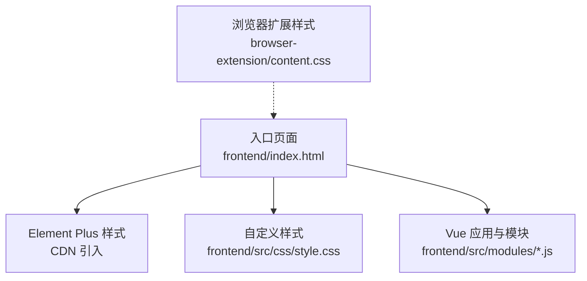
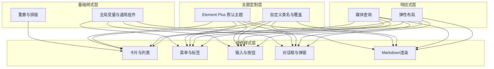
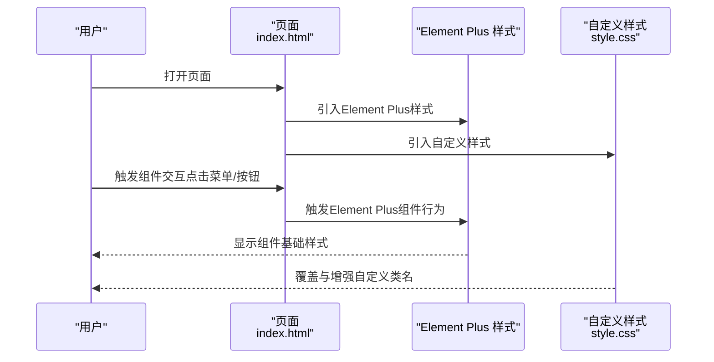
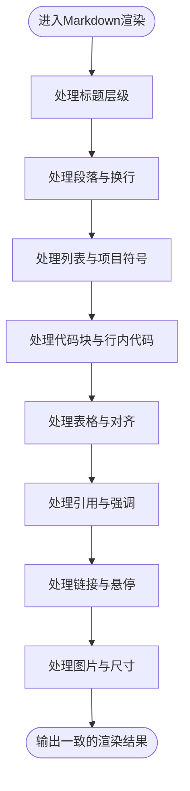
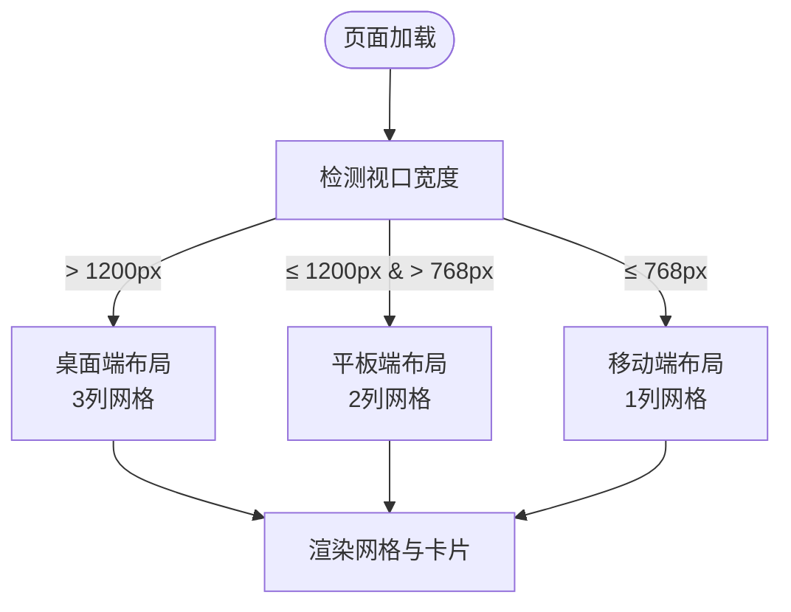
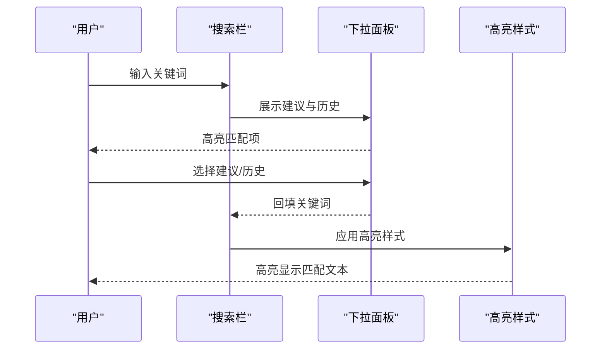
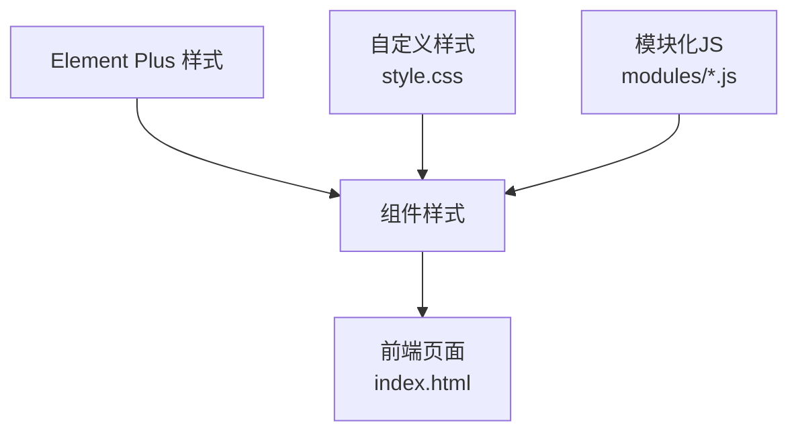

# 样式系统设计

<cite>
**本文档引用的文件**
- [frontend/src/css/style.css](file://frontend/src/css/style.css)
- [frontend/index.html](file://frontend/index.html)
- [browser-extension/content.css](file://browser-extension/content.css)
- [frontend/src/modules/fileUploadModule.js](file://frontend/src/modules/fileUploadModule.js)
- [frontend/src/modules/filterUtils.js](file://frontend/src/modules/filterUtils.js)
</cite>

## 目录
1. [简介](#简介)
2. [项目结构](#项目结构)
3. [核心组件](#核心组件)
4. [架构总览](#架构总览)
5. [详细组件分析](#详细组件分析)
6. [依赖关系分析](#依赖关系分析)
7. [性能考虑](#性能考虑)
8. [故障排除指南](#故障排除指南)
9. [结论](#结论)

## 简介
本设计文档面向PaperHub前端样式系统，系统性阐述CSS样式架构的设计思路与实现原理，涵盖以下重点：
- Element Plus主题定制与集成策略
- Markdown渲染样式与内容展示一致性
- 响应式布局设计与多端适配
- 样式组织结构、CSS变量使用、主题切换机制与组件样式隔离策略
- 统一视觉设计语言（颜色体系、字体规范、间距标准、动画效果）
- 样式开发规范、自定义样式的扩展方法与浏览器兼容性处理

## 项目结构
PaperHub前端采用“单页HTML + 模块化JS + 自定义CSS”的轻量架构：
- 入口页面：frontend/index.html，引入Element Plus样式与自定义样式，挂载Vue应用
- 核心样式：frontend/src/css/style.css，包含全局重置、布局、组件样式与响应式规则
- 浏览器扩展样式：browser-extension/content.css，用于内容脚本的浮动工具栏与通知提示
- 模块化功能：frontend/src/modules/*，通过组合式函数提供过滤、上传等能力，配合样式实现一致的UI体验

**图表来源**
- [frontend/index.html:1-14](file://frontend/index.html#L1-L14)
- [frontend/src/css/style.css:1-12](file://frontend/src/css/style.css#L1-L12)
- [browser-extension/content.css:1-89](file://browser-extension/content.css#L1-L89)

**章节来源**
- [frontend/index.html:1-14](file://frontend/index.html#L1-L14)
- [frontend/src/css/style.css:1-12](file://frontend/src/css/style.css#L1-L12)
- [browser-extension/content.css:1-89](file://browser-extension/content.css#L1-L89)

## 核心组件
- 全局样式与布局
  - 重置与基础排版：统一盒模型、字体族与背景色
  - 布局容器：头部、主容器、侧边栏与内容区
  - 侧边栏拖拽：支持宽度动态调整
- Element Plus集成
  - 基础组件样式：菜单、标签、输入框、按钮、对话框等
  - 主题色与尺寸：通过Element Plus默认主题与自定义类名结合
- Markdown渲染样式
  - 标题层级、段落、列表、代码块、表格、引用、链接与图片
  - 与笔记编辑器与外部内容展示的一致性
- 搜索与筛选交互
  - 搜索栏、下拉建议、历史记录与高亮
  - 筛选器（状态、来源、标签、日期）与批量操作
- 响应式设计
  - 媒体查询：1200px与768px断点下的网格与布局调整
- 浏览器扩展样式
  - 浮动工具栏与通知提示的动画与定位

**章节来源**
- [frontend/src/css/style.css:1-120](file://frontend/src/css/style.css#L1-L120)
- [frontend/src/css/style.css:1488-1520](file://frontend/src/css/style.css#L1488-L1520)
- [browser-extension/content.css:1-89](file://browser-extension/content.css#L1-L89)

## 架构总览
样式系统采用“基础样式 + 组件样式 + 主题定制 + 响应式”的分层架构：
- 基础样式层：重置、排版、全局变量与通用组件
- 组件样式层：卡片、菜单、标签、按钮、对话框等Element Plus组件的二次封装
- 主题定制层：Element Plus默认主题与自定义类名的组合
- 响应式层：媒体查询与弹性布局，确保多端一致体验

**图表来源**
- [frontend/src/css/style.css:1-120](file://frontend/src/css/style.css#L1-L120)
- [frontend/src/css/style.css:1488-1520](file://frontend/src/css/style.css#L1488-L1520)

## 详细组件分析

### Element Plus主题定制与集成
- 引入方式：通过CDN引入Element Plus样式，保证组件基础样式一致
- 定制策略：
  - 使用Element Plus提供的类型化属性（如type、size、effect）控制外观
  - 通过自定义类名覆盖默认样式（如搜索下拉项、标签、按钮等）
  - 保持与Element Plus默认主题的协调，避免破坏整体风格
- 典型场景：
  - 搜索下拉项：hover与选中态的颜色与过渡
  - 标签与按钮：尺寸、圆角、阴影与交互反馈
  - 对话框与弹窗：遮罩、尺寸与动画

**图表来源**
- [frontend/index.html:7-12](file://frontend/index.html#L7-L12)
- [frontend/src/css/style.css:318-344](file://frontend/src/css/style.css#L318-L344)

**章节来源**
- [frontend/index.html:7-12](file://frontend/index.html#L7-L12)
- [frontend/src/css/style.css:318-344](file://frontend/src/css/style.css#L318-L344)

### Markdown渲染样式与内容展示一致性
- 设计目标：确保笔记编辑器、外部内容展示与搜索结果中的Markdown渲染风格一致
- 核心规则：
  - 标题层级：h1-h6的字号、边距与装饰线
  - 段落与列表：行高、缩进与项目符号
  - 代码块与行内代码：背景、圆角、字体与颜色
  - 表格：边框、单元格内边距与交替行背景
  - 引用与链接：边框、背景与悬停下划线
  - 图片：最大宽度、圆角与外边距
- 作用范围：note-markdown类及其子元素，确保不同模块的渲染一致性

**图表来源**
- [frontend/src/css/style.css:126-247](file://frontend/src/css/style.css#L126-L247)

**章节来源**
- [frontend/src/css/style.css:126-247](file://frontend/src/css/style.css#L126-L247)

### 响应式布局设计
- 断点策略：
  - 1200px：网格列数从3列变为2列，提升可读性
  - 768px：网格列数变为1列，适配移动端
- 实现方式：媒体查询包裹网格与卡片布局，确保在不同屏幕宽度下自动调整
- 适用场景：入库首页、精选第三方信息源列表、公众号文章列表等

**图表来源**
- [frontend/src/css/style.css:1488-1499](file://frontend/src/css/style.css#L1488-L1499)

**章节来源**
- [frontend/src/css/style.css:1488-1499](file://frontend/src/css/style.css#L1488-L1499)

### 搜索与筛选交互样式
- 搜索栏：圆角输入框、占位符与聚焦态的背景与边框变化
- 下拉面板：阴影、圆角与悬停高亮；历史记录与清除按钮
- 高亮：搜索关键词在标题、摘要与结果中的高亮样式
- 筛选器：状态、来源、标签与日期筛选的标签式交互与批量操作工具栏

**图表来源**
- [frontend/src/css/style.css:267-415](file://frontend/src/css/style.css#L267-L415)

**章节来源**
- [frontend/src/css/style.css:267-415](file://frontend/src/css/style.css#L267-L415)

### 组件样式隔离策略
- 类名前缀：以模块语义命名（如paper-card、article-item、search-dropdown），避免冲突
- 继承与覆盖：通过Element Plus类名与自定义类名组合，实现局部覆盖
- 组件内部样式：在Vue模板中直接绑定类名，确保与Element Plus组件的样式边界清晰
- 示例：卡片类名同时包含通用卡片类与状态类（如paper-pending、paper-starred），实现状态与主题的解耦

**章节来源**
- [frontend/src/css/style.css:64-124](file://frontend/src/css/style.css#L64-L124)
- [frontend/src/css/style.css:431-494](file://frontend/src/css/style.css#L431-L494)

### 浏览器扩展样式
- 工具栏：绝对定位、阴影、圆角与动画，确保在页面中稳定可见
- 通知提示：滑入与淡出动画，右上角固定位置，提升用户反馈
- 交互反馈：按钮悬停与按下态，提供即时反馈

**章节来源**
- [browser-extension/content.css:1-89](file://browser-extension/content.css#L1-L89)

## 依赖关系分析
- 外部依赖：Element Plus（CDN引入），提供基础组件样式
- 内部依赖：自定义样式文件与模块化JS共同驱动UI行为
- 样式依赖：组件样式依赖Element Plus的基础样式，通过自定义类名进行增强

**图表来源**
- [frontend/index.html:7-12](file://frontend/index.html#L7-L12)
- [frontend/src/css/style.css:1-12](file://frontend/src/css/style.css#L1-L12)

**章节来源**
- [frontend/index.html:7-12](file://frontend/index.html#L7-L12)
- [frontend/src/css/style.css:1-12](file://frontend/src/css/style.css#L1-L12)

## 性能考虑
- 样式体积控制：合并与压缩CSS，避免重复定义
- 选择器复杂度：尽量使用类名而非深层后代选择器，减少重绘与回流
- 动画性能：使用transform与opacity触发GPU加速，避免频繁改变布局属性
- 响应式策略：媒体查询按需使用，避免过多断点导致样式分支复杂
- 组件复用：通过统一类名与状态类实现组件复用，降低维护成本

## 故障排除指南
- Element Plus样式冲突
  - 现象：组件样式异常或被覆盖
  - 处理：检查自定义类名是否正确覆盖，避免与Element Plus默认类名冲突
  - 参考：搜索下拉项与标签的hover/selected态样式
- 搜索高亮不生效
  - 现象：关键词未高亮
  - 处理：确认高亮类名与搜索结果DOM结构一致，检查样式优先级
  - 参考：搜索高亮与结果卡片中的em标签样式
- 响应式布局异常
  - 现象：断点处布局错乱
  - 处理：检查媒体查询断点与网格列数设置，确保在目标宽度范围内生效
  - 参考：1200px与768px断点下的网格布局
- 浏览器扩展样式问题
  - 现象：工具栏或通知显示异常
  - 处理：确认z-index与定位，检查动画关键帧与浏览器兼容性
  - 参考：浮动工具栏与通知提示的动画与定位

**章节来源**
- [frontend/src/css/style.css:318-344](file://frontend/src/css/style.css#L318-L344)
- [frontend/src/css/style.css:396-415](file://frontend/src/css/style.css#L396-L415)
- [frontend/src/css/style.css:1488-1499](file://frontend/src/css/style.css#L1488-L1499)
- [browser-extension/content.css:19-88](file://browser-extension/content.css#L19-L88)

## 结论
PaperHub前端样式系统通过“基础样式 + 组件样式 + 主题定制 + 响应式”的分层设计，实现了统一的视觉语言与良好的可维护性。Element Plus作为基础组件库，结合自定义类名与媒体查询，既保证了组件一致性，又满足了业务场景的差异化需求。Markdown渲染样式与响应式布局进一步提升了内容展示与多端适配体验。未来可在CSS变量与主题切换机制方面进一步完善，以支持更灵活的主题定制与暗色模式。