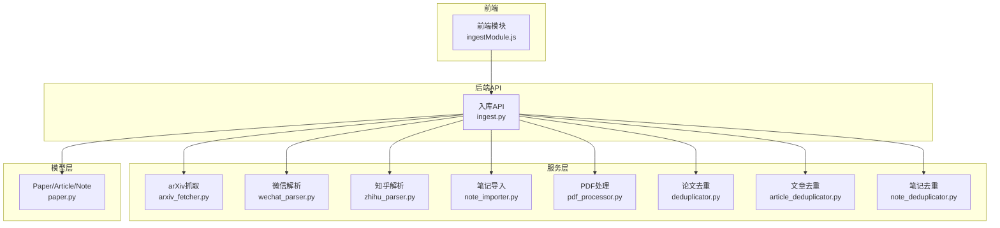
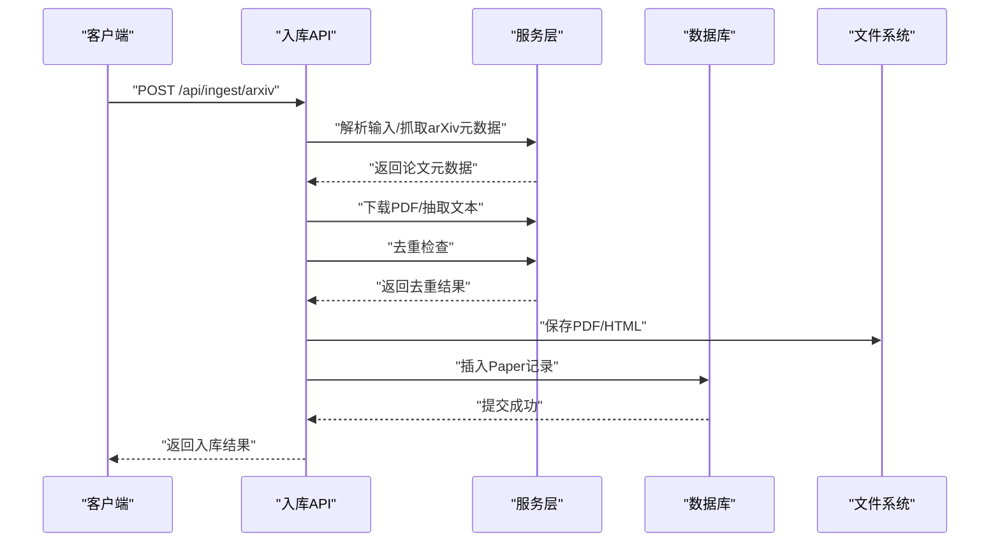
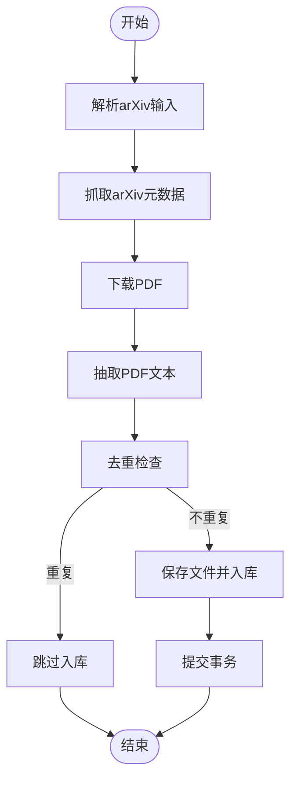
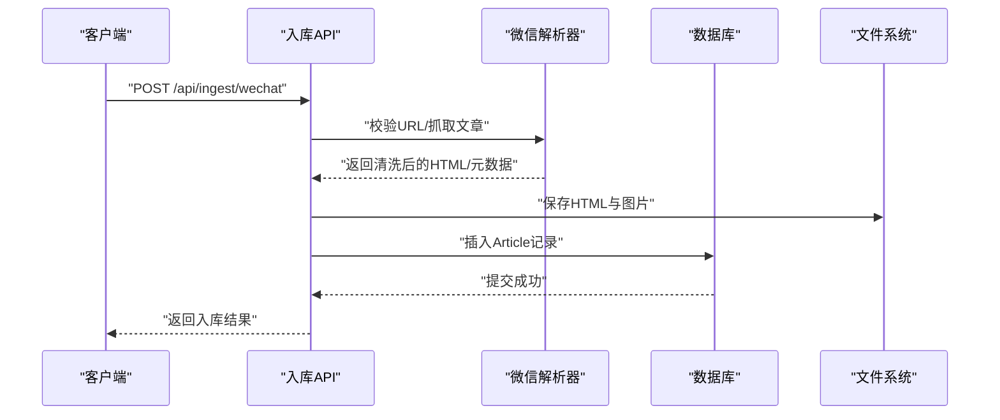
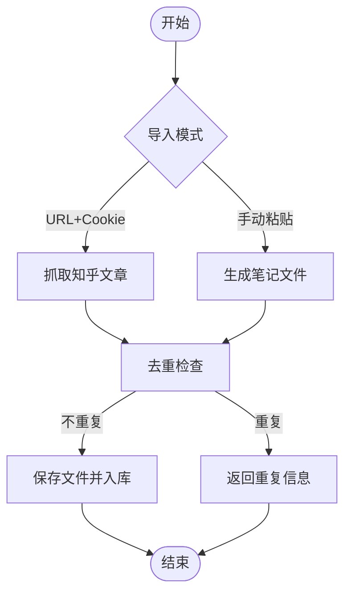
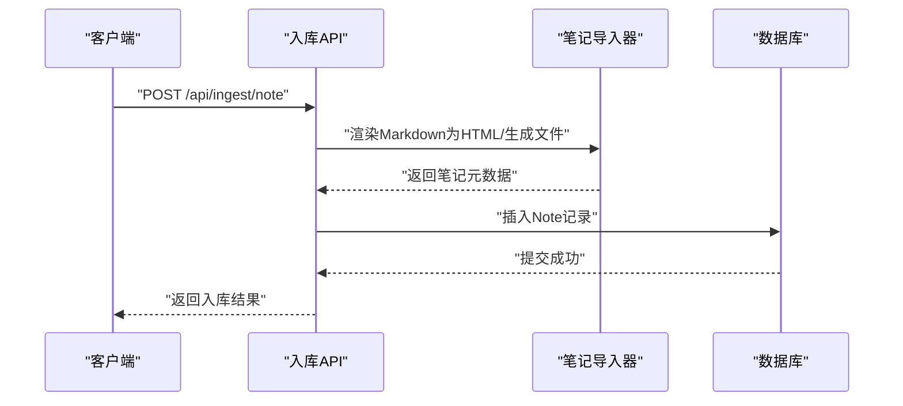
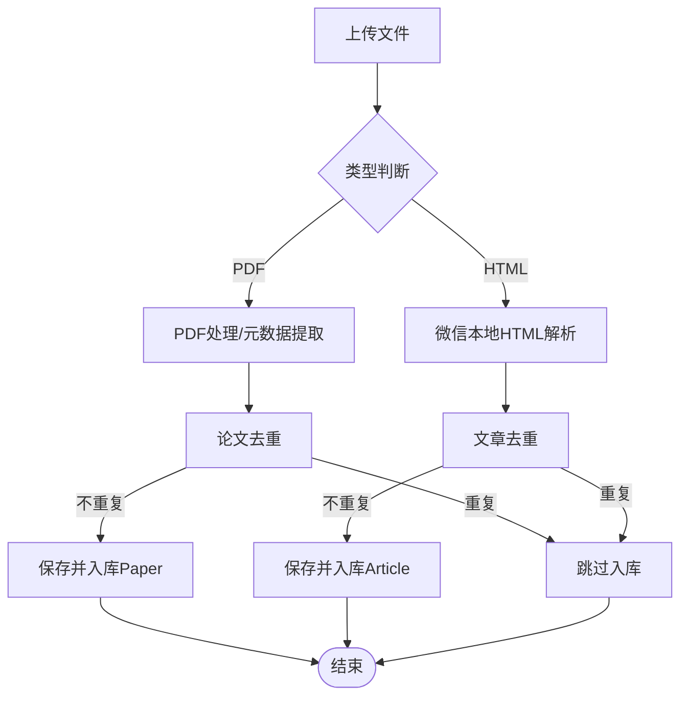
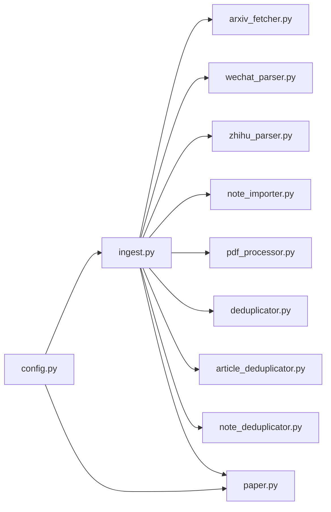

# 入库工具模块

<cite>
**本文引用的文件**
- [backend/api/ingest.py](file://backend/api/ingest.py)
- [backend/services/arxiv_fetcher.py](file://backend/services/arxiv_fetcher.py)
- [backend/services/wechat_parser.py](file://backend/services/wechat_parser.py)
- [backend/services/zhihu_parser.py](file://backend/services/zhihu_parser.py)
- [backend/services/note_importer.py](file://backend/services/note_importer.py)
- [backend/services/pdf_processor.py](file://backend/services/pdf_processor.py)
- [backend/services/deduplicator.py](file://backend/services/deduplicator.py)
- [backend/services/article_deduplicator.py](file://backend/services/article_deduplicator.py)
- [backend/services/note_deduplicator.py](file://backend/services/note_deduplicator.py)
- [backend/models/paper.py](file://backend/models/paper.py)
- [backend/config.py](file://backend/config.py)
- [frontend/src/modules/ingestModule.js](file://frontend/src/modules/ingestModule.js)
- [specs/backend/api/ingest.yml](file://specs/backend/api/ingest.yml)
</cite>

## 目录
1. [简介](#简介)
2. [项目结构](#项目结构)
3. [核心组件](#核心组件)
4. [架构总览](#架构总览)
5. [详细组件分析](#详细组件分析)
6. [依赖关系分析](#依赖关系分析)
7. [性能考量](#性能考量)
8. [故障排查指南](#故障排查指南)
9. [结论](#结论)
10. [附录](#附录)

## 简介
本文件面向PaperHub的“入库工具模块”，系统性阐述多源数据导入体系的设计与实现，覆盖以下能力：
- arXiv论文导入与批量导入
- 微信公众号文章导入（在线抓取与本地HTML解析）
- 知乎文章导入（在线抓取与手动粘贴）
- AI对话笔记导入（Markdown转HTML并落盘）
- PDF/HTML本地文件入库（论文库或文章库）
- 通用网页正文提取预览与入库
- 统一的状态管理、数据验证与错误处理
- 去重策略与重复检测
- 统一的元数据提取、文件下载与本地化存储
- 使用示例、批量导入与进度监控

## 项目结构
入库模块由三层组成：
- API层：定义REST接口，接收请求参数，协调服务层与模型层
- 服务层：封装具体的数据源解析、下载、清洗与落库逻辑
- 模型层：定义Paper/Article/Note等实体及关联关系

图表来源
- [backend/api/ingest.py:1-1166](file://backend/api/ingest.py#L1-L1166)
- [backend/services/arxiv_fetcher.py:1-324](file://backend/services/arxiv_fetcher.py#L1-L324)
- [backend/services/wechat_parser.py:1-1197](file://backend/services/wechat_parser.py#L1-L1197)
- [backend/services/zhihu_parser.py:1-323](file://backend/services/zhihu_parser.py#L1-L323)
- [backend/services/note_importer.py:1-232](file://backend/services/note_importer.py#L1-L232)
- [backend/services/pdf_processor.py:1-170](file://backend/services/pdf_processor.py#L1-L170)
- [backend/services/deduplicator.py:1-124](file://backend/services/deduplicator.py#L1-L124)
- [backend/services/article_deduplicator.py:1-173](file://backend/services/article_deduplicator.py#L1-L173)
- [backend/services/note_deduplicator.py:1-230](file://backend/services/note_deduplicator.py#L1-L230)
- [backend/models/paper.py:1-360](file://backend/models/paper.py#L1-L360)

章节来源
- [backend/api/ingest.py:1-1166](file://backend/api/ingest.py#L1-L1166)
- [backend/config.py:1-134](file://backend/config.py#L1-L134)

## 核心组件
- 入库API控制器：提供arXiv搜索/导入、微信公众号导入、知乎导入、PDF/HTML上传入库、通用网页预览与入库等接口
- 数据源解析器：
  - arXiv抓取器：解析arXiv输入、拉取元数据、下载PDF、抽取文本
  - 微信解析器：识别微信文章URL、抓取正文、清洗样式、下载图片、本地化存储
  - 知乎解析器：基于Cookie抓取知乎文章、转换为Markdown/HTML并落盘
  - 笔记导入器：将Markdown渲染为HTML与MD双文件，生成笔记元数据
  - PDF处理器：从PDF提取文本与元数据，支持标题/作者/摘要推断
- 去重器：
  - 论文去重：基于arXiv ID/DOI/URL/标题相似度
  - 文章去重：基于URL/标题相似度/内容哈希
  - 笔记去重：基于URL/标题相似度/内容哈希
- 模型与配置：Paper/Article/Note实体定义、数据库连接池与目录结构

章节来源
- [backend/api/ingest.py:36-1166](file://backend/api/ingest.py#L36-L1166)
- [backend/services/arxiv_fetcher.py:17-324](file://backend/services/arxiv_fetcher.py#L17-L324)
- [backend/services/wechat_parser.py:256-1197](file://backend/services/wechat_parser.py#L256-L1197)
- [backend/services/zhihu_parser.py:54-323](file://backend/services/zhihu_parser.py#L54-L323)
- [backend/services/note_importer.py:183-232](file://backend/services/note_importer.py#L183-L232)
- [backend/services/pdf_processor.py:148-170](file://backend/services/pdf_processor.py#L148-L170)
- [backend/services/deduplicator.py:79-124](file://backend/services/deduplicator.py#L79-L124)
- [backend/services/article_deduplicator.py:134-173](file://backend/services/article_deduplicator.py#L134-L173)
- [backend/services/note_deduplicator.py:88-230](file://backend/services/note_deduplicator.py#L88-L230)
- [backend/models/paper.py:120-294](file://backend/models/paper.py#L120-L294)
- [backend/config.py:18-134](file://backend/config.py#L18-L134)

## 架构总览
入库流程遵循“请求—解析—去重—落库—响应”的标准闭环，关键特性：
- 统一状态字段：Paper/Article/Note均包含status字段，便于后续处理与展示
- 统一去重策略：优先URL完全匹配，其次标题相似度，最后内容哈希
- 统一存储：所有入库内容均落地为HTML/Mardown文件，便于离线阅读与检索
- 统一错误处理：捕获异常并返回结构化错误信息，便于前端提示

图表来源
- [backend/api/ingest.py:183-258](file://backend/api/ingest.py#L183-L258)
- [backend/services/arxiv_fetcher.py:32-87](file://backend/services/arxiv_fetcher.py#L32-L87)
- [backend/services/deduplicator.py:79-124](file://backend/services/deduplicator.py#L79-L124)
- [backend/models/paper.py:120-186](file://backend/models/paper.py#L120-L186)

## 详细组件分析

### arXiv论文导入
- 输入支持：arXiv URL、arXiv ID、短ID
- 处理流程：
  - 解析输入，调用arXiv API获取元数据
  - 下载PDF并抽取文本
  - 去重检查（arXiv ID/DOI/URL/标题）
  - 落库为Paper，状态为pending
- 批量导入：逐条处理，统计成功/失败与错误明细

图表来源
- [backend/api/ingest.py:92-181](file://backend/api/ingest.py#L92-L181)
- [backend/services/arxiv_fetcher.py:17-87](file://backend/services/arxiv_fetcher.py#L17-L87)
- [backend/services/deduplicator.py:79-124](file://backend/services/deduplicator.py#L79-L124)

章节来源
- [backend/api/ingest.py:36-181](file://backend/api/ingest.py#L36-L181)
- [backend/services/arxiv_fetcher.py:17-324](file://backend/services/arxiv_fetcher.py#L17-L324)
- [backend/services/deduplicator.py:79-124](file://backend/services/deduplicator.py#L79-L124)

### 微信公众号导入
- 在线导入：校验URL有效性，抓取正文，清洗样式，下载图片，本地化存储
- 本地HTML导入：解析本地保存的HTML，下载缺失图片，生成本地化HTML
- 去重策略：URL完全匹配优先；若为本地HTML则按标题/内容哈希判断
- 落库：入库为Article，状态为pending

图表来源
- [backend/api/ingest.py:689-758](file://backend/api/ingest.py#L689-L758)
- [backend/services/wechat_parser.py:256-601](file://backend/services/wechat_parser.py#L256-L601)
- [backend/services/article_deduplicator.py:134-173](file://backend/services/article_deduplicator.py#L134-L173)

章节来源
- [backend/api/ingest.py:622-758](file://backend/api/ingest.py#L622-L758)
- [backend/services/wechat_parser.py:78-601](file://backend/services/wechat_parser.py#L78-L601)
- [backend/services/article_deduplicator.py:134-173](file://backend/services/article_deduplicator.py#L134-L173)

### 知乎文章导入
- 在线导入：提供URL与Cookie，抓取文章内容，转换为Markdown/HTML并落盘
- 手动粘贴：提供标题/作者/内容，通过笔记导入器生成本地化文件
- 去重策略：URL/标题相似度/内容哈希三段式
- 落库：入库为Article，状态为pending

图表来源
- [backend/api/ingest.py:350-465](file://backend/api/ingest.py#L350-L465)
- [backend/services/zhihu_parser.py:279-323](file://backend/services/zhihu_parser.py#L279-L323)
- [backend/services/note_importer.py:183-232](file://backend/services/note_importer.py#L183-L232)
- [backend/services/article_deduplicator.py:134-173](file://backend/services/article_deduplicator.py#L134-L173)

章节来源
- [backend/api/ingest.py:350-465](file://backend/api/ingest.py#L350-L465)
- [backend/services/zhihu_parser.py:279-323](file://backend/services/zhihu_parser.py#L279-L323)
- [backend/services/note_importer.py:183-232](file://backend/services/note_importer.py#L183-L232)
- [backend/services/article_deduplicator.py:134-173](file://backend/services/article_deduplicator.py#L134-L173)

### AI对话笔记导入
- 输入：标题、来源（如Claude/ChatGPT）、Markdown正文、可选创建时间
- 处理：渲染Markdown为HTML，生成MD与HTML双文件，提取摘要
- 去重策略：URL/标题相似度/内容哈希
- 落库：入库为Note，状态为pending

图表来源
- [backend/api/ingest.py:261-347](file://backend/api/ingest.py#L261-L347)
- [backend/services/note_importer.py:17-232](file://backend/services/note_importer.py#L17-L232)
- [backend/services/note_deduplicator.py:88-130](file://backend/services/note_deduplicator.py#L88-L130)

章节来源
- [backend/api/ingest.py:261-347](file://backend/api/ingest.py#L261-L347)
- [backend/services/note_importer.py:17-232](file://backend/services/note_importer.py#L17-L232)
- [backend/services/note_deduplicator.py:88-130](file://backend/services/note_deduplicator.py#L88-L130)

### PDF/HTML本地文件入库
- 支持多文件上传，自动识别PDF/HTML
- PDF：提取元数据（标题/作者/摘要），进行论文去重，落库为Paper
- HTML：解析微信本地HTML，进行文章去重，落库为Article
- 统一命名：UUID前缀避免冲突，保存至data/papers对应子目录

图表来源
- [backend/api/ingest.py:467-619](file://backend/api/ingest.py#L467-L619)
- [backend/services/pdf_processor.py:148-170](file://backend/services/pdf_processor.py#L148-L170)
- [backend/services/wechat_parser.py:78-253](file://backend/services/wechat_parser.py#L78-L253)
- [backend/services/deduplicator.py:79-124](file://backend/services/deduplicator.py#L79-L124)
- [backend/services/article_deduplicator.py:134-173](file://backend/services/article_deduplicator.py#L134-L173)

章节来源
- [backend/api/ingest.py:467-619](file://backend/api/ingest.py#L467-L619)
- [backend/services/pdf_processor.py:148-170](file://backend/services/pdf_processor.py#L148-L170)
- [backend/services/wechat_parser.py:78-253](file://backend/services/wechat_parser.py#L78-L253)
- [backend/services/deduplicator.py:79-124](file://backend/services/deduplicator.py#L79-L124)
- [backend/services/article_deduplicator.py:134-173](file://backend/services/article_deduplicator.py#L134-L173)

### 通用网页正文提取与入库
- 预览：提取网页正文（不入库），返回标题/作者/正文/HTML长度等
- 入库：确认后入库为Article，自动下载远程图片并替换本地路径

章节来源
- [backend/api/ingest.py:761-800](file://backend/api/ingest.py#L761-L800)

## 依赖关系分析
- API层依赖服务层与模型层，负责参数校验、事务控制与错误包装
- 服务层内部解耦，各解析器独立工作，通过统一的去重器与落库流程对接
- 去重器采用相似度算法（编辑距离/Jaccard）与内容哈希，兼顾准确与性能
- 配置层提供全局数据库连接池与目录结构，保证跨模块一致性

图表来源
- [backend/api/ingest.py:1-1166](file://backend/api/ingest.py#L1-L1166)
- [backend/services/arxiv_fetcher.py:1-324](file://backend/services/arxiv_fetcher.py#L1-L324)
- [backend/services/wechat_parser.py:1-1197](file://backend/services/wechat_parser.py#L1-L1197)
- [backend/services/zhihu_parser.py:1-323](file://backend/services/zhihu_parser.py#L1-L323)
- [backend/services/note_importer.py:1-232](file://backend/services/note_importer.py#L1-L232)
- [backend/services/pdf_processor.py:1-170](file://backend/services/pdf_processor.py#L1-L170)
- [backend/services/deduplicator.py:1-124](file://backend/services/deduplicator.py#L1-L124)
- [backend/services/article_deduplicator.py:1-173](file://backend/services/article_deduplicator.py#L1-L173)
- [backend/services/note_deduplicator.py:1-230](file://backend/services/note_deduplicator.py#L1-L230)
- [backend/models/paper.py:1-360](file://backend/models/paper.py#L1-L360)
- [backend/config.py:1-134](file://backend/config.py#L1-L134)

章节来源
- [backend/api/ingest.py:1-1166](file://backend/api/ingest.py#L1-L1166)
- [backend/config.py:1-134](file://backend/config.py#L1-L134)

## 性能考量
- 连接池与会话管理：全局SQLAlchemy引擎与scoped_session，减少连接开销
- PDF文本抽取限制：限制抽取页数，避免大文件导致内存压力
- 图片下载并发：微信解析器对图片下载设置超时，失败不影响整体入库
- 去重策略权衡：先URL后相似度再哈希，尽量减少全表扫描
- 文件命名与存储：UUID前缀避免冲突，目录层级清晰，便于维护

章节来源
- [backend/config.py:85-134](file://backend/config.py#L85-L134)
- [backend/services/pdf_processor.py:10-24](file://backend/services/pdf_processor.py#L10-L24)
- [backend/services/wechat_parser.py:558-577](file://backend/services/wechat_parser.py#L558-L577)

## 故障排查指南
- 常见错误码
  - 400：缺少必要参数、无效URL、日期格式错误
  - 409：已存在（重复）
  - 500：外部服务调用失败、解析异常
- 常见问题定位
  - arXiv：确认输入格式（URL/ID），检查网络与arXiv API可用性
  - 微信：确认URL有效性与网络可达性；若本地HTML解析失败，检查文件完整性
  - 知乎：确认Cookie有效性与URL正确性
  - PDF：确认文件可读且非加密；检查磁盘空间与权限
- 日志与调试
  - API层捕获异常并打印堆栈，便于定位
  - 服务层关键步骤增加日志输出（如arXiv搜索）

章节来源
- [backend/api/ingest.py:86-89](file://backend/api/ingest.py#L86-L89)
- [backend/services/arxiv_fetcher.py:220-226](file://backend/services/arxiv_fetcher.py#L220-L226)
- [backend/services/wechat_parser.py:351-354](file://backend/services/wechat_parser.py#L351-L354)

## 结论
入库工具模块通过统一的API入口与服务层解耦设计，实现了多源数据的标准化导入与落库。其核心优势在于：
- 统一的状态管理与错误处理
- 多维度去重策略保障数据质量
- 本地化存储与可检索的HTML/Mardown文件
- 易扩展的模块化架构，便于新增数据源

建议在生产环境中：
- 配置合适的连接池参数与超时策略
- 对大规模批量导入增加队列与进度上报
- 完善日志与监控指标，提升可观测性

## 附录

### 使用示例与最佳实践
- arXiv单条导入
  - 请求：POST /api/ingest/arxiv
  - 参数：input（arXiv URL或ID）
  - 结果：返回Paper对象或重复信息
- arXiv批量导入
  - 请求：POST /api/ingest/arxiv/batch
  - 参数：arxiv_ids（数组）、download_pdf（可选）
  - 结果：返回成功/失败计数与错误明细
- 微信公众号导入
  - 在线：POST /api/ingest/wechat（url、extract_content_only）
  - 本地：POST /api/ingest/wechat/local（html_path、assets_folder）
- 知乎导入
  - 在线：POST /api/ingest/zhihu（url、cookie）
  - 手动：POST /api/ingest/zhihu（title、author、content、created_at）
- PDF/HTML上传入库
  - POST /api/ingest/pdf（file多文件、pdf_url可选）
- 通用网页预览与入库
  - 预览：POST /api/ingest/web/preview（url）
  - 入库：POST /api/ingest/web（url、title、author、content/html）

章节来源
- [specs/backend/api/ingest.yml:1-273](file://specs/backend/api/ingest.yml#L1-L273)
- [backend/api/ingest.py:36-800](file://backend/api/ingest.py#L36-L800)

### 批量导入与进度监控
- 批量导入
  - arXiv批量：/api/ingest/arxiv/batch，逐条处理并统计结果
  - PDF批量：/api/ingest/pdf，逐文件处理并返回每条结果
- 进度监控
  - 前端模块提供ingesting/wechatIngesting等状态标记
  - 建议在API层增加任务队列与进度回调（扩展点）

章节来源
- [frontend/src/modules/ingestModule.js:1-48](file://frontend/src/modules/ingestModule.js#L1-L48)
- [backend/api/ingest.py:92-181](file://backend/api/ingest.py#L92-L181)
- [backend/api/ingest.py:467-619](file://backend/api/ingest.py#L467-L619)