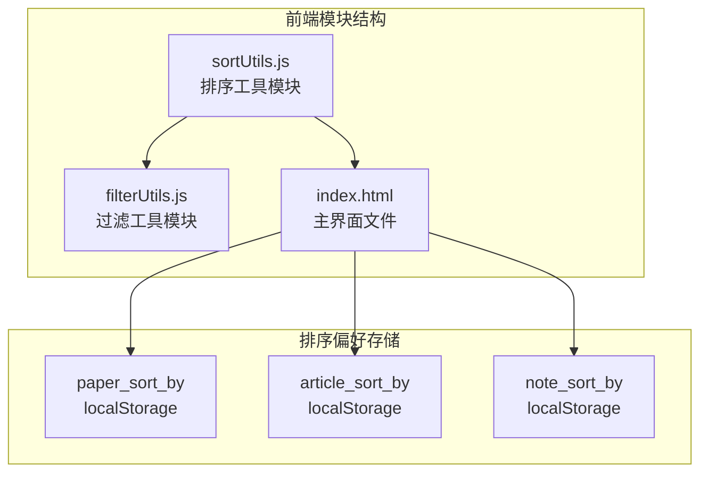
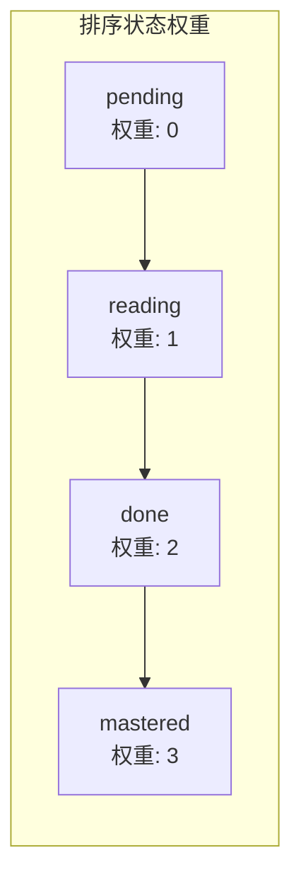
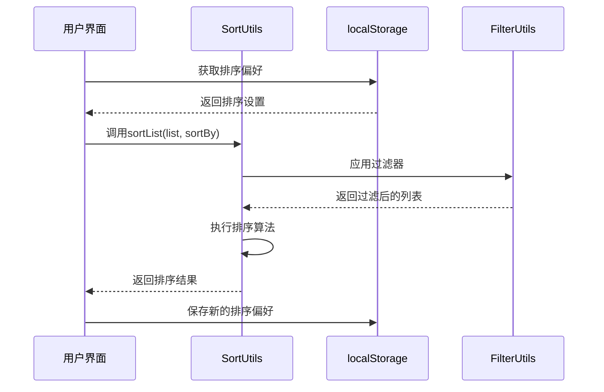
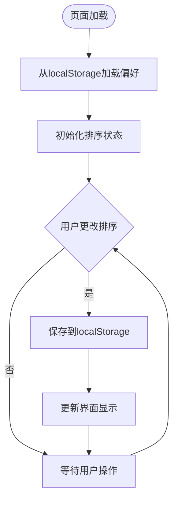
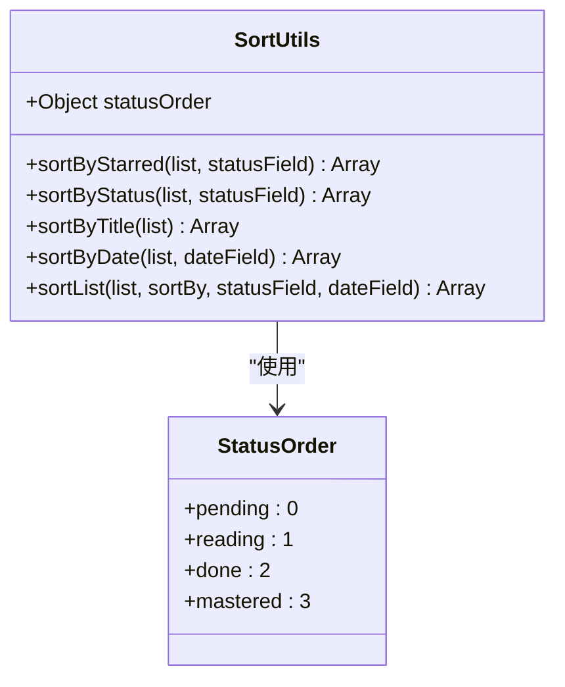
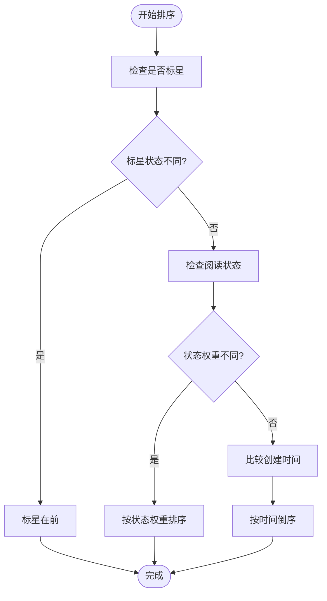
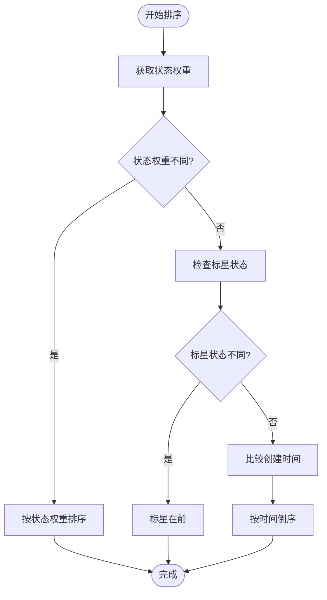
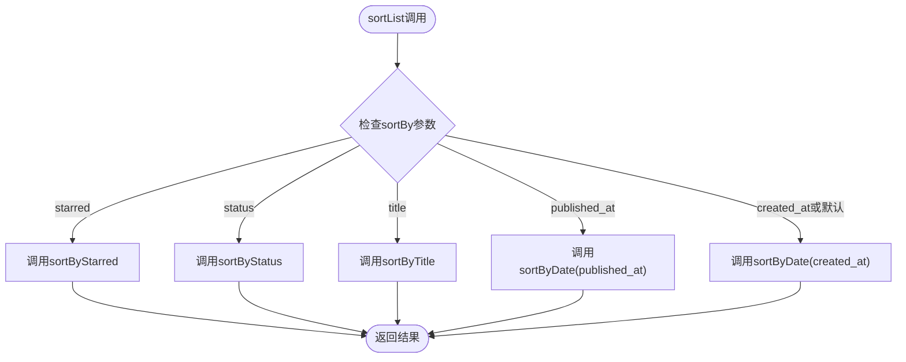
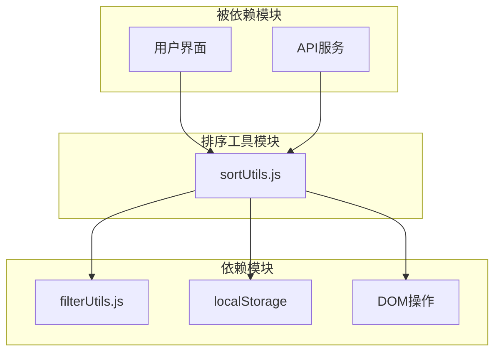
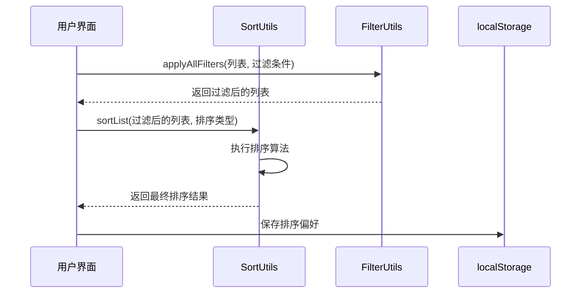

# 排序工具模块

<cite>
**本文档引用的文件**
- [sortUtils.js](file://frontend/src/modules/sortUtils.js)
- [sortUtils.yml](file://specs/frontend/modules/sortUtils.yml)
- [排序系统开发与避坑指南.md](file://docs/排序系统开发与避坑指南.md)
- [index.html](file://frontend/index.html)
- [filterUtils.js](file://frontend/src/modules/filterUtils.js)
</cite>

## 目录
1. [简介](#简介)
2. [项目结构](#项目结构)
3. [核心组件](#核心组件)
4. [架构概览](#架构概览)
5. [详细组件分析](#详细组件分析)
6. [依赖关系分析](#依赖关系分析)
7. [性能考虑](#性能考虑)
8. [故障排除指南](#故障排除指南)
9. [结论](#结论)
10. [附录](#附录)

## 简介

PaperHub 排序工具模块是一个统一的前端排序系统，为论文库、文章库和笔记库提供一致的排序体验。该模块实现了五种灵活的排序方式，全部在前端进行纯内存计算，具有毫秒级响应速度。模块采用纯函数设计，确保可预测性和可测试性，同时支持三库排序偏好的独立持久化。

## 项目结构

排序工具模块位于前端项目中，采用模块化设计，与其他核心模块协同工作：



**图表来源**
- [sortUtils.js:1-53](file://frontend/src/modules/sortUtils.js#L1-L53)
- [index.html:2990-3060](file://frontend/index.html#L2990-L3060)

**章节来源**
- [sortUtils.js:1-53](file://frontend/src/modules/sortUtils.js#L1-L53)
- [index.html:2990-3060](file://frontend/index.html#L2990-L3060)

## 核心组件

排序工具模块包含以下核心组件：

### 主要排序函数

模块提供了五个主要的排序函数，每个都遵循相同的接口规范：

| 函数名称 | 参数 | 返回值 | 描述 |
|---------|------|--------|------|
| `sortByStarred` | `list`, `statusField='status'` | 新排序数组 | 收藏优先排序 |
| `sortByStatus` | `list`, `statusField='status'` | 新排序数组 | 阅读状态排序 |
| `sortByTitle` | `list` | 新排序数组 | 标题排序 |
| `sortByDate` | `list`, `dateField='created_at'` | 新排序数组 | 日期排序 |
| `sortList` | `list`, `sortBy`, `statusField='status'`, `dateField='created_at'` | 排序结果 | 统一分发函数 |

### 排序状态管理

模块支持三种不同的排序状态，每种状态都有特定的权重分配：



**图表来源**
- [sortUtils.js:3](file://frontend/src/modules/sortUtils.js#L3)

**章节来源**
- [sortUtils.js:5-51](file://frontend/src/modules/sortUtils.js#L5-L51)
- [sortUtils.yml:4-90](file://specs/frontend/modules/sortUtils.yml#L4-L90)

## 架构概览

排序系统采用分层架构设计，确保模块间的松耦合和高内聚：



**图表来源**
- [index.html:4372-4407](file://frontend/index.html#L4372-L4407)
- [sortUtils.js:37-51](file://frontend/src/modules/sortUtils.js#L37-L51)

### 排序偏好持久化机制

排序偏好通过浏览器的 localStorage 进行持久化存储，实现跨会话的状态保持：



**图表来源**
- [index.html:2992](file://frontend/index.html#L2992)
- [index.html:4372-4382](file://frontend/index.html#L4372-L4382)

**章节来源**
- [index.html:2990-3060](file://frontend/index.html#L2990-L3060)
- [index.html:4372-4382](file://frontend/index.html#L4372-L4382)

## 详细组件分析

### SortUtils 类结构



**图表来源**
- [sortUtils.js:2-52](file://frontend/src/modules/sortUtils.js#L2-L52)

#### sortByStarred 排序算法

收藏优先排序是最复杂的排序逻辑，包含多级优先级：



**图表来源**
- [sortUtils.js:5-15](file://frontend/src/modules/sortUtils.js#L5-L15)

#### sortByStatus 排序算法

阅读状态排序逻辑相对简单，直接按状态权重排序：



**图表来源**
- [sortUtils.js:17-27](file://frontend/src/modules/sortUtils.js#L17-L27)

**章节来源**
- [sortUtils.js:5-51](file://frontend/src/modules/sortUtils.js#L5-L51)

### 排序规则详解

#### 收藏优先排序规则

| 优先级 | 排序条件 | 排序方向 |
|--------|----------|----------|
| 第一优先级 | 标星状态 (`starred`) | 升序（标星在前） |
| 第二优先级 | 阅读状态权重 | 升序（pending → reading → done → mastered） |
| 第三优先级 | 创建时间 | 降序（最新在前） |

#### 阅读状态排序规则

| 优先级 | 排序条件 | 排序方向 |
|--------|----------|----------|
| 第一优先级 | 阅读状态权重 | 升序（pending → reading → done → mastered） |
| 第二优先级 | 标星状态 | 降序（标星在前） |
| 第三优先级 | 创建时间 | 降序（最新在前） |

#### 标题排序规则

- **排序算法**: 使用 `localeCompare('zh-CN')` 进行中文拼音排序
- **排序方向**: 升序（A-Z）
- **空值处理**: 空标题排在最前

#### 日期排序规则

- **默认日期字段**: `created_at`（添加时间）
- **可选日期字段**: `published_at`（发布日期）
- **排序方向**: 降序（最新在前）
- **空值处理**: 空日期排在最后

**章节来源**
- [sortUtils.yml:17-87](file://specs/frontend/modules/sortUtils.yml#L17-L87)
- [排序系统开发与避坑指南.md:11-17](file://docs/排序系统开发与避坑指南.md#L11-L17)

### 统一分发函数

`sortList` 函数作为统一入口，根据传入的排序类型调用相应的排序函数：



**图表来源**
- [sortUtils.js:37-51](file://frontend/src/modules/sortUtils.js#L37-L51)

**章节来源**
- [sortUtils.js:37-51](file://frontend/src/modules/sortUtils.js#L37-L51)

## 依赖关系分析

排序工具模块与其他模块的依赖关系如下：



**图表来源**
- [index.html:4404](file://frontend/index.html#L4404)
- [index.html:4479](file://frontend/index.html#L4479)

### 模块间交互

排序模块与过滤模块的协作关系：



**图表来源**
- [index.html:4388-4407](file://frontend/index.html#L4388-L4407)

**章节来源**
- [index.html:4388-4407](file://frontend/index.html#L4388-L4407)
- [filterUtils.js:74-106](file://frontend/src/modules/filterUtils.js#L74-L106)

## 性能考虑

### 时间复杂度分析

所有排序函数都基于 JavaScript 内置的 `Array.prototype.sort()` 方法，其时间复杂度为 O(n log n)，其中 n 是列表长度。

### 空间复杂度分析

- **原数组不变**: 所有函数都先创建数组副本，空间复杂度为 O(n)
- **排序算法**: 原生 sort 方法的空间复杂度取决于具体实现，通常为 O(log n) 到 O(n)

### 性能优化策略

1. **纯函数设计**: 避免副作用，提高可预测性和可测试性
2. **最小化DOM操作**: 排序在内存中完成，减少DOM重绘
3. **响应式更新**: 结合Vue的响应式系统，仅在依赖变化时重新计算
4. **懒加载**: 排序偏好从 localStorage 延迟加载

### 内存使用优化

- **数组副本**: 使用扩展运算符创建浅拷贝，避免修改原始数据
- **状态持久化**: 使用 localStorage 减少重复计算
- **批量操作**: 在一次响应式更新中处理多个状态变化

**章节来源**
- [排序系统开发与避坑指南.md:7](file://docs/排序系统开发与避坑指南.md#L7)

## 故障排除指南

### 常见问题及解决方案

#### 问题：待读状态排序错误

**现象**: 待读状态排在最后而不是最前

**原因**: 使用了 `||` 运算符而非 `??` 运算符

**解决方案**: 
```javascript
// ❌ 错误
const aStatus = statusOrder[a.status] || 9;

// ✅ 正确
const aStatus = statusOrder[a.status] ?? 9;
```

**章节来源**
- [排序系统开发与避坑指南.md:68-128](file://docs/排序系统开发与避坑指南.md#L68-L128)

#### 问题：中文标题排序异常

**现象**: 中文标题排序不符合预期

**解决方案**: 使用带语言参数的 localeCompare
```javascript
// ❌ 英文排序
(a.title || '').localeCompare(b.title || '');

// ✅ 中文排序
(a.title || '').localeCompare(b.title || '', 'zh-CN');
```

**章节来源**
- [排序系统开发与避坑指南.md:159-167](file://docs/排序系统开发与避坑指南.md#L159-L167)

### 调试工具

提供了一个简单的调试脚本用于验证排序逻辑：

```javascript
// 在浏览器控制台运行
const statusOrder = { pending: 0, reading: 1, done: 2, mastered: 3 };
const papers = ['pending', 'reading', 'done', 'mastered'].map(s => ({status:s}));

// 验证排序函数
papers.sort((a,b) => (statusOrder[a.status] ?? 9) - (statusOrder[b.status] ?? 9));
console.log(papers.map(x => x.status));
```

**章节来源**
- [排序系统开发与避坑指南.md:183-195](file://docs/排序系统开发与避坑指南.md#L183-L195)

## 结论

PaperHub 排序工具模块通过精心设计的架构和严格的实现规范，成功实现了三库统一的排序系统。模块的主要优势包括：

1. **一致性**: 统一的排序接口和算法，确保用户体验的一致性
2. **可维护性**: 纯函数设计和清晰的模块边界
3. **性能**: 前端纯内存计算，毫秒级响应
4. **可靠性**: 完善的错误处理和边界情况处理
5. **可扩展性**: 易于添加新的排序维度和自定义规则

该模块为 PaperHub 提供了稳定可靠的排序基础，支持用户在论文库、文章库和笔记库之间进行高效的信息检索和管理。

## 附录

### 使用示例

#### 基本排序使用

```javascript
// 收藏优先排序
const sortedByStarred = SortUtils.sortList(list, 'starred');

// 阅读状态排序
const sortedByStatus = SortUtils.sortList(list, 'status');

// 标题排序
const sortedByTitle = SortUtils.sortList(list, 'title');

// 发布日期排序
const sortedByPublished = SortUtils.sortList(list, 'published_at');

// 添加时间排序（默认）
const sortedByCreated = SortUtils.sortList(list, 'created_at');
```

#### 自定义排序参数

```javascript
// 自定义状态字段名
const customStatus = SortUtils.sortByStarred(list, 'custom_status_field');

// 自定义日期字段名
const customDate = SortUtils.sortByDate(list, 'custom_date_field');
```

### 扩展方法

#### 添加新的排序维度

1. 在 `SortUtils` 对象中添加新的排序函数
2. 更新 `sortList` 分发函数以支持新排序类型
3. 在规格文档中添加相应的配置

#### 自定义排序规则

```javascript
// 示例：添加按作者排序的函数
sortByAuthor(list) {
    return [...list].sort((a, b) => {
        const authorA = (a.author || '').toLowerCase();
        const authorB = (b.author || '').toLowerCase();
        return authorA.localeCompare(authorB);
    });
}
```

**章节来源**
- [sortUtils.js:37-51](file://frontend/src/modules/sortUtils.js#L37-L51)
- [sortUtils.yml:64-87](file://specs/frontend/modules/sortUtils.yml#L64-L87)