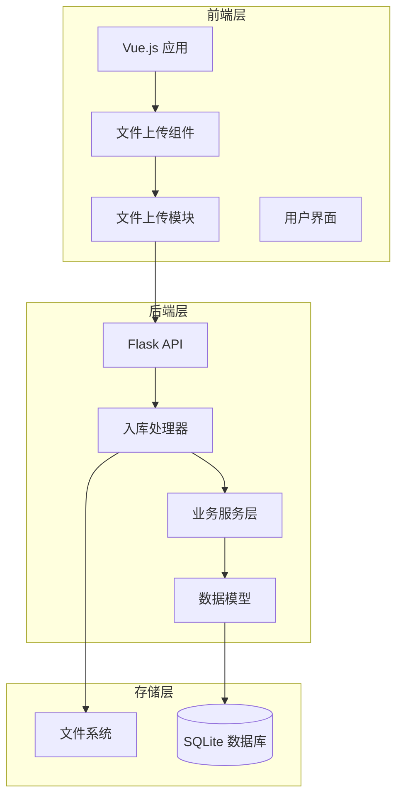
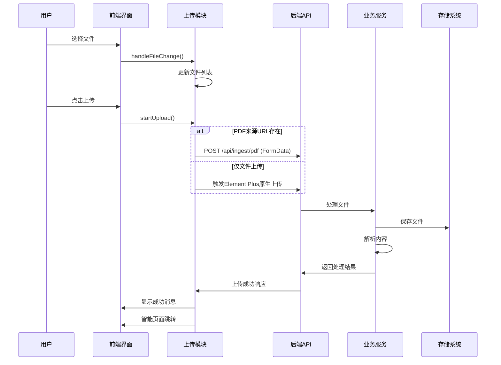
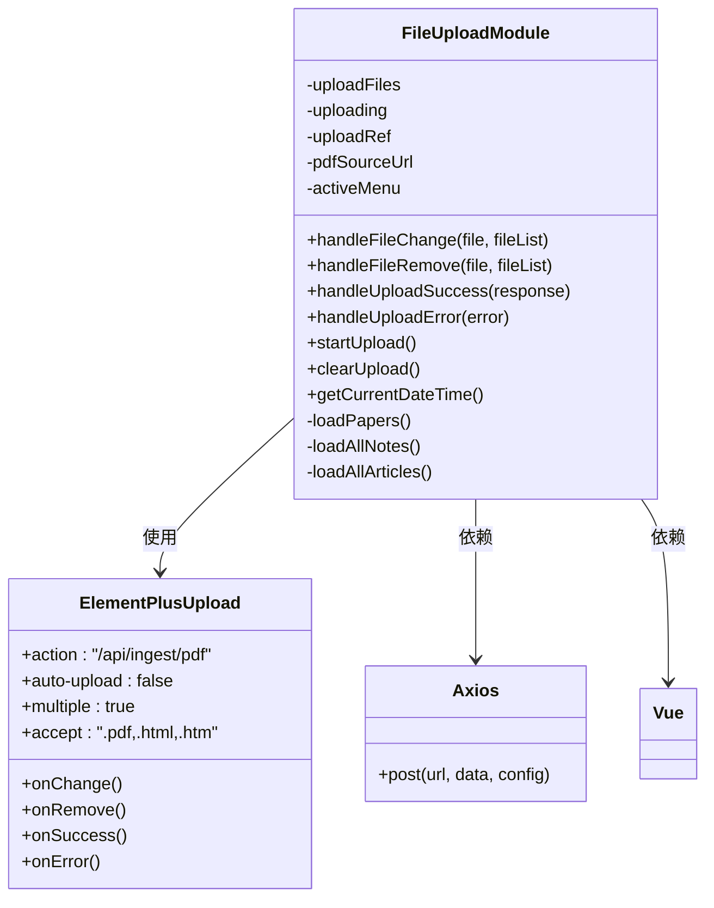
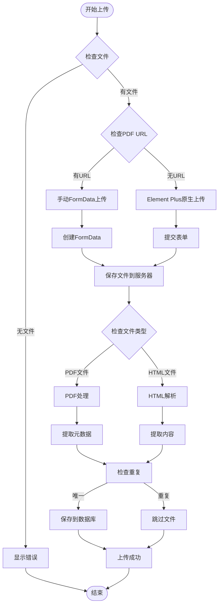
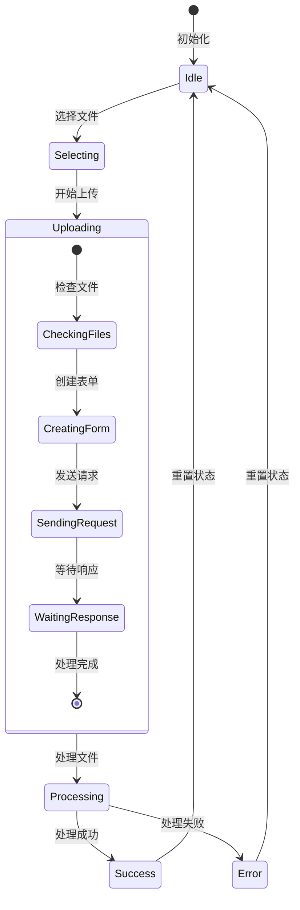
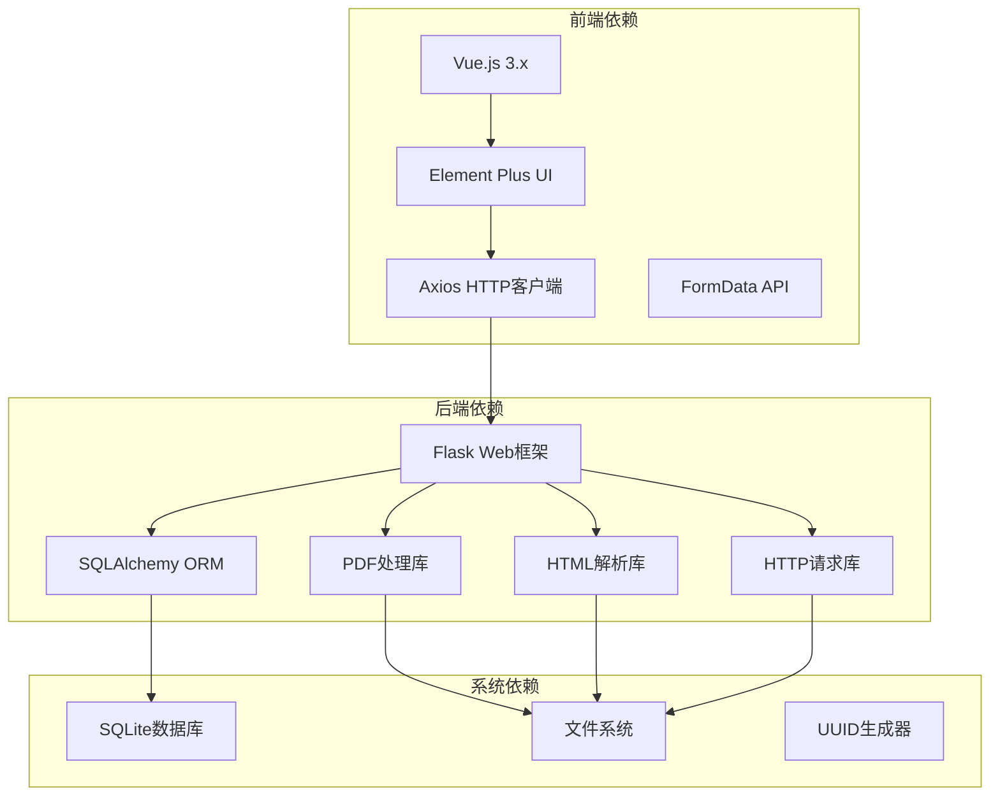

# 文件上传模块

<cite>
**本文档引用的文件**
- [fileUploadModule.js](file://frontend/src/modules/fileUploadModule.js)
- [fileUploadModule.yml](file://specs/frontend/modules/fileUploadModule.yml)
- [index.html](file://frontend/index.html)
- [ingest.py](file://backend/api/ingest.py)
- [papers.py](file://backend/api/papers.py)
- [pdf_processor.py](file://backend/services/pdf_processor.py)
- [deduplicator.py](file://backend/services/deduplicator.py)
- [article_deduplicator.py](file://backend/services/article_deduplicator.py)
- [wechat_parser.py](file://backend/services/wechat_parser.py)
- [config.py](file://backend/config.py)
- [paper.py](file://backend/models/paper.py)
</cite>

## 目录
1. [简介](#简介)
2. [项目结构](#项目结构)
3. [核心组件](#核心组件)
4. [架构概览](#架构概览)
5. [详细组件分析](#详细组件分析)
6. [依赖关系分析](#依赖关系分析)
7. [性能考虑](#性能考虑)
8. [故障排除指南](#故障排除指南)
9. [结论](#结论)

## 简介

PaperHub文件上传模块是一个完整的文件处理和上传系统，专门用于处理PDF和HTML文件的上传、解析和入库。该模块提供了用户友好的界面，支持多种文件格式，具备智能去重机制和灵活的上传策略。

## 项目结构

文件上传模块采用前后端分离的架构设计：

**图表来源**
- [fileUploadModule.js:1-110](file://frontend/src/modules/fileUploadModule.js#L1-L110)
- [ingest.py:1-1166](file://backend/api/ingest.py#L1-L1166)

**章节来源**
- [fileUploadModule.js:1-110](file://frontend/src/modules/fileUploadModule.js#L1-L110)
- [index.html:2113-2137](file://frontend/index.html#L2113-L2137)

## 核心组件

### 前端文件上传模块

文件上传模块是一个独立的Vue.js模块，提供完整的文件处理功能：

- **文件选择和预览**：支持拖拽上传和文件选择
- **多文件处理**：支持批量上传多个文件
- **智能上传策略**：支持手动FormData上传和Element Plus原生上传
- **状态管理**：完整的上传状态跟踪和错误处理
- **智能跳转**：根据上传结果自动跳转到相应页面

### 后端入库处理器

后端提供强大的文件处理能力：

- **文件验证**：严格的文件类型和大小验证
- **智能解析**：PDF文件元数据提取和HTML文件解析
- **去重机制**：防止重复文件入库
- **多格式支持**：PDF、HTML、HTM文件处理
- **错误恢复**：完善的异常处理和错误恢复机制

**章节来源**
- [fileUploadModule.yml:1-88](file://specs/frontend/modules/fileUploadModule.yml#L1-L88)
- [ingest.py:12-16](file://backend/api/ingest.py#L12-L16)

## 架构概览

文件上传系统采用分层架构设计，确保各层职责清晰：

**图表来源**
- [fileUploadModule.js:56-86](file://frontend/src/modules/fileUploadModule.js#L56-L86)
- [ingest.py:467-620](file://backend/api/ingest.py#L467-L620)

## 详细组件分析

### 文件上传模块类图

**图表来源**
- [fileUploadModule.js:4-109](file://frontend/src/modules/fileUploadModule.js#L4-L109)
- [index.html:2124-2136](file://frontend/index.html#L2124-L2136)

### 文件处理流程

文件上传和处理流程如下：

**图表来源**
- [fileUploadModule.js:56-86](file://frontend/src/modules/fileUploadModule.js#L56-L86)
- [ingest.py:467-620](file://backend/api/ingest.py#L467-L620)

### 支持的文件类型和限制

系统支持以下文件类型：

| 文件类型 | 扩展名 | 大小限制 | 处理方式 |
|---------|--------|----------|----------|
| PDF文档 | .pdf | 50MB | 元数据提取、全文解析 |
| HTML文件 | .html, .htm | 50MB | 内容提取、图片处理 |

**章节来源**
- [ingest.py:12-16](file://backend/api/ingest.py#L12-L16)
- [config.py:50-52](file://backend/config.py#L50-L52)

### 上传策略和并发控制

系统采用以下上传策略：

1. **智能上传模式**：
   - 手动FormData上传：当提供PDF来源URL时使用
   - 原生Element Plus上传：仅文件上传时使用

2. **并发控制**：
   - 单文件处理：逐个处理上传的文件
   - 事务管理：每个文件处理在独立事务中进行
   - 错误隔离：单个文件错误不影响其他文件处理

3. **去重策略**：
   - PDF文件：基于文件路径和内容检查
   - HTML文件：基于URL、标题和内容哈希检查

**章节来源**
- [fileUploadModule.js:62-85](file://frontend/src/modules/fileUploadModule.js#L62-L85)
- [deduplicator.py:79-112](file://backend/services/deduplicator.py#L79-L112)
- [article_deduplicator.py:134-172](file://backend/services/article_deduplicator.py#L134-L172)

### 状态管理和错误处理

系统提供完善的状态管理和错误处理机制：

**图表来源**
- [fileUploadModule.js:17-54](file://frontend/src/modules/fileUploadModule.js#L17-L54)

**章节来源**
- [fileUploadModule.js:17-54](file://frontend/src/modules/fileUploadModule.js#L17-L54)
- [ingest.py:602-610](file://backend/api/ingest.py#L602-L610)

## 依赖关系分析

文件上传模块的依赖关系如下：

**图表来源**
- [fileUploadModule.js:4-7](file://frontend/src/modules/fileUploadModule.js#L4-L7)
- [ingest.py:1-10](file://backend/api/ingest.py#L1-L10)

**章节来源**
- [paper.py:1-360](file://backend/models/paper.py#L1-L360)

## 性能考虑

### 文件处理性能

1. **PDF处理优化**：
   - 限制解析页数：默认只解析前50页
   - 内存管理：及时释放PDF解析资源
   - 元数据提取：智能识别标题、作者、摘要

2. **HTML处理优化**：
   - 图片本地化：自动下载并本地化图片资源
   - 内容清理：移除装饰性元素和无关内容
   - 标准化输出：生成统一格式的HTML文件

3. **并发处理**：
   - 单文件串行处理：避免数据库锁竞争
   - 异步错误处理：单个文件错误不影响整体流程
   - 连接池管理：数据库连接池优化

### 存储优化

1. **文件组织**：
   - UUID命名：避免文件名冲突
   - 目录结构：按文件类型分类存储
   - 清理机制：定期清理临时文件

2. **数据库优化**：
   - 索引策略：为常用查询字段建立索引
   - 事务管理：批量操作使用事务
   - 连接池：复用数据库连接

## 故障排除指南

### 常见问题和解决方案

1. **文件上传失败**
   - 检查文件类型是否受支持
   - 确认文件大小是否超过限制
   - 验证网络连接稳定性

2. **PDF解析错误**
   - 确认PDF文件完整性
   - 检查PDF密码保护状态
   - 验证PDF版本兼容性

3. **HTML解析问题**
   - 检查HTML文件编码格式
   - 确认网络资源可访问性
   - 验证HTML结构完整性

4. **数据库连接问题**
   - 检查数据库文件权限
   - 验证磁盘空间充足
   - 确认SQLite版本兼容

**章节来源**
- [ingest.py:475-480](file://backend/api/ingest.py#L475-L480)
- [config.py:50-52](file://backend/config.py#L50-L52)

### 调试和监控

系统提供以下调试和监控功能：

1. **前端调试**：
   - 控制台日志输出
   - 上传进度跟踪
   - 错误信息显示

2. **后端监控**：
   - 请求日志记录
   - 数据库操作日志
   - 文件处理统计

3. **性能监控**：
   - 处理时间统计
   - 内存使用监控
   - 磁盘空间监控

## 结论

PaperHub文件上传模块是一个功能完整、设计合理的文件处理系统。它提供了用户友好的界面、强大的文件处理能力和完善的错误处理机制。模块采用分层架构设计，具有良好的可维护性和扩展性。

主要特点包括：
- 支持多种文件格式的智能处理
- 完善的去重机制防止重复入库
- 灵活的上传策略适应不同使用场景
- 强大的错误处理和恢复能力
- 优化的性能表现和资源管理

该模块为PaperHub平台提供了可靠的文件上传和处理基础，为用户提供了优质的使用体验。