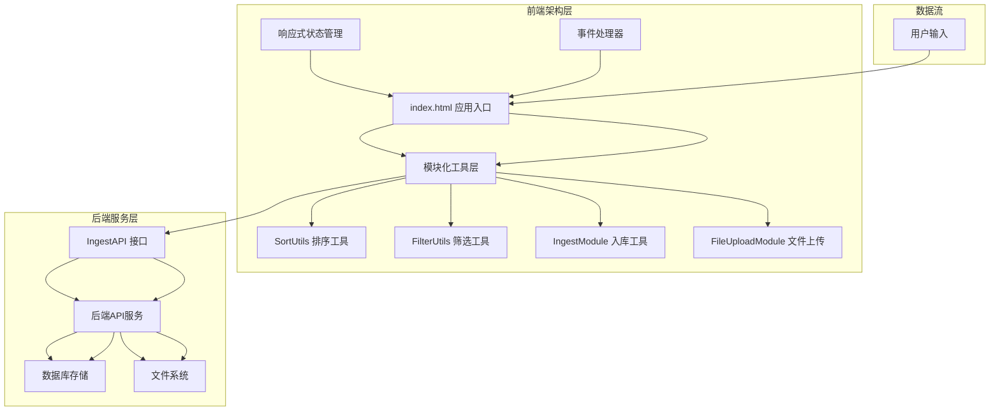
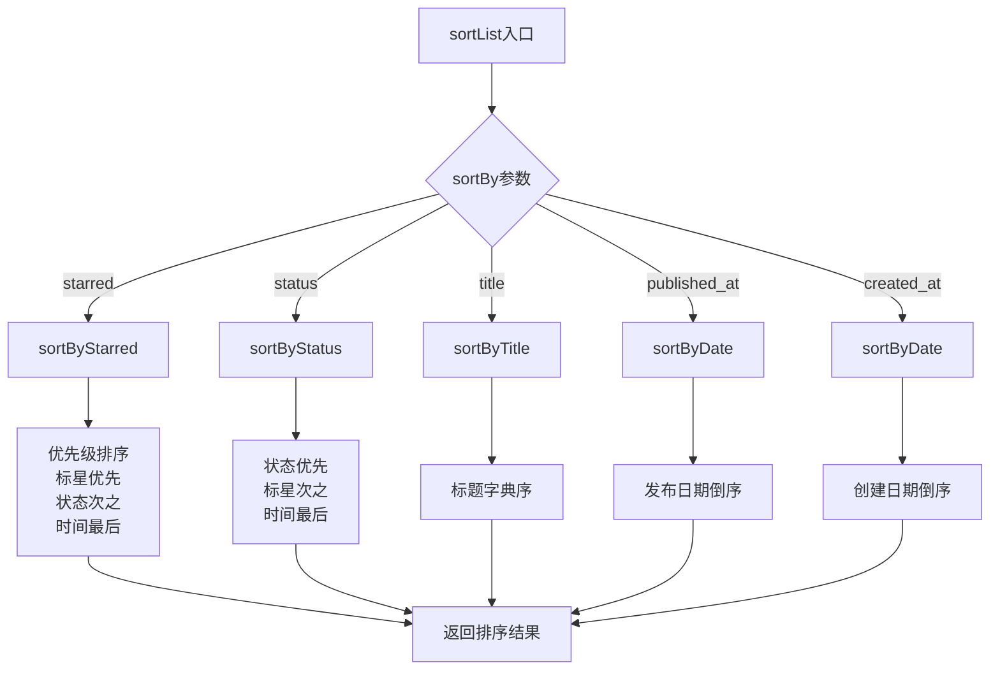
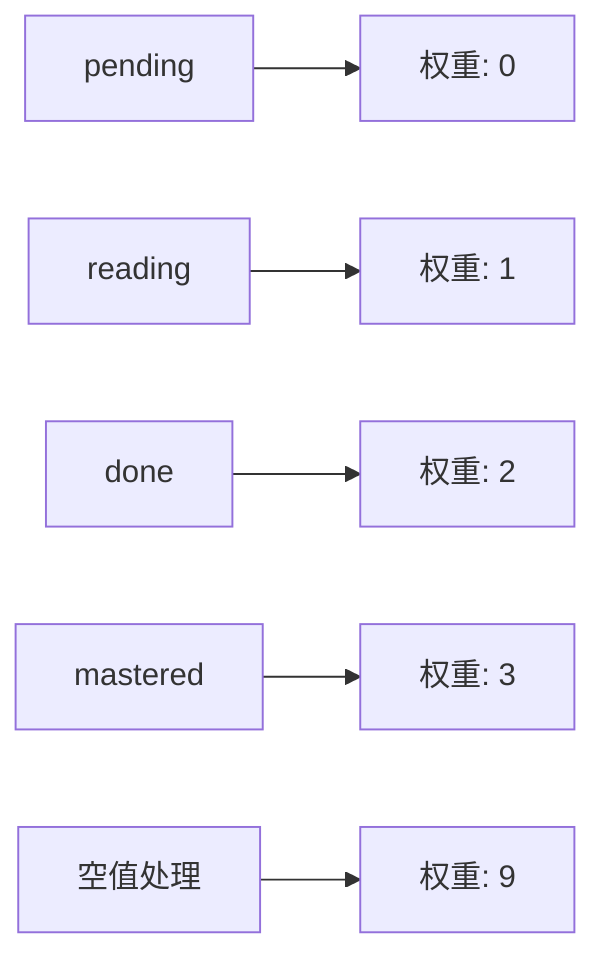
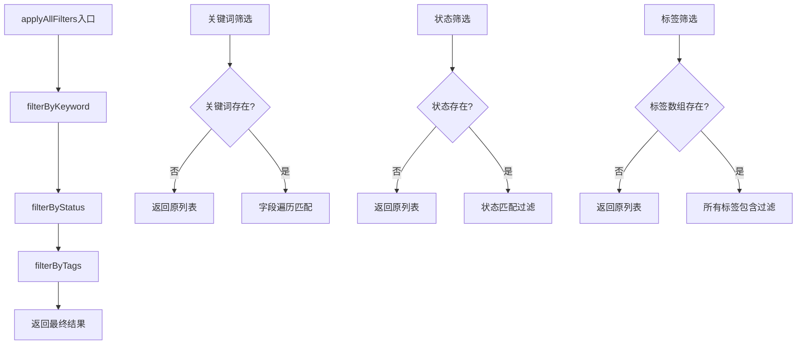
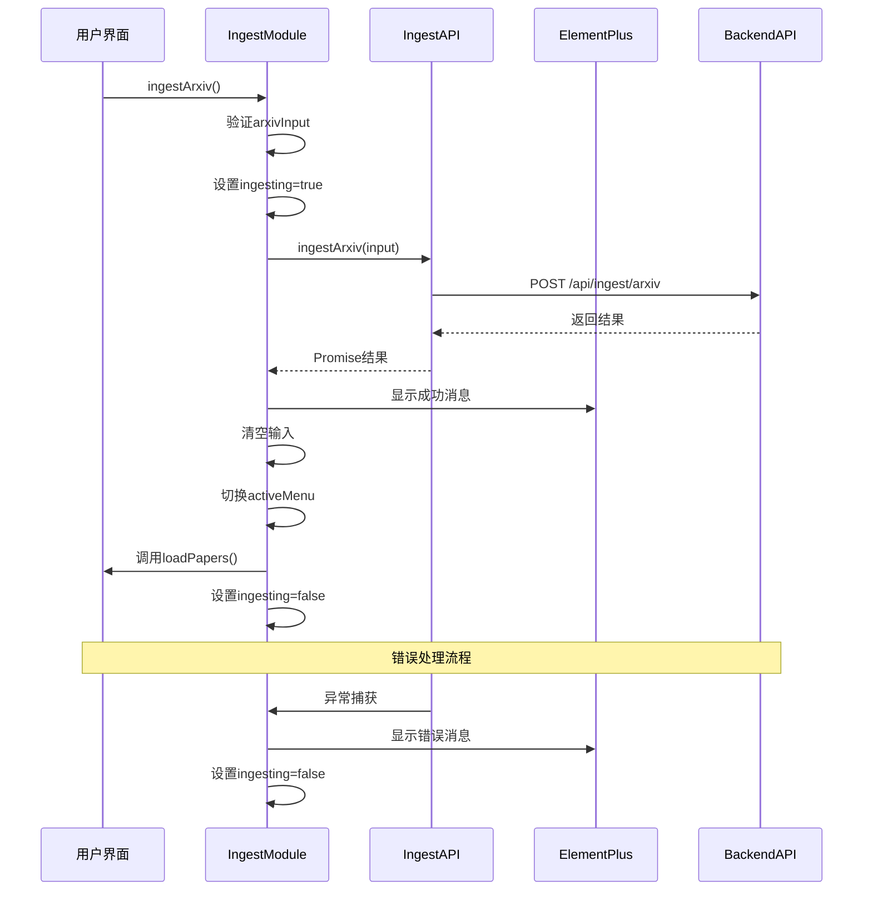
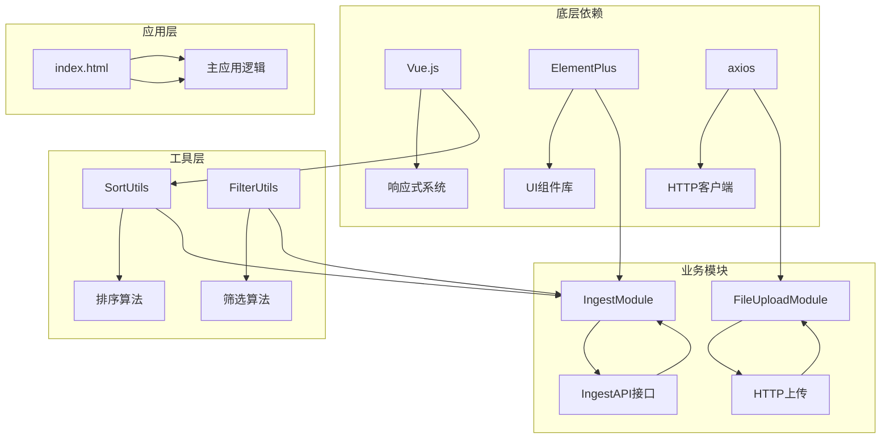

# 模块化工具设计

<cite>
**本文档引用的文件**
- [sortUtils.js](file://frontend/src/modules/sortUtils.js)
- [filterUtils.js](file://frontend/src/modules/filterUtils.js)
- [ingestModule.js](file://frontend/src/modules/ingestModule.js)
- [fileUploadModule.js](file://frontend/src/modules/fileUploadModule.js)
- [sortUtils.yml](file://specs/frontend/modules/sortUtils.yml)
- [filterUtils.yml](file://specs/frontend/modules/filterUtils.yml)
- [ingestModule.yml](file://specs/frontend/modules/ingestModule.yml)
- [fileUploadModule.yml](file://specs/frontend/modules/fileUploadModule.yml)
- [index.html](file://frontend/index.html)
- [ARCHITECTURE_AUDIT_V3.md](file://frontend/ARCHITECTURE_AUDIT_V3.md)
- [ingest.yml](file://specs/backend/api/ingest.yml)
- [ingest.py](file://backend/api/ingest.py)
</cite>

## 目录
1. [简介](#简介)
2. [项目结构](#项目结构)
3. [核心组件](#核心组件)
4. [架构概览](#架构概览)
5. [详细组件分析](#详细组件分析)
6. [依赖关系分析](#依赖关系分析)
7. [性能考虑](#性能考虑)
8. [故障排除指南](#故障排除指南)
9. [结论](#结论)
10. [附录](#附录)

## 简介

PaperHub前端模块化工具是一个高度模块化的JavaScript工具集合，专为PaperHub论文知识库系统设计。该系统实现了四个核心工具模块，旨在提供统一的数据处理、筛选和导入功能，支持论文库、文章库和笔记库的三库架构。

本设计文档深入解析了四个核心工具模块的设计思路和实现原理，包括排序工具模块、筛选工具模块、入库工具模块和文件上传模块。文档详细说明了每个模块的接口设计、参数规范、返回值格式和错误处理机制，并阐述了模块间的依赖关系、数据流转和复用策略。

## 项目结构

PaperHub前端模块化工具位于`frontend/src/modules/`目录下，采用模块化设计，每个工具模块都是独立的功能单元，具有清晰的职责边界和标准化的接口。

```mermaid
graph TB
subgraph "前端模块化架构"
A[index.html 主应用] --> B[sortUtils.js 排序工具]
A --> C[filterUtils.js 筛选工具]
A --> D[ingestModule.js 入库工具]
A --> E[fileUploadModule.js 文件上传]
F[sortUtils.yml 规范] --> B
G[filterUtils.yml 规范] --> C
H[ingestModule.yml 规范] --> D
I[fileUploadModule.yml 规范] --> E
J[ARCHITECTURE_AUDIT_V3.md 架构文档] --> A
end
subgraph "后端API层"
K[/api/ingest/pdf 后端接口] <- --> D
L[/api/ingest/arxiv 后端接口] <- --> D
M[/api/ingest/wechat 后端接口] <- --> D
end
B -.-> N[SortUtils 工具类]
C -.-> O[FilterUtils 工具类]
D -.-> P[IngestAPI 接口]
E -.-> Q[axios HTTP客户端]
```

**图表来源**
- [index.html:1-800](file://frontend/index.html#L1-L800)
- [sortUtils.js:1-53](file://frontend/src/modules/sortUtils.js#L1-L53)
- [filterUtils.js:1-107](file://frontend/src/modules/filterUtils.js#L1-L107)
- [ingestModule.js:1-48](file://frontend/src/modules/ingestModule.js#L1-L48)
- [fileUploadModule.js:1-110](file://frontend/src/modules/fileUploadModule.js#L1-L110)

**章节来源**
- [index.html:1-800](file://frontend/index.html#L1-L800)
- [ARCHITECTURE_AUDIT_V3.md:1-269](file://frontend/ARCHITECTURE_AUDIT_V3.md#L1-L269)

## 核心组件

PaperHub前端模块化工具包含四个核心组件，每个组件都实现了特定的功能领域：

### 排序工具模块 (SortUtils)
提供统一的列表排序逻辑，支持多种排序策略和自定义字段排序。

### 筛选工具模块 (FilterUtils)  
实现三库统一的筛选机制，支持状态筛选、关键词搜索、标签过滤和来源筛选。

### 入库工具模块 (IngestModule)
处理多源数据导入流程，支持arXiv论文导入和微信公众号文章导入。

### 文件上传模块 (FileUploadModule)
负责文件处理和上传功能，支持PDF和HTML文件的批量上传和智能路由。

**章节来源**
- [sortUtils.js:1-53](file://frontend/src/modules/sortUtils.js#L1-L53)
- [filterUtils.js:1-107](file://frontend/src/modules/filterUtils.js#L1-L107)
- [ingestModule.js:1-48](file://frontend/src/modules/ingestModule.js#L1-L48)
- [fileUploadModule.js:1-110](file://frontend/src/modules/fileUploadModule.js#L1-L110)

## 架构概览

PaperHub采用了混合式架构设计，结合了单体应用的完整性和模块化的优势。这种架构确保了三个核心库（论文库、文章库、笔记库）的高度一致性，同时保持了模块间的松耦合。



**图表来源**
- [index.html:1-800](file://frontend/index.html#L1-L800)
- [ARCHITECTURE_AUDIT_V3.md:11-34](file://frontend/ARCHITECTURE_AUDIT_V3.md#L11-L34)

### 架构特点

1. **三库同构设计**：论文库、文章库、笔记库采用完全相同的筛选逻辑和状态管理
2. **模块化复用**：核心工具函数在三个库中100%复用
3. **响应式统一**：全部使用computed响应式机制
4. **持久化机制**：排序偏好通过localStorage持久化
5. **渐进式演进**：混合式架构支持逐步模块化改造

**章节来源**
- [ARCHITECTURE_AUDIT_V3.md:50-164](file://frontend/ARCHITECTURE_AUDIT_V3.md#L50-L164)

## 详细组件分析

### 排序工具模块 (SortUtils)

SortUtils模块提供了统一的列表排序解决方案，支持多种排序策略以满足不同场景的需求。

#### 核心排序算法



**图表来源**
- [sortUtils.js:37-51](file://frontend/src/modules/sortUtils.js#L37-L51)

#### 排序优先级规则

| 排序类型 | 优先级顺序 | 次级规则 |
|---------|-----------|---------|
| starred | 标星优先 | 状态顺序 → 创建时间倒序 |
| status | 状态优先 | 标星优先 → 创建时间倒序 |
| title | 标题字典序 | 无 |
| published_at | 发布日期倒序 | 无 |
| created_at | 创建日期倒序 | 无 |

#### 状态权重映射



**图表来源**
- [sortUtils.js:3-14](file://frontend/src/modules/sortUtils.js#L3-L14)

**章节来源**
- [sortUtils.js:1-53](file://frontend/src/modules/sortUtils.js#L1-L53)
- [sortUtils.yml:1-91](file://specs/frontend/modules/sortUtils.yml#L1-L91)

### 筛选工具模块 (FilterUtils)

FilterUtils模块实现了三库统一的筛选机制，提供了完整的筛选工具集，支持复杂的多维筛选需求。

#### 筛选流程图



**图表来源**
- [filterUtils.js:52-58](file://frontend/src/modules/filterUtils.js#L52-L58)

#### 筛选功能矩阵

| 功能类型 | 输入参数 | 输出结果 | 特殊处理 |
|---------|---------|---------|---------|
| getStatusCount | list, status | 数量统计 | null返回总数 |
| toggleStatusFilter | currentValue, targetValue | 切换状态 | 相等则清除 |
| filterByStatus | list, selectedStatus | 过滤结果 | falsy返回原列表 |
| filterByKeyword | list, keyword, fields | 匹配结果 | 全小写匹配 |
| filterByTags | list, selectedTagIds | 标签过滤 | 全包含逻辑 |
| toggleTagFilter | selectedIds, tagId | 标签数组 | 不修改原数组 |
| applyAllFilters | list, options | 多重筛选结果 | 顺序执行 |
| getSourceCount | list, source, field | 来源统计 | null返回总数 |
| filterBySource | list, selectedSource, field | 来源过滤 | falsy返回原列表 |
| getNoteTypeCount | list, type | 类型统计 | paper/free/all |
| filterByNoteType | list, type | 类型过滤 | paper/free/all |

**章节来源**
- [filterUtils.js:1-107](file://frontend/src/modules/filterUtils.js#L1-L107)
- [filterUtils.yml:1-215](file://specs/frontend/modules/filterUtils.yml#L1-L215)

### 入库工具模块 (IngestModule)

IngestModule模块封装了多源数据导入操作，提供了统一的入库接口和错误处理机制。

#### 入库流程序列图



**图表来源**
- [ingestModule.js:9-24](file://frontend/src/modules/ingestModule.js#L9-L24)

#### 支持的入库源

| 入库源 | 接口方法 | 目标库 | 特殊参数 |
|-------|---------|-------|---------|
| arXiv论文 | ingestArxiv | 论文库 | arxiv_id/url |
| 微信公众号 | ingestWechat | 文章库 | url, extract_only |
| 对话笔记 | ingestNote | 笔记库 | title, source, content |
| 知乎专栏 | ingestZhihu | 文章库 | url, cookie |
| 通用网页 | ingestWeb | 文章库 | url, title, content |

**章节来源**
- [ingestModule.js:1-48](file://frontend/src/modules/ingestModule.js#L1-L48)
- [ingestModule.yml:1-34](file://specs/frontend/modules/ingestModule.yml#L1-L34)

### 文件上传模块 (FileUploadModule)

FileUploadModule模块负责文件处理和上传功能，支持多种文件格式和智能路由机制。

#### 文件上传流程

```mermaid
flowchart TD
A[startUpload入口] --> B{检查uploadFiles}
B --> |为空| C[直接返回]
B --> |有文件| D[设置uploading=true]
D --> E{检查pdfSourceUrl}
E --> |有URL| F[手动构建FormData]
E --> |无URL| G[调用Element Plus原生上传]
F --> H[遍历文件列表]
H --> I[添加file字段]
I --> J[添加pdf_url字段]
J --> K[POST /api/ingest/pdf]
G --> L[uploadRef.submit()]
K --> M{请求成功?}
L --> M
M --> |是| N[handleUploadSuccess]
M --> |否| O[handleUploadError]
N --> P[清空状态和文件]
N --> Q[智能路由跳转]
O --> R[显示错误消息]
P --> S[设置uploading=false]
Q --> S
R --> S
S --> T[返回]
```

**图表来源**
- [fileUploadModule.js:56-86](file://frontend/src/modules/fileUploadModule.js#L56-L86)

#### 上传模式对比

| 模式 | 适用场景 | 实现方式 | 优势 | 局限性 |
|------|---------|---------|------|-------|
| 手动FormData | PDF文件上传 | 手动构建FormData | 支持pdf_url参数 | 需要手动处理 |
| Element Plus原生 | HTML文件上传 | uploadRef.submit() | 简单易用 | 无法传递额外参数 |
| 智能路由 | 多库内容识别 | 根据响应结果判断 | 用户体验好 | 依赖后端返回结构 |

**章节来源**
- [fileUploadModule.js:1-110](file://frontend/src/modules/fileUploadModule.js#L1-L110)
- [fileUploadModule.yml:1-88](file://specs/frontend/modules/fileUploadModule.yml#L1-L88)

## 依赖关系分析

PaperHub模块化工具展现了清晰的依赖层次结构，从底层工具函数到高层业务逻辑形成了稳定的依赖链。



**图表来源**
- [index.html:1-800](file://frontend/index.html#L1-L800)
- [sortUtils.js:1-53](file://frontend/src/modules/sortUtils.js#L1-L53)
- [filterUtils.js:1-107](file://frontend/src/modules/filterUtils.js#L1-L107)
- [ingestModule.js:1-48](file://frontend/src/modules/ingestModule.js#L1-L48)
- [fileUploadModule.js:1-110](file://frontend/src/modules/fileUploadModule.js#L1-L110)

### 模块间协作模式

1. **工厂函数模式**：所有模块都采用工厂函数创建，注入依赖参数
2. **状态共享机制**：通过外部refs共享响应式状态，避免模块内状态管理
3. **接口抽象层**：通过IngestAPI等接口抽象，隔离具体实现细节
4. **事件驱动通信**：通过ElementPlus消息提示和状态更新实现松耦合通信

**章节来源**
- [ingestModule.js:4-7](file://frontend/src/modules/ingestModule.js#L4-L7)
- [fileUploadModule.js:4-7](file://frontend/src/modules/fileUploadModule.js#L4-L7)

## 性能考虑

PaperHub模块化工具在设计时充分考虑了性能优化，采用了多种策略来提升用户体验和系统效率。

### 性能优化策略

1. **响应式计算优化**
   - 使用computed属性避免重复计算
   - 通过localStorage缓存排序偏好
   - 按需渲染，减少DOM操作

2. **内存管理**
   - 所有排序函数返回新数组，避免修改原数组
   - 筛选操作采用惰性求值，只在需要时计算
   - 及时清理上传状态和文件引用

3. **网络请求优化**
   - 批量上传减少HTTP请求次数
   - 智能错误处理避免重复请求
   - 后端API超时控制防止长时间阻塞

4. **用户体验优化**
   - loading状态反馈
   - 成功/失败消息提示
   - 自动路由跳转减少用户操作

**章节来源**
- [ARCHITECTURE_AUDIT_V3.md:36-47](file://frontend/ARCHITECTURE_AUDIT_V3.md#L36-L47)

## 故障排除指南

### 常见问题及解决方案

#### 排序功能问题

**问题**：排序结果不符合预期
- 检查statusField参数是否正确
- 验证数据源中状态字段格式
- 确认created_at/published_at字段存在

**问题**：排序性能问题
- 确保使用computed属性而非直接计算
- 避免在排序函数中进行复杂操作
- 考虑数据分页处理大量数据

#### 筛选功能问题

**问题**：筛选结果为空
- 检查关键词是否正确大小写
- 验证字段名称是否匹配
- 确认数据源中字段存在

**问题**：标签筛选无效
- 检查标签ID格式
- 验证标签数组结构
- 确认标签存在于数据源中

#### 入库功能问题

**问题**：arXiv导入失败
- 验证arxiv_id格式
- 检查网络连接
- 确认后端服务可用

**问题**：微信公众号导入异常
- 检查URL有效性
- 验证extract_content_only参数
- 确认公众号可访问性

#### 文件上传问题

**问题**：上传失败
- 检查文件格式支持
- 验证文件大小限制
- 确认服务器磁盘空间

**问题**：智能路由错误
- 检查后端返回结构
- 验证results数组格式
- 确认各库标识符存在

**章节来源**
- [sortUtils.yml:88-91](file://specs/frontend/modules/sortUtils.yml#L88-L91)
- [filterUtils.yml:213-215](file://specs/frontend/modules/filterUtils.yml#L213-L215)
- [ingestModule.yml:30-34](file://specs/frontend/modules/ingestModule.yml#L30-L34)
- [fileUploadModule.yml:84-88](file://specs/frontend/modules/fileUploadModule.yml#L84-L88)

## 结论

PaperHub前端模块化工具设计体现了现代前端架构的最佳实践，通过四个核心模块的协同工作，实现了高度模块化、可复用和可维护的前端系统。

### 设计优势

1. **高度复用性**：SortUtils和FilterUtils在三个库中100%复用
2. **统一架构**：三库采用完全相同的筛选逻辑和状态管理
3. **模块化设计**：每个模块职责明确，接口标准化
4. **渐进式演进**：混合式架构支持逐步模块化改造
5. **用户体验**：智能路由和状态持久化提升用户体验

### 技术亮点

1. **响应式统一**：全部使用computed响应式机制
2. **状态持久化**：排序偏好通过localStorage持久化
3. **错误处理**：完善的错误处理和用户反馈机制
4. **性能优化**：多种性能优化策略确保系统高效运行

### 改进建议

1. **命名规范化**：统一论文库状态变量命名前缀
2. **模块化升级**：逐步采用动态import实现真正模块化
3. **文档完善**：补充详细的API文档和使用示例
4. **测试覆盖**：增加单元测试和集成测试覆盖率

## 附录

### API接口规范

#### 排序接口规范

| 接口名称 | 参数 | 返回值 | 用途 |
|---------|------|--------|------|
| sortByStarred | list, statusField | 排序后数组 | 标星优先排序 |
| sortByStatus | list, statusField | 排序后数组 | 状态优先排序 |
| sortByTitle | list | 排序后数组 | 标题字典序 |
| sortByDate | list, dateField | 排序后数组 | 日期倒序 |
| sortList | list, sortBy, statusField, dateField | 排序后数组 | 统一分发接口 |

#### 筛选接口规范

| 接口名称 | 参数 | 返回值 | 用途 |
|---------|------|--------|------|
| getStatusCount | list, status | 数量 | 状态计数 |
| toggleStatusFilter | currentValue, targetValue | 新状态 | 状态切换 |
| filterByStatus | list, selectedStatus | 过滤结果 | 状态筛选 |
| filterByKeyword | list, keyword, fields | 过滤结果 | 关键词搜索 |
| filterByTags | list, selectedTagIds | 过滤结果 | 标签筛选 |
| toggleTagFilter | selectedIds, tagId | 新数组 | 标签切换 |
| applyAllFilters | list, options | 最终结果 | 多重筛选 |
| getSourceCount | list, source, field | 数量 | 来源计数 |
| filterBySource | list, selectedSource, field | 过滤结果 | 来源筛选 |
| getNoteTypeCount | list, type | 数量 | 笔记类型计数 |
| filterByNoteType | list, type | 过滤结果 | 笔记类型筛选 |
| getTagCount | list, tagId | 数量 | 标签计数 |
| filterTagsForList | allTags, list | 有效标签 | 标签过滤 |

### 使用示例

#### 排序使用示例

```javascript
// 基础排序使用
const sortedList = SortUtils.sortList(data, 'starred');

// 自定义状态字段
const customSorted = SortUtils.sortList(data, 'status', 'reading_status');

// 标题排序
const titleSorted = SortUtils.sortByTitle(data);
```

#### 筛选使用示例

```javascript
// 多重筛选
const filtered = FilterUtils.applyAllFilters(data, {
    keyword: searchKeyword,
    selectedStatus: selectedStatus,
    selectedTagIds: selectedTagIds
});

// 标签切换
const newTagIds = FilterUtils.toggleTagFilter(selectedTagIds, tagId);

// 来源筛选
const sourceFiltered = FilterUtils.filterBySource(data, source, 'source_field');
```

#### 入库使用示例

```javascript
// arXiv论文入库
await ingestModule.ingestArxiv();

// 微信公众号文章入库
await ingestModule.ingestWechat();

// 配置选项
const options = {
    extract_content_only: false,
    download_images: true
};
```

#### 文件上传使用示例

```javascript
// 手动上传PDF
await fileUploadModule.startUpload();

// 清空上传状态
fileUploadModule.clearUpload();

// 获取当前时间
const now = fileUploadModule.getCurrentDateTime();
```

**章节来源**
- [sortUtils.yml:1-91](file://specs/frontend/modules/sortUtils.yml#L1-L91)
- [filterUtils.yml:1-215](file://specs/frontend/modules/filterUtils.yml#L1-L215)
- [ingestModule.yml:1-34](file://specs/frontend/modules/ingestModule.yml#L1-L34)
- [fileUploadModule.yml:1-88](file://specs/frontend/modules/fileUploadModule.yml#L1-L88)