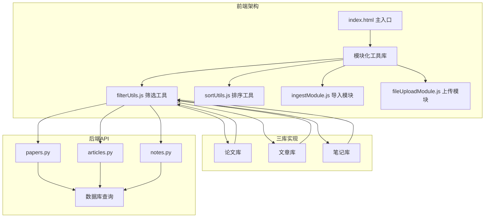
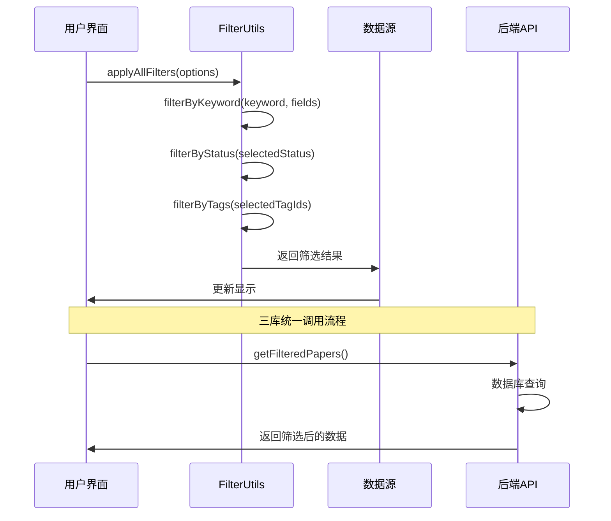
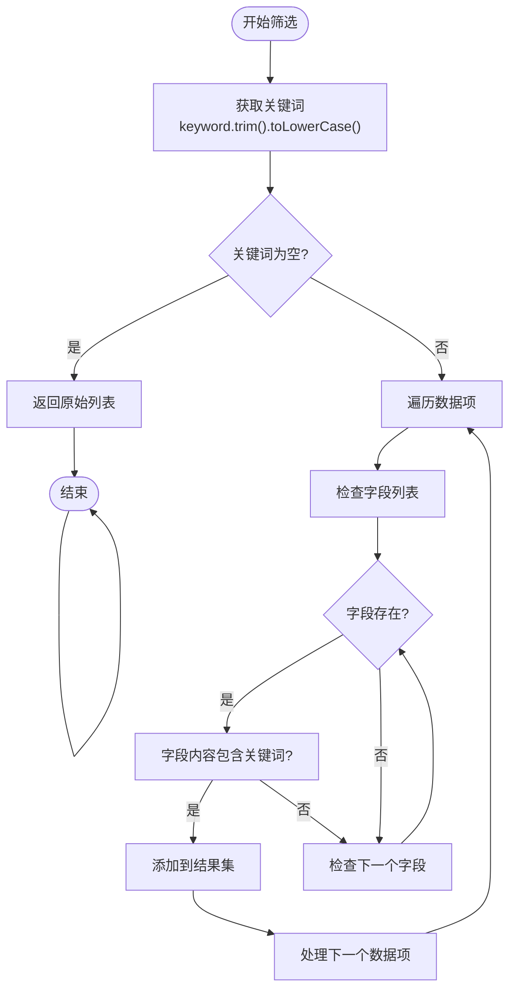
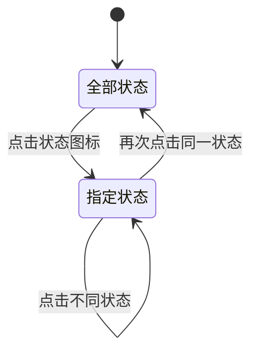
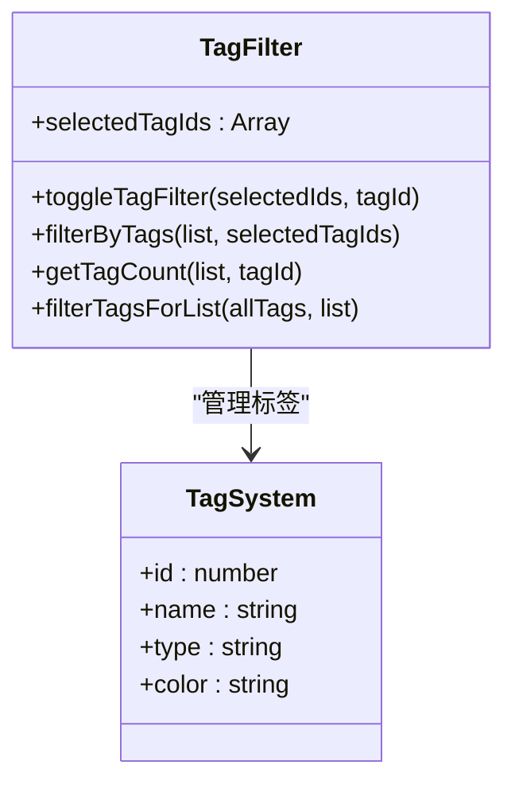
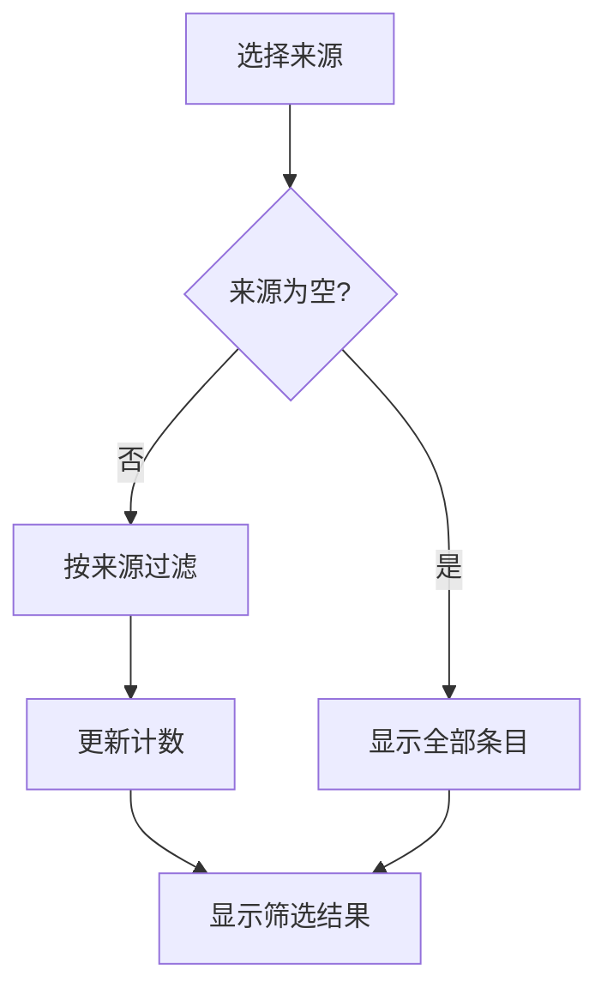
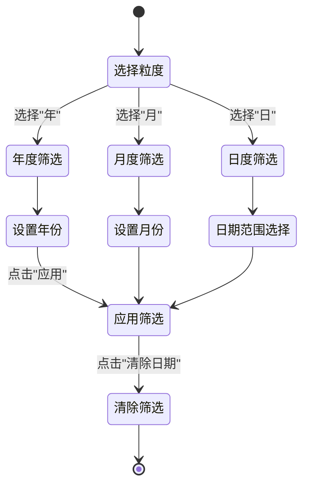
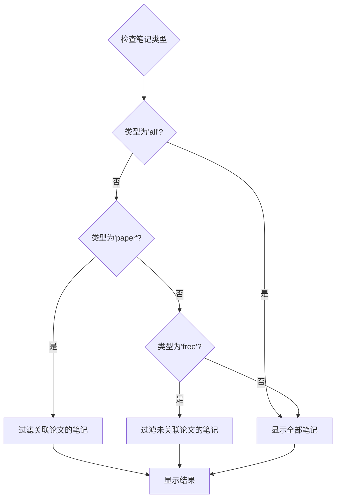
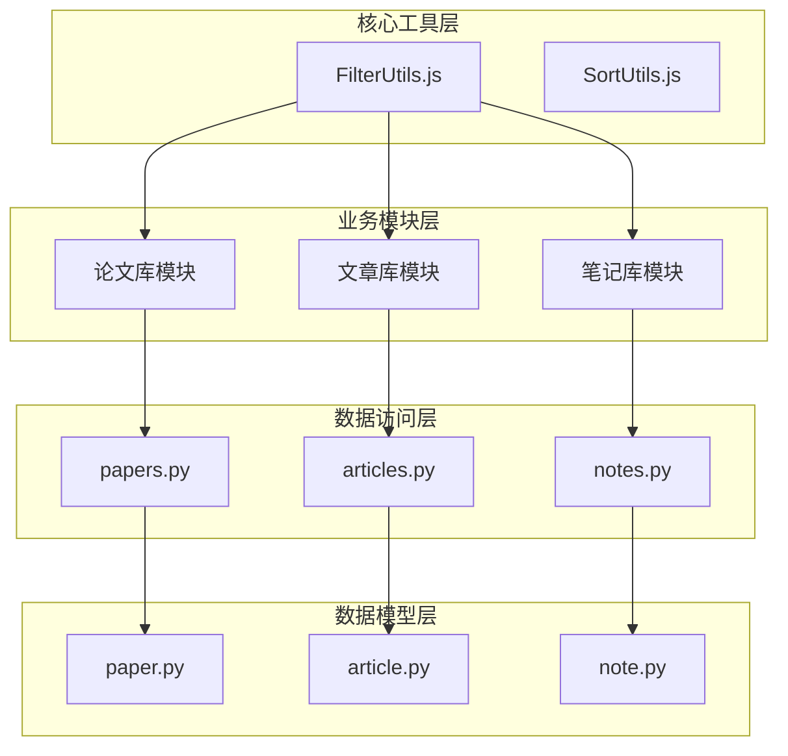
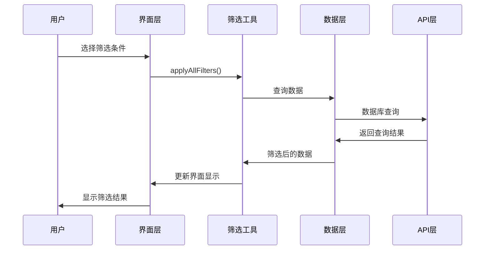

# 筛选工具模块

<cite>
**本文档引用的文件**
- [filterUtils.js](file://frontend/src/modules/filterUtils.js)
- [filterUtils.yml](file://specs/frontend/modules/filterUtils.yml)
- [ARCHITECTURE_AUDIT_V3.md](file://frontend/ARCHITECTURE_AUDIT_V3.md)
- [筛选区UX统一重构经验总结.md](file://docs/筛选区UX统一重构经验总结.md)
- [index.html](file://frontend/index.html)
- [papers.py](file://backend/api/papers.py)
- [paper.py](file://backend/models/paper.py)
- [search_service.py](file://backend/services/search_service.py)
</cite>

## 目录
1. [简介](#简介)
2. [项目结构](#项目结构)
3. [核心组件](#核心组件)
4. [架构概览](#架构概览)
5. [详细组件分析](#详细组件分析)
6. [依赖关系分析](#依赖关系分析)
7. [性能考虑](#性能考虑)
8. [故障排除指南](#故障排除指南)
9. [结论](#结论)
10. [附录](#附录)

## 简介

PaperHub筛选工具模块是一个高度复用的三库统一筛选系统，为论文库、文章库和笔记库提供一致的筛选体验。该模块实现了完整的筛选功能，包括阅读状态筛选、内容分类筛选、标签筛选、关键词搜索和日期筛选等核心功能。

该系统的核心设计理念是"三库同构"，即三个数据库使用完全相同的筛选逻辑和状态管理机制，确保用户在不同库之间切换时能够获得一致的筛选体验。通过将筛选逻辑抽象为独立的工具模块，实现了95%以上的代码复用率。

## 项目结构

筛选工具模块位于前端项目的模块化架构中，采用工具库模式设计：



**图表来源**
- [ARCHITECTURE_AUDIT_V3.md:15-34](file://frontend/ARCHITECTURE_AUDIT_V3.md#L15-L34)
- [filterUtils.js:1-107](file://frontend/src/modules/filterUtils.js#L1-L107)

**章节来源**
- [ARCHITECTURE_AUDIT_V3.md:11-34](file://frontend/ARCHITECTURE_AUDIT_V3.md#L11-L34)
- [filterUtils.js:1-107](file://frontend/src/modules/filterUtils.js#L1-L107)

## 核心组件

筛选工具模块包含以下核心组件：

### 1. 状态配置系统
- **阅读状态配置**：支持"全部"、"待读"、"在读"、"已读"、"精读"五种状态
- **来源配置**：针对不同库提供相应的来源选项
- **标签系统**：支持多标签组合筛选

### 2. 筛选算法引擎
- **关键词搜索**：支持多字段模糊匹配
- **状态筛选**：基于阅读状态的精确匹配
- **标签筛选**：支持多标签的交集筛选
- **来源筛选**：基于内容来源的分类筛选

### 3. 计数统计系统
- **状态计数**：实时统计各状态下的条目数量
- **标签计数**：统计标签的使用频率
- **来源计数**：统计各来源的内容数量

**章节来源**
- [filterUtils.js:3-9](file://frontend/src/modules/filterUtils.js#L3-L9)
- [filterUtils.js:11-14](file://frontend/src/modules/filterUtils.js#L11-L14)
- [filterUtils.js:60-63](file://frontend/src/modules/filterUtils.js#L60-L63)

## 架构概览

筛选系统采用分层架构设计，实现了逻辑复用和状态统一：



**图表来源**
- [filterUtils.js:52-58](file://frontend/src/modules/filterUtils.js#L52-L58)
- [index.html:3376-3396](file://frontend/index.html#L3376-L3396)

### 三库统一架构

系统实现了论文库、文章库、笔记库的完全统一：

| 功能维度 | 论文库 | 文章库 | 笔记库 | 统一程度 |
|---------|--------|--------|--------|----------|
| 状态结构 | ✅ 完全相同 | ✅ 完全相同 | ✅ 完全相同 | 100% |
| 筛选逻辑 | ✅ 完全相同 | ✅ 完全相同 | ✅ 完全相同 | 100% |
| UI结构 | ✅ 像素级一致 | ✅ 像素级一致 | ✅ 像素级一致 | 100% |
| 响应式机制 | ✅ 完全相同 | ✅ 完全相同 | ✅ 完全相同 | 100% |

**章节来源**
- [ARCHITECTURE_AUDIT_V3.md:52-100](file://frontend/ARCHITECTURE_AUDIT_V3.md#L52-L100)
- [ARCHITECTURE_AUDIT_V3.md:128-163](file://frontend/ARCHITECTURE_AUDIT_V3.md#L128-L163)

## 详细组件分析

### 1. 关键词筛选组件

关键词筛选是筛选系统的基础功能，支持多字段模糊匹配：



**图表来源**
- [filterUtils.js:25-34](file://frontend/src/modules/filterUtils.js#L25-L34)

**算法特点：**
- 支持多字段配置，默认字段包括标题、作者、内容
- 关键词预处理：去除空白字符并转换为小写
- 使用"包含"匹配而非精确匹配
- 性能优化：早期返回机制避免不必要的计算

**章节来源**
- [filterUtils.js:25-34](file://frontend/src/modules/filterUtils.js#L25-L34)
- [filterUtils.yml:46-66](file://specs/frontend/modules/filterUtils.yml#L46-L66)

### 2. 状态筛选组件

状态筛选支持五种阅读状态的精确匹配：

| 状态值 | 图标 | 描述 | 用途 |
|--------|------|------|------|
| null | 📚 | 全部状态 | 默认显示所有条目 |
| pending | ⏳ | 待读状态 | 新发现但未开始阅读 |
| reading | 📖 | 在读状态 | 正在阅读中 |
| done | ✅ | 已读状态 | 已完成阅读 |
| mastered | 🔥 | 精读状态 | 深度学习的重要内容 |

**状态切换逻辑：**



**图表来源**
- [filterUtils.js:16-18](file://frontend/src/modules/filterUtils.js#L16-L18)
- [filterUtils.js:20-23](file://frontend/src/modules/filterUtils.js#L20-L23)

**章节来源**
- [filterUtils.js:3-9](file://frontend/src/modules/filterUtils.js#L3-L9)
- [filterUtils.js:16-23](file://frontend/src/modules/filterUtils.js#L16-L23)

### 3. 标签筛选组件

标签筛选支持多标签的交集筛选，实现精确的内容分类：



**图表来源**
- [filterUtils.js:36-50](file://frontend/src/modules/filterUtils.js#L36-L50)
- [filterUtils.js:94-105](file://frontend/src/modules/filterUtils.js#L94-L105)

**筛选逻辑：**
- 多标签交集：只有同时包含所有选中标签的条目才会被保留
- 标签计数：统计每个标签在当前筛选结果中的出现次数
- 标签过滤：仅显示当前筛选结果中使用的标签

**章节来源**
- [filterUtils.js:36-50](file://frontend/src/modules/filterUtils.js#L36-L50)
- [filterUtils.yml:66-81](file://specs/frontend/modules/filterUtils.yml#L66-L81)

### 4. 来源筛选组件

来源筛选根据不同库的特点提供相应的分类选项：

| 库类型 | 支持的来源 | 字段名称 | 用途 |
|--------|------------|----------|------|
| 论文库 | arXiv、本地PDF | source | 论文来源分类 |
| 文章库 | 微信、知乎 | source | 文章来源分类 |
| 笔记库 | 论文笔记、自由笔记 | type | 笔记内容类型 |

**来源筛选流程：**



**图表来源**
- [filterUtils.js:69-72](file://frontend/src/modules/filterUtils.js#L69-L72)

**章节来源**
- [filterUtils.js:60-72](file://frontend/src/modules/filterUtils.js#L60-L72)
- [ARCHITECTURE_AUDIT_V3.md:95-97](file://frontend/ARCHITECTURE_AUDIT_V3.md#L95-L97)

### 5. 日期筛选组件

日期筛选提供了灵活的时间范围查询功能：



**图表来源**
- [index.html:155-215](file://frontend/index.html#L155-L215)

**日期筛选特性：**
- 支持年、月、日三种粒度
- 提供直观的输入界面
- 自动清除其他筛选条件
- 支持一键清除功能

**章节来源**
- [index.html:155-215](file://frontend/index.html#L155-L215)
- [index.html:3446-3483](file://frontend/index.html#L3446-L3483)

### 6. 笔记类型筛选组件

笔记库特有的类型筛选功能：

| 类型值 | 描述 | 筛选逻辑 |
|--------|------|----------|
| all | 全部笔记 | 显示所有笔记 |
| paper | 论文笔记 | 仅显示关联论文的笔记 |
| free | 自由笔记 | 仅显示未关联论文的笔记 |

**筛选实现：**



**图表来源**
- [filterUtils.js:84-92](file://frontend/src/modules/filterUtils.js#L84-L92)

**章节来源**
- [filterUtils.js:74-92](file://frontend/src/modules/filterUtils.js#L74-L92)
- [filterUtils.yml:161-188](file://specs/frontend/modules/filterUtils.yml#L161-L188)

## 依赖关系分析

筛选工具模块的依赖关系呈现星型拓扑结构，所有业务模块都依赖于核心筛选工具：



**图表来源**
- [ARCHITECTURE_AUDIT_V3.md:25-33](file://frontend/ARCHITECTURE_AUDIT_V3.md#L25-L33)
- [filterUtils.js:1-107](file://frontend/src/modules/filterUtils.js#L1-L107)

### 数据流分析

筛选系统的数据流遵循单向传递原则：



**图表来源**
- [index.html:3376-3396](file://frontend/index.html#L3376-L3396)
- [papers.py:29-108](file://backend/api/papers.py#L29-L108)

**章节来源**
- [ARCHITECTURE_AUDIT_V3.md:74-89](file://frontend/ARCHITECTURE_AUDIT_V3.md#L74-L89)
- [papers.py:29-108](file://backend/api/papers.py#L29-L108)

## 性能考虑

### 1. 算法复杂度分析

| 筛选类型 | 时间复杂度 | 空间复杂度 | 优化策略 |
|----------|------------|------------|----------|
| 关键词筛选 | O(n×m×k) | O(n) | 预处理关键词，缓存字段值 |
| 状态筛选 | O(n) | O(n) | 直接过滤，避免额外计算 |
| 标签筛选 | O(n×t) | O(n) | 使用Set提高查找效率 |
| 来源筛选 | O(n) | O(n) | 字符串比较优化 |
| 日期筛选 | O(n) | O(n) | 数据库层面索引优化 |

### 2. 缓存策略

- **标签缓存**：已选中标签ID数组的缓存
- **计数缓存**：各状态和标签的计数结果缓存
- **结果缓存**：最近一次筛选结果的临时缓存

### 3. 异步处理

- **批量操作**：支持多条目同时筛选
- **防抖处理**：关键词输入的防抖机制
- **懒加载**：大数据量时的分页加载

## 故障排除指南

### 1. 常见问题及解决方案

| 问题类型 | 症状描述 | 可能原因 | 解决方案 |
|----------|----------|----------|----------|
| 筛选无效 | 点击筛选按钮无反应 | 逻辑模块未同步更新 | 检查模板和逻辑模块的一致性 |
| 数据不匹配 | 筛选结果与预期不符 | 字段名称不匹配 | 验证字段映射关系 |
| 性能问题 | 筛选响应缓慢 | 算法效率低 | 优化筛选逻辑，增加缓存 |
| 状态异常 | 状态显示错误 | 状态管理混乱 | 重置状态，检查状态同步 |

### 2. 调试技巧

- **控制台日志**：在关键节点添加console.log输出
- **断点调试**：使用浏览器开发者工具设置断点
- **数据验证**：检查数据结构和字段完整性
- **网络监控**：观察API请求和响应情况

### 3. 最佳实践

- **一致性检查**：定期验证三库筛选逻辑的一致性
- **边界测试**：测试空值、特殊字符等边界情况
- **性能监控**：监控筛选操作的执行时间
- **错误处理**：完善的异常捕获和错误提示

**章节来源**
- [筛选区UX统一重构经验总结.md:129-148](file://docs/筛选区UX统一重构经验总结.md#L129-L148)

## 结论

PaperHub筛选工具模块通过精心设计的架构实现了三库统一的筛选体验。该系统的主要优势包括：

### 核心成就

1. **完全同构设计**：论文库、文章库、笔记库使用完全相同的筛选逻辑
2. **高度复用性**：95%以上的筛选逻辑代码实现100%复用
3. **用户体验统一**：三库的筛选界面和交互完全一致
4. **扩展性强**：模块化设计便于功能扩展和维护

### 技术亮点

- **分层架构**：清晰的职责分离和依赖关系
- **性能优化**：合理的算法选择和缓存策略
- **错误处理**：完善的异常捕获和恢复机制
- **持久化支持**：筛选状态的本地存储和恢复

### 改进建议

1. **命名规范化**：统一状态变量的命名前缀
2. **字段标准化**：统一来源字段的命名规范
3. **文档完善**：补充详细的API文档和使用说明
4. **测试覆盖**：增加单元测试和集成测试

该筛选系统为PaperHub项目提供了坚实的数据筛选基础，为用户提供了高效、一致的使用体验。

## 附录

### 使用示例

#### 基础筛选示例
```javascript
// 创建筛选配置
const filterOptions = {
    keyword: '机器学习',
    selectedStatus: 'pending',
    selectedTagIds: [1, 3, 5],
    keywordFields: ['title', 'author']
};

// 应用筛选
const filteredResults = FilterUtils.applyAllFilters(dataList, filterOptions);
```

#### 高级筛选示例
```javascript
// 多步骤筛选
let result = FilterUtils.filterByKeyword(dataList, '深度学习');
result = FilterUtils.filterByStatus(result, 'reading');
result = FilterUtils.filterByTags(result, [2, 4]);
result = FilterUtils.filterBySource(result, 'arxiv');
```

### 扩展方法

#### 添加新的筛选类型
1. 在FilterUtils中添加新的筛选函数
2. 更新applyAllFilters函数的调用顺序
3. 在UI层添加对应的筛选控件
4. 实现相应的计数和状态管理

#### 自定义字段筛选
```javascript
// 扩展关键词搜索字段
const customFields = ['title', 'author', 'abstract', 'journal'];
const filteredData = FilterUtils.filterByKeyword(dataList, keyword, customFields);
```

**章节来源**
- [filterUtils.js:52-58](file://frontend/src/modules/filterUtils.js#L52-L58)
- [filterUtils.yml:95-109](file://specs/frontend/modules/filterUtils.yml#L95-L109)