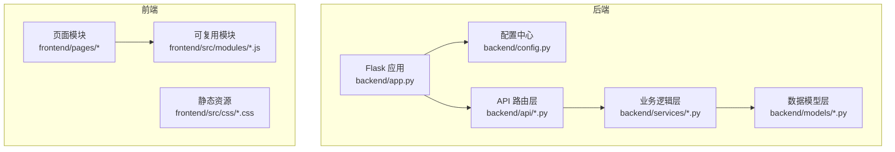
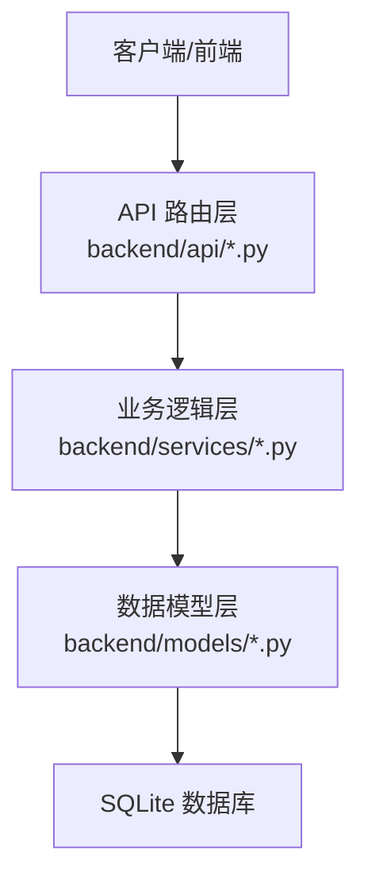
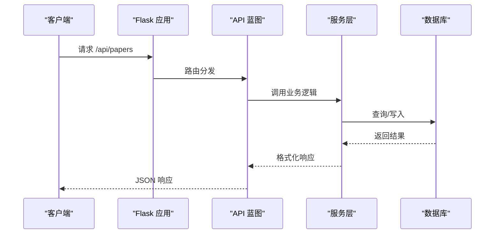
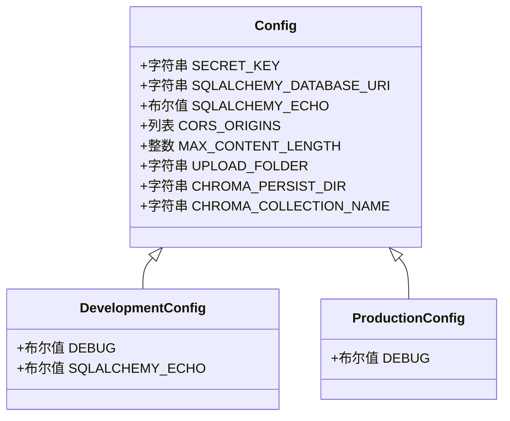
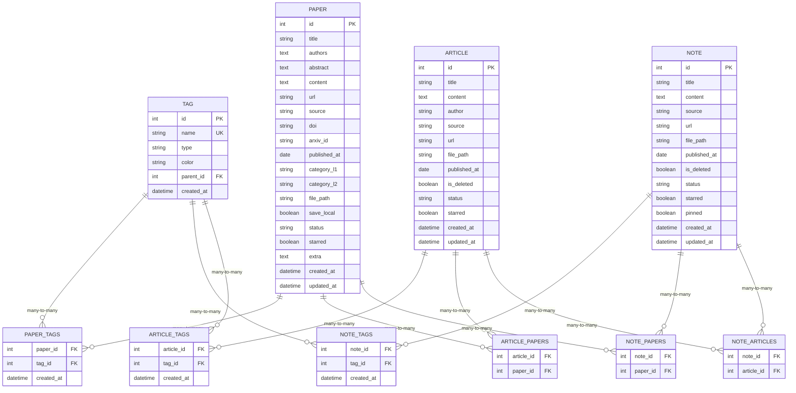
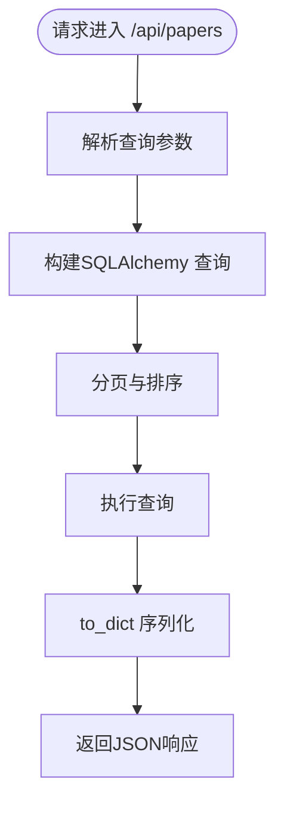
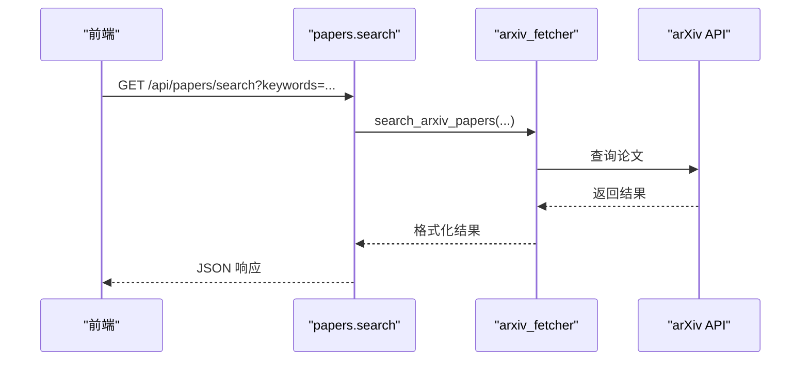
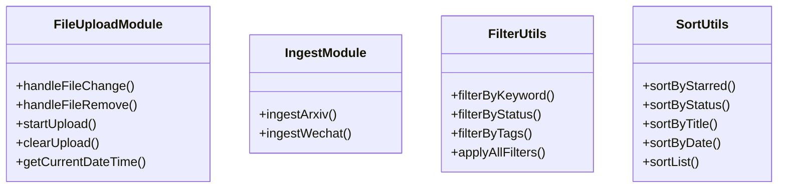
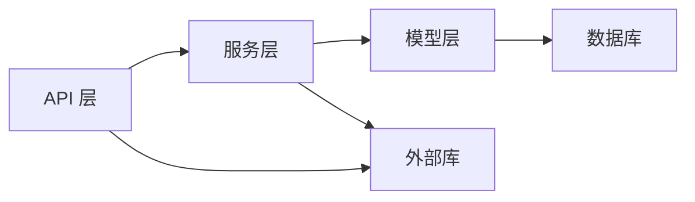

# 代码规范和最佳实践

<cite>
**本文档引用的文件**
- [backend/app.py](file://backend/app.py)
- [backend/config.py](file://backend/config.py)
- [backend/models/paper.py](file://backend/models/paper.py)
- [backend/api/papers.py](file://backend/api/papers.py)
- [backend/api/notes.py](file://backend/api/notes.py)
- [backend/api/articles.py](file://backend/api/articles.py)
- [backend/services/arxiv_fetcher.py](file://backend/services/arxiv_fetcher.py)
- [frontend/src/modules/fileUploadModule.js](file://frontend/src/modules/fileUploadModule.js)
- [frontend/src/modules/ingestModule.js](file://frontend/src/modules/ingestModule.js)
- [frontend/src/modules/filterUtils.js](file://frontend/src/modules/filterUtils.js)
- [frontend/src/modules/sortUtils.js](file://frontend/src/modules/sortUtils.js)
- [specs/architecture.spec.md](file://specs/architecture.spec.md)
- [CHECKLIST.md](file://CHECKLIST.md)
- [frontend/README.md](file://frontend/README.md)
- [backend/README.md](file://backend/README.md)
</cite>

## 目录
1. [简介](#简介)
2. [项目结构](#项目结构)
3. [核心组件](#核心组件)
4. [架构概览](#架构概览)
5. [详细组件分析](#详细组件分析)
6. [依赖分析](#依赖分析)
7. [性能考虑](#性能考虑)
8. [故障排查指南](#故障排查指南)
9. [结论](#结论)
10. [附录](#附录)

## 简介
本指南面向PaperHub项目的开发团队，提供统一的代码规范与最佳实践，涵盖后端Python/Flask、SQLAlchemy ORM使用，以及前端JavaScript/Vue 3模块化开发。内容基于现有代码库进行提炼与规范化，确保一致性、可维护性与可扩展性。

## 项目结构
PaperHub采用前后端分离架构，后端以Flask为核心，采用三层分层（API路由层、业务逻辑层、数据模型层），前端采用模块化组织，遵循“页面级代码 + 可复用模块”的职责划分。

图表来源
- [specs/architecture.spec.md:1-83](file://specs/architecture.spec.md#L1-L83)

章节来源
- [specs/architecture.spec.md:1-83](file://specs/architecture.spec.md#L1-L83)
- [backend/README.md:50-71](file://backend/README.md#L50-L71)
- [frontend/README.md:1-4](file://frontend/README.md#L1-L4)

## 核心组件
- 后端应用与中间件
  - Flask应用创建、CORS配置、全局异常处理、静态资源路由、数据库初始化与会话管理。
- 配置与数据库
  - 配置类、全局Engine与scoped_session、目录结构与数据持久化策略。
- 数据模型与ORM
  - 论文、文章、笔记、标签及多对多关联模型；to_dict序列化与关系懒加载。
- API路由层
  - 论文、文章、笔记的CRUD与批量操作；arXiv搜索与导入；微信/知乎入库；备份与恢复等。
- 业务服务层
  - arXiv抓取、PDF处理、LLM客户端、去重与解析等。
- 前端模块
  - 文件上传、入库、筛选与排序工具模块，遵循统一命名与职责划分。

章节来源
- [backend/app.py:41-137](file://backend/app.py#L41-L137)
- [backend/config.py:35-134](file://backend/config.py#L35-L134)
- [backend/models/paper.py:93-360](file://backend/models/paper.py#L93-L360)
- [backend/api/papers.py:1-822](file://backend/api/papers.py#L1-L822)
- [backend/api/notes.py:1-595](file://backend/api/notes.py#L1-L595)
- [backend/api/articles.py:1-482](file://backend/api/articles.py#L1-L482)
- [backend/services/arxiv_fetcher.py:1-324](file://backend/services/arxiv_fetcher.py#L1-L324)
- [frontend/src/modules/fileUploadModule.js:1-110](file://frontend/src/modules/fileUploadModule.js#L1-L110)
- [frontend/src/modules/ingestModule.js:1-48](file://frontend/src/modules/ingestModule.js#L1-L48)
- [frontend/src/modules/filterUtils.js:1-107](file://frontend/src/modules/filterUtils.js#L1-L107)
- [frontend/src/modules/sortUtils.js:1-53](file://frontend/src/modules/sortUtils.js#L1-L53)

## 架构概览
PaperHub采用经典的分层架构，严格禁止跨层依赖，API层只做参数校验与调用服务层，服务层负责复杂业务与外部交互，模型层仅做数据映射与基础查询。

图表来源
- [specs/architecture.spec.md:21-77](file://specs/architecture.spec.md#L21-L77)

章节来源
- [specs/architecture.spec.md:21-77](file://specs/architecture.spec.md#L21-L77)

## 详细组件分析

### 后端应用与中间件
- 应用创建与路由
  - 使用蓝图注册API，支持静态资源与健康检查路由。
  - 统一CORS配置，允许跨域访问。
- 全局异常处理
  - 统一返回JSON错误响应，区分HTTPException与未捕获异常。
  - 扫描请求过滤，避免日志噪音。
- 数据库初始化
  - 创建表结构，初始化标签数据，支持迁移提示。

图表来源
- [backend/app.py:140-157](file://backend/app.py#L140-L157)
- [backend/api/papers.py:29-108](file://backend/api/papers.py#L29-L108)

章节来源
- [backend/app.py:41-137](file://backend/app.py#L41-L137)
- [backend/app.py:140-157](file://backend/app.py#L140-L157)

### 配置与数据库连接
- 配置管理
  - 基础配置、开发/生产配置、CORS白名单、文件上传大小限制。
- 数据库连接
  - 全局Engine与scoped_session，连接池参数与回收策略，线程安全会话管理。
- 目录结构
  - data/papers、db、vectors、backups等目录的创建与用途。

图表来源
- [backend/config.py:35-74](file://backend/config.py#L35-L74)

章节来源
- [backend/config.py:35-134](file://backend/config.py#L35-L134)

### 数据模型与ORM使用规范
- 模型设计
  - 标签、论文、文章、笔记、版本、微信订阅等模型。
  - 多对多关联表通过Table定义，避免额外实体类。
- 序列化
  - to_dict方法支持include_*参数，控制关联数据输出。
- 关系与懒加载
  - 关系属性在访问时才加载，避免N+1查询。

图表来源
- [backend/models/paper.py:18-87](file://backend/models/paper.py#L18-L87)
- [backend/models/paper.py:93-360](file://backend/models/paper.py#L93-L360)

章节来源
- [backend/models/paper.py:18-360](file://backend/models/paper.py#L18-L360)

### API路由层规范
- 论文API
  - 列表分页、筛选（分类、状态、星标、来源、日期范围、标签）、详情、更新、删除、标签管理、arXiv搜索与导入、批量更新。
- 文章API
  - 列表、详情、创建、更新、删除、关联论文与标签、批量操作。
- 笔记API
  - 列表、详情、创建、更新、删除、关联论文/文章/标签、批量操作。
- 统一返回格式
  - 成功：2xx + JSON；错误：4xx/5xx + JSON；统一字段error/type/message/results等。

图表来源
- [backend/api/papers.py:29-108](file://backend/api/papers.py#L29-L108)

章节来源
- [backend/api/papers.py:29-822](file://backend/api/papers.py#L29-L822)
- [backend/api/articles.py:28-482](file://backend/api/articles.py#L28-L482)
- [backend/api/notes.py:25-595](file://backend/api/notes.py#L25-L595)

### 业务服务层规范
- arXiv抓取
  - 输入解析、搜索、分类、时间范围过滤、PDF下载、文本提取。
- PDF处理
  - 通用PDF下载、文件路径管理、重复检测。
- LLM客户端
  - 多提供商支持、温度参数、持久化存储。
- 去重与解析
  - 基于URL、标题哈希、内容相似度的去重策略。

图表来源
- [backend/api/papers.py:475-552](file://backend/api/papers.py#L475-L552)
- [backend/services/arxiv_fetcher.py:123-227](file://backend/services/arxiv_fetcher.py#L123-L227)

章节来源
- [backend/services/arxiv_fetcher.py:1-324](file://backend/services/arxiv_fetcher.py#L1-L324)

### 前端模块化与Vue 3组件设计
- 模块职责
  - fileUploadModule.js：文件上传、入库、消息提示与菜单跳转。
  - ingestModule.js：arXiv与微信入库入口。
  - filterUtils.js：关键词、状态、标签、来源筛选与计数。
  - sortUtils.js：多维度排序策略（标星、状态、标题、时间）。
- 命名与风格
  - 模块文件snake_case命名；工具函数内部采用小驼峰；组件采用帕斯卡命名。
  - 全闭合标签，保持一致的HTML结构。

图表来源
- [frontend/src/modules/fileUploadModule.js:4-109](file://frontend/src/modules/fileUploadModule.js#L4-L109)
- [frontend/src/modules/ingestModule.js:4-47](file://frontend/src/modules/ingestModule.js#L4-L47)
- [frontend/src/modules/filterUtils.js:2-106](file://frontend/src/modules/filterUtils.js#L2-L106)
- [frontend/src/modules/sortUtils.js:2-52](file://frontend/src/modules/sortUtils.js#L2-L52)

章节来源
- [frontend/src/modules/fileUploadModule.js:1-110](file://frontend/src/modules/fileUploadModule.js#L1-L110)
- [frontend/src/modules/ingestModule.js:1-48](file://frontend/src/modules/ingestModule.js#L1-L48)
- [frontend/src/modules/filterUtils.js:1-107](file://frontend/src/modules/filterUtils.js#L1-L107)
- [frontend/src/modules/sortUtils.js:1-53](file://frontend/src/modules/sortUtils.js#L1-L53)
- [frontend/README.md:1-4](file://frontend/README.md#L1-L4)

## 依赖分析
- 层间依赖
  - API层依赖服务层；服务层依赖模型层；模型层不反向依赖其他层。
- 外部依赖
  - Flask、SQLAlchemy、arxiv、requests、fitz等。
- 会话与连接
  - 全局scoped_session确保线程安全；请求结束清理会话。

图表来源
- [specs/architecture.spec.md:74-77](file://specs/architecture.spec.md#L74-L77)
- [backend/config.py:105-134](file://backend/config.py#L105-L134)

章节来源
- [specs/architecture.spec.md:74-77](file://specs/architecture.spec.md#L74-L77)
- [backend/config.py:85-134](file://backend/config.py#L85-L134)

## 性能考虑
- 查询优化
  - 使用分页与索引字段（created_at、published_at等）；避免一次性加载所有数据。
  - 多条件筛选时，优先使用数据库层面过滤，减少Python侧处理。
- 会话与连接
  - 使用全局scoped_session与连接池，避免频繁创建销毁连接。
  - 请求结束调用remove()清理线程会话。
- 前端交互
  - 搜索建议增加防抖与AbortController，减少网络请求。
  - LRU缓存命中时直接返回，避免重复请求。
- 文件处理
  - PDF下载与图片本地化，注意磁盘IO与路径校验，防止路径穿越。

## 故障排查指南
- 全局异常处理
  - 未捕获异常统一返回JSON；HTTPException按原状态码返回；扫描请求特征过滤日志。
- 数据库异常
  - 事务回滚与错误信息返回；批量操作记录成功/失败明细。
- 文件清理
  - 删除论文/文章/笔记时，同步清理本地文件与图片；异常捕获不影响主流程。
- 日志与监控
  - ScanFilter过滤扫描日志；全局异常处理器区分NotFound与其它异常。

章节来源
- [backend/app.py:70-89](file://backend/app.py#L70-L89)
- [backend/api/notes.py:190-228](file://backend/api/notes.py#L190-L228)
- [backend/api/articles.py:175-216](file://backend/api/articles.py#L175-L216)
- [backend/api/papers.py:256-295](file://backend/api/papers.py#L256-L295)

## 结论
本指南总结了PaperHub项目在后端Flask/SQLAlchemy与前端Vue 3模块化方面的规范与最佳实践，强调分层架构、统一命名、错误处理与性能优化。建议在后续迭代中持续遵循这些规范，并结合实际需求补充安全与可观测性措施。

## 附录

### 命名约定
- 后端
  - 模块文件：snake_case（如papers.py、arxiv_fetcher.py）
  - 类名：PascalCase（如Paper、Tag、WechatSubscription）
  - 变量/函数：snake_case（如get_session、search_arxiv_papers）
- 前端
  - 模块文件：snake_case（如fileUploadModule.js、filterUtils.js）
  - 工具函数：小驼峰（如getCurrentDateTime、applyAllFilters）
  - 组件：PascalCase（如Library、PaperDetail）

章节来源
- [specs/architecture.spec.md:23-67](file://specs/architecture.spec.md#L23-L67)
- [frontend/README.md:1-4](file://frontend/README.md#L1-L4)

### 注释规范
- 模块头部注释：简述模块职责与功能范围。
- 函数/方法注释：说明输入参数、返回值、异常情况与调用示例。
- 关键逻辑注释：解释复杂算法或业务规则的实现思路。
- TODO/FIXME注释：明确待办事项与修复计划。

### 错误处理策略
- API层：统一返回JSON错误结构，包含错误类型与描述。
- 服务层：捕获并转换异常，提供上下文信息与回滚。
- 前端：根据响应状态与错误信息展示提示，必要时重试或引导用户操作。

### 代码审查标准
- 目录结构：严格遵循specs/architecture.spec.md的分层与职责划分。
- 依赖关系：禁止跨层反向依赖，API层不得直接写业务逻辑。
- 可维护性：函数长度适中、单一职责、命名清晰、注释完整。
- 性能：避免N+1查询、合理使用分页与索引、前端请求节流与缓存。
- 安全：输入校验、路径安全、CORS白名单、异常不泄露敏感信息。

### 安全编码实践
- 输入校验：对所有外部输入进行类型与范围校验。
- 路径安全：文件操作前进行绝对路径与目录归属校验，防止路径穿越。
- CORS配置：仅允许可信域名，避免通配符暴露。
- 异常处理：不向客户端暴露内部堆栈与敏感信息。

### 设计模式与架构约束
- 分层架构：API → 服务 → 模型，职责清晰、耦合度低。
- 单一职责：每个模块专注一个业务领域，避免“上帝类”。
- 依赖注入：通过蓝图与模块导入实现松耦合。
- 架构约束：禁止跨层依赖，新增模块必须放入对应目录。

章节来源
- [specs/architecture.spec.md:74-83](file://specs/architecture.spec.md#L74-L83)
- [CHECKLIST.md:1-726](file://CHECKLIST.md#L1-L726)