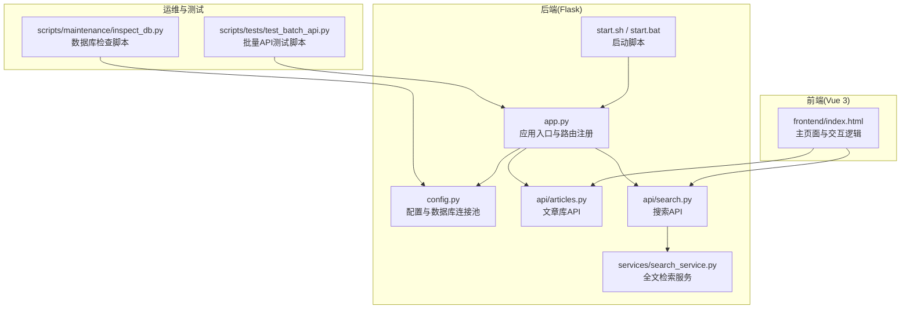
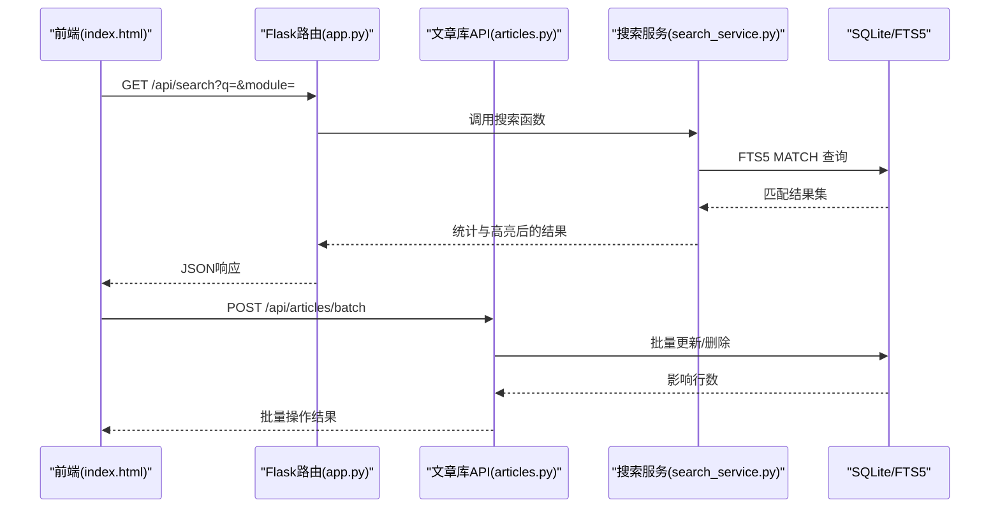
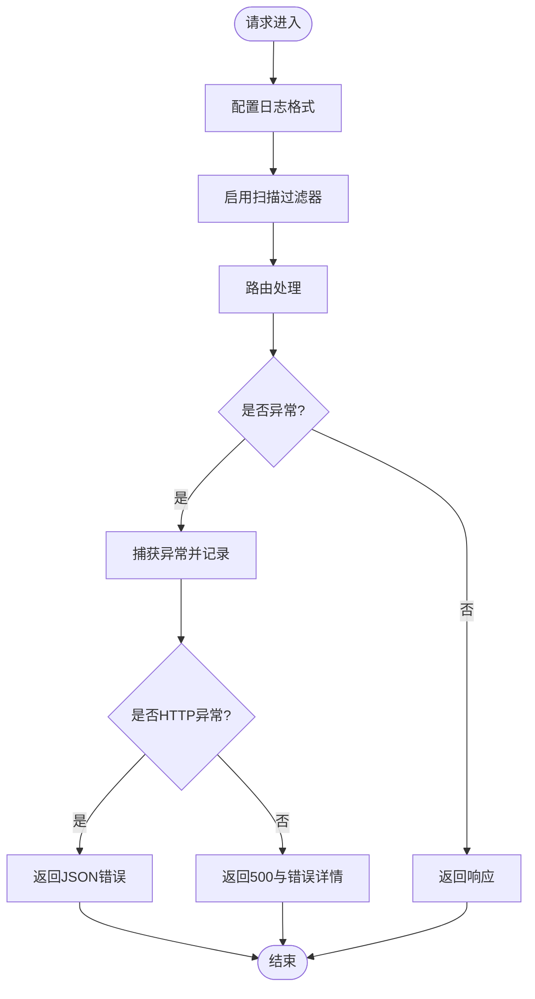
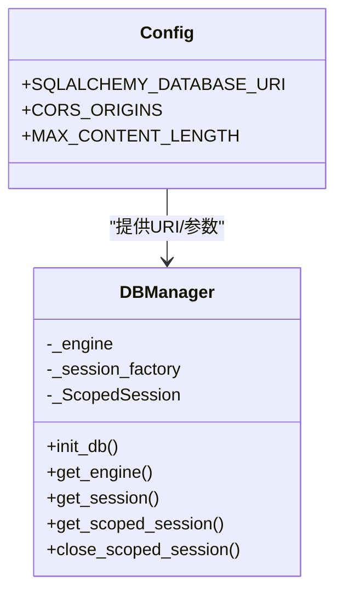
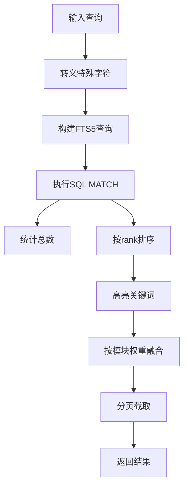
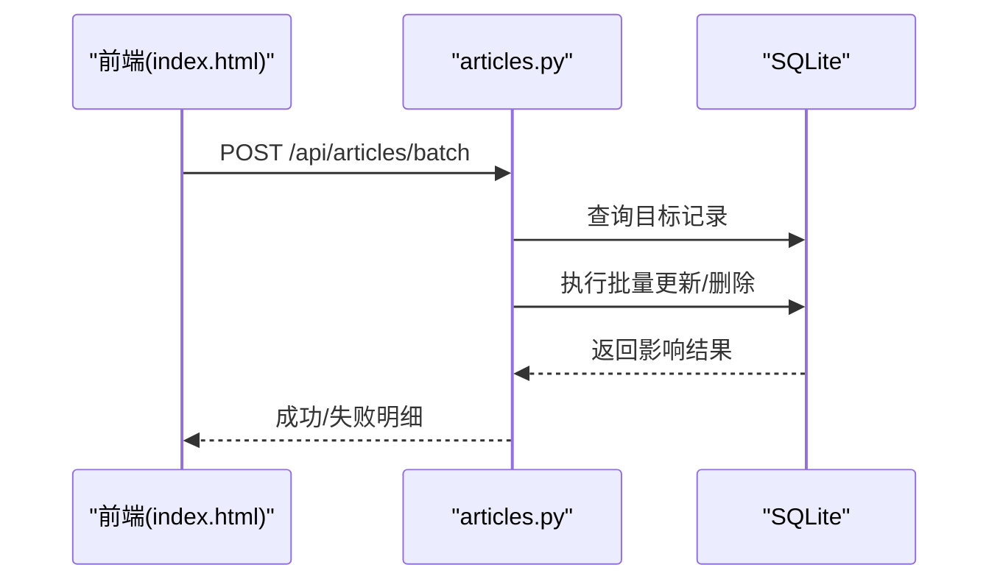
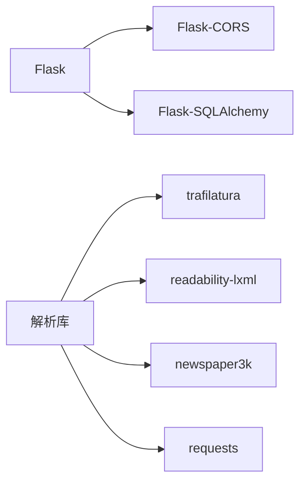

# 开发工具和调试

<cite>
**本文引用的文件**
- [backend/app.py](file://backend/app.py)
- [backend/config.py](file://backend/config.py)
- [backend/README.md](file://backend/README.md)
- [backend/start.sh](file://backend/start.sh)
- [backend/start.bat](file://backend/start.bat)
- [backend/api/articles.py](file://backend/api/articles.py)
- [backend/api/search.py](file://backend/api/search.py)
- [backend/services/search_service.py](file://backend/services/search_service.py)
- [scripts/maintenance/inspect_db.py](file://scripts/maintenance/inspect_db.py)
- [scripts/tests/test_batch_api.py](file://scripts/tests/test_batch_api.py)
- [frontend/index.html](file://frontend/index.html)
</cite>

## 目录
1. [简介](#简介)
2. [项目结构](#项目结构)
3. [核心组件](#核心组件)
4. [架构总览](#架构总览)
5. [详细组件分析](#详细组件分析)
6. [依赖分析](#依赖分析)
7. [性能考虑](#性能考虑)
8. [故障排查指南](#故障排查指南)
9. [结论](#结论)
10. [附录](#附录)

## 简介
本指南面向PaperHub开发团队，聚焦于开发期的工具链与调试实践，涵盖：
- 后端调试工具配置与日志系统使用
- 数据库调试与维护脚本
- API调试技巧与批量测试
- 前端调试方法与交互验证
- 开发效率工具推荐与代码格式化配置
- 版本控制最佳实践
- 错误追踪、异常处理与问题定位
- 开发环境监控与性能优化工具使用

## 项目结构
PaperHub采用前后端分离架构：
- 后端基于Flask，提供REST API与静态资源托管
- 前端采用Vue 3 + Element Plus，通过静态页面提供交互界面
- 数据层使用SQLite，配合FTS5全文检索与向量存储（ChromaDB）

**图表来源**
- [backend/app.py:1-234](file://backend/app.py#L1-L234)
- [backend/config.py:1-134](file://backend/config.py#L1-L134)
- [backend/api/articles.py:1-482](file://backend/api/articles.py#L1-L482)
- [backend/api/search.py:1-70](file://backend/api/search.py#L1-L70)
- [backend/services/search_service.py:1-314](file://backend/services/search_service.py#L1-L314)
- [backend/start.sh:1-24](file://backend/start.sh#L1-L24)
- [backend/start.bat:1-24](file://backend/start.bat#L1-L24)
- [frontend/index.html:1-800](file://frontend/index.html#L1-L800)
- [scripts/maintenance/inspect_db.py:1-91](file://scripts/maintenance/inspect_db.py#L1-L91)
- [scripts/tests/test_batch_api.py:1-418](file://scripts/tests/test_batch_api.py#L1-L418)

**章节来源**
- [backend/README.md:1-84](file://backend/README.md#L1-L84)
- [backend/start.sh:1-24](file://backend/start.sh#L1-L24)
- [backend/start.bat:1-24](file://backend/start.bat#L1-L24)

## 核心组件
- 应用入口与路由注册：集中注册蓝图与静态资源，统一CORS与异常处理
- 配置与数据库连接池：集中管理SQLite连接池、会话工厂与全局作用域会话
- 搜索服务：封装FTS5查询、高亮与跨模块融合排序
- 文章库API：提供CRUD、批量操作与标签关联
- 启动脚本：自动安装依赖并启动后端服务
- 前端页面：提供搜索、筛选、批量操作与交互验证

**章节来源**
- [backend/app.py:41-137](file://backend/app.py#L41-L137)
- [backend/config.py:76-134](file://backend/config.py#L76-L134)
- [backend/api/search.py:14-51](file://backend/api/search.py#L14-L51)
- [backend/services/search_service.py:39-257](file://backend/services/search_service.py#L39-L257)
- [backend/api/articles.py:28-481](file://backend/api/articles.py#L28-L481)
- [backend/start.sh:17-24](file://backend/start.sh#L17-L24)
- [frontend/index.html:1-800](file://frontend/index.html#L1-L800)

## 架构总览
后端通过Flask提供REST API，前端通过静态页面与后端交互；搜索服务统一走FTS5索引，实现高性能全文检索。

**图表来源**
- [backend/app.py:140-157](file://backend/app.py#L140-L157)
- [backend/api/search.py:14-51](file://backend/api/search.py#L14-L51)
- [backend/services/search_service.py:39-257](file://backend/services/search_service.py#L39-L257)
- [backend/api/articles.py:355-481](file://backend/api/articles.py#L355-L481)

## 详细组件分析

### 日志系统与异常处理
- 日志配置：设置基础日志级别与格式
- 扫描过滤：屏蔽扫描请求噪声
- 异常捕获：统一处理HTTP与非HTTP异常，输出堆栈信息

**图表来源**
- [backend/app.py:46-89](file://backend/app.py#L46-L89)
- [backend/app.py:32-38](file://backend/app.py#L32-L38)

**章节来源**
- [backend/app.py:46-89](file://backend/app.py#L46-L89)

### 数据库连接与会话管理
- 全局引擎与会话工厂：单例模式，连接池参数优化
- 线程安全会话：scoped_session按线程隔离
- 请求结束清理：teardown中remove当前线程会话

**图表来源**
- [backend/config.py:76-134](file://backend/config.py#L76-L134)

**章节来源**
- [backend/config.py:76-134](file://backend/config.py#L76-L134)

### 搜索服务与FTS5
- 查询转义：对特殊字符进行清洗，避免FTS5语法错误
- 高亮：对匹配关键词进行HTML标记
- 跨模块融合：按模块权重对结果打分并排序
- 建议：从FTS5索引快速生成搜索建议

**图表来源**
- [backend/services/search_service.py:8-26](file://backend/services/search_service.py#L8-L26)
- [backend/services/search_service.py:39-257](file://backend/services/search_service.py#L39-L257)

**章节来源**
- [backend/api/search.py:14-51](file://backend/api/search.py#L14-L51)
- [backend/services/search_service.py:39-257](file://backend/services/search_service.py#L39-L257)

### 文章库批量操作
- 批量动作：更新状态、加/删标签、标星、删除
- 错误处理：缺失参数、未知动作、无效状态值
- 事务性：批量操作在会话内提交，失败回滚

**图表来源**
- [backend/api/articles.py:355-481](file://backend/api/articles.py#L355-L481)

**章节来源**
- [backend/api/articles.py:355-481](file://backend/api/articles.py#L355-L481)

### 启动与开发环境
- 自动安装依赖与启动服务
- 端口与访问地址约定
- 跨平台启动脚本

**章节来源**
- [backend/start.sh:17-24](file://backend/start.sh#L17-L24)
- [backend/start.bat:17-24](file://backend/start.bat#L17-L24)
- [backend/README.md:25-46](file://backend/README.md#L25-L46)

### 前端调试要点
- 通过浏览器开发者工具观察网络请求与响应
- 在搜索框输入关键词，验证搜索建议与下拉面板
- 在论文/文章/笔记列表页勾选多项，验证批量操作栏是否出现
- 观察控制台是否有异常日志

**章节来源**
- [frontend/index.html:22-74](file://frontend/index.html#L22-L74)
- [frontend/index.html:416-437](file://frontend/index.html#L416-L437)

## 依赖分析
- 后端依赖：Flask、Flask-CORS、Flask-SQLAlchemy、arxiv、PyMuPDF、requests、beautifulsoup4、trafilatura、readability-lxml、newspaper3k、lxml、html2text、urllib3、charset-normalizer
- 前端依赖：Element Plus、Marked、自定义样式与模块

**图表来源**
- [backend/requirements.txt:1-15](file://backend/requirements.txt#L1-L15)

**章节来源**
- [backend/requirements.txt:1-15](file://backend/requirements.txt#L1-L15)

## 性能考虑
- 数据库连接池：合理设置pool_size、max_overflow、pool_recycle，避免锁竞争
- FTS5查询：通过MATCH与rank字段减少排序成本，建议在高频查询字段建立FTS5表
- 搜索建议：从FTS5索引直接取候选，避免全表扫描
- 前端分页：限制每页数量，避免一次性渲染过多DOM节点
- 资源静态托管：将图片、PDF等静态资源交由后端路由转发，便于缓存与权限控制

**章节来源**
- [backend/config.py:92-99](file://backend/config.py#L92-L99)
- [backend/services/search_service.py:260-313](file://backend/services/search_service.py#L260-L313)
- [backend/app.py:109-131](file://backend/app.py#L109-L131)

## 故障排查指南

### 数据库调试
- 使用维护脚本检查表结构与重复数据
- 关注软删字段与活跃记录数量差异
- 如发现重复标题，结合ID定位并清理

**章节来源**
- [scripts/maintenance/inspect_db.py:18-87](file://scripts/maintenance/inspect_db.py#L18-L87)

### API调试技巧
- 使用批量测试脚本验证多模块批量操作
- 关注错误码与错误信息，区分参数缺失与业务异常
- 通过健康检查端点确认后端存活

**章节来源**
- [scripts/tests/test_batch_api.py:317-376](file://scripts/tests/test_batch_api.py#L317-L376)
- [backend/app.py:101-103](file://backend/app.py#L101-L103)

### 前端调试方法
- 打开浏览器开发者工具，切换到Network标签，观察请求与响应
- 在Console查看错误日志
- 在Elements中检查DOM结构与事件绑定

**章节来源**
- [frontend/index.html:1-800](file://frontend/index.html#L1-L800)

### 错误追踪与异常处理
- 后端统一异常捕获，记录堆栈信息
- 对扫描请求进行过滤，降低噪音
- 对HTTP异常与非HTTP异常分别处理，保证响应一致性

**章节来源**
- [backend/app.py:70-89](file://backend/app.py#L70-L89)
- [backend/app.py:25-38](file://backend/app.py#L25-L38)

### 开发环境监控与性能优化
- 启动脚本自动安装依赖，确保环境一致性
- 使用搜索服务的高亮与建议功能提升用户体验
- 合理设置数据库连接池参数，避免并发瓶颈

**章节来源**
- [backend/start.sh:17-24](file://backend/start.sh#L17-L24)
- [backend/services/search_service.py:28-37](file://backend/services/search_service.py#L28-L37)
- [backend/config.py:92-99](file://backend/config.py#L92-L99)

## 结论
通过统一的日志与异常处理、完善的数据库连接池、高效的FTS5全文检索与前端交互验证，PaperHub在开发阶段具备良好的可观测性与可维护性。建议在后续迭代中持续完善测试覆盖与性能指标采集，以保障系统稳定性与扩展性。

## 附录

### 开发效率工具推荐
- 代码格式化：pre-commit钩子 + black/isort + ruff
- 类型检查：mypy
- 单元测试：pytest + coverage
- API测试：Postman/Insomnia + Swagger/OpenAPI
- 前端调试：Vue DevTools + 浏览器开发者工具

### 代码格式化工具配置
- Python：black、isort、flake8/ruff
- JS/CSS：Prettier + ESLint
- Git钩子：pre-commit

### 版本控制最佳实践
- 分支策略：Git Flow或GitHub Flow
- 提交规范：Conventional Commits
- 合并与审查：Pull Request + 自动化检查
- 标签与发布：SemVer + 自动化打包