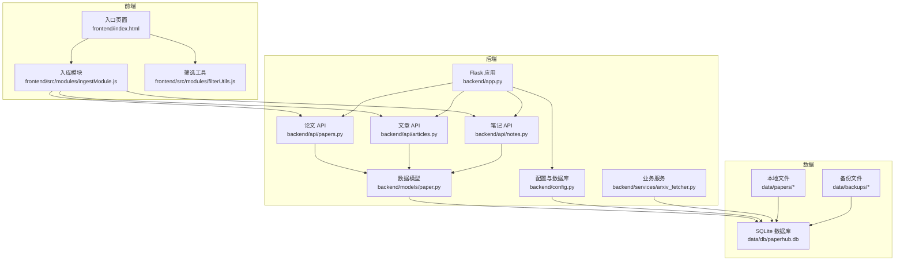
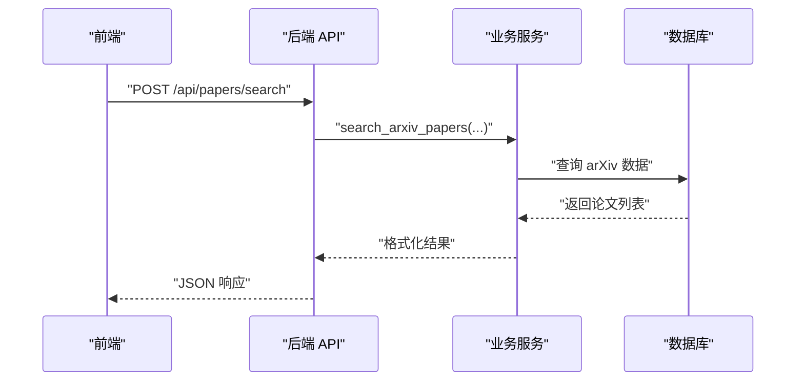
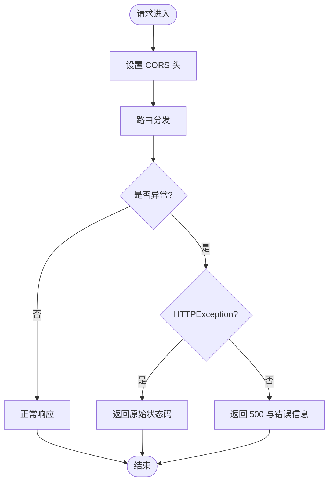
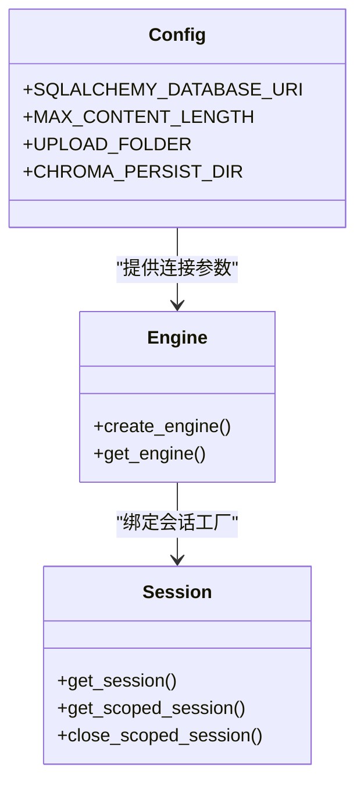
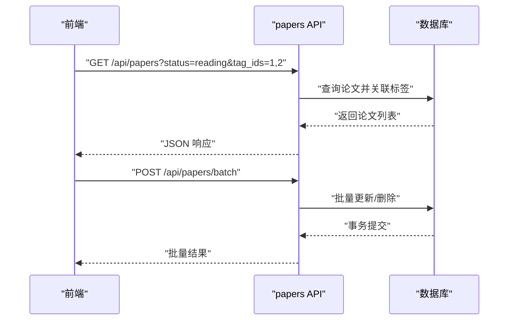
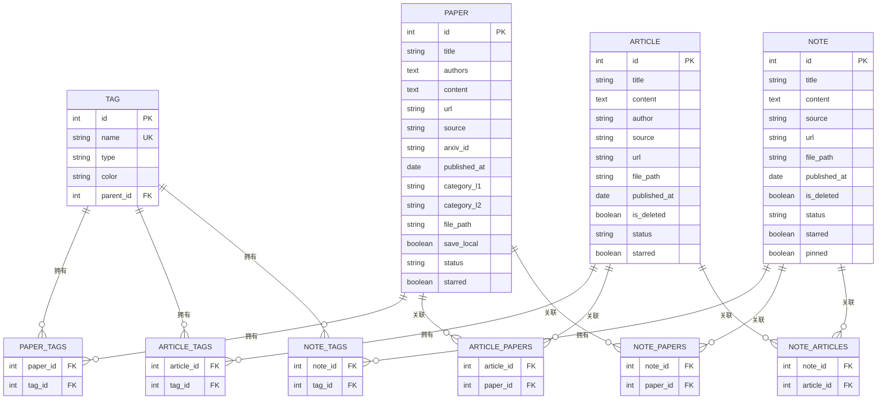
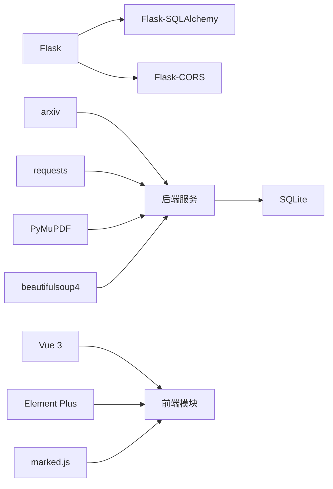

# 开发指南

<cite>
**本文档引用的文件**
- [README.md](file://README.md)
- [backend/README.md](file://backend/README.md)
- [frontend/README.md](file://frontend/README.md)
- [backend/app.py](file://backend/app.py)
- [backend/config.py](file://backend/config.py)
- [backend/requirements.txt](file://backend/requirements.txt)
- [backend/api/papers.py](file://backend/api/papers.py)
- [backend/api/articles.py](file://backend/api/articles.py)
- [backend/api/notes.py](file://backend/api/notes.py)
- [backend/models/paper.py](file://backend/models/paper.py)
- [backend/services/arxiv_fetcher.py](file://backend/services/arxiv_fetcher.py)
- [frontend/src/modules/ingestModule.js](file://frontend/src/modules/ingestModule.js)
- [frontend/src/modules/filterUtils.js](file://frontend/src/modules/filterUtils.js)
- [scripts/tests/test_batch_guide.md](file://scripts/tests/test_batch_guide.md)
- [CHECKLIST.md](file://CHECKLIST.md)
</cite>

## 目录
1. [简介](#简介)
2. [项目结构](#项目结构)
3. [核心组件](#核心组件)
4. [架构总览](#架构总览)
5. [详细组件分析](#详细组件分析)
6. [依赖关系分析](#依赖关系分析)
7. [性能考虑](#性能考虑)
8. [故障排查指南](#故障排查指南)
9. [结论](#结论)
10. [附录](#附录)

## 简介
PaperHub 是一个面向算法工程师的本地化、私有化的个人知识管理系统，支持论文、文章与对话笔记的一体化管理。系统通过三大模块（论文库、文章库、笔记库）统一架构，提供多源入库、标签体系、全文检索、批量操作、备份恢复等功能，并持续迭代搜索体验与可视化。

## 项目结构
项目采用前后端分离架构，后端基于 Flask + SQLite，前端采用 Vue 3 + Element Plus（CDN 版本）。核心目录与职责如下：
- backend：后端服务、API、业务服务与数据模型
- frontend：前端单页应用与模块化工具
- scripts：维护与测试脚本
- docs：开发文档与设计说明
- data：本地数据存储（数据库、论文/文章/笔记文件、备份）

**图表来源**
- [backend/app.py:1-234](file://backend/app.py#L1-L234)
- [backend/config.py:1-134](file://backend/config.py#L1-L134)
- [backend/api/papers.py:1-822](file://backend/api/papers.py#L1-L822)
- [backend/api/articles.py:1-482](file://backend/api/articles.py#L1-L482)
- [backend/api/notes.py:1-595](file://backend/api/notes.py#L1-L595)
- [backend/models/paper.py:1-360](file://backend/models/paper.py#L1-L360)
- [backend/services/arxiv_fetcher.py:1-324](file://backend/services/arxiv_fetcher.py#L1-L324)
- [frontend/src/modules/ingestModule.js:1-48](file://frontend/src/modules/ingestModule.js#L1-L48)
- [frontend/src/modules/filterUtils.js:1-107](file://frontend/src/modules/filterUtils.js#L1-L107)

**章节来源**
- [README.md:383-481](file://README.md#L383-L481)
- [backend/README.md:50-84](file://backend/README.md#L50-L84)

## 核心组件
- Flask 主应用与路由注册：负责 CORS、静态资源、健康检查、异常处理与蓝图注册。
- 配置与数据库：集中管理 SQLite 连接池、会话工厂、目录结构与向量存储配置。
- 数据模型：定义 Paper/Article/Note/Tag 及多对多关联表，支持统一的标签与版本管理。
- 业务服务：arXiv 抓取、PDF 处理、解析器与 LLM 客户端等。
- 前端模块：入库、筛选、排序与文件上传等工具模块，支持统一的交互体验。

**章节来源**
- [backend/app.py:41-137](file://backend/app.py#L41-L137)
- [backend/config.py:35-134](file://backend/config.py#L35-L134)
- [backend/models/paper.py:93-360](file://backend/models/paper.py#L93-L360)
- [backend/services/arxiv_fetcher.py:17-324](file://backend/services/arxiv_fetcher.py#L17-L324)
- [frontend/src/modules/ingestModule.js:4-47](file://frontend/src/modules/ingestModule.js#L4-L47)
- [frontend/src/modules/filterUtils.js:2-106](file://frontend/src/modules/filterUtils.js#L2-L106)

## 架构总览
系统采用“后端 API + 前端模块化”的分层设计：
- 后端通过蓝图组织 API，统一异常处理与静态资源路由。
- 前端通过模块化工具实现可复用的业务逻辑，减少重复代码。
- 数据层采用 SQLite + SQLAlchemy，配合 FTS5 全文检索提升搜索体验。
- 文件系统与数据库联动，确保删除与清理的一致性。

**图表来源**
- [backend/api/papers.py:475-552](file://backend/api/papers.py#L475-L552)
- [backend/services/arxiv_fetcher.py:123-227](file://backend/services/arxiv_fetcher.py#L123-L227)

**章节来源**
- [backend/app.py:140-158](file://backend/app.py#L140-L158)
- [backend/api/papers.py:475-552](file://backend/api/papers.py#L475-L552)
- [backend/services/arxiv_fetcher.py:123-227](file://backend/services/arxiv_fetcher.py#L123-L227)

## 详细组件分析

### 后端应用与异常处理
- CORS 与静态资源：统一跨域配置与静态文件路由，支持微信/知乎/笔记图片访问。
- 异常处理：全局捕获未处理异常，区分扫描请求与 HTTP 异常，返回结构化错误信息。
- 蓝图注册：集中注册论文、文章、笔记、AI、备份等 API 蓝图。

**图表来源**
- [backend/app.py:54-90](file://backend/app.py#L54-L90)

**章节来源**
- [backend/app.py:54-137](file://backend/app.py#L54-L137)

### 配置与数据库连接
- 目录结构：确保 data/papers、data/db、data/vectors、data/backups 目录存在。
- 连接池：使用 scoped_session 管理线程安全会话，避免 SQLite 锁问题。
- 初始化：首次启动创建标签与基础数据，支持后续迁移。

**图表来源**
- [backend/config.py:35-134](file://backend/config.py#L35-L134)

**章节来源**
- [backend/config.py:18-134](file://backend/config.py#L18-L134)

### 论文 API（papers）
- 列表与筛选：支持分页、状态、标签、来源、日期范围等多维筛选。
- CRUD：支持更新、删除（含文件清理）、下载、标签增删。
- 批量操作：支持批量改状态、加/减标签、标星、删除。
- arXiv 检索：关键词/分类/时间范围/排序，支持批量导入。

**图表来源**
- [backend/api/papers.py:29-108](file://backend/api/papers.py#L29-L108)
- [backend/api/papers.py:699-800](file://backend/api/papers.py#L699-L800)

**章节来源**
- [backend/api/papers.py:29-108](file://backend/api/papers.py#L29-L108)
- [backend/api/papers.py:699-800](file://backend/api/papers.py#L699-L800)

### 文章 API（articles）
- 列表与详情：支持搜索、来源筛选、标签管理。
- 关联管理：支持论文与文章的双向关联。
- 批量操作：支持批量改状态、加/减标签、标星、删除（含微信本地文件清理）。

**章节来源**
- [backend/api/articles.py:28-56](file://backend/api/articles.py#L28-L56)
- [backend/api/articles.py:355-479](file://backend/api/articles.py#L355-L479)

### 笔记 API（notes）
- 列表与详情：支持关键词搜索、来源筛选、标签管理。
- 关联管理：支持论文与文章的双向关联。
- 批量操作：支持批量改状态、加/减标签、标星、置顶、删除（含笔记图片清理）。

**章节来源**
- [backend/api/notes.py:25-59](file://backend/api/notes.py#L25-L59)
- [backend/api/notes.py:471-591](file://backend/api/notes.py#L471-L591)

### 数据模型（Paper/Article/Note/Tag）
- 多对多关联：paper_tags、article_tags、note_tags、article_papers、note_papers、note_articles。
- 统一序列化：to_dict 支持按需包含关联数据。
- 版本管理：PaperVersion 支持论文版本追踪。

**图表来源**
- [backend/models/paper.py:18-87](file://backend/models/paper.py#L18-L87)
- [backend/models/paper.py:93-360](file://backend/models/paper.py#L93-L360)

**章节来源**
- [backend/models/paper.py:18-360](file://backend/models/paper.py#L18-L360)

### 业务服务（arXiv 抓取）
- 输入解析：支持 arxiv.org 链接、arXiv:xxxx.xxxxx、纯 ID。
- 搜索与分类：多关键词 AND、分类 OR、时间范围过滤、排序。
- PDF 下载：arXiv 与通用 PDF 下载，本地缓存避免重复。

**章节来源**
- [backend/services/arxiv_fetcher.py:17-324](file://backend/services/arxiv_fetcher.py#L17-L324)

### 前端模块（入库与筛选）
- 入库模块：封装 arXiv 与微信入库流程，统一错误提示与成功回调。
- 筛选工具：统一状态、标签、来源与关键词筛选逻辑，支持多条件组合。

**章节来源**
- [frontend/src/modules/ingestModule.js:4-47](file://frontend/src/modules/ingestModule.js#L4-L47)
- [frontend/src/modules/filterUtils.js:2-106](file://frontend/src/modules/filterUtils.js#L2-L106)

## 依赖关系分析
- 后端依赖：Flask、Flask-CORS、Flask-SQLAlchemy、arxiv、PyMuPDF、requests、BeautifulSoup4、trafilatura、readability-lxml、newspaper3k 等。
- 前端依赖：Vue 3、Element Plus（CDN）、marked.js（CDN）。
- 数据库：SQLite（FTS5 虚拟表支持全文检索）。

**图表来源**
- [backend/requirements.txt:1-15](file://backend/requirements.txt#L1-L15)
- [backend/app.py:4-12](file://backend/app.py#L4-L12)
- [frontend/README.md:1-4](file://frontend/README.md#L1-L4)

**章节来源**
- [backend/requirements.txt:1-15](file://backend/requirements.txt#L1-L15)
- [backend/app.py:4-12](file://backend/app.py#L4-L12)
- [frontend/README.md:1-4](file://frontend/README.md#L1-L4)

## 性能考虑
- 数据库连接池：合理设置 pool_size、max_overflow、pool_recycle，避免 SQLite 锁与超时。
- 查询优化：列表页使用分页与必要字段投影；FTS5 全文检索提升搜索效率。
- 前端防抖：搜索输入 300ms 防抖，AbortController 取消过时请求。
- 文件清理：删除时同步清理本地文件，避免磁盘膨胀。

**章节来源**
- [backend/config.py:92-103](file://backend/config.py#L92-L103)
- [backend/app.py:15-39](file://backend/app.py#L15-L39)
- [scripts/tests/test_batch_guide.md:446-475](file://scripts/tests/test_batch_guide.md#L446-L475)

## 故障排查指南
- 启动与环境
  - 确保使用 python3 并正确安装依赖。
  - 后端启动端口默认 5799，可通过命令行参数指定。
- CORS 与静态资源
  - 如遇跨域问题，检查 CORS 配置与静态路由。
- 异常处理
  - 扫描请求自动过滤，HTTPException 返回原始状态码。
- 批量操作
  - 批量删除需二次确认；失败项不影响其他项。
- 数据清理
  - 删除论文/文章/笔记时，确保本地文件同步清理。

**章节来源**
- [backend/README.md:18-46](file://backend/README.md#L18-L46)
- [backend/app.py:54-90](file://backend/app.py#L54-L90)
- [backend/api/papers.py:777-796](file://backend/api/papers.py#L777-L796)
- [backend/api/articles.py:177-213](file://backend/api/articles.py#L177-L213)
- [backend/api/notes.py:191-227](file://backend/api/notes.py#L191-L227)

## 结论
PaperHub 通过统一的模块化架构、完善的前后端规范与健壮的错误处理策略，实现了论文、文章与笔记的一体化管理。建议在开发中遵循统一的 API 设计、模块化与测试策略，持续优化搜索体验与性能表现。

## 附录

### 开发环境搭建
- Python 解释器：使用 python3，推荐版本 3.8+。
- 依赖安装：在 backend 目录执行安装命令。
- 启动服务：Linux/macOS 使用 start.sh，Windows 使用 start.bat，或直接运行 app.py。

**章节来源**
- [backend/README.md:5-46](file://backend/README.md#L5-L46)
- [README.md:51-68](file://README.md#L51-L68)

### 代码规范与最佳实践
- 后端
  - 使用蓝图组织 API，统一异常处理与静态资源路由。
  - 数据库操作使用 scoped_session，确保线程安全。
  - 业务逻辑下沉至 services，API 仅负责路由与参数校验。
- 前端
  - 模块化工具函数，避免重复逻辑。
  - 统一状态与筛选逻辑，保证三库一致性。
  - 使用 CDN 引入组件库与渲染引擎，减少打包体积。

**章节来源**
- [backend/app.py:140-158](file://backend/app.py#L140-L158)
- [backend/config.py:119-134](file://backend/config.py#L119-L134)
- [frontend/src/modules/filterUtils.js:2-106](file://frontend/src/modules/filterUtils.js#L2-L106)

### 测试策略
- 单元测试：针对服务层（如 arXiv 抓取）进行输入解析与搜索逻辑测试。
- 集成测试：通过 API 端点测试批量操作、搜索与导入流程。
- 回归测试：参考批量操作测试指南，覆盖成功与失败场景。

**章节来源**
- [scripts/tests/test_batch_guide.md:1-152](file://scripts/tests/test_batch_guide.md#L1-L152)

### 代码审查标准
- 代码风格：前后端均保持一致的命名与注释规范。
- 安全性：输入校验、路径安全（防止路径穿越）、二次确认删除。
- 可维护性：模块化设计、错误处理与日志记录。

**章节来源**
- [backend/api/articles.py:193-208](file://backend/api/articles.py#L193-L208)
- [backend/api/notes.py:206-220](file://backend/api/notes.py#L206-L220)

### 持续集成与部署
- CI/CD：建议在仓库中配置自动化测试与构建流程（具体配置文件不在当前仓库）。
- 部署：后端使用 Flask 生产配置，前端静态资源由后端统一托管。

**章节来源**
- [backend/config.py:65-74](file://backend/config.py#L65-L74)
- [backend/app.py:93-132](file://backend/app.py#L93-L132)

### 调试与性能分析
- 日志：启用日志过滤，自动过滤扫描请求，避免控制台噪音。
- 搜索优化：前端搜索防抖与缓存，后端 FTS5 排序与高亮。
- 性能：数据库连接池与查询优化，避免大列表页阻塞。

**章节来源**
- [backend/app.py:15-39](file://backend/app.py#L15-L39)
- [scripts/tests/test_batch_guide.md:446-475](file://scripts/tests/test_batch_guide.md#L446-L475)

### 贡献指南与社区参与
- 参考项目进度与里程碑文档，了解已完成与下一步计划。
- 提交前确保通过本地测试与代码审查标准。

**章节来源**
- [CHECKLIST.md:1-726](file://CHECKLIST.md#L1-L726)
- [README.md:521-543](file://README.md#L521-L543)