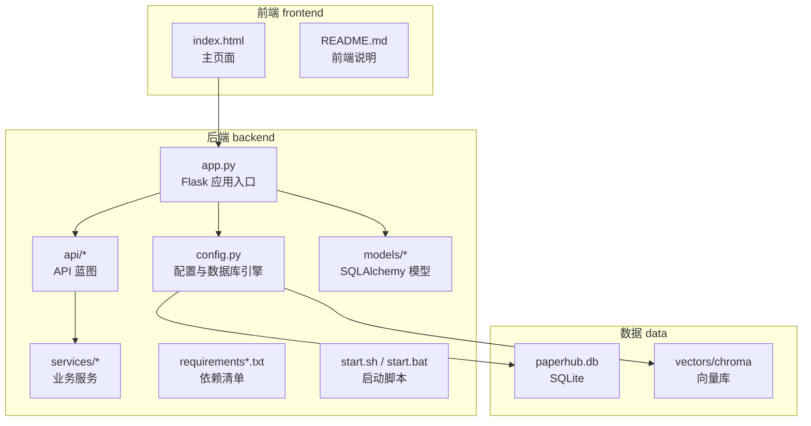
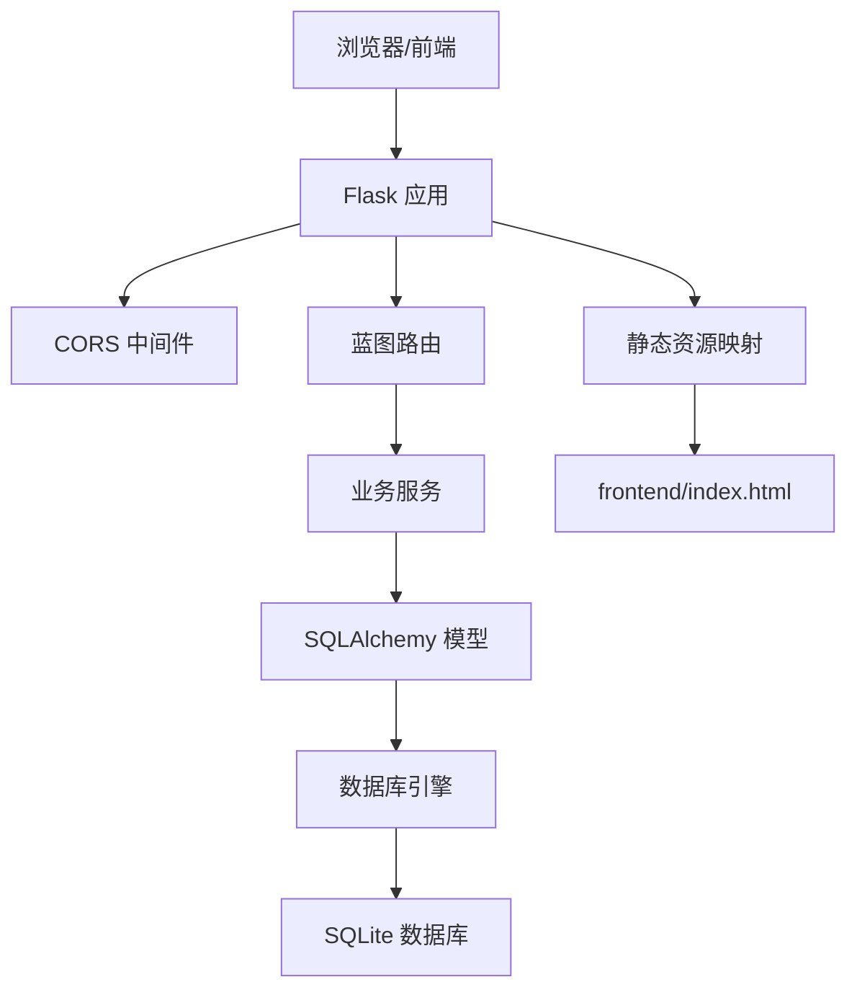
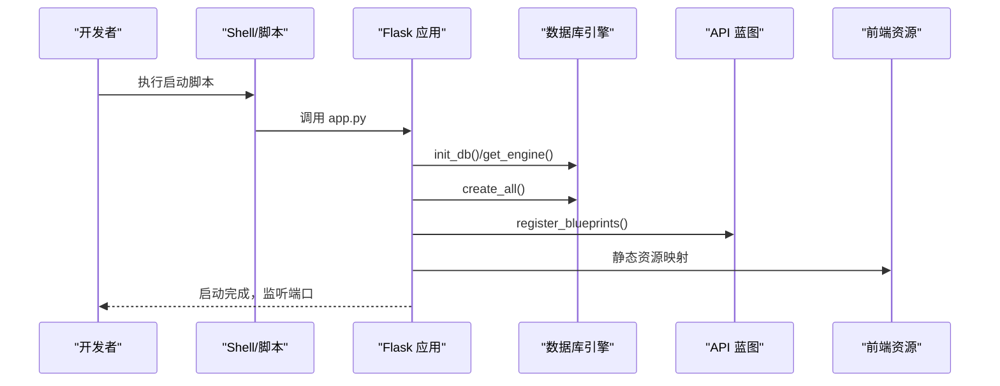
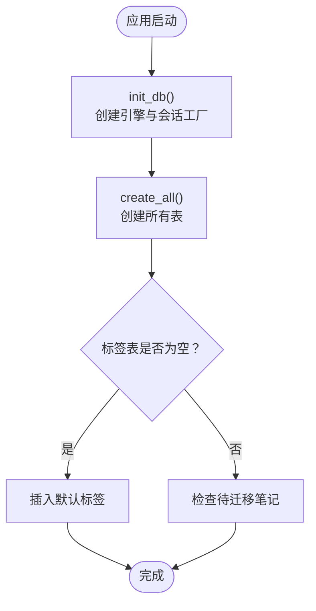
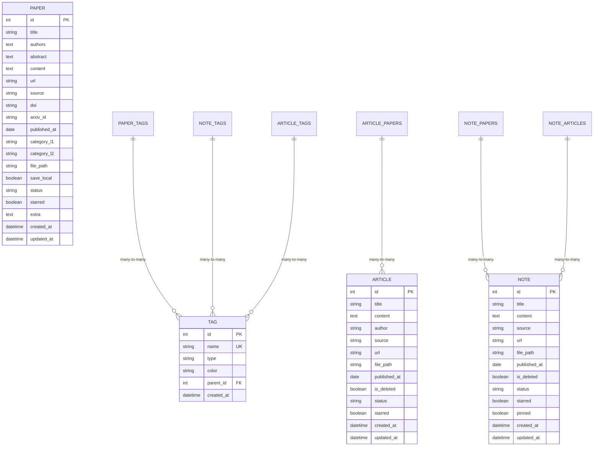
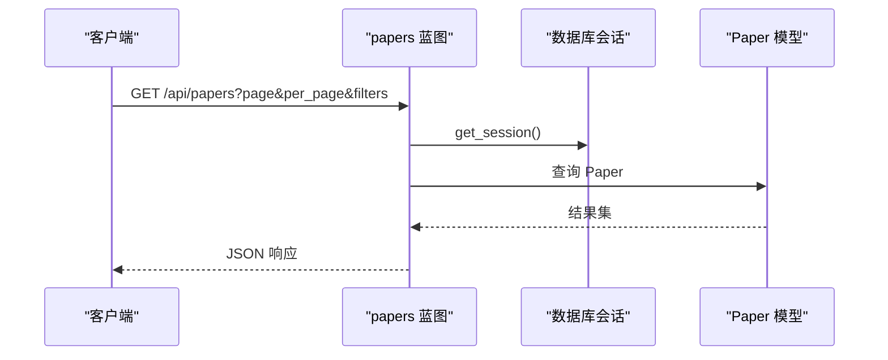
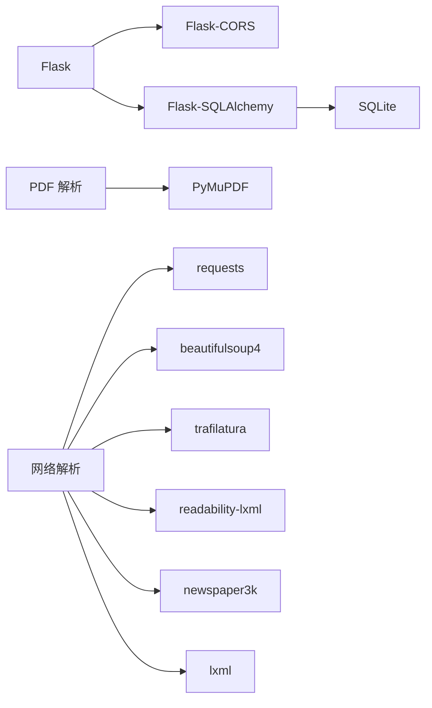

# 开发环境搭建

<cite>
**本文引用的文件**
- [backend/README.md](file://backend/README.md)
- [backend/requirements.txt](file://backend/requirements.txt)
- [backend/requirements-py11.txt](file://backend/requirements-py11.txt)
- [backend/app.py](file://backend/app.py)
- [backend/config.py](file://backend/config.py)
- [backend/start.sh](file://backend/start.sh)
- [backend/start.bat](file://backend/start.bat)
- [backend/models/paper.py](file://backend/models/paper.py)
- [backend/api/papers.py](file://backend/api/papers.py)
- [backend/services/pdf_processor.py](file://backend/services/pdf_processor.py)
- [frontend/README.md](file://frontend/README.md)
- [frontend/index.html](file://frontend/index.html)
- [README.md](file://README.md)
- [scripts/maintenance/check_schema.py](file://scripts/maintenance/check_schema.py)
- [scripts/tests/test_batch_guide.md](file://scripts/tests/test_batch_guide.md)
- [list/bin/Activate.ps1](file://list/bin/Activate.ps1)
- [list/bin/activate.fish](file://list/bin/activate.fish)
- [list/bin/activate.csh](file://list/bin/activate.csh)
</cite>

## 目录
1. [简介](#简介)
2. [项目结构](#项目结构)
3. [核心组件](#核心组件)
4. [架构总览](#架构总览)
5. [详细组件分析](#详细组件分析)
6. [依赖分析](#依赖分析)
7. [性能考虑](#性能考虑)
8. [故障排查指南](#故障排查指南)
9. [结论](#结论)
10. [附录](#附录)

## 简介
本指南面向PaperHub项目的开发者，提供从零搭建开发环境的完整流程，涵盖Python解释器与虚拟环境配置、依赖安装、Flask应用启动、数据库初始化、跨平台配置（Windows、macOS、Linux）、开发工具与IDE建议、调试环境设置、项目目录结构说明以及常见问题排查。目标是帮助你在不同操作系统上快速、稳定地运行PaperHub后端与前端。

## 项目结构
PaperHub采用前后端分离的组织方式：
- backend：Flask后端，包含应用入口、配置、API路由、业务服务与数据模型
- frontend：前端资源，包含HTML、CSS与模块化JavaScript
- docs/scripts/specs/tools：文档、规格说明、脚本与工具
- data：SQLite数据库与向量数据库目录（运行时生成）
- list：Python虚拟环境（venv）

图表来源
- [backend/app.py:41-137](file://backend/app.py#L41-L137)
- [backend/config.py:35-134](file://backend/config.py#L35-L134)
- [backend/requirements.txt:1-15](file://backend/requirements.txt#L1-L15)
- [backend/start.sh:1-24](file://backend/start.sh#L1-L24)
- [backend/start.bat:1-24](file://backend/start.bat#L1-L24)
- [frontend/index.html:1-200](file://frontend/index.html#L1-L200)

章节来源
- [backend/README.md:50-84](file://backend/README.md#L50-L84)
- [README.md:51-68](file://README.md#L51-L68)

## 核心组件
- Flask应用入口与路由注册：负责创建应用实例、CORS配置、静态资源映射、蓝图注册与健康检查端点
- 配置与数据库：集中管理SQLite数据库URI、连接池参数、向量库路径与CORS白名单
- 数据模型：定义Paper、Article、Note、Tag等实体及多对多关联表
- API层：提供论文、文章、笔记、入库、搜索、备份等REST接口
- 业务服务：PDF解析、去重、网络解析、LLM客户端等
- 启动脚本：跨平台一键安装依赖并启动后端服务

章节来源
- [backend/app.py:41-137](file://backend/app.py#L41-L137)
- [backend/config.py:35-134](file://backend/config.py#L35-L134)
- [backend/models/paper.py:93-360](file://backend/models/paper.py#L93-L360)
- [backend/api/papers.py:29-108](file://backend/api/papers.py#L29-L108)
- [backend/services/pdf_processor.py:10-170](file://backend/services/pdf_processor.py#L10-L170)
- [backend/start.sh:17-24](file://backend/start.sh#L17-L24)
- [backend/start.bat:17-24](file://backend/start.bat#L17-L24)

## 架构总览
PaperHub后端基于Flask，使用SQLAlchemy进行ORM与SQLite持久化，并通过蓝图组织API。应用启动时初始化数据库与标签基础数据，同时提供静态资源服务与健康检查端点。

图表来源
- [backend/app.py:41-137](file://backend/app.py#L41-L137)
- [backend/config.py:85-134](file://backend/config.py#L85-L134)
- [frontend/index.html:1-200](file://frontend/index.html#L1-L200)

## 详细组件分析

### Flask应用启动流程
- 创建应用实例，设置静态目录为frontend目录
- 初始化数据库（创建表与默认标签）
- 注册蓝图与静态资源路由
- 启动开发服务器，默认端口5799；可通过命令行参数覆盖

图表来源
- [backend/app.py:41-137](file://backend/app.py#L41-L137)
- [backend/app.py:160-171](file://backend/app.py#L160-L171)
- [backend/app.py:220-234](file://backend/app.py#L220-L234)
- [backend/start.sh:17-24](file://backend/start.sh#L17-L24)
- [backend/start.bat:17-24](file://backend/start.bat#L17-L24)

章节来源
- [backend/app.py:41-137](file://backend/app.py#L41-L137)
- [backend/app.py:160-171](file://backend/app.py#L160-L171)
- [backend/app.py:220-234](file://backend/app.py#L220-L234)
- [backend/start.sh:17-24](file://backend/start.sh#L17-L24)
- [backend/start.bat:17-24](file://backend/start.bat#L17-L24)

### 数据库初始化过程
- 初始化全局数据库引擎与会话工厂
- 若标签表为空则创建所有表并插入默认标签
- 若检测到需迁移的笔记数据，打印提示信息

图表来源
- [backend/app.py:85-104](file://backend/app.py#L85-L104)
- [backend/app.py:160-171](file://backend/app.py#L160-L171)
- [backend/app.py:174-184](file://backend/app.py#L174-L184)

章节来源
- [backend/app.py:85-104](file://backend/app.py#L85-L104)
- [backend/app.py:160-171](file://backend/app.py#L160-L171)
- [backend/app.py:174-184](file://backend/app.py#L174-L184)

### 数据模型与关系
PaperHub使用SQLAlchemy定义核心实体与多对多关联表，支持论文、文章、笔记的标签与关联管理。

图表来源
- [backend/models/paper.py:21-87](file://backend/models/paper.py#L21-L87)
- [backend/models/paper.py:93-293](file://backend/models/paper.py#L93-L293)

章节来源
- [backend/models/paper.py:93-293](file://backend/models/paper.py#L93-L293)

### API工作流（以论文查询为例）
- 请求进入蓝图路由，解析查询参数
- 构造SQLAlchemy查询，支持分页、筛选与排序
- 返回JSON响应

图表来源
- [backend/api/papers.py:29-108](file://backend/api/papers.py#L29-L108)

章节来源
- [backend/api/papers.py:29-108](file://backend/api/papers.py#L29-L108)

### 跨平台开发环境配置

- macOS/Linux
  - 使用bash脚本一键安装依赖并启动后端
  - 前端通过Flask静态资源服务提供
  - 启动后访问 http://localhost:5799

- Windows
  - 使用批处理脚本安装依赖并启动后端
  - 注意脚本中的Python解释器名称与路径

章节来源
- [backend/start.sh:1-24](file://backend/start.sh#L1-L24)
- [backend/start.bat:1-24](file://backend/start.bat#L1-L24)
- [backend/README.md:25-46](file://backend/README.md#L25-L46)

### Python解释器与虚拟环境

- 解释器要求
  - 推荐使用python3作为Python命令
  - 若使用conda环境，可在环境中创建软链接或将环境bin目录加入PATH

- 虚拟环境
  - 仓库自带list目录作为Python虚拟环境
  - Windows：使用PowerShell脚本激活
  - Fish：使用activate.fish
  - C shell：使用activate.csh

章节来源
- [README.md:5-14](file://README.md#L5-L14)
- [list/bin/Activate.ps1:1-248](file://list/bin/Activate.ps1#L1-L248)
- [list/bin/activate.fish:1-69](file://list/bin/activate.fish#L1-L69)
- [list/bin/activate.csh:1-27](file://list/bin/activate.csh#L1-L27)

### 依赖安装步骤

- 安装依赖
  - 使用pip安装requirements.txt中的依赖
  - 若Python版本为3.11及以上，可参考requirements-py11.txt

- 版本差异
  - requirements-py11.txt对部分依赖版本做了适配，用于解决冲突

章节来源
- [backend/README.md:75-79](file://backend/README.md#L75-L79)
- [backend/requirements.txt:1-15](file://backend/requirements.txt#L1-L15)
- [backend/requirements-py11.txt:1-18](file://backend/requirements-py11.txt#L1-L18)

### 开发工具与IDE配置建议
- 推荐使用支持Python与Flask的IDE（如PyCharm、VS Code）
- 建议启用Python解释器为python3
- 前端使用浏览器调试，关注网络面板与控制台
- 后端开启Flask debug模式以便热更新与错误堆栈

章节来源
- [backend/app.py:226-234](file://backend/app.py#L226-L234)

### 调试环境设置
- 后端
  - 使用python3 app.py启动，支持端口参数
  - 启动后Flask debug模式开启，便于本地调试
- 前端
  - 通过Flask静态资源提供index.html
  - 建议在浏览器中打开 http://localhost:5799

章节来源
- [backend/app.py:220-234](file://backend/app.py#L220-L234)
- [frontend/index.html:1-200](file://frontend/index.html#L1-L200)

## 依赖分析
后端依赖主要分为Web框架、数据库ORM、PDF解析与网络解析等类别，确保论文入库、解析与检索能力。

图表来源
- [backend/requirements.txt:1-15](file://backend/requirements.txt#L1-L15)
- [backend/requirements-py11.txt:1-18](file://backend/requirements-py11.txt#L1-L18)

章节来源
- [backend/requirements.txt:1-15](file://backend/requirements.txt#L1-L15)
- [backend/requirements-py11.txt:1-18](file://backend/requirements-py11.txt#L1-L18)

## 性能考虑
- 数据库连接池：配置了连接池大小、最大溢出连接数与回收时间，有助于避免SQLite锁问题
- 日志过滤：屏蔽扫描类请求日志，减少噪音
- 静态资源：前端资源由Flask提供，建议在生产环境使用反向代理或CDN

章节来源
- [backend/config.py:92-99](file://backend/config.py#L92-L99)
- [backend/app.py:32-38](file://backend/app.py#L32-L38)

## 故障排查指南

- 启动失败或端口占用
  - 确认端口5799未被占用
  - 使用启动脚本而非直接运行app.py

- 依赖安装失败
  - 确认使用python3 -m pip
  - 若Python版本为3.11及以上，参考requirements-py11.txt

- 数据库初始化异常
  - 检查data/db目录权限
  - 可使用维护脚本查看表结构

- 前端无法加载
  - 确认后端已启动且端口正确
  - 检查浏览器控制台与网络面板

章节来源
- [backend/start.sh:17-24](file://backend/start.sh#L17-L24)
- [backend/start.bat:17-24](file://backend/start.bat#L17-L24)
- [backend/requirements-py11.txt:1-18](file://backend/requirements-py11.txt#L1-L18)
- [scripts/maintenance/check_schema.py:1-26](file://scripts/maintenance/check_schema.py#L1-L26)

## 结论
按照本指南完成Python解释器与虚拟环境配置、依赖安装与数据库初始化后，你可以在Windows、macOS或Linux上顺利启动PaperHub后端，并通过浏览器访问前端页面。遇到问题时，可依据故障排查章节逐项定位。建议在开发过程中结合Flask debug模式与浏览器开发者工具进行高效调试。

## 附录

### 项目目录结构说明
- backend：后端应用、API、服务与配置
- frontend：前端页面与资源
- data：SQLite与向量数据库目录
- docs/scripts/specs/tools：文档、测试与工具
- list：Python虚拟环境

章节来源
- [backend/README.md:50-71](file://backend/README.md#L50-L71)
- [README.md:1-200](file://README.md#L1-L200)