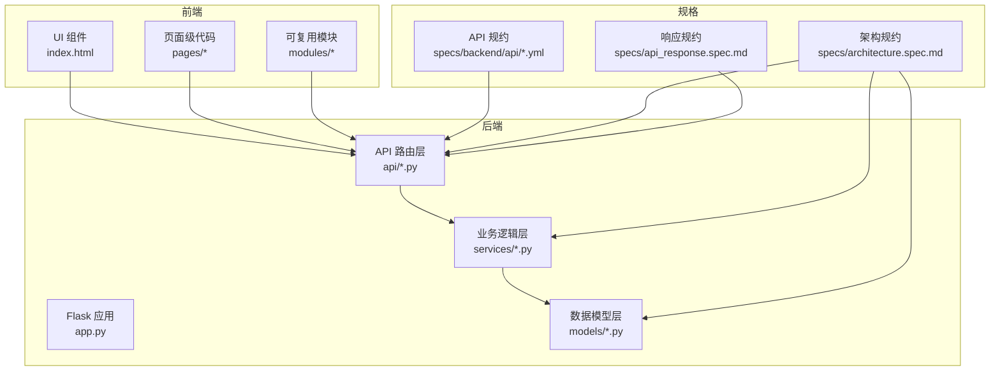
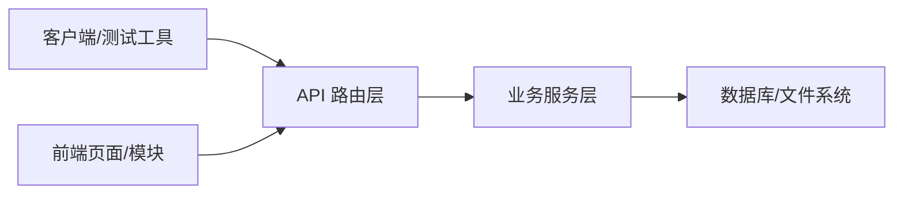
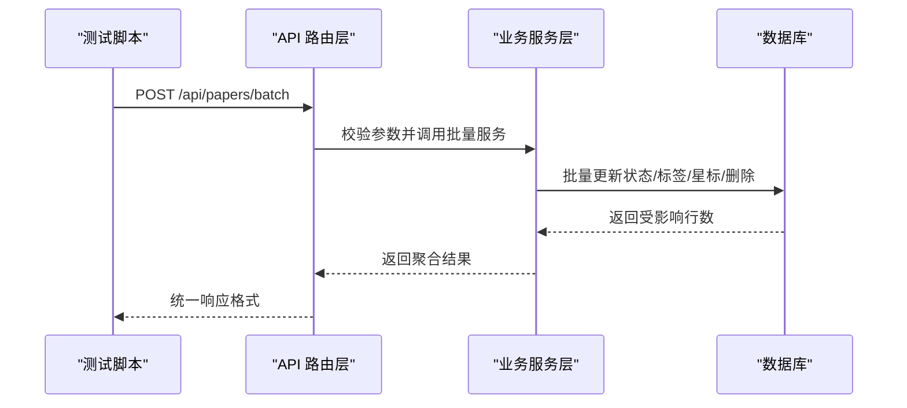
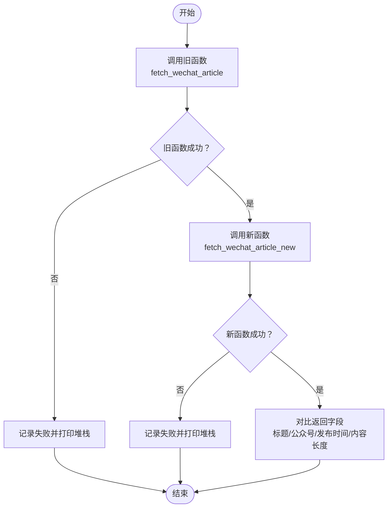
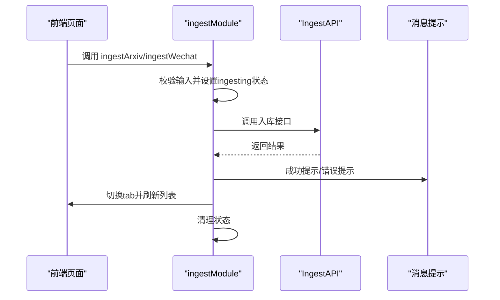
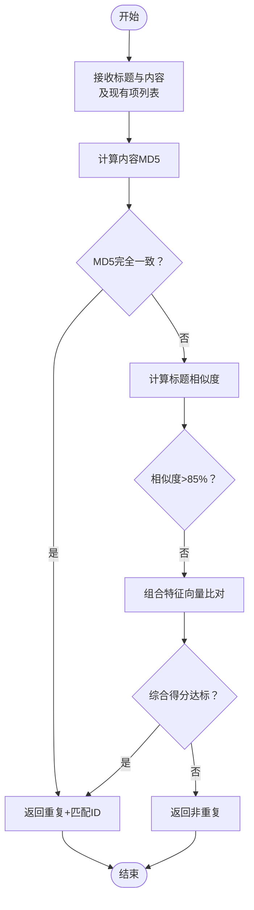
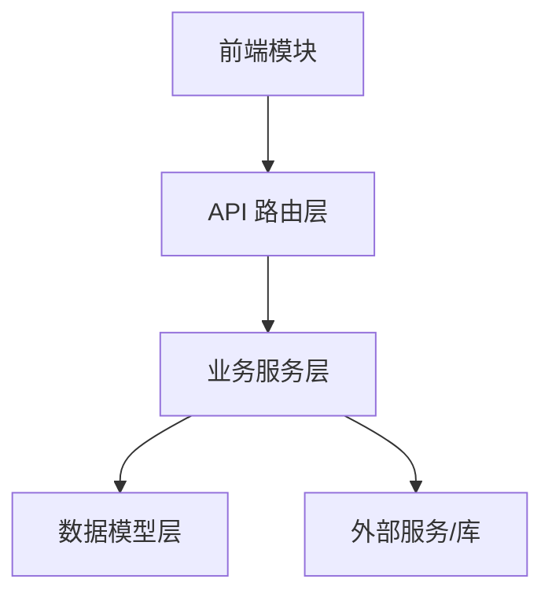

# 测试策略

<cite>
**本文引用的文件**
- [README.md](file://README.md)
- [backend/README.md](file://backend/README.md)
- [frontend/README.md](file://frontend/README.md)
- [scripts/tests/test_batch_api.py](file://scripts/tests/test_batch_api.py)
- [scripts/tests/test_batch_guide.md](file://scripts/tests/test_batch_guide.md)
- [scripts/tests/test_wechat_time.py](file://scripts/tests/test_wechat_time.py)
- [specs/api_response.spec.md](file://specs/api_response.spec.md)
- [specs/architecture.spec.md](file://specs/architecture.spec.md)
- [specs/backend/api/papers.yml](file://specs/backend/api/papers.yml)
- [specs/backend/api/articles.yml](file://specs/backend/api/articles.yml)
- [specs/backend/api/notes.yml](file://specs/backend/api/notes.yml)
- [specs/backend/services/deduplicator.yml](file://specs/backend/services/deduplicator.yml)
- [specs/frontend/modules/ingestModule.yml](file://specs/frontend/modules/ingestModule.yml)
</cite>

## 目录
1. [引言](#引言)
2. [项目结构](#项目结构)
3. [核心组件](#核心组件)
4. [架构总览](#架构总览)
5. [详细组件分析](#详细组件分析)
6. [依赖分析](#依赖分析)
7. [性能考虑](#性能考虑)
8. [故障排查指南](#故障排查指南)
9. [结论](#结论)
10. [附录](#附录)

## 引言
本测试策略面向 PaperHub 项目的后端 API、业务逻辑与前端 UI，构建覆盖单元测试、集成测试与端到端测试的完整体系。目标包括：
- 明确 API 测试、业务逻辑测试与 UI 测试的实施方法与边界
- 提供测试用例设计原则、测试数据准备与测试环境配置
- 建立自动化测试流程与持续集成配置建议
- 覆盖性能测试、压力测试与回归测试的最佳实践

## 项目结构
PaperHub 采用前后端分离的模块化组织方式：
- 后端 backend：Flask 应用，按 api/services/models 分层，提供统一响应格式与规范化的 API 规约
- 前端 frontend：单页应用（CDN 版本），模块化工具与页面级代码分离
- 规格文档 specs：统一 API、数据模型与模块规约，指导测试与开发

图表来源
- [backend/README.md:50-71](file://backend/README.md#L50-L71)
- [specs/architecture.spec.md:6-18](file://specs/architecture.spec.md#L6-L18)
- [specs/architecture.spec.md:21-48](file://specs/architecture.spec.md#L21-L48)
- [specs/architecture.spec.md:50-72](file://specs/architecture.spec.md#L50-L72)

章节来源
- [README.md:383-481](file://README.md#L383-L481)
- [backend/README.md:50-71](file://backend/README.md#L50-L71)
- [specs/architecture.spec.md:6-72](file://specs/architecture.spec.md#L6-L72)

## 核心组件
- API 层：负责请求参数校验、调用业务服务、返回统一响应格式
- 业务服务层：封装复杂业务逻辑、外部调用与数据处理
- 数据模型层：ORM 映射与基础查询封装
- 前端模块：可复用工具模块与页面级逻辑，负责渲染与事件绑定
- 规约与规格：统一 API 输入输出、错误码与目录结构约束

章节来源
- [specs/architecture.spec.md:21-48](file://specs/architecture.spec.md#L21-L48)
- [specs/architecture.spec.md:50-72](file://specs/architecture.spec.md#L50-L72)
- [specs/api_response.spec.md:8-22](file://specs/api_response.spec.md#L8-L22)

## 架构总览
后端采用“路由层-业务层-模型层”的分层架构，前端采用“页面-模块-静态资源”的组织方式。API 层不直接写业务逻辑，必须下沉到 services；统一响应格式确保前后端交互一致性。

图表来源
- [specs/architecture.spec.md:21-48](file://specs/architecture.spec.md#L21-L48)
- [specs/api_response.spec.md:8-22](file://specs/api_response.spec.md#L8-L22)

## 详细组件分析

### 批量操作 API 测试（集成测试）
- 目标：验证论文库/文章库/笔记库的批量操作端到端流程
- 方法：使用 HTTP 客户端对 /api/*/batch 端点发起请求，结合测试数据创建与断言
- 关键点：
  - 成功路径：批量改状态、加标签、标星、删除
  - 错误路径：空 ID 列表、缺少 action、无效 action、无效状态值
  - 前端联动：批量操作栏出现、执行后自动隐藏、列表刷新

图表来源
- [scripts/tests/test_batch_api.py:107-180](file://scripts/tests/test_batch_api.py#L107-L180)
- [scripts/tests/test_batch_api.py:182-241](file://scripts/tests/test_batch_api.py#L182-L241)
- [scripts/tests/test_batch_api.py:243-315](file://scripts/tests/test_batch_api.py#L243-L315)
- [specs/api_response.spec.md:8-22](file://specs/api_response.spec.md#L8-L22)

章节来源
- [scripts/tests/test_batch_api.py:1-418](file://scripts/tests/test_batch_api.py#L1-L418)
- [scripts/tests/test_batch_guide.md:1-152](file://scripts/tests/test_batch_guide.md#L1-L152)
- [specs/api_response.spec.md:8-22](file://specs/api_response.spec.md#L8-L22)

### 微信文章发布时间提取对比测试（业务逻辑测试）
- 目标：对比新旧两个抓取函数在发布时间提取上的差异
- 方法：构造固定测试 URL，分别调用旧函数与新函数，断言返回字段一致性
- 关注点：异常处理、第三方 API 可用性、返回内容长度与关键字段

图表来源
- [scripts/tests/test_wechat_time.py:21-51](file://scripts/tests/test_wechat_time.py#L21-L51)

章节来源
- [scripts/tests/test_wechat_time.py:1-57](file://scripts/tests/test_wechat_time.py#L1-L57)

### 入库模块行为测试（前端模块测试）
- 目标：验证入库模块在不同入库方式下的 UI 行为与状态管理
- 方法：基于模块规约，断言状态设置、API 调用、消息提示与页面跳转
- 关键点：ingesting/wechatIngesting 状态由外部 refs 管理；成功后自动切换 tab 并刷新数据

图表来源
- [specs/frontend/modules/ingestModule.yml:4-16](file://specs/frontend/modules/ingestModule.yml#L4-L16)
- [specs/frontend/modules/ingestModule.yml:17-29](file://specs/frontend/modules/ingestModule.yml#L17-L29)

章节来源
- [specs/frontend/modules/ingestModule.yml:1-34](file://specs/frontend/modules/ingestModule.yml#L1-L34)

### 去重服务测试（业务逻辑测试）
- 目标：验证笔记与文章内容去重算法的正确性与鲁棒性
- 方法：构造标题相似度、内容 MD5 与组合特征向量的测试用例，断言重复判断结果
- 关键点：特征计算异常时降级处理，不中断流程

图表来源
- [specs/backend/services/deduplicator.yml:16-23](file://specs/backend/services/deduplicator.yml#L16-L23)

章节来源
- [specs/backend/services/deduplicator.yml:1-23](file://specs/backend/services/deduplicator.yml#L1-L23)

### API 规约与统一响应（API 测试）
- 目标：确保所有接口返回统一格式，便于前端解析与错误处理
- 方法：对每个端点构造请求并断言 code/data/msg 字段；校验错误码标准与响应封装
- 关键点：禁止裸数据返回；异常捕获后也需包装统一格式

章节来源
- [specs/api_response.spec.md:8-22](file://specs/api_response.spec.md#L8-L22)
- [specs/api_response.spec.md:47-58](file://specs/api_response.spec.md#L47-L58)

### 目录结构与模块规约（架构测试）
- 目标：验证新增模块是否放入正确目录，避免跨层反向依赖
- 方法：检查 backend/api/services/models 与 frontend/pages/modules 的职责边界
- 关键点：API 层不得直接写业务逻辑，必须下沉到 services

章节来源
- [specs/architecture.spec.md:21-48](file://specs/architecture.spec.md#L21-L48)
- [specs/architecture.spec.md:50-72](file://specs/architecture.spec.md#L50-L72)

## 依赖分析
- 组件耦合：API 层依赖业务服务层；业务服务层依赖数据模型层；前端依赖 API 层
- 外部依赖：第三方解析服务（微信/知乎）、PDF 处理库、大模型客户端
- 规约约束：统一响应格式、目录结构、模块职责

图表来源
- [specs/architecture.spec.md:21-48](file://specs/architecture.spec.md#L21-L48)
- [specs/architecture.spec.md:50-72](file://specs/architecture.spec.md#L50-L72)

章节来源
- [specs/architecture.spec.md:21-48](file://specs/architecture.spec.md#L21-L48)
- [specs/architecture.spec.md:50-72](file://specs/architecture.spec.md#L50-L72)

## 性能考虑
- API 层限流与超时：为长耗时操作设置合理超时（如 arXiv 搜索），避免阻塞
- 前端渲染优化：大数据量场景下优先后端计算与分页，减少前端负担
- 业务逻辑优化：去重与解析算法应具备降级策略，保证稳定性
- 压力测试建议：针对高频端点（如 /api/papers/search、批量操作）进行并发与吞吐测试，观察响应时间与错误率

## 故障排查指南
- API 响应异常：检查统一响应封装与错误码映射，定位具体错误来源
- 去重失败：核对标题相似度阈值、内容 MD5 与特征向量计算逻辑
- 前端交互异常：确认模块状态管理与 API 调用时机，关注 finally 块状态清理
- 环境问题：确认后端服务健康检查端点可用，前端静态资源加载正常

章节来源
- [specs/api_response.spec.md:69-74](file://specs/api_response.spec.md#L69-L74)
- [specs/backend/services/deduplicator.yml:21-23](file://specs/backend/services/deduplicator.yml#L21-L23)
- [scripts/tests/test_batch_api.py:362-377](file://scripts/tests/test_batch_api.py#L362-L377)

## 结论
通过分层架构与统一规约，PaperHub 的测试策略应坚持“API 层只做路由与校验、业务层承载复杂逻辑、前端专注 UI 与交互”。建议以集成测试覆盖核心业务流程（批量操作、入库模块、去重服务），以 API 测试保障响应一致性，并辅以前端 UI 测试与回归测试，形成闭环的质量保障体系。

## 附录

### 测试用例设计原则
- 覆盖成功路径与典型错误路径（空输入、非法参数、越界值）
- 使用最小化测试数据，确保可重复性与可维护性
- 对外部依赖进行隔离（模拟第三方服务或使用稳定测试数据）

### 测试数据准备
- 后端：使用唯一标识（如随机 arXiv ID、随机标题）避免重复；必要时提供清理脚本
- 前端：准备稳定的 DOM 结构与交互状态，确保断言可靠

### 测试环境配置
- 后端：独立数据库实例或内存数据库，确保测试隔离；启用健康检查端点
- 前端：本地静态资源服务，确保页面与模块加载正常

### 自动化测试流程与持续集成
- 单元测试：针对业务服务与工具函数，使用最小依赖与模拟对象
- 集成测试：使用 HTTP 客户端对 API 进行端到端验证，结合测试数据准备
- 端到端测试：覆盖关键用户路径（如入库、批量操作、去重），结合 UI 断言
- CI 配置建议：在流水线中依次执行单元测试、集成测试与端到端测试，报告覆盖率与失败详情

### 性能测试与压力测试
- 选择高频端点与批量操作作为压测重点
- 关注响应时间分布、错误率与资源占用
- 逐步提升并发与数据规模，识别瓶颈与异常

### 回归测试最佳实践
- 将关键业务流程纳入回归套件，确保变更不引入回归
- 对 API 规约与前端交互进行回归验证，保持一致性