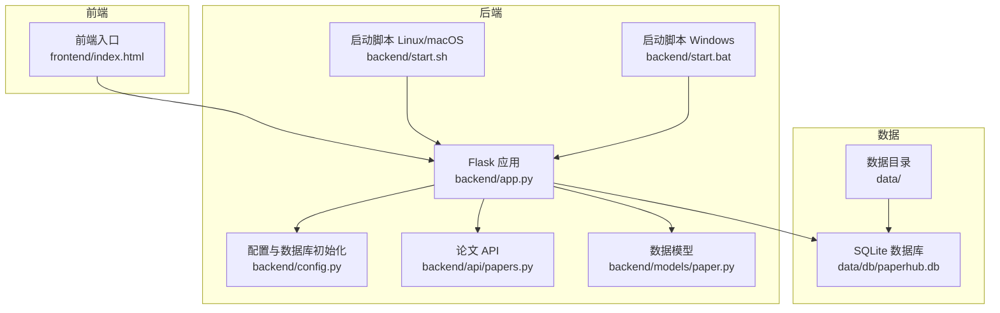
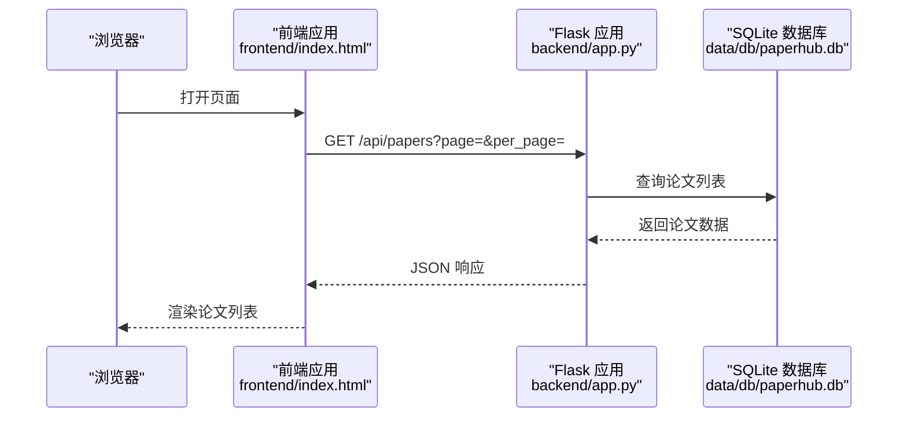
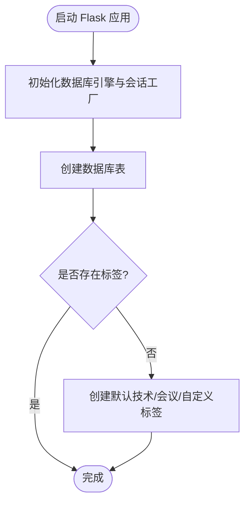
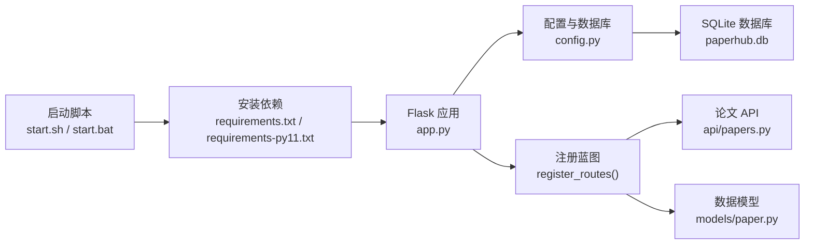

# 快速开始

<cite>
**本文引用的文件**
- [README.md](file://README.md)
- [backend/README.md](file://backend/README.md)
- [backend/app.py](file://backend/app.py)
- [backend/config.py](file://backend/config.py)
- [backend/start.sh](file://backend/start.sh)
- [backend/start.bat](file://backend/start.bat)
- [backend/requirements.txt](file://backend/requirements.txt)
- [backend/requirements-py11.txt](file://backend/requirements-py11.txt)
- [backend/api/papers.py](file://backend/api/papers.py)
- [backend/models/paper.py](file://backend/models/paper.py)
- [scripts/maintenance/check_schema.py](file://scripts/maintenance/check_schema.py)
- [scripts/maintenance/006_add_fts_tables.py](file://scripts/maintenance/006_add_fts_tables.py)
- [frontend/index.html](file://frontend/index.html)
- [backend/services/llm_client.py](file://backend/services/llm_client.py)
- [backend/api/wechat_subscription.py](file://backend/api/wechat_subscription.py)
</cite>

## 目录
1. [简介](#简介)
2. [项目结构](#项目结构)
3. [核心组件](#核心组件)
4. [架构总览](#架构总览)
5. [详细组件分析](#详细组件分析)
6. [依赖关系分析](#依赖关系分析)
7. [性能注意事项](#性能注意事项)
8. [故障排查指南](#故障排查指南)
9. [结论](#结论)
10. [附录](#附录)

## 简介
PaperHub 是一个本地化的个人知识管理系统，支持论文、公众号文章、对话笔记的统一入库与管理。后端基于 Flask + SQLite，前端为单页应用，提供搜索、标签、状态管理、多源导入等能力。本“快速开始”指南将帮助你在 Windows、Linux 和 macOS 上完成环境准备、依赖安装、配置设置与启动运行，并给出常见问题排查与首次使用指引。

## 项目结构
- 后端 backend：Flask 应用、API 路由、业务服务、数据模型、配置与启动脚本
- 前端 frontend：单页应用（index.html）及样式与工具模块
- scripts：维护与诊断脚本（如数据库结构检查、FTS 表重建）
- docs：开发文档与设计说明
- data：本地数据存储（papers、db、vectors、backups）

**图表来源**
- [backend/app.py:1-223](file://backend/app.py#L1-L223)
- [backend/config.py:1-132](file://backend/config.py#L1-L132)
- [backend/api/papers.py:1-200](file://backend/api/papers.py#L1-L200)
- [backend/models/paper.py:1-200](file://backend/models/paper.py#L1-L200)
- [backend/start.sh:1-24](file://backend/start.sh#L1-L24)
- [backend/start.bat:1-24](file://backend/start.bat#L1-L24)
- [frontend/index.html:1-200](file://frontend/index.html#L1-L200)

**章节来源**
- [README.md:324-412](file://README.md#L324-L412)

## 核心组件
- Flask 应用与路由注册：负责启动、CORS、静态资源、蓝图注册与数据库初始化
- 配置与数据库：集中管理数据目录、数据库 URI、CORS、向量库路径与全局 Session 工厂
- API 路由：论文库 CRUD、搜索、入库、AI 解读、笔记图片上传等
- 数据模型：论文、文章、笔记、标签、关联表与版本表
- 启动脚本：Linux/macOS 与 Windows 分别提供一键安装与启动

**章节来源**
- [backend/app.py:41-127](file://backend/app.py#L41-L127)
- [backend/config.py:35-132](file://backend/config.py#L35-L132)
- [backend/api/papers.py:29-108](file://backend/api/papers.py#L29-L108)
- [backend/models/paper.py:90-186](file://backend/models/paper.py#L90-L186)
- [backend/start.sh:17-24](file://backend/start.sh#L17-L24)
- [backend/start.bat:17-24](file://backend/start.bat#L17-L24)

## 架构总览
后端通过 Flask 提供 REST API，前端单页应用通过 AJAX 调用后端接口；数据库采用 SQLite，配合 SQLAlchemy ORM；静态资源（PDF、HTML、图片）存放于 data 目录。

**图表来源**
- [frontend/index.html:1-200](file://frontend/index.html#L1-L200)
- [backend/app.py:130-147](file://backend/app.py#L130-L147)
- [backend/api/papers.py:29-108](file://backend/api/papers.py#L29-L108)

## 详细组件分析

### 环境准备与 Python 解释器
- 必须使用指定的 Anaconda 环境解释器，确保依赖兼容性
- 验证命令与路径需与后端文档一致

**章节来源**
- [backend/README.md:5-16](file://backend/README.md#L5-L16)

### 依赖安装
- 进入 backend 目录，使用指定解释器安装 requirements.txt
- 若系统为 Python 3.11+，可参考 requirements-py11.txt 以避免依赖冲突

**章节来源**
- [backend/README.md:68-77](file://backend/README.md#L68-L77)
- [backend/requirements.txt:1-15](file://backend/requirements.txt#L1-L15)
- [backend/requirements-py11.txt:1-18](file://backend/requirements-py11.txt#L1-L18)

### 配置文件与环境变量
- 配置文件集中管理数据目录、数据库 URI、CORS、上传限制、向量库路径
- 全局数据库引擎与 Session 工厂在应用启动时初始化
- LLM 客户端支持从 .env 文件与环境变量加载 API Key、提供商、基础 URL、模型等配置
- 微信公众号导入支持配置第三方 API Key

**章节来源**
- [backend/config.py:35-132](file://backend/config.py#L35-L132)
- [backend/services/llm_client.py:18-92](file://backend/services/llm_client.py#L18-L92)
- [backend/api/wechat_subscription.py:193-232](file://backend/api/wechat_subscription.py#L193-L232)

### 启动运行（Windows）
- 使用 Windows 启动批处理脚本，自动安装依赖并启动 Flask 应用
- 默认端口 5799，访问 http://localhost:5799

**章节来源**
- [backend/README.md:26-39](file://backend/README.md#L26-L39)
- [backend/start.bat:17-24](file://backend/start.bat#L17-L24)
- [backend/app.py:209-222](file://backend/app.py#L209-L222)

### 启动运行（Linux/macOS）
- 使用 bash 启动脚本，自动安装依赖并启动 Flask 应用
- 默认端口 5799，访问 http://localhost:5799

**章节来源**
- [backend/README.md:20-24](file://backend/README.md#L20-L24)
- [backend/start.sh:17-24](file://backend/start.sh#L17-L24)
- [backend/app.py:209-222](file://backend/app.py#L209-L222)

### 手动启动（跨平台）
- 进入 backend 目录，使用指定解释器执行 app.py，可传入端口号
- 应用启动后自动初始化数据库并创建默认标签

**章节来源**
- [backend/README.md:32-39](file://backend/README.md#L32-L39)
- [backend/app.py:149-207](file://backend/app.py#L149-L207)

### 数据库初始化与维护
- 首次启动时自动创建数据库表与默认标签
- 可使用维护脚本检查数据库结构与文件完整性
- 可使用 FTS5 脚本重建全文检索表

**图表来源**
- [backend/app.py:149-207](file://backend/app.py#L149-L207)
- [backend/config.py:83-132](file://backend/config.py#L83-L132)

**章节来源**
- [backend/app.py:149-207](file://backend/app.py#L149-L207)
- [scripts/maintenance/check_schema.py:1-26](file://scripts/maintenance/check_schema.py#L1-L26)
- [scripts/maintenance/006_add_fts_tables.py:144-179](file://scripts/maintenance/006_add_fts_tables.py#L144-L179)

### API 与数据模型概览
- 论文 API 支持分页、筛选（状态、标签、来源、日期）、详情查询与关联笔记
- 数据模型定义了论文、文章、笔记、标签及其多对多关联表
- 前端入口 index.html 提供搜索、菜单、侧边栏筛选与入库入口

**章节来源**
- [backend/api/papers.py:29-108](file://backend/api/papers.py#L29-L108)
- [backend/models/paper.py:90-186](file://backend/models/paper.py#L90-L186)
- [frontend/index.html:1-200](file://frontend/index.html#L1-L200)

## 依赖关系分析
后端应用启动流程与依赖关系如下：

**图表来源**
- [backend/start.sh:17-24](file://backend/start.sh#L17-L24)
- [backend/start.bat:17-24](file://backend/start.bat#L17-L24)
- [backend/requirements.txt:1-15](file://backend/requirements.txt#L1-L15)
- [backend/requirements-py11.txt:1-18](file://backend/requirements-py11.txt#L1-L18)
- [backend/app.py:130-147](file://backend/app.py#L130-L147)
- [backend/config.py:83-132](file://backend/config.py#L83-L132)
- [backend/api/papers.py:1-200](file://backend/api/papers.py#L1-L200)
- [backend/models/paper.py:1-200](file://backend/models/paper.py#L1-L200)

**章节来源**
- [backend/app.py:130-147](file://backend/app.py#L130-L147)
- [backend/config.py:83-132](file://backend/config.py#L83-L132)

## 性能注意事项
- 数据库连接池：配置了连接池大小、溢出连接数与回收时间，避免 SQLite 锁问题
- 前端筛选与后端统计：根据数据规模选择前端或后端统计，保证交互流畅
- 搜索体验：前端搜索建议与历史缓存、防抖机制减少网络请求
- 静态资源：PDF/HTML/图片本地化，避免跨域与防盗链问题

**章节来源**
- [backend/config.py:89-101](file://backend/config.py#L89-L101)
- [README.md:487-495](file://README.md#L487-L495)
- [frontend/index.html:22-74](file://frontend/index.html#L22-L74)

## 故障排查指南
- 端口占用
  - 默认端口 5799，若被占用可在启动时传入其他端口
  - 参考手动启动方式传入端口参数
- Python 解释器不匹配
  - 必须使用指定 Anaconda 环境解释器，否则会出现依赖不兼容
- 依赖安装失败
  - Linux/macOS：确保网络可达，必要时使用镜像源
  - Python 3.11+：优先使用 requirements-py11.txt
- 数据库初始化异常
  - 检查 data/db/paperhub.db 是否可写
  - 使用维护脚本检查表结构与文件完整性
- LLM 配置无效
  - 确认 .env 或环境变量中 LLM_API_KEY、LLM_PROVIDER 等配置项
- 微信公众号导入失败
  - 配置第三方 API Key，或使用默认 Key

**章节来源**
- [backend/README.md:5-16](file://backend/README.md#L5-L16)
- [backend/requirements-py11.txt:1-18](file://backend/requirements-py11.txt#L1-L18)
- [scripts/maintenance/check_schema.py:1-26](file://scripts/maintenance/check_schema.py#L1-L26)
- [backend/services/llm_client.py:18-92](file://backend/services/llm_client.py#L18-L92)
- [backend/api/wechat_subscription.py:193-232](file://backend/api/wechat_subscription.py#L193-L232)

## 结论
按照本指南完成环境准备、依赖安装与启动配置后，你可以在本地运行 PaperHub，并通过浏览器访问前端界面进行论文、文章与笔记的管理。遇到问题时，可依据故障排查章节逐项定位与解决。后续可结合维护脚本与配置项进一步优化使用体验。

## 附录

### 首次运行后的基本使用
- 打开浏览器访问 http://localhost:5799
- 使用顶部搜索框进行全局搜索（支持 Ctrl+K/Cmd+K 聚焦）
- 通过左侧菜单切换“论文库/文章库/笔记库/入库”
- 使用侧边栏筛选器按状态、分类、标签、日期进行组合筛选
- “入库”页面支持 arXiv 检索、微信/知乎文章导入、PDF/HTML 批量上传
- 论文详情页可编辑元数据、写笔记、查看 AI 解读与关联内容

**章节来源**
- [README.md:44-61](file://README.md#L44-L61)
- [frontend/index.html:1-200](file://frontend/index.html#L1-L200)