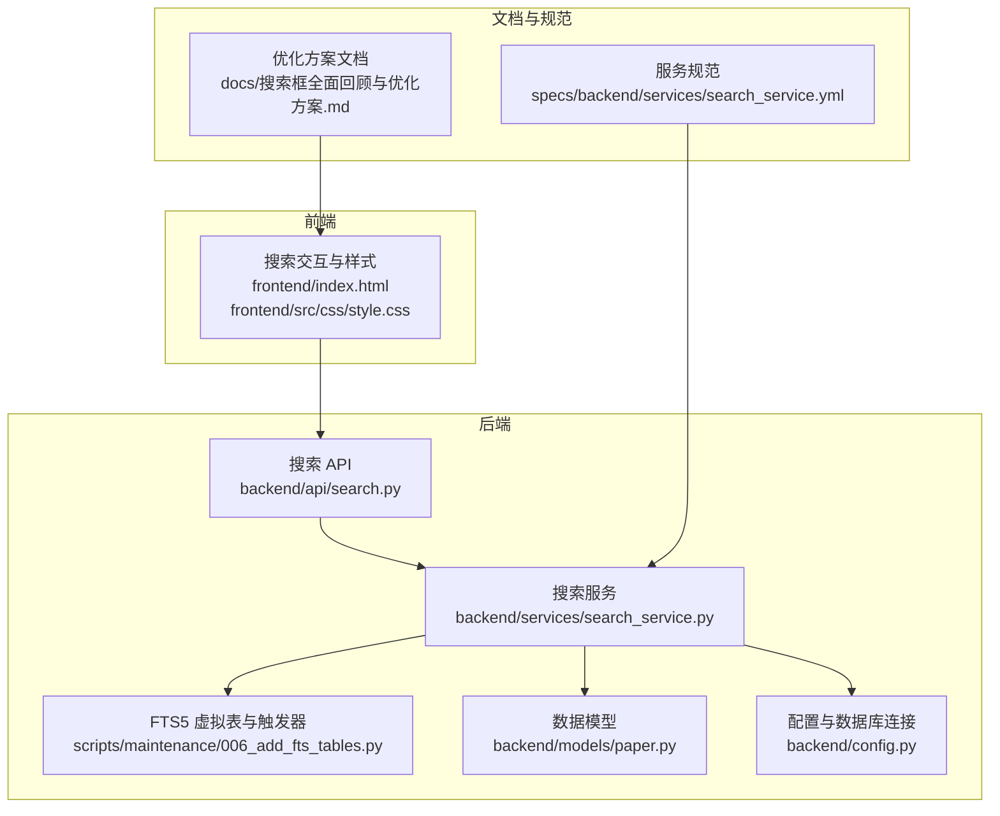
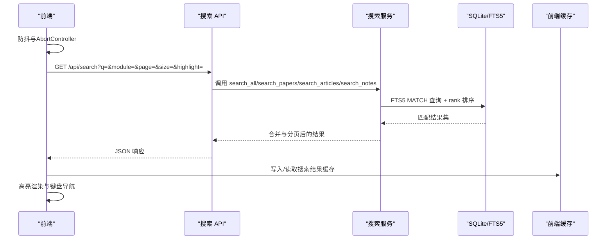
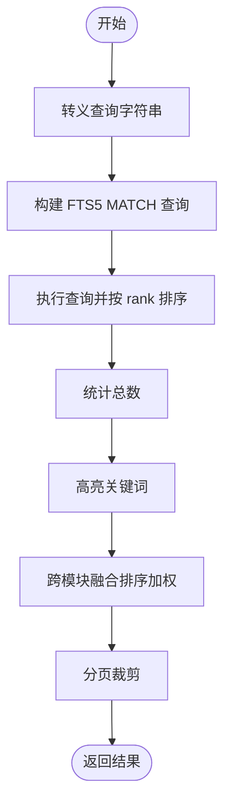
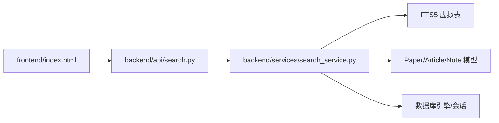

# 搜索系统设计

<cite>
**本文引用的文件**
- [backend/api/search.py](file://backend/api/search.py)
- [backend/services/search_service.py](file://backend/services/search_service.py)
- [scripts/maintenance/006_add_fts_tables.py](file://scripts/maintenance/006_add_fts_tables.py)
- [backend/models/paper.py](file://backend/models/paper.py)
- [backend/config.py](file://backend/config.py)
- [frontend/index.html](file://frontend/index.html)
- [frontend/src/css/style.css](file://frontend/src/css/style.css)
- [docs/搜索框全面回顾与优化方案.md](file://docs/搜索框全面回顾与优化方案.md)
- [specs/backend/services/search_service.yml](file://specs/backend/services/search_service.yml)
</cite>

## 目录
1. [简介](#简介)
2. [项目结构](#项目结构)
3. [核心组件](#核心组件)
4. [架构总览](#架构总览)
5. [详细组件分析](#详细组件分析)
6. [依赖分析](#依赖分析)
7. [性能考量](#性能考量)
8. [故障排查指南](#故障排查指南)
9. [结论](#结论)
10. [附录](#附录)

## 简介
本设计文档围绕 PaperHub 的搜索系统，系统性阐述了基于 SQLite FTS5 的全文检索集成方案、搜索算法设计与性能优化策略，并深入解析搜索建议系统、防抖机制、搜索历史管理与相关性排序算法。同时，文档提供了搜索体验优化的具体实现（键盘导航、快捷键支持、用户反馈机制）、搜索性能监控与缓存策略、查询优化技巧，以及扩展性与维护性考虑，帮助读者全面理解并高效迭代搜索系统。

## 项目结构
搜索系统由后端 API、全文检索服务、前端交互与样式三大部分组成，配合数据库迁移脚本与配置文件，形成完整的检索闭环。

图表来源
- [backend/api/search.py:1-70](file://backend/api/search.py#L1-L70)
- [backend/services/search_service.py:1-314](file://backend/services/search_service.py#L1-L314)
- [scripts/maintenance/006_add_fts_tables.py:1-179](file://scripts/maintenance/006_add_fts_tables.py#L1-L179)
- [backend/models/paper.py:1-360](file://backend/models/paper.py#L1-L360)
- [backend/config.py:1-134](file://backend/config.py#L1-L134)
- [frontend/index.html:5334-5500](file://frontend/index.html#L5334-L5500)
- [frontend/src/css/style.css:267-459](file://frontend/src/css/style.css#L267-L459)
- [specs/backend/services/search_service.yml:1-28](file://specs/backend/services/search_service.yml#L1-L28)
- [docs/搜索框全面回顾与优化方案.md:1-442](file://docs/搜索框全面回顾与优化方案.md#L1-L442)

章节来源
- [backend/api/search.py:1-70](file://backend/api/search.py#L1-L70)
- [backend/services/search_service.py:1-314](file://backend/services/search_service.py#L1-L314)
- [scripts/maintenance/006_add_fts_tables.py:1-179](file://scripts/maintenance/006_add_fts_tables.py#L1-L179)
- [backend/models/paper.py:1-360](file://backend/models/paper.py#L1-L360)
- [backend/config.py:1-134](file://backend/config.py#L1-L134)
- [frontend/index.html:5334-5500](file://frontend/index.html#L5334-L5500)
- [frontend/src/css/style.css:267-459](file://frontend/src/css/style.css#L267-L459)
- [specs/backend/services/search_service.yml:1-28](file://specs/backend/services/search_service.yml#L1-L28)
- [docs/搜索框全面回顾与优化方案.md:1-442](file://docs/搜索框全面回顾与优化方案.md#L1-L442)

## 核心组件
- 搜索 API 层：提供统一的搜索入口与建议接口，负责参数校验与错误处理。
- 搜索服务层：封装 FTS5 查询、转义、高亮、跨模块融合排序与建议生成。
- FTS5 全文检索：为论文、文章、笔记分别建立虚拟表与触发器，确保索引与数据一致性。
- 前端交互层：实现防抖、请求取消、键盘导航、快捷键、搜索历史与本地缓存。
- 配置与模型：数据库连接池、引擎配置与实体模型定义。

章节来源
- [backend/api/search.py:14-70](file://backend/api/search.py#L14-L70)
- [backend/services/search_service.py:8-314](file://backend/services/search_service.py#L8-L314)
- [scripts/maintenance/006_add_fts_tables.py:13-142](file://scripts/maintenance/006_add_fts_tables.py#L13-L142)
- [frontend/index.html:5376-5500](file://frontend/index.html#L5376-L5500)
- [backend/config.py:85-134](file://backend/config.py#L85-L134)

## 架构总览
搜索系统采用“API -> 服务 -> FTS5 -> 数据库”的分层架构，前端通过防抖与缓存减少请求压力，后端通过 FTS5 rank 与加权融合提升相关性排序质量。

图表来源
- [backend/api/search.py:14-70](file://backend/api/search.py#L14-L70)
- [backend/services/search_service.py:39-257](file://backend/services/search_service.py#L39-L257)
- [frontend/index.html:5444-5500](file://frontend/index.html#L5444-L5500)

章节来源
- [backend/api/search.py:14-70](file://backend/api/search.py#L14-L70)
- [backend/services/search_service.py:39-257](file://backend/services/search_service.py#L39-L257)
- [frontend/index.html:5444-5500](file://frontend/index.html#L5444-L5500)

## 详细组件分析

### 后端 API 设计
- 统一入口：/api/search 支持按模块搜索（papers/articles/notes/all），分页与高亮开关。
- 建议接口：/api/search/suggest 返回跨模块标题建议，走 FTS5 MATCH 索引。
- 参数校验与错误处理：空查询返回明确错误；异常捕获统一返回 JSON。

章节来源
- [backend/api/search.py:14-70](file://backend/api/search.py#L14-L70)

### 搜索服务与 FTS5 集成
- 查询转义：对 FTS5 特殊字符进行替换与归一化，避免语法错误。
- 高亮：对标题与摘要进行关键词包裹，前端样式突出显示。
- 分模块搜索：论文、文章、笔记分别执行 FTS5 查询，统计总数并分页。
- 跨模块融合排序：以 FTS5 rank 倒数映射为相关性分数，乘以模块权重因子，最终按综合得分降序排序。
- 搜索建议：从三张 FTS5 表标题字段匹配，合并去重后返回，性能较 LIKE 提升显著。

图表来源
- [backend/services/search_service.py:8-257](file://backend/services/search_service.py#L8-L257)

章节来源
- [backend/services/search_service.py:8-257](file://backend/services/search_service.py#L8-L257)

### FTS5 虚拟表与触发器
- 三张虚拟表：papers_fts、articles_fts、notes_fts，使用 unicode61 分词器。
- 触发器：插入/更新/删除时同步维护 FTS 表，保证索引与主表一致性。
- 数据初始化：迁移脚本支持清空并重新同步现有数据。

章节来源
- [scripts/maintenance/006_add_fts_tables.py:13-179](file://scripts/maintenance/006_add_fts_tables.py#L13-L179)

### 前端交互与体验优化
- 防抖与请求取消：300ms 防抖，AbortController 取消未完成请求，避免乱序与资源浪费。
- 键盘导航：上下箭头在建议与历史间切换，Enter 选中，ESC 关闭。
- 全局快捷键：Ctrl+K / Cmd+K 聚焦搜索框。
- 搜索历史：localStorage 存储，最多 10 条，支持删除与清空。
- 本地缓存：Map 实现 LRU，最多 20 条，命中则秒返回。
- 用户反馈：加载状态与 spinner 动画，高亮样式与模块配色。

章节来源
- [frontend/index.html:5376-5500](file://frontend/index.html#L5376-L5500)
- [frontend/index.html:5521-5561](file://frontend/index.html#L5521-L5561)
- [frontend/index.html:6607-6645](file://frontend/index.html#L6607-L6645)
- [frontend/src/css/style.css:396-429](file://frontend/src/css/style.css#L396-L429)

### 相关性排序算法
- 单模块排序：FTS5 rank 越小越相关，映射为 1/(rank+1) 得分。
- 跨模块融合：论文权重 3、文章权重 2、笔记权重 1，最终得分 = 模块权重 × 相关性得分，按降序排列。
- 分页：按总页偏移裁剪，保持跨模块结果的均衡呈现。

章节来源
- [backend/services/search_service.py:207-257](file://backend/services/search_service.py#L207-L257)

### 搜索建议系统
- 建议来源：三张 FTS5 表标题字段，走 MATCH 索引，性能优于 LIKE。
- 建议去重：合并后去重，限制返回数量。
- 建议触发：输入≥2 字符触发，配合防抖与 AbortController。

章节来源
- [backend/services/search_service.py:259-314](file://backend/services/search_service.py#L259-L314)
- [frontend/index.html:5376-5413](file://frontend/index.html#L5376-L5413)

### 搜索历史管理
- 加载：启动时从 localStorage 读取。
- 保存：去重后插入头部，最多保留 10 条。
- 删除：支持单项删除与清空。
- 交互：点击建议或历史项直接执行搜索。

章节来源
- [frontend/index.html:5335-5374](file://frontend/index.html#L5335-L5374)

### 性能监控与缓存策略
- 前端缓存：LRU Map，最多 20 条，命中即返回，未命中发起网络请求并写入缓存。
- 加载状态：搜索中显示 spinner，提升感知速度。
- 监控日志：缓存命中/淘汰与请求取消均有控制台日志辅助调试。

章节来源
- [frontend/index.html:5415-5500](file://frontend/index.html#L5415-L5500)
- [frontend/src/css/style.css:417-429](file://frontend/src/css/style.css#L417-L429)

### 查询优化技巧
- 使用 FTS5 MATCH 走索引，避免 LIKE 前缀模糊导致的全表扫描。
- 查询转义与归一化，减少语法错误与无效匹配。
- 通过 rank 倒数映射与模块权重融合，提升跨模块排序质量。
- 分页与总数统计分离，降低前端处理负担。

章节来源
- [backend/services/search_service.py:8-257](file://backend/services/search_service.py#L8-L257)

## 依赖分析
- 后端依赖：Flask 蓝图、SQLAlchemy、SQLite 引擎、FTS5 虚拟表。
- 前端依赖：Vue3、Element Plus、浏览器 Fetch/AbortController。
- 数据模型：Paper、Article、Note 与多对多标签关联，支撑跨模块搜索。
- 配置：全局引擎与会话工厂，连接池与回收策略，避免 SQLite 锁问题。

图表来源
- [backend/api/search.py:1-12](file://backend/api/search.py#L1-L12)
- [backend/services/search_service.py:3-6](file://backend/services/search_service.py#L3-L6)
- [backend/models/paper.py:93-293](file://backend/models/paper.py#L93-L293)
- [backend/config.py:85-126](file://backend/config.py#L85-L126)

章节来源
- [backend/api/search.py:1-12](file://backend/api/search.py#L1-L12)
- [backend/services/search_service.py:3-6](file://backend/services/search_service.py#L3-L6)
- [backend/models/paper.py:93-293](file://backend/models/paper.py#L93-L293)
- [backend/config.py:85-126](file://backend/config.py#L85-L126)

## 性能考量
- FTS5 索引：三类资源独立虚拟表，MATCH 查询走索引，性能稳定。
- 防抖与取消：前端 300ms 防抖 + AbortController，显著降低请求量与乱序风险。
- 跨模块排序：基于 rank 的加权融合，兼顾相关性与业务权重。
- 本地缓存：LRU 最多 20 条，重复搜索秒返回，减轻后端压力。
- 连接池与回收：SQLite 引擎配置连接池与回收时间，避免锁竞争。
- 建议优化：建议接口已从 LIKE 改为 FTS5 MATCH，性能提升 10 倍以上。

章节来源
- [docs/搜索框全面回顾与优化方案.md:264-335](file://docs/搜索框全面回顾与优化方案.md#L264-L335)
- [backend/config.py:92-103](file://backend/config.py#L92-L103)
- [frontend/index.html:5376-5413](file://frontend/index.html#L5376-L5413)

## 故障排查指南
- 空查询：API 返回明确错误提示，前端需避免发送空查询。
- 请求取消：AbortError 属于正常取消流程，前端已屏蔽错误日志。
- FTS5 语法错误：查询被转义后仍报错，检查特殊字符是否被正确替换。
- 建议性能差：确认是否仍在使用 LIKE，应改为 FTS5 MATCH。
- 缓存异常：检查 LRU 容量与键值规范化（小写、去空白）。
- 外部点击收起：使用捕获阶段监听，避免竞态与内存泄漏，卸载时务必清理。

章节来源
- [backend/api/search.py:24-28](file://backend/api/search.py#L24-L28)
- [frontend/index.html:5495-5499](file://frontend/index.html#L5495-L5499)
- [frontend/index.html:6620-6645](file://frontend/index.html#L6620-L6645)

## 结论
PaperHub 搜索系统以 SQLite FTS5 为核心，结合前后端协同优化，在性能、体验与可维护性之间取得良好平衡。通过防抖、请求取消、键盘导航、快捷键、搜索历史与本地缓存等手段，显著提升了用户交互效率；通过 FTS5 MATCH、rank 加权融合与模块权重，有效改善了跨模块相关性排序质量。未来可在模块限定搜索、上下文智能摘要、搜索结果分页与 AI 语义增强等方面持续演进，进一步提升搜索体验与智能化水平。

## 附录
- 服务规范：参见服务规范文档，明确输入输出与错误规则。
- 优化方案：参考优化方案文档，了解阶段性改进与路线图。

章节来源
- [specs/backend/services/search_service.yml:1-28](file://specs/backend/services/search_service.yml#L1-L28)
- [docs/搜索框全面回顾与优化方案.md:402-442](file://docs/搜索框全面回顾与优化方案.md#L402-L442)