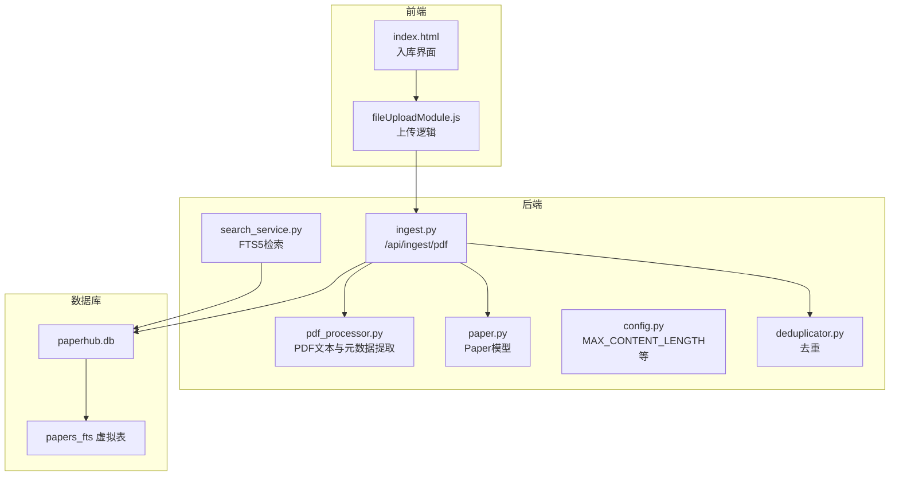
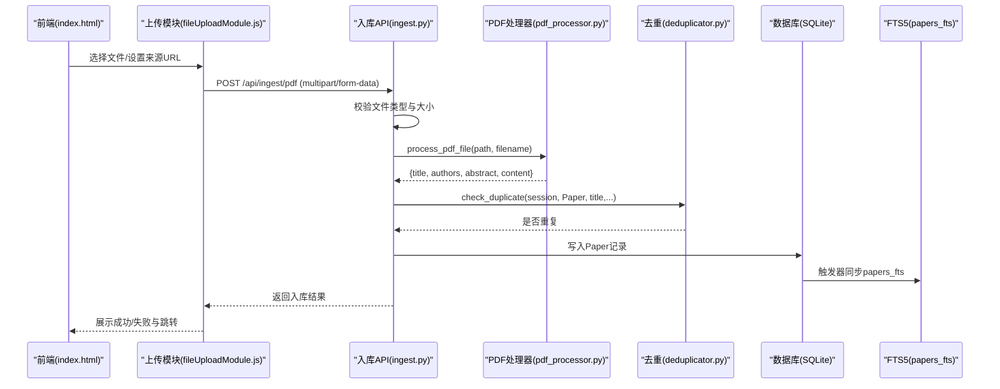
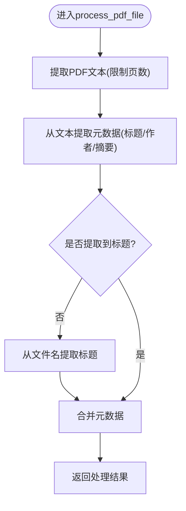
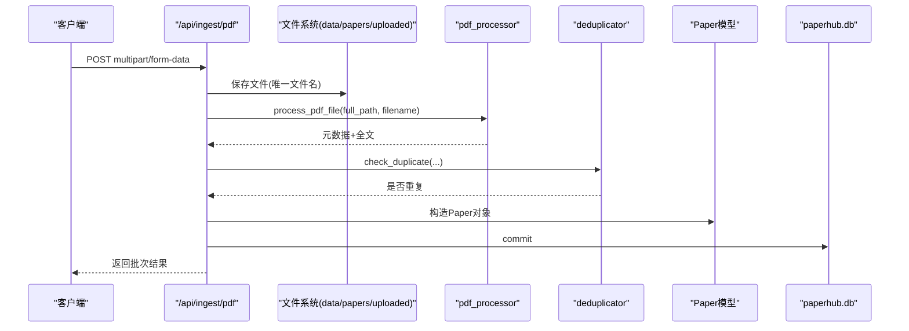
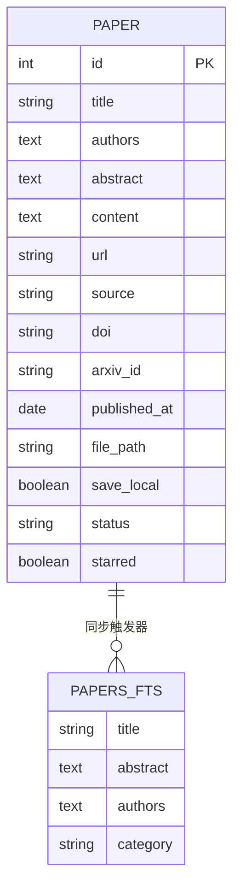
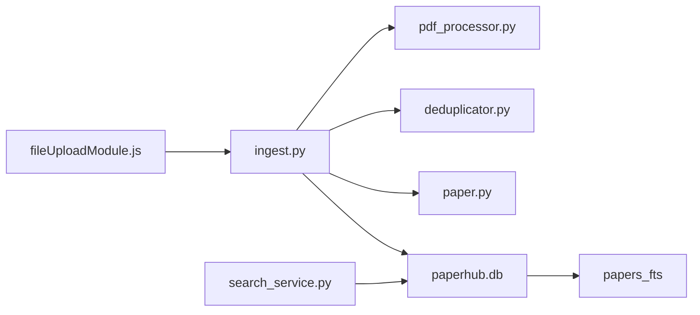

# PDF文件处理

<cite>
**本文引用的文件**
- [pdf_processor.py](file://backend/services/pdf_processor.py)
- [ingest.py](file://backend/api/ingest.py)
- [paper.py](file://backend/models/paper.py)
- [config.py](file://backend/config.py)
- [fileUploadModule.js](file://frontend/src/modules/fileUploadModule.js)
- [index.html](file://frontend/index.html)
- [search_service.py](file://backend/services/search_service.py)
- [006_add_fts_tables.py](file://scripts/maintenance/006_add_fts_tables.py)
- [deduplicator.py](file://backend/services/deduplicator.py)
- [CHECKLIST.md](file://CHECKLIST.md)
- [README.md](file://README.md)
</cite>

## 目录
1. [简介](#简介)
2. [项目结构](#项目结构)
3. [核心组件](#核心组件)
4. [架构总览](#架构总览)
5. [详细组件分析](#详细组件分析)
6. [依赖关系分析](#依赖关系分析)
7. [性能考量](#性能考量)
8. [故障排查指南](#故障排查指南)
9. [结论](#结论)
10. [附录](#附录)

## 简介
本文档面向“PDF文件处理”功能，系统化阐述从文件上传、格式验证、内容提取、元数据处理、入库、索引与检索的完整流程，并覆盖批量处理、进度跟踪与错误恢复机制、文件大小限制、格式兼容性以及处理性能优化策略。读者无需深入后端即可理解整体工作流；具备一定技术背景的开发者可据此进行二次开发与优化。

## 项目结构
围绕PDF处理的关键文件分布如下：
- 后端API：统一入库接口，支持PDF/HTML上传与入库
- 业务服务：PDF文本提取与元数据解析
- 数据模型：论文实体与FTS5全文检索表
- 前端：文件上传组件与交互
- 配置：文件大小限制、向量存储路径等
- 检索：FTS5全文检索与跨模块融合排序
- 维护脚本：FTS5虚拟表与触发器初始化

图表来源
- [ingest.py:467-620](file://backend/api/ingest.py#L467-L620)
- [pdf_processor.py:10-169](file://backend/services/pdf_processor.py#L10-L169)
- [paper.py:120-186](file://backend/models/paper.py#L120-L186)
- [config.py:50-56](file://backend/config.py#L50-L56)
- [search_service.py:39-96](file://backend/services/search_service.py#L39-L96)
- [006_add_fts_tables.py:13-48](file://scripts/maintenance/006_add_fts_tables.py#L13-L48)

章节来源
- [README.md:383-481](file://README.md#L383-L481)
- [CHECKLIST.md:112-117](file://CHECKLIST.md#L112-L117)

## 核心组件
- PDF处理器：从PDF提取文本，解析标题、作者、摘要等元数据，回退到文件名提取标题
- 入库API：接收多文件上传，保存到本地，调用PDF处理器，执行去重，写入数据库
- 数据模型：Paper实体承载论文元数据与全文内容
- 去重服务：基于arXiv ID、DOI、URL与标题相似度的综合去重
- 检索服务：FTS5全文检索，支持跨模块融合排序与高亮
- 前端上传模块：拖拽上传、批量选择、表单提交、结果反馈

章节来源
- [pdf_processor.py:10-169](file://backend/services/pdf_processor.py#L10-L169)
- [ingest.py:467-620](file://backend/api/ingest.py#L467-L620)
- [paper.py:120-186](file://backend/models/paper.py#L120-L186)
- [deduplicator.py:79-112](file://backend/services/deduplicator.py#L79-L112)
- [search_service.py:39-96](file://backend/services/search_service.py#L39-L96)
- [fileUploadModule.js:56-86](file://frontend/src/modules/fileUploadModule.js#L56-L86)

## 架构总览
PDF处理的端到端流程如下：
- 前端通过表单上传PDF/HTML文件，可选附加“PDF来源URL”
- 后端API接收文件，进行类型校验与大小限制检查
- 对PDF文件调用PDF处理器提取文本与元数据
- 去重服务检查是否存在重复条目
- 成功入库后，Paper实体写入数据库，同时FTS5虚拟表通过触发器同步
- 用户可通过全文检索API进行检索与高亮

图表来源
- [ingest.py:467-620](file://backend/api/ingest.py#L467-L620)
- [pdf_processor.py:148-169](file://backend/services/pdf_processor.py#L148-L169)
- [deduplicator.py:79-112](file://backend/services/deduplicator.py#L79-L112)
- [006_add_fts_tables.py:55-78](file://scripts/maintenance/006_add_fts_tables.py#L55-L78)

## 详细组件分析

### PDF处理器（文本提取与元数据解析）
- 文本提取：使用PyPDF2读取PDF，限制最大页数，拼接文本
- 标题提取：从文本开头按规则识别标题候选，去除噪声与标点
- 作者提取：识别包含数字上标的行，按分隔符拆分作者
- 摘要提取：定位“abstract”行后，按章节标题停止
- 文件名回退：若文本无法提取标题，则从文件名清洗得到标题
- 输出：统一返回标题、作者、摘要、全文、来源等字段

图表来源
- [pdf_processor.py:10-169](file://backend/services/pdf_processor.py#L10-L169)

章节来源
- [pdf_processor.py:10-169](file://backend/services/pdf_processor.py#L10-L169)

### 入库API（文件上传、保存、入库）
- 支持多文件上传，类型白名单（pdf/html/htm）
- 保存到本地data/papers/uploaded，带唯一前缀避免冲突
- 对PDF调用PDF处理器；对HTML交由微信解析器处理
- 去重检查：基于arXiv ID、DOI、URL与标题相似度
- 写入Paper记录，设置状态、来源、保存本地标志等
- 返回批次结果，包含成功/重复/错误明细

图表来源
- [ingest.py:467-620](file://backend/api/ingest.py#L467-L620)

章节来源
- [ingest.py:467-620](file://backend/api/ingest.py#L467-L620)

### 数据模型与全文检索
- Paper模型：包含标题、作者、摘要、内容、URL、来源、arXiv ID、发布日期、文件路径等
- FTS5虚拟表：papers_fts，触发器在插入/更新/删除时同步
- 检索服务：支持按模块搜索与跨模块融合排序，高亮关键词

图表来源
- [paper.py:120-186](file://backend/models/paper.py#L120-L186)
- [006_add_fts_tables.py:18-48](file://scripts/maintenance/006_add_fts_tables.py#L18-L48)

章节来源
- [paper.py:120-186](file://backend/models/paper.py#L120-L186)
- [search_service.py:39-96](file://backend/services/search_service.py#L39-L96)
- [006_add_fts_tables.py:13-48](file://scripts/maintenance/006_add_fts_tables.py#L13-L48)

### 去重机制
- 优先检查arXiv ID、DOI、URL
- 若无上述字段，按标题标准化与相似度阈值判断重复
- 相似度计算综合词级Jaccard、字符级Jaccard与编辑距离

章节来源
- [deduplicator.py:79-112](file://backend/services/deduplicator.py#L79-L112)

### 前端上传与交互
- 支持拖拽多文件上传，accept限定pdf/html/htm
- 可选填写“PDF来源URL”，随表单一起提交
- 成功后根据结果跳转到论文库/文章库/笔记库

章节来源
- [index.html:2113-2137](file://frontend/index.html#L2113-L2137)
- [fileUploadModule.js:56-86](file://frontend/src/modules/fileUploadModule.js#L56-L86)

## 依赖关系分析
- 入库API依赖PDF处理器、去重服务、Paper模型与数据库
- PDF处理器依赖PyPDF2
- 检索服务依赖FTS5虚拟表与触发器
- 前端上传模块依赖axios与ElementPlus消息提示

图表来源
- [ingest.py:467-620](file://backend/api/ingest.py#L467-L620)
- [pdf_processor.py:10-169](file://backend/services/pdf_processor.py#L10-L169)
- [deduplicator.py:79-112](file://backend/services/deduplicator.py#L79-L112)
- [paper.py:120-186](file://backend/models/paper.py#L120-L186)
- [search_service.py:39-96](file://backend/services/search_service.py#L39-L96)
- [fileUploadModule.js:56-86](file://frontend/src/modules/fileUploadModule.js#L56-L86)

## 性能考量
- 文件大小限制：后端配置MAX_CONTENT_LENGTH为50MB，避免过大文件占用资源
- 文本提取限制：PDF处理器默认限制最大页数，平衡速度与完整性
- 去重策略：先精确匹配arXiv ID/DOI/URL，再做标题相似度，减少全表扫描
- 全文检索：FTS5虚拟表与触发器同步，查询走索引，跨模块融合排序提升相关性
- 连接池：SQLAlchemy连接池配置，避免频繁连接导致的性能损耗

章节来源
- [config.py:50-56](file://backend/config.py#L50-L56)
- [pdf_processor.py:10-23](file://backend/services/pdf_processor.py#L10-L23)
- [deduplicator.py:79-112](file://backend/services/deduplicator.py#L79-L112)
- [search_service.py:39-96](file://backend/services/search_service.py#L39-L96)
- [README.md:508-518](file://README.md#L508-L518)

## 故障排查指南
- 上传失败
  - 检查文件类型是否在白名单（pdf/html/htm）
  - 确认文件大小不超过50MB
  - 查看后端异常堆栈与返回的错误信息
- 重复入库
  - 系统会基于arXiv ID、DOI、URL与标题相似度去重，重复会被跳过并返回重复信息
- 检索不到内容
  - 确认FTS5虚拟表与触发器已创建并初始化
  - 检查papers_fts是否包含对应Paper记录
- 前端无反馈
  - 确认ElementPlus消息提示正常加载
  - 检查axios请求头与跨域配置

章节来源
- [ingest.py:467-620](file://backend/api/ingest.py#L467-L620)
- [deduplicator.py:79-112](file://backend/services/deduplicator.py#L79-L112)
- [006_add_fts_tables.py:13-48](file://scripts/maintenance/006_add_fts_tables.py#L13-L48)
- [fileUploadModule.js:51-54](file://frontend/src/modules/fileUploadModule.js#L51-L54)

## 结论
PDF文件处理功能以“上传-解析-入库-检索”为主线，结合去重与FTS5全文检索，实现了从本地上传到全文检索的闭环。通过文件大小限制、页数限制与去重策略，兼顾了性能与准确性。前端上传组件与后端API协同，提供了良好的用户体验。未来可在表格识别、图像处理、向量检索等方面进一步扩展。

## 附录

### 文件格式与大小限制
- 允许格式：pdf、html、htm
- 上传大小上限：50MB
- 保存路径：data/papers/uploaded

章节来源
- [ingest.py:12-16](file://backend/api/ingest.py#L12-L16)
- [config.py:50-56](file://backend/config.py#L50-L56)
- [ingest.py:501-503](file://backend/api/ingest.py#L501-L503)

### 批量处理与进度跟踪
- 后端API支持多文件批量上传，逐个处理并返回批次结果
- 前端根据返回结果进行消息提示与页面跳转
- 当前未提供实时进度条，建议在需要时引入任务队列与WebSocket推送

章节来源
- [ingest.py:478-619](file://backend/api/ingest.py#L478-L619)
- [fileUploadModule.js:17-49](file://frontend/src/modules/fileUploadModule.js#L17-L49)

### 错误恢复机制
- 单文件异常：捕获异常并记录错误，继续处理其他文件
- 重复检测：命中重复则删除临时文件并跳过入库
- 去重策略：arXiv ID/DOI/URL优先，标题相似度兜底

章节来源
- [ingest.py:602-610](file://backend/api/ingest.py#L602-L610)
- [deduplicator.py:79-112](file://backend/services/deduplicator.py#L79-L112)

### 处理性能优化建议
- PDF解析：限制最大页数，必要时对长文档采用分段处理
- 去重：优先使用arXiv ID/DOI/URL，减少标题相似度计算
- 检索：FTS5已内置索引，避免LIKE模糊查询
- 存储：合理设置SQLite连接池，避免锁竞争

章节来源
- [pdf_processor.py:10-23](file://backend/services/pdf_processor.py#L10-L23)
- [deduplicator.py:79-112](file://backend/services/deduplicator.py#L79-L112)
- [search_service.py:39-96](file://backend/services/search_service.py#L39-L96)
- [config.py:92-103](file://backend/config.py#L92-L103)

### 处理后的文件存储与索引
- 文件存储：保存到data/papers/uploaded，相对路径写入Paper.file_path
- 索引建立：papers_fts虚拟表通过触发器自动同步
- 检索优化：跨模块融合排序，关键词高亮

章节来源
- [ingest.py:501-503](file://backend/api/ingest.py#L501-L503)
- [paper.py:120-186](file://backend/models/paper.py#L120-L186)
- [006_add_fts_tables.py:55-78](file://scripts/maintenance/006_add_fts_tables.py#L55-L78)
- [search_service.py:207-257](file://backend/services/search_service.py#L207-L257)