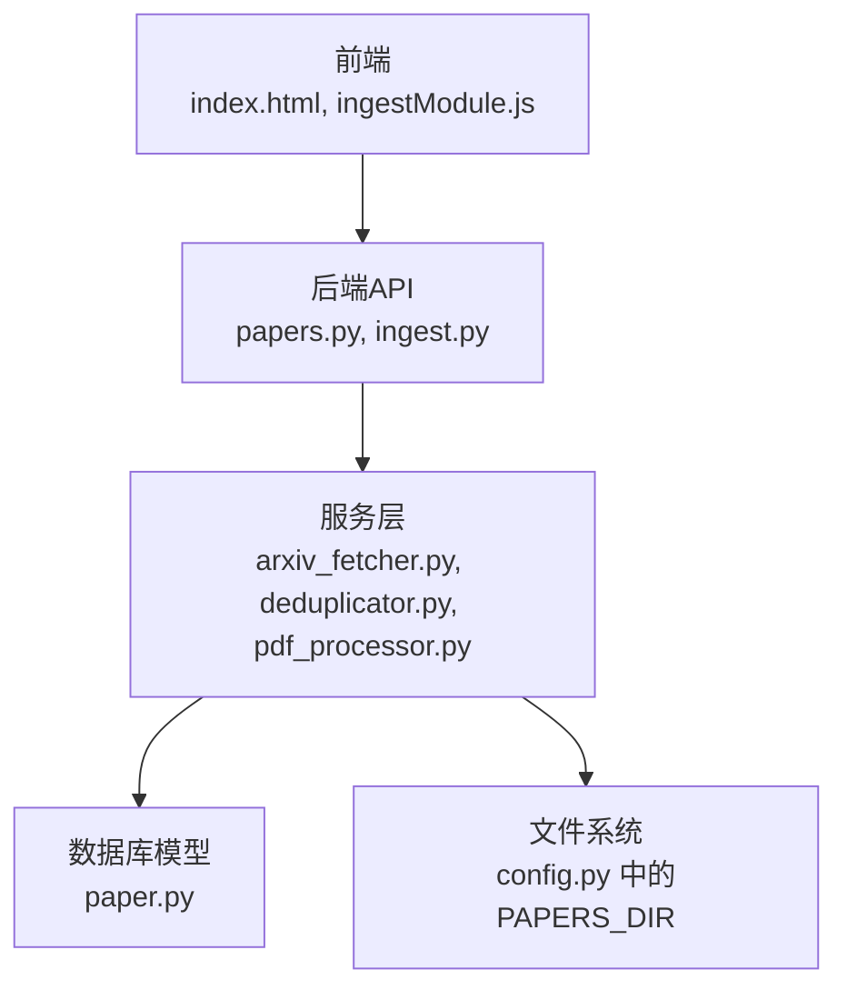
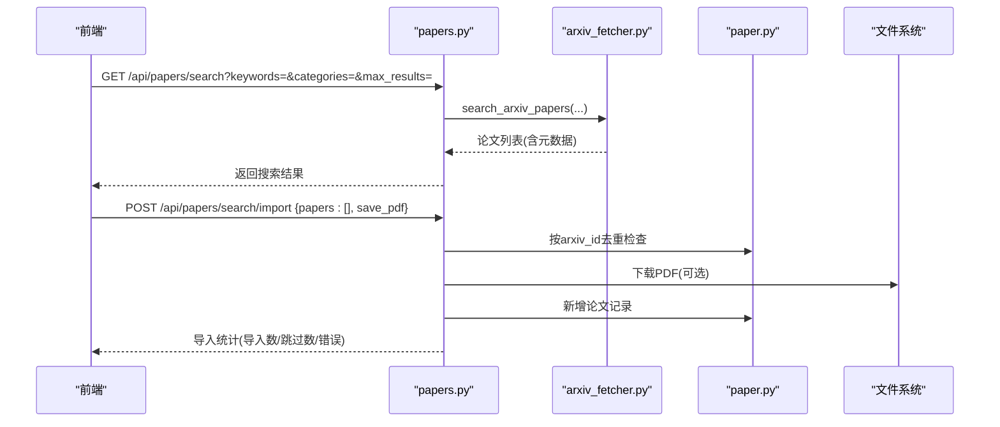
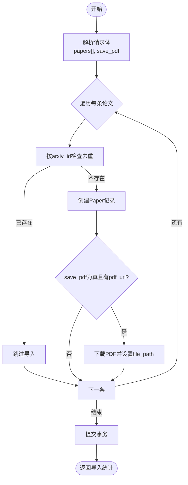
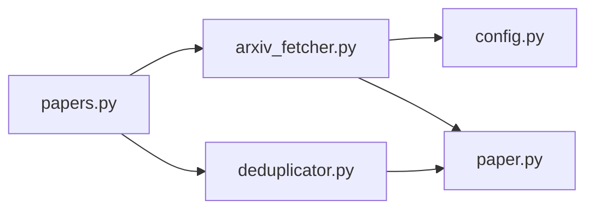

# arXiv论文导入

<cite>
**本文档引用的文件**
- [arxiv_fetcher.py](file://backend/services/arxiv_fetcher.py)
- [papers.py](file://backend/api/papers.py)
- [paper.py](file://backend/models/paper.py)
- [config.py](file://backend/config.py)
- [deduplicator.py](file://backend/services/deduplicator.py)
- [pdf_processor.py](file://backend/services/pdf_processor.py)
- [ingest.py](file://backend/api/ingest.py)
- [index.html](file://frontend/index.html)
- [ingestModule.js](file://frontend/src/modules/ingestModule.js)
- [arxiv_fetcher.yml](file://specs/backend/services/arxiv_fetcher.yml)
- [papers.yml](file://specs/backend/api/papers.yml)
- [pdf_processor.yml](file://specs/backend/services/pdf_processor.yml)
- [test_batch_api.py](file://scripts/tests/test_batch_api.py)
</cite>

## 目录
1. [简介](#简介)
2. [项目结构](#项目结构)
3. [核心组件](#核心组件)
4. [架构总览](#架构总览)
5. [详细组件分析](#详细组件分析)
6. [依赖关系分析](#依赖关系分析)
7. [性能考量](#性能考量)
8. [故障排查指南](#故障排查指南)
9. [结论](#结论)
10. [附录](#附录)

## 简介
本文件面向“arXiv论文导入”功能，系统性阐述从arXiv搜索、元数据提取、PDF下载与文本解析，到批量导入、去重机制、错误处理与用户反馈的完整流程。文档同时给出API接口定义、参数校验、数据处理与质量控制措施，并提供前端交互与批量操作的实践建议。

## 项目结构
后端采用Flask蓝图组织API，服务层封装业务逻辑，模型层定义数据结构；前端通过Vue模块与API交互。关键目录与文件如下：
- 后端API：/backend/api/papers.py（论文检索与导入）、/backend/api/ingest.py（批量入库）
- 服务层：/backend/services/arxiv_fetcher.py（arXiv抓取）、/backend/services/deduplicator.py（去重）、/backend/services/pdf_processor.py（PDF解析）
- 模型层：/backend/models/paper.py（论文模型）
- 配置：/backend/config.py（目录与数据库配置）
- 前端：/frontend/index.html（页面与交互）、/frontend/src/modules/ingestModule.js（入库模块）

图表来源
- [papers.py:1-822](file://backend/api/papers.py#L1-L822)
- [ingest.py:1-251](file://backend/api/ingest.py#L1-L251)
- [arxiv_fetcher.py:1-324](file://backend/services/arxiv_fetcher.py#L1-L324)
- [deduplicator.py:1-124](file://backend/services/deduplicator.py#L1-L124)
- [pdf_processor.py:1-170](file://backend/services/pdf_processor.py#L1-L170)
- [paper.py:1-360](file://backend/models/paper.py#L1-L360)
- [config.py:1-134](file://backend/config.py#L1-L134)

章节来源
- [papers.py:1-822](file://backend/api/papers.py#L1-L822)
- [ingest.py:1-251](file://backend/api/ingest.py#L1-L251)
- [arxiv_fetcher.py:1-324](file://backend/services/arxiv_fetcher.py#L1-L324)
- [deduplicator.py:1-124](file://backend/services/deduplicator.py#L1-L124)
- [pdf_processor.py:1-170](file://backend/services/pdf_processor.py#L1-L170)
- [paper.py:1-360](file://backend/models/paper.py#L1-L360)
- [config.py:1-134](file://backend/config.py#L1-L134)

## 核心组件
- arXiv抓取服务：解析arXiv输入、搜索论文、下载PDF、提取文本
- 论文API：提供arXiv搜索、分类查询、批量导入、单篇更新与删除
- 去重服务：基于arXiv ID、DOI、URL与标题相似度的综合去重
- PDF解析服务：从PDF提取文本与元数据
- 数据模型：论文实体及字段映射
- 配置与存储：数据目录、SQLite数据库、文件保存路径

章节来源
- [arxiv_fetcher.py:1-324](file://backend/services/arxiv_fetcher.py#L1-L324)
- [papers.py:475-696](file://backend/api/papers.py#L475-L696)
- [deduplicator.py:79-112](file://backend/services/deduplicator.py#L79-L112)
- [pdf_processor.py:10-170](file://backend/services/pdf_processor.py#L10-L170)
- [paper.py:120-186](file://backend/models/paper.py#L120-L186)
- [config.py:20-32](file://backend/config.py#L20-L32)

## 架构总览
arXiv导入流程分为“搜索—元数据—PDF—入库—去重—批量导入—质量控制”七个阶段，前后端通过REST API交互，服务层负责与arXiv API、文件系统与数据库交互。

图表来源
- [papers.py:475-696](file://backend/api/papers.py#L475-L696)
- [arxiv_fetcher.py:123-227](file://backend/services/arxiv_fetcher.py#L123-L227)
- [paper.py:120-186](file://backend/models/paper.py#L120-L186)
- [config.py:20-32](file://backend/config.py#L20-L32)

## 详细组件分析

### 1) arXiv搜索与高级筛选
- 支持关键词（多关键词AND逻辑）、分类（多分类OR逻辑）、时间范围（起止日期）、排序（提交日期/更新日期/相关性）与结果数量限制
- 查询参数解析与校验：关键词与分类以逗号分隔，日期格式YYYY-MM-DD，最大结果数限制为100
- 结果转换：将日期对象转换为ISO格式字符串返回

章节来源
- [papers.py:475-551](file://backend/api/papers.py#L475-L551)
- [arxiv_fetcher.yml:3-24](file://specs/backend/services/arxiv_fetcher.yml#L3-L24)
- [papers.yml:327-374](file://specs/backend/api/papers.yml#L327-L374)

### 2) 论文元数据提取与PDF下载
- 元数据：标题、作者、摘要、发表日期、PDF链接、分类、DOI、arXiv ID
- PDF下载：若文件已存在则直接返回相对路径，避免重复下载；下载目录位于data/papers/arxiv
- 文本解析：使用PyMuPDF提取PDF文本，支持相对路径与绝对路径

章节来源
- [arxiv_fetcher.py:32-67](file://backend/services/arxiv_fetcher.py#L32-L67)
- [arxiv_fetcher.py:69-87](file://backend/services/arxiv_fetcher.py#L69-L87)
- [config.py:20-32](file://backend/config.py#L20-L32)

### 3) 批量导入流程
- 接口：POST /api/papers/search/import
- 参数：papers数组（每项包含arxiv_id、title、authors、abstract、pdf_url、categories、category_l1、category_l2、published_at、doi、url等）、save_pdf布尔值
- 去重策略：按arxiv_id去重，已存在则跳过
- 错误处理：逐条导入，记录失败项，事务提交后返回统计

图表来源
- [papers.py:591-696](file://backend/api/papers.py#L591-L696)
- [deduplicator.py:79-112](file://backend/services/deduplicator.py#L79-L112)

章节来源
- [papers.py:591-696](file://backend/api/papers.py#L591-L696)
- [papers.yml:377-403](file://specs/backend/api/papers.yml#L377-L403)

### 4) 去重机制
- 去重依据：arXiv ID、DOI、URL、标题相似度（标准化+词Jaccard+字符Jaccard+编辑距离）
- 标题相似度阈值：≥0.8视为重复
- 重复检测：先精确匹配arXiv ID/DOI/URL，再进行标题相似度扫描

章节来源
- [deduplicator.py:79-112](file://backend/services/deduplicator.py#L79-L112)
- [arxiv_fetcher.yml:43-43](file://specs/backend/services/arxiv_fetcher.yml#L43-L43)

### 5) PDF文本解析与元数据提取
- 文本提取：限制最大读取页数（默认50），异常时返回空文本
- 元数据提取：从文本前若干行提取标题、作者、摘要；从文件名提取标题作为兜底
- 规则：标题/摘要长度截断、作者去重与上限、跳过章节标题

章节来源
- [pdf_processor.py:10-170](file://backend/services/pdf_processor.py#L10-L170)
- [pdf_processor.yml:17-29](file://specs/backend/services/pdf_processor.yml#L17-L29)

### 6) 前端交互与用户反馈
- 前端页面：支持关键词、分类、日期范围筛选，展示搜索结果并标记已导入arXiv ID
- 入库模块：提供arXiv入库按钮，成功/失败消息提示，切换菜单与刷新列表

章节来源
- [index.html:5816-5836](file://frontend/index.html#L5816-L5836)
- [ingestModule.js:9-24](file://frontend/src/modules/ingestModule.js#L9-L24)

## 依赖关系分析
- API层依赖服务层：papers.py调用arxiv_fetcher.search_arxiv_papers，调用deduplicator.check_duplicate
- 服务层依赖模型层：Paper模型用于持久化
- 服务层依赖配置层：PAPERS_DIR用于PDF存储
- 去重服务依赖数据库会话：查询Paper表进行去重判断

图表来源
- [papers.py:475-696](file://backend/api/papers.py#L475-L696)
- [arxiv_fetcher.py:1-324](file://backend/services/arxiv_fetcher.py#L1-L324)
- [deduplicator.py:1-124](file://backend/services/deduplicator.py#L1-L124)
- [paper.py:120-186](file://backend/models/paper.py#L120-L186)
- [config.py:20-32](file://backend/config.py#L20-L32)

章节来源
- [papers.py:475-696](file://backend/api/papers.py#L475-L696)
- [arxiv_fetcher.py:1-324](file://backend/services/arxiv_fetcher.py#L1-L324)
- [deduplicator.py:1-124](file://backend/services/deduplicator.py#L1-L124)
- [paper.py:120-186](file://backend/models/paper.py#L120-L186)
- [config.py:20-32](file://backend/config.py#L20-L32)

## 性能考量
- 搜索限制：max_results上限100，减少网络与解析压力
- 时间范围过滤：在客户端执行，避免返回过多不必要数据
- PDF下载缓存：文件存在则直接返回路径，避免重复下载
- 批量导入：逐条处理并记录错误，保证事务一致性
- 数据库连接池：SQLite连接池配置，降低锁竞争风险

章节来源
- [papers.py:504-505](file://backend/api/papers.py#L504-L505)
- [arxiv_fetcher.py:50-66](file://backend/services/arxiv_fetcher.py#L50-L66)
- [config.py:92-103](file://backend/config.py#L92-L103)

## 故障排查指南
- arXiv搜索失败：检查关键词/分类拼写、日期格式、max_results是否超过100
- PDF下载失败：确认pdf_url有效、网络连通、PAPERS_DIR权限
- 导入重复：确认arxiv_id是否正确、是否存在DOI/URL重复
- 批量导入错误：查看返回的errors数组，定位具体arXiv ID与错误信息
- 前端无响应：检查后端健康状态与端口，确保后端已启动

章节来源
- [papers.py:508-519](file://backend/api/papers.py#L508-L519)
- [papers.py:674-684](file://backend/api/papers.py#L674-L684)
- [test_batch_api.py:317-360](file://scripts/tests/test_batch_api.py#L317-L360)

## 结论
arXiv论文导入功能通过清晰的API边界、健壮的服务层与完善的去重策略，实现了从搜索到入库的全链路自动化。结合前端交互与批量操作能力，既满足个人研究场景下的高效检索与入库，也为后续的笔记标注、标签管理与全文检索打下坚实基础。

## 附录

### API定义与参数说明
- 搜索arXiv论文
  - 方法：GET /api/papers/search
  - 参数：keywords（逗号分隔）、categories（逗号分隔）、max_results（≤100）、start_date/end_date（YYYY-MM-DD）、sort_by（submittedDate/updatedDate/relevance）、sort_order（ascending/descending）
  - 返回：results数组、total、keywords、categories
- 批量导入arXiv论文
  - 方法：POST /api/papers/search/import
  - 请求体：papers（数组）、save_pdf（布尔）
  - 返回：imported、skipped、errors
- 获取arXiv分类
  - 方法：GET /api/papers/search/categories
  - 返回：categories字典、按一级分类分组的grouped_categories

章节来源
- [papers.yml:327-403](file://specs/backend/api/papers.yml#L327-L403)

### 数据模型字段说明
- 论文模型（Paper）关键字段：title、authors、abstract、content、url、source、doi、arxiv_id、published_at、category_l1、category_l2、file_path、save_local、status、starred、created_at、updated_at
- 多对多标签：paper_tags关联表

章节来源
- [paper.py:120-186](file://backend/models/paper.py#L120-L186)