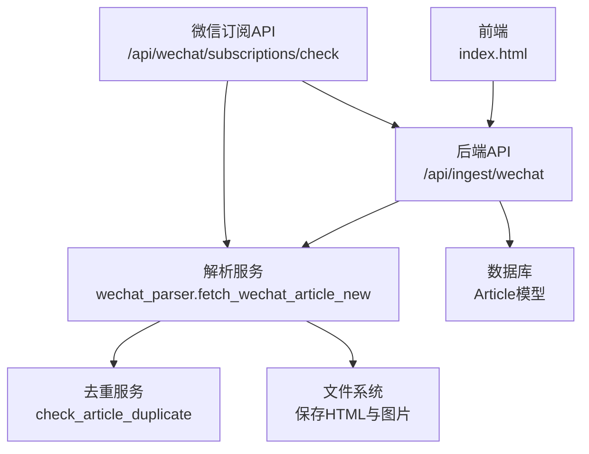
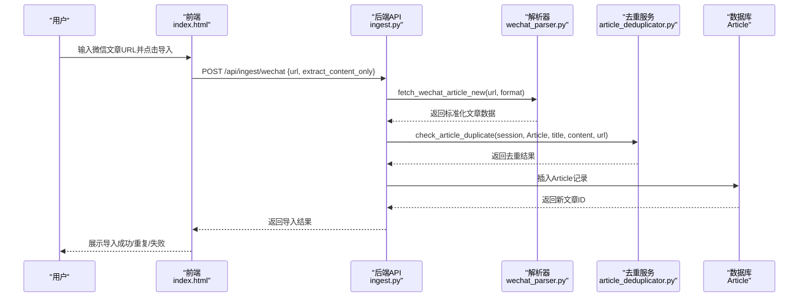
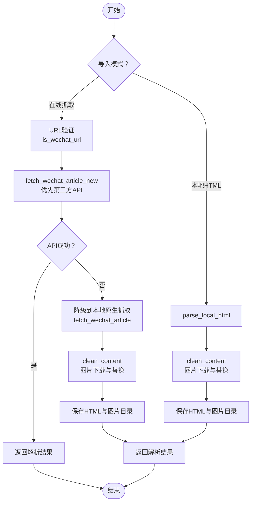
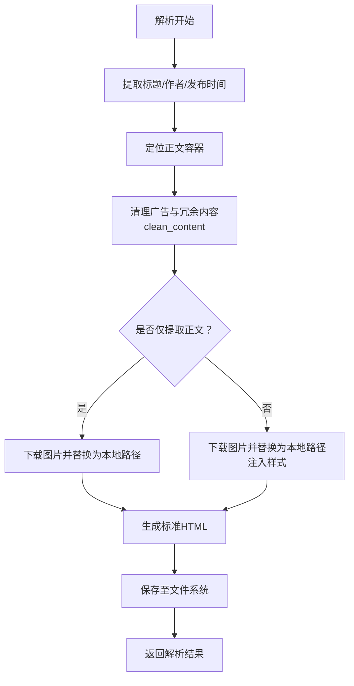
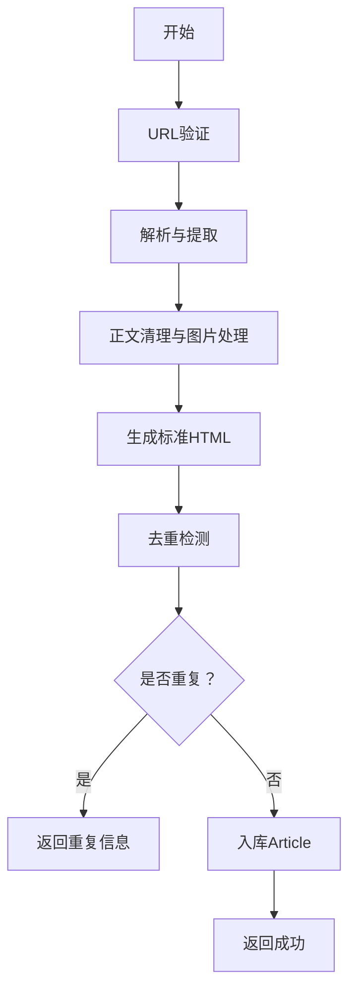
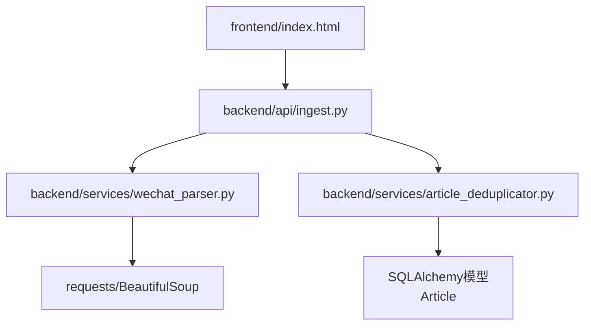

# 微信公众号文章导入

<cite>
**本文档引用的文件**
- [backend/api/wechat_subscription.py](file://backend/api/wechat_subscription.py)
- [backend/api/wechat_subscriptions.py](file://backend/api/wechat_subscriptions.py)
- [backend/api/ingest.py](file://backend/api/ingest.py)
- [backend/api/web_extract.py](file://backend/api/web_extract.py)
- [backend/services/wechat_parser.py](file://backend/services/wechat_parser.py)
- [backend/services/web_parser.py](file://backend/services/web_parser.py)
- [backend/services/article_deduplicator.py](file://backend/services/article_deduplicator.py)
- [frontend/index.html](file://frontend/index.html)
</cite>

## 目录
1. [简介](#简介)
2. [项目结构](#项目结构)
3. [核心组件](#核心组件)
4. [架构总览](#架构总览)
5. [详细组件分析](#详细组件分析)
6. [依赖关系分析](#依赖关系分析)
7. [性能考虑](#性能考虑)
8. [故障排查指南](#故障排查指南)
9. [结论](#结论)
10. [附录](#附录)

## 简介
本文件面向“微信公众号文章导入”功能，系统性阐述两种导入模式（在线抓取与本地HTML文件）的实现差异、URL验证、网页抓取、内容解析与本地文件处理流程；详解微信文章解析器的HTML提取算法、图片资源处理与样式保持机制；并提供Cookie认证、反爬虫应对与内容质量保证措施。文档还覆盖导入前的内容预处理、格式标准化与去重检测流程，以及导入后的文章组织、标签分配与后续处理策略。

## 项目结构
微信公众号文章导入涉及前后端协作：前端负责触发导入、展示进度与批量操作；后端提供API接口、解析服务与去重逻辑；解析器负责从微信文章页面抽取正文、清洗广告与冗余内容、下载并替换图片资源、生成标准HTML；去重服务保障入库内容唯一性。

图表来源
- [frontend/index.html:5942-6281](file://frontend/index.html#L5942-L6281)
- [backend/api/ingest.py:689-758](file://backend/api/ingest.py#L689-L758)
- [backend/services/wechat_parser.py:916-1197](file://backend/services/wechat_parser.py#L916-L1197)
- [backend/services/article_deduplicator.py:134-173](file://backend/services/article_deduplicator.py#L134-L173)

章节来源
- [backend/api/ingest.py:689-758](file://backend/api/ingest.py#L689-L758)
- [frontend/index.html:5942-6281](file://frontend/index.html#L5942-L6281)

## 核心组件
- 导入入口与路由
  - 后端提供微信文章导入接口，接收URL与可选参数（如仅提取正文），进行URL校验、调用解析器、执行去重、入库并返回结果。
- 解析器
  - 支持在线抓取与本地HTML两种模式：在线模式通过第三方API或本地原生抓取；本地模式解析本地HTML文件并生成标准HTML。
- 去重服务
  - 基于URL、标题相似度与内容哈希的综合去重策略，避免重复入库。
- 订阅与精选
  - 提供微信订阅检查与精选公众号TXT备份能力，便于批量管理与离线导入。

章节来源
- [backend/api/ingest.py:689-758](file://backend/api/ingest.py#L689-L758)
- [backend/services/wechat_parser.py:916-1197](file://backend/services/wechat_parser.py#L916-L1197)
- [backend/services/article_deduplicator.py:134-173](file://backend/services/article_deduplicator.py#L134-L173)
- [backend/api/wechat_subscription.py:329-429](file://backend/api/wechat_subscription.py#L329-L429)
- [backend/api/wechat_subscriptions.py:114-196](file://backend/api/wechat_subscriptions.py#L114-L196)

## 架构总览
微信公众号文章导入的端到端流程如下：

图表来源
- [frontend/index.html:5942-6281](file://frontend/index.html#L5942-L6281)
- [backend/api/ingest.py:689-758](file://backend/api/ingest.py#L689-L758)
- [backend/services/wechat_parser.py:916-1197](file://backend/services/wechat_parser.py#L916-L1197)
- [backend/services/article_deduplicator.py:134-173](file://backend/services/article_deduplicator.py#L134-L173)

## 详细组件分析

### 在线抓取模式 vs 本地HTML文件模式
- 在线抓取模式
  - URL验证：is_wechat_url校验是否为微信文章链接。
  - 抓取与解析：fetch_wechat_article_new优先尝试第三方API，失败则降级到本地原生抓取；支持仅提取正文生成新HTML或保存原始页面+JS修复。
  - 图片处理：下载图片并替换为本地相对路径，生成独立图片目录。
  - 样式保持：注入必要的CSS以恢复阅读体验。
- 本地HTML文件模式
  - 文件识别：is_local_html_file判断是否为本地HTML。
  - 解析与保存：parse_local_html解析标题、作者、发布时间、正文与图片，生成标准HTML与资源目录。
  - 图片处理：与在线模式一致，下载并替换图片，移除微信专用属性。

图表来源
- [backend/services/wechat_parser.py:256-278](file://backend/services/wechat_parser.py#L256-L278)
- [backend/services/wechat_parser.py:916-1197](file://backend/services/wechat_parser.py#L916-L1197)
- [backend/services/wechat_parser.py:326-601](file://backend/services/wechat_parser.py#L326-L601)
- [backend/services/wechat_parser.py:78-254](file://backend/services/wechat_parser.py#L78-L254)

章节来源
- [backend/services/wechat_parser.py:256-278](file://backend/services/wechat_parser.py#L256-L278)
- [backend/services/wechat_parser.py:916-1197](file://backend/services/wechat_parser.py#L916-L1197)
- [backend/services/wechat_parser.py:326-601](file://backend/services/wechat_parser.py#L326-L601)
- [backend/services/wechat_parser.py:78-254](file://backend/services/wechat_parser.py#L78-L254)

### URL验证与第三方API集成
- URL验证：is_wechat_url基于域名与路径判断是否为微信文章链接。
- 第三方API：fetch_wechat_article_new优先调用第三方API获取标题、作者、账号、内容与发布时间；若失败则降级到本地原生抓取。
- 反爬虫与稳定性：使用合理的User-Agent、超时控制与异常降级，提升成功率与鲁棒性。

章节来源
- [backend/services/wechat_parser.py:256-278](file://backend/services/wechat_parser.py#L256-L278)
- [backend/services/wechat_parser.py:916-1197](file://backend/services/wechat_parser.py#L916-L1197)

### 内容解析与HTML提取算法
- 标题与元信息：优先从特定ID/类名提取，回退到title或其他常见位置。
- 发布时间：优先解析页面中的日期文本，若当日发布则从页面中提取有效时间戳估算发布时间。
- 正文与广告清理：clean_content移除微信专用属性、脚本/style/iframe、底部栏与装饰性元素；保留有用样式（对齐、颜色、边框等）。
- 图片处理：遍历img标签，下载远程图片，推断格式（png/gif/jpg），替换为本地相对路径，无法下载的图片直接移除。
- 样式保持：注入必要的CSS以恢复阅读体验，确保图片、表格、代码块、列表与引用的可读性。

图表来源
- [backend/services/wechat_parser.py:604-800](file://backend/services/wechat_parser.py#L604-L800)
- [backend/services/wechat_parser.py:447-588](file://backend/services/wechat_parser.py#L447-L588)
- [backend/services/wechat_parser.py:1100-1152](file://backend/services/wechat_parser.py#L1100-L1152)

章节来源
- [backend/services/wechat_parser.py:604-800](file://backend/services/wechat_parser.py#L604-L800)
- [backend/services/wechat_parser.py:447-588](file://backend/services/wechat_parser.py#L447-L588)
- [backend/services/wechat_parser.py:1100-1152](file://backend/services/wechat_parser.py#L1100-L1152)

### 图片资源处理与样式保持机制
- 图片下载与替换
  - 遍历img标签，下载远程图片并推断格式；替换为本地相对路径，无法下载则移除。
  - 生成独立图片目录，文件名按顺序编号并保留扩展名。
- 样式保持
  - 注入基础样式以恢复阅读体验，包括字体、段落间距、标题层级、代码块、表格、列表与引用。
  - 保留关键内联样式（对齐、颜色、边框等），移除无用属性，确保最终HTML简洁可读。

章节来源
- [backend/services/wechat_parser.py:447-588](file://backend/services/wechat_parser.py#L447-L588)
- [backend/services/wechat_parser.py:1100-1152](file://backend/services/wechat_parser.py#L1100-L1152)

### Cookie认证、反爬虫应对与内容质量保证
- Cookie认证
  - 当前微信导入主要通过URL与第三方API/本地抓取完成，未见显式的Cookie认证流程；若需登录态访问，可在请求头中携带Cookie（具体实现取决于上游API要求）。
- 反爬虫应对
  - 使用合理的User-Agent与Referer，设置超时与异常捕获，对第三方API失败进行自动降级。
- 内容质量保证
  - 多种解析策略（第三方API、本地原生抓取）互为补充；正文清理与样式注入确保输出HTML质量；去重机制避免重复入库。

章节来源
- [backend/services/wechat_parser.py:11-12](file://backend/services/wechat_parser.py#L11-L12)
- [backend/services/wechat_parser.py:916-1197](file://backend/services/wechat_parser.py#L916-L1197)

### 导入前的内容预处理、格式标准化与去重检测
- 预处理
  - URL校验与第三方API优先调用，失败后本地原生抓取。
  - 正文清理与图片下载，生成标准HTML。
- 格式标准化
  - 统一标题、元信息与正文结构，注入阅读友好的CSS。
- 去重检测
  - check_article_duplicate综合URL、标题相似度与内容哈希，避免重复入库；系列文章标识特殊处理，避免误判。

图表来源
- [backend/api/ingest.py:689-758](file://backend/api/ingest.py#L689-L758)
- [backend/services/article_deduplicator.py:134-173](file://backend/services/article_deduplicator.py#L134-L173)

章节来源
- [backend/api/ingest.py:689-758](file://backend/api/ingest.py#L689-L758)
- [backend/services/article_deduplicator.py:134-173](file://backend/services/article_deduplicator.py#L134-L173)

### 导入后的文章组织、标签分配与后续处理策略
- 文章组织
  - 导入成功后，文章以HTML形式保存至文件系统，数据库中记录标题、作者、来源、URL、发布时间与文件路径。
- 标签分配
  - 当前实现未见自动标签分配逻辑；可结合业务需求扩展为基于关键词、分类或人工标注。
- 后续处理
  - 支持批量导入与订阅检查；可结合全文检索与筛选功能进行管理。

章节来源
- [backend/api/ingest.py:689-758](file://backend/api/ingest.py#L689-L758)
- [backend/api/wechat_subscription.py:329-429](file://backend/api/wechat_subscription.py#L329-L429)

## 依赖关系分析
微信公众号文章导入的关键依赖关系如下：

图表来源
- [frontend/index.html:5942-6281](file://frontend/index.html#L5942-L6281)
- [backend/api/ingest.py:689-758](file://backend/api/ingest.py#L689-L758)
- [backend/services/wechat_parser.py:1-12](file://backend/services/wechat_parser.py#L1-L12)
- [backend/services/article_deduplicator.py:1-173](file://backend/services/article_deduplicator.py#L1-L173)

章节来源
- [backend/api/ingest.py:689-758](file://backend/api/ingest.py#L689-L758)
- [backend/services/wechat_parser.py:1-12](file://backend/services/wechat_parser.py#L1-L12)
- [backend/services/article_deduplicator.py:1-173](file://backend/services/article_deduplicator.py#L1-L173)

## 性能考虑
- 请求与解析
  - 设置合理超时与User-Agent，避免被目标站点限流。
  - 第三方API失败时快速降级到本地原生抓取，减少整体耗时。
- 图片处理
  - 并发下载图片时建议增加重试与并发上限控制，避免阻塞主线程。
- 去重效率
  - 标题相似度与内容哈希可显著降低全表扫描成本；建议在高并发场景下缓存热点文章的去重结果。

## 故障排查指南
- 常见问题
  - URL无效：确认是否为微信文章链接，使用is_wechat_url进行校验。
  - 第三方API失败：查看日志与异常信息，系统会自动降级到本地原生抓取。
  - 图片下载失败：检查网络与防盗链策略，必要时使用代理图片接口。
  - 重复导入：去重服务会返回重复项信息，避免二次入库。
- 前端交互
  - 导入按钮支持批量导入与重复提示，失败时显示错误信息并统计结果。

章节来源
- [backend/services/wechat_parser.py:916-1197](file://backend/services/wechat_parser.py#L916-L1197)
- [backend/api/ingest.py:689-758](file://backend/api/ingest.py#L689-L758)
- [frontend/index.html:5942-6281](file://frontend/index.html#L5942-L6281)

## 结论
微信公众号文章导入功能通过“在线抓取+本地HTML”的双模式设计，结合第三方API与本地原生抓取的自动降级策略，实现了高成功率与高鲁棒性的内容获取。解析器采用精细化的HTML提取与清理算法，配合图片下载与样式注入，确保输出HTML的质量与可读性。去重服务与数据库模型共同保障入库内容的唯一性。未来可在Cookie认证、标签分配与批量处理等方面进一步增强。

## 附录
- 相关API与服务
  - 微信订阅检查：/api/wechat/subscriptions/check
  - 微信图片代理：/api/wechat/proxy_image
  - 通用网页提取：/api/web/extract
  - 通用网页保存：/api/web/save-page
  - 微信文章导入：/api/ingest/wechat

章节来源
- [backend/api/wechat_subscription.py:148-220](file://backend/api/wechat_subscription.py#L148-L220)
- [backend/api/web_extract.py:18-61](file://backend/api/web_extract.py#L18-L61)
- [backend/api/ingest.py:689-758](file://backend/api/ingest.py#L689-L758)