# 数据导入和处理

<cite>
**本文档引用的文件**
- [backend/app.py](file://backend/app.py)
- [backend/api/ingest.py](file://backend/api/ingest.py)
- [backend/services/arxiv_fetcher.py](file://backend/services/arxiv_fetcher.py)
- [backend/services/wechat_parser.py](file://backend/services/wechat_parser.py)
- [backend/services/zhihu_parser.py](file://backend/services/zhihu_parser.py)
- [backend/services/pdf_processor.py](file://backend/services/pdf_processor.py)
- [backend/services/web_parser.py](file://backend/services/web_parser.py)
- [backend/services/note_importer.py](file://backend/services/note_importer.py)
- [backend/services/deduplicator.py](file://backend/services/deduplicator.py)
- [backend/services/article_deduplicator.py](file://backend/services/article_deduplicator.py)
- [backend/services/note_deduplicator.py](file://backend/services/note_deduplicator.py)
- [backend/models/paper.py](file://backend/models/paper.py)
- [backend/config.py](file://backend/config.py)
- [frontend/src/modules/ingestModule.js](file://frontend/src/modules/ingestModule.js)
- [specs/backend/api/ingest.yml](file://specs/backend/api/ingest.yml)
- [scripts/maintenance/backup.py](file://scripts/maintenance/backup.py)
</cite>

## 目录
1. [简介](#简介)
2. [项目结构](#项目结构)
3. [核心组件](#核心组件)
4. [架构总览](#架构总览)
5. [详细组件分析](#详细组件分析)
6. [依赖关系分析](#依赖关系分析)
7. [性能考量](#性能考量)
8. [故障排除指南](#故障排除指南)
9. [结论](#结论)
10. [附录](#附录)

## 简介
本文件系统性阐述 PaperHub 的多源数据导入与处理体系，覆盖 arXiv 论文、微信公众号、知乎文章、AI 对话笔记以及通用网页等多种数据源的统一架构设计。文档重点说明数据处理管道（清洗、验证、文件本地化、元数据提取）、解析策略、去重机制与质量保障、性能优化、错误处理与用户反馈，以及数据迁移与历史数据处理策略。

## 项目结构
PaperHub 采用前后端分离的 Flask 后端 + 前端模块化架构。后端通过蓝图注册 API，服务层负责具体的数据抓取、解析与处理，模型层定义数据库结构；前端通过模块化封装调用后端 API 并展示反馈。

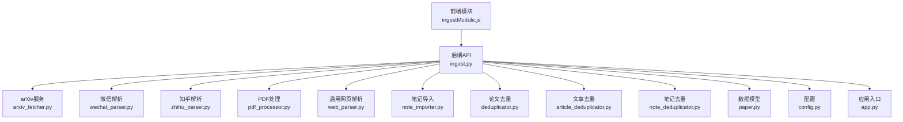

**图表来源**
- [backend/app.py](file://backend/app.py)
- [backend/api/ingest.py](file://backend/api/ingest.py)
- [backend/services/arxiv_fetcher.py](file://backend/services/arxiv_fetcher.py)
- [backend/services/wechat_parser.py](file://backend/services/wechat_parser.py)
- [backend/services/zhihu_parser.py](file://backend/services/zhihu_parser.py)
- [backend/services/pdf_processor.py](file://backend/services/pdf_processor.py)
- [backend/services/web_parser.py](file://backend/services/web_parser.py)
- [backend/services/note_importer.py](file://backend/services/note_importer.py)
- [backend/services/deduplicator.py](file://backend/services/deduplicator.py)
- [backend/services/article_deduplicator.py](file://backend/services/article_deduplicator.py)
- [backend/services/note_deduplicator.py](file://backend/services/note_deduplicator.py)
- [backend/models/paper.py](file://backend/models/paper.py)
- [backend/config.py](file://backend/config.py)

**章节来源**
- [backend/app.py](file://backend/app.py)
- [backend/api/ingest.py](file://backend/api/ingest.py)
- [specs/backend/api/ingest.yml](file://specs/backend/api/ingest.yml)

## 核心组件
- 统一入库 API：集中暴露多源导入接口，负责参数校验、调用对应服务、执行去重、持久化与响应。
- 数据源服务：针对不同来源实现专用解析器与抓取器，确保内容提取与本地化。
- 去重机制：论文、文章、笔记分别提供去重策略，兼顾标题相似度、内容哈希与唯一标识。
- 数据模型：统一的 Paper、Article、Note 模型及多对多标签关联，支撑跨源关联与检索。
- 配置与存储：SQLite 数据库、数据目录结构、文件上传限制与向量索引路径。

**章节来源**
- [backend/api/ingest.py](file://backend/api/ingest.py)
- [backend/services/deduplicator.py](file://backend/services/deduplicator.py)
- [backend/services/article_deduplicator.py](file://backend/services/article_deduplicator.py)
- [backend/services/note_deduplicator.py](file://backend/services/note_deduplicator.py)
- [backend/models/paper.py](file://backend/models/paper.py)
- [backend/config.py](file://backend/config.py)

## 架构总览
PaperHub 的导入架构遵循“API 控制器 + 服务层 + 模型层”的分层设计。API 层负责路由与参数校验，服务层负责业务逻辑与外部交互，模型层负责数据持久化与关系映射。整体通过统一的去重策略与文件本地化机制，确保数据一致性与可检索性。

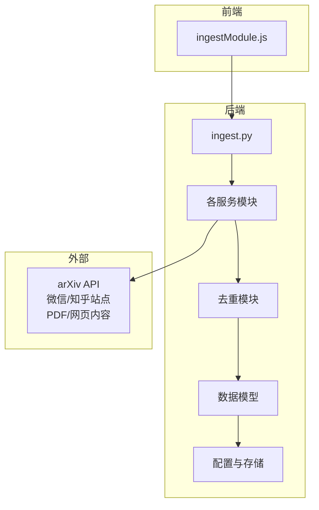

**图表来源**
- [frontend/src/modules/ingestModule.js](file://frontend/src/modules/ingestModule.js)
- [backend/api/ingest.py](file://backend/api/ingest.py)
- [backend/services/arxiv_fetcher.py](file://backend/services/arxiv_fetcher.py)
- [backend/services/wechat_parser.py](file://backend/services/wechat_parser.py)
- [backend/services/zhihu_parser.py](file://backend/services/zhihu_parser.py)
- [backend/services/pdf_processor.py](file://backend/services/pdf_processor.py)
- [backend/services/web_parser.py](file://backend/services/web_parser.py)
- [backend/services/deduplicator.py](file://backend/services/deduplicator.py)
- [backend/services/article_deduplicator.py](file://backend/services/article_deduplicator.py)
- [backend/services/note_deduplicator.py](file://backend/services/note_deduplicator.py)
- [backend/models/paper.py](file://backend/models/paper.py)
- [backend/config.py](file://backend/config.py)

## 详细组件分析

### 统一入库 API 设计
- 路由组织：通过蓝图注册论文、笔记、文章、微信、网页等导入接口，统一前缀 `/api/ingest`。
- 参数校验：对必需字段进行校验，对日期、URL、文件类型进行格式与范围约束。
- 事务与批量：批量导入时使用数据库事务，失败项单独记录，保证原子性与可观测性。
- 去重集成：在入库前调用对应去重模块，避免重复数据进入系统。
- 响应规范：统一返回消息、计数与错误明细，便于前端展示与用户反馈。

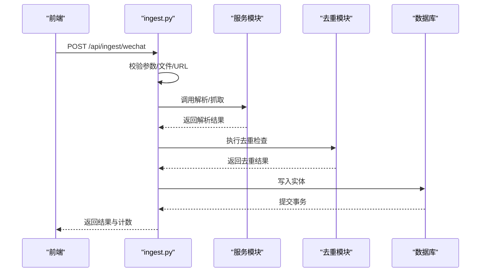

**图表来源**
- [backend/api/ingest.py](file://backend/api/ingest.py)
- [backend/services/wechat_parser.py](file://backend/services/wechat_parser.py)
- [backend/services/article_deduplicator.py](file://backend/services/article_deduplicator.py)

**章节来源**
- [backend/api/ingest.py](file://backend/api/ingest.py)
- [specs/backend/api/ingest.yml](file://specs/backend/api/ingest.yml)

### arXiv 论文导入
- 输入解析：支持 URL、ID、带 arxiv.org 前缀的多种输入形式。
- 远程搜索：关键词、分类、时间范围、排序策略，返回候选论文列表。
- 批量导入：按 arXiv ID 拉取元数据，可选下载 PDF 并提取文本，自动去重。
- 本地化：PDF 保存至独立目录，文本内容可用于检索与全文索引。

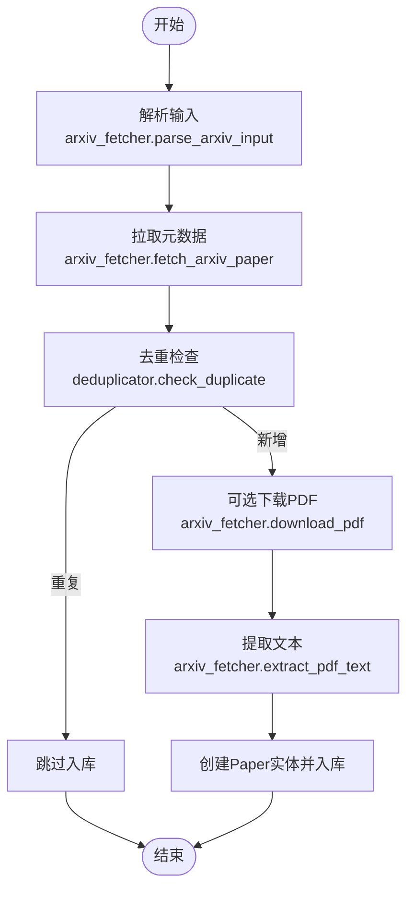

**图表来源**
- [backend/services/arxiv_fetcher.py](file://backend/services/arxiv_fetcher.py)
- [backend/services/deduplicator.py](file://backend/services/deduplicator.py)

**章节来源**
- [backend/services/arxiv_fetcher.py](file://backend/services/arxiv_fetcher.py)
- [backend/api/ingest.py](file://backend/api/ingest.py)

### 微信公众号文章导入
- URL 校验：识别微信文章链接，支持两种解析模式（仅正文提取/完整页面保存）。
- 内容清洗：移除微信特有的属性与广告、脚本、样式，保留正文与图片。
- 图片本地化：下载远程图片到本地目录，替换为相对路径，提升离线可读性。
- 去重策略：基于 URL、标题相似度与内容哈希三重校验，避免重复入库。

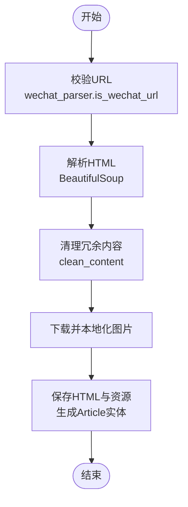

**图表来源**
- [backend/services/wechat_parser.py](file://backend/services/wechat_parser.py)
- [backend/services/article_deduplicator.py](file://backend/services/article_deduplicator.py)

**章节来源**
- [backend/services/wechat_parser.py](file://backend/services/wechat_parser.py)
- [backend/api/ingest.py](file://backend/api/ingest.py)

### 知乎文章导入
- Cookie 认证：通过浏览器复制的 Cookie 访问知乎站点，规避反爬限制。
- 结构化解析：提取标题、作者、发布时间与正文，Markdown 渲染为 HTML。
- 本地化存储：同时生成 .md 与 .html 文件，便于阅读与检索。
- 去重策略：支持 URL、标题与内容哈希的综合去重。

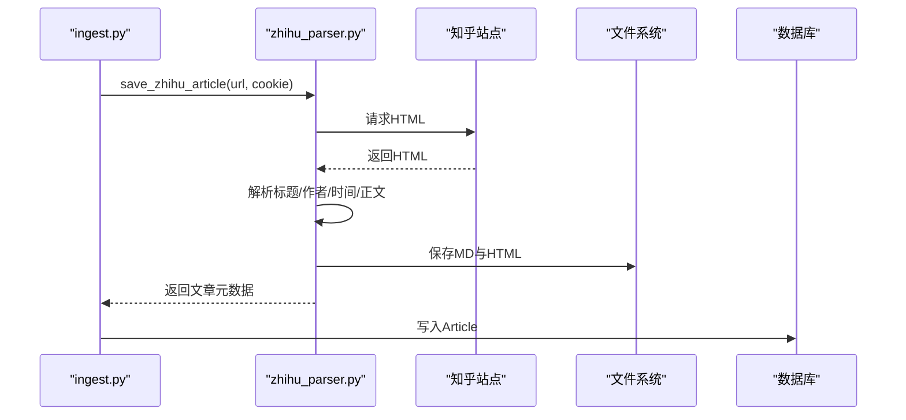

**图表来源**
- [backend/services/zhihu_parser.py](file://backend/services/zhihu_parser.py)
- [backend/api/ingest.py](file://backend/api/ingest.py)

**章节来源**
- [backend/services/zhihu_parser.py](file://backend/services/zhihu_parser.py)
- [backend/api/ingest.py](file://backend/api/ingest.py)

### AI 对话笔记导入
- Markdown 渲染：将 Markdown 内容渲染为完整 HTML 页面，保留结构与样式。
- 本地化：同时生成 .md 与 .html 文件，便于后续检索与阅读。
- 去重策略：基于 URL、标题相似度与内容哈希，避免重复笔记。

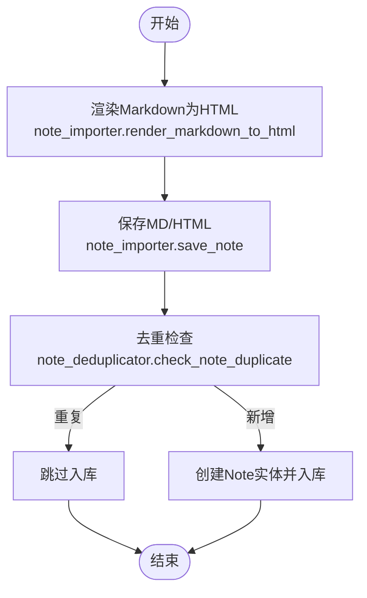

**图表来源**
- [backend/services/note_importer.py](file://backend/services/note_importer.py)
- [backend/services/note_deduplicator.py](file://backend/services/note_deduplicator.py)

**章节来源**
- [backend/services/note_importer.py](file://backend/services/note_importer.py)
- [backend/api/ingest.py](file://backend/api/ingest.py)

### 通用网页导入与预览
- 预览模式：不入库，仅提取标题、作者、正文与最佳方法，供用户确认。
- 入库模式：支持手动编辑后的标题、作者与正文/HTML，自动下载远程图片并替换路径。
- 多策略提取：Trafilatura、Readability、Newspaper3k、BeautifulSoup 多路并行，择优返回。

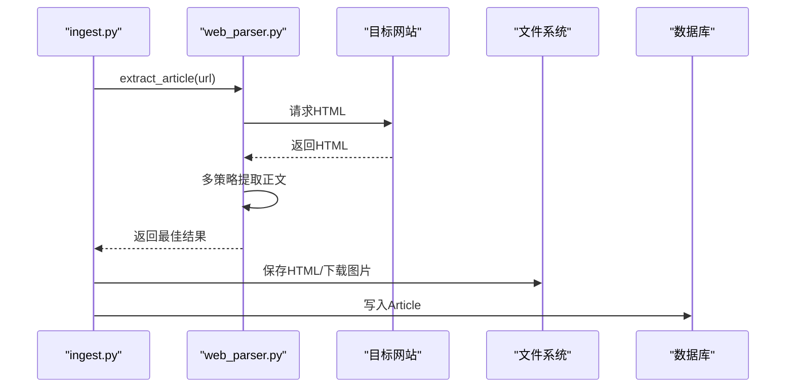

**图表来源**
- [backend/services/web_parser.py](file://backend/services/web_parser.py)
- [backend/api/ingest.py](file://backend/api/ingest.py)

**章节来源**
- [backend/services/web_parser.py](file://backend/services/web_parser.py)
- [backend/api/ingest.py](file://backend/api/ingest.py)

### PDF 文件导入
- 文件类型：支持 PDF 与 HTML（微信公众号本地 HTML）。
- PDF 处理：提取文本、标题、作者、摘要，必要时从文件名推断标题。
- 去重策略：基于标题相似度与文件路径，避免重复入库。
- 本地化：PDF 保存至 data/papers/uploaded 目录，便于后续检索。

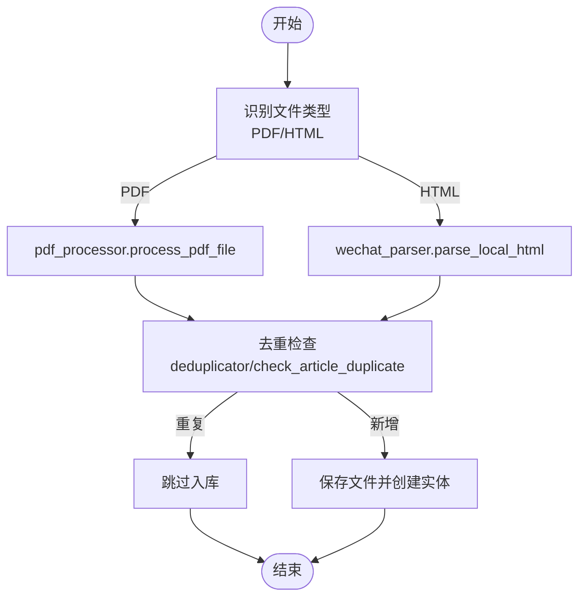

**图表来源**
- [backend/services/pdf_processor.py](file://backend/services/pdf_processor.py)
- [backend/services/wechat_parser.py](file://backend/services/wechat_parser.py)
- [backend/api/ingest.py](file://backend/api/ingest.py)

**章节来源**
- [backend/services/pdf_processor.py](file://backend/services/pdf_processor.py)
- [backend/api/ingest.py](file://backend/api/ingest.py)

### 去重机制与质量保证
- 论文去重：优先匹配 arXiv ID、DOI、URL，其次使用标题标准化与相似度阈值。
- 文章去重：URL 完整匹配优先，其次标题相似度与内容前 500 字符哈希。
- 笔记去重：URL、标题相似度与内容哈希三重策略，支持重复组查找与批量删除。
- 质量控制：统一的字段校验、异常捕获与错误响应，前端友好提示。

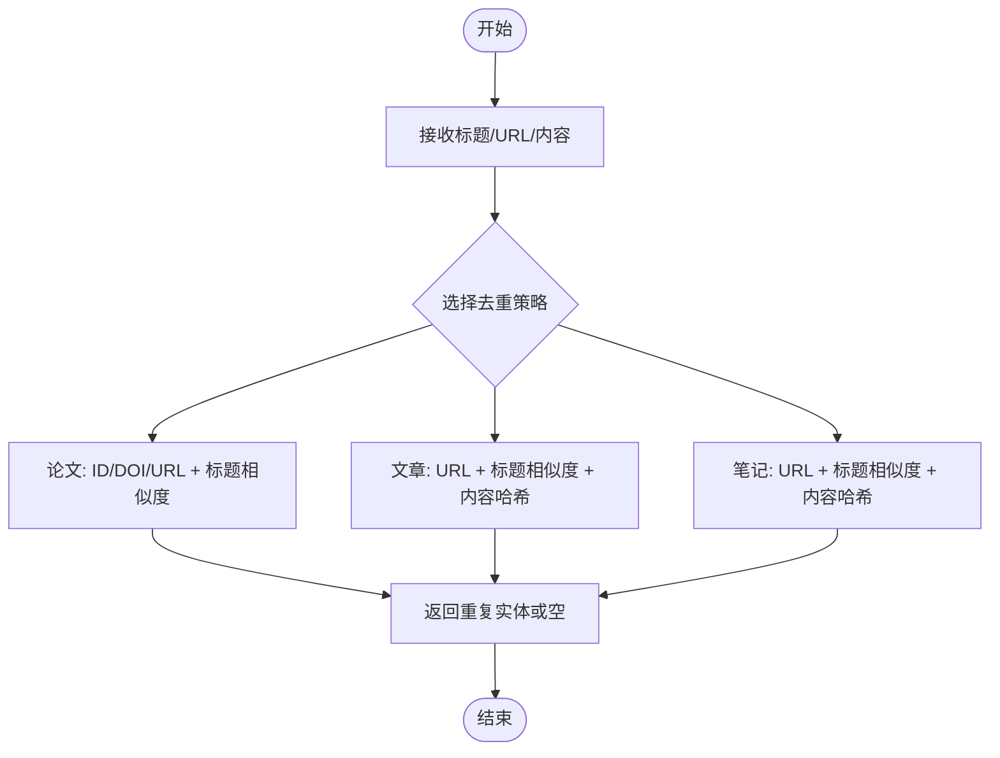

**图表来源**
- [backend/services/deduplicator.py](file://backend/services/deduplicator.py)
- [backend/services/article_deduplicator.py](file://backend/services/article_deduplicator.py)
- [backend/services/note_deduplicator.py](file://backend/services/note_deduplicator.py)

**章节来源**
- [backend/services/deduplicator.py](file://backend/services/deduplicator.py)
- [backend/services/article_deduplicator.py](file://backend/services/article_deduplicator.py)
- [backend/services/note_deduplicator.py](file://backend/services/note_deduplicator.py)

### 数据模型与关系
Paper、Article、Note 三类实体分别承载论文、网络文章与个人笔记，均支持标签多对多关联与跨源关联（如文章与论文、笔记与论文/文章）。PaperVersion 支持版本管理，便于追踪差异。

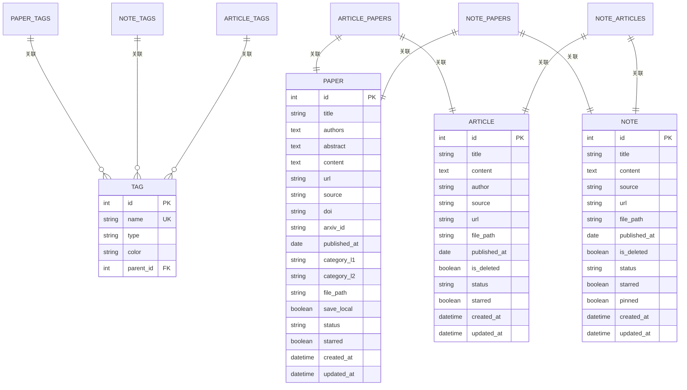

**图表来源**
- [backend/models/paper.py](file://backend/models/paper.py)

**章节来源**
- [backend/models/paper.py](file://backend/models/paper.py)

### 数据迁移与历史数据处理
- 迁移入口：应用启动时检测是否存在待迁移的笔记（source='note'），提示用户执行迁移脚本。
- 备份策略：提供命令行备份工具，自动打包数据库与 papers 目录，支持列出备份与自定义命名。
- 恢复流程：通过备份 ZIP 中的数据库与文件恢复，建议在停机维护窗口执行。

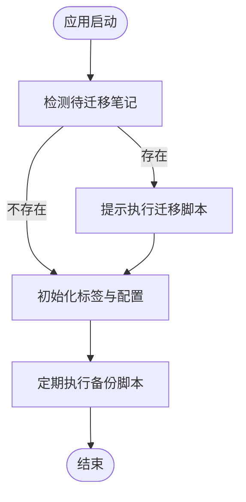

**图表来源**
- [backend/app.py](file://backend/app.py)
- [scripts/maintenance/backup.py](file://scripts/maintenance/backup.py)

**章节来源**
- [backend/app.py](file://backend/app.py)
- [scripts/maintenance/backup.py](file://scripts/maintenance/backup.py)

## 依赖关系分析
- 组件耦合：API 层仅依赖服务层接口，服务层依赖第三方库与配置模块，模型层依赖 SQLAlchemy。
- 去重模块：论文/文章/笔记各自独立，避免相互影响；API 层按数据类型选择对应去重策略。
- 外部依赖：arXiv SDK、requests、BeautifulSoup、PyPDF2、markdown 等，需注意版本兼容与超时控制。

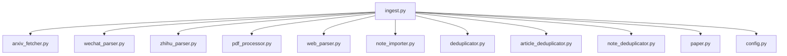

**图表来源**
- [backend/api/ingest.py](file://backend/api/ingest.py)
- [backend/services/arxiv_fetcher.py](file://backend/services/arxiv_fetcher.py)
- [backend/services/wechat_parser.py](file://backend/services/wechat_parser.py)
- [backend/services/zhihu_parser.py](file://backend/services/zhihu_parser.py)
- [backend/services/pdf_processor.py](file://backend/services/pdf_processor.py)
- [backend/services/web_parser.py](file://backend/services/web_parser.py)
- [backend/services/note_importer.py](file://backend/services/note_importer.py)
- [backend/services/deduplicator.py](file://backend/services/deduplicator.py)
- [backend/services/article_deduplicator.py](file://backend/services/article_deduplicator.py)
- [backend/services/note_deduplicator.py](file://backend/services/note_deduplicator.py)
- [backend/models/paper.py](file://backend/models/paper.py)
- [backend/config.py](file://backend/config.py)

**章节来源**
- [backend/api/ingest.py](file://backend/api/ingest.py)
- [backend/config.py](file://backend/config.py)

## 性能考量
- 连接池与会话：全局单例引擎与线程安全 ScopedSession，合理设置连接池大小与回收周期，避免 SQLite 锁竞争。
- 批量导入：批量 API 使用事务提交，减少 IO 次数；对 PDF 文本提取限制最大页数，避免超长文档阻塞。
- 网页解析：多策略并行，优先 Trafilatura/Readability，失败回退至 BeautifulSoup；对编码进行多方案尝试，避免乱码导致的解析失败。
- 图片处理：微信图片下载设置超时与失败容忍，缺失图片时仍保证页面可读性。
- 去重策略：对大规模数据采用分段扫描与阈值控制，避免 O(n^2) 复杂度。

[本节为通用指导，无需特定文件引用]

## 故障排除指南
- 400/409 错误：检查必填字段、URL 格式、文件类型与去重冲突；查看 API 规范与错误码。
- 500 错误：查看后端异常堆栈与日志，定位第三方服务调用失败或解析异常。
- arXiv 限流：调整查询频率与参数，避免触发限流；必要时使用缓存与降级策略。
- 网页编码：若出现乱码，优先检查编码尝试顺序与 fallback 逻辑。
- 图片下载失败：检查网络与目标站点权限，设置重试与超时参数。

**章节来源**
- [backend/api/ingest.py](file://backend/api/ingest.py)
- [backend/services/web_parser.py](file://backend/services/web_parser.py)
- [backend/services/wechat_parser.py](file://backend/services/wechat_parser.py)

## 结论
PaperHub 的数据导入与处理系统以统一 API 为核心，结合多源解析器与完善的去重机制，实现了论文、文章与笔记的高质量入库。通过文件本地化、多策略网页解析与健壮的错误处理，系统在易用性与稳定性之间取得平衡。配合备份与迁移工具，能够满足长期演进与数据治理需求。

[本节为总结性内容，无需特定文件引用]

## 附录
- 前端调用示例：通过 ingestModule.js 封装的 ingestArxiv 与 ingestWechat 方法，简化用户操作与错误提示。
- API 规范：参考 ingest.yml，明确各接口输入输出与规则，便于前后端协作与测试。

**章节来源**
- [frontend/src/modules/ingestModule.js](file://frontend/src/modules/ingestModule.js)
- [specs/backend/api/ingest.yml](file://specs/backend/api/ingest.yml)