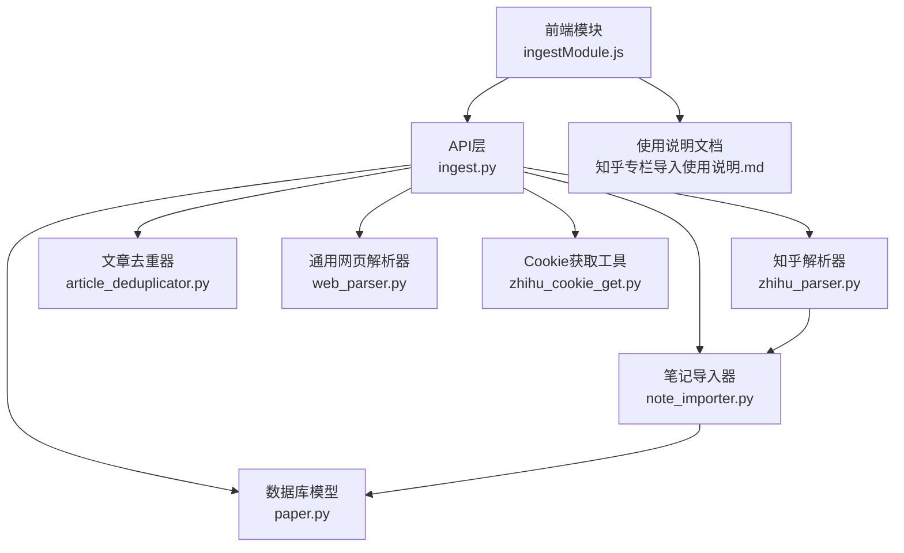
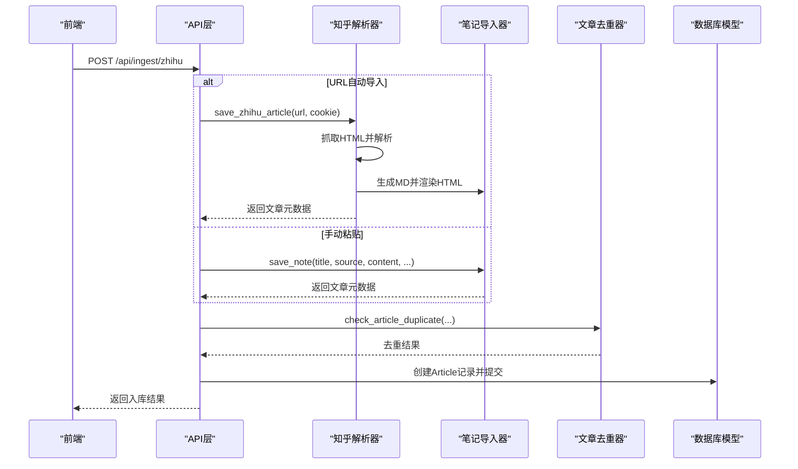
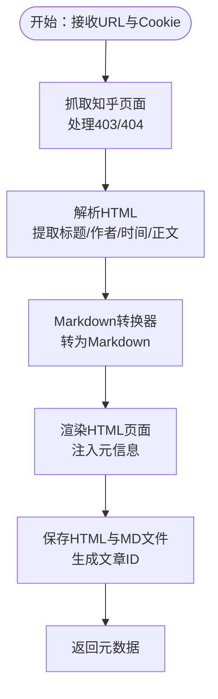
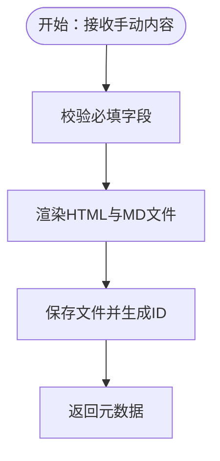
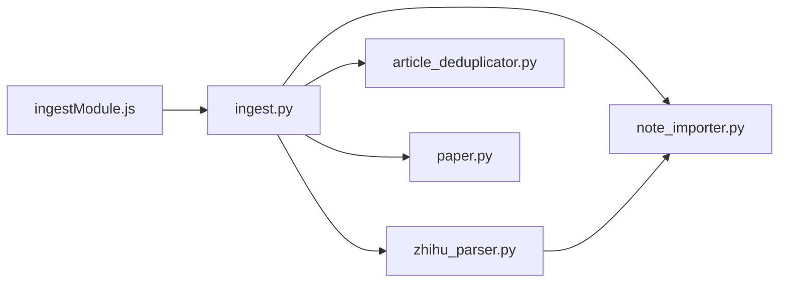

# 知乎文章导入

<cite>
**本文档引用的文件**
- [zhihu_parser.py](file://backend/services/zhihu_parser.py)
- [ingest.py](file://backend/api/ingest.py)
- [note_importer.py](file://backend/services/note_importer.py)
- [web_parser.py](file://backend/services/web_parser.py)
- [paper.py](file://backend/models/paper.py)
- [article_deduplicator.py](file://backend/services/article_deduplicator.py)
- [note_deduplicator.py](file://backend/services/note_deduplicator.py)
- [zhihu_parser.yml](file://specs/backend/services/zhihu_parser.yml)
- [ingest.yml](file://specs/backend/api/ingest.yml)
- [ingestModule.js](file://frontend/src/modules/ingestModule.js)
- [zhihu_cookie_get.py](file://tools/zhihu_cookie_get.py)
- [知乎专栏导入使用说明.md](file://docs/知乎专栏导入使用说明.md)
</cite>

## 目录
1. [简介](#简介)
2. [项目结构](#项目结构)
3. [核心组件](#核心组件)
4. [架构总览](#架构总览)
5. [详细组件分析](#详细组件分析)
6. [依赖关系分析](#依赖关系分析)
7. [性能考量](#性能考量)
8. [故障排查指南](#故障排查指南)
9. [结论](#结论)
10. [附录](#附录)

## 简介
本文件面向“知乎文章导入”功能，系统性阐述两种导入模式（URL自动导入与手动内容粘贴）的技术实现差异、Cookie认证与反爬虫策略、网页抓取与内容解析流程、去重检测与内容质量评估、元数据提取与存储、以及导入后的文章组织与标签系统集成。文档同时提供前端交互入口与常见问题排查建议，帮助非技术用户与工程师快速理解与使用该功能。

## 项目结构
知乎文章导入功能由后端API、服务层、模型层与前端模块协同完成，核心文件分布如下：
- API层：统一入库接口，负责请求参数校验、调用具体解析器与去重器，并持久化入库
- 服务层：知乎解析器、笔记导入器、通用网页解析器、文章/笔记去重器
- 模型层：Article、Paper、Note、Tag等实体及多对多关联表
- 前端模块：入库功能入口与状态反馈
- 工具与文档：Cookie获取脚本与使用说明文档

图表来源
- [ingest.py:350-465](file://backend/api/ingest.py#L350-L465)
- [zhihu_parser.py:279-323](file://backend/services/zhihu_parser.py#L279-L323)
- [note_importer.py:183-232](file://backend/services/note_importer.py#L183-L232)
- [article_deduplicator.py:134-173](file://backend/services/article_deduplicator.py#L134-L173)
- [web_parser.py:14-271](file://backend/services/web_parser.py#L14-L271)
- [paper.py:191-244](file://backend/models/paper.py#L191-L244)
- [ingestModule.js:1-48](file://frontend/src/modules/ingestModule.js#L1-L48)
- [zhihu_cookie_get.py:1-130](file://tools/zhihu_cookie_get.py#L1-L130)
- [知乎专栏导入使用说明.md:1-213](file://docs/知乎专栏导入使用说明.md#L1-L213)

章节来源
- [ingest.py:350-465](file://backend/api/ingest.py#L350-L465)
- [zhihu_parser.py:279-323](file://backend/services/zhihu_parser.py#L279-L323)
- [note_importer.py:183-232](file://backend/services/note_importer.py#L183-L232)
- [paper.py:191-244](file://backend/models/paper.py#L191-L244)

## 核心组件
- 知乎解析器（URL模式）：负责Cookie认证、网页抓取、HTML解析、内容转换与存储
- 笔记导入器（手动模式）：负责Markdown渲染为HTML与MD双文件存储
- 文章去重器：基于URL、标题相似度与内容哈希的三段式去重策略
- API层：统一入口，参数校验、调用解析器、去重检测与入库
- 数据模型：Article、Paper、Note、Tag及其多对多关联表
- 通用网页解析器：为其他来源提供正文提取能力（可复用到知乎解析流程）

章节来源
- [zhihu_parser.py:15-323](file://backend/services/zhihu_parser.py#L15-L323)
- [note_importer.py:1-232](file://backend/services/note_importer.py#L1-L232)
- [article_deduplicator.py:134-173](file://backend/services/article_deduplicator.py#L134-L173)
- [ingest.py:350-465](file://backend/api/ingest.py#L350-L465)
- [paper.py:191-244](file://backend/models/paper.py#L191-L244)

## 架构总览
知乎文章导入采用“API层-服务层-模型层”的分层架构，支持两种导入模式：
- URL自动导入：通过Cookie认证知乎站点，抓取文章HTML，解析标题、作者、发布时间与正文，转换为Markdown并渲染HTML，最终入库
- 手动粘贴导入：接收用户提供的标题、作者、内容，直接渲染HTML与MD双文件并入库

图表来源
- [ingest.py:350-465](file://backend/api/ingest.py#L350-L465)
- [zhihu_parser.py:279-323](file://backend/services/zhihu_parser.py#L279-L323)
- [note_importer.py:183-232](file://backend/services/note_importer.py#L183-L232)
- [article_deduplicator.py:134-173](file://backend/services/article_deduplicator.py#L134-L173)

## 详细组件分析

### URL自动导入模式
- Cookie认证与网页抓取
  - 使用requests会话，设置User-Agent、Referer、Accept、Accept-Language等头部
  - 支持重试机制，处理403/404等状态码并抛出明确异常
  - 通过传入的Cookie绕过知乎反爬虫（ZSE-CK等指纹验证）
- 内容解析与转换
  - 使用BeautifulSoup解析HTML，定位标题、作者、发布时间与正文容器
  - 通过自定义Markdown转换器将知乎富文本转换为Markdown
  - 渲染为HTML页面，包含作者、发布时间、来源等元信息
- 存储与入库
  - 生成文章ID（基于标题与内容前500字符哈希），创建zhihu子目录
  - 同时保存HTML预览文件与MD源文件
  - 返回摘要、内容片段、发布时间、文件路径与文章ID，供API层入库

图表来源
- [zhihu_parser.py:54-116](file://backend/services/zhihu_parser.py#L54-L116)
- [zhihu_parser.py:279-323](file://backend/services/zhihu_parser.py#L279-L323)

章节来源
- [zhihu_parser.py:54-116](file://backend/services/zhihu_parser.py#L54-L116)
- [zhihu_parser.py:279-323](file://backend/services/zhihu_parser.py#L279-L323)

### 手动粘贴导入模式
- 参数校验与字段要求
  - 必填字段：title、content
  - 可选字段：author（默认“知乎 · 作者名”）、created_at（ISO格式）
- 内容格式与渲染
  - 使用Markdown扩展渲染为HTML，包含来源与创建时间等元信息
  - 生成MD源文件，便于后续编辑与版本管理
- 存储与入库
  - 保存至data/papers/zhihu子目录，文件名为基于内容哈希生成的ID
  - 返回摘要、内容片段、发布时间、文件路径与文章ID，供API层入库

图表来源
- [ingest.py:399-421](file://backend/api/ingest.py#L399-L421)
- [note_importer.py:183-232](file://backend/services/note_importer.py#L183-L232)

章节来源
- [ingest.py:399-421](file://backend/api/ingest.py#L399-L421)
- [note_importer.py:183-232](file://backend/services/note_importer.py#L183-L232)

### Cookie认证与反爬虫策略
- Cookie来源与作用
  - 通过浏览器开发者工具或自动化脚本获取知乎Cookie，确保请求携带有效凭证
  - 用于绕过知乎ZSE-CK反爬虫系统，避免403禁止访问
- Cookie获取工具
  - 提供Chrome DevTools Protocol自动获取Cookie的脚本，适合一次性使用
  - 建议优先使用浏览器手动复制方式，更便捷可靠
- 反爬虫应对
  - 设置合理的User-Agent、Referer、Accept等头部
  - 实施重试与异常处理，提升稳定性
  - 对图片等资源的防盗链问题进行合理说明（属于正常现象）

章节来源
- [zhihu_cookie_get.py:1-130](file://tools/zhihu_cookie_get.py#L1-L130)
- [知乎专栏导入使用说明.md:103-146](file://docs/知乎专栏导入使用说明.md#L103-L146)

### 内容解析与作者信息处理
- 标题与作者提取
  - 通过CSS选择器与正则表达式定位标题与作者元素，兼容多种知乎页面结构
  - 若未找到作者，使用“匿名用户”兜底
- 发布时间解析
  - 支持多种时间格式（如“发布于 YYYY-MM-DD”、“YYYY年MM月DD日”），并转换为标准日期
- 正文提取与转换
  - 定位正文容器，使用Markdown转换器处理图片、代码块、数学公式等结构
  - 渲染HTML时保留知乎风格的蓝色主题与排版

章节来源
- [zhihu_parser.py:81-116](file://backend/services/zhihu_parser.py#L81-L116)
- [zhihu_parser.py:118-277](file://backend/services/zhihu_parser.py#L118-L277)

### 去重检测与内容质量评估
- 去重策略
  - URL完全匹配（最高优先级）
  - 标题相似度（字符级Jaccard + 编辑距离综合评分）
  - 内容前500字符哈希对比
- 内容质量评估
  - 摘要截取（HTML模式下为正文前300字符，手动模式为正文前200字符）
  - 内容长度限制（防止超长内容影响性能）
- 系列文章识别
  - 通过系列标识（如“上/下”、“第X部分”等）避免将同一系列的不同篇目误判为重复

章节来源
- [article_deduplicator.py:134-173](file://backend/services/article_deduplicator.py#L134-L173)
- [zhihu_parser.py:129-323](file://backend/services/zhihu_parser.py#L129-L323)

### 元数据提取与存储
- 元数据字段
  - 标题、作者、发布时间、摘要、正文（Markdown）、原文链接、文件路径、文章ID
- 存储位置
  - data/papers/zhihu/ 下的HTML与MD文件，文件名以文章ID命名
- 数据库入库
  - 创建Article记录，包含title、content、author、source、url、published_at、file_path等字段

章节来源
- [zhihu_parser.py:290-323](file://backend/services/zhihu_parser.py#L290-L323)
- [paper.py:191-244](file://backend/models/paper.py#L191-L244)

### 导入后的文章组织与标签系统
- 文章组织
  - Article表用于存储知乎文章，支持按来源、作者、发布时间等维度检索
- 标签系统
  - 通过article_tags关联表实现文章与标签的多对多关系
  - Tag表支持颜色、类型与父子层级，便于分类与可视化
- 后续编辑
  - HTML文件可直接预览，MD文件便于二次编辑与版本控制
  - 支持后续添加标签、星标、排序等操作（前端与后端接口支持）

章节来源
- [paper.py:57-63](file://backend/models/paper.py#L57-L63)
- [paper.py:93-115](file://backend/models/paper.py#L93-L115)
- [paper.py:191-244](file://backend/models/paper.py#L191-L244)

## 依赖关系分析
- API层依赖服务层与模型层
  - ingest.py依赖zhihu_parser、note_importer、article_deduplicator与models.Article
- 服务层内部耦合
  - zhihu_parser依赖note_importer用于渲染HTML（共享Markdown扩展）
  - article_deduplicator独立于模型层，仅依赖SQLAlchemy查询
- 前端与后端交互
  - 前端通过ingestModule.js调用IngestAPI，触发入库流程并展示结果

图表来源
- [ingest.py:350-465](file://backend/api/ingest.py#L350-L465)
- [zhihu_parser.py:279-323](file://backend/services/zhihu_parser.py#L279-L323)
- [note_importer.py:183-232](file://backend/services/note_importer.py#L183-L232)
- [article_deduplicator.py:134-173](file://backend/services/article_deduplicator.py#L134-L173)
- [paper.py:191-244](file://backend/models/paper.py#L191-L244)
- [ingestModule.js:1-48](file://frontend/src/modules/ingestModule.js#L1-L48)

## 性能考量
- 抓取与解析
  - 采用会话复用与重试机制，减少网络波动影响
  - BeautifulSoup解析与Markdown转换为CPU密集型操作，建议控制内容长度与并发
- 去重效率
  - 标题相似度与内容哈希需遍历现有记录，建议在批量导入时优化索引与分批处理
- 存储与渲染
  - HTML与MD双文件存储便于预览与编辑，注意磁盘空间与文件命名冲突（已通过哈希ID规避）

## 故障排查指南
- 常见错误与解决方案
  - 403禁止访问：Cookie过期或无效，重新获取并粘贴
  - 404链接不存在：检查URL格式是否正确
  - 未找到正文内容：确认Cookie包含关键字段，全选复制
  - 图片加载失败：属防盗链正常现象，正文文本已完整保存
- Cookie获取建议
  - 优先使用浏览器开发者工具手动复制，脚本方式需关闭所有Chrome窗口
  - Cookie有效期约1-2周，过期后重新获取

章节来源
- [知乎专栏导入使用说明.md:137-146](file://docs/知乎专栏导入使用说明.md#L137-L146)
- [zhihu_cookie_get.py:1-130](file://tools/zhihu_cookie_get.py#L1-L130)

## 结论
知乎文章导入功能通过“URL自动导入+手动粘贴”双模式，结合Cookie认证与反爬虫策略、稳健的内容解析与转换、完善的去重与质量评估，以及清晰的存储与标签系统，实现了高效、可靠的多源内容入库。前端提供直观入口，后端保证一致性与可扩展性，适合个人知识库与团队协作场景。

## 附录
- API规范与字段说明
  - 参考API规范文件，了解请求参数、响应结构与错误码
- 使用说明
  - 参考使用说明文档，掌握两种导入模式的使用流程与注意事项

章节来源
- [ingest.yml:116-160](file://specs/backend/api/ingest.yml#L116-L160)
- [zhihu_parser.yml:21-27](file://specs/backend/services/zhihu_parser.yml#L21-L27)
- [知乎专栏导入使用说明.md:1-213](file://docs/知乎专栏导入使用说明.md#L1-L213)