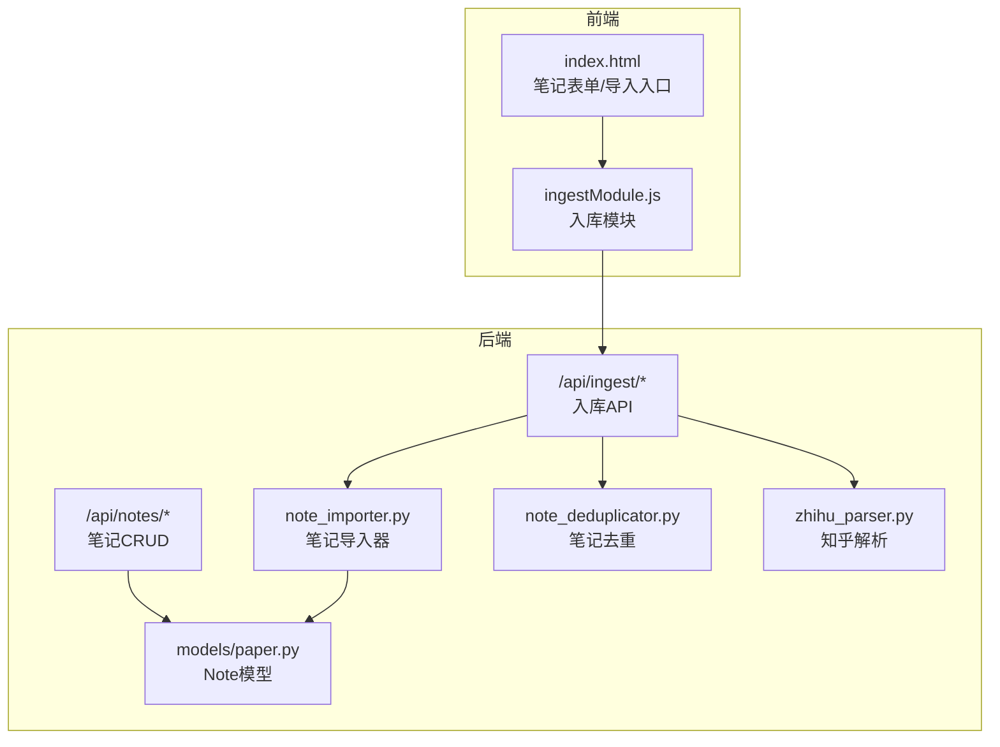
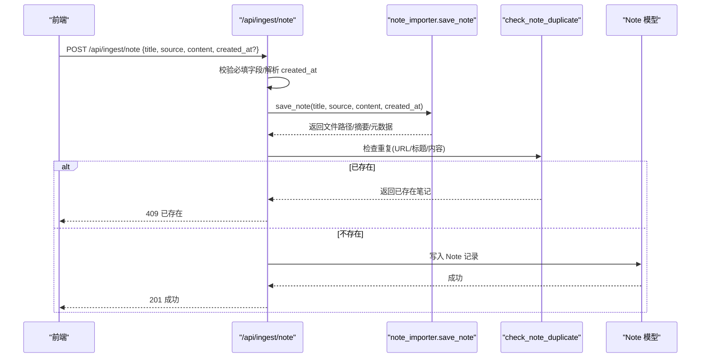
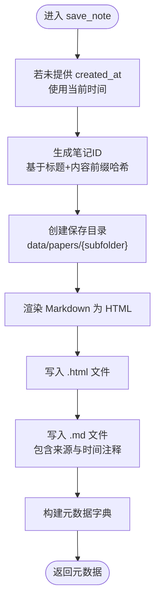
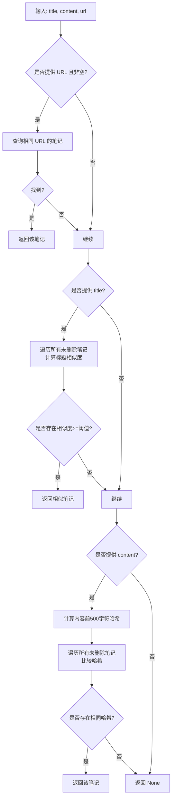
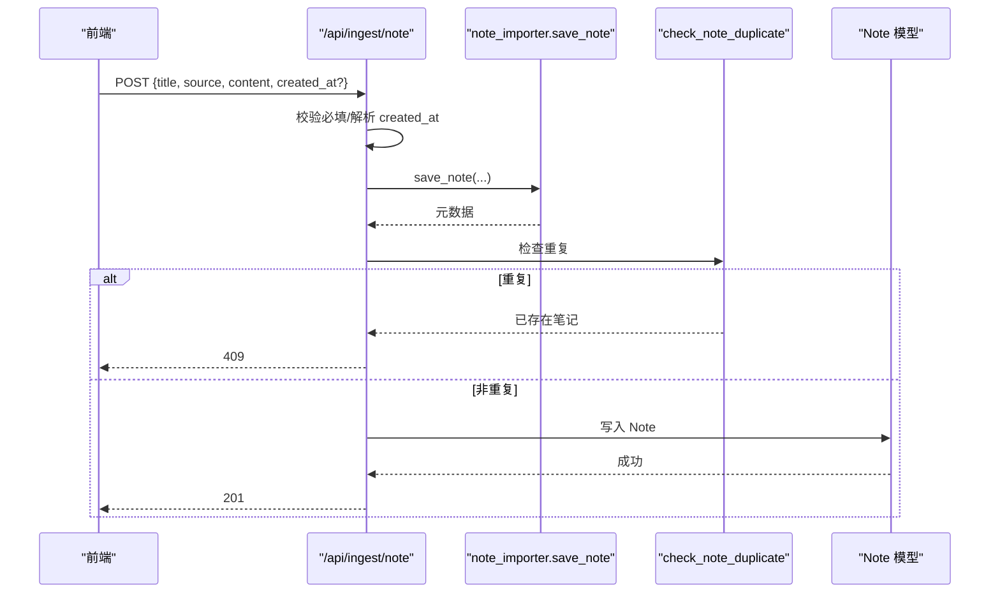
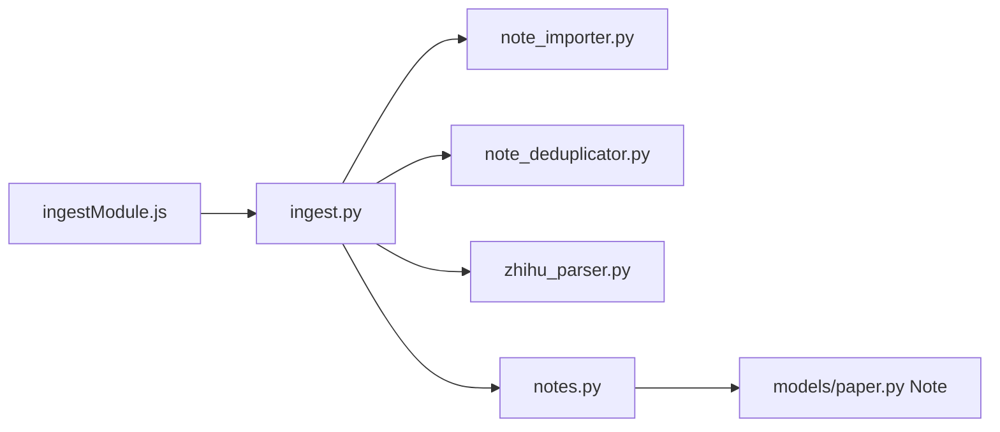

# 笔记导入

<cite>
**本文引用的文件**
- [note_importer.py](file://backend/services/note_importer.py)
- [notes.py](file://backend/api/notes.py)
- [note_deduplicator.py](file://backend/services/note_deduplicator.py)
- [ingest.py](file://backend/api/ingest.py)
- [ingest.yml](file://specs/backend/api/ingest.yml)
- [paper.py](file://backend/models/paper.py)
- [note.yml](file://specs/backend/models/note.yml)
- [zhihu_parser.py](file://backend/services/zhihu_parser.py)
- [migrate_notes.py](file://backend/services/migrate_notes.py)
- [ingestModule.js](file://frontend/src/modules/ingestModule.js)
- [笔记系统设计方案.md](file://docs/笔记系统设计方案.md)
</cite>

## 目录
1. [简介](#简介)
2. [项目结构](#项目结构)
3. [核心组件](#核心组件)
4. [架构总览](#架构总览)
5. [详细组件分析](#详细组件分析)
6. [依赖关系分析](#依赖关系分析)
7. [性能考量](#性能考量)
8. [故障排查指南](#故障排查指南)
9. [结论](#结论)
10. [附录](#附录)

## 简介
本文档围绕 PaperHub 的“笔记导入”能力进行系统化梳理，重点覆盖以下方面：
- 统一的笔记导入流程：请求参数校验、内容格式处理、时间戳解析、文件保存机制
- 笔记导入器的工作原理、内容标准化处理与元数据提取
- 不同来源（Claude 对话、ChatGPT、知乎等）的导入适配方案
- 去重检测算法、重复内容识别与冲突处理策略
- 导入后的笔记组织结构与标签系统集成

## 项目结构
PaperHub 采用三层内容库架构：论文库（Paper）、文章库（Article）、笔记库（Note）。笔记导入主要通过后端 API 将外部对话内容或手动输入的内容落库，并生成本地 Markdown 与 HTML 文件，同时进行去重判断与标签管理。

图表来源
- [ingest.py:261-348](file://backend/api/ingest.py#L261-L348)
- [notes.py:61-134](file://backend/api/notes.py#L61-L134)
- [note_importer.py:177-231](file://backend/services/note_importer.py#L177-L231)
- [note_deduplicator.py:88-129](file://backend/services/note_deduplicator.py#L88-L129)
- [paper.py:250-293](file://backend/models/paper.py#L250-L293)

章节来源
- [ingest.py:261-348](file://backend/api/ingest.py#L261-L348)
- [ingest.yml:83-115](file://specs/backend/api/ingest.yml#L83-L115)
- [paper.py:250-293](file://backend/models/paper.py#L250-L293)

## 核心组件
- 笔记导入器（note_importer）：负责将 Markdown 内容渲染为 HTML 并保存为 .md/.html 文件；生成笔记 ID、摘要与元数据。
- 笔记去重器（note_deduplicator）：基于 URL、标题相似度、内容哈希进行去重判断。
- 入库 API（ingest）：统一入口，处理对话笔记导入、知乎文章导入、PDF/HTML 批量入库等。
- 笔记 API（notes）：提供笔记 CRUD、标签管理、批量操作等。
- 知乎解析器（zhihu_parser）：知乎文章抓取与内容解析，配合导入流程。
- 数据模型（Note）：笔记实体，支持与论文、文章的多对多关联及标签系统。

章节来源
- [note_importer.py:177-231](file://backend/services/note_importer.py#L177-L231)
- [note_deduplicator.py:88-129](file://backend/services/note_deduplicator.py#L88-L129)
- [ingest.py:261-348](file://backend/api/ingest.py#L261-L348)
- [notes.py:61-134](file://backend/api/notes.py#L61-L134)
- [zhihu_parser.py:54-116](file://backend/services/zhihu_parser.py#L54-L116)
- [paper.py:250-293](file://backend/models/paper.py#L250-L293)

## 架构总览
统一入库 API 提供多种导入场景，其中“导入对话笔记”是本文关注的重点。整体流程如下：
- 前端提交请求（标题、来源、Markdown 内容、可选创建时间）
- 后端校验必填字段，解析 ISO 时间戳
- 调用笔记导入器保存文件并生成元数据
- 去重器检查是否重复（URL/标题相似度/内容哈希）
- 若未重复则写入数据库 Note 表并返回结果

图表来源
- [ingest.py:261-348](file://backend/api/ingest.py#L261-L348)
- [note_importer.py:183-231](file://backend/services/note_importer.py#L183-L231)
- [note_deduplicator.py:88-129](file://backend/services/note_deduplicator.py#L88-L129)

## 详细组件分析

### 组件A：笔记导入器（note_importer）
职责与流程
- 渲染 Markdown 为 HTML：使用扩展配置，生成带样式的完整 HTML 页面
- 生成笔记 ID：基于标题与内容前缀的哈希，保证唯一性
- 保存文件：同时生成 .md 源文件与 .html 渲染文件
- 生成元数据：摘要、发布时间、文件路径、来源 URL 等

关键点
- Markdown 渲染扩展：extra、codehilite、toc、tables、fenced_code、nl2br、sane_lists
- HTML 输出包含标题、来源、时间等元信息
- 文件保存目录：BASE_DIR/data/papers/{subfolder}/noteId.{html|md}
- 元数据输出字段：title、author、account_name、abstract、content、html_content、published_at、source_url、file_path、note_id

图表来源
- [note_importer.py:177-231](file://backend/services/note_importer.py#L177-L231)

章节来源
- [note_importer.py:17-174](file://backend/services/note_importer.py#L17-L174)
- [note_importer.py:177-231](file://backend/services/note_importer.py#L177-L231)

### 组件B：笔记去重器（note_deduplicator）
去重策略
- URL 完全匹配（最高优先级）
- 标题相似度（词级 Jaccard + 字符级 Jaccard + 编辑距离综合）
- 内容前 500 字符哈希一致

相似度计算
- 标题标准化：小写、去除特殊字符、合并多余空白
- 词级 Jaccard：基于分词集合
- 字符级 Jaccard：基于字符集合
- 编辑距离：Levenshtein 距离归一化
- 综合得分：词级权重更高，兼顾字符与编辑距离

图表来源
- [note_deduplicator.py:88-129](file://backend/services/note_deduplicator.py#L88-L129)

章节来源
- [note_deduplicator.py:8-17](file://backend/services/note_deduplicator.py#L8-L17)
- [note_deduplicator.py:18-76](file://backend/services/note_deduplicator.py#L18-L76)
- [note_deduplicator.py:88-129](file://backend/services/note_deduplicator.py#L88-L129)

### 组件C：统一入库 API（ingest）
- /api/ingest/note：导入对话笔记到笔记库
  - 参数校验：title/source/content 必填；created_at 可选（ISO）
  - 调用笔记导入器保存文件并生成元数据
  - 去重检查：URL/标题相似度/内容哈希
  - 写入 Note 表并返回结果
- /api/ingest/zhihu：导入知乎专栏文章
  - 支持 URL 自动抓取（需 Cookie）或手动粘贴内容
  - 自动解析作者、发布时间、内容并保存
  - 去重检查后入库 Article 表（此处为文章导入，非本文重点）

图表来源
- [ingest.py:261-348](file://backend/api/ingest.py#L261-L348)
- [note_importer.py:183-231](file://backend/services/note_importer.py#L183-L231)
- [note_deduplicator.py:88-129](file://backend/services/note_deduplicator.py#L88-L129)

章节来源
- [ingest.py:261-348](file://backend/api/ingest.py#L261-L348)
- [ingest.yml:83-115](file://specs/backend/api/ingest.yml#L83-L115)

### 组件D：不同来源的导入适配方案
- Claude/ChatGPT 等对话来源
  - 通过 /api/ingest/note 导入，source 字段标注来源（如 "Claude 对话"、"ChatGPT"）
  - content 为 Markdown 格式，导入器自动渲染 HTML 并保存
- 知乎专栏
  - /api/ingest/zhihu 支持两种模式：
    - URL + Cookie：自动抓取并解析
    - 手动粘贴：提供 title/author/content/created_at
  - 解析器会提取作者、发布时间、正文并保存
- PDF/HTML 批量入库
  - /api/ingest/pdf 支持 PDF/HTML 批量上传，自动去重与入库

章节来源
- [ingest.py:350-464](file://backend/api/ingest.py#L350-L464)
- [zhihu_parser.py:54-116](file://backend/services/zhihu_parser.py#L54-L116)

### 组件E：导入后的笔记组织结构与标签系统
- 笔记组织
  - 文件保存：BASE_DIR/data/papers/notes/{noteId}.html 与 .md
  - 数据库存储：Note 表，包含标题、内容、来源、URL、文件路径、发布时间等
- 标签系统
  - 笔记支持多对多标签（note_tags），可通过 /api/notes/:id/tags 管理
  - 笔记详情页支持“同步关联标签”：自动合并关联论文/文章的标签
- 关联关系
  - Note ↔ Paper：多对多（note_papers）
  - Note ↔ Article：多对多（note_articles）
  - 与论文/文章库一致的状态字段（pending/reading/done/mastered）与标星/置顶功能

章节来源
- [paper.py:33-87](file://backend/models/paper.py#L33-L87)
- [paper.py:250-293](file://backend/models/paper.py#L250-L293)
- [note.yml:92-107](file://specs/backend/models/note.yml#L92-L107)
- [笔记系统设计方案.md:56-106](file://docs/笔记系统设计方案.md#L56-L106)

## 依赖关系分析
- note_importer 依赖 Markdown 渲染与时间处理，输出文件与元数据
- ingest/note 依赖 note_importer 与 note_deduplicator，完成导入与去重
- notes API 依赖 Note 模型，提供 CRUD 与标签管理
- zhihu_parser 与 ingest/zhihu 协作，完成知乎文章导入
- 前端通过 ingestModule.js 调用入库 API，完成用户交互

图表来源
- [ingestModule.js:1-48](file://frontend/src/modules/ingestModule.js#L1-L48)
- [ingest.py:261-348](file://backend/api/ingest.py#L261-L348)
- [note_importer.py:177-231](file://backend/services/note_importer.py#L177-L231)
- [note_deduplicator.py:88-129](file://backend/services/note_deduplicator.py#L88-L129)
- [zhihu_parser.py:54-116](file://backend/services/zhihu_parser.py#L54-L116)
- [notes.py:61-134](file://backend/api/notes.py#L61-L134)
- [paper.py:250-293](file://backend/models/paper.py#L250-L293)

章节来源
- [ingestModule.js:1-48](file://frontend/src/modules/ingestModule.js#L1-L48)
- [ingest.py:261-348](file://backend/api/ingest.py#L261-L348)
- [paper.py:250-293](file://backend/models/paper.py#L250-L293)

## 性能考量
- 去重复杂度
  - 标题相似度与内容哈希：当前实现对所有未删除笔记进行扫描，复杂度较高
  - 建议：引入索引与缓存（如标题标准化索引、内容哈希索引）以降低查询成本
- 文件 I/O
  - 保存 .md/.html 两次写入，建议异步或批量化处理
- 前端交互
  - 前端模块化调用入库 API，避免阻塞主线程

[本节为通用指导，无需特定文件来源]

## 故障排查指南
- 导入失败（400 缺少必填字段）
  - 检查请求体是否包含 title/source/content
  - created_at 是否为合法 ISO 时间
- 导入失败（409 已存在）
  - 去重策略可能命中 URL/标题相似度/内容哈希
  - 建议先查询现有笔记，避免重复导入
- 文件未生成
  - 检查 BASE_DIR/data/papers/notes 目录权限
  - 确认 note_importer.save_note 调用链正常
- 标签未同步
  - 确认“同步关联标签”按钮是否正确触发
  - 检查关联论文/文章是否已添加标签

章节来源
- [ingest.py:274-282](file://backend/api/ingest.py#L274-L282)
- [note_deduplicator.py:88-129](file://backend/services/note_deduplicator.py#L88-L129)
- [note_importer.py:183-231](file://backend/services/note_importer.py#L183-L231)
- [笔记系统设计方案.md:79-95](file://docs/笔记系统设计方案.md#L79-L95)

## 结论
PaperHub 的笔记导入体系以统一的入库 API 为核心，结合笔记导入器与去重器，实现了从请求参数校验、内容格式处理、时间戳解析到文件保存与数据库写入的完整闭环。针对不同来源（对话、知乎等）提供了灵活的适配方案，并通过标签系统与多对多关联实现了笔记与其他内容的有机整合。未来可在去重性能与文件 I/O 上进一步优化，以提升大规模导入场景下的稳定性与吞吐量。

[本节为总结，无需特定文件来源]

## 附录
- 对话笔记迁移工具：将旧版 source='note' 的 Paper 迁移至新的 Note 系统，建立自关联并更新 source 标记
- 前端入口：index.html 中提供笔记表单与导入按钮，调用 ingestModule.js 完成入库

章节来源
- [migrate_notes.py:8-67](file://backend/services/migrate_notes.py#L8-L67)
- [笔记系统设计方案.md:1-326](file://docs/笔记系统设计方案.md#L1-L326)