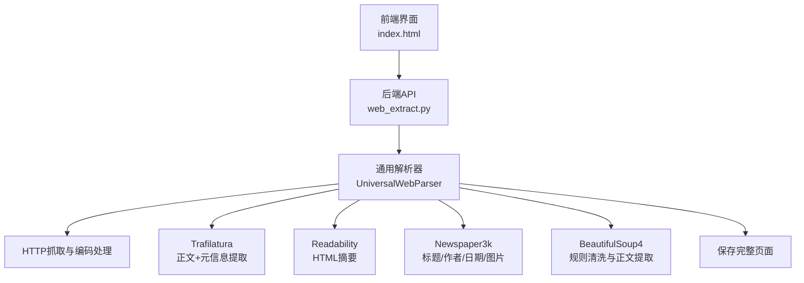
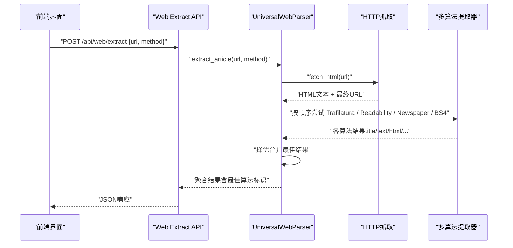
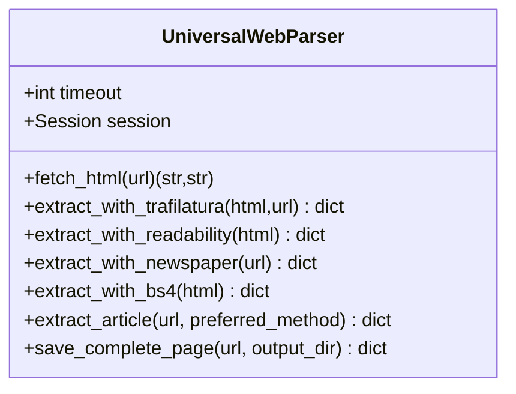
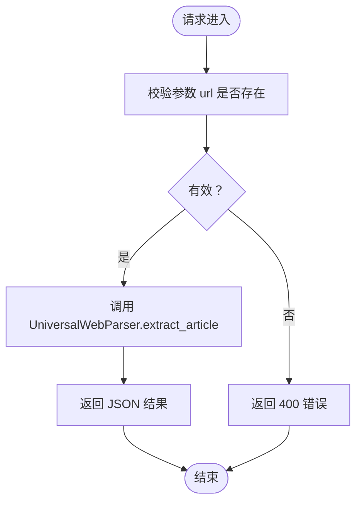
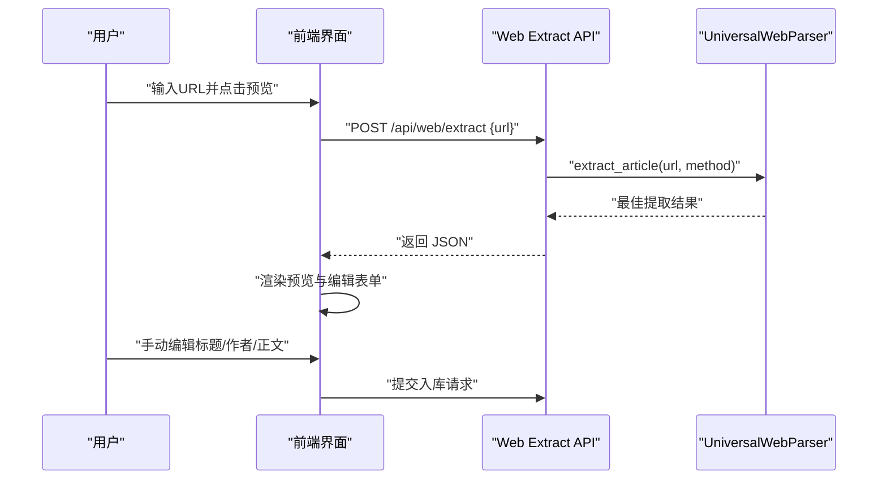
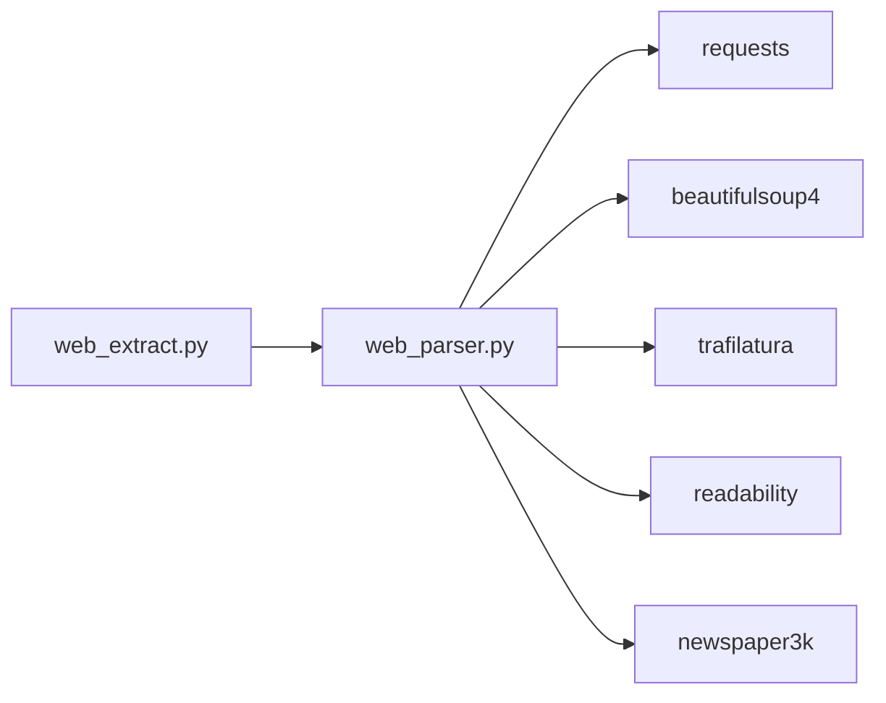

# 网页内容提取

<cite>
**本文档引用的文件**
- [backend/services/web_parser.py](file://backend/services/web_parser.py)
- [backend/api/web_extract.py](file://backend/api/web_extract.py)
- [backend/config.py](file://backend/config.py)
- [specs/backend/services/web_parser.yml](file://specs/backend/services/web_parser.yml)
- [frontend/index.html](file://frontend/index.html)
- [frontend/src/modules/ingestModule.js](file://frontend/src/modules/ingestModule.js)
</cite>

## 目录
1. [简介](#简介)
2. [项目结构](#项目结构)
3. [核心组件](#核心组件)
4. [架构总览](#架构总览)
5. [详细组件分析](#详细组件分析)
6. [依赖关系分析](#依赖关系分析)
7. [性能考量](#性能考量)
8. [故障排查指南](#故障排查指南)
9. [结论](#结论)
10. [附录](#附录)

## 简介
本文件系统性阐述 PaperHub 中“网页内容提取”能力的设计与实现，涵盖通用网页解析器的多算法自动选择与切换机制、正文识别、标题提取、作者信息获取、HTML 结构保留、反爬虫应对策略、请求头模拟、内容缓存机制、提取质量评估、内容清洗与格式标准化，以及预览模式与用户编辑功能支持。目标是帮助开发者与使用者全面理解该功能的工作原理与最佳实践。

## 项目结构
- 后端服务层：提供统一的网页解析器与 API 路由，负责抓取、解码、多算法提取与结果聚合。
- 前端展示层：提供网页 URL 输入、提取预览、手动编辑、确认入库的交互流程。
- 配置层：集中管理数据目录、缓存与持久化路径等基础设施。

图表来源
- [backend/api/web_extract.py:18-61](file://backend/api/web_extract.py#L18-L61)
- [backend/services/web_parser.py:14-271](file://backend/services/web_parser.py#L14-L271)

章节来源
- [backend/api/web_extract.py:1-61](file://backend/api/web_extract.py#L1-L61)
- [backend/services/web_parser.py:14-271](file://backend/services/web_parser.py#L14-L271)
- [backend/config.py:18-32](file://backend/config.py#L18-L32)

## 核心组件
- 通用网页解析器 UniversalWebParser
  - 负责网页抓取、智能编码解码、多算法正文提取、HTML 与纯文本输出、完整页面保存。
  - 支持自动/指定算法提取，并以正文长度与 HTML 长度作为质量评估指标进行择优。
- Web 提取 API
  - 提供 /api/web/extract 与 /api/web/save-page 两个端点，分别用于提取正文与保存完整页面。
- 前端集成
  - 提供网页 URL 输入、提取预览、标题/作者/正文的手动编辑、确认入库等交互。
- 配置与持久化
  - 统一的数据目录与保存路径，确保提取结果与完整页面的落盘。

章节来源
- [backend/services/web_parser.py:14-271](file://backend/services/web_parser.py#L14-L271)
- [backend/api/web_extract.py:18-61](file://backend/api/web_extract.py#L18-L61)
- [specs/backend/services/web_parser.yml:1-17](file://specs/backend/services/web_parser.yml#L1-L17)
- [frontend/index.html:2080-2279](file://frontend/index.html#L2080-L2279)

## 架构总览
下图展示了从前端发起请求到后端解析器执行多算法提取并返回结果的整体流程。

图表来源
- [backend/api/web_extract.py:18-33](file://backend/api/web_extract.py#L18-L33)
- [backend/services/web_parser.py:178-244](file://backend/services/web_parser.py#L178-L244)

## 详细组件分析

### 通用网页解析器设计与实现
- 设计原则
  - 多算法融合：内置 Trafilatura、Readability、Newspaper3k、BeautifulSoup4 四种提取策略，自动择优。
  - 编码鲁棒性：针对中文网页常见编码误判问题，提供多级解码兜底策略。
  - 结果标准化：统一输出标题、正文（纯文本与 HTML）、作者、日期、最佳算法标识等字段。
  - 容错与回退：任一算法失败不影响整体流程，最终返回可用结果或错误信息。
- 关键实现要点
  - 请求与编码处理：统一使用会话与固定 UA，优先 UTF-8 解码，随后 apparent_encoding 与多种中文编码尝试，最终拉丁字符兜底。
  - 算法选择与切换：支持 auto 或指定算法；按正文长度与 HTML 长度择优，记录最佳算法名与各方法使用轨迹。
  - HTML 与纯文本：Trafilatura 与 Readability 直接输出 HTML 摘要；BS4 清洗脚本/样式/导航等冗余标签后提取段落；Newspaper3k 输出标题/作者/日期/正文与图片信息。
  - 完整页面保存：将原始 HTML 写入数据目录，生成安全文件名并记录保存路径与大小。
- 性能与可靠性
  - 超时控制与异常捕获：统一超时设置与异常日志，避免阻塞。
  - 逐步回退：当正文过短时，采用更宽泛的正文提取策略（如直接从 body 获取文本）。

图表来源
- [backend/services/web_parser.py:14-271](file://backend/services/web_parser.py#L14-L271)

章节来源
- [backend/services/web_parser.py:14-271](file://backend/services/web_parser.py#L14-L271)

### API 层：提取与保存
- /api/web/extract
  - 功能：接收 URL 与可选提取方法，返回最佳提取结果。
  - 参数：url（必填）、method（可选，auto 或具体算法名）。
  - 返回：包含 resolved_url、raw_html_length、methods_used、title、author、date、text、html、text_length、html_length、best_method、success、error（可选）等字段。
- /api/web/save-page
  - 功能：保存完整网页 HTML 至数据目录。
  - 参数：url（必填）。
  - 返回：包含 saved_path、size_bytes、success、error（可选）等字段。
- /api/web/test
  - 功能：健康检查与端点说明。

图表来源
- [backend/api/web_extract.py:18-33](file://backend/api/web_extract.py#L18-L33)

章节来源
- [backend/api/web_extract.py:18-61](file://backend/api/web_extract.py#L18-L61)

### 前端集成与预览模式
- 预览流程
  - 用户输入任意公开网页 URL，点击“预览提取”，前端调用 /api/ingest/web/preview（与后端 API 路由一致）。
  - 后端返回提取结果，前端展示标题、作者、正文、正文长度、最佳算法等信息。
  - 用户可在前端对标题、作者、正文进行手动编辑，编辑后可确认入库。
- 编辑与入库
  - 编辑表单包含标题、作者、正文三要素，支持实时查看与修改。
  - 确认入库后，前端调用相应入库接口，后端完成去重、存储与索引更新。

图表来源
- [frontend/index.html:3220-3238](file://frontend/index.html#L3220-L3238)
- [backend/api/web_extract.py:18-33](file://backend/api/web_extract.py#L18-L33)
- [backend/services/web_parser.py:178-244](file://backend/services/web_parser.py#L178-L244)

章节来源
- [frontend/index.html:2080-2279](file://frontend/index.html#L2080-L2279)
- [frontend/index.html:3220-3238](file://frontend/index.html#L3220-L3238)
- [frontend/src/modules/ingestModule.js:1-48](file://frontend/src/modules/ingestModule.js#L1-L48)

### 编码处理与鲁棒性
- 多级解码策略
  - 优先 UTF-8 直接解码；
  - 若失败，使用 apparent_encoding；
  - 再依次尝试 gbk、gb18030、big5、gb2312、utf-8-sig；
  - 最终使用 latin-1 兜底，保证内容可读性。
- 日志与异常
  - 每一步解码均记录调试日志，异常时返回错误信息而非抛出中断。

章节来源
- [backend/services/web_parser.py:22-64](file://backend/services/web_parser.py#L22-L64)

### HTML 结构保留与内容清洗
- Trafilatura 与 Readability
  - 直接输出 HTML 摘要，保留结构化片段。
- BeautifulSoup4
  - 清洗脚本、样式、导航、页眉页脚、侧边栏、iframe 等冗余标签；
  - 从 body 中提取段落、标题、列表、引用、代码块等结构化元素；
  - 当正文过短时，回退到从 body 获取全文本，确保内容完整性。
- 新闻源（Newspaper3k）
  - 提取标题、作者列表、发布日期、正文、顶部图片与图片集合；
  - 若存在 meta 描述，补充摘要字段。

章节来源
- [backend/services/web_parser.py:65-131](file://backend/services/web_parser.py#L65-L131)
- [backend/services/web_parser.py:133-176](file://backend/services/web_parser.py#L133-L176)

### 提取质量评估与择优策略
- 评估指标
  - 以正文长度与 HTML 长度作为主要择优依据；
  - 记录最佳算法名称与各方法使用轨迹，便于诊断与回溯。
- 算法顺序
  - auto 模式默认顺序：Trafilatura → Readability → Newspaper → BS4；
  - 指定算法时优先尝试该算法，再按默认顺序回退。

章节来源
- [backend/services/web_parser.py:178-244](file://backend/services/web_parser.py#L178-L244)

### 反爬虫应对策略与请求头模拟
- 请求头模拟
  - 使用固定 UA，降低被识别为自动化脚本的概率；
  - 使用会话保持 Cookie 一致性，提升稳定性。
- 编码与解码
  - 针对中文网页常见编码误判问题，提供多级解码策略，减少因字符集问题导致的解析失败。
- 超时与容错
  - 统一超时控制与异常捕获，避免长时间阻塞与崩溃。

章节来源
- [backend/services/web_parser.py:14-21](file://backend/services/web_parser.py#L14-L21)
- [backend/services/web_parser.py:22-64](file://backend/services/web_parser.py#L22-L64)

### 内容缓存机制
- 前端缓存
  - 搜索模块采用 LRU 缓存策略，命中则直接返回，未命中则发起网络请求并写入缓存。
- 后端缓存
  - 未发现后端对网页内容的显式缓存实现；建议结合业务场景引入基于 URL 的短期缓存（如内存/Redis）以降低重复抓取成本。

章节来源
- [frontend/index.html:5431-5489](file://frontend/index.html#L5431-L5489)

### 完整页面保存与持久化
- 保存逻辑
  - 将原始 HTML 写入数据目录下的保存路径，生成安全文件名；
  - 返回保存路径与文件大小，便于后续审计与二次处理。
- 路径与目录
  - 通过配置模块统一管理数据目录，确保路径一致性与可维护性。

章节来源
- [backend/services/web_parser.py:246-271](file://backend/services/web_parser.py#L246-L271)
- [backend/config.py:18-32](file://backend/config.py#L18-L32)

## 依赖关系分析
- 组件耦合
  - API 层仅依赖解析器，职责清晰；
  - 解析器内部封装多算法与编码处理，对外暴露统一接口；
  - 前端通过标准 API 与后端交互，解耦于具体实现细节。
- 外部依赖
  - requests、BeautifulSoup4、trafilatura、readability、newspaper3k 等第三方库；
  - 建议在 requirements 中明确版本约束，确保稳定性。

图表来源
- [backend/api/web_extract.py:5-10](file://backend/api/web_extract.py#L5-L10)
- [backend/services/web_parser.py:6-9](file://backend/services/web_parser.py#L6-L9)

章节来源
- [backend/api/web_extract.py:5-10](file://backend/api/web_extract.py#L5-L10)
- [backend/services/web_parser.py:6-9](file://backend/services/web_parser.py#L6-L9)

## 性能考量
- 并发与超时
  - 单请求内串行执行多算法，建议在高并发场景下引入异步任务队列与限流策略。
- 算法选择
  - auto 模式默认顺序经过实践验证，若特定站点表现不佳，可调整顺序或指定算法。
- 编码处理
  - 多级解码策略增加少量 CPU 开销，但显著提升成功率，建议保留。
- 前端体验
  - 预览与编辑过程应避免长耗时操作，必要时提供加载状态与取消机制。

## 故障排查指南
- 常见问题
  - 网页无法访问：检查 URL 是否正确、网络连通性、目标站点是否封禁 UA。
  - 提取结果为空：确认目标页面是否为动态渲染，考虑引入浏览器渲染方案；检查正文长度阈值与清洗规则。
  - 编码乱码：确认是否命中多级解码策略，必要时手动指定算法或调整解码顺序。
- 定位手段
  - 查看后端日志中的解码策略与异常信息；
  - 使用 /api/web/test 确认 API 可用；
  - 在前端查看提取结果中的 best_method 与 text_length，辅助判断算法有效性。

章节来源
- [backend/services/web_parser.py:22-64](file://backend/services/web_parser.py#L22-L64)
- [backend/api/web_extract.py:52-61](file://backend/api/web_extract.py#L52-L61)

## 结论
PaperHub 的网页内容提取能力通过“多算法融合 + 智能择优 + 编码鲁棒性 + 前后端协同”的设计，在保证提取质量的同时兼顾了易用性与可维护性。建议在生产环境中进一步完善缓存与异步处理、增强对动态渲染页面的支持，并持续优化算法顺序与阈值以适配更多站点。

## 附录
- 规范与约束
  - 服务规范：支持多种正文提取算法、保留 HTML 结构、清理广告与导航冗余元素、错误不中断、正文提取失败时返回页面原始内容兜底。
- 前端交互要点
  - 预览与编辑：支持手动修改标题、作者与正文，确认后入库；
  - 加载与提示：提供加载状态与错误提示，改善用户体验。

章节来源
- [specs/backend/services/web_parser.yml:1-17](file://specs/backend/services/web_parser.yml#L1-L17)
- [frontend/index.html:2080-2279](file://frontend/index.html#L2080-L2279)