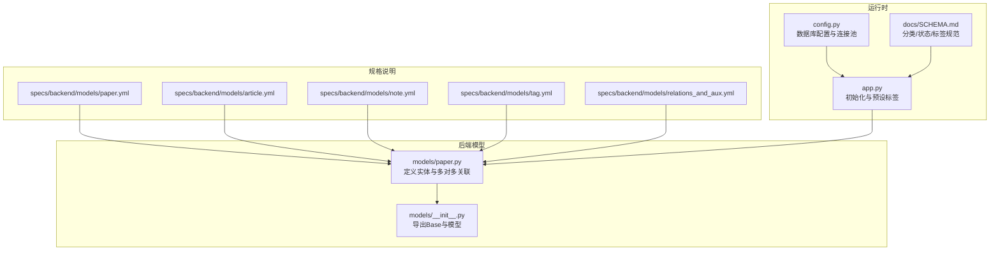
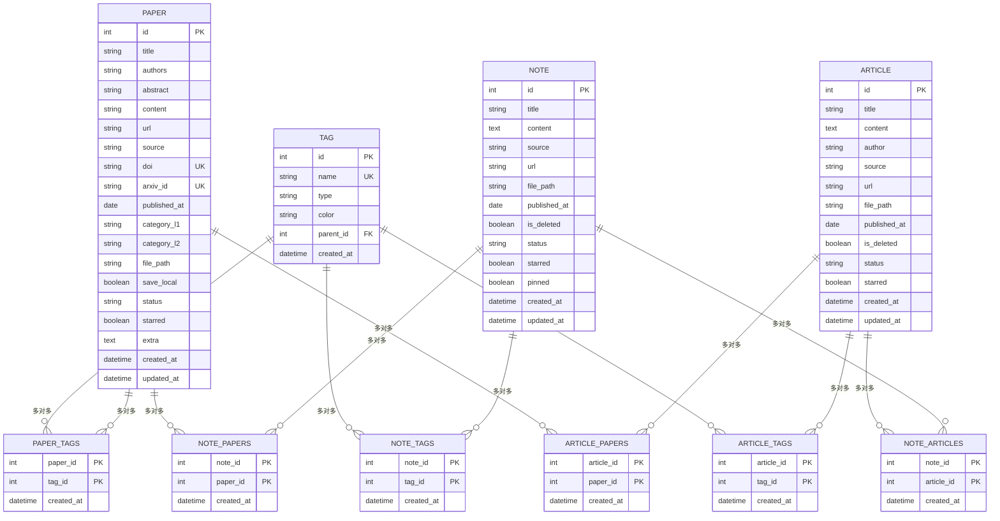
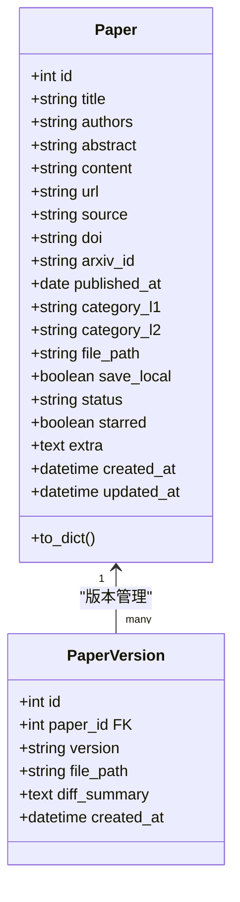
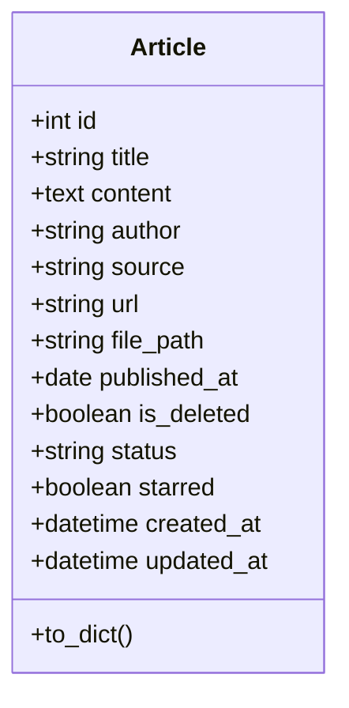
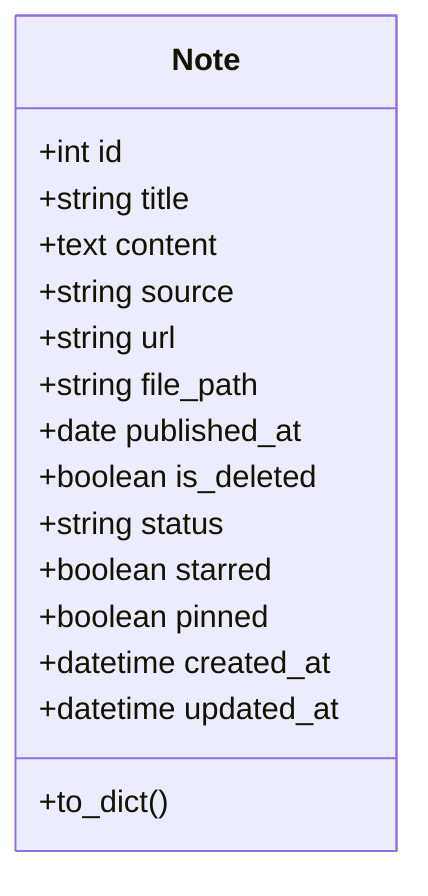
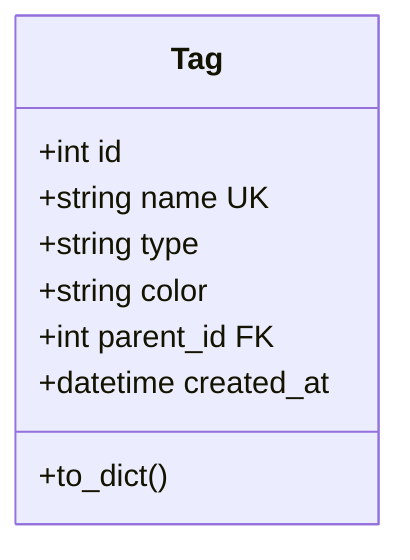
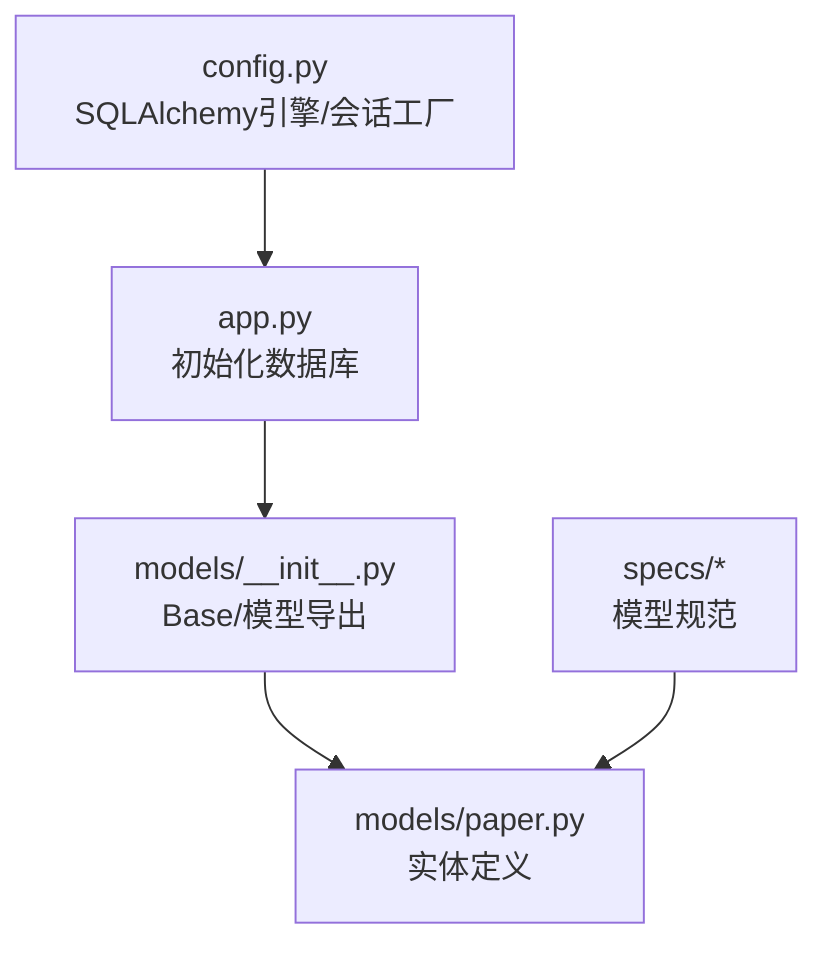
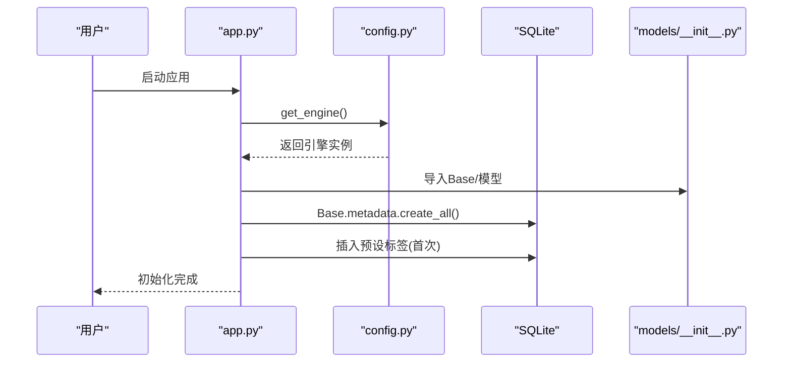

# Schema总览

<cite>
**本文档引用的文件**
- [backend/models/paper.py](file://backend/models/paper.py)
- [specs/backend/models/paper.yml](file://specs/backend/models/paper.yml)
- [specs/backend/models/article.yml](file://specs/backend/models/article.yml)
- [specs/backend/models/note.yml](file://specs/backend/models/note.yml)
- [specs/backend/models/tag.yml](file://specs/backend/models/tag.yml)
- [specs/backend/models/relations_and_aux.yml](file://specs/backend/models/relations_and_aux.yml)
- [docs/SCHEMA.md](file://docs/SCHEMA.md)
- [backend/config.py](file://backend/config.py)
- [backend/app.py](file://backend/app.py)
- [backend/models/__init__.py](file://backend/models/__init__.py)
- [scripts/maintenance/006_add_fts_tables.py](file://scripts/maintenance/006_add_fts_tables.py)
</cite>

## 目录
1. [简介](#简介)
2. [项目结构](#项目结构)
3. [核心组件](#核心组件)
4. [架构总览](#架构总览)
5. [详细组件分析](#详细组件分析)
6. [依赖分析](#依赖分析)
7. [性能考虑](#性能考虑)
8. [故障排除指南](#故障排除指南)
9. [结论](#结论)
10. [附录](#附录)

## 简介
本文件为 PaperHub 数据库 Schema 总览，系统性阐述数据库整体架构设计、核心实体关系图、数据模型概览与设计原则；解释 Paper、Article、Note、Tag 等主要实体的设计理念与相互关系；文档化预设分类体系、阅读状态定义与标签类型规范；提供数据库初始化流程与基础配置说明，并总结 Schema 设计的技术决策与架构考量。

## 项目结构
PaperHub 的数据库层采用 SQLAlchemy ORM 映射，核心模型集中在 backend/models/paper.py 中，配合 specs 目录下的 YAML 规范文件进行数据模型描述。数据库初始化由 backend/app.py 调用，配置位于 backend/config.py，SQLite 作为默认持久化存储。



**图表来源**
- [backend/models/paper.py:1-360](file://backend/models/paper.py#L1-L360)
- [specs/backend/models/paper.yml:1-164](file://specs/backend/models/paper.yml#L1-L164)
- [specs/backend/models/article.yml:1-114](file://specs/backend/models/article.yml#L1-L114)
- [specs/backend/models/note.yml:1-115](file://specs/backend/models/note.yml#L1-L115)
- [specs/backend/models/tag.yml:1-68](file://specs/backend/models/tag.yml#L1-L68)
- [specs/backend/models/relations_and_aux.yml:1-263](file://specs/backend/models/relations_and_aux.yml#L1-L263)
- [backend/config.py:1-134](file://backend/config.py#L1-L134)
- [backend/app.py:160-234](file://backend/app.py#L160-L234)
- [docs/SCHEMA.md:1-182](file://docs/SCHEMA.md#L1-L182)

**章节来源**
- [backend/models/paper.py:1-360](file://backend/models/paper.py#L1-L360)
- [specs/backend/models/paper.yml:1-164](file://specs/backend/models/paper.yml#L1-L164)
- [specs/backend/models/article.yml:1-114](file://specs/backend/models/article.yml#L1-L114)
- [specs/backend/models/note.yml:1-115](file://specs/backend/models/note.yml#L1-L115)
- [specs/backend/models/tag.yml:1-68](file://specs/backend/models/tag.yml#L1-L68)
- [specs/backend/models/relations_and_aux.yml:1-263](file://specs/backend/models/relations_and_aux.yml#L1-L263)
- [backend/config.py:1-134](file://backend/config.py#L1-L134)
- [backend/app.py:160-234](file://backend/app.py#L160-L234)
- [docs/SCHEMA.md:1-182](file://docs/SCHEMA.md#L1-L182)

## 核心组件
- 实体与关系
  - Paper（论文）、Article（网络文章）、Note（笔记）、Tag（标签）为核心实体
  - 多对多关联通过中间表实现：paper_tags、note_tags、article_tags、note_papers、note_articles、article_papers
  - PaperVersion、WechatSubscription、WechatConfig 为辅助实体
- 字段与约束
  - 主键统一使用自增整数 id
  - 多处字段具备唯一性约束（如 tags.name、papers.doi、papers.arxiv_id）
  - 时间戳字段统一包含 created_at、updated_at（部分实体含软删除 is_deleted）
- 索引策略
  - 针对高频查询字段建立索引（papers 的标题、分类、状态、标星、发表时间、arXiv ID；articles/tags 的常用过滤字段）

**章节来源**
- [backend/models/paper.py:18-87](file://backend/models/paper.py#L18-L87)
- [specs/backend/models/paper.yml:130-164](file://specs/backend/models/paper.yml#L130-L164)
- [specs/backend/models/article.yml:91-114](file://specs/backend/models/article.yml#L91-L114)
- [specs/backend/models/note.yml:92-115](file://specs/backend/models/note.yml#L92-L115)
- [specs/backend/models/tag.yml:44-68](file://specs/backend/models/tag.yml#L44-L68)
- [specs/backend/models/relations_and_aux.yml:4-158](file://specs/backend/models/relations_and_aux.yml#L4-L158)

## 架构总览
PaperHub 的数据库采用“实体-关联-辅助”三层结构：
- 实体层：Paper、Article、Note、Tag
- 关联层：多对多中间表，承载实体间灵活关系
- 辅助层：PaperVersion、WechatSubscription、WechatConfig，支撑版本管理与微信生态集成



**图表来源**
- [backend/models/paper.py:93-360](file://backend/models/paper.py#L93-L360)
- [specs/backend/models/paper.yml:1-164](file://specs/backend/models/paper.yml#L1-L164)
- [specs/backend/models/article.yml:1-114](file://specs/backend/models/article.yml#L1-L114)
- [specs/backend/models/note.yml:1-115](file://specs/backend/models/note.yml#L1-L115)
- [specs/backend/models/tag.yml:1-68](file://specs/backend/models/tag.yml#L1-L68)
- [specs/backend/models/relations_and_aux.yml:4-158](file://specs/backend/models/relations_and_aux.yml#L4-L158)

## 详细组件分析

### Paper（论文）实体
- 设计理念
  - 统一承载论文元数据与来源信息（arXiv、PDF 等），支持分类体系与阅读状态
  - 提供 content 字段用于全文内容存储，file_path 存储本地 PDF 路径
  - 通过多对多关联与 Article、Note、Tag 解耦
- 关键字段与索引
  - 唯一约束：doi、arxiv_id
  - 索引：title、category_l1/category_l2、status、starred、published_at、arxiv_id
- 版本管理
  - 通过 PaperVersion 与 Paper 建立一对多关系，记录不同版本文件与差异摘要



**图表来源**
- [backend/models/paper.py:120-186](file://backend/models/paper.py#L120-L186)
- [specs/backend/models/paper.yml:1-164](file://specs/backend/models/paper.yml#L1-L164)
- [specs/backend/models/relations_and_aux.yml:160-197](file://specs/backend/models/relations_and_aux.yml#L160-L197)

**章节来源**
- [specs/backend/models/paper.yml:1-164](file://specs/backend/models/paper.yml#L1-L164)
- [backend/models/paper.py:120-186](file://backend/models/paper.py#L120-L186)
- [specs/backend/models/relations_and_aux.yml:160-197](file://specs/backend/models/relations_and_aux.yml#L160-L197)

### Article（网络文章）实体
- 设计理念
  - 支持微信公众号、知乎、博客等来源，提供软删除与标星功能
  - 与 Paper、Note 通过多对多关联，形成知识扩展与交叉引用
- 关键字段与索引
  - 索引：title、source、is_deleted



**图表来源**
- [backend/models/paper.py:191-244](file://backend/models/paper.py#L191-L244)
- [specs/backend/models/article.yml:1-114](file://specs/backend/models/article.yml#L1-L114)

**章节来源**
- [specs/backend/models/article.yml:1-114](file://specs/backend/models/article.yml#L1-L114)
- [backend/models/paper.py:191-244](file://backend/models/paper.py#L191-L244)

### Note（笔记）实体
- 设计理念
  - 支持手动输入与 AI 来源（ChatGPT、Claude），提供置顶与软删除
  - 可同时关联多个 Paper 与 Article，便于知识沉淀与交叉引用
- 关键字段与索引
  - 索引：title、is_deleted、pinned



**图表来源**
- [backend/models/paper.py:250-293](file://backend/models/paper.py#L250-L293)
- [specs/backend/models/note.yml:1-115](file://specs/backend/models/note.yml#L1-L115)

**章节来源**
- [specs/backend/models/note.yml:1-115](file://specs/backend/models/note.yml#L1-L115)
- [backend/models/paper.py:250-293](file://backend/models/paper.py#L250-L293)

### Tag（标签）实体
- 设计理念
  - 支持层级结构（parent_id 自引用），提供 tech、conference、custom 三类标签
  - 通过多对多关联与 Paper、Article、Note 解耦，实现灵活的知识组织
- 关键字段与索引
  - 唯一约束：name
  - 索引：type、parent_id



**图表来源**
- [backend/models/paper.py:93-114](file://backend/models/paper.py#L93-L114)
- [specs/backend/models/tag.yml:1-68](file://specs/backend/models/tag.yml#L1-L68)

**章节来源**
- [specs/backend/models/tag.yml:1-68](file://specs/backend/models/tag.yml#L1-L68)
- [backend/models/paper.py:93-114](file://backend/models/paper.py#L93-L114)

### 多对多关联与辅助实体
- 关联表
  - paper_tags、note_tags、article_tags：实体与标签的多对多
  - note_papers、note_articles、article_papers：实体间的多对多
- 辅助实体
  - PaperVersion：论文版本管理
  - WechatSubscription、WechatConfig：微信生态集成

```mermaid
graph LR
P["Paper"] -- "paper_tags" --> T["Tag"]
N["Note"] -- "note_tags" --> T
A["Article"] -- "article_tags" --> T
N -- "note_papers" --> P
N -- "note_articles" --> A
A -- "article_papers" --> P
P -. "paper_versions" .-> PV["PaperVersion"]
W1["WechatSubscription"] .. data .. W2["WechatConfig"]
```

**图表来源**
- [specs/backend/models/relations_and_aux.yml:4-158](file://specs/backend/models/relations_and_aux.yml#L4-L158)
- [specs/backend/models/paper.yml:146-150](file://specs/backend/models/paper.yml#L146-L150)
- [specs/backend/models/relations_and_aux.yml:160-263](file://specs/backend/models/relations_and_aux.yml#L160-L263)

**章节来源**
- [specs/backend/models/relations_and_aux.yml:1-263](file://specs/backend/models/relations_and_aux.yml#L1-L263)
- [backend/models/paper.py:18-87](file://backend/models/paper.py#L18-L87)

## 依赖分析
- 模块耦合
  - models/__init__.py 将 Base 与各模型统一导出，供 app.py 与 config.py 使用
  - app.py 通过 init_database 调用 Base.metadata.create_all 创建表结构
- 外部依赖
  - SQLAlchemy ORM 与 SQLite 引擎
  - 运行时依赖 chroma 向量存储（非本文重点）



**图表来源**
- [backend/config.py:85-134](file://backend/config.py#L85-L134)
- [backend/app.py:160-218](file://backend/app.py#L160-L218)
- [backend/models/__init__.py:1-25](file://backend/models/__init__.py#L1-L25)
- [backend/models/paper.py:1-360](file://backend/models/paper.py#L1-L360)

**章节来源**
- [backend/config.py:85-134](file://backend/config.py#L85-L134)
- [backend/app.py:160-218](file://backend/app.py#L160-L218)
- [backend/models/__init__.py:1-25](file://backend/models/__init__.py#L1-L25)

## 性能考虑
- 索引策略
  - 针对高频查询字段建立索引，提升筛选与排序效率
- 连接池与回收
  - 配置连接池大小、最大溢出连接数与回收时间，降低 SQLite 锁竞争
- 全文检索
  - 通过 SQLite FTS5 虚拟表对论文标题、摘要、内容、作者进行全文检索优化

**章节来源**
- [specs/backend/models/paper.yml:151-164](file://specs/backend/models/paper.yml#L151-L164)
- [specs/backend/models/article.yml:107-114](file://specs/backend/models/article.yml#L107-L114)
- [specs/backend/models/tag.yml:60-68](file://specs/backend/models/tag.yml#L60-L68)
- [backend/config.py:92-99](file://backend/config.py#L92-L99)
- [docs/SCHEMA.md:139-152](file://docs/SCHEMA.md#L139-L152)

## 故障排除指南
- 初始化失败
  - 确认 data/db 目录可写，数据库文件路径正确
  - 检查 SQLite 引擎连接参数与权限
- 数据重复
  - 利用唯一约束（tags.name、papers.doi、papers.arxiv_id）避免重复
- 迁移提示
  - 若发现待迁移笔记，按提示执行 migrate_notes.py 完成 Paper 到 Note 的迁移

**章节来源**
- [backend/app.py:175-184](file://backend/app.py#L175-L184)
- [backend/services/migrate_notes.py:8-68](file://backend/services/migrate_notes.py#L8-L68)

## 结论
PaperHub 的数据库 Schema 以清晰的实体-关联-辅助三层结构为基础，结合多对多关系与唯一约束，实现了论文、文章、笔记与标签的灵活组织；通过索引与连接池优化保障性能；借助 FTS5 支持全文检索。初始化流程自动化完成建表与预设标签注入，满足从零到一的快速部署需求。

## 附录

### 预设分类体系
- 一级分类：大模型、计算机视觉、Agent、多模态、工程落地
- 二级分类：覆盖预训练、对齐、推理优化、模型压缩等细分方向

**章节来源**
- [docs/SCHEMA.md:5-23](file://docs/SCHEMA.md#L5-L23)

### 阅读状态定义
- pending：待读
- reading：在读
- done：已读
- mastered：精读

**章节来源**
- [docs/SCHEMA.md:26-31](file://docs/SCHEMA.md#L26-L31)
- [specs/backend/models/paper.yml:97-104](file://specs/backend/models/paper.yml#L97-L104)
- [specs/backend/models/article.yml:64-71](file://specs/backend/models/article.yml#L64-L71)
- [specs/backend/models/note.yml:58-65](file://specs/backend/models/note.yml#L58-L65)

### 标签类型规范
- tech：技术标签（如 Transformer、YOLO、RAG）
- conference：会议标签（如 CVPR2024、NeurIPS）
- custom：自定义标签（如 必读、待复现）

**章节来源**
- [docs/SCHEMA.md:34-37](file://docs/SCHEMA.md#L34-L37)
- [specs/backend/models/tag.yml:17-24](file://specs/backend/models/tag.yml#L17-L24)

### 数据库初始化流程与基础配置
- 初始化步骤
  - 创建数据目录与子目录
  - 初始化 SQLAlchemy 引擎与会话工厂
  - 创建所有表结构
  - 注入预设标签（若首次初始化）
- 基础配置
  - SQLite 数据库 URI 指向 data/db/paperhub.db
  - 连接池参数与 Chroma 向量存储路径



**图表来源**
- [backend/app.py:160-218](file://backend/app.py#L160-L218)
- [backend/config.py:85-134](file://backend/config.py#L85-L134)
- [backend/models/__init__.py:1-25](file://backend/models/__init__.py#L1-L25)

**章节来源**
- [backend/app.py:160-218](file://backend/app.py#L160-L218)
- [backend/config.py:35-74](file://backend/config.py#L35-L74)

### 全文检索与维护脚本
- FTS5 虚拟表创建语句用于论文标题、摘要、内容、作者的全文检索
- 维护脚本示例：scripts/maintenance/006_add_fts_tables.py

**章节来源**
- [docs/SCHEMA.md:139-152](file://docs/SCHEMA.md#L139-L152)
- [scripts/maintenance/006_add_fts_tables.py](file://scripts/maintenance/006_add_fts_tables.py)