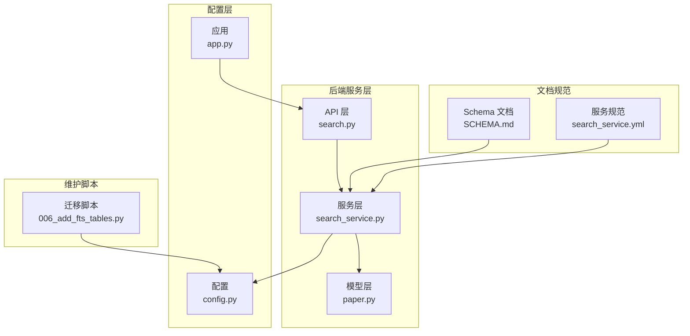
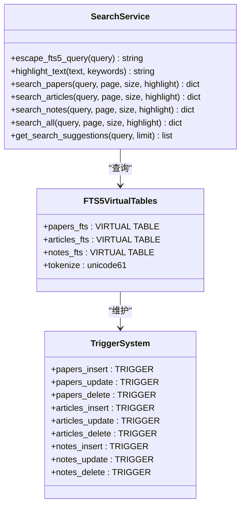
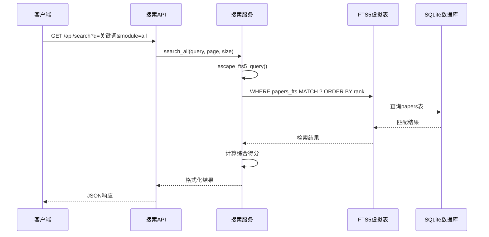
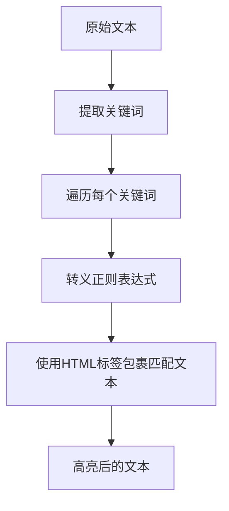
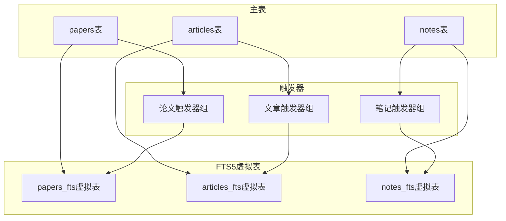
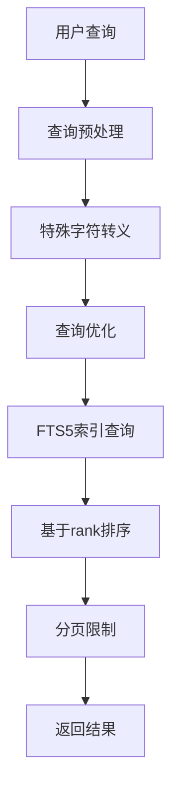

# 全文检索设计

<cite>
**本文档引用的文件**
- [search_service.py](file://backend/services/search_service.py)
- [search.py](file://backend/api/search.py)
- [006_add_fts_tables.py](file://scripts/maintenance/006_add_fts_tables.py)
- [paper.py](file://backend/models/paper.py)
- [config.py](file://backend/config.py)
- [app.py](file://backend/app.py)
- [SCHEMA.md](file://docs/SCHEMA.md)
- [search_service.yml](file://specs/backend/services/search_service.yml)
</cite>

## 目录
1. [简介](#简介)
2. [项目结构](#项目结构)
3. [核心组件](#核心组件)
4. [架构概览](#架构概览)
5. [详细组件分析](#详细组件分析)
6. [依赖关系分析](#依赖关系分析)
7. [性能考虑](#性能考虑)
8. [故障排除指南](#故障排除指南)
9. [结论](#结论)
10. [附录](#附录)

## 简介

PaperHub项目集成了SQLite FTS5全文检索引擎，为论文、文章和笔记提供高效的全文搜索能力。该系统通过虚拟表和触发器机制实现了自动化的索引维护，支持跨模块搜索、关键词高亮和智能排序等功能。

## 项目结构

全文检索系统主要分布在以下目录和文件中：



**图表来源**
- [search.py:1-70](file://backend/api/search.py#L1-L70)
- [search_service.py:1-314](file://backend/services/search_service.py#L1-L314)
- [006_add_fts_tables.py:1-179](file://scripts/maintenance/006_add_fts_tables.py#L1-L179)

**章节来源**
- [search.py:1-70](file://backend/api/search.py#L1-L70)
- [search_service.py:1-314](file://backend/services/search_service.py#L1-L314)
- [006_add_fts_tables.py:1-179](file://scripts/maintenance/006_add_fts_tables.py#L1-L179)

## 核心组件

### FTS5虚拟表设计

系统为三种实体类型创建了独立的FTS5虚拟表：

| 虚拟表名 | 主表 | 检索字段 | 触发器类型 |
|---------|------|----------|-----------|
| `papers_fts` | `papers` | title, abstract, authors, category | insert/update/delete |
| `articles_fts` | `articles` | title, content, author, source | insert/update/delete |
| `notes_fts` | `notes` | title, content, source | insert/update/delete |

### 查询服务架构



**图表来源**
- [search_service.py:39-205](file://backend/services/search_service.py#L39-L205)
- [006_add_fts_tables.py:18-138](file://scripts/maintenance/006_add_fts_tables.py#L18-L138)

**章节来源**
- [search_service.py:39-205](file://backend/services/search_service.py#L39-L205)
- [006_add_fts_tables.py:18-138](file://scripts/maintenance/006_add_fts_tables.py#L18-L138)

## 架构概览

全文检索系统采用分层架构设计，实现了查询、索引和维护的分离：



**图表来源**
- [search.py:14-51](file://backend/api/search.py#L14-L51)
- [search_service.py:207-257](file://backend/services/search_service.py#L207-L257)

## 详细组件分析

### 查询转义和预处理

系统实现了专门的查询转义函数来处理FTS5的特殊字符：

```mermaid
flowchart TD
Start([查询输入]) --> CheckEmpty{"是否为空"}
CheckEmpty --> |是| ReturnEmpty["返回原查询"]
CheckEmpty --> |否| EscapeSpecial["转义特殊字符<br/>:,\\\"'(){}[]^*+?!@#$%&|~"]
EscapeSpecial --> ReplaceSpace["替换为单个空格"]
ReplaceSpace --> CleanExtra["清理多余空格"]
CleanExtra --> ReturnQuery["返回转义后的查询"]
```

**图表来源**
- [search_service.py:8-26](file://backend/services/search_service.py#L8-L26)

### 搜索结果排序机制

系统采用基于FTS5 rank字段的排序策略：

| 排序方式 | 描述 | 适用场景 |
|---------|------|---------|
| FTS5 rank | 默认排序，基于匹配度 | 标准搜索结果 |
| 综合评分 | 模块权重×(1/(rank+1)) | 跨模块搜索 |
| 时间排序 | 按发布时间降序 | 新内容优先 |

**章节来源**
- [search_service.py:46-57](file://backend/services/search_service.py#L46-L57)
- [search_service.py:220-242](file://backend/services/search_service.py#L220-L242)

### 关键词高亮功能

系统提供了智能的关键词高亮机制：



**图表来源**
- [search_service.py:28-37](file://backend/services/search_service.py#L28-L37)

**章节来源**
- [search_service.py:28-37](file://backend/services/search_service.py#L28-L37)

### 跨模块搜索策略

系统实现了模块权重的综合搜索：

| 模块类型 | 权重系数 | 排序优先级 |
|---------|---------|-----------|
| paper | 3.0 | 最高优先级 |
| article | 2.0 | 中等优先级 |
| note | 1.0 | 最低优先级 |

**章节来源**
- [search_service.py:213-218](file://backend/services/search_service.py#L213-L218)
- [search_service.py:220-242](file://backend/services/search_service.py#L220-L242)

## 依赖关系分析

### 数据库依赖关系



**图表来源**
- [006_add_fts_tables.py:55-78](file://scripts/maintenance/006_add_fts_tables.py#L55-L78)
- [006_add_fts_tables.py:85-108](file://scripts/maintenance/006_add_fts_tables.py#L85-L108)
- [006_add_fts_tables.py:115-138](file://scripts/maintenance/006_add_fts_tables.py#L115-L138)

### API接口设计

系统提供了RESTful API接口：

| 接口路径 | 方法 | 参数 | 功能描述 |
|---------|------|------|---------|
| `/api/search` | GET | q, module, page, size, highlight | 全文搜索 |
| `/api/search/suggest` | GET | q, limit | 搜索建议 |

**章节来源**
- [search.py:14-51](file://backend/api/search.py#L14-L51)
- [search.py:53-70](file://backend/api/search.py#L53-L70)

## 性能考虑

### 索引策略

1. **FTS5 Tokenizer配置**：使用`unicode61`分词器支持Unicode字符
2. **触发器维护**：自动同步主表变更到FTS5索引
3. **分页查询**：支持LIMIT/OFFSET分页，避免大数据量传输

### 查询优化



**图表来源**
- [search_service.py:8-26](file://backend/services/search_service.py#L8-L26)
- [search_service.py:46-57](file://backend/services/search_service.py#L46-L57)

### 连接池配置

系统使用SQLAlchemy连接池优化数据库访问：

| 配置参数 | 值 | 说明 |
|---------|----|-----|
| pool_size | 5 | 连接池大小 |
| max_overflow | 10 | 最大溢出连接数 |
| pool_timeout | 30 | 获取连接超时时间 |
| pool_recycle | 3600 | 连接回收时间 |

**章节来源**
- [config.py:92-99](file://backend/config.py#L92-L99)

## 故障排除指南

### 常见问题及解决方案

1. **FTS5表不存在**
   - 检查迁移脚本是否执行
   - 确认数据库文件权限

2. **搜索结果为空**
   - 验证查询字符串是否被正确转义
   - 检查FTS5索引数据是否同步

3. **性能问题**
   - 检查连接池配置
   - 优化查询参数（适当调整page和size）

### 调试技巧

- 启用SQLAlchemy echo模式查看SQL执行
- 使用LIMIT参数测试查询性能
- 检查触发器是否正常工作

**章节来源**
- [config.py:98](file://backend/config.py#L98)
- [006_add_fts_tables.py:140](file://scripts/maintenance/006_add_fts_tables.py#L140)

## 结论

PaperHub的全文检索系统通过SQLite FTS5实现了高效、可扩展的搜索功能。系统的关键优势包括：

1. **自动化索引维护**：通过触发器确保FTS5索引与主表数据同步
2. **灵活的查询接口**：支持单模块和跨模块搜索
3. **智能排序机制**：结合匹配度和业务权重进行综合排序
4. **高性能设计**：合理的连接池配置和查询优化

该系统为PaperHub提供了强大的信息检索能力，支持用户快速定位所需的论文、文章和笔记内容。

## 附录

### 使用示例

#### 基础搜索
```
GET /api/search?q=机器学习&page=1&size=20
```

#### 指定模块搜索
```
GET /api/search?q=深度学习&module=papers&page=1&size=10
```

#### 获取搜索建议
```
GET /api/search/suggest?q=计算机视觉&limit=5
```

### 最佳实践

1. **查询优化**：合理设置page和size参数
2. **索引维护**：定期检查触发器状态
3. **性能监控**：关注查询响应时间和数据库负载
4. **错误处理**：妥善处理空查询和异常情况

**章节来源**
- [search.py:18-37](file://backend/api/search.py#L18-L37)
- [search_service.py:259-313](file://backend/services/search_service.py#L259-L313)