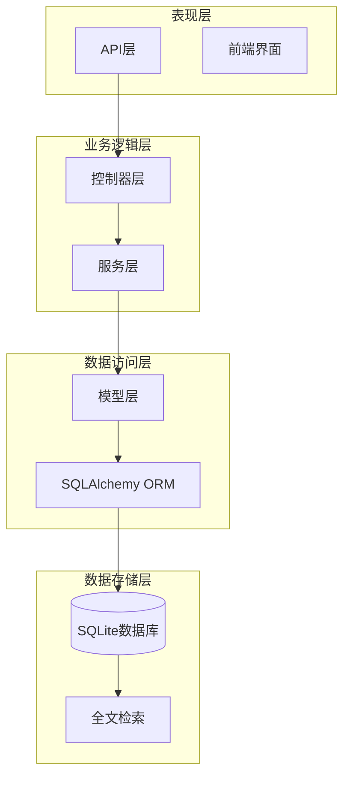
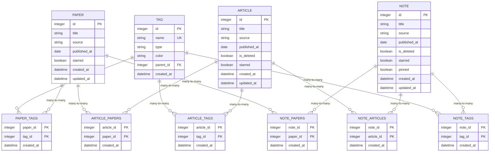
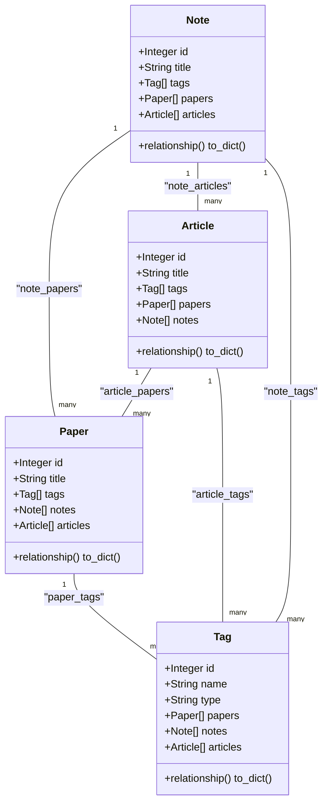
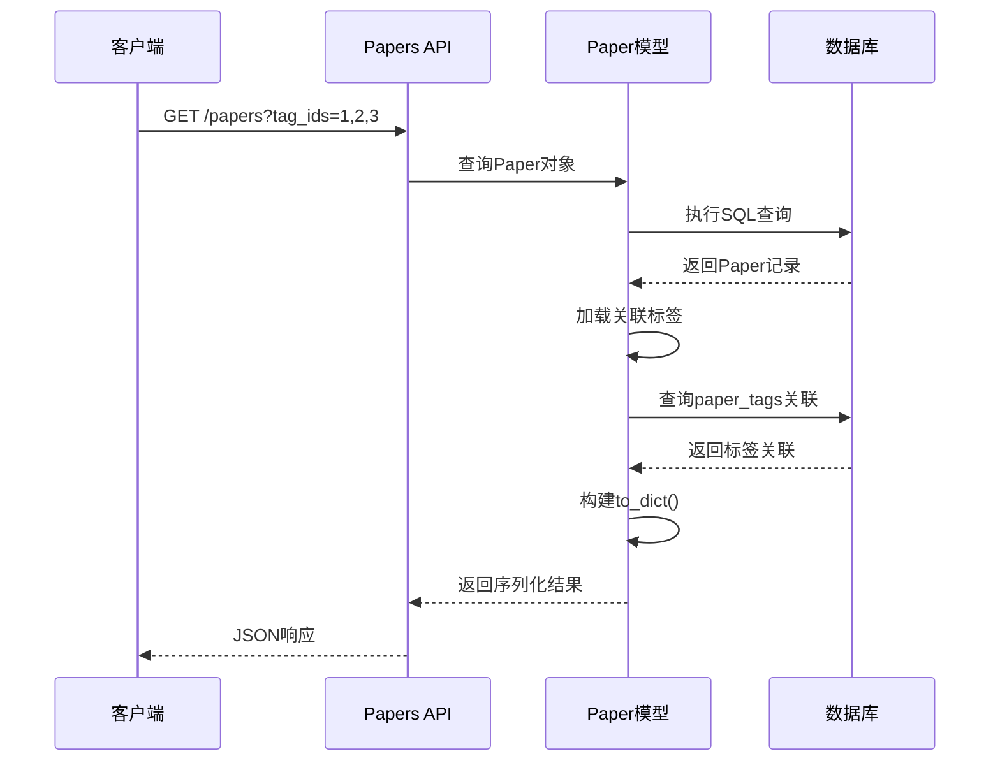
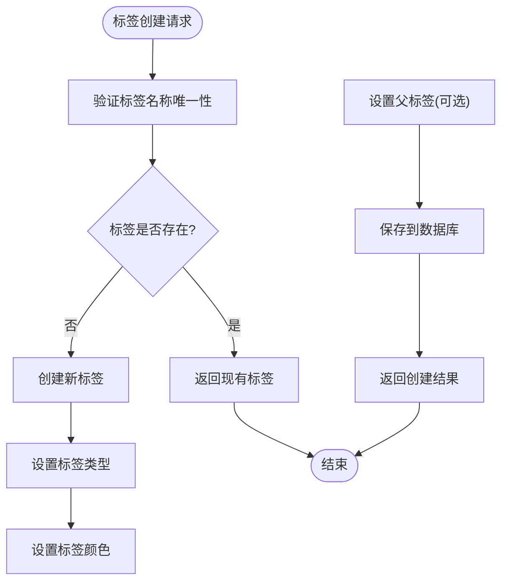
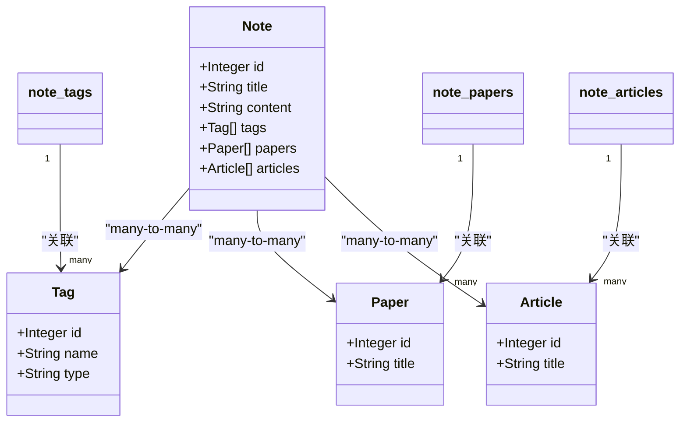
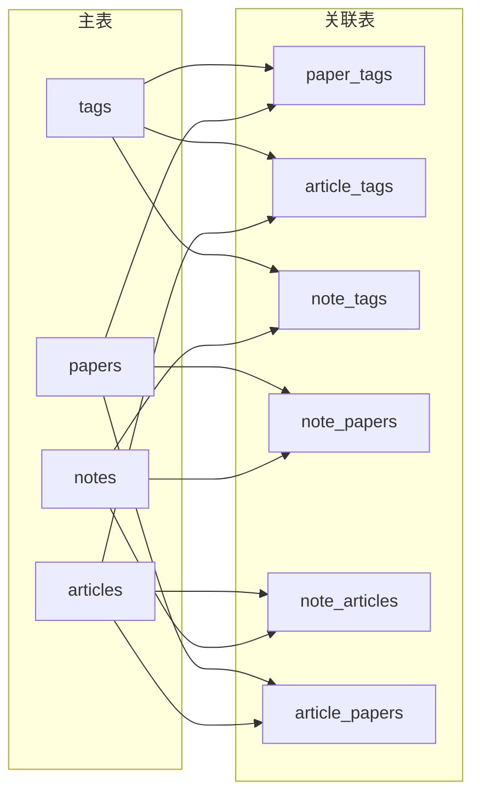
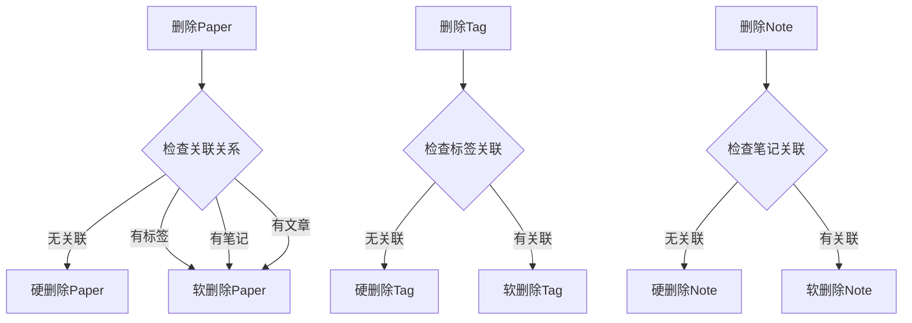
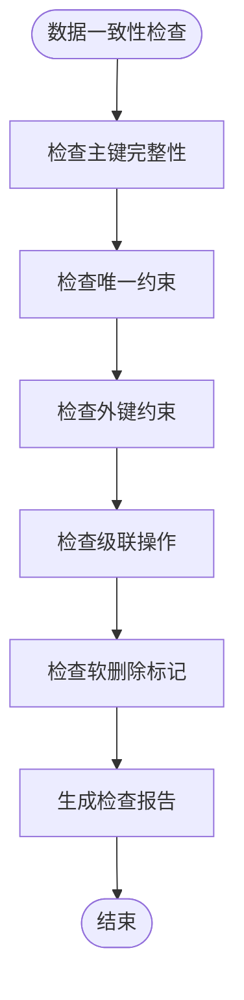

# 实体关系设计

<cite>
**本文档中引用的文件**
- [backend/models/paper.py](file://backend/models/paper.py)
- [specs/backend/models/paper.yml](file://specs/backend/models/paper.yml)
- [specs/backend/models/article.yml](file://specs/backend/models/article.yml)
- [specs/backend/models/note.yml](file://specs/backend/models/note.yml)
- [specs/backend/models/tag.yml](file://specs/backend/models/tag.yml)
- [specs/backend/models/relations_and_aux.yml](file://specs/backend/models/relations_and_aux.yml)
- [docs/SCHEMA.md](file://docs/SCHEMA.md)
- [backend/api/papers.py](file://backend/api/papers.py)
- [backend/api/notes.py](file://backend/api/notes.py)
- [backend/api/articles.py](file://backend/api/articles.py)
</cite>

## 目录
1. [简介](#简介)
2. [项目结构](#项目结构)
3. [核心实体](#核心实体)
4. [架构概览](#架构概览)
5. [详细组件分析](#详细组件分析)
6. [依赖关系分析](#依赖关系分析)
7. [性能考虑](#性能考虑)
8. [故障排除指南](#故障排除指南)
9. [结论](#结论)
10. [附录](#附录)

## 简介

PaperHub是一个学术论文和知识管理平台，采用Python Flask + SQLAlchemy构建。本文档详细说明Paper、Article、Note、Tag等核心实体之间的关系设计，重点解释多对多标签关联表paper_tags的设计思路和实现细节，文档化实体间的引用关系、级联操作和数据一致性保证。

## 项目结构

PaperHub项目采用分层架构设计，主要包含以下层次：

**图表来源**
- [backend/models/paper.py:1-360](file://backend/models/paper.py#L1-L360)
- [specs/backend/models/relations_and_aux.yml:1-263](file://specs/backend/models/relations_and_aux.yml#L1-L263)

**章节来源**
- [backend/models/paper.py:1-360](file://backend/models/paper.py#L1-L360)
- [specs/backend/models/relations_and_aux.yml:1-263](file://specs/backend/models/relations_and_aux.yml#L1-L263)

## 核心实体

### 实体关系总览

PaperHub系统包含四个核心实体，通过多对多关联表建立复杂的关系网络：

**图表来源**
- [backend/models/paper.py:18-87](file://backend/models/paper.py#L18-L87)
- [specs/backend/models/relations_and_aux.yml:4-158](file://specs/backend/models/relations_and_aux.yml#L4-L158)

### 实体属性详解

#### Paper实体
Paper实体代表学术论文，具有完整的论文元数据和状态管理功能：

| 属性名 | 类型 | 约束 | 描述 |
|--------|------|------|------|
| id | Integer | 主键 | 论文唯一标识符 |
| title | String | 非空 | 论文标题 |
| authors | Text | 可空 | 作者列表（JSON格式） |
| abstract | Text | 可空 | 摘要内容 |
| content | Text | 可空 | 全文内容 |
| url | String | 可空 | 原文链接 |
| source | String | 非空 | 来源类型（arxiv/pdf等） |
| doi | String | 可空 | DOI编号（唯一约束） |
| arxiv_id | String | 可空 | arXiv ID（唯一约束） |
| published_at | Date | 可空 | 发表日期 |
| category_l1 | String | 可空 | 一级分类 |
| category_l2 | String | 可空 | 二级分类 |
| file_path | String | 可空 | 本地PDF文件路径 |
| save_local | Boolean | 默认true | 是否保存本地文件 |
| status | String | 默认'pending' | 阅读状态 |
| starred | Boolean | 默认false | 是否标星 |
| extra | Text | 可空 | 扩展JSON字段 |
| created_at | DateTime | 默认当前时间 | 创建时间 |
| updated_at | DateTime | 默认当前时间 | 更新时间 |

**章节来源**
- [specs/backend/models/paper.yml:1-164](file://specs/backend/models/paper.yml#L1-L164)
- [backend/models/paper.py:120-186](file://backend/models/paper.py#L120-L186)

#### Article实体
Article实体管理网络文章（微信公众号、知乎、博客等），支持软删除机制：

| 属性名 | 类型 | 约束 | 描述 |
|--------|------|------|------|
| id | Integer | 主键 | 文章唯一标识符 |
| title | String | 非空 | 文章标题 |
| content | Text | 可空 | 正文内容 |
| author | String | 可空 | 作者/公众号名称 |
| source | String | 非空 | 来源类型（wechat/zhihu/web） |
| url | String | 可空 | 原文链接 |
| file_path | String | 可空 | 本地HTML文件路径 |
| published_at | Date | 可空 | 发布日期 |
| is_deleted | Boolean | 默认false | 软删除标记 |
| status | String | 默认'pending' | 阅读状态 |
| starred | Boolean | 默认false | 是否标星 |
| created_at | DateTime | 默认当前时间 | 创建时间 |
| updated_at | DateTime | 默认当前时间 | 更新时间 |

**章节来源**
- [specs/backend/models/article.yml:1-114](file://specs/backend/models/article.yml#L1-L114)
- [backend/models/paper.py:191-244](file://backend/models/paper.py#L191-L244)

#### Note实体
Note实体处理个人笔记和对话记录，支持多维度关联：

| 属性名 | 类型 | 约束 | 描述 |
|--------|------|------|------|
| id | Integer | 主键 | 笔记唯一标识符 |
| title | String | 可空 | 笔记标题 |
| content | Text | 非空 | Markdown正文内容 |
| source | String | 默认'manual' | 来源类型（manual/ChatGPT/Claude） |
| url | String | 可空 | 来源链接 |
| file_path | String | 可空 | 关联本地文件路径 |
| published_at | Date | 可空 | 发布日期 |
| is_deleted | Boolean | 默认false | 软删除标记 |
| status | String | 默认'pending' | 状态 |
| starred | Boolean | 默认false | 是否标星 |
| pinned | Boolean | 默认false | 是否置顶 |
| created_at | DateTime | 默认当前时间 | 创建时间 |
| updated_at | DateTime | 默认当前时间 | 更新时间 |

**章节来源**
- [specs/backend/models/note.yml:1-115](file://specs/backend/models/note.yml#L1-L115)
- [backend/models/paper.py:250-293](file://backend/models/paper.py#L250-L293)

#### Tag实体
Tag实体实现标签系统，支持层级结构和多种标签类型：

| 属性名 | 类型 | 约束 | 描述 |
|--------|------|------|------|
| id | Integer | 主键 | 标签唯一标识符 |
| name | String | 非空且唯一 | 标签名称 |
| type | String | 非空，默认'custom' | 标签类型（tech/conference/custom） |
| color | String | 可空 | 标签颜色（十六进制） |
| parent_id | Integer | 可空 | 父标签ID（自引用） |
| created_at | DateTime | 默认当前时间 | 创建时间 |

**章节来源**
- [specs/backend/models/tag.yml:1-68](file://specs/backend/models/tag.yml#L1-L68)
- [backend/models/paper.py:93-114](file://backend/models/paper.py#L93-L114)

## 架构概览

### 关系设计原则

PaperHub采用"实体-关联表"模式实现多对多关系，确保数据的灵活性和扩展性：

**图表来源**
- [backend/models/paper.py:93-293](file://backend/models/paper.py#L93-L293)

### 多对多关联表设计

每个关联关系都通过独立的中间表实现，提供精确的控制和审计能力：

| 关联表 | 实体A | 实体B | 设计特点 |
|--------|-------|-------|----------|
| paper_tags | Paper | Tag | 记录论文-标签关联时间 |
| note_tags | Note | Tag | 记录笔记-标签关联时间 |
| article_tags | Article | Tag | 记录文章-标签关联时间 |
| note_papers | Note | Paper | 记录笔记-论文关联时间 |
| note_articles | Note | Article | 记录笔记-文章关联时间 |
| article_papers | Article | Paper | 记录文章-论文关联时间 |

**章节来源**
- [specs/backend/models/relations_and_aux.yml:4-158](file://specs/backend/models/relations_and_aux.yml#L4-L158)
- [backend/models/paper.py:18-87](file://backend/models/paper.py#L18-L87)

## 详细组件分析

### Paper实体详细分析

Paper实体是系统的核心，承担着论文管理的主要职责：

**图表来源**
- [backend/api/papers.py:87-92](file://backend/api/papers.py#L87-L92)
- [backend/models/paper.py:148-186](file://backend/models/paper.py#L148-L186)

#### 关键特性

1. **多对多标签关联**：通过paper_tags表实现论文与标签的灵活关联
2. **多对多笔记关联**：支持论文与多个笔记的双向关联
3. **多对多文章关联**：连接论文与相关网络文章
4. **版本管理**：PaperVersion实体支持论文历史版本追踪

**章节来源**
- [backend/models/paper.py:120-186](file://backend/models/paper.py#L120-L186)
- [specs/backend/models/paper.yml:130-150](file://specs/backend/models/paper.yml#L130-L150)

### Tag实体深度解析

Tag实体实现了复杂的标签管理系统：

**图表来源**
- [backend/models/paper.py:93-114](file://backend/models/paper.py#L93-L114)
- [specs/backend/models/tag.yml:10-37](file://specs/backend/models/tag.yml#L10-L37)

#### 标签类型体系

| 类型 | 描述 | 示例 |
|------|------|------|
| tech | 技术标签 | Transformer, YOLO, RAG |
| conference | 会议标签 | CVPR2024, NeurIPS, arXiv |
| custom | 自定义标签 | 必读, 待复现, 落地可用 |

**章节来源**
- [specs/backend/models/tag.yml:17-37](file://specs/backend/models/tag.yml#L17-L37)
- [docs/SCHEMA.md:34-37](file://docs/SCHEMA.md#L34-L37)

### Note实体关联管理

Note实体作为桥梁连接Paper、Article和Tag三类实体：

**图表来源**
- [backend/models/paper.py:250-293](file://backend/models/paper.py#L250-L293)
- [specs/backend/models/note.yml:92-107](file://specs/backend/models/note.yml#L92-L107)

**章节来源**
- [backend/models/paper.py:250-293](file://backend/models/paper.py#L250-L293)
- [specs/backend/models/note.yml:92-107](file://specs/backend/models/note.yml#L92-L107)

## 依赖关系分析

### 数据库约束关系

**图表来源**
- [specs/backend/models/relations_and_aux.yml:4-158](file://specs/backend/models/relations_and_aux.yml#L4-L158)

### 外键约束设计

每个关联表都建立了严格的外键约束，确保数据完整性：

| 关联表 | 外键约束 | 约束目的 |
|--------|----------|----------|
| paper_tags | paper_id → papers.id tag_id → tags.id | 防止悬挂引用 |
| note_tags | note_id → notes.id tag_id → tags.id | 维护笔记标签一致性 |
| article_tags | article_id → articles.id tag_id → tags.id | 确保文章标签有效 |
| note_papers | note_id → notes.id paper_id → papers.id | 保持笔记论文关联 |
| note_articles | note_id → notes.id article_id → articles.id | 维护笔记文章关系 |
| article_papers | article_id → articles.id paper_id → papers.id | 确保文章论文关联 |

**章节来源**
- [specs/backend/models/relations_and_aux.yml:9-157](file://specs/backend/models/relations_and_aux.yml#L9-L157)

### 级联操作策略

系统采用"按需级联"策略，避免不必要的数据破坏：

**图表来源**
- [backend/models/paper.py:144](file://backend/models/paper.py#L144)
- [specs/backend/models/note.yml:51-57](file://specs/backend/models/note.yml#L51-L57)

## 性能考虑

### 索引策略

系统为关键查询字段建立了专门的索引：

| 表名 | 索引字段 | 查询场景 | 性能收益 |
|------|----------|----------|----------|
| papers | title | 标题搜索 | O(log n)查找 |
| papers | category_l1, category_l2 | 分类筛选 | 复合索引优化 |
| papers | status | 状态过滤 | 快速状态查询 |
| papers | starred | 标星排序 | 排序性能提升 |
| papers | published_at | 时间范围查询 | 日期范围优化 |
| papers | arxiv_id | 唯一标识查询 | O(1)查找 |
| tags | name | 标签名称查询 | 唯一索引加速 |
| tags | type | 标签类型过滤 | 类型查询优化 |
| tags | parent_id | 层级查询 | 父子关系快速定位 |

**章节来源**
- [specs/backend/models/paper.yml:151-164](file://specs/backend/models/paper.yml#L151-L164)
- [specs/backend/models/article.yml:107-114](file://specs/backend/models/article.yml#L107-L114)
- [specs/backend/models/note.yml:108-115](file://specs/backend/models/note.yml#L108-L115)
- [specs/backend/models/tag.yml:60-68](file://specs/backend/models/tag.yml#L60-L68)

### 查询优化建议

1. **批量查询**：使用`selectinload`减少N+1查询问题
2. **条件过滤**：优先使用索引字段进行WHERE条件筛选
3. **分页处理**：合理设置LIMIT和OFFSET参数
4. **关联预加载**：使用`joinedload`优化关联查询

## 故障排除指南

### 常见关系问题

#### 标签重复创建
**问题描述**：尝试创建同名标签导致冲突
**解决方案**：
- 使用`Tag.name.unique`约束防止重复
- 在创建前先查询是否存在相同名称的标签

#### 关联数据不一致
**问题描述**：删除Paper后相关笔记未同步更新
**解决方案**：
- 检查`note_papers`关联表是否正确维护
- 确保删除操作时清理相关关联记录

#### 查询性能问题
**问题描述**：大量标签查询导致响应缓慢
**解决方案**：
- 为常用查询字段添加索引
- 优化查询条件，避免全表扫描

**章节来源**
- [backend/api/papers.py:87-92](file://backend/api/papers.py#L87-L92)
- [backend/api/notes.py:77-84](file://backend/api/notes.py#L77-L84)

### 数据一致性检查

**图表来源**
- [specs/backend/models/relations_and_aux.yml:25-158](file://specs/backend/models/relations_and_aux.yml#L25-L158)

## 结论

PaperHub的实体关系设计体现了现代数据库设计的最佳实践：

1. **清晰的层次结构**：Paper、Article、Note、Tag四类核心实体职责明确
2. **灵活的多对多关系**：通过独立关联表实现高度灵活的数据组织
3. **完善的约束机制**：外键约束和唯一约束确保数据完整性
4. **高效的查询支持**：针对常见查询场景优化索引设计
5. **可靠的级联操作**：平衡数据一致性与操作灵活性

这种设计为PaperHub提供了强大的扩展性和维护性，能够支持复杂的学术论文管理和知识组织需求。

## 附录

### 关键设计决策说明

#### 为什么选择独立关联表
- **灵活性**：每种关联可以独立扩展额外字段
- **可维护性**：修改关联规则不影响主表结构
- **审计能力**：可以记录关联创建时间等元数据

#### 标签层级设计
- 支持父子标签关系，便于构建标签树
- 通过`parent_id`实现自引用，形成层次结构
- 适用于主题分类和细粒度标签管理

#### 软删除策略
- 通过`is_deleted`字段实现软删除，保护数据安全
- 支持数据恢复和审计追踪
- 减少硬删除带来的数据丢失风险