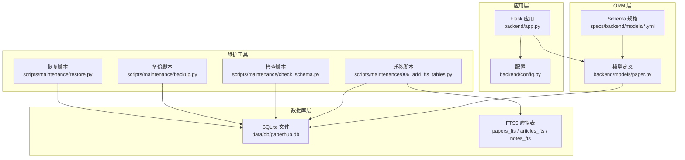
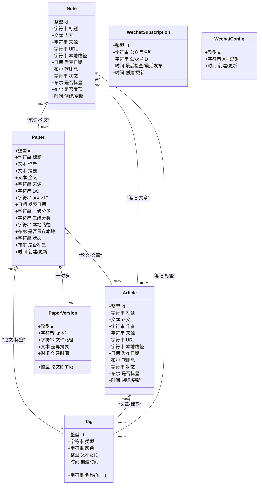
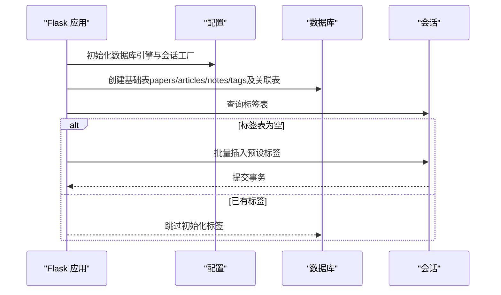
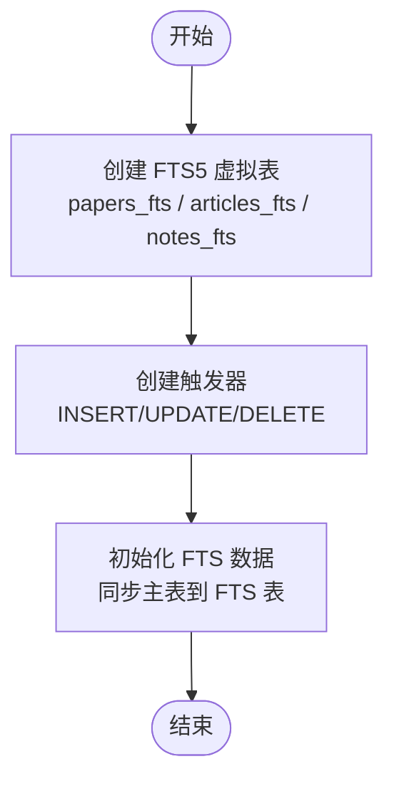
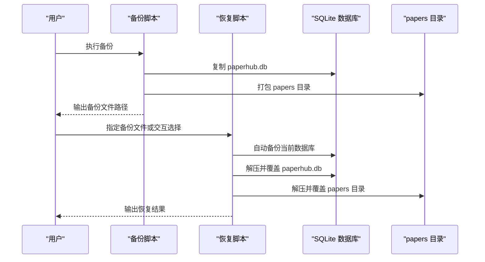
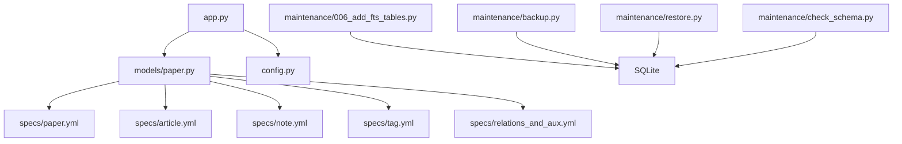

# 数据库设计

<cite>
**本文引用的文件**
- [backend/models/paper.py](file://backend/models/paper.py)
- [specs/backend/models/paper.yml](file://specs/backend/models/paper.yml)
- [specs/backend/models/article.yml](file://specs/backend/models/article.yml)
- [specs/backend/models/note.yml](file://specs/backend/models/note.yml)
- [specs/backend/models/tag.yml](file://specs/backend/models/tag.yml)
- [specs/backend/models/relations_and_aux.yml](file://specs/backend/models/relations_and_aux.yml)
- [scripts/maintenance/006_add_fts_tables.py](file://scripts/maintenance/006_add_fts_tables.py)
- [scripts/maintenance/check_schema.py](file://scripts/maintenance/check_schema.py)
- [backend/config.py](file://backend/config.py)
- [backend/app.py](file://backend/app.py)
- [docs/SCHEMA.md](file://docs/SCHEMA.md)
- [scripts/maintenance/backup.py](file://scripts/maintenance/backup.py)
- [scripts/maintenance/restore.py](file://scripts/maintenance/restore.py)
</cite>

## 目录
1. [简介](#简介)
2. [项目结构](#项目结构)
3. [核心组件](#核心组件)
4. [架构总览](#架构总览)
5. [详细组件分析](#详细组件分析)
6. [依赖关系分析](#依赖关系分析)
7. [性能考量](#性能考量)
8. [故障排查指南](#故障排查指南)
9. [结论](#结论)
10. [附录](#附录)

## 简介
本文件系统性梳理 PaperHub 的数据库设计，聚焦 SQLite 与 SQLAlchemy 的结合使用，涵盖核心实体（Paper、Article、Note、Tag）及其多对多关联表的 Schema 设计、索引策略、初始化与迁移流程，并深入解析 SQLite FTS5 全文检索的集成方案与性能优化建议。文档同时提供数据库备份与恢复流程说明，帮助读者在实际部署与维护中高效、安全地管理数据。

## 项目结构
PaperHub 的数据库层由以下关键部分组成：
- 模型定义：通过 SQLAlchemy ORM 映射核心实体与多对多关联表
- 规格文档：以 YAML 描述表结构、字段类型、索引与关系
- 初始化与迁移：应用启动时创建基础表与默认标签；迁移脚本扩展 FTS5 全文检索
- 维护脚本：检查表结构、备份与恢复数据库
- 配置：集中管理数据库 URI、连接池参数与目录结构



图表来源
- [backend/app.py:149-207](file://backend/app.py#L149-L207)
- [backend/config.py:39-132](file://backend/config.py#L39-L132)
- [backend/models/paper.py:18-87](file://backend/models/paper.py#L18-L87)
- [specs/backend/models/paper.yml:1-164](file://specs/backend/models/paper.yml#L1-L164)
- [specs/backend/models/article.yml:1-114](file://specs/backend/models/article.yml#L1-L114)
- [specs/backend/models/note.yml:1-115](file://specs/backend/models/note.yml#L1-L115)
- [specs/backend/models/tag.yml:1-68](file://specs/backend/models/tag.yml#L1-L68)
- [specs/backend/models/relations_and_aux.yml:1-263](file://specs/backend/models/relations_and_aux.yml#L1-L263)
- [scripts/maintenance/006_add_fts_tables.py:13-179](file://scripts/maintenance/006_add_fts_tables.py#L13-L179)
- [scripts/maintenance/check_schema.py:1-26](file://scripts/maintenance/check_schema.py#L1-L26)
- [scripts/maintenance/backup.py:47-121](file://scripts/maintenance/backup.py#L47-L121)
- [scripts/maintenance/restore.py:57-166](file://scripts/maintenance/restore.py#L57-L166)

章节来源
- [backend/app.py:149-207](file://backend/app.py#L149-L207)
- [backend/config.py:39-132](file://backend/config.py#L39-L132)
- [backend/models/paper.py:18-87](file://backend/models/paper.py#L18-L87)
- [specs/backend/models/paper.yml:1-164](file://specs/backend/models/paper.yml#L1-L164)
- [specs/backend/models/article.yml:1-114](file://specs/backend/models/article.yml#L1-L114)
- [specs/backend/models/note.yml:1-115](file://specs/backend/models/note.yml#L1-L115)
- [specs/backend/models/tag.yml:1-68](file://specs/backend/models/tag.yml#L1-L68)
- [specs/backend/models/relations_and_aux.yml:1-263](file://specs/backend/models/relations_and_aux.yml#L1-L263)
- [scripts/maintenance/006_add_fts_tables.py:13-179](file://scripts/maintenance/006_add_fts_tables.py#L13-L179)
- [scripts/maintenance/check_schema.py:1-26](file://scripts/maintenance/check_schema.py#L1-L26)
- [scripts/maintenance/backup.py:47-121](file://scripts/maintenance/backup.py#L47-L121)
- [scripts/maintenance/restore.py:57-166](file://scripts/maintenance/restore.py#L57-L166)

## 核心组件
本节聚焦核心实体与多对多关联表的 Schema 设计要点，包括字段类型、主外键约束与索引策略。

- 论文表（papers）
  - 主键：整型自增
  - 关键字段：标题、作者、摘要、全文、来源、DOI、arXiv ID、发表日期、分类（两级）、本地文件路径、状态、是否标星、创建/更新时间
  - 约束：DOI、arXiv ID 唯一，便于去重
  - 索引：标题、分类、状态、标星、发表日期、arXiv ID
  - 关系：与标签（多对多）、与笔记（多对多）、与文章（多对多）；版本历史（一对多）

- 文章表（articles）
  - 主键：整型自增
  - 关键字段：标题、正文、作者、来源、URL、本地文件路径、发布日期、软删除标记、状态、是否标星、创建/更新时间
  - 索引：标题、来源、软删除标记
  - 关系：与标签（多对多）、与论文（多对多）、与笔记（多对多）

- 笔记表（notes）
  - 主键：整型自增
  - 关键字段：标题、内容（Markdown）、来源、URL、本地文件路径、发布日期、软删除标记、状态、是否标星、是否置顶、创建/更新时间
  - 索引：标题、软删除标记、置顶
  - 关系：与标签（多对多）、与论文（多对多）、与文章（多对多）

- 标签表（tags）
  - 主键：整型自增
  - 关键字段：名称（唯一）、类型（tech/conference/custom）、颜色、父标签ID（自引用）、创建时间
  - 索引：名称（唯一）、类型、父标签
  - 关系：与论文/文章/笔记（多对多）

- 多对多关联表
  - 论文-标签：paper_tags（复合主键：paper_id, tag_id）
  - 文章-标签：article_tags（复合主键：article_id, tag_id）
  - 笔记-标签：note_tags（复合主键：note_id, tag_id）
  - 论文-文章：article_papers（复合主键：article_id, paper_id）
  - 笔记-论文：note_papers（复合主键：note_id, paper_id）
  - 笔记-文章：note_articles（复合主键：note_id, article_id）

章节来源
- [specs/backend/models/paper.yml:1-164](file://specs/backend/models/paper.yml#L1-L164)
- [specs/backend/models/article.yml:1-114](file://specs/backend/models/article.yml#L1-L114)
- [specs/backend/models/note.yml:1-115](file://specs/backend/models/note.yml#L1-L115)
- [specs/backend/models/tag.yml:1-68](file://specs/backend/models/tag.yml#L1-L68)
- [specs/backend/models/relations_and_aux.yml:1-263](file://specs/backend/models/relations_and_aux.yml#L1-L263)
- [backend/models/paper.py:18-87](file://backend/models/paper.py#L18-L87)

## 架构总览
PaperHub 的数据库架构围绕 SQLite 与 SQLAlchemy ORM 构建，采用“模型定义 + 规格文档 + 迁移脚本”的方式实现 Schema 管理与演进。应用启动时自动创建基础表与默认标签，随后可按需执行 FTS5 迁移脚本以启用全文检索能力。



图表来源
- [backend/models/paper.py:93-360](file://backend/models/paper.py#L93-L360)
- [specs/backend/models/paper.yml:1-164](file://specs/backend/models/paper.yml#L1-L164)
- [specs/backend/models/article.yml:1-114](file://specs/backend/models/article.yml#L1-L114)
- [specs/backend/models/note.yml:1-115](file://specs/backend/models/note.yml#L1-L115)
- [specs/backend/models/tag.yml:1-68](file://specs/backend/models/tag.yml#L1-L68)
- [specs/backend/models/relations_and_aux.yml:160-263](file://specs/backend/models/relations_and_aux.yml#L160-L263)

## 详细组件分析

### 表结构与索引策略
- papers 表
  - 字段与约束：见规格文档与模型定义
  - 索引：标题、分类、状态、标星、发表日期、arXiv ID
  - 用途：论文主数据、全文检索（FTS5）、版本管理

- articles 表
  - 字段与约束：见规格文档与模型定义
  - 索引：标题、来源、软删除
  - 用途：网络文章（微信公众号、知乎等）聚合与检索

- notes 表
  - 字段与约束：见规格文档与模型定义
  - 索引：标题、软删除、置顶
  - 用途：个人笔记与批注

- tags 表
  - 字段与约束：见规格文档与模型定义
  - 索引：名称（唯一）、类型、父标签
  - 用途：统一标签体系，支持层级与类型区分

- 关联表
  - paper_tags、article_tags、note_tags：复合主键确保唯一关联
  - article_papers、note_papers、note_articles：用于跨实体关联

章节来源
- [specs/backend/models/paper.yml:151-164](file://specs/backend/models/paper.yml#L151-L164)
- [specs/backend/models/article.yml:107-114](file://specs/backend/models/article.yml#L107-L114)
- [specs/backend/models/note.yml:108-115](file://specs/backend/models/note.yml#L108-L115)
- [specs/backend/models/tag.yml:60-68](file://specs/backend/models/tag.yml#L60-L68)
- [specs/backend/models/relations_and_aux.yml:4-158](file://specs/backend/models/relations_and_aux.yml#L4-L158)

### 多对多标签关联表设计
- 设计思路
  - 通过独立中间表实现三类实体（论文、文章、笔记）与标签的灵活多对多关系
  - 复合主键保证同一实体-标签组合不重复
  - 关联表包含创建时间字段，便于追踪标签绑定时间

- 实现细节
  - 论文-标签：paper_tags
  - 文章-标签：article_tags
  - 笔记-标签：note_tags
  - 关系映射：在模型中通过 secondary 参数建立双向关系

```mermaid
erDiagram
TAGS {
整型 id PK
字符串 名称 UK
字符串 类型
字符串 颜色
整型 父标签ID
时间 创建时间
}
PAPERS {
整型 id PK
文本 标题
文本 作者
文本 摘要
文本 全文
字符串 来源
字符串 DOI UK
字符串 arXiv_ID UK
日期 发表日期
字符串 一级分类
字符串 二级分类
字符串 本地路径
布尔 是否保存本地
字符串 状态
布尔 是否标星
时间 创建/更新
}
ARTICLES {
整型 id PK
文本 标题
文本 正文
字符串 作者
字符串 来源
字符串 URL
字符串 本地路径
日期 发布日期
布尔 软删除
字符串 状态
布尔 是否标星
时间 创建/更新
}
NOTES {
整型 id PK
文本 标题
文本 内容
字符串 来源
字符串 URL
字符串 本地路径
日期 发表日期
布尔 软删除
字符串 状态
布尔 是否标星
布尔 是否置顶
时间 创建/更新
}
PAPER_TAGS {
整型 论文ID FK
整型 标签ID FK
时间 创建时间
}
ARTICLE_TAGS {
整型 文章ID FK
整型 标签ID FK
时间 创建时间
}
NOTE_TAGS {
整型 笔记ID FK
整型 标签ID FK
时间 创建时间
}
TAGS ||--o{ PAPER_TAGS : "被关联"
PAPERS ||--o{ PAPER_TAGS : "关联"
TAGS ||--o{ ARTICLE_TAGS : "被关联"
ARTICLES ||--o{ ARTICLE_TAGS : "关联"
TAGS ||--o{ NOTE_TAGS : "被关联"
NOTES ||--o{ NOTE_TAGS : "关联"
```

图表来源
- [specs/backend/models/tag.yml:1-68](file://specs/backend/models/tag.yml#L1-L68)
- [specs/backend/models/paper.yml:1-164](file://specs/backend/models/paper.yml#L1-L164)
- [specs/backend/models/article.yml:1-114](file://specs/backend/models/article.yml#L1-L114)
- [specs/backend/models/note.yml:1-115](file://specs/backend/models/note.yml#L1-L115)
- [specs/backend/models/relations_and_aux.yml:4-81](file://specs/backend/models/relations_and_aux.yml#L4-L81)

### 数据库初始化流程
- 应用启动时的初始化步骤
  - 初始化全局数据库引擎与会话工厂（连接池、超时、回收策略）
  - 创建所有基础表（papers、articles、notes、tags 及其关联表）
  - 若标签表为空，则批量插入预设标签（技术、会议、自定义）

- 默认标签预设
  - 技术标签：如 Transformer、Diffusion、YOLO、RAG、LoRA、LLM、CNN、ViT
  - 会议标签：如 CVPR2024、ICCV2023、NeurIPS2024、ICML2024、arXiv
  - 自定义标签：如 必读、待复现、落地可用、冷门但有启发



图表来源
- [backend/app.py:149-207](file://backend/app.py#L149-L207)
- [backend/config.py:83-132](file://backend/config.py#L83-L132)

章节来源
- [backend/app.py:149-207](file://backend/app.py#L149-L207)
- [backend/config.py:83-132](file://backend/config.py#L83-L132)
- [docs/SCHEMA.md:156-182](file://docs/SCHEMA.md#L156-L182)

### 迁移策略与版本管理
- 迁移脚本
  - FTS5 全文检索迁移：创建 papers_fts、articles_fts、notes_fts 虚拟表，配置 unicode61 分词器
  - 为三类实体分别创建插入/更新/删除触发器，保持 FTS 表与主表同步
  - 初始化 FTS 数据：清空并同步现有主表数据至 FTS 表

- 迁移执行流程
  - 创建虚拟表与触发器
  - 清空并初始化 FTS 数据
  - 输出完成提示



图表来源
- [scripts/maintenance/006_add_fts_tables.py:13-179](file://scripts/maintenance/006_add_fts_tables.py#L13-L179)

章节来源
- [scripts/maintenance/006_add_fts_tables.py:13-179](file://scripts/maintenance/006_add_fts_tables.py#L13-L179)
- [docs/SCHEMA.md:139-154](file://docs/SCHEMA.md#L139-L154)

### 全文检索 FTS5 集成方案
- 虚拟表字段
  - 论文：title、abstract、authors、category（映射 category_l1）
  - 文章：title、content、author、source
  - 笔记：title、content、source

- 触发器机制
  - 插入：向 FTS 表插入对应字段
  - 更新：先删除旧记录，再插入新记录
  - 删除：删除对应 FTS 表记录

- 分词器
  - 使用 unicode61 分词器，适配多语言与 Unicode 字符

- 性能优化建议
  - 仅对高频检索字段建立 FTS 字段
  - 控制触发器数量，避免频繁写放大
  - 定期执行优化命令（如重建虚拟表）以维持检索性能

章节来源
- [scripts/maintenance/006_add_fts_tables.py:18-138](file://scripts/maintenance/006_add_fts_tables.py#L18-L138)
- [docs/SCHEMA.md:139-154](file://docs/SCHEMA.md#L139-L154)

### 备份与恢复流程
- 备份
  - 支持自动命名与自定义名称
  - 将数据库文件与 papers 目录打包为 zip
  - 输出备份文件大小与路径信息

- 恢复
  - 支持交互式选择备份或指定备份文件
  - 恢复前自动备份当前数据库
  - 解压并覆盖数据库与 papers 目录



图表来源
- [scripts/maintenance/backup.py:47-121](file://scripts/maintenance/backup.py#L47-L121)
- [scripts/maintenance/restore.py:57-166](file://scripts/maintenance/restore.py#L57-L166)

章节来源
- [scripts/maintenance/backup.py:47-121](file://scripts/maintenance/backup.py#L47-L121)
- [scripts/maintenance/restore.py:57-166](file://scripts/maintenance/restore.py#L57-L166)

## 依赖关系分析
- 模块耦合
  - 模型定义依赖 SQLAlchemy ORM 与关系映射
  - 规格文档为模型与迁移脚本提供契约
  - 应用层负责初始化与会话管理
  - 维护脚本独立于应用层，直接操作 SQLite

- 外部依赖
  - SQLite：作为单一文件数据库，适合桌面与轻量级部署
  - SQLAlchemy：提供 ORM、连接池与方言抽象
  - FTS5：SQLite 扩展，提供高性能全文检索



图表来源
- [backend/models/paper.py:18-87](file://backend/models/paper.py#L18-L87)
- [specs/backend/models/paper.yml:1-164](file://specs/backend/models/paper.yml#L1-L164)
- [specs/backend/models/article.yml:1-114](file://specs/backend/models/article.yml#L1-L114)
- [specs/backend/models/note.yml:1-115](file://specs/backend/models/note.yml#L1-L115)
- [specs/backend/models/tag.yml:1-68](file://specs/backend/models/tag.yml#L1-L68)
- [specs/backend/models/relations_and_aux.yml:1-263](file://specs/backend/models/relations_and_aux.yml#L1-L263)
- [backend/app.py:149-207](file://backend/app.py#L149-L207)
- [backend/config.py:83-132](file://backend/config.py#L83-L132)
- [scripts/maintenance/006_add_fts_tables.py:13-179](file://scripts/maintenance/006_add_fts_tables.py#L13-L179)
- [scripts/maintenance/backup.py:47-121](file://scripts/maintenance/backup.py#L47-L121)
- [scripts/maintenance/restore.py:57-166](file://scripts/maintenance/restore.py#L57-L166)
- [scripts/maintenance/check_schema.py:1-26](file://scripts/maintenance/check_schema.py#L1-L26)

章节来源
- [backend/models/paper.py:18-87](file://backend/models/paper.py#L18-L87)
- [specs/backend/models/paper.yml:1-164](file://specs/backend/models/paper.yml#L1-L164)
- [specs/backend/models/article.yml:1-114](file://specs/backend/models/article.yml#L1-L114)
- [specs/backend/models/note.yml:1-115](file://specs/backend/models/note.yml#L1-L115)
- [specs/backend/models/tag.yml:1-68](file://specs/backend/models/tag.yml#L1-L68)
- [specs/backend/models/relations_and_aux.yml:1-263](file://specs/backend/models/relations_and_aux.yml#L1-L263)
- [backend/app.py:149-207](file://backend/app.py#L149-L207)
- [backend/config.py:83-132](file://backend/config.py#L83-L132)
- [scripts/maintenance/006_add_fts_tables.py:13-179](file://scripts/maintenance/006_add_fts_tables.py#L13-L179)
- [scripts/maintenance/backup.py:47-121](file://scripts/maintenance/backup.py#L47-L121)
- [scripts/maintenance/restore.py:57-166](file://scripts/maintenance/restore.py#L57-L166)
- [scripts/maintenance/check_schema.py:1-26](file://scripts/maintenance/check_schema.py#L1-L26)

## 性能考量
- 索引策略
  - 为高频查询字段建立索引（如 papers 的标题、分类、状态、标星、发表日期、arXiv ID；articles 的标题、来源、软删除；notes 的标题、软删除、置顶；tags 的名称、类型、父标签）
  - 避免过度索引导致写入性能下降

- 连接池与并发
  - 使用 SQLAlchemy 连接池，合理设置 pool_size、max_overflow、pool_timeout、pool_recycle，减少锁竞争与连接泄漏风险

- FTS5 优化
  - 仅对必要字段建立 FTS 字段
  - 定期维护虚拟表（如重建），避免碎片化影响检索性能
  - 使用 unicode61 分词器提升多语言检索质量

- 存储策略
  - 将大型文本（摘要、全文、正文）与文件路径分离存储，避免主表膨胀
  - 对图片与附件采用外部文件系统存储，数据库仅保留路径

- 查询优化技巧
  - 使用 selectinload/eagerload 减少 N+1 查询
  - 对复杂过滤条件使用索引覆盖查询
  - 对全文检索优先使用 FTS5，避免 LIKE 模糊匹配

## 故障排查指南
- 表结构检查
  - 使用维护脚本列出数据库中所有表及其列，核对字段是否存在与类型是否正确

- FTS5 异常
  - 确认虚拟表与触发器已创建且未重复
  - 手动执行初始化 FTS 数据脚本，确保主表与 FTS 表数据一致

- 备份与恢复
  - 备份前确认数据库与 papers 目录存在
  - 恢复前自动备份当前数据库，防止误操作造成数据丢失

章节来源
- [scripts/maintenance/check_schema.py:1-26](file://scripts/maintenance/check_schema.py#L1-L26)
- [scripts/maintenance/006_add_fts_tables.py:144-179](file://scripts/maintenance/006_add_fts_tables.py#L144-L179)
- [scripts/maintenance/backup.py:47-121](file://scripts/maintenance/backup.py#L47-L121)
- [scripts/maintenance/restore.py:57-166](file://scripts/maintenance/restore.py#L57-L166)

## 结论
PaperHub 的数据库设计以 SQLite 为核心，结合 SQLAlchemy ORM 与规范化的 Schema 文档，实现了论文、文章、笔记与标签的统一管理。通过合理的索引策略、连接池配置与 FTS5 全文检索集成，系统在中小规模场景下具备良好的性能与可维护性。配合完善的备份与恢复流程，能够有效保障数据安全与业务连续性。

## 附录
- 数据库初始化与默认标签
  - 初始化流程：创建基础表 → 插入默认标签
  - 默认标签类别：技术、会议、自定义

- FTS5 虚拟表字段映射
  - 论文：title、abstract、authors、category（映射 category_l1）
  - 文章：title、content、author、source
  - 笔记：title、content、source

章节来源
- [backend/app.py:149-207](file://backend/app.py#L149-L207)
- [docs/SCHEMA.md:139-154](file://docs/SCHEMA.md#L139-L154)
- [docs/SCHEMA.md:156-182](file://docs/SCHEMA.md#L156-L182)